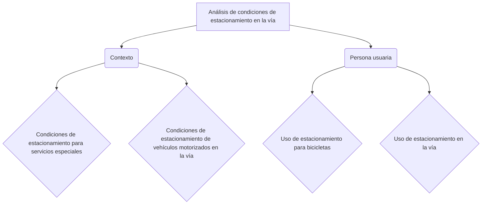

# DIARIO OFICIAL DE LA FEDERACIÓN

**Órgano del Gobierno Constitucional de los Estados Unidos Mexicanos**

No. de edición del mes: 15  Ciudad de México, viernes 12 de abril de 2024

## CONTENIDO

* Secretaría de Gobernación
* Secretaría de Marina
* Secretaría de Seguridad y Protección Ciudadana
* Secretaría de Hacienda y Crédito Público
* Secretaría de Medio Ambiente y Recursos Naturales
* Secretaría de Agricultura y Desarrollo Rural
* Secretaría de la Función Pública
* Secretaría de Salud
* Secretaría del Trabajo y Previsión Social
* Secretaría de Desarrollo Agrario, Territorial y Urbano
* Sistema Nacional para el Desarrollo Integral de la Familia
* Secretaría Ejecutiva del Sistema Nacional Anticorrupción
* Banco de México
* Instituto Nacional Electoral
* Avisos

Índice en página 400


## PODER EJECUTIVO
## SECRETARÍA DE GOBERNACIÓN

**EXTRACTO** de la solicitud de registro de la agrupación denominada Iglesia Ministerial Jesús de Nazaret, para constituirse en asociación religiosa.

Al margen un sello con el Escudo Nacional, que dice: Estados Unidos Mexicanos.- GOBERNACIÓN.- Secretaría de Gobernación.- Subsecretaría de Desarrollo Democrático, Participación Social y Asuntos Religiosos.- Unidad de Asuntos Religiosos, Prevención y la Reconstrucción del Tejido Social.- Dirección General de Asuntos Religiosos.- Dirección General Adjunta de Registro, Certificación y Normatividad de las Asociaciones Religiosas.

**EXTRACTO DE LA SOLICITUD DE REGISTRO CONSTITUTIVO COMO ASOCIACIÓN RELIGIOSA QUE PRESENTÓ LA C. LORENZA BETANZOS GÓMEZ, DE LA AGRUPACIÓN DENOMINADA "IGLESIA MINISTERIAL JESÚS DE NAZARET".**

En cumplimiento a lo dispuesto por el último párrafo del artículo 7° de la Ley de Asociaciones Religiosas y Culto Público; en relación con los diversos 8° y 10° de su Reglamento, se publica el correspondiente extracto de la solicitud de registro de la agrupación denominada "IGLESIA MINISTERIAL JESÚS DE NAZARET", para constituirse en asociación religiosa; solicitud presentada en la Dirección General de Asuntos Religiosos, para su trámite respectivo; cuyos datos principales son los que a continuación se señalan:

I.- **Domicilio:** Calle Primero de Junio, Manzana 1, Lote 19, Localidad de Villa Puerto Ceiba, Municipio De Paraíso, Estado de Tabasco, C.P. 86610.

II.- **Bienes inmuebles:** se relacionó para cumplir con su objeto un inmueble ubicado en Calle Primero de Junio, Manzana 1, Lote 19, Localidad de Villa Puerto Ceiba, Municipio De Paraíso, Estado de Tabasco, C.P. 86610, manifestado de manera unilateral bajo contrato de comodato.

III.- **Estatutos:** Presentó estatutos, los que contienen las bases fundamentales de su doctrina, la determinación de los asociados, ministros de culto y representantes, mismos que señalan como objeto, el siguiente: "Cultivar un cambio positivo en nuestras vidas a través de nuestra fe tomando como guía nuestro cuerpo de creencias y la práctica litúrgica".

IV.- Se exhiben las pruebas suficientes que acreditan que la agrupación religiosa cuenta con notorio arraigo entre la población.

V.- **Representante:** Lorenza Betanzos Gómez.

VI.- Exhiben la Relación de asociados, para dar cumplimiento a lo dispuesto por la fracción VI del artículo 8° del Reglamento de la Ley de Asociaciones Religiosas y Culto Público.

VII.- Exhiben el convenio propuesto a la Secretaría de Relaciones Exteriores, para dar cumplimiento a lo dispuesto en la fracción I del artículo 27 de la Constitución Política de los Estados Unidos Mexicanos.

VIII.- **Órgano de Dirección o Administración:** De conformidad con los estatutos exhibidos, se denomina "Mesa Directiva", integrada por las personas y cargos siguientes: Lorenza Betanzos Gómez, Presidenta; Leónides Madrigal Alayón, Secretaria; y Leticia López Pérez, Tesorera.

IX.- **Ministros de Culto:** Lorenza Betanzos Gómez, Leónides Madrigal Alayón y Manuela Hernández Morales.

X.- **Credo Religioso:** Cristiano Evangélico Pentecostés.

En cumplimiento a lo dispuesto por el primer párrafo del artículo 11 del Reglamento de la Ley de Asociaciones Religiosas y Culto Público, se notifica lo anterior, a efecto de que las personas físicas, asociaciones religiosas, agrupaciones religiosas o iglesias que pudieran considerarse afectadas en su esfera jurídica, comparezcan dentro del término de veinte días hábiles, contados a partir del día siguiente de esta publicación a presentar su oposición ante esta Dirección General. Asimismo, se comunica que el expediente de la solicitud de referencia, estará a la vista de los interesados para su consulta solamente durante el término señalado.

Expedido en la Ciudad de México, a los dos días del mes de abril de dos mil veinticuatro.- El Director General Adjunto de la Dirección General de Asuntos Religiosos de la Secretaría de Gobernación, Lic. Jorge Lee Galindo.- Rúbrica.


# EXTRACTO de la solicitud de registro de la agrupación denominada Alef Church

**Viernes 12 de abril de 2024**

**Al margen un sello con el Escudo Nacional, que dice:** Estados Unidos Mexicanos.- GOBERNACIÓN.- Secretaría de Gobernación.- Subsecretaría de Desarrollo Democrático, Participación Social y Asuntos Religiosos.- Unidad de Asuntos Religiosos, Prevención y la Reconstrucción del Tejido Social.- Dirección General de Asuntos Religiosos.- Dirección General Adjunta de Registro, Certificación y Normatividad de las Asociaciones Religiosas.

**EXTRACTO DE LA SOLICITUD DE REGISTRO CONSTITUTIVO COMO ASOCIACIÓN RELIGIOSA QUE PRESENTÓ EL C. JAIR MARTÍNEZ VILLARREAL Y FIRMANTE, DE LA AGRUPACIÓN DENOMINADA ALEF CHURCH.**

En cumplimiento a lo dispuesto por el último párrafo del artículo 7º de la Ley de Asociaciones Religiosas y Culto Público; en relación con los diversos 8º y 10° de su Reglamento, se publica el correspondiente extracto de la solicitud de registro de la agrupación denominada ALEF CHURCH, para constituirse en asociación religiosa; solicitud presentada en la Dirección General de Asuntos Religiosos, para su trámite respectivo; cuyos datos principales son los que a continuación se señalan:

**I.- Domicilio:** Calle Universo número 3600-A, Colonia Colinas del Aeropuerto, Municipio de Pesquería, Estado de Nuevo León, C.P. 66655.

**II.- Bienes inmuebles:** se relacionó para cumplir con su objeto un inmueble ubicado en Calle Universo número 3600-A, Colonia Colinas del Aeropuerto, Municipio de Pesquería, Estado de Nuevo León, C.P. 66655, manifestado de manera unilateral bajo contrato de arrendamiento.

**III.- Estatutos:** Presentó estatutos, los que contienen las bases fundamentales de su doctrina, la determinación de los asociados, ministros de culto y representantes, mismos que señalan como objeto, el siguiente: "Realizar sistemáticamente cultos devocionales, de predicación y de instrucción Bíblica."

**IV.-** Se exhiben las pruebas suficientes que acreditan que la agrupación religiosa cuenta con notorio arraigo entre la población.

**V.- Representante:** Jair Martínez Villarreal.

**VI.-** Exhiben la Relación de asociados, para dar cumplimiento a lo dispuesto por la fracción VI del artículo 8º del Reglamento de la Ley de Asociaciones Religiosas y Culto Público.

**VII.-** Exhiben el convenio propuesto a la Secretaría de Relaciones Exteriores, para dar cumplimiento a lo dispuesto en la fracción I del artículo 27 de la Constitución Política de los Estados Unidos Mexicanos.

**VIII.- Órgano de Dirección o Administración:** De conformidad con los estatutos exhibidos, se denomina "Mesa Directiva", integrada por las personas y cargos siguientes: Jair Martínez Villarreal, Presidente; y Elizabeth Egay Corona Morán, Secretaria y Tesorera.

**IX.- Ministros de Culto:** Jair Martínez Villarreal y Elizabeth Egay Corona Morán.

**X.- Credo Religioso:** Cristiano Evangélico Pentecostés.

En cumplimiento a lo dispuesto por el primer párrafo del artículo 11 del Reglamento de la Ley de Asociaciones Religiosas y Culto Público, se notifica lo anterior, a efecto de que las personas físicas, asociaciones religiosas, agrupaciones religiosas o iglesias que pudieran considerarse afectadas en su esfera jurídica, comparezcan dentro del término de veinte días hábiles, contados a partir del día siguiente de esta publicación a presentar su oposición ante esta Dirección General. Asimismo, se comunica que el expediente de la solicitud de referencia, estará a la vista de los interesados para su consulta solamente durante el término señalado.

**Expedido en la Ciudad de México, al primer día del mes de abril de dos mil veinticuatro.- El Director General Adjunto de la Dirección General de Asuntos Religiosos de la Secretaría de Gobernación, Lic. Jorge Lee Galindo.- Rúbrica.**


# EXTRACTO de la solicitud de registro de la agrupación denominada Ministerios Cristo Vive Apostólicos en Doctrina y Pentecostales en Gozo, para constituirse en asociación religiosa.

Al margen un sello con el Escudo Nacional, que dice: Estados Unidos Mexicanos.- GOBERNACIÓN.- Secretaría de Gobernación.- Subsecretaría de Desarrollo Democrático, Participación Social y Asuntos Religiosos.- Unidad de Asuntos Religiosos, Prevención y la Reconstrucción del Tejido Social.- Dirección General de Asuntos Religiosos.- Dirección General Adjunta de Registro, Certificación y Normatividad de las Asociaciones Religiosas.

## EXTRACTO DE LA SOLICITUD DE REGISTRO CONSTITUTIVO COMO ASOCIACIÓN RELIGIOSA QUE PRESENTÓ EL C. ELIÚ ESTRADA AYALA Y FIRMANTES DE LA AGRUPACIÓN DENOMINADA MINISTERIOS CRISTO VIVE APOSTÓLICOS EN DOCTRINA Y PENTECOSTALES EN GOZO.

En cumplimiento a lo dispuesto por el último párrafo del artículo 7º de la Ley de Asociaciones Religiosas y Culto Público; en relación con los diversos 8º y 10° de su Reglamento, se publica el correspondiente extracto de la solicitud de registro de la agrupación denominada MINISTERIOS CRISTO VIVE APOSTÓLICOS EN DOCTRINA Y PENTECOSTALES EN GOZO, para constituirse en asociación religiosa; solicitud presentada en la Dirección General de Asuntos Religiosos, para su trámite respectivo; cuyos datos principales son los que a continuación se señalan:

I.- **Domicilio:** Calle Vicente Guerrero número 53, Colonia Francisco Sarabia, Población de Ario de Rayón, Municipio de Zamora de Hidalgo, Estado de Michoacán, C.P. 59711.

II.- **Bienes inmuebles:** se relacionó para cumplir con su objeto un inmueble ubicado en Calle Vicente Guerrero número 53, Colonia Francisco Sarabia, Población de Ario de Rayón, Municipio de Zamora de Hidalgo, Estado de Michoacán, C.P. 59711, manifestado de manera unilateral bajo contrato de comodato.

III.- **Estatutos:** Presentó estatutos, los que contienen las bases fundamentales de su doctrina, la determinación de los asociados, ministros de culto y representantes, mismos que señalan como objeto, el siguiente: "Predicar el evangelio de JESUCRISTO a toda criatura".

IV.- Se exhiben las pruebas suficientes que acreditan que la agrupación religiosa cuenta con notorio arraigo entre la población.

V.- **Representantes:** Eliú Estrada Ayala y/o Héctor Samuel Muñoz Iturralde.

VI.- Exhiben la Relación de asociados, para dar cumplimiento a lo dispuesto por la fracción VI del artículo 8º del Reglamento de la Ley de Asociaciones Religiosas y Culto Público.

VII.- Exhiben el convenio propuesto a la Secretaría de Relaciones Exteriores, para dar cumplimiento a lo dispuesto en la fracción I del artículo 27 de la Constitución Política de los Estados Unidos Mexicanos.

VIII.- **Órgano de Dirección o Administración:** De conformidad con los estatutos exhibidos, se denomina "Comité Ejecutivo", integrado por las personas y cargos siguientes: Eliú Estrada Ayala, Presidente; Luis Ernesto Villa Color, Secretario; y Lucia del Socorro Cruz Rico, Tesorera.

IX.- **Ministros de Culto:** Eliú Estrada Ayala, Luis Ernesto Villa Color, Elías Estrada Ayala, Ricardo Estrada Barajas, José María Estrada Barajas, Modesto Ayala Botello y Jaime Medina Pérez.

X.- **Credo Religioso:** Cristiano Evangélico Pentecostés.

En cumplimiento a lo dispuesto por el primer párrafo del artículo 11 del Reglamento de la Ley de Asociaciones Religiosas y Culto Público, se notifica lo anterior, a efecto de que las personas físicas, asociaciones religiosas, agrupaciones religiosas o iglesias que pudieran considerarse afectadas en su esfera jurídica, comparezcan dentro del término de veinte días hábiles, contados a partir del día siguiente de esta publicación a presentar su oposición ante esta Dirección General. Asimismo, se comunica que el expediente de la solicitud de referencia, estará a la vista de los interesados para su consulta solamente durante el término señalado.

Expedido en la Ciudad de México, a los dos días del mes de abril de dos mil veinticuatro.- El Director General Adjunto de la Dirección General de Asuntos Religiosos de la Secretaría de Gobernación, Lic. Jorge Lee Galindo.- Rúbrica.


# EXTRACTO de la solicitud de registro de la agrupación denominada Ministerio Misionero de Salvación Internacional, para constituirse en asociación religiosa.

**Al margen un sello con el Escudo Nacional, que dice:** Estados Unidos Mexicanos.- GOBERNACIÓN.- Secretaría de Gobernación.- Subsecretaría de Desarrollo Democrático, Participación Social y Asuntos Religiosos.- Unidad de Asuntos Religiosos, Prevención y la Reconstrucción del Tejido Social.- Dirección General de Asuntos Religiosos.

**EXTRACTO DE LA SOLICITUD DE REGISTRO CONSTITUTIVO COMO ASOCIACIÓN RELIGIOSA QUE PRESENTÓ EL C. JUAN MANUEL MENA MARTÍNEZ Y FIRMANTES DE LA AGRUPACIÓN DENOMINADA MINISTERIO MISIONERO DE SALVACIÓN INTERNACIONAL.**

En cumplimiento a lo dispuesto por el último párrafo del artículo 7º de la Ley de Asociaciones Religiosas y Culto Público; 8° y 10 de su Reglamento, se publica el correspondiente extracto de la solicitud de registro de la agrupación denominada MINISTERIO MISIONERO DE SALVACIÓN INTERNACIONAL, para constituirse en asociación religiosa; solicitud presentada en la Dirección General de Asuntos Religiosos, para su trámite respectivo; cuyos datos principales son los que a continuación se señalan:

**I.- Domicilio:** Calle Sector Naval, Manzana 4, Lote 17, Colonia Ampliación Miguel Hidalgo, Municipio y Estado de Campeche, C.P. 24094.

**II.- Bienes inmuebles:** Se relacionó para cumplir con su objeto un inmueble, denominado Ministerio Misionero de Salvación Internacional, ubicado en Calle Sector Naval, Manzana 4, Lote 17, Colonia Ampliación Miguel Hidalgo, Municipio y Estado de Campeche, C.P. 24094, manifestado de manera unilateral como un inmueble susceptible de incorporarse al patrimonio.

**III.- Estatutos:** Presentó estatutos, los que contienen las bases fundamentales de su doctrina, la determinación de los asociados, ministros de culto y representantes, mismos que señalan como objeto, el siguiente: "Realizar sistemáticamente cultos devocionales, de predicación y de instrucción Bíblica".

**IV.-** Se exhiben las pruebas suficientes que acreditan que la agrupación religiosa cuenta con notorio arraigo entre la población.

**V.- Representantes:** Juan Manuel Mena Martínez, Leonardo Francisco Cazan Campos, Marina Hernández Gómez y/o José Antonio Arellano Barahona.

**VI.-** Exhiben Relación de asociados, para dar cumplimiento a lo dispuesto por la fracción VI del artículo 8° del Reglamento de la Ley de Asociaciones Religiosas y Culto Público.

**VII.-** Exhiben el convenio propuesto a la Secretaría de Relaciones Exteriores, para dar cumplimiento a lo dispuesto en la fracción I del artículo 27 de la Constitución Política de los Estados Unidos Mexicanos.

**VIII.- Órgano de Dirección o Administración:** De conformidad con los estatutos exhibidos, se denomina "Consejo Directivo", integrada por las personas y cargos siguientes: Juan Manuel Mena Martínez, Presidente; Leonardo Francisco Cazan Campos, Vicepresidente; Marina Hernández Gómez, Secretaria; y José Antonio Arellano Barahona, Tesorero.

**IX.- Ministros de culto:** Juan Manuel Mena Martínez, Leonardo Francisco Cazan Campos, Marina Hernández Gómez y José Antonio Arellano Barahona.

**X.- Credo religioso:** Cristiano Evangélico Cristocéntrico.

En cumplimiento a lo dispuesto por el primer párrafo del artículo 11 del Reglamento de la Ley de Asociaciones Religiosas y Culto Público, se notifica lo anterior, a efecto de que las personas físicas, asociaciones religiosas, agrupaciones religiosas o iglesias que pudieran considerarse afectadas en su esfera jurídica, comparezcan dentro del término de veinte días hábiles, contados a partir del día siguiente de esta publicación, a presentar su oposición ante esta Dirección General. Asimismo, se comunica que el expediente de la solicitud de referencia estará a la vista de los interesados para su consulta, solamente durante el término señalado.

**Expedido en la Ciudad de México, a los tres días del mes de abril de dos mil veinticuatro.- El Director General Adjunto de la Dirección General de Asuntos Religiosos, de la Secretaría de Gobernación, Lic. Jorge Lee Galindo.- Rúbrica.**


# SECRETARÍA DE MARINA

**AVISO** por el que se dan a conocer las bases de regulación tarifaria para el cobro por el uso de infraestructura portuaria, aplicables en el recinto portuario de Cabo San Lucas, B.C.S.

Al margen un sello con el Escudo Nacional, que dice: Estados Unidos Mexicanos.- MARINA.- Secretaría de Marina.

**JUAN FRANCISCO RÍOS GÓMEZ**, Capitán de Navío, Director General de Puertos, con fundamento en los artículos 30, fracciones XIV Bis, XIV Quáter y XXVII, de la Ley Orgánica de la Administración Pública Federal; 10, 40, fracción III, 16, fracciones II y XIV, 40, fracción X, 59, 60 y 61, de la Ley de Puertos; 1, 3 y 137, del Reglamento de la Ley de Puertos; la Regulación Tarifaria, publicada en el Diario Oficial de la Federación el 22 de diciembre de 1999; y en ejercicio de las facultades que me confieren los artículos 1, 3, fracción II, inciso j, numeral 6 y 33, fracciones X y XVII, del Reglamento Interior de la Secretaría de Marina, y

**CONSIDERANDO**

Que la Secretaría de Marina, como Autoridad en materia de Puertos, tiene a su cargo las atribuciones conferidas por las Leyes Orgánica de la Administración Pública Federal, la de Navegación y Comercio Marítimos, la de Puertos, así como los tratados internacionales de los que el Estado Mexicano sea parte, para el control de los puertos, terminales, marinas e instalaciones portuarias, su construcción, uso, aprovechamiento, explotación, operación y formas de administración, así como para la prestación de los servicios portuarios;

Que la Secretaría de Marina, por conducto de la Dirección General de Puertos, tiene dentro de sus atribuciones, el establecer las bases de regulación tarifaria y de precios para el uso de determinados bienes en puertos, terminales, marinas y para la prestación de los servicios cuando no existan opciones portuarias o de otros modos de transporte que propicien un ambiente de competencia razonable;

Que fue recibida una solicitud en la Ventanilla de Gestión de Trámites de la Unidad de Capitanías de Puerto y Asuntos Marítimos, para el ajuste de actualización de las tarifas por el uso de infraestructura portuaria, aplicables en el recinto portuario de Cabo San Lucas, B.C.S., mismas que fueron autorizadas por la Dirección General de Puertos, y

Que de conformidad con el artículo 137 del Reglamento de la Ley de Puertos, las bases de regulación tarifaria entrarán en vigor a partir de los veinte días hábiles siguientes a su publicación en el Diario Oficial de la Federación, por lo que he tenido a bien emitir el siguiente:

**"AVISO POR EL QUE SE DAN A CONOCER LAS BASES DE REGULACIÓN TARIFARIA PARA EL COBRO POR EL USO DE INFRAESTRUCTURA PORTUARIA, APLICABLES EN EL RECINTO PORTUARIO DE CABO SAN LUCAS, B.C.S."**

**ÚNICO.**- Se hace del conocimiento del público en general, que fueron actualizadas las bases de regulación tarifaria para el cobro por el uso de infraestructura portuaria, aplicables en el recinto portuario de Cabo San Lucas, B.C.S., mismas que pueden ser consultadas en la página electrónica siguiente:

| Prestador del servicio                                          | Puerto             |
|-----------------------------------------------------------------|--------------------|
| Administración del Sistema Portuario Nacional Cabo San Lucas, S.A. de C.V. | Cabo San Lucas, B.C.S. |
| www.dof.gob.mx/2024/SEMAR/DGP.-1081_2024.pdf                     |                    |


**TRANSITORIOS**

**PRIMERO.**- El presente aviso entrará en vigor el día de su publicación en el Diario Oficial de la Federación.

**SEGUNDO.**- Las bases de regulación tarifaria a que se refiere el presente aviso, entrarán en vigor a partir de los veinte días hábiles siguientes a su publicación en el Diario Oficial de la Federación.

Atentamente

Ciudad de México, a 22 de marzo de 2024.- El Director General de Puertos, Capitán de Navío **Juan Francisco Ríos Gómez**.- Rúbrica.


## SECRETARÍA DE SEGURIDAD Y PROTECCIÓN CIUDADANA

**CONVENIO** de Coordinación que, en el marco del Sistema Nacional de Seguridad Pública, celebran el Secretariado Ejecutivo del Sistema Nacional de Seguridad Pública y el Estado de Querétaro, relativo al Fondo de Aportaciones para la Seguridad Pública de los Estados y del Distrito Federal (FASP) 2024.

**Al margen un sello con el Escudo Nacional**, que dice: Estados Unidos Mexicanos.- SEGURIDAD.- Secretaría de Seguridad y Protección Ciudadana.- Secretariado Ejecutivo del Sistema Nacional de Seguridad Pública.

**CONVENIO DE COORDINACIÓN** QUE EN EL MARCO DEL SISTEMA NACIONAL DE SEGURIDAD PÚBLICA, CELEBRAN POR UNA PARTE EL PODER EJECUTIVO FEDERAL, POR CONDUCTO DEL SECRETARIADO EJECUTIVO DEL SISTEMA NACIONAL DE SEGURIDAD PÚBLICA, EN LO SUCESIVO "EL SECRETARIADO", REPRESENTADO POR EL C. FERNANDO BEDEL TISCAREÑO LUJÁN, SECRETARIO EJECUTIVO ADJUNTO Y ENCARGADO DEL DESPACHO DEL SECRETARIADO EJECUTIVO DEL SISTEMA NACIONAL DE SEGURIDAD PÚBLICA, Y POR LA OTRA, EL PODER EJECUTIVO DEL ESTADO DE QUERÉTARO EN LO SUCESIVO "LA ENTIDAD FEDERATIVA", REPRESENTADA POR SU GOBERNADOR, EL C. MAURICIO KURI GONZÁLEZ, ASISTIDO POR EL SECRETARIO DE GOBIERNO DEL PODER EJECUTIVO DEL ESTADO, EL C. CARLOS ALBERTO ALCARAZ GUTIÉRREZ; EL SECRETARIO DE FINANZAS DEL PODER EJECUTIVO DEL ESTADO, EL C. GUSTAVO ARTURO LEAL MAYA; EL SECRETARIO DE SEGURIDAD CIUDADANA DEL PODER EJECUTIVO DEL ESTADO Y SECRETARIO EJECUTIVO DEL CONSEJO ESTATAL DE SEGURIDAD, EL C. IOVÁN ELÍAS PÉREZ HERNÁNDEZ; EL COMISIONADO ESTATAL DEL SISTEMA PENITENCIARIO DEL ESTADO, EL C. GUSTAVO LÓPEZ ACOSTA; LA DIRECTORA GENERAL DEL CENTRO DE EVALUACIÓN Y CONTROL DE CONFIANZA DEL ESTADO, LA C. ANA MA. ESTELA FERNÁNDEZ VILLAGÓMEZ; LA DIRECTORA GENERAL DEL CENTRO DE PREVENCIÓN SOCIAL DEL DELITO Y LA VIOLENCIA EN EL ESTADO, LA C. SONIA ANGÉLICA COLÍN ABOYTES; EL DIRECTOR GENERAL DEL CENTRO DE INFORMACIÓN Y ANÁLISIS PARA LA SEGURIDAD, EL C. ALFREDO TREJO DIEZ MARTÍNEZ Y CON LA PARTICIPACIÓN DEL ORGANISMO CONSTITUCIONAL AUTÓNOMO DENOMINADO FISCALÍA GENERAL DEL ESTADO, REPRESENTADO POR SU TITULAR EL C. ALEJANDRO ECHEVERRÍA CORNEJO; A QUIENES CONJUNTAMENTE SE LES DENOMINARÁ "LAS PARTES" DE CONFORMIDAD CON LAS DECLARACIONES Y CLÁUSULAS SIGUIENTES:

**I. DECLARACIONES**

**1.1 DECLARA "EL SECRETARIADO", A TRAVÉS DE SU REPRESENTANTE QUE:**

Es un Órgano Administrativo Desconcentrado de la Secretaría de Seguridad y Protección Ciudadana, operativo del Sistema Nacional de Seguridad Pública, con autonomía técnica de gestión y presupuestal, de conformidad con los artículos 17 de la Ley General del Sistema Nacional de Seguridad Pública, en lo subsecuente "Ley General"; 3, inciso C, fracción VII, 45 y 65 del Reglamento Interior de la Secretaría de Seguridad y Protección Ciudadana; y 1 del Reglamento del Secretariado Ejecutivo del Sistema Nacional de Seguridad Pública, concatenado con los artículos Octavo, Décimo Tercero y Décimo Cuarto transitorios del Decreto por el que se reforman, adicionan y derogan diversas disposiciones de la Ley Orgánica de la Administración Pública Federal, publicado en el Diario Oficial de la Federación el 30 de noviembre de 2018.

**1.2** De conformidad con los artículos 5, 6 fracción II, 8 fracción XIII y 9 del Reglamento del Secretariado Ejecutivo del Sistema Nacional de Seguridad Pública, la entonces Titular del Secretariado Ejecutivo del Sistema Nacional de Seguridad Pública, con fecha 16 de junio de 2023, designó al C. Fernando Bedel Tiscareño Luján, como Secretario Ejecutivo Adjunto del Secretariado Ejecutivo del Sistema Nacional de Seguridad Pública.

**1.3** Así mismo, a través del oficio SSPC/00546/2023, de fecha 10 de noviembre de 2023, la C. Rosa Icela Rodríguez Velázquez, Secretaria de Seguridad y Protección Ciudadana, lo designó como Encargado del Despacho del Secretariado Ejecutivo del Sistema Nacional Seguridad Pública.

**1.4** Se encuentra facultado para suscribir el presente "CONVENIO", en términos de lo dispuesto en el artículo 9 fracciones V y XVII, del Reglamento del Secretariado Ejecutivo del Sistema Nacional de Seguridad Pública.

Para todos los efectos legales, señala como domicilio el ubicado en Avenida de las Torres número 855, Colonia Belén de las Flores, Alcaldía Álvaro Obregón, Ciudad de México, Código Postal 01110.

**II. DECLARA "LA ENTIDAD FEDERATIVA", A TRAVÉS DE SU REPRESENTANTE QUE:**

**II.1** Es una entidad, en todo lo concerniente a su régimen interior, que forma parte integrante de la Federación denominada Estados Unidos Mexicanos, y tiene la calidad de persona moral oficial, facultada para ejercer todos los derechos que sean necesarios para realizar el objeto de su


## DIARIO OFICIAL - Viernes 12 de abril de 2024

**II.2** El C. Mauricio Kuri González, asumió el cargo de Gobernador del Estado, a partir del 01 de octubre de 2021; por lo que cuenta con facultades para celebrar el presente "CONVENIO”, en términos de los artículos 39, Apartado B, fracciones I y II y 142 de la "Ley General"; 20 y 22, fracción IX de la Constitución Política del Estado Libre y Soberano de Querétaro; 2, 3, 5 y 6 de la Ley Orgánica del Poder Ejecutivo del Estado de Querétaro; 1, 4 fracción I y 13, fracción I, de la Ley de Seguridad para el Estado de Querétaro; y demás normativa aplicable.

**II.3** El C. Carlos Alberto Alcaraz Gutiérrez, Secretario de Gobierno del Poder Ejecutivo del Estado, acredita su personalidad con el nombramiento expedido el 03 de diciembre de 2023, quien cuenta con facultades para celebrar el presente "CONVENIO" y asiste en la firma del instrumento jurídico, de conformidad con lo dispuesto en los artículos 19, fracción I y 21 de la Ley Orgánica del Poder Ejecutivo del Estado de Querétaro; y demás normativa aplicable.

**II.4** El C. Gustavo Arturo Leal Maya, Secretario de Finanzas del Poder Ejecutivo del Estado, acredita su personalidad con el nombramiento expedido el 01 de octubre de 2021, quien cuenta con facultades para celebrar el presente "CONVENIO" y asiste en la firma del instrumento jurídico, de conformidad con lo dispuesto en los artículos 19, fracción II y 22, fracción XXVI de la Ley Orgánica del Poder Ejecutivo del Estado de Querétaro y 5 del Reglamento Interior de la Secretaría de Finanzas del Poder Ejecutivo del Estado de Querétaro; y demás normativa aplicable.

**II.5** El C. lován Elías Pérez Hernández, Secretario de Seguridad Ciudadana del Poder Ejecutivo del Estado y Secretario Ejecutivo del Consejo Estatal de Seguridad, acredita su personalidad con el nombramiento expedido el 03 de abril de 2022, quien cuenta con facultades para celebrar el presente "CONVENIO" y asiste en la firma del instrumento jurídico, de conformidad con lo dispuesto en los artículos 19, fracción XIII y 33, fracción XVI de la Ley Orgánica del Poder Ejecutivo del Estado de Querétaro; 17, fracción II y 79 de la Ley de Seguridad para el Estado de Querétaro; 12, fracciones I, XI y XII de la Ley de la Secretaría de Seguridad Ciudadana del Estado de Querétaro; y demás normativa aplicable.

**II.6** El C. Gustavo López Acosta, Comisionado Estatal del Sistema Penitenciario del Estado, acredita su personalidad con el nombramiento expedido el 01 de octubre de 2021, quien cuenta con facultades para celebrar el presente "CONVENIO" y asiste en la firma del instrumento jurídico, de conformidad con lo dispuesto en los artículos 1, 3, 15 fracciones I, II y IV de la Ley que crea la Comisión Estatal del Sistema Penitenciario de Querétaro; y demás normativa aplicable.

**II.7** La C. Ana Ma. Estela Fernández Villagómez, Directora General del Centro de Evaluación y Control de Confianza del Estado, acredita su personalidad con el nombramiento expedido el 03 de julio de 2018, quien cuenta con facultades para celebrar el presente "CONVENIO" y asiste en la firma del instrumento jurídico, de conformidad con lo dispuesto en los artículos 16 fracciones I, III y XXXIX de la Ley que crea el Centro de Evaluación y Control de Confianza del Estado de Querétaro, en relación con el 23, fracción I de la Ley de la Administración Pública Paraestatal del Estado de Querétaro; y demás normativa aplicable.

**II.8** La C. Sonia Angélica Colín Aboytes, Directora General del Centro de Prevención Social del Delito y la Violencia en el Estado, acredita su personalidad con el nombramiento expedido el 11 de julio de 2022, quien cuenta con facultades para celebrar el presente "CONVENIO" y asiste en la firma del instrumento jurídico, de conformidad con lo dispuesto en los artículos 25, de la Ley de Seguridad para el Estado de Querétaro, 23 fracción I, 55 fracciones I y XIII de la Ley de la Administración Pública Paraestatal del Estado de Querétaro, 18 y 20, fracción XII de la Ley del Centro de Prevención Social del Delito y la Violencia en el Estado de Querétaro; y demás normativa aplicable.

**II.9** El C. Alfredo Trejo Diez Martínez, Director General del Centro de Información y Análisis para la Seguridad, acredita su personalidad con el nombramiento expedido el 02 de enero de 2023, quien cuenta con facultades para celebrar el presente "CONVENIO" y asiste en la firma del instrumento jurídico, de conformidad con lo dispuesto en los artículos 18, 21, 23 fracción I y 55 fracción I, de la Ley de la Administración Pública Paraestatal del Estado de Querétaro y 16, fracciones I, III y XXVIII de la Ley que crea el Centro de Información y Análisis para la Seguridad de Querétaro; y demás normativa aplicable.


# DIARIO OFICIAL

**Viernes 12 de abril de 2024**

**II.10** El C. Alejandro Echeverría Cornejo, Fiscal General del Estado, acredita su personalidad con el nombramiento expedido el 25 de mayo de 2016, quien cuenta con facultades para celebrar el presente "CONVENIO" y participa en la firma del instrumento jurídico, en representación del Organismo Constitucional Autónomo, de conformidad con lo dispuesto en los artículos 30 bis de la Constitución Política del Estado Libre y Soberano de Querétaro y 13, fracciones III y XIII de la Ley Orgánica de la Fiscalía General del Estado de Querétaro; y demás normativa aplicable.

**II.11** Cuenta con la disponibilidad presupuestaria para hacer frente a los compromisos materia del presente "CONVENIO" y su Anexo Técnico.

**II.12** Para todos los efectos legales relacionados con el presente "CONVENIO", señala como su domicilio el ubicado en Calle 5 de Mayo, esquina con Luis Pasteur, sin número, Centro Histórico, Código Postal 76000, en la Ciudad de Santiago de Querétaro, Querétaro.

**III. DECLARAN "LAS PARTES", A TRAVÉS DE SUS REPRESENTANTES QUE:**

**III.1** Se reconocen mutuamente la personalidad que ostentan.

**III.2** Celebran el presente "CONVENIO" de acuerdo con el marco jurídico aplicable, al tenor de las siguientes:

## CLÁUSULAS

**PRIMERA. OBJETO.**

El presente "CONVENIO" tiene por objeto coordinar acciones entre "LAS PARTES" para que a través de los recursos del Fondo de Aportaciones para la Seguridad Pública de los Estados y del Distrito Federal (FASP) previsto en el Presupuesto de Egresos de la Federación para el Ejercicio Fiscal 2024 y los que aporte "LA ENTIDAD FEDERATIVA", la misma esté en condiciones de atender las políticas, estrategias y prioridades orientadas al cumplimiento de los Ejes Estratégicos, los Programas y Subprogramas con Prioridad Nacional vigentes y demás acuerdos aprobados por el Consejo Nacional de Seguridad Pública, con base en lo preceptuado por el párrafo décimo del artículo 21 de la Constitución Política de los Estados Unidos Mexicanos y los artículos 44 y 45 de la Ley de Coordinación Fiscal y demás normativa aplicable.

**SEGUNDA. MONTOS Y DESTINOS DE GASTO DEL "FASP".**

De conformidad con el Presupuesto de Egresos de la Federación para el Ejercicio Fiscal 2024 y los Criterios de Distribución del Fondo de Aportaciones para la Seguridad Pública de los Estados y del Distrito Federal (FASP) para el ejercicio fiscal 2024 y los resultados de su aplicación, publicados en el Diario Oficial de la Federación el 22 de diciembre de 2023, "LA ENTIDAD FEDERATIVA" recibirá la cantidad de $238,002,266.00 (doscientos treinta y ocho millones dos mil doscientos sesenta y seis pesos 00/100 M.N.) de los recursos del "FASP".

A efecto de complementar los recursos necesarios para la realización del objeto del presente "CONVENIO", "LA ENTIDAD FEDERATIVA" se obliga a aportar de sus recursos presupuestarios la cantidad de $59,500,566.50 (cincuenta y nueve millones quinientos mil quinientos sesenta y seis pesos 50/100 M.N.), que representa el 25% (veinticinco) por ciento del total de los recursos federales otorgados.

El Financiamiento Conjunto pactado en el presente "CONVENIO", integrado por las aportaciones federal y estatal, suman en conjunto la cantidad de $297,502,832.50 (doscientos noventa y siete millones quinientos dos mil ochocientos treinta y dos pesos 50/100 M.N.).

Las acciones prioritarias, metas y conceptos convenidos de los Programas con Prioridad Nacional y Subprogramas, se establecerán en un Anexo Técnico, el cual una vez firmado por las y los Titulares de las Unidades Administrativas competentes de "EL SECRETARIADO" y de "LA ENTIDAD FEDERATIVA", formará parte integrante del presente "CONVENIO".

En cumplimiento a lo dispuesto en los artículos 7, fracción II y 8 de la "Ley General" y 45 de la Ley de Coordinación Fiscal, "LA ENTIDAD FEDERATIVA" destinará recursos del Financiamiento Conjunto, para realizar acciones específicas en materia de seguimiento y evaluación respecto de las acciones, metas, conceptos y recursos asociados de los Programas con Prioridad Nacional, instrumentados en el marco de este "CONVENIO", en los términos establecidos en el Anexo Técnico y observando los Lineamientos Generales de Evaluación que emita "EL SECRETARIADO".

"LA ENTIDAD FEDERATIVA" deberá ejercer los recursos del "FASP" observando los criterios de eficiencia, eficacia, economía, transparencia y honradez que aseguren las mejores condiciones disponibles en cuanto a precio, calidad, financiamiento, oportunidad y demás circunstancias pertinentes, previstos en el


## DIARIO OFICIAL

**Viernes 12 de abril de 2024**

**Artículo 134 de la Constitución Política de los Estados Unidos Mexicanos:** Las disposiciones para el ejercicio, control, vigilancia, información, evaluación y fiscalización previstas en la "Ley General"; los fines y objetivos previstos en los artículos 45 y 49 de la Ley de Coordinación Fiscal; el principio de anualidad previsto en el artículo 6 del Presupuesto de Egresos de la Federación para el Ejercicio Fiscal 2024; los criterios generales que rigen la contabilidad gubernamental y la emisión de información financiera de los Entes Públicos previstos en la Ley General de Contabilidad Gubernamental; los criterios generales de responsabilidad hacendaria y financiera que rigen a las Entidades Federativas, así como a sus respectivos Entes Públicos, previstos en la Ley de Disciplina Financiera de las Entidades Federativas y los Municipios; los principios para la programación, presupuestación, ejercicio, control y evaluación aplicables a los recursos federales, previstos en la Ley Federal de Presupuesto y Responsabilidad Hacendaria y su Reglamento; las disposiciones en materia de contratación y adquisición de bienes, servicios e infraestructura, así como para la administración y ejercicio, previstas en las leyes locales en lo que no se contrapongan a la legislación federal; los Acuerdos del Consejo Nacional de Seguridad Pública y demás disposiciones aplicables a los recursos del "FASP".

**Con el objeto de llevar a cabo la administración de los recursos del "FASP" con eficiencia, eficacia, economía, transparencia y honradez para satisfacer los objetivos a los que están destinados,** "EL SECRETARIADO", señalará a "LA ENTIDAD FEDERATIVA" los bienes y servicios que podrán adquirirse de manera consolidada.

**Para tal efecto "LA ENTIDAD FEDERATIVA" establecerá dentro del Anexo Técnico los conceptos que habrán de formar parte de la consolidación, en caso de aplicar,** conforme al procedimiento que emita "EL SECRETARIADO", siempre que se aseguren al Estado las mejores condiciones disponibles en cuanto a precio, calidad, financiamiento, oportunidad y demás circunstancias pertinentes, conforme a lo dispuesto en el artículo 134 de la Constitución Política de los Estados Unidos Mexicanos, las leyes locales en lo que no se contrapongan a la legislación federal y demás normativa aplicable; para lo cual el Gobierno de "LA ENTIDAD FEDERATIVA" deberá proporcionar toda la información que se requiera.

**TERCERA. COMPROMISOS DE "LA ENTIDAD FEDERATIVA".**

I. Cumplir con lo señalado en el artículo 6 fracción IX del Presupuesto de Egresos de la Federación para el Ejercicio Fiscal 2024, la normativa en materia presupuestaria; la "Ley General"; la Ley de Coordinación Fiscal; los Criterios Generales para la Administración y Ejercicio de los Recursos del Fondo de Aportaciones para la Seguridad Pública de los Estados y del Distrito Federal (FASP) para el ejercicio fiscal 2024 y demás disposiciones aplicables.

II. Establecer dos cuentas bancarias productivas específicas, una para la administración de los recursos federales del "FASP" con los rendimientos que generen y otra para la aportación de "LA ENTIDAD FEDERATIVA", de conformidad con lo dispuesto en el artículo 69 de la Ley General de Contabilidad Gubernamental, para efectos de su fiscalización, los cuales no podrán ser transferidos a otras cuentas que no permitan identificar su aplicación, destino y rendimientos.

III. Registrar los recursos que por el "FASP" reciba en su respectivo presupuesto, debiendo distinguirse de los recursos aportados por "LA ENTIDAD FEDERATIVA", e informar para efectos de la cuenta pública local, así como presentar los demás informes previstos en la legislación local y federal.

IV. Aplicar los recursos del "FASP" conforme al principio de anualidad previsto en el artículo 6 del Presupuesto de Egresos de la Federación para el Ejercicio Fiscal 2024.

V. De conformidad con el artículo 17 de la Ley de Disciplina Financiera de las Entidades Federativas y los Municipios, deberá reintegrar a la Tesorería de la Federación a más tardar el 15 de enero de 2025, los recursos del "FASP" con los rendimientos financieros generados que al 31 de diciembre del ejercicio fiscal 2024, no hayan sido devengados por sus entes públicos o no estén comprometidos en los términos previstos en el artículo 4, fracciones XIV y XV de la Ley General de Contabilidad Gubernamental, así como cubrir los pagos respectivos a más tardar durante el primer trimestre del ejercicio fiscal 2025, con los recursos del "FASP" que al 31 de diciembre del ejercicio fiscal 2024 se hayan comprometido o devengado pero que no hayan sido pagados, debiendo reintegrar los recursos remanentes a la Tesorería de la Federación a más tardar dentro de los 15 días naturales siguientes una vez cumplido el plazo referido.

VI. Ejercer los recursos del "FASP" y estatales para el cumplimiento de las metas convenidas en el Anexo Técnico, observando lo previsto en el artículo 45 de la Ley de Coordinación Fiscal y los Criterios Generales para la Administración y Ejercicio de los Recursos del Fondo de Aportaciones para la Seguridad Pública de los Estados y del Distrito Federal (FASP) para el ejercicio fiscal 2024.


## DIARIO OFICIAL

**Viernes 12 de abril de 2024**

**VII. Informar mensual y trimestralmente a "EL SECRETARIADO"** a través de la Dirección General de Vinculación y Seguimiento sobre las acciones realizadas con base en los Criterios Generales para la Administración y Ejercicio de los Recursos del Fondo de Aportaciones para la Seguridad Pública de los Estados y del Distrito Federal (FASP) 2024, adjuntando en los informes trimestrales la documentación comprobatoria de los recursos pagados, ejercidos y comprometidos, considerando el avance presupuestal y de cumplimiento de metas por Programa y las acciones efectuadas con rendimientos financieros. "LA ENTIDAD FEDERATIVA", por conducto de la Secretaría de Seguridad Ciudadana del Poder Ejecutivo del Estado y del Secretariado Ejecutivo del Consejo Estatal de Seguridad, será responsable de verificar y proporcionar a "EL SECRETARIADO" los informes mensuales y trimestrales sobre los movimientos que presenten las cuentas bancarias productivas específicas del Financiamiento Conjunto, el ejercicio de los recursos y avance en el cumplimiento de los objetivos, metas, indicadores y porcentajes de inversión de los proyectos establecidos en el Anexo Técnico, así como el destino y resultados obtenidos de la aplicación de los recursos.

**VIII. Enviar adjunto a su informe mensual, copia de los estados de cuenta mensuales correspondientes a cada una de las cuentas informadas ante "EL SECRETARIADO".**

**IX. Incorporar en el sistema de seguimiento que opere "EL SECRETARIADO", la información conforme a los Criterios Generales para la Administración y Ejercicio de los Recursos del Fondo de Aportaciones para la Seguridad Pública de los Estados y del Distrito Federal (FASP) para el ejercicio fiscal 2024.**

**X. Entregar a "EL SECRETARIADO" la información que solicite en los términos, plazos y formatos que al efecto establezca.**

**XI. Publicar en su página de Internet, el avance en el ejercicio de los recursos que le fueron asignados, para transparentar el ejercicio de los mismos, en términos de los artículos 48 de la Ley de Coordinación Fiscal y 77 de la Ley General de Contabilidad Gubernamental.**

**XII. Financiar con recursos propios las acciones no previstas en el artículo 45 de la Ley de Coordinación Fiscal.**

**XIII. Abstenerse de adquirir para el uso de sus instituciones policiales, uniformes o vehículos con colores, imágenes o diseños similares que puedan confundirse con aquellos que son de uso exclusivo de las Fuerzas Armadas Nacionales, con recursos propios o del "FASP", a fin de cumplir el Acuerdo 09/XXXIX/15 del Consejo Nacional de Seguridad Pública, aprobado en su Trigésima Novena Sesión Ordinaria, celebrada el 18 de diciembre de 2015; en caso contrario, se podrían actualizar los supuestos previstos en el artículo 250 bis 1, fracciones II y IV del Código Penal Federal.**

**XIV. Establecer medidas de revisión y control permanente para garantizar que ninguna corporación policial, estatal o municipal, y ninguna empresa de seguridad privada, emplee uniformes o vehículos con colores, imágenes o diseños similares que puedan confundirse con aquellos que son de uso exclusivo de las Fuerzas Armadas Nacionales, en cumplimiento al Acuerdo 09/XXXIX/15 del Consejo Nacional de Seguridad Pública.**

**XV. Colaborar y participar en términos de la normativa aplicable, en operativos conjuntos con las autoridades competentes.**

**XVI. Apoyar a través de la Secretaría de Seguridad Ciudadana del Poder Ejecutivo del Estado y del Secretariado Ejecutivo del Consejo Estatal de Seguridad, a "EL SECRETARIADO" en el desarrollo de las visitas y acciones de verificación sobre la aplicación de los recursos del "FASP".**

**XVII. Dar cumplimiento a las obligaciones establecidas en el artículo 45 de los Criterios Generales para la Administración y Ejercicio de los Recursos del Fondo de Aportaciones para la Seguridad Pública de los Estados y del Distrito Federal (FASP) para el ejercicio fiscal 2024 y demás disposiciones aplicables.**

**CUARTA. OPERACIÓN Y SEGUIMIENTO.**

Por parte de "EL SECRETARIADO", la persona Titular de la Dirección General de Vinculación y Seguimiento será la responsable de coordinar la operación y seguimiento del "FASP”.


## DIARIO OFICIAL

**Viernes 12 de abril de 2024**

**Por parte de "LA ENTIDAD FEDERATIVA", la persona Titular de la Secretaría de Seguridad Ciudadana del Poder Ejecutivo del Estado y del Secretariado Ejecutivo del Consejo Estatal de Seguridad, será la responsable de los informes mensuales y trimestrales que se deban rendir a "EL SECRETARIADO" en términos de la fracción VII de la cláusula Tercera de este "CONVENIO".**

**QUINTA. VIGENCIA.**

El presente "CONVENIO" inicia su vigencia en la fecha de suscripción y concluirá el 31 de diciembre de 2024, con excepción de las obligaciones correspondientes a "LA ENTIDAD FEDERATIVA" previstas en la fracción V de la cláusula Tercera del presente "CONVENIO", en términos del artículo 17 de la Ley de Disciplina Financiera de las Entidades Federativas y los Municipios.

**SEXTA. TRANSPARENCIA.**

Con la finalidad de dar transparencia al ejercicio de los recursos federales del "FASP”, "EL SECRETARIADO" hará públicos el diseño, ejecución, montos asignados, criterios de acceso y los resultados de la evaluación del desempeño de los recursos.

"EL SECRETARIADO" y "LA ENTIDAD FEDERATIVA" deberán publicar el presente "CONVENIO" en su respectivo medio de difusión oficial, y el Anexo Técnico en sus páginas de Internet, atendiendo lo previsto en las disposiciones aplicables.

"EL SECRETARIADO" podrá establecer con instituciones nacionales o internacionales, así como con organizaciones de la sociedad civil, los mecanismos necesarios para fortalecer la adecuada rendición de cuentas, transparencia, vigilancia y fiscalización de los recursos que se aportan con el presente "CONVENIO", así como las medidas necesarias para garantizar el cumplimiento por parte de "LA ENTIDAD FEDERATIVA".

**SÉPTIMA. RELACIÓN LABORAL.**

"LAS PARTES" reconocen que el personal que comisionen o asignen para el desarrollo de las acciones que les correspondan en el cumplimiento del presente "CONVENIO", estará bajo la dirección y responsabilidad directa de la parte que lo haya comisionado o asignado, y por consiguiente, en ningún caso generará relaciones de carácter laboral, ni de patrón sustituto, intermediario o solidario, asumiendo cada uno de ellos la responsabilidad laboral que le sea propia.

**OCTAVA. CASO FORTUITO O FUERZA MAYOR.**

El cumplimiento de las obligaciones del presente "CONVENIO" y su Anexo Técnico, serán suspendidas sin responsabilidad para "LAS PARTES" cuando ocurra una situación de caso fortuito o fuerza mayor, debidamente demostrado por la parte correspondiente. Dichas obligaciones podrán reanudarse en el momento que desaparezcan las causas que dieron origen a la suspensión.

**NOVENA. JURISDICCIÓN.**

"LAS PARTES" resolverán de común acuerdo, en el ámbito de sus respectivas competencias, los conflictos que se llegasen a presentar en relación con la formalización, interpretación, ejecución y cumplimiento del presente "CONVENIO" y de su Anexo Técnico, de conformidad con las leyes federales.

En el supuesto de que subsista discrepancia, "LAS PARTES" están de acuerdo en someterse a la jurisdicción de los Tribunales Federales competentes con residencia en la Ciudad de México.

Estando enteradas "LAS PARTES" del contenido y alcance jurídico del presente "CONVENIO" y por no existir dolo, lesión, error, mala fe o cualquier otro vicio del consentimiento que pudiera afectar su validez, lo firman en seis tantos, en la Ciudad de México, a los nueve días del mes de febrero de dos mil veinticuatro.-

**Por el Secretariado:** Secretario Ejecutivo Adjunto y Encargado del Despacho del Secretariado Ejecutivo del Sistema Nacional de Seguridad Pública, C. Fernando Bedel Tiscareño Luján.- Rúbrica.-

**Por la Entidad Federativa:** Gobernador del Estado de Querétaro, C. Mauricio Kuri González.- Rúbrica.- Secretario de Gobierno del Poder Ejecutivo del Estado, C. Carlos Alberto Alcaraz Gutiérrez.- Rúbrica.- Secretario de Finanzas del Poder Ejecutivo del Estado, C. Gustavo Arturo Leal Maya.- Rúbrica.- Secretario de Seguridad Ciudadana del Poder Ejecutivo del Estado y Secretario Ejecutivo del Consejo Estatal de Seguridad, C. lován Elías Pérez Hernández.- Rúbrica.- Comisionado Estatal del Sistema Penitenciario del Estado, C. Gustavo López Acosta.- Rúbrica.- Directora General del Centro de Evaluación y Control de Confianza del Estado, C. Ana Ma. Estela Fernández Villagómez.- Rúbrica.- Directora General del Centro de Prevención Social del Delito y la Violencia en el Estado, C. Sonia Angélica Colín Aboytes.- Rúbrica.- Director General del Centro de Información y Análisis para la Seguridad, C. Alfredo Trejo Diez Martínez.- Rúbrica.- Fiscal General del Estado, C. Alejandro Echeverría Cornejo.- Rúbrica.


## CONVENIO de Coordinación

**Viernes 12 de abril de 2024**

**CONVENIO** de Coordinación que, en el marco del Sistema Nacional de Seguridad Pública, celebran el Secretariado Ejecutivo del Sistema Nacional de Seguridad Pública y el Estado de Quintana Roo, relativo al Fondo de Aportaciones para la Seguridad Pública de los Estados y del Distrito Federal (FASP) 2024.

**Al margen un sello con el Escudo Nacional,** que dice: Estados Unidos Mexicanos.- SEGURIDAD.- Secretaría de Seguridad y Protección Ciudadana.- Secretariado Ejecutivo del Sistema Nacional de Seguridad Pública.

**CONVENIO DE COORDINACIÓN** QUE EN EL MARCO DEL SISTEMA NACIONAL DE SEGURIDAD PÚBLICA, CELEBRAN POR UNA PARTE EL PODER EJECUTIVO FEDERAL, POR CONDUCTO DEL SECRETARIADO EJECUTIVO DEL SISTEMA NACIONAL DE SEGURIDAD PÚBLICA, EN LO SUCESIVO "EL SECRETARIADO", REPRESENTADO POR EL C. FERNANDO BEDEL TISCAREÑO LUJÁN, SECRETARIO EJECUTIVO ADJUNTO Y ENCARGADO DEL DESPACHO DEL SECRETARIADO EJECUTIVO DEL SISTEMA NACIONAL DE SEGURIDAD PÚBLICA, Y POR LA OTRA, EL GOBIERNO DEL ESTADO LIBRE Y SOBERANO DE QUINTANA ROO EN LO SUCESIVO "LA ENTIDAD FEDERATIVA", REPRESENTADO POR SU GOBERNADORA CONSTITUCIONAL, LA C. MARÍA ELENA HERMELINDA LEZAMA ESPINOSA, ASISTIDA POR EL SECRETARIO EJECUTIVO DEL SECRETARIADO EJECUTIVO DEL SISTEMA ESTATAL DE SEGURIDAD PÚBLICA, EL C. ADRIÁN MARTÍNEZ ORTEGA, A QUIENES CONJUNTAMENTE SE LES DENOMINARÁ "LAS PARTES" DE CONFORMIDAD CON LAS DECLARACIONES Y CLÁUSULAS SIGUIENTES:

**I. DECLARACIONES**

**1.1 DECLARA "EL SECRETARIADO", A TRAVÉS DE SU REPRESENTANTE QUE:**

Es un Órgano Administrativo Desconcentrado de la Secretaría de Seguridad y Protección Ciudadana, operativo del Sistema Nacional de Seguridad Pública, con autonomía técnica de gestión y presupuestal, de conformidad con los artículos 17 de la Ley General del Sistema Nacional de Seguridad Pública, en lo subsecuente "Ley General"; 3, inciso C, fracción VII, 45 y 65 del Reglamento Interior de la Secretaría de Seguridad y Protección Ciudadana; y 1 del Reglamento del Secretariado Ejecutivo del Sistema Nacional de Seguridad Pública, concatenado con los artículos Octavo, Décimo Tercero y Décimo Cuarto transitorios del Decreto por el que se reforman, adicionan y derogan diversas disposiciones de la Ley Orgánica de la Administración Pública Federal, publicado en el Diario Oficial de la Federación el 30 de noviembre de 2018.

**1.2** De conformidad con los artículos 5, 6 fracción II, 8 fracción XIII y 9 del Reglamento del Secretariado Ejecutivo del Sistema Nacional de Seguridad Pública, la entonces Titular del Secretariado Ejecutivo del Sistema Nacional de Seguridad Pública, con fecha 16 de junio de 2023, designó al C. Fernando Bedel Tiscareño Luján, como Secretario Ejecutivo Adjunto del Secretariado Ejecutivo del Sistema Nacional de Seguridad Pública.

**1.3** Así mismo, a través del oficio SSPC/00546/2023, de fecha 10 de noviembre de 2023, la C. Rosa Icela Rodríguez Velázquez, Secretaria de Seguridad y Protección Ciudadana, lo designó como Encargado del Despacho del Secretariado Ejecutivo del Sistema Nacional Seguridad Pública.

**1.4** Se encuentra facultado para suscribir el presente "CONVENIO", en términos de lo dispuesto en el artículo 9 fracciones V y XVII, del Reglamento del Secretariado Ejecutivo del Sistema Nacional de Seguridad Pública.

**Para todos los efectos legales,** señala como domicilio el ubicado en Avenida de las Torres número 855, Colonia Belén de las Flores, Alcaldía Álvaro Obregón, Ciudad de México, Código Postal 01110.

**II. DECLARA "LA ENTIDAD FEDERATIVA", A TRAVÉS DE SU REPRESENTANTE QUE:**

**II.1** Es una entidad libre y soberana, en todo lo concerniente a su régimen interior, que forma parte integrante de la Federación denominada Estados Unidos Mexicanos, y tiene la calidad de persona moral oficial, facultada para ejercer todos los derechos que sean necesarios para realizar el objeto de su institución, de conformidad con los artículos 40, 42 fracción I, 43, 115 y 116 de la Constitución Política de los Estados Unidos Mexicanos; así como 1, 2, 3, y 5 de la Constitución Política del Estado Libre y Soberano de Quintana Roo; y demás normativa aplicable.

**II.2** La C. María Elena Hermelinda Lezama Espinosa, asumió el cargo de Gobernadora del Estado Libre y Soberano de Quintana Roo, a partir del 25 de septiembre de 2022; por lo que cuenta con facultades para celebrar el presente "CONVENIO", en términos de los artículos 39, Apartado B, fracciones I y II y 142 de la "Ley General"; 78, 90 fracciones XIV, XV y XX y 91, fracciones


## DIARIO OFICIAL

**Viernes 12 de abril de 2024**

**II.3** El C. Adrián Martínez Ortega, Secretario Ejecutivo del Secretariado Ejecutivo del Sistema Estatal de Seguridad Pública, acredita su personalidad con el nombramiento expedido el 25 de septiembre del 2022, por lo que cuenta con facultades para celebrar el presente "CONVENIO" y asiste en la firma del instrumento jurídico, de conformidad en lo dispuesto en el artículo 6, fracciones XII, XIV y XXVI de la Ley que crea el Organismo Público Descentralizado Denominado Secretariado Ejecutivo del Sistema Estatal de Seguridad Pública del Estado de Quintana Roo; y demás normativa aplicable.

**II.4** Cuenta con la disponibilidad presupuestaria para hacer frente a los compromisos materia del presente "CONVENIO" y su Anexo Técnico.

**II.5** Para todos los efectos legales relacionados con el presente "CONVENIO", señala como su domicilio el ubicado en avenida 22 de enero, número 1, Palacio de Gobierno, segundo piso, Colonia Centro, Código Postal 77000, en la Ciudad de Chetumal, Quintana Roo.

**III. DECLARAN "LAS PARTES", A TRAVÉS DE SUS REPRESENTANTES QUE:**

**III.1** Se reconocen mutuamente la personalidad que ostentan.

**III.2** Celebran el presente "CONVENIO" de acuerdo con el marco jurídico aplicable, al tenor de las siguientes:

**CLÁUSULAS**

**PRIMERA. OBJETO.**

El presente "CONVENIO" tiene por objeto coordinar acciones entre "LAS PARTES" para que a través de los recursos del Fondo de Aportaciones para la Seguridad Pública de los Estados y del Distrito Federal (FASP) previsto en el Presupuesto de Egresos de la Federación para el Ejercicio Fiscal 2024 y los que aporte "LA ENTIDAD FEDERATIVA", la misma esté en condiciones de atender las políticas, estrategias y prioridades orientadas al cumplimiento de los Ejes Estratégicos, los Programas y Subprogramas con Prioridad Nacional vigentes y demás acuerdos aprobados por el Consejo Nacional de Seguridad Pública, con base en lo preceptuado por el párrafo décimo del artículo 21 de la Constitución Política de los Estados Unidos Mexicanos y los artículos 44 y 45 de la Ley de Coordinación Fiscal y demás normativa aplicable.

**SEGUNDA. MONTOS Y DESTINOS DE GASTO DEL "FASP".**

De conformidad con el Presupuesto de Egresos de la Federación para el Ejercicio Fiscal 2024 y los Criterios de Distribución del Fondo de Aportaciones para la Seguridad Pública de los Estados y del Distrito Federal (FASP) para el ejercicio fiscal 2024 y los resultados de su aplicación, publicados en el Diario Oficial de la Federación el 22 de diciembre de 2023, "LA ENTIDAD FEDERATIVA" recibirá la cantidad de $230,950,392.00 (doscientos treinta millones novecientos cincuenta mil trecientos noventa y dos pesos 00/100 M.N.) de los recursos del "FASP".

A efecto de complementar los recursos necesarios para la realización del objeto del presente "CONVENIO", "LA ENTIDAD FEDERATIVA" se obliga a aportar de sus recursos presupuestarios la cantidad de $57,737,598.00 (cincuenta y siete millones setecientos treinta y siete mil quinientos noventa y ocho pesos 00/100 M.N.), que representa el 25% (veinticinco) por ciento del total de los recursos federales otorgados.

El Financiamiento Conjunto pactado en el presente "CONVENIO", integrado por las aportaciones federal y estatal, suman en conjunto la cantidad de $ 288,687,990.00 (doscientos ochenta y ocho millones seiscientos ochenta y siete mil novecientos noventa pesos 00/100 M.N.).

Las acciones prioritarias, metas y conceptos convenidos de los Programas con Prioridad Nacional y Subprogramas, se establecerán en un Anexo Técnico, el cual una vez firmado por las y los Titulares de las Unidades Administrativas competentes de "EL SECRETARIADO" y de "LA ENTIDAD FEDERATIVA", formará parte integrante del presente "CONVENIO".

En cumplimiento a lo dispuesto en los artículos 7, fracción II y 8 de la "Ley General" y 45 de la Ley de Coordinación Fiscal, "LA ENTIDAD FEDERATIVA" destinará recursos del Financiamiento Conjunto, para realizar acciones específicas en materia de seguimiento y evaluación respecto de las acciones, metas,

## DIARIO OFICIAL

**Viernes 12 de abril de 2024**

**15**

**Conceptos y recursos asociados de los Programas con Prioridad Nacional:** Instrumentados en el marco de este "CONVENIO", en los términos establecidos en el Anexo Técnico y observando los Lineamientos Generales de Evaluación que emita "EL SECRETARIADO".

**"LA ENTIDAD FEDERATIVA" deberá ejercer los recursos del "FASP"** observando los criterios de eficiencia, eficacia, economía, transparencia y honradez que aseguren las mejores condiciones disponibles en cuanto a precio, calidad, financiamiento, oportunidad y demás circunstancias pertinentes, previstos en:

*   Artículo 134 de la Constitución Política de los Estados Unidos Mexicanos.
*   Disposiciones para el ejercicio, control, vigilancia, información, evaluación y fiscalización previstas en la "Ley General".
*   Fines y objetivos previstos en los artículos 45 y 49 de la Ley de Coordinación Fiscal.
*   Principio de anualidad previsto en el artículo 6 del Presupuesto de Egresos de la Federación para el Ejercicio Fiscal 2024.
*   Criterios generales que rigen la contabilidad gubernamental y la emisión de información financiera de los Entes Públicos previstos en la Ley General de Contabilidad Gubernamental.
*   Criterios generales de responsabilidad hacendaria y financiera que rigen a las Entidades Federativas, así como a sus respectivos Entes Públicos, previstos en la Ley de Disciplina Financiera de las Entidades Federativas y los Municipios.
*   Principios para la programación, presupuestación, ejercicio, control y evaluación aplicables a los recursos federales, previstos en la Ley Federal de Presupuesto y Responsabilidad Hacendaria y su Reglamento.
*   Disposiciones en materia de contratación y adquisición de bienes, servicios e infraestructura, así como para la administración y ejercicio, previstas en las leyes locales en lo que no se contrapongan a la legislación federal.
*   Acuerdos del Consejo Nacional de Seguridad Pública y demás disposiciones aplicables a los recursos del "FASP".

**Con el objeto de llevar a cabo la administración de los recursos del "FASP"** con eficiencia, eficacia, economía, transparencia y honradez para satisfacer los objetivos a los que están destinados, "EL SECRETARIADO", señalará a "LA ENTIDAD FEDERATIVA" los bienes y servicios que podrán adquirirse de manera consolidada.

**Para tal efecto "LA ENTIDAD FEDERATIVA" establecerá dentro del Anexo Técnico los conceptos** que habrán de formar parte de la consolidación, en caso de aplicar, conforme al procedimiento que emita "EL SECRETARIADO", siempre que se aseguren al Estado las mejores condiciones disponibles en cuanto a precio, calidad, financiamiento, oportunidad y demás circunstancias pertinentes, conforme a lo dispuesto en el artículo 134 de la Constitución Política de los Estados Unidos Mexicanos, las leyes locales en lo que no se contrapongan a la legislación federal y demás normativa aplicable; para lo cual el Gobierno de "LA ENTIDAD FEDERATIVA" deberá proporcionar toda la información que se requiera.

**TERCERA. COMPROMISOS DE "LA ENTIDAD FEDERATIVA".**

I. Cumplir con lo señalado en el artículo 6 fracción IX del Presupuesto de Egresos de la Federación para el Ejercicio Fiscal 2024, la normativa en materia presupuestaria; la "Ley General"; la Ley de Coordinación Fiscal; los Criterios Generales para la Administración y Ejercicio de los Recursos del Fondo de Aportaciones para la Seguridad Pública de los Estados y del Distrito Federal (FASP) para el ejercicio fiscal 2024 y demás disposiciones aplicables.

II. Establecer dos cuentas bancarias productivas específicas, una para la administración de los recursos federales del "FASP" con los rendimientos que generen y otra para la aportación de "LA ENTIDAD FEDERATIVA", de conformidad con lo dispuesto en el artículo 69 de la Ley General de Contabilidad Gubernamental, para efectos de su fiscalización, los cuales no podrán ser transferidos a otras cuentas que no permitan identificar su aplicación, destino y rendimientos.

III. Registrar los recursos que por el "FASP" reciba en su respectivo presupuesto, debiendo distinguirse de los recursos aportados por "LA ENTIDAD FEDERATIVA", e informar para efectos de la cuenta pública local, así como presentar los demás informes previstos en la legislación local y federal.

IV. Aplicar los recursos del "FASP" conforme al principio de anualidad previsto en el artículo 6 del Presupuesto de Egresos de la Federación para el Ejercicio Fiscal 2024.

V. De conformidad con el artículo 17 de la Ley de Disciplina Financiera de las Entidades Federativas y los Municipios, deberá reintegrar a la Tesorería de la Federación a más tardar el 15 de enero de 2025, los recursos del "FASP" con los rendimientos financieros generados que al 31 de diciembre del ejercicio fiscal 2024, no hayan sido devengados por sus entes públicos o no estén comprometidos en los términos previstos en el artículo 4, fracciones XIV y XV de la Ley General de Contabilidad Gubernamental, así como cubrir los pagos respectivos a más tardar durante el primer

# DIARIO OFICIAL - Viernes 12 de abril de 2024

**VI.** Ejercer los recursos del "FASP" y estatales para el cumplimiento de las metas convenidas en el Anexo Técnico, observando lo previsto en el artículo 45 de la Ley de Coordinación Fiscal y los Criterios Generales para la Administración y Ejercicio de los Recursos del Fondo de Aportaciones para la Seguridad Pública de los Estados y del Distrito Federal (FASP) para el ejercicio fiscal 2024.

**VII.** Informar mensual y trimestralmente a "EL SECRETARIADO" a través de la Dirección General de Vinculación y Seguimiento sobre las acciones realizadas con base en los Criterios Generales para la Administración y Ejercicio de los Recursos del Fondo de Aportaciones para la Seguridad Pública de los Estados y del Distrito Federal (FASP) 2024, adjuntando en los informes trimestrales la documentación comprobatoria de los recursos pagados, ejercidos y comprometidos, considerando el avance presupuestal y de cumplimiento de metas por Programa y las acciones efectuadas con rendimientos financieros. "LA ENTIDAD FEDERATIVA", por conducto del Secretariado Ejecutivo del Sistema Estatal de Seguridad Pública, será responsable de verificar y proporcionar a "EL SECRETARIADO" los informes mensuales y trimestrales sobre los movimientos que presenten las cuentas bancarias productivas específicas del Financiamiento Conjunto, el ejercicio de los recursos y avance en el cumplimiento de los objetivos, metas, indicadores y porcentajes de inversión de los proyectos establecidos en el Anexo Técnico, así como el destino y resultados obtenidos de la aplicación de los recursos.

**VIII.** Enviar adjunto a su informe mensual, copia de los estados de cuenta mensuales correspondientes a cada una de las cuentas informadas ante "EL SECRETARIADO".

**IX.** Incorporar en el sistema de seguimiento que opere "EL SECRETARIADO", la información conforme a los Criterios Generales para la Administración y Ejercicio de los Recursos del Fondo de Aportaciones para la Seguridad Pública de los Estados y del Distrito Federal (FASP) para el ejercicio fiscal 2024.

**X.** Entregar a "EL SECRETARIADO" la información que solicite en los términos, plazos y formatos que al efecto establezca.

**XI.** Publicar en su página de Internet, el avance en el ejercicio de los recursos que le fueron asignados, para transparentar el ejercicio de los mismos, en términos de los artículos 48 de la Ley de Coordinación Fiscal y 77 de la Ley General de Contabilidad Gubernamental.

**XII.** Financiar con recursos propios las acciones no previstas en el artículo 45 de la Ley de Coordinación Fiscal.

**XIII.** Abstenerse de adquirir para el uso de sus instituciones policiales, uniformes o vehículos con colores, imágenes o diseños similares que puedan confundirse con aquellos que son de uso exclusivo de las Fuerzas Armadas Nacionales, con recursos propios del "FASP", a fin de cumplir el Acuerdo 09/XXXIX/15 del Consejo Nacional de Seguridad Pública, aprobado en su Trigésima Novena Sesión Ordinaria, celebrada el 18 de diciembre de 2015; en caso contrario, se podrían actualizar los supuestos previstos en el artículo 250 bis 1, fracciones II y IV del Código Penal Federal.

**XIV.** Establecer medidas de revisión y control permanente para garantizar que ninguna corporación policial, estatal o municipal, y ninguna empresa de seguridad privada, emplee uniformes o vehículos con colores, imágenes o diseños similares que puedan confundirse con aquellos que son de uso exclusivo de las Fuerzas Armadas Nacionales, en cumplimiento al Acuerdo 09/XXXIX/15 del Consejo Nacional de Seguridad Pública.

**XV.** Colaborar y participar en términos de la normativa aplicable, en operativos conjuntos con las autoridades competentes.

**XVI.** Apoyar a través del Secretariado Ejecutivo del Sistema Estatal de Seguridad Pública a "EL SECRETARIADO" en el desarrollo de las visitas y acciones de verificación sobre la aplicación de los recursos del "FASP".


Aquí tienes una versión en Markdown del contenido de la imagen:

# DIARIO OFICIAL

**Viernes 12 de abril de 2024**

**17**

XVII. Dar cumplimiento a las obligaciones establecidas en el artículo 45 de los Criterios Generales para la Administración y Ejercicio de los Recursos del Fondo de Aportaciones para la Seguridad Pública de los Estados y del Distrito Federal (FASP) para el ejercicio fiscal 2024 y demás disposiciones aplicables.

**CUARTA. OPERACIÓN Y SEGUIMIENTO.**

Por parte de "EL SECRETARIADO", la persona Titular de la Dirección General de Vinculación y Seguimiento será la responsable de coordinar la operación y seguimiento del "FASP".

Por parte de "LA ENTIDAD FEDERATIVA", la persona Titular del Secretariado Ejecutivo del Sistema Estatal de Seguridad Pública, será la responsable de los informes mensuales y trimestrales que se deban rendir a "EL SECRETARIADO" en términos de la fracción VII de la cláusula Tercera de este "CONVENIO".

**QUINTA. VIGENCIA.**

El presente "CONVENIO" inicia su vigencia en la fecha de suscripción y concluirá el 31 de diciembre de 2024, con excepción de las obligaciones correspondientes a "LA ENTIDAD FEDERATIVA" previstas en la fracción V de la cláusula Tercera del presente "CONVENIO", en términos del artículo 17 de la Ley de Disciplina Financiera de las Entidades Federativas y los Municipios.

**SEXTA. TRANSPARENCIA.**

Con la finalidad de dar transparencia al ejercicio de los recursos federales del "FASP", "EL SECRETARIADO" hará públicos el diseño, ejecución, montos asignados, criterios de acceso y los resultados de la evaluación del desempeño de los recursos.

"EL SECRETARIADO" y "LA ENTIDAD FEDERATIVA" deberán publicar el presente "CONVENIO" en su respectivo medio de difusión oficial, y el Anexo Técnico en sus páginas de Internet, atendiendo lo previsto en las disposiciones aplicables.

"EL SECRETARIADO" podrá establecer con instituciones nacionales o internacionales, así como con organizaciones de la sociedad civil, los mecanismos necesarios para fortalecer la adecuada rendición de cuentas, transparencia, vigilancia y fiscalización de los recursos que se aportan con el presente "CONVENIO", así como las medidas necesarias para garantizar el cumplimiento por parte de "LA ENTIDAD FEDERATIVA".

**SÉPTIMA. RELACIÓN LABORAL.**

"LAS PARTES" reconocen que el personal que comisionen o asignen para el desarrollo de las acciones que les correspondan en el cumplimiento del presente "CONVENIO", estará bajo la dirección y responsabilidad directa de la parte que lo haya comisionado o asignado, y por consiguiente, en ningún caso generará relaciones de carácter laboral, ni de patrón sustituto, intermediario o solidario, asumiendo cada uno de ellos la responsabilidad laboral que le sea propia.

**OCTAVA. CASO FORTUITO O FUERZA MAYOR.**

El cumplimiento de las obligaciones del presente "CONVENIO" y su Anexo Técnico, serán suspendidas sin responsabilidad para "LAS PARTES" cuando ocurra una situación de caso fortuito o fuerza mayor, debidamente demostrado por la parte correspondiente. Dichas obligaciones podrán reanudarse en el momento que desaparezcan las causas que dieron origen a la suspensión.

**NOVENA. JURISDICCIÓN.**

"LAS PARTES" resolverán de común acuerdo, en el ámbito de sus respectivas competencias, los conflictos que se llegasen a presentar en relación con la formalización, interpretación, ejecución y cumplimiento del presente "CONVENIO" y de su Anexo Técnico, de conformidad con las leyes federales.

En el supuesto de que subsista discrepancia, "LAS PARTES" están de acuerdo en someterse a la jurisdicción de los Tribunales Federales competentes con residencia en la Ciudad de México.

Estando enteradas "LAS PARTES" del contenido y alcance jurídico del presente "CONVENIO" y por no existir dolo, lesión, error, mala fe o cualquier otro vicio del consentimiento que pudiera afectar su validez, lo firman en seis tantos, en la Ciudad de México, a los siete días del mes de febrero de dos mil veinticuatro.-

Por el Secretariado: Secretario Ejecutivo Adjunto y Encargado del Despacho del Secretariado Ejecutivo del Sistema Nacional de Seguridad Pública, C. Fernando Bedel Tiscareño Luján.- Rúbrica. Por la Entidad Federativa: Gobernadora del Estado Libre y Soberano de Quintana Roo, C. María Elena Hermelinda Lezama Espinosa.- Rúbrica.- Secretario Ejecutivo del Secretariado Ejecutivo del Sistema Estatal de Seguridad Pública, C. Adrián Martínez Ortega.- Rúbrica.


# CONVENIO de Coordinación

**Que, en el marco del Sistema Nacional de Seguridad Pública, celebran el Secretariado Ejecutivo del Sistema Nacional de Seguridad Pública y el Estado de San Luis Potosí, relativo al Fondo de Aportaciones para la Seguridad Pública de los Estados y del Distrito Federal (FASP) 2024.**

**I. DECLARACIONES**

**I.1 DECLARA "EL SECRETARIADO", A TRAVÉS DE SU REPRESENTANTE QUE:**

Es un Órgano Administrativo Desconcentrado de la Secretaría de Seguridad y Protección Ciudadana, operativo del Sistema Nacional de Seguridad Pública, con autonomía técnica de gestión y presupuestal, de conformidad con:

*   Artículos 17 de la Ley General del Sistema Nacional de Seguridad Pública ("Ley General")
*   Artículos 3, inciso C, fracción VII, 45 y 65 del Reglamento Interior de la Secretaría de Seguridad y Protección Ciudadana
*   Artículo 1 del Reglamento del Secretariado Ejecutivo del Sistema Nacional de Seguridad Pública, concatenado con los artículos Octavo, Décimo Tercero y Décimo Cuarto transitorios del Decreto por el que se reforman, adicionan y derogan diversas disposiciones de la Ley Orgánica de la Administración Pública Federal, publicado en el Diario Oficial de la Federación el 30 de noviembre de 2018.


De conformidad con los artículos 5, 6 fracción II, 8 fracción XIII y 9 del Reglamento del Secretariado Ejecutivo del Sistema Nacional de Seguridad Pública, la entonces Titular del Secretariado Ejecutivo del Sistema Nacional de Seguridad Pública, con fecha 16 de junio de 2023, designó al C. Fernando Bedel Tiscareño Luján, como Secretario Ejecutivo Adjunto del Secretariado Ejecutivo del Sistema Nacional de Seguridad Pública.

Así mismo, a través del oficio SSPC/00546/2023, de fecha 10 de noviembre de 2023, la C. Rosa Icela Rodríguez Velázquez, Secretaria de Seguridad y Protección Ciudadana, lo designó como Encargado del Despacho del Secretariado Ejecutivo del Sistema Nacional Seguridad Pública.

Se encuentra facultado para suscribir el presente "CONVENIO", en términos de lo dispuesto en el artículo 9 fracciones V y XVII, del Reglamento del Secretariado Ejecutivo del Sistema Nacional de Seguridad Pública.

Para todos los efectos legales, señala como domicilio el ubicado en Avenida de las Torres número 855, Colonia Belén de las Flores, Alcaldía Álvaro Obregón, Ciudad de México, Código Postal 01110.

**II. DECLARA "LA ENTIDAD FEDERATIVA", A TRAVÉS DE SU REPRESENTANTE QUE:**

Es una entidad libre y soberana, en todo lo concerniente a su régimen interior, que forma parte integrante de la Federación denominada Estados Unidos Mexicanos, y tiene la calidad de persona moral oficial, facultada para ejercer todos los derechos que sean necesarios para realizar el objeto de su institución, de conformidad con:

*   Artículos 40, 42, fracción I, 43, 115 y 116 de la Constitución Política de los Estados Unidos Mexicanos
*   Artículos 2º y 3º de la Constitución Política del Estado Libre y Soberano de San Luis Potosí; y demás normativa aplicable.


El C. José Ricardo Gallardo Cardona, asumió el cargo de Gobernador Constitucional del Estado de San Luis Potosí, a partir del 26 de septiembre de 2021; por lo que cuenta con facultades para celebrar el presente "CONVENIO", en términos de:

*   Artículos 39, Apartado B, fracciones I y II y 142 de la "Ley General"
*   Artículos 72 y 80, fracciones I, XVII y XXIX de la Constitución Política del Estado Libre y Soberano de San Luis Potosí en relación con los artículos 2, 12 y 13 de la Ley Orgánica de la Administración Pública del Estado de San Luis Potosí; y demás normativa aplicable.


## DIARIO OFICIAL

**Viernes 12 de abril de 2024**  19

**II.3** El C. J. Guadalupe Torres Sánchez, Secretario General de Gobierno, acredita su personalidad con el nombramiento expedido el 26 de septiembre de 2021, quien cuenta con facultades para celebrar el presente “CONVENIO” y asiste en la firma del instrumento jurídico, de conformidad en lo dispuesto en los artículos 82, 83 y 84 de la Constitución Política del Estado Libre y Soberano de San Luis Potosí; 3 fracción I, inciso a), 12, 31 fracción I y 32 de la Ley Orgánica de la Administración Pública del Estado de San Luis Potosí; y demás normativa aplicable.

**II.4** El C. Omar Valadez Macías, Secretario de Finanzas, acredita su personalidad con el nombramiento expedido el 20 de noviembre de 2023, quien cuenta con facultades para celebrar el presente “CONVENIO” y asiste en la firma del instrumento jurídico, de conformidad en lo dispuesto en los artículos 82 y 84 de la Constitución Política del Estado Libre y Soberano de San Luis Potosí; 3 fracción I, inciso a), 31 fracción II y 33 de la Ley Orgánica de la Administración Pública del Estado de San Luis Potosí; y demás normativa aplicable.

**II.5** La C. Ana Elisa Loredo Torres, Secretaria Ejecutiva del Consejo Estatal de Seguridad Pública, acredita su personalidad con el nombramiento expedido el 26 de septiembre de 2021, quien cuenta con facultades para celebrar el presente “CONVENIO” y asiste en la firma del instrumento jurídico, de conformidad en lo dispuesto en los artículos 82 y 84 de la Constitución Política del Estado Libre y Soberano de San Luis Potosí y 45 y 46 fracción XV de la Ley del Sistema de Seguridad Pública del Estado de San Luis Potosí; y demás normativa aplicable.

**II.6** Cuenta con la disponibilidad presupuestaria para hacer frente a los compromisos materia del presente “CONVENIO” y su Anexo Técnico.

**II.7** Para todos los efectos legales relacionados con el presente “CONVENIO”, señala como su domicilio el ubicado en Palacio de Gobierno, Jardín Hidalgo No. 11, Centro Histórico de la Ciudad de San Luis Potosí, San Luis Potosí, C.P. 78000.

**III. DECLARAN “LAS PARTES”, A TRAVÉS DE SUS REPRESENTANTES QUE:**

**III.1** Se reconocen mutuamente la personalidad que ostentan.

**III.2** Celebran el presente “CONVENIO” de acuerdo con el marco jurídico aplicable, al tenor de las siguientes:

**CLÁUSULAS**

**PRIMERA. OBJETO.**

El presente “CONVENIO” tiene por objeto coordinar acciones entre “LAS PARTES” para que a través de los recursos del Fondo de Aportaciones para la Seguridad Pública de los Estados y del Distrito Federal (FASP) previsto en el Presupuesto de Egresos de la Federación para el Ejercicio Fiscal 2024 y los que aporte “LA ENTIDAD FEDERATIVA”, la misma esté en condiciones de atender las políticas, estrategias y prioridades orientadas al cumplimiento de los Ejes Estratégicos, los Programas y Subprogramas con Prioridad Nacional vigentes y demás acuerdos aprobados por el Consejo Nacional de Seguridad Pública, con base en lo preceptuado por el párrafo décimo del artículo 21 de la Constitución Política de los Estados Unidos Mexicanos y los artículos 44 y 45 de la Ley de Coordinación Fiscal y demás normativa aplicable.

**SEGUNDA. MONTOS Y DESTINOS DE GASTO DEL “FASP”.**

De conformidad con el Presupuesto de Egresos de la Federación para el Ejercicio Fiscal 2024 y los Criterios de Distribución del Fondo de Aportaciones para la Seguridad Pública de los Estados y del Distrito Federal (FASP) para el ejercicio fiscal 2024 y los resultados de su aplicación, publicados en el Diario Oficial de la Federación el 22 de diciembre de 2023, “LA ENTIDAD FEDERATIVA” recibirá la cantidad de $239,740,557.00 (doscientos treinta y nueve millones setecientos cuarenta mil quinientos cincuenta y siete pesos 00/100 M.N.) de los recursos del “FASP”.

A efecto de complementar los recursos necesarios para la realización del objeto del presente “CONVENIO”, “LA ENTIDAD FEDERATIVA” se obliga a aportar de sus recursos presupuestarios la cantidad de $59,935,139.25 (cincuenta y nueve millones novecientos treinta y cinco mil ciento treinta y nueve pesos 25/100 M.N.), que representa el 25% (veinticinco) por ciento del total de los recursos federales otorgados.

El Financiamiento Conjunto pactado en el presente “CONVENIO”, integrado por las aportaciones federal y estatal, suman en conjunto la cantidad de $299,675,696.25 (doscientos noventa y nueve millones seiscientos setenta y cinco mil seiscientos noventa y seis pesos 25/100 M.N.).

Las acciones prioritarias, metas y conceptos convenidos de los Programas con Prioridad Nacional y Subprogramas, se establecerán en un Anexo Técnico, el cual una vez firmado por las y los Titulares de las Unidades Administrativas competentes de “EL SECRETARIADO” y de “LA ENTIDAD FEDERATIVA”, formará parte integrante del presente “CONVENIO”.


## DIARIO OFICIAL

**Viernes 12 de abril de 2024**

En cumplimiento a lo dispuesto en los artículos 7, fracción II y 8 de la "Ley General" y 45 de la Ley de Coordinación Fiscal, "LA ENTIDAD FEDERATIVA" destinará recursos del Financiamiento Conjunto, para realizar acciones específicas en materia de seguimiento y evaluación respecto de las acciones, metas, conceptos y recursos asociados de los Programas con Prioridad Nacional, instrumentados en el marco de este "CONVENIO", en los términos establecidos en el Anexo Técnico y observando los Lineamientos Generales de Evaluación que emita "EL SECRETARIADO".

"LA ENTIDAD FEDERATIVA" deberá ejercer los recursos del "FASP" observando los criterios de eficiencia, eficacia, economía, transparencia y honradez que aseguren las mejores condiciones disponibles en cuanto a precio, calidad, financiamiento, oportunidad y demás circunstancias pertinentes, previstos en el artículo 134 de la Constitución Política de los Estados Unidos Mexicanos; las disposiciones para el ejercicio, control, vigilancia, información, evaluación y fiscalización previstas en la "Ley General"; los fines y objetivos previstos en los artículos 45 y 49 de la Ley de Coordinación Fiscal; el principio de anualidad previsto en el artículo 6 del Presupuesto de Egresos de la Federación para el Ejercicio Fiscal 2024; los criterios generales que rigen la contabilidad gubernamental y la emisión de información financiera de los Entes Públicos previstos en la Ley General de Contabilidad Gubernamental; los criterios generales de responsabilidad hacendaria y financiera que rigen a las Entidades Federativas, así como a sus respectivos Entes Públicos, previstos en la Ley de Disciplina Financiera de las Entidades Federativas y los Municipios; los principios para la programación, presupuestación, ejercicio, control y evaluación aplicables a los recursos federales, previstos en la Ley Federal de Presupuesto y Responsabilidad Hacendaria y su Reglamento; las disposiciones en materia de contratación y adquisición de bienes, servicios e infraestructura, así como para la administración y ejercicio, previstas en las leyes locales en lo que no se contrapongan a la legislación federal; los Acuerdos del Consejo Nacional de Seguridad Pública y demás disposiciones aplicables a los recursos del "FASP".

Con el objeto de llevar a cabo la administración de los recursos del "FASP" con eficiencia, eficacia, economía, transparencia y honradez para satisfacer los objetivos a los que están destinados, "EL SECRETARIADO", señalará a "LA ENTIDAD FEDERATIVA" los bienes y servicios que podrán adquirirse de manera consolidada.

Para tal efecto "LA ENTIDAD FEDERATIVA" establecerá dentro del Anexo Técnico los conceptos que habrán de formar parte de la consolidación, en caso de aplicar, conforme al procedimiento que emita "EL SECRETARIADO", siempre que se aseguren al Estado las mejores condiciones disponibles en cuanto a precio, calidad, financiamiento, oportunidad y demás circunstancias pertinentes, conforme a lo dispuesto en el artículo 134 de la Constitución Política de los Estados Unidos Mexicanos, las leyes locales en lo que no se contrapongan a la legislación federal y demás normativa aplicable; para lo cual el Gobierno de "LA ENTIDAD FEDERATIVA" deberá proporcionar toda la información que se requiera.

**TERCERA. COMPROMISOS DE "LA ENTIDAD FEDERATIVA".**

I. Cumplir con lo señalado en el artículo 6 fracción IX del Presupuesto de Egresos de la Federación para el Ejercicio Fiscal 2024, la normativa en materia presupuestaria; la "Ley General"; la Ley de Coordinación Fiscal; los Criterios Generales para la Administración y Ejercicio de los Recursos del Fondo de Aportaciones para la Seguridad Pública de los Estados y del Distrito Federal (FASP) para el ejercicio fiscal 2024 y demás disposiciones aplicables.

II. Establecer dos cuentas bancarias productivas específicas, una para la administración de los recursos federales del "FASP" con los rendimientos que generen y otra para la aportación de "LA ENTIDAD FEDERATIVA", de conformidad con lo dispuesto en el artículo 69 de la Ley General de Contabilidad Gubernamental, para efectos de su fiscalización, los cuales no podrán ser transferidos a otras cuentas que no permitan identificar su aplicación, destino y rendimientos.

III. Registrar los recursos que por el "FASP" reciba en su respectivo presupuesto, debiendo distinguirse de los recursos aportados por "LA ENTIDAD FEDERATIVA", e informar para efectos de la cuenta pública local, así como presentar los demás informes previstos en la legislación local y federal.

IV. Aplicar los recursos del "FASP" conforme al principio de anualidad previsto en el artículo 6 del Presupuesto de Egresos de la Federación para el Ejercicio Fiscal 2024.

V. De conformidad con el artículo 17 de la Ley de Disciplina Financiera de las Entidades Federativas y los Municipios, deberá reintegrar a la Tesorería de la Federación a más tardar el 15 de enero de 2025, los recursos del "FASP" con los rendimientos financieros generados que al 31 de diciembre del ejercicio fiscal 2024, no hayan sido devengados por sus entes públicos o no estén comprometidos en los términos previstos en el artículo 4, fracciones XIV y XV de la Ley General de


## DIARIO OFICIAL

**Viernes 12 de abril de 2024**

**21**

**VI.** Contabilidad Gubernamental, así como cubrir los pagos respectivos a más tardar durante el primer trimestre del ejercicio fiscal 2025, con los recursos del "FASP" que al 31 de diciembre del ejercicio fiscal 2024 se hayan comprometido o devengado pero que no hayan sido pagados, debiendo reintegrar los recursos remanentes a la Tesorería de la Federación a más tardar dentro de los 15 días naturales siguientes una vez cumplido el plazo referido.

**VII.** Ejercer los recursos del "FASP" y estatales para el cumplimiento de las metas convenidas en el Anexo Técnico, observando lo previsto en el artículo 45 de la Ley de Coordinación Fiscal y los Criterios Generales para la Administración y Ejercicio de los Recursos del Fondo de Aportaciones para la Seguridad Pública de los Estados y del Distrito Federal (FASP) para el ejercicio fiscal 2024.

Informar mensual y trimestralmente a "EL SECRETARIADO" a través de la Dirección General de Vinculación y Seguimiento sobre las acciones realizadas con base en los Criterios Generales para la Administración y Ejercicio de los Recursos del Fondo de Aportaciones para la Seguridad Pública de los Estados y del Distrito Federal (FASP) 2024, adjuntando en los informes trimestrales la documentación comprobatoria de los recursos pagados, ejercidos y comprometidos, considerando el avance presupuestal y de cumplimiento de metas por Programa y las acciones efectuadas con rendimientos financieros. "LA ENTIDAD FEDERATIVA", por conducto del Secretariado Ejecutivo del Consejo Estatal de Seguridad Pública será responsable de verificar y proporcionar a "EL SECRETARIADO" los informes mensuales y trimestrales sobre los movimientos que presenten las cuentas bancarias productivas específicas del Financiamiento Conjunto, el ejercicio de los recursos y avance en el cumplimiento de los objetivos, metas, indicadores y porcentajes de inversión de los proyectos establecidos en el Anexo Técnico, así como el destino y resultados obtenidos de la aplicación de los recursos.

**VIII.** Enviar adjunto a su informe mensual, copia de los estados de cuenta mensuales correspondientes a cada una de las cuentas informadas ante "EL SECRETARIADO".

**IX.** Incorporar en el sistema de seguimiento que opere "EL SECRETARIADO", la información conforme a los Criterios Generales para la Administración y Ejercicio de los Recursos del Fondo de Aportaciones para la Seguridad Pública de los Estados y del Distrito Federal (FASP) para el ejercicio fiscal 2024.

**X.** Entregar a "EL SECRETARIADO" la información que solicite en los términos, plazos y formatos que al efecto establezca.

**XI.** Publicar en su página de Internet, el avance en el ejercicio de los recursos que le fueron asignados, para transparentar el ejercicio de los mismos, en términos de los artículos 48 de la Ley de Coordinación Fiscal y 77 de la Ley General de Contabilidad Gubernamental.

**XII.** Financiar con recursos propios las acciones no previstas en el artículo 45 de la Ley de Coordinación Fiscal.

**XIII.** Abstenerse de adquirir para el uso de sus instituciones policiales, uniformes o vehículos con colores, imágenes o diseños similares que puedan confundirse con aquellos que son de uso exclusivo de las Fuerzas Armadas Nacionales, con recursos propios o del "FASP", a fin de cumplir el Acuerdo 09/XXXIX/15 del Consejo Nacional de Seguridad Pública, aprobado en su Trigésima Novena Sesión Ordinaria, celebrada el 18 de diciembre de 2015; en caso contrario, se podrían actualizar los supuestos previstos en el artículo 250 bis 1, fracciones II y IV del Código Penal Federal.

**XIV.** Establecer medidas de revisión y control permanente para garantizar que ninguna corporación policial, estatal o municipal, y ninguna empresa de seguridad privada, emplee uniformes o vehículos con colores, imágenes o diseños similares que puedan confundirse con aquellos que son de uso exclusivo de las Fuerzas Armadas Nacionales, en cumplimiento al Acuerdo 09/XXXIX/15 del Consejo Nacional de Seguridad Pública.

**XV.** Colaborar y participar en términos de la normativa aplicable, en operativos conjuntos con las autoridades competentes.

**XVI.** Apoyar a través del Secretariado Ejecutivo del Consejo Estatal de Seguridad Pública a "EL SECRETARIADO" en el desarrollo de las visitas y acciones de verificación sobre la aplicación de los recursos del "FASP".

## DIARIO OFICIAL - Viernes 12 de abril de 2024

**XVII. Cumplimiento de Obligaciones:** Cumplimiento de las obligaciones establecidas en el artículo 45 de los Criterios Generales para la Administración y Ejercicio de los Recursos del Fondo de Aportaciones para la Seguridad Pública de los Estados y del Distrito Federal (FASP) para el ejercicio fiscal 2024 y demás disposiciones aplicables.

**CUARTA. OPERACIÓN Y SEGUIMIENTO:**
* **EL SECRETARIADO:** La persona titular de la Dirección General de Vinculación y Seguimiento será responsable de coordinar la operación y seguimiento del FASP.
* **LA ENTIDAD FEDERATIVA:** La persona titular del Secretariado Ejecutivo del Consejo Estatal de Seguridad Pública será responsable de los informes mensuales y trimestrales que se deban rendir a EL SECRETARIADO en términos de la fracción VII de la cláusula Tercera de este CONVENIO.

**QUINTA. VIGENCIA:** El CONVENIO inicia su vigencia en la fecha de suscripción y concluirá el 31 de diciembre de 2024, con excepción de las obligaciones correspondientes a LA ENTIDAD FEDERATIVA previstas en la fracción V de la cláusula Tercera del presente CONVENIO, en términos del artículo 17 de la Ley de Disciplina Financiera de las Entidades Federativas y los Municipios.

**SEXTA. TRANSPARENCIA:** EL SECRETARIADO hará públicos el diseño, ejecución, montos asignados, criterios de acceso y los resultados de la evaluación del desempeño de los recursos del FASP.  EL SECRETARIADO y LA ENTIDAD FEDERATIVA deberán publicar el presente CONVENIO en su respectivo medio de difusión oficial, y el Anexo Técnico en sus páginas de Internet, atendiendo lo previsto en las disposiciones aplicables.  EL SECRETARIADO podrá establecer mecanismos con instituciones nacionales o internacionales, organizaciones de la sociedad civil para fortalecer la rendición de cuentas, transparencia, vigilancia y fiscalización de los recursos.

**SÉPTIMA. RELACIÓN LABORAL:** LAS PARTES reconocen que el personal comisionado o asignado para el desarrollo de las acciones estará bajo la dirección y responsabilidad directa de la parte que lo haya comisionado o asignado; no generará relaciones laborales.

**OCTAVA. CASO FORTUITO O FUERZA MAYOR:** El cumplimiento de las obligaciones del CONVENIO y su Anexo Técnico serán suspendidas sin responsabilidad para LAS PARTES cuando ocurra una situación de caso fortuito o fuerza mayor, debidamente demostrado por la parte correspondiente. Dichas obligaciones podrán reanudarse en el momento que desaparezcan las causas que dieron origen a la suspensión.

**NOVENA. JURISDICCIÓN:** LAS PARTES resolverán de común acuerdo, en el ámbito de sus respectivas competencias, los conflictos que se llegasen a presentar en relación con la formalización, interpretación, ejecución y cumplimiento del presente CONVENIO y de su Anexo Técnico, de conformidad con las leyes federales. En caso de discrepancia, LAS PARTES se someterán a la jurisdicción de los Tribunales Federales competentes con residencia en la Ciudad de México.

**Firma del Convenio:** El convenio fue firmado en seis tantos, en la Ciudad de México, a los quince días del mes de febrero de dos mil veinticuatro, por:

* **Secretariado:** Secretario Ejecutivo Adjunto y Encargado del Despacho del Secretariado Ejecutivo del Sistema Nacional de Seguridad Pública, C. Fernando Bedel Tiscareño Luján.
* **Entidad Federativa:** Gobernador Constitucional del Estado de San Luis Potosí, C. José Ricardo Gallardo Cardona; Secretario General de Gobierno, C. J. Guadalupe Torres Sánchez; Secretario de Finanzas, C. Omar Valadez Macías; Secretaria Ejecutiva del Consejo Estatal de Seguridad Pública, C. Ana Elisa Loredo Torres.


## CONVENIO de Coordinación

**Viernes 12 de abril de 2024**

**CONVENIO** de Coordinación que, en el marco del Sistema Nacional de Seguridad Pública, celebran el Secretariado Ejecutivo del Sistema Nacional de Seguridad Pública y el Estado de Sinaloa, relativo al Fondo de Aportaciones para la Seguridad Pública de los Estados y del Distrito Federal (FASP) 2024.

**Al margen un sello con el Escudo Nacional, que dice:** Estados Unidos Mexicanos.- SEGURIDAD.- Secretaría de Seguridad y Protección Ciudadana.- Secretariado Ejecutivo del Sistema Nacional de Seguridad Pública.

**CONVENIO DE COORDINACIÓN QUE EN EL MARCO DEL SISTEMA NACIONAL DE SEGURIDAD PÚBLICA,** celebran por una parte el Poder Ejecutivo Federal, por conducto del Secretariado Ejecutivo del Sistema Nacional de Seguridad Pública, en lo sucesivo "**EL SECRETARIADO**", representado por el C. Fernando Bedel Tiscareño Luján, Secretario Ejecutivo Adjunto y Encargado del Despacho del Secretariado Ejecutivo del Sistema Nacional de Seguridad Pública, y por la otra, el Poder Ejecutivo del Estado Libre y Soberano de Sinaloa en lo sucesivo "**LA ENTIDAD FEDERATIVA**", representado por su Gobernador Constitucional, el C. Rubén Rocha Moya, asistido por el Secretario General de Gobierno, el C. Enrique Inzunza Cázares; el Secretario de Administración y Finanzas, el C. Enrique Alfonso Díaz Vega; la Secretaria de Transparencia y Rendición de Cuentas, la C. María Guadalupe Ramírez Zepeda y el Secretario Ejecutivo del Sistema Estatal de Seguridad Pública, el C. Ricardo Guillermo Jenny del Rincón, a quienes conjuntamente se les denominará "**LAS PARTES**" de conformidad con las declaraciones y cláusulas siguientes:

**I. DECLARACIONES**

**I.1 DECLARA "EL SECRETARIADO", A TRAVÉS DE SU REPRESENTANTE QUE:**

Es un Órgano Administrativo Desconcentrado de la Secretaría de Seguridad y Protección Ciudadana, operativo del Sistema Nacional de Seguridad Pública, con autonomía técnica de gestión y presupuestal, de conformidad con los artículos 17 de la Ley General del Sistema Nacional de Seguridad Pública, en lo subsecuente "Ley General"; 3, inciso C, fracción VII, 45 y 65 del Reglamento Interior de la Secretaría de Seguridad y Protección Ciudadana; y 1 del Reglamento del Secretariado Ejecutivo del Sistema Nacional de Seguridad Pública, concatenado con los artículos Octavo, Décimo Tercero y Décimo Cuarto transitorios del Decreto por el que se reforman, adicionan y derogan diversas disposiciones de la Ley Orgánica de la Administración Pública Federal, publicado en el Diario Oficial de la Federación el 30 de noviembre de 2018.

**I.2** De conformidad con los artículos 5, 6 fracción II, 8 fracción XIII y 9 del Reglamento del Secretariado Ejecutivo del Sistema Nacional de Seguridad Pública, la entonces Titular del Secretariado Ejecutivo del Sistema Nacional de Seguridad Pública, con fecha 16 de junio de 2023, designó al C. Fernando Bedel Tiscareño Luján, como Secretario Ejecutivo Adjunto del Secretariado Ejecutivo del Sistema Nacional de Seguridad Pública.

**I.3** Así mismo, a través del oficio SSPC/00546/2023, de fecha 10 de noviembre de 2023, la C. Rosa Icela Rodríguez Velázquez, Secretaria de Seguridad y Protección Ciudadana, lo designó como Encargado del Despacho del Secretariado Ejecutivo del Sistema Nacional Seguridad Pública.

**I.4** Se encuentra facultado para suscribir el presente "**CONVENIO**", en términos de lo dispuesto en el artículo 9 fracciones V y XVII, del Reglamento del Secretariado Ejecutivo del Sistema Nacional de Seguridad Pública.

Para todos los efectos legales, señala como domicilio el ubicado en Avenida de las Torres número 855, Colonia Belén de las Flores, Alcaldía Álvaro Obregón, Ciudad de México, Código Postal 01110.

**II. DECLARA "LA ENTIDAD FEDERATIVA", A TRAVÉS DE SU REPRESENTANTE QUE:**

**II.1** Es una entidad libre y soberana, en todo lo concerniente a su régimen interior, que forma parte integrante de la Federación denominada Estados Unidos Mexicanos, y tiene la calidad de persona moral oficial, facultada para ejercer todos los derechos que sean necesarios para realizar el objeto de su institución, de conformidad con los artículos 40, 42, fracción I, 43, 115 y 116 de la Constitución Política de los Estados Unidos Mexicanos; así como 1, 3, y 17 de la Constitución Política del Estado de Sinaloa; y demás normativa aplicable.

**II.2** El C. Rubén Rocha Moya, asumió el cargo de Gobernador Constitucional del Estado de Sinaloa, a partir del 01 de noviembre de 2021; por lo que cuenta con facultades para celebrar el presente "**CONVENIO**", en términos de los artículos 39, Apartado B, fracciones I y II y 142 de la "Ley General"; 55 y 65 fracciones XXIII Bis y XXV de la Constitución Política del Estado de Sinaloa; así como 1 y 2 de la Ley Orgánica de la Administración Pública del Estado de Sinaloa; y demás normativa aplicable.


## DIARIO OFICIAL

**Viernes 12 de abril de 2024**

**II.3** El C. Enrique Inzunza Cázarez, Secretario General de Gobierno, acredita su personalidad con el nombramiento expedido el 01 de noviembre de 2021, quien cuenta con facultades para celebrar el presente "CONVENIO" y asiste en la firma del instrumento jurídico, de conformidad en lo dispuesto en los artículos 69 y 72 de la Constitución Política del Estado de Sinaloa; 3, 9 y 21 de la Ley Orgánica de la Administración Pública del Estado de Sinaloa; 15 fracción I, 16, 35 y 36 del Reglamento Orgánico de la Administración Pública del Estado de Sinaloa; y demás normativa aplicable.

**II.4** El C. Enrique Alfonso Díaz Vega, Secretario de Administración y Finanzas, acredita su personalidad con el nombramiento expedido el 01 de noviembre de 2021, quien cuenta con facultades para celebrar el presente "CONVENIO" y asiste en la firma del instrumento jurídico, de conformidad en lo dispuesto en los artículos 69 y 72 de la Constitución Política del Estado de Sinaloa; 3, 9 y 21 de la Ley Orgánica de la Administración Pública del Estado de Sinaloa; 15 fracción II, 17, 35 y 36 del Reglamento Orgánico de la Administración Pública del Estado de Sinaloa; y demás normativa aplicable.

**II.5** La C. María Guadalupe Ramírez Zepeda, Secretaria de Transparencia y Rendición de Cuentas, acredita su personalidad con el nombramiento expedido el 01 de noviembre de 2021, quien cuenta con facultades para celebrar el presente "CONVENIO" y asiste en la firma del instrumento jurídico, de conformidad en lo dispuesto en los artículos 69 y 72 de la Constitución Política del Estado de Sinaloa; 3, 9 y 21 de la Ley Orgánica de la Administración Pública del Estado de Sinaloa; 15 fracción XII, 27, 35 y 36 del Reglamento Orgánico de la Administración Pública del Estado de Sinaloa; y demás normativa aplicable.

**II.6** El C. Ricardo Guillermo Jenny del Rincón, Secretario Ejecutivo del Sistema Estatal de Seguridad Pública, acredita su personalidad con el nombramiento expedido el 17 de noviembre de 2021, quien cuenta con facultades para celebrar el presente "CONVENIO" y asiste en la firma del instrumento jurídico, de conformidad en lo dispuesto en los artículos 70 fracción VI de la Ley de Seguridad Pública del Estado de Sinaloa y 12 fracción XVII del Reglamento del Secretariado Ejecutivo del Sistema Estatal de Seguridad Pública; y demás normativa aplicable.

**II.7** Cuenta con la disponibilidad presupuestaria para hacer frente a los compromisos materia del presente "CONVENIO" y su Anexo Técnico.

**II.8** Para todos los efectos legales relacionados con el presente "CONVENIO", señala como su domicilio el ubicado en Palacio de Gobierno, tercer piso, Avenida Insurgentes y Lázaro Cárdenas, sin número, Colonia Centro, Código Postal 80129, Culiacán, Sinaloa.

**III. DECLARAN "LAS PARTES", A TRAVÉS DE SUS REPRESENTANTES QUE:**

**III.1** Se reconocen mutuamente la personalidad que ostentan.

**III.2** Celebran el presente "CONVENIO" de acuerdo con el marco jurídico aplicable, al tenor de las siguientes:

**CLÁUSULAS**

**PRIMERA. OBJETO.**

El presente "CONVENIO" tiene por objeto coordinar acciones entre "LAS PARTES" para que a través de los recursos del Fondo de Aportaciones para la Seguridad Pública de los Estados y del Distrito Federal (FASP) previsto en el Presupuesto de Egresos de la Federación para el Ejercicio Fiscal 2024 y los que aporte "LA ENTIDAD FEDERATIVA", la misma esté en condiciones de atender las políticas, estrategias y prioridades orientadas al cumplimiento de los Ejes Estratégicos, los Programas y Subprogramas con Prioridad Nacional vigentes y demás acuerdos aprobados por el Consejo Nacional de Seguridad Pública, con base en lo preceptuado por el párrafo décimo del artículo 21 de la Constitución Política de los Estados Unidos Mexicanos y los artículos 44 y 45 de la Ley de Coordinación Fiscal y demás normativa aplicable.

**SEGUNDA. MONTOS Y DESTINOS DE GASTO DEL "FASP".**

De conformidad con el Presupuesto de Egresos de la Federación para el Ejercicio Fiscal 2024 y los Criterios de Distribución del Fondo de Aportaciones para la Seguridad Pública de los Estados y del Distrito Federal (FASP) para el ejercicio fiscal 2024 y los resultados de su aplicación, publicados en el Diario Oficial de la Federación el 22 de diciembre de 2023, "LA ENTIDAD FEDERATIVA" recibirá la cantidad de $258,580,705.00 (doscientos cincuenta y ocho millones quinientos ochenta mil setecientos cinco pesos 00/100 M.N.) de los recursos del "FASP".

A efecto de complementar los recursos necesarios para la realización del objeto del presente "CONVENIO", "LA ENTIDAD FEDERATIVA" se obliga a aportar de sus recursos presupuestarios la cantidad de $110,820,302.00 (ciento diez millones ochocientos veinte mil trecientos dos pesos 00/100 M.N.), que representa más del 25% (veinticinco) por ciento del total de los recursos federales otorgados.


# DIARIO OFICIAL

**Viernes 12 de abril de 2024**

**25**

## El Financiamiento Conjunto

El Financiamiento Conjunto pactado en el presente "CONVENIO", integrado por las aportaciones federal y estatal, suman en conjunto la cantidad de $369,401,007.00 (trecientos sesenta y nueve millones cuatrocientos un mil siete pesos 00/100 M.N.).

Las acciones prioritarias, metas y conceptos convenidos de los Programas con Prioridad Nacional y Subprogramas, se establecerán en un Anexo Técnico, el cual una vez firmado por las y los Titulares de las Unidades Administrativas competentes de "EL SECRETARIADO" y de "LA ENTIDAD FEDERATIVA", formará parte integrante del presente "CONVENIO".


## Cumplimiento de la Ley

En cumplimiento a lo dispuesto en los artículos 7, fracción II y 8 de la "Ley General" y 45 de la Ley de Coordinación Fiscal, "LA ENTIDAD FEDERATIVA" destinará recursos del Financiamiento Conjunto, para realizar acciones específicas en materia de seguimiento y evaluación respecto de las acciones, metas, conceptos y recursos asociados de los Programas con Prioridad Nacional, instrumentados en el marco de este "CONVENIO", en los términos establecidos en el Anexo Técnico y observando los Lineamientos Generales de Evaluación que emita "EL SECRETARIADO".

"LA ENTIDAD FEDERATIVA" deberá ejercer los recursos del "FASP" observando los criterios de eficiencia, eficacia, economía, transparencia y honradez que aseguren las mejores condiciones disponibles en cuanto a precio, calidad, financiamiento, oportunidad y demás circunstancias pertinentes, previstos en el artículo 134 de la Constitución Política de los Estados Unidos Mexicanos; las disposiciones para el ejercicio, control, vigilancia, información, evaluación y fiscalización previstas en la "Ley General"; los fines y objetivos previstos en los artículos 45 y 49 de la Ley de Coordinación Fiscal; el principio de anualidad previsto en el artículo 6 del Presupuesto de Egresos de la Federación para el Ejercicio Fiscal 2024; los criterios generales que rigen la contabilidad gubernamental y la emisión de información financiera de los Entes Públicos previstos en la Ley General de Contabilidad Gubernamental; los criterios generales de responsabilidad hacendaria y financiera que rigen a las Entidades Federativas, así como a sus respectivos Entes Públicos, previstos en la Ley de Disciplina Financiera de las Entidades Federativas y los Municipios; los principios para la programación, presupuestación, ejercicio, control y evaluación aplicables a los recursos federales, previstos en la Ley Federal de Presupuesto y Responsabilidad Hacendaria y su Reglamento; las disposiciones en materia de contratación y adquisición de bienes, servicios e infraestructura, así como para la administración y ejercicio, previstas en las leyes locales en lo que no se contrapongan a la legislación federal; los Acuerdos del Consejo Nacional de Seguridad Pública y demás disposiciones aplicables a los recursos del "FASP".

Con el objeto de llevar a cabo la administración de los recursos del "FASP" con eficiencia, eficacia, economía, transparencia y honradez para satisfacer los objetivos a los que están destinados, "EL SECRETARIADO", señalará a "LA ENTIDAD FEDERATIVA" los bienes y servicios que podrán adquirirse de manera consolidada.

Para tal efecto "LA ENTIDAD FEDERATIVA" establecerá dentro del Anexo Técnico los conceptos que habrán de formar parte de la consolidación, en caso de aplicar, conforme al procedimiento que emita "EL SECRETARIADO", siempre que se aseguren al Estado las mejores condiciones disponibles en cuanto a precio, calidad, financiamiento, oportunidad y demás circunstancias pertinentes, conforme a lo dispuesto en el artículo 134 de la Constitución Política de los Estados Unidos Mexicanos, las leyes locales en lo que no se contrapongan a la legislación federal y demás normativa aplicable; para lo cual el Gobierno de "LA ENTIDAD FEDERATIVA" deberá proporcionar toda la información que se requiera.


## Compromisos de la Entidad Federativa

**TERCERA. COMPROMISOS DE "LA ENTIDAD FEDERATIVA".**

I. Cumplir con lo señalado en el artículo 6 fracción IX del Presupuesto de Egresos de la Federación para el Ejercicio Fiscal 2024, la normativa en materia presupuestaria; la "Ley General"; la Ley de Coordinación Fiscal; los Criterios Generales para la Administración y Ejercicio de los Recursos del Fondo de Aportaciones para la Seguridad Pública de los Estados y del Distrito Federal (FASP) para el ejercicio fiscal 2024 y demás disposiciones aplicables.

II. Establecer dos cuentas bancarias productivas específicas, una para la administración de los recursos federales del "FASP" con los rendimientos que generen y otra para la aportación de "LA ENTIDAD FEDERATIVA", de conformidad con lo dispuesto en el artículo 69 de la Ley General de Contabilidad Gubernamental, para efectos de su fiscalización, los cuales no podrán ser transferidos a otras cuentas que no permitan identificar su aplicación, destino y rendimientos.

III. Registrar los recursos que por el "FASP" reciba en su respectivo presupuesto, debiendo distinguirse de los recursos aportados por "LA ENTIDAD FEDERATIVA", e informar para efectos de la cuenta pública local, así como presentar los demás informes previstos en la legislación local y federal.

IV. Aplicar los recursos del "FASP" conforme al principio de anualidad previsto en el artículo 6 del Presupuesto de Egresos de la Federación para el Ejercicio Fiscal 2024.


# DIARIO OFICIAL

**Viernes 12 de abril de 2024**

**V.** De conformidad con el artículo 17 de la Ley de Disciplina Financiera de las Entidades Federativas y los Municipios, deberá reintegrar a la Tesorería de la Federación a más tardar el 15 de enero de 2025, los recursos del "FASP" con los rendimientos financieros generados que al 31 de diciembre del ejercicio fiscal 2024, no hayan sido devengados por sus entes públicos o no estén comprometidos en los términos previstos en el artículo 4, fracciones XIV y XV de la Ley General de Contabilidad Gubernamental, así como cubrir los pagos respectivos a más tardar durante el primer trimestre del ejercicio fiscal 2025, con los recursos del "FASP" que al 31 de diciembre del ejercicio fiscal 2024 se hayan comprometido o devengado pero que no hayan sido pagados, debiendo reintegrar los recursos remanentes a la Tesorería de la Federación a más tardar dentro de los 15 días naturales siguientes una vez cumplido el plazo referido.

**VI.** Ejercer los recursos del "FASP" y estatales para el cumplimiento de las metas convenidas en el Anexo Técnico, observando lo previsto en el artículo 45 de la Ley de Coordinación Fiscal y los Criterios Generales para la Administración y Ejercicio de los Recursos del Fondo de Aportaciones para la Seguridad Pública de los Estados y del Distrito Federal (FASP) para el ejercicio fiscal 2024.

**VII.** Informar mensual y trimestralmente a "EL SECRETARIADO" a través de la Dirección General de Vinculación y Seguimiento sobre las acciones realizadas con base en los Criterios Generales para la Administración y Ejercicio de los Recursos del Fondo de Aportaciones para la Seguridad Pública de los Estados y del Distrito Federal (FASP) 2024, adjuntando en los informes trimestrales la documentación comprobatoria de los recursos pagados, ejercidos y comprometidos, considerando el avance presupuestal y de cumplimiento de metas por Programa y las acciones efectuadas con rendimientos financieros. "LA ENTIDAD FEDERATIVA", por conducto del Secretariado Ejecutivo del Sistema Estatal de Seguridad Pública será responsable de verificar y proporcionar a "EL SECRETARIADO" los informes mensuales y trimestrales sobre los movimientos que presenten las cuentas bancarias productivas específicas del Financiamiento Conjunto, el ejercicio de los recursos y avance en el cumplimiento de los objetivos, metas, indicadores y porcentajes de inversión de los proyectos establecidos en el Anexo Técnico, así como el destino y resultados obtenidos de la aplicación de los recursos.

**VIII.** Enviar adjunto a su informe mensual, copia de los estados de cuenta mensuales correspondientes a cada una de las cuentas informadas ante "EL SECRETARIADO".

**IX.** Incorporar en el sistema de seguimiento que opere "EL SECRETARIADO", la información conforme a los Criterios Generales para la Administración y Ejercicio de los Recursos del Fondo de Aportaciones para la Seguridad Pública de los Estados y del Distrito Federal (FASP) para el ejercicio fiscal 2024.

**X.** Entregar a "EL SECRETARIADO" la información que solicite en los términos, plazos y formatos que al efecto establezca.

**XI.** Publicar en su página de Internet, el avance en el ejercicio de los recursos que le fueron asignados, para transparentar el ejercicio de los mismos, en términos de los artículos 48 de la Ley de Coordinación Fiscal y 77 de la Ley General de Contabilidad Gubernamental.

**XII.** Financiar con recursos propios las acciones no previstas en el artículo 45 de la Ley de Coordinación Fiscal.

**XIII.** Abstenerse de adquirir para el uso de sus instituciones policiales, uniformes o vehículos con colores, imágenes o diseños similares que puedan confundirse con aquellos que son de uso exclusivo de las Fuerzas Armadas Nacionales, con recursos propios o del "FASP", a fin de cumplir el Acuerdo 09/XXXIX/15 del Consejo Nacional de Seguridad Pública, aprobado en su Trigésima Novena Sesión Ordinaria, celebrada el 18 de diciembre de 2015; en caso contrario, se podrían actualizar los supuestos previstos en el artículo 250 bis 1, fracciones II y IV del Código Penal Federal.

**XIV.** Establecer medidas de revisión y control permanente para garantizar que ninguna corporación policial, estatal o municipal, y ninguna empresa de seguridad privada, emplee uniformes o vehículos con colores, imágenes o diseños similares que puedan confundirse con aquellos que son de uso exclusivo de las Fuerzas Armadas Nacionales, en cumplimiento al Acuerdo 09/XXXIX/15 del Consejo Nacional de Seguridad Pública.

**XV.** Colaborar y participar en términos de la normativa aplicable, en operativos conjuntos con las autoridades competentes.

**XVI.** Apoyar a través del Secretariado Ejecutivo del Sistema Estatal de Seguridad Pública a "EL SECRETARIADO" en el desarrollo de las visitas y acciones de verificación sobre la aplicación de los recursos del "FASP".

## DIARIO OFICIAL

**Viernes 12 de abril de 2024**

**27**

**XVII.** Dar cumplimiento a las obligaciones establecidas en el artículo 45 de los Criterios Generales para la Administración y Ejercicio de los Recursos del Fondo de Aportaciones para la Seguridad Pública de los Estados y del Distrito Federal (FASP) para el ejercicio fiscal 2024 y demás disposiciones aplicables.

**CUARTA. OPERACIÓN Y SEGUIMIENTO.**

Por parte de "EL SECRETARIADO", la persona Titular de la Dirección General de Vinculación y Seguimiento será la responsable de coordinar la operación y seguimiento del "FASP".

Por parte de "LA ENTIDAD FEDERATIVA", la persona Titular del Secretariado Ejecutivo del Sistema Estatal de Seguridad Pública, será la responsable de los informes mensuales y trimestrales que se deban rendir a "EL SECRETARIADO" en términos de la fracción VII de la cláusula Tercera de este "CONVENIO".

**QUINTA. VIGENCIA.**

El presente "CONVENIO" inicia su vigencia en la fecha de suscripción y concluirá el 31 de diciembre de 2024, con excepción de las obligaciones correspondientes a "LA ENTIDAD FEDERATIVA" previstas en la fracción V de la cláusula Tercera del presente "CONVENIO", en términos del artículo 17 de la Ley de Disciplina Financiera de las Entidades Federativas y los Municipios.

**SEXTA. TRANSPARENCIA.**

Con la finalidad de dar transparencia al ejercicio de los recursos federales del "FASP", "EL SECRETARIADO" hará públicos el diseño, ejecución, montos asignados, criterios de acceso y los resultados de la evaluación del desempeño de los recursos.

"EL SECRETARIADO" y "LA ENTIDAD FEDERATIVA" deberán publicar el presente "CONVENIO" en su respectivo medio de difusión oficial, y el Anexo Técnico en sus páginas de Internet, atendiendo lo previsto en las disposiciones aplicables.

"EL SECRETARIADO" podrá establecer con instituciones nacionales o internacionales, así como con organizaciones de la sociedad civil, los mecanismos necesarios para fortalecer la adecuada rendición de cuentas, transparencia, vigilancia y fiscalización de los recursos que se aportan con el presente "CONVENIO", así como las medidas necesarias para garantizar el cumplimiento por parte de "LA ENTIDAD FEDERATIVA".

**SÉPTIMA. RELACIÓN LABORAL.**

"LAS PARTES" reconocen que el personal que comisionen o asignen para el desarrollo de las acciones que les correspondan en el cumplimiento del presente "CONVENIO", estará bajo la dirección y responsabilidad directa de la parte que lo haya comisionado o asignado, y por consiguiente, en ningún caso generará relaciones de carácter laboral, ni de patrón sustituto, intermediario o solidario, asumiendo cada uno de ellos la responsabilidad laboral que le sea propia.

**OCTAVA. CASO FORTUITO O FUERZA MAYOR.**

El cumplimiento de las obligaciones del presente "CONVENIO" y su Anexo Técnico, serán suspendidas sin responsabilidad para "LAS PARTES" cuando ocurra una situación de caso fortuito o fuerza mayor, debidamente demostrado por la parte correspondiente. Dichas obligaciones podrán reanudarse en el momento que desaparezcan las causas que dieron origen a la suspensión.

**NOVENA. JURISDICCIÓN.**

"LAS PARTES" resolverán de común acuerdo, en el ámbito de sus respectivas competencias, los conflictos que se llegasen a presentar en relación con la formalización, interpretación, ejecución y cumplimiento del presente "CONVENIO" y de su Anexo Técnico, de conformidad con las leyes federales.

En el supuesto de que subsista discrepancia, "LAS PARTES" están de acuerdo en someterse a la jurisdicción de los Tribunales Federales competentes con residencia en la Ciudad de México.

Estando enteradas "LAS PARTES" del contenido y alcance jurídico del presente "CONVENIO" y por no existir dolo, lesión, error, mala fe o cualquier otro vicio del consentimiento que pudiera afectar su validez, lo firman en seis tantos, en la Ciudad de México, a los quince días del mes de febrero de dos mil veinticuatro.-

Por el Secretariado: Secretario Ejecutivo Adjunto y Encargado del Despacho del Secretariado Ejecutivo del Sistema Nacional de Seguridad Pública, C. Fernando Bedel Tiscareño Luján.- Rúbrica. Por la Entidad Federativa: Gobernador Constitucional del Estado Libre y Soberano de Sinaloa, C. Rubén Rocha Moya.- Rúbrica.- Secretario General de Gobierno, C. Enrique Inzunza Cázarez.- Rúbrica.- Secretario de Administración y Finanzas, C. Enrique Alfonso Díaz Vega.- Rúbrica.- Secretaria de Transparencia y Rendición de Cuentas, C. María Guadalupe Ramírez Zepeda.- Rúbrica.- Secretario Ejecutivo del Sistema Estatal de Seguridad Pública, C. Ricardo Guillermo Jenny del Rincón.- Rúbrica.


# CONVENIO de Coordinación

**28 DIARIO OFICIAL Viernes 12 de abril de 2024**

**CONVENIO de Coordinación que, en el marco del Sistema Nacional de Seguridad Pública, celebran el Secretariado Ejecutivo del Sistema Nacional de Seguridad Pública y el Estado de Sonora, relativo al Fondo de Aportaciones para la Seguridad Pública de los Estados y del Distrito Federal (FASP) 2024.**

Al margen un sello con el Escudo Nacional, que dice: Estados Unidos Mexicanos.- SEGURIDAD.- Secretaría de Seguridad y Protección Ciudadana.- Secretariado Ejecutivo del Sistema Nacional de Seguridad Pública.

**CONVENIO DE COORDINACIÓN** QUE EN EL MARCO DEL SISTEMA NACIONAL DE SEGURIDAD PÚBLICA, CELEBRAN POR UNA PARTE EL PODER EJECUTIVO FEDERAL, POR CONDUCTO DEL SECRETARIADO EJECUTIVO DEL SISTEMA NACIONAL DE SEGURIDAD PÚBLICA, EN LO SUCESIVO "EL SECRETARIADO", REPRESENTADO POR EL C. FERNANDO BEDEL TISCAREÑO LUJÁN, SECRETARIO EJECUTIVO ADJUNTO Y ENCARGADO DEL DESPACHO DEL SECRETARIADO EJECUTIVO DEL SISTEMA NACIONAL DE SEGURIDAD PÚBLICA, Y POR LA OTRA, EL PODER EJECUTIVO DEL ESTADO LIBRE Y SOBERANO DE SONORA EN LO SUCESIVO "LA ENTIDAD FEDERATIVA", REPRESENTADO POR SU GOBERNADOR CONSTITUCIONAL, EL C. FRANCISCO ALFONSO DURAZO MONTAÑO, ASISTIDO POR EL SECRETARIO DE GOBIERNO, EL C. ADOLFO SALAZAR RAZO; EL SECRETARIO DE HACIENDA, EL C. ROBERTO CARLOS HERNÁNDEZ CORDERO Y EL ENCARGADO DE DESPACHO DE LA SECRETARÍA DE SEGURIDAD PÚBLICA Y DE LA SECRETARÍA TÉCNICA DEL CONSEJO ESTATAL DE SEGURIDAD PÚBLICA, EL C. BENJAMÍN GONZÁLEZ CABALLERO, A QUIENES CONJUNTAMENTE SE LES DENOMINARÁ "LAS PARTES" DE CONFORMIDAD CON LAS DECLARACIONES Y CLÁUSULAS SIGUIENTES:

**I. DECLARACIONES**

**I.1 DECLARA "EL SECRETARIADO", A TRAVÉS DE SU REPRESENTANTE QUE:**

Es un Órgano Administrativo Desconcentrado de la Secretaría de Seguridad y Protección Ciudadana, operativo del Sistema Nacional de Seguridad Pública, con autonomía técnica de gestión y presupuestal, de conformidad con los artículos 17 de la Ley General del Sistema Nacional de Seguridad Pública, en lo subsecuente "Ley General"; 3, inciso C, fracción VII, 45 y 65 del Reglamento Interior de la Secretaría de Seguridad y Protección Ciudadana; y 1 del Reglamento del Secretariado Ejecutivo del Sistema Nacional de Seguridad Pública, concatenado con los artículos Octavo, Décimo Tercero y Décimo Cuarto transitorios del Decreto por el que se reforman, adicionan y derogan diversas disposiciones de la Ley Orgánica de la Administración Pública Federal, publicado en el Diario Oficial de la Federación el 30 de noviembre de 2018.

**I.2** De conformidad con los artículos 5, 6 fracción II, 8 fracción XIII y 9 del Reglamento del Secretariado Ejecutivo del Sistema Nacional de Seguridad Pública, la entonces Titular del Secretariado Ejecutivo del Sistema Nacional de Seguridad Pública, con fecha 16 de junio de 2023, designó al C. Fernando Bedel Tiscareño Luján, como Secretario Ejecutivo Adjunto del Secretariado Ejecutivo del Sistema Nacional de Seguridad Pública.

**I.3** Así mismo, a través del oficio SSPC/00546/2023, de fecha 10 de noviembre de 2023, la C. Rosa Icela Rodríguez Velázquez, Secretaria de Seguridad y Protección Ciudadana, lo designó como Encargado del Despacho del Secretariado Ejecutivo del Sistema Nacional Seguridad Pública.

**I.4** Se encuentra facultado para suscribir el presente "CONVENIO", en términos de lo dispuesto en el artículo 9 fracciones V y XVII, del Reglamento del Secretariado Ejecutivo del Sistema Nacional de Seguridad Pública.

Para todos los efectos legales, señala como domicilio el ubicado en Avenida de las Torres número 855, Colonia Belén de las Flores, Alcaldía Álvaro Obregón, Ciudad de México, Código Postal 01110.

**II. DECLARA "LA ENTIDAD FEDERATIVA", A TRAVÉS DE SU REPRESENTANTE QUE:**

**II.1** Es una entidad libre y soberana, en todo lo concerniente a su régimen interior, que forma parte integrante de la Federación denominada Estados Unidos Mexicanos, y tiene la calidad de persona moral oficial, facultada para ejercer todos los derechos que sean necesarios para realizar el objeto de su institución, de conformidad con los artículos 40, 42, fracción I, 43, 115 y 116 de la Constitución Política de los Estados Unidos Mexicanos; así como 21 y 25 de la Constitución Política del Estado de Sonora; y demás normativa aplicable.

**II.2** El C. Francisco Alfonso Durazo Montaño, asumió el cargo de Gobernador Constitucional del Estado Libre y Soberano de Sonora, a partir del 13 de septiembre de 2021; por lo que cuenta con facultades para celebrar el presente "CONVENIO", en términos de los artículos 39, Apartado B, fracciones I y II y 142 de la "Ley General"; 68, 79, fracción XVI, de la Constitución Política del Estado de Sonora; 2 y 9 de la Ley Orgánica del Poder Ejecutivo del Estado de Sonora; 13 fracción I y 19, fracción VI de la Ley de Seguridad Pública para el Estado de Sonora; y demás normativa aplicable.

## DIARIO OFICIAL

**Viernes 12 de abril de 2024**

**II.3** El C. Adolfo Salazar Razo, Secretario de Gobierno, acredita su personalidad con el nombramiento expedido el 17 de abril de 2023, quien cuenta con facultades para celebrar el presente "CONVENIO" y asiste en la firma del instrumento jurídico, de conformidad en lo dispuesto en los artículos 82 de la Constitución Política del Estado de Sonora; 6, 22, fracción I y 23 fracción VIII de la Ley Orgánica del Poder Ejecutivo del Estado de Sonora; 13 fracción II de la Ley de Seguridad Pública para el Estado de Sonora; 1, 4 y 6 fracción XXII del Reglamento Interior de la Secretaría de Gobierno; y demás normativa aplicable.

**II.4** El C. Roberto Carlos Hernández Cordero, Secretario de Hacienda, acredita su personalidad con el nombramiento expedido el 01 de febrero de 2024, quien cuenta con facultades para celebrar el presente "CONVENIO" y asiste en la firma del instrumento jurídico, de conformidad en lo dispuesto en los artículos 22, fracción II y 24 fracción X de la Ley Orgánica del Poder Ejecutivo del Estado de Sonora; 13 fracción V de la Ley de Seguridad Pública para el Estado de Sonora; 5 y 6 fracciones II, XVIII, XXXVIII y LII del Reglamento Interior de la Secretaría Hacienda; y demás normativa aplicable.

**II.5** El C. Benjamín González Caballero, encargado de despacho de la Secretaría de Seguridad Pública y de la Secretaría Técnica del Consejo Estatal de Seguridad Pública, acredita su personalidad con el nombramiento expedido el 01 de febrero de 2024, quien cuenta con facultades para celebrar el presente "CONVENIO" y asiste en la firma del instrumento jurídico, de conformidad en lo dispuesto en los artículos 22, fracción XI y 34 fracción IX y XI, de la Ley Orgánica del Poder Ejecutivo del Estado de Sonora; 6, 13 fracción III y 20 de la Ley de Seguridad Pública para el Estado de Sonora, 1, 4 y 5 fracciones XI del Reglamento Interior de la Secretaría de Seguridad Pública; y demás normativa aplicable.

**II.6** Cuenta con la disponibilidad presupuestaria para hacer frente a los compromisos materia del presente "CONVENIO" y su Anexo Técnico.

**II.7** Para todos los efectos legales relacionados con el presente "CONVENIO", señala como su domicilio el ubicado en Palacio de Gobierno, calle Comonfort y Dr. Paliza sin número, Colonia Centenario, Código Postal 83260, en la Ciudad de Hermosillo, Sonora.

**III. DECLARAN "LAS PARTES", A TRAVÉS DE SUS REPRESENTANTES QUE:**

**III.1** Se reconocen mutuamente la personalidad que ostentan.

**III.2** Celebran el presente "CONVENIO" de acuerdo con el marco jurídico aplicable, al tenor de las siguientes:

**CLÁUSULAS**

**PRIMERA. OBJETO.**

El presente "CONVENIO" tiene por objeto coordinar acciones entre "LAS PARTES" para que a través de los recursos del Fondo de Aportaciones para la Seguridad Pública de los Estados y del Distrito Federal (FASP) previsto en el Presupuesto de Egresos de la Federación para el Ejercicio Fiscal 2024 y los que aporte "LA ENTIDAD FEDERATIVA", la misma esté en condiciones de atender las políticas, estrategias y prioridades orientadas al cumplimiento de los Ejes Estratégicos, los Programas y Subprogramas con Prioridad Nacional vigentes y demás acuerdos aprobados por el Consejo Nacional de Seguridad Pública, con base en lo preceptuado por el párrafo décimo del artículo 21 de la Constitución Política de los Estados Unidos Mexicanos y los artículos 44 y 45 de la Ley de Coordinación Fiscal y demás normativa aplicable.

**SEGUNDA. MONTOS Y DESTINOS DE GASTO DEL "FASP".**

De conformidad con el Presupuesto de Egresos de la Federación para el Ejercicio Fiscal 2024 y los Criterios de Distribución del Fondo de Aportaciones para la Seguridad Pública de los Estados y del Distrito Federal (FASP) para el ejercicio fiscal 2024 y los resultados de su aplicación, publicados en el Diario Oficial de la Federación el 22 de diciembre de 2023, "LA ENTIDAD FEDERATIVA" recibirá la cantidad de $322,649,673.00 (trecientos veintidós millones seiscientos cuarenta y nueve mil seiscientos setenta y tres pesos 00/100 M.N.) de los recursos del "FASP".

A efecto de complementar los recursos necesarios para la realización del objeto del presente "CONVENIO", "LA ENTIDAD FEDERATIVA" se obliga a aportar de sus recursos presupuestarios la cantidad de $80,662,418.25 (ochenta millones seiscientos sesenta y dos mil cuatrocientos dieciocho pesos 25/100 M.N.), que corresponde al 25% (veinticinco) por ciento del total de los recursos federales otorgados.

El Financiamiento Conjunto pactado en el presente "CONVENIO", integrado por las aportaciones federal y estatal, suman en conjunto la cantidad de $403,312,091.25 (cuatrocientos tres millones trescientos doce mil noventa y un pesos 25/100 M.N.)

# DIARIO OFICIAL

**Viernes 12 de abril de 2024**

**Las acciones prioritarias, metas y conceptos convenidos de los Programas con Prioridad Nacional y Subprogramas, se establecerán en un Anexo Técnico, el cual una vez firmado por las y los Titulares de las Unidades Administrativas competentes de "EL SECRETARIADO" y de "LA ENTIDAD FEDERATIVA", formará parte integrante del presente "CONVENIO".**

**En cumplimiento a lo dispuesto en los artículos 7, fracción II y 8 de la "Ley General" y 45 de la Ley de Coordinación Fiscal, "LA ENTIDAD FEDERATIVA" destinará recursos del Financiamiento Conjunto, para realizar acciones específicas en materia de seguimiento y evaluación respecto de las acciones, metas, conceptos y recursos asociados de los Programas con Prioridad Nacional, instrumentados en el marco de este "CONVENIO", en los términos establecidos en el Anexo Técnico y observando los Lineamientos Generales de Evaluación que emita "EL SECRETARIADO".**

**"LA ENTIDAD FEDERATIVA" deberá ejercer los recursos del "FASP" observando los criterios de eficiencia, eficacia, economía, transparencia y honradez que aseguren las mejores condiciones disponibles en cuanto a precio, calidad, financiamiento, oportunidad y demás circunstancias pertinentes, previstos en el artículo 134 de la Constitución Política de los Estados Unidos Mexicanos; las disposiciones para el ejercicio, control, vigilancia, información, evaluación y fiscalización previstas en la "Ley General"; los fines y objetivos previstos en los artículos 45 y 49 de la Ley de Coordinación Fiscal; el principio de anualidad previsto en el artículo 6 del Presupuesto de Egresos de la Federación para el Ejercicio Fiscal 2024; los criterios generales que rigen la contabilidad gubernamental y la emisión de información financiera de los Entes Públicos previstos en la Ley General de Contabilidad Gubernamental; los criterios generales de responsabilidad hacendaria y financiera que rigen a las Entidades Federativas, así como a sus respectivos Entes Públicos, previstos en la Ley de Disciplina Financiera de las Entidades Federativas y los Municipios; los principios para la programación, presupuestación, ejercicio, control y evaluación aplicables a los recursos federales; previstos en la Ley Federal de Presupuesto y Responsabilidad Hacendaria y su Reglamento; las disposiciones en materia de contratación y adquisición de bienes, servicios e infraestructura, así como para la administración y ejercicio, previstas en las leyes locales en lo que no se contrapongan a la legislación federal; los Acuerdos del Consejo Nacional de Seguridad Pública y demás disposiciones aplicables a los recursos del "FASP".**

**Con el objeto de llevar a cabo la administración de los recursos del "FASP" con eficiencia, eficacia, economía, transparencia y honradez para satisfacer los objetivos a los que están destinados, "EL SECRETARIADO", señalará a "LA ENTIDAD FEDERATIVA" los bienes y servicios que podrán adquirirse de manera consolidada.**

**Para tal efecto "LA ENTIDAD FEDERATIVA" establecerá dentro del Anexo Técnico los conceptos que habrán de formar parte de la consolidación, en caso de aplicar, conforme al procedimiento que emita "EL SECRETARIADO", siempre que se aseguren al Estado las mejores condiciones disponibles en cuanto a precio, calidad, financiamiento, oportunidad y demás circunstancias pertinentes, conforme a lo dispuesto en el artículo 134 de la Constitución Política de los Estados Unidos Mexicanos, las leyes locales en lo que no se contrapongan a la legislación federal y demás normativa aplicable; para lo cual el Gobierno de "LA ENTIDAD FEDERATIVA" deberá proporcionar toda la información que se requiera.**

**TERCERA. COMPROMISOS DE "LA ENTIDAD FEDERATIVA".**

I. Cumplir con lo señalado en el artículo 6 fracción IX del Presupuesto de Egresos de la Federación para el Ejercicio Fiscal 2024, la normativa en materia presupuestaria; la "Ley General"; la Ley de Coordinación Fiscal; los Criterios Generales para la Administración y Ejercicio de los Recursos del Fondo de Aportaciones para la Seguridad Pública de los Estados y del Distrito Federal (FASP) para el ejercicio fiscal 2024 y demás disposiciones aplicables.

II. Establecer dos cuentas bancarias productivas específicas, una para la administración de los recursos federales del "FASP" con los rendimientos que generen y otra para la aportación de "LA ENTIDAD FEDERATIVA", de conformidad con lo dispuesto en el artículo 69 de la Ley General de Contabilidad Gubernamental, para efectos de su fiscalización, los cuales no podrán ser transferidos a otras cuentas que no permitan identificar su aplicación, destino y rendimientos.

III. Registrar los recursos que por el "FASP" reciba en su respectivo presupuesto, debiendo distinguirse de los recursos aportados por "LA ENTIDAD FEDERATIVA", e informar para efectos de la cuenta pública local, así como presentar los demás informes previstos en la legislación local y federal.

IV. Aplicar los recursos del "FASP" conforme al principio de anualidad previsto en el artículo 6 del Presupuesto de Egresos de la Federación para el Ejercicio Fiscal 2024.

V. De conformidad con el artículo 17 de la Ley de Disciplina Financiera de las Entidades Federativas y los Municipios, deberá reintegrar a la Tesorería de la Federación a más tardar el 15 de enero de 2025, los recursos del "FASP" con los rendimientos financieros generados que al 31 de diciembre

## DIARIO OFICIAL - Viernes 12 de abril de 2024

**VI. Ejercer los recursos del "FASP" y estatales** para el cumplimiento de las metas convenidas en el Anexo Técnico, observando lo previsto en el artículo 45 de la Ley de Coordinación Fiscal y los Criterios Generales para la Administración y Ejercicio de los Recursos del Fondo de Aportaciones para la Seguridad Pública de los Estados y del Distrito Federal (FASP) para el ejercicio fiscal 2024.

**VII. Informar mensual y trimestralmente a "EL SECRETARIADO"** a través de la Dirección General de Vinculación y Seguimiento sobre las acciones realizadas con base en los Criterios Generales para la Administración y Ejercicio de los Recursos del Fondo de Aportaciones para la Seguridad Pública de los Estados y del Distrito Federal (FASP) 2024, adjuntando en los informes trimestrales la documentación comprobatoria de los recursos pagados, ejercidos y comprometidos, considerando el avance presupuestal y de cumplimiento de metas por Programa y las acciones efectuadas con rendimientos financieros. "LA ENTIDAD FEDERATIVA", por conducto de la Secretaría de Seguridad Pública y Secretaría Técnica del Consejo Estatal de Seguridad Pública, será responsable de verificar y proporcionar a "EL SECRETARIADO" los informes mensuales y trimestrales sobre los movimientos que presenten las cuentas bancarias productivas específicas del Financiamiento Conjunto, el ejercicio de los recursos y avance en el cumplimiento de los objetivos, metas, indicadores y porcentajes de inversión de los proyectos establecidos en el Anexo Técnico, así como el destino y resultados obtenidos de la aplicación de los recursos.

**VIII. Enviar adjunto a su informe mensual, copia de los estados de cuenta mensuales correspondientes a cada una de las cuentas informadas ante "EL SECRETARIADO".**

**IX. Incorporar en el sistema de seguimiento que opere "EL SECRETARIADO", la información conforme a los Criterios Generales para la Administración y Ejercicio de los Recursos del Fondo de Aportaciones para la Seguridad Pública de los Estados y del Distrito Federal (FASP) para el ejercicio fiscal 2024.**

**X. Entregar a "EL SECRETARIADO" la información que solicite en los términos, plazos y formatos que al efecto establezca.**

**XI. Publicar en su página de Internet, el avance en el ejercicio de los recursos que le fueron asignados, para transparentar el ejercicio de los mismos, en términos de los artículos 48 de la Ley de Coordinación Fiscal y 77 de la Ley General de Contabilidad Gubernamental.**

**XII. Financiar con recursos propios las acciones no previstas en el artículo 45 de la Ley de Coordinación Fiscal.**

**XIII. Abstenerse de adquirir para el uso de sus instituciones policiales, uniformes o vehículos con colores, imágenes o diseños similares que puedan confundirse con aquellos que son de uso exclusivo de las Fuerzas Armadas Nacionales, con recursos propios o del "FASP", a fin de cumplir el Acuerdo 09/XXXIX/15 del Consejo Nacional de Seguridad Pública, aprobado en su Trigésima Novena Sesión Ordinaria, celebrada el 18 de diciembre de 2015; en caso contrario, se podrían actualizar los supuestos previstos en el artículo 250 bis 1, fracciones II y IV del Código Penal Federal.**

**XIV. Establecer medidas de revisión y control permanente para garantizar que ninguna corporación policial, estatal o municipal, y ninguna empresa de seguridad privada, emplee uniformes o vehículos con colores, imágenes o diseños similares que puedan confundirse con aquellos que son de uso exclusivo de las Fuerzas Armadas Nacionales, en cumplimiento al Acuerdo 09/XXXIX/15 del Consejo Nacional de Seguridad Pública.**

**XV. Colaborar y participar en términos de la normativa aplicable, en operativos conjuntos con las autoridades competentes.**

**XVI. Apoyar a través de la Secretaría de Seguridad Pública y Secretaría Técnica del Consejo Estatal de Seguridad Pública a "EL SECRETARIADO" en el desarrollo de las visitas y acciones de verificación sobre la aplicación de los recursos del "FASP".**


## DIARIO OFICIAL

**Viernes 12 de abril de 2024**

**XVII. Cumplimiento de Obligaciones:**  Cumplimiento de las obligaciones establecidas en el artículo 45 de los Criterios Generales para la Administración y Ejercicio de los Recursos del Fondo de Aportaciones para la Seguridad Pública de los Estados y del Distrito Federal (FASP) para el ejercicio fiscal 2024 y demás disposiciones aplicables.

**CUARTA. OPERACIÓN Y SEGUIMIENTO:**

* **EL SECRETARIADO:** El titular de la Dirección General de Vinculación y Seguimiento será responsable de coordinar la operación y seguimiento del FASP.
* **LA ENTIDAD FEDERATIVA:** El titular de la Secretaría de Seguridad Pública y Secretaría Técnica del Consejo Estatal de Seguridad Pública será responsable de los informes mensuales y trimestrales que se deban rendir a EL SECRETARIADO.

**QUINTA. VIGENCIA:**

El convenio inicia su vigencia en la fecha de suscripción y concluye el 31 de diciembre de 2024, con excepción de las obligaciones correspondientes a LA ENTIDAD FEDERATIVA previstas en la fracción V de la cláusula Tercera del convenio, en términos del artículo 17 de la Ley de Disciplina Financiera de las Entidades Federativas y los Municipios.

**SEXTA. TRANSPARENCIA:**

EL SECRETARIADO hará públicos el diseño, ejecución, montos asignados, criterios de acceso y los resultados de la evaluación del desempeño de los recursos.  EL SECRETARIADO y LA ENTIDAD FEDERATIVA deberán publicar el convenio y el Anexo Técnico en sus páginas de internet.  EL SECRETARIADO podrá establecer mecanismos con instituciones nacionales o internacionales y organizaciones de la sociedad civil para fortalecer la rendición de cuentas, transparencia, vigilancia y fiscalización de los recursos.

**SÉPTIMA. RELACIÓN LABORAL:**

El personal comisionado o asignado para el desarrollo de las acciones estará bajo la dirección y responsabilidad de la parte que lo haya comisionado o asignado, sin generar relaciones laborales.

**OCTAVA. CASO FORTUITO O FUERZA MAYOR:**

El cumplimiento de las obligaciones se suspenderá sin responsabilidad para LAS PARTES en caso de fuerza mayor o caso fortuito, debidamente demostrado por la parte correspondiente. Las obligaciones podrán reanudarse al desaparecer las causas que originaron la suspensión.

**NOVENA. JURISDICCIÓN:**

LAS PARTES resolverán de común acuerdo los conflictos en relación con la formalización, interpretación, ejecución y cumplimiento del convenio y su Anexo Técnico, de conformidad con las leyes federales. En caso de subsistencia de discrepancias, se someterán a la jurisdicción de los Tribunales Federales competentes con residencia en la Ciudad de México.

**Firmas:** El documento fue firmado por representantes del Secretariado Ejecutivo Adjunto y Encargado del Despacho del Secretariado Ejecutivo del Sistema Nacional de Seguridad Pública, el Gobernador Constitucional del Estado de Sonora, el Secretario de Gobierno, el Secretario de Hacienda, y el Encargado de Despacho de la Secretaría de Seguridad Pública y de la Secretaría Técnica del Consejo Estatal de Seguridad Pública.


# ACUERDO por el que se dan a conocer los porcentajes, los montos del estímulo fiscal y las cuotas disminuidas del impuesto especial sobre producción y servicios, así como las cantidades por litro aplicables a los combustibles que se indican, correspondientes al periodo que se especifica.

**Acuerdo 49/2024**

**ADÁN ENRIQUE GARCÍA RAMOS**, Titular de la Unidad de Política de Ingresos no Tributarios y sobre Hidrocarburos de la Secretaría de Hacienda y Crédito Público, con fundamento en lo dispuesto por el artículo Primero del Decreto por el que se establecen estímulos fiscales en materia del impuesto especial sobre producción y servicios aplicables a los combustibles que se indican, publicado en el *Diario Oficial de la Federación* el 27 de diciembre de 2016 y sus posteriores modificaciones, y el artículo Primero del Decreto por el que se establecen estímulos fiscales complementarios a los combustibles automotrices, publicado en el *Diario Oficial de la Federación* el 4 de marzo de 2022, se dan a conocer los porcentajes, los montos del estímulo fiscal y las cuotas disminuidas del impuesto especial sobre producción y servicios, así como las cantidades por litro aplicables a los combustibles automotrices, respectivamente, correspondientes al periodo comprendido del 13 al 19 de abril de 2024, mediante el siguiente:

**ACUERDO**

**Artículo Primero.** Los porcentajes del estímulo fiscal para el periodo comprendido del 13 al 19 de abril de 2024, aplicables a los combustibles automotrices son los siguientes:

| Combustible                     | Porcentaje de Estímulo |
|---------------------------------|------------------------|
| Gasolina menor a 91 octanos     | 13.88%                 |
| Gasolina mayor o igual a 91 octanos y combustibles no fósiles | 0.00%                  |
| Diésel                           | 3.67%                  |


**Artículo Segundo.** Los montos del estímulo fiscal para el periodo comprendido del 13 al 19 de abril de 2024, aplicables a los combustibles automotrices son los siguientes:

| Combustible                     | Monto del estímulo fiscal (pesos/litro) |
|---------------------------------|---------------------------------------|
| Gasolina menor a 91 octanos     | $0.8571                                |
| Gasolina mayor o igual a 91 octanos y combustibles no fósiles | $0.0000                                |
| Diésel                           | $0.2488                                |


**Artículo Tercero.** Las cuotas para el periodo comprendido del 13 al 19 de abril de 2024, aplicables a los combustibles automotrices son las siguientes:

| Combustible                     | Cuota (pesos/litro) |
|---------------------------------|----------------------|
| Gasolina menor a 91 octanos     | $5.3181              |
| Gasolina mayor o igual a 91 octanos y combustibles no fósiles | $5.2146              |
| Diésel                           | $6.5377              |


## DIARIO OFICIAL

**Viernes 12 de abril de 2024**

**Artículo Cuarto.** Las cantidades por litro de estímulos complementarios aplicables a los combustibles automotrices durante el periodo comprendido del 13 al 19 de abril de 2024, son las siguientes:

| Combustible | Cantidad por litro (pesos) |
|---|---|
| Gasolina menor a 91 octanos | $0.0000 |
| Gasolina mayor o igual a 91 octanos y combustibles no fósiles | $0.0000 |
| Diésel | $0.0000 |

**TRANSITORIO**

**ÚNICO.**- El presente Acuerdo entrará en vigor al día siguiente de su publicación en el Diario Oficial de la Federación.

Ciudad de México, a 11 de abril de 2024.- Con fundamento en el artículo Primero, último párrafo, del Decreto por el que se establecen estímulos fiscales en materia del impuesto especial sobre producción y servicios aplicables a los combustibles que se indican, y el artículo Primero, último párrafo, del Decreto por el que se establecen estímulos fiscales complementarios a los combustibles automotrices, en suplencia del C. Subsecretario de Hacienda y Crédito Público, el Titular de la Unidad de Política de Ingresos No Tributarios y Sobre Hidrocarburos, **Adán Enrique García Ramos.** - Rúbrica.

**ACUERDO** por el cual se dan a conocer los montos de los estímulos fiscales aplicables a la enajenación de gasolinas en la región fronteriza con los Estados Unidos de América, correspondientes al periodo que se especifica.

Al margen un sello con el Escudo Nacional, que dice: Estados Unidos Mexicanos.- HACIENDA.- Secretaría de Hacienda y Crédito Público.

**Acuerdo 50/2024**

**Acuerdo** por el cual se dan a conocer los montos de los estímulos fiscales aplicables a la enajenación de gasolinas en la región fronteriza con los Estados Unidos de América, correspondientes al periodo que se especifica.

**ADÁN ENRIQUE GARCÍA RAMOS**, Titular de la Unidad de Política de Ingresos no Tributarios y sobre Hidrocarburos de la Secretaría de Hacienda y Crédito Público, con fundamento en lo dispuesto por los artículos Segundo y Quinto del Decreto por el que se establecen estímulos fiscales en materia del impuesto especial sobre producción y servicios aplicables a los combustibles que se indican, publicado en el Diario Oficial de la Federación el 27 de diciembre de 2016 y sus posteriores modificaciones, se dan a conocer los montos de los estímulos fiscales aplicables a la enajenación de gasolinas en la franja fronteriza de 20 kilómetros y en el territorio comprendido entre las líneas paralelas de más de 20 y hasta 45 kilómetros a la línea divisoria internacional con los Estados Unidos de América, durante el periodo que se indica, mediante el siguiente

**ACUERDO**

**Artículo Único.**- Se dan a conocer los montos de los estímulos fiscales aplicables, dentro de la franja fronteriza de 20 kilómetros y del territorio comprendido entre las líneas paralelas de más de 20 y hasta 45 kilómetros a la línea divisoria internacional con los Estados Unidos de América, a que se refieren los artículos Segundo y Quinto del Decreto por el que se establecen estímulos fiscales en materia del impuesto especial sobre producción y servicios aplicables a los combustibles que se indican, durante el período comprendido del 13 al 19 de abril de 2024.


## Estímulos de Gasolina por Municipio y Distancia

**Zona I: Municipios de Tijuana y Playas de Rosarito (Baja California)**

| Distancia (kms) | Gasolina < 91 octanos | Gasolina ≥ 91 octanos |
|---|---|---|
| 0-20 | $0.000 | $0.000 |
| 20-25 | $0.000 | $0.000 |
| 25-30 | $0.000 | $0.000 |
| 30-35 | $0.000 | $0.000 |
| 35-40 | $0.000 | $0.000 |
| 40-45 | $0.000 | $0.000 |


**Municipio de Tecate (Baja California)**

| Distancia (kms) | Gasolina < 91 octanos | Gasolina ≥ 91 octanos |
|---|---|---|
| 0-20 | $0.130 | $0.140 |
| 20-25 | $0.108 | $0.117 |
| 25-30 | $0.087 | $0.093 |
| 30-35 | $0.065 | $0.070 |
| 35-40 | $0.043 | $0.047 |
| 40-45 | $0.022 | $0.023 |


**Zona II: Municipio de Mexicali (Baja California)**

| Distancia (kms) | Gasolina < 91 octanos | Gasolina ≥ 91 octanos |
|---|---|---|
| 0-20 | $0.580 | $0.600 |
| 20-25 | $0.483 | $0.500 |
| 25-30 | $0.387 | $0.400 |
| 30-35 | $0.290 | $0.300 |
| 35-40 | $0.193 | $0.200 |
| 40-45 | $0.097 | $0.100 |


**Zona III: Municipio de San Luis Río Colorado (Sonora)**

| Distancia (kms) | Gasolina < 91 octanos | Gasolina ≥ 91 octanos |
|---|---|---|
| 0-20 | $3.360 | $2.900 |
| 20-25 | $2.800 | $2.417 |
| 25-30 | $2.240 | $1.933 |
| 30-35 | $1.680 | $1.450 |
| 35-40 | $1.120 | $0.967 |
| 40-45 | $0.560 | $0.483 |


**Zona IV: Municipios de Puerto Peñasco y Caborca (Sonora)**

| Distancia (kms) | Gasolina < 91 octanos | Gasolina ≥ 91 octanos |
|---|---|---|
| 0-20 | $3.470 | $2.490 |
| 20-25 | $2.892 | $2.075 |
| 25-30 | $2.313 | $1.660 |
| 30-35 | $1.735 | $1.245 |
| 35-40 | $1.157 | $0.830 |
| 40-45 | $0.578 | $0.415 |

---

# DIARIO OFICIAL

**Viernes 12 de abril de 2024**

## Municipio de General Plutarco Elías Calles del Estado de Sonora

| Kms | 0-20 | 20-25 | 25-30 | 30-35 | 35-40 | 40-45 |
|---|---|---|---|---|---|---|
| **Monto del estímulo:** |  |  |  |  |  |  |
| a) Gasolina menor a 91 octanos: | $3.010 | $2.508 | $2.007 | $1.505 | $1.003 | $0.502 |
| b) Gasolina mayor o igual a 91 octanos: | $1.960 | $1.633 | $1.307 | $0.980 | $0.653 | $0.327 |


## Municipios de Nogales, Sáric, Agua Prieta del Estado de Sonora

| Kms | 0-20 | 20-25 | 25-30 | 30-35 | 35-40 | 40-45 |
|---|---|---|---|---|---|---|
| **Monto del estímulo:** |  |  |  |  |  |  |
| a) Gasolina menor a 91 octanos: | $3.010 | $2.508 | $2.007 | $1.505 | $1.003 | $0.502 |
| b) Gasolina mayor o igual a 91 octanos: | $1.960 | $1.633 | $1.307 | $0.980 | $0.653 | $0.327 |


## Municipios de Santa Cruz, Cananea, Naco y Altar del Estado de Sonora

| Kms | 0-20 | 20-25 | 25-30 | 30-35 | 35-40 | 40-45 |
|---|---|---|---|---|---|---|
| **Monto del estímulo:** |  |  |  |  |  |  |
| a) Gasolina menor a 91 octanos: | $3.160 | $2.633 | $2.107 | $1.580 | $1.053 | $0.527 |
| b) Gasolina mayor o igual a 91 octanos: | $2.210 | $1.842 | $1.473 | $1.105 | $0.737 | $0.368 |


## Zona V

## Municipio de Janos, Manuel Benavides, Manuel Ojinaga y Ascensión del Estado de Chihuahua

| Kms | 0-20 | 20-25 | 25-30 | 30-35 | 35-40 | 40-45 |
|---|---|---|---|---|---|---|
| **Monto del estímulo:** |  |  |  |  |  |  |
| a) Gasolina menor a 91 octanos: | $4.230 | $3.525 | $2.820 | $2.115 | $1.410 | $0.705 |
| b) Gasolina mayor o igual a 91 octanos: | $3.320 | $2.767 | $2.213 | $1.660 | $1.107 | $0.553 |


## Municipios de Juárez, Praxedis G. Guerrero y Guadalupe Estado de Chihuahua

| Kms | 0-20 | 20-25 | 25-30 | 30-35 | 35-40 | 40-45 |
|---|---|---|---|---|---|---|
| **Monto del estímulo:** |  |  |  |  |  |  |
| a) Gasolina menor a 91 octanos: | $3.410 | $2.842 | $2.273 | $1.705 | $1.137 | $0.568 |
| b) Gasolina mayor o igual a 91 octanos: | $2.860 | $2.383 | $1.907 | $1.430 | $0.953 | $0.477 |


## Estímulos por Gasolina según Distancia y Octanaje

A continuación se presenta un resumen de los estímulos a la gasolina, diferenciando por el número de octanos y la distancia en kilómetros de los municipios especificados. Los datos están expresados en dólares.

**Zona I: Municipio de Coyame del Sotol (Chihuahua)**

| Distancia (kms) | Gasolina < 91 octanos | Gasolina ≥ 91 octanos |
|---|---|---|
| 0-20 | $3.820 | $3.000 |
| 20-25 | $3.183 | $2.500 |
| 25-30 | $2.547 | $2.000 |
| 30-35 | $1.910 | $1.500 |
| 35-40 | $1.273 | $1.000 |
| 40-45 | $0.637 | $0.500 |

**Zona VI: Municipios de Ocampo, Acuña, Jiménez, Guerrero y Zaragoza (Coahuila) y Anáhuac (Nuevo León)**

| Distancia (kms) | Gasolina < 91 octanos | Gasolina ≥ 91 octanos |
|---|---|---|
| 0-20 | $4.550 | $3.410 |
| 20-25 | $3.792 | $2.842 |
| 25-30 | $3.033 | $2.273 |
| 30-35 | $2.275 | $1.705 |
| 35-40 | $1.517 | $1.137 |
| 40-45 | $0.758 | $0.568 |

**Zona VI: Municipios de Piedras Negras y Nava (Coahuila)**

| Distancia (kms) | Gasolina < 91 octanos | Gasolina ≥ 91 octanos |
|---|---|---|
| 0-20 | $4.220 | $3.090 |
| 20-25 | $3.517 | $2.575 |
| 25-30 | $2.813 | $2.060 |
| 30-35 | $2.110 | $1.545 |
| 35-40 | $1.407 | $1.030 |
| 40-45 | $0.703 | $0.515 |

**Zona VI: Municipio de Hidalgo (Coahuila) y Nuevo Laredo (Tamaulipas)**

| Distancia (kms) | Gasolina < 91 octanos | Gasolina ≥ 91 octanos |
|---|---|---|
| 0-20 | $4.120 | $2.990 |
| 20-25 | $3.433 | $2.492 |
| 25-30 | $2.747 | $1.993 |
| 30-35 | $2.060 | $1.495 |
| 35-40 | $1.373 | $0.997 |
| 40-45 | $0.687 | $0.498 |

**Zona VII: Municipios de Guerrero, Mier y Valle Hermoso (Tamaulipas)**

| Distancia (kms) | Gasolina < 91 octanos | Gasolina ≥ 91 octanos |
|---|---|---|
| 0-20 | $4.500 | $3.410 |
| 20-25 | $3.750 | $2.842 |
| 25-30 | $3.000 | $2.273 |
| 30-35 | $2.250 | $1.705 |
| 35-40 | $1.500 | $1.137 |
| 40-45 | $0.750 | $0.568 |


**Nota:** Los valores monetarios están en dólares.  La información se basa en el documento proporcionado.

## DIARIO OFICIAL

**Viernes 12 de abril de 2024**

**Municipios de Reynosa, Camargo, Gustavo Díaz Ordaz, Río Bravo, Matamoros y Miguel Alemán del Estado de Tamaulipas**

| Distancia (kms) | Gasolina < 91 octanos | Gasolina ≥ 91 octanos |
|---|---|---|
| 0-20 | $3.830 | $2.650 |
| 20-25 | $3.192 | $2.208 |
| 25-30 | $2.553 | $1.767 |
| 30-35 | $1.915 | $1.325 |
| 35-40 | $1.277 | $0.883 |
| 40-45 | $0.638 | $0.442 |


**TRANSITORIO**

**ÚNICO.**- El presente Acuerdo entrará en vigor al día siguiente de su publicación en el Diario Oficial de la Federación.

Ciudad de México, a 11 de abril de 2024.- Con fundamento en el artículo Segundo, tercer párrafo, del Decreto por el que se establecen estímulos fiscales en materia del impuesto especial sobre producción y servicios aplicables a los combustibles que se indican, en suplencia del C. Subsecretario de Hacienda y Crédito Público, el Titular de la Unidad de Política de Ingresos No Tributarios y Sobre Hidrocarburos, **Adán Enrique García Ramos.** - Rúbrica.


**ACUERDO** por el cual se dan a conocer los montos de los estímulos fiscales aplicables a la enajenación de gasolinas en la región fronteriza con Guatemala, correspondientes al periodo que se especifica.

Al margen un sello con el Escudo Nacional, que dice: Estados Unidos Mexicanos.- HACIENDA.- Secretaría de Hacienda y Crédito Público.

**Acuerdo 51/2024**

**Acuerdo** por el cual se dan a conocer los montos de los estímulos fiscales aplicables a la enajenación de gasolinas en la región fronteriza con Guatemala, correspondientes al periodo que se especifica.

**ADÁN ENRIQUE GARCÍA RAMOS**, Titular de la Unidad de Política de Ingresos no Tributarios y sobre Hidrocarburos de la Secretaría de Hacienda y Crédito Público, con fundamento en lo dispuesto por los artículos Primero y Tercero del Decreto por el que se establecen estímulos fiscales a la enajenación de los combustibles que se mencionan en la frontera sur de los Estados Unidos Mexicanos, publicado en el Diario Oficial de la Federación el 28 de diciembre de 2020, se dan a conocer los montos de los estímulos fiscales aplicables a la enajenación de gasolinas en los municipios fronterizos con Guatemala, durante el periodo que se indica, mediante el siguiente:


**ACUERDO**

**Artículo Único.**- Se dan a conocer los montos de los estímulos fiscales aplicables, en los municipios fronterizos con Guatemala, a que se refieren los artículos Primero y Tercero del Decreto por el que se establecen estímulos fiscales a la enajenación de los combustibles que se mencionan en la frontera sur de los Estados Unidos Mexicanos, durante el período comprendido del 13 al 19 de abril de 2024.

**Zona I**

**Municipios de Calakmul y Candelaria del Estado de Campeche**

| Monto del estímulo: |  |
|---|---|
| a) Gasolina menor a 91 octanos: | 1.880 |
| b) Gasolina mayor o igual a 91 octanos: | 2.105 |


# DIARIO OFICIAL

**Viernes 12 de abril de 2024**

**Zona II**

**Municipios de Balancán y Tenosique del Estado de Tabasco**

**Monto del estímulo:**

* a) Gasolina menor a 91 octanos: 1.312
* b) Gasolina mayor o igual a 91 octanos: 1.379

**Zona III**

**Municipios de Ocosingo y Palenque del Estado de Chiapas**

**Monto del estímulo:**

* a) Gasolina menor a 91 octanos: 1.716
* b) Gasolina mayor o igual a 91 octanos: 1.745

**Zona IV**

**Municipios de Marqués de Comillas y Benemérito de las Américas del Estado de Chiapas**

**Monto del estímulo:**

* a) Gasolina menor a 91 octanos: 1.836
* b) Gasolina mayor o igual a 91 octanos: 1.904

**Zona V**

**Municipios de Amatenango de la Frontera, Frontera Comalapa, La Trinitaria, Maravilla Tenejapa y Las Margaritas del Estado de Chiapas**

**Monto del estímulo:**

* a) Gasolina menor a 91 octanos: 2.549
* b) Gasolina mayor o igual a 91 octanos: 2.306

**Zona VI**

**Municipios de Suchiate, Frontera Hidalgo, Metapa, Tuxtla Chico, Unión Juárez, Cacahoatán, Tapachula, Motozintla y Mazapa de Madero del Estado de Chiapas**

**Monto del estímulo:**

* a) Gasolina menor a 91 octanos: 1.504
* b) Gasolina mayor o igual a 91 octanos: 1.167

**TRANSITORIO**

**ÚNICO.-** El presente Acuerdo entrará en vigor al día siguiente de su publicación en el Diario Oficial de la Federación.

**Ciudad de México, a 11 de abril de 2024.**- Con fundamento en el artículo Primero, tercer párrafo, del Decreto por el que se establecen estímulos fiscales a la enajenación de los combustibles que se mencionan en la frontera sur de los Estados Unidos Mexicanos, en suplencia del C. Subsecretario de Hacienda y Crédito Público, el Titular de la Unidad de Política de Ingresos No Tributarios y Sobre Hidrocarburos, **Adán Enrique García Ramos.- Rúbrica.**


# NORMAS de organización y funcionamiento del Comité del Patrimonio Inmobiliario Federal y Paraestatal.

**Al margen un sello con el Escudo Nacional, que dice:** Estados Unidos Mexicanos.- HACIENDA.- Secretaría de Hacienda y Crédito Público.- Instituto de Administración y Avalúos de Bienes Nacionales.

**VÍCTOR JULIÁN MARTÍNEZ BOLAÑOS,** Presidente del Instituto de Administración y Avalúos de Bienes Nacionales, órgano administrativo desconcentrado de la Secretaría de Hacienda y Crédito Público y Presidente del Comité del Patrimonio Inmobiliario Federal y Paraestatal, con fundamento en lo dispuesto por los artículos 26, 27, 28 y 101 de la Ley General de Bienes Nacionales, Cuarto, fracción III y Vigésimo Octavo de sus Normas de Organización y Funcionamiento, publicadas en el Diario Oficial de la Federación, el 20 de octubre de 2020, así como a lo previsto en el acuerdo 22/2023 generado en la (4ª/23) Cuarta Sesión Ordinaria de fecha 7 de diciembre de 2023, por el Comité del Patrimonio Inmobiliario Federal y Paraestatal, y:

**CONSIDERANDO**

Que, es atribución de la Secretaría de Hacienda y Crédito Público conducir la política inmobiliaria de conformidad con lo dispuesto en el artículo 31, fracción XXIX de la Ley Orgánica de la Administración Pública Federal;

Que, el Instituto de Administración y Avalúos de Bienes Nacionales, como órgano administrativo desconcentrado de la Secretaría de Hacienda y Crédito Público, es el encargado de ejercer las atribuciones que la Ley General de Bienes Nacionales le confiere a dicha Secretaría, así como aquéllas que expresamente otros ordenamientos le otorguen a dicho Instituto, de conformidad con lo establecido en los artículos 4, apartado G, fracción V, 48 y 49 del Reglamento Interior de la Secretaría de Hacienda y Crédito Público, y

Que con la finalidad de que el Comité del Patrimonio Inmobiliario Federal y Paraestatal, cumpla cabalmente con su objeto y sus integrantes desarrollen eficientemente sus funciones, aprueban por unanimidad la modificación y emisión de las:

**NORMAS DE ORGANIZACIÓN Y FUNCIONAMIENTO DEL COMITÉ DEL PATRIMONIO INMOBILIARIO FEDERAL Y PARAESTATAL**

**CAPÍTULO I**

**DISPOSICIONES GENERALES**

**ARTÍCULO PRIMERO.** - Las presentes Normas tienen por objeto establecer la organización y funcionamiento del Comité del Patrimonio Inmobiliario Federal y Paraestatal, así como de los subcomités que de éste emanen de conformidad con lo establecido en la Ley General del Bienes Nacionales y normatividad en la materia.

**ARTÍCULO SEGUNDO.** - Para efectos de las presentes Normas, además de los conceptos previstos en el artículo 2 de la Ley General de Bienes Nacionales, se entiende por:

* **CBI:** A la Cédula Básica de Información, formato mediante el cual se presentan los asuntos al Comité;
* **Comité:** Al Comité del Patrimonio Inmobiliario Federal y Paraestatal;
* **Criterios:** Al conjunto de decisiones, directrices y principios generales que en cumplimiento a la normatividad apruebe el Comité, los cuales deberán ser observados por sus miembros, a fin de dar solución a las problemáticas que se presenten, respecto al Patrimonio Inmobiliario Federal y Paraestatal;
* **Coordinador:** A la persona servidora pública del INDAABIN, cuya designación sea hecha por el Presidente para cada Subcomité, e informada al Comité, para que coordine los trabajos técnico-operativos de dichos órganos;
* **INDAABIN:** Al Instituto de Administración y Avalúos de Bienes Nacionales;
* **Integrantes:** Son las personas servidoras públicas que representan a las dependencias administradoras de inmuebles de conformidad con lo previsto en el artículo 27 de la Ley General de Bienes Nacionales, así como en el establecido criterio de aplicación general para la administración del Patrimonio Inmobiliario Federal, relativo a la distribución de competencias entre las dependencias administradoras de inmuebles emitido por el Comité, así como en alguna otra disposición de carácter normativo que contemple tal circunstancia; las cinco entidades con mayor número de inmuebles y los invitados permanentes del Comité;
* **Invitados Permanentes:** A las personas servidoras públicas a quienes por acuerdo del Comité se designe con tal carácter;
* **Ley:** A la Ley General de Bienes Nacionales;


## DIARIO OFICIAL

**Viernes 12 de abril de 2024**

**41**

**Mecanismos de Coordinación:** Al conjunto de actividades que desarrollen en forma coordinada dos o más dependencias o entidades, con el fin de dar cumplimiento a los objetivos del Sistema de Administración Inmobiliaria Federal y Paraestatal;

**Normas:** A las Normas de Organización y Funcionamiento del Comité del Patrimonio Inmobiliario Federal y Paraestatal;

**OECI:** Al Órgano Especializado en Control Interno de la Secretaría de la Función Pública

**Política:** A las directrices de aplicación general en materia inmobiliaria para la conducción, organización y cumplimiento de los objetivos del Sistema de Administración Inmobiliaria Federal y Paraestatal, que adopte el Comité para las dependencias y entidades paraestatales de la Administración Pública Federal, las Empresas Productivas del Estado y sus respectivas empresas productivas subsidiarias;

**Presidente:** A la persona servidora pública Titular del INDAABIN que, en representación de la Secretaría de Hacienda y Crédito Público, fungirá como Presidente del Comité;

**RI - Responsable Inmobiliario:** A la persona servidora pública que de conformidad con lo previsto en el artículo 32 de la Ley, cuenta con atribuciones para la administración de los recursos materiales y servicios generales de la Institución Pública;

**RIA - Responsable Inmobiliario Administrador:** A la persona servidora pública designada con tal carácter por la persona titular de la Dependencia administradora que representa, para realizar las acciones, gestiones y trámites necesarios, para la administración de los inmuebles federales que son de su competencia;

**Secretario Ejecutivo:** A la persona servidora pública del INDAABIN que fungirá con tal carácter en el Comité;

**Secretario Técnico:** A la persona servidora pública del INDAABIN que auxiliará en sus funciones al Secretario Ejecutivo;

**Secretario Operativo:** A la persona servidora pública del INDAABIN, designada por el Coordinador del Subcomité que corresponda para que lo auxilie en sus funciones;

**Subcomités:** A los órganos colegiados de carácter técnico-operativo constituidos por el Comité, con el objeto de analizar y proponer soluciones a las problemáticas relativas a inmuebles federales o pertenecientes a las entidades, cuando los asuntos así lo requieran;

**SAIFP:** Al Sistema de Administración Inmobiliaria Federal y Paraestatal;

**SIIFP:** Al Sistema de Información Inmobiliaria Federal y Paraestatal;

**SSAIFP:** Al Subcomité del Sistema de Administración Inmobiliaria Federal y Paraestatal;

**SSIIFP:** Al Subcomité del Sistema de Información Inmobiliaria Federal y Paraestatal;

**SN:** Al Subcomité de Normatividad;

**TIC 's:** las Tecnologías de la Información y Comunicaciones que comprenden el equipo de cómputo, software, dispositivos de impresión, infraestructura y servicios que sean utilizadas para almacenar, procesar, convertir, proteger, transferir y recuperar información, datos, voz, imágenes y video;

**Vía remota:** Sesión o Reunión que se lleva a cabo a distancia, por medio de herramientas de videoconferencia y otros recursos en línea, o mediante el uso de TIC's.

**Vocal:** A la persona servidora pública representante de cada una de las dependencias y entidades que integran los Subcomités.

**CAPÍTULO II**

**DE LA INTEGRACIÓN Y FUNCIONES DEL COMITÉ**

**ARTÍCULO TERCERO.** - El Comité estará integrado por:

I. Presidente, contará con voz y voto, y será suplido en su ausencia por el Secretario Ejecutivo;

II. Las dependencias administradoras a que se refiere la fracción II, del artículo 2, de la Ley, representadas por su RIA, quienes serán competentes para la toma de decisiones relacionadas con los inmuebles que administran, de conformidad con lo siguiente, y quienes contarán con voz y voto:

a. Secretaría de Hacienda y Crédito Público, competente para administrar los inmuebles federales destinados, puestos a disposición para efectos de aprovechamiento y eventual enajenación, compartidos por varias instituciones públicas, puertos fronterizos y en uso de asociaciones religiosas;


# DIARIO OFICIAL

**Viernes 12 de abril de 2024**

**b.** Secretaría de Gobernación, competente para llevar la administración de las islas de jurisdicción federal;

**c.** Secretaría de Medio Ambiente y Recursos Naturales, competente para la administración de los inmuebles federales en la zona federal marítimo terrestre, playas marítimas y terrenos ganados al mar, o a otros depósitos de aguas marinas, terrenos nacionales dentro de áreas naturales protegidas, reservas de la biósfera, parques nacionales, santuarios, áreas de protección de flora y/o fauna, los monumentos naturales y bienes nacionales inherentes;

**d.** Secretaría de Infraestructura, Comunicaciones y Transportes, competente para administrar las carreteras y puentes, autopistas de cuota, vías generales de comunicación ferroviaria y aeropuertos;

**e.** Secretaría de Cultura, competente para administrar los monumentos arqueológicos y terrenos de propiedad federal integrantes de la zona de monumentos, y

**f.** Secretaría de Desarrollo Agrario, Territorial y Urbano, competente para administrar los terrenos nacionales.

**III.** Las cinco entidades paraestatales que cuenten con el mayor número de inmuebles dentro de su patrimonio, representadas por su RI, quienes contarán con voz y voto, y

**IV.** Un Secretario Ejecutivo, que será la persona servidora pública que funja como Director General de Política y Gestión Inmobiliaria del INDAABIN, quien contará únicamente con voz, y será suplido en sus ausencias por la persona Titular de la Dirección de Política y Normatividad.

**V.** Invitados permanentes, que serán los titulares de la Secretaría de Relaciones Exteriores, de Marina, del OECI, de Petróleos Mexicanos y de la Comisión Federal de Electricidad, quienes contarán únicamente con voz y serán suplidos en sus ausencias, por la persona servidora pública que designen para tal efecto, de conformidad con lo previsto en las presentes Normas.

El Presidente, ya sea de forma directa, o bien, a sugerencia de alguno de los integrantes del Comité, podrá invitar a participar a las sesiones de éste, a un representante de cualquier Institución Pública, cuando con ello se coadyuve a resolver problemáticas específicas en materia inmobiliaria, dicha persona servidora pública, participará en calidad de invitada y contará únicamente con voz.

Podrá considerarse como integrantes del Comité, a las instituciones públicas a las que se les haya conferido dicho carácter mediante decreto, o alguna otra disposición de carácter normativo que prevea tal circunstancia.

**ARTÍCULO CUARTO. - Designación de integrantes propietarios.**

Los titulares de las instituciones públicas, mediante oficio firmado y dirigido al Presidente, con copia al Secretario Ejecutivo, deberán realizar la designación de los integrantes propietarios del Comité y remitir dicho documento de manera física, o bien, a través de comunicación electrónica, misma que permanecerá vigente hasta en tanto no se realice cambio alguno de la persona designada. Será responsabilidad de los titulares de las instituciones públicas informar al Comité la sustitución de los integrantes, con la finalidad de mantener actualizada la información.

Los representantes propietarios deberán tener por lo menos, el nivel de Director General en las dependencias administradoras, o sus equivalentes en las entidades paraestatales, así como tener conocimiento de los asuntos que son competencia del Comité, de conformidad con lo establecido en las presentes Normas.

**ARTÍCULO QUINTO. - Suplencia.**

En caso de que el representante propietario designado, no pueda asistir a la Sesión programada, ya sea por causa imprevista o de fuerza mayor, éste deberá remitir previo a dicho evento, el oficio firmado y dirigido al Presidente, con copia al Secretario Ejecutivo, mediante el cual conste la designación de la persona servidora pública que lo suplirá en su ausencia, recayendo en éste, las mismas facultades y reconocimiento que el integrante propietario tiene ante el Comité.

Los representantes suplentes deberán tener por lo menos, el nivel inmediato inferior, asumiendo las mismas facultades y reconocimiento que el representante propietario tiene ante el Comité.

**ARTÍCULO SEXTO. - Para el cumplimiento de los fines del SAIFP, el Comité tiene las siguientes funciones:**

**I.** Adoptar y emitir criterios, proponer políticas, mecanismos de coordinación y otras medidas eficaces y oportunas, orientadas a solucionar la problemática de la administración del Patrimonio Inmobiliario Federal y Paraestatal, así como acciones conjuntas con otros órdenes de Gobierno y los poderes públicos e instruir la publicación de dichos instrumentos en el Diario Oficial de la Federación;


## DIARIO OFICIAL

**Viernes 12 de abril de 2024**  **43**

**II. Aprobar el Programa Anual de Trabajo;**

**III. Aprobar las modificaciones y adiciones a estas Normas;**

**IV. Aprobar el Calendario de sesiones ordinarias;**

**V. Aprobar la creación de subcomités;**

**VI. Aprobar la designación de los coordinadores de los subcomités propuestos por el Presidente;**

**VII. Conocer los informes y acuerdos de los subcomités, para que derivado de su análisis y discusión, se determine si resulta procedente votar la emisión y aprobación de criterios y mecanismo de coordinación de acciones, y**

**VIII. Las demás que sean necesarias para el cumplimiento de sus objetivos.**

**CAPÍTULO III**

**DE LAS FUNCIONES DEL PRESIDENTE DEL COMITÉ**

**ARTÍCULO SÉPTIMO.** - Las funciones del Presidente son las siguientes:

**I. Autorizar convocatorias y órdenes del día;**

**II. Presidir las sesiones del Comité;**

**III. Convocar, por conducto del Secretario Ejecutivo a sesiones ordinarias y extraordinarias;**

**IV. Dirigir y moderar los debates durante las sesiones del Comité;**

**V. Ejercer su voto de calidad en las votaciones del Comité;**

**VI. Presentar en las sesiones del Comité los asuntos que, de manera directa o previo análisis del Subcomité respectivo, planteen las instituciones públicas en la CBI;**

**VII. Someter a la consideración del Comité, el calendario para las sesiones ordinarias;**

**VIII. Autorizar la celebración de sesiones extraordinarias, cuando lo solicite algún integrante del Comité, mediante escrito con la respectiva justificación, o cuando lo amerite el caso;**

**IX. Presentar a consideración del Comité, el proyecto de Programa Anual de Trabajo;**

**X. Informar al Comité, la designación de los coordinadores de los subcomités;**

**XI. Designar al Secretario Técnico del Comité, quien auxiliará al Secretario Ejecutivo en el desempeño de sus funciones;**

**XII. Presentar los informes anuales respecto de las acciones realizadas al amparo del Programa Anual de Trabajo, debiendo proporcionar copia de dichos informes a los titulares de las dependencias administradoras de inmuebles y entidades integrantes del Comité, y**

**XIII. Las demás que le confiera el Comité.**

**CAPÍTULO IV**

**DE LAS FUNCIONES DEL SECRETARIO EJECUTIVO DEL COMITÉ**

**ARTÍCULO OCTAVO.** - Las funciones del Secretario Ejecutivo son las siguientes:

**I. Recibir, analizar y turnar al Subcomité o Mesa de trabajo especializada que corresponda, las solicitudes procedentes de los asuntos a tratar por el Comité e integrar los estudios y opiniones que se realicen con motivo de éstas;**

**II. Elaborar propuesta de Orden del día, someter a consideración del Presidente, y convocar a los integrantes, así como en su caso, a los invitados que se consideren convenientes, para participar en las sesiones ordinarias y extraordinarias del Comité;**

**III. Verificar que exista el quorum para la celebración de las sesiones del Comité;**

**IV. Realizar el escrutinio de los votos que se emitan y dar cuenta al Presidente de su resultado;**

**V. Elaborar las actas de cada una de las sesiones del Comité;**

**VI. Llevar el control de las actas y acuerdos del Comité, así como expedir las copias que le soliciten;**

**VII. Proponer al Presidente la designación de los coordinadores de los subcomités;**

**VIII. Informar al Presidente del Comité, de los acuerdos tomados por los subcomités y, en su caso, en las mesas de trabajo;**


## DIARIO OFICIAL

**Viernes 12 de abril de 2024**

**IX.** Difundir a las dependencias y entidades, los criterios y mecanismos que adopte el Comité;

**X.** Compilar la información, elaborar y proponer al Presidente el Programa Anual de Trabajo del Comité;

**XI.** Establecer y mantener actualizado, el control y seguimiento de los asuntos que se sometan a la consideración y resolución del Comité;

**XII.** Someter al acuerdo del Presidente, el despacho de los asuntos de su competencia y desempeñar las funciones que éste le encomiende;

**XIII.** Dar seguimiento al cumplimiento de los acuerdos tomados por el Comité, e informar al mismo en cada Sesión ordinaria o extraordinaria, según sea el caso, el avance hasta su conclusión;

**XIV.** Llevar el control de los oficios de designación y ratificación de los integrantes propietarios y suplentes que reciba el Comité;

**XV.** En caso necesario, presidir las reuniones ordinarias o extraordinarias del Comité y de los subcomités, y

**XVI.** Las demás que le sean encomendadas por el Presidente.


**CAPÍTULO V**

**DE LAS FUNCIONES DE LAS PERSONAS INTEGRANTES DEL COMITÉ**

**ARTÍCULO NOVENO.** – Los integrantes del Comité deberán:

**I.** Confirmar por vía electrónica al Secretario Ejecutivo, la asistencia a las sesiones, mediante el formato debidamente requisitado, así como la participación de algún invitado; todo lo anterior, hasta tres días hábiles antes de la celebración de la Sesión de que se trate;

**II.** Asistir a las sesiones ordinarias y extraordinarias a que sean convocados;

**III.** Intervenir de manera activa en las discusiones del Comité;

**IV.** Emitir su voto respecto de los asuntos tratados en las sesiones;

**V.** Difundir y observar, en el ámbito de la Dependencia Administradora o Entidad Paraestatal que representen, los criterios, políticas y mecanismos que en materia de administración del patrimonio inmobiliario federal y paraestatal emita el Comité;

**VI.** Proponer al Presidente la creación de mesas de trabajo especializadas que se consideren necesarias;

**VII.** Plantear al Presidente los asuntos que sean del interés de las dependencias administradoras o entidades paraestatales que representen, o en su caso, los asuntos que estimen deban ser sometidos a la consideración del Comité, y

**VIII.** Las demás que se establezcan por el Comité.


**CAPÍTULO VI**

**DE LAS SESIONES DEL COMITÉ**

**ARTÍCULO DÉCIMO.** - Las sesiones del Comité deberán sujetarse a las siguientes reglas:

**I.** Serán ordinarias y extraordinarias;

**a)** Las sesiones ordinarias se celebrarán cada tres meses, de acuerdo con las fechas que señale el calendario aprobado por el Comité, y

**b)** Se considerará la celebración de Sesión extraordinaria, a petición de alguno de sus integrantes mediante la justificación respectiva y cuando la importancia y relevancia del asunto así lo requiera;

**II.** Las convocatorias para la celebración de las sesiones se harán por escrito y se enviarán a través de comunicación electrónica a los integrantes del Comité acompañado del formato de la hoja de asistencia, de conformidad con los plazos que a continuación se establecen y deberán contener los siguientes datos:

**a)** Nombre del integrante del Comité, de conformidad con la información del oficio de designación respectivo o invitados, en su caso;

**b)** Nombre de la Institución Pública que representa;

**c)** Fecha, hora y lugar en donde tendrá verificativo la Sesión;

**d)** Señalamiento de que se convoca a Sesión ordinaria o extraordinaria;

**e)** Orden del día;

**f)** Nombre, carácter en que actúa, y firma del emisor del documento, y

**g)** En su caso, mención de los documentos o carpeta que contiene los asuntos a tratar.


# DIARIO OFICIAL

**Viernes 12 de abril de 2024**

**45**

Las sesiones ordinarias, la Convocatoria se enviará con cinco días hábiles de anticipación a la Sesión.

Las sesiones extraordinarias, la Convocatoria se enviará con dos días hábiles de anticipación a la Sesión.

**III.** Existirá *quorum* para la celebración de las sesiones ordinarias y extraordinarias con la asistencia de la mitad más uno de sus integrantes.

En aquellos casos en los que no se integre el *quorum* en primera convocatoria, se celebrará transcurridos 15 minutos la Sesión en segunda convocatoria, estando presentes por lo menos tres integrantes, más el Presidente o quien lo supla en su ausencia, quienes conformarán el *quorum* en esa sesión;

**IV.** De no reunirse el *quorum* a que se refiere la fracción anterior, se convocará a Sesión extraordinaria dentro de las 48 horas siguientes, estando presentes cuando menos tres de sus integrantes más el Presidente o quien lo supla en su ausencia;

**V.** El Secretario Ejecutivo verificará el *quorum* y de existir, procederá a dar cuenta del Orden del día a los integrantes del Comité para sus comentarios;

**VI.** Conforme al Orden del día, el Secretario Ejecutivo otorgará la palabra al integrante del Comité interesado en presentar el asunto; en ausencia de éste, se continuará con el siguiente punto del Orden del día y dicho asunto se presentará hasta la siguiente Sesión;

**VII.** Una vez que haya sido presentado el asunto por el integrante del Comité, se procede a la discusión de la que se generará la propuesta de acuerdo y posteriormente el Secretario Ejecutivo dará lectura y someterá a votación de los integrantes para que emitan su voto;

**VIII.** El Secretario Ejecutivo realizará el escrutinio de la votación y dará cuenta al Presidente de su resultado;

**IX.** Con base en el resultado, el Presidente dará a conocer el sentido del acuerdo, y

**X.** Los acuerdos se tomarán por mayoría de votos, en caso de empate el Presidente ejercerá su voto de calidad.


**ARTÍCULO DÉCIMO PRIMERO.** - Las actas de las sesiones del Comité deberán contener como mínimo los siguientes datos:

I. Fecha, número y tipo de Sesión;
II. Hora de inicio y conclusión de la Sesión;
III. Lugar de realización de la Sesión;
IV. Orden del día;
V. Declaración de *quorum*;
VI. Descripción de cada uno de los asuntos y la narración de las intervenciones de sus participantes, y
VII. La transcripción de los acuerdos tomados.
VIII. Listado que contendrá el nombre y cargo de cada uno de los integrantes del Comité e invitados que, en su caso, hayan asistido a la Sesión;


**ARTÍCULO DÉCIMO SEGUNDO.** - El proyecto de Acta de las sesiones del Comité deberá ser enviado vía electrónica a los integrantes del Comité, y, en su caso, invitados, dentro de los cinco días hábiles siguientes a la celebración de la Sesión correspondiente, y se solicitará a los integrantes que en un plazo que no exceda de cinco días hábiles, manifiesten por escrito sus observaciones.

Transcurrido este último plazo, sin que se hayan recibido observaciones, se tendrá por aceptado el proyecto de acta en todos sus términos.

Para la validez de las actas que se levanten en cada Sesión, se anexará la lista de asistencia debidamente firmada por los que intervinieron en la Sesión.


**ARTÍCULO DÉCIMO TERCERO.** - El Comité podrá contar para el cumplimiento de sus objetivos con los subcomités que considere necesarios, mismos que podrán ser presididos por el Secretario Ejecutivo, o en su caso, por el Coordinador que sea designado para tal efecto.


# DIARIO OFICIAL

**Viernes 12 de abril de 2024**

## CAPÍTULO VII

**DE LA PRESENTACIÓN DE LOS ASUNTOS DEL COMITÉ**

**ARTÍCULO DÉCIMO CUARTO.** - La solicitud que realicen los integrantes para que un asunto sea tratado por el Comité, deberá ser dirigida al Presidente, por conducto del Secretario Ejecutivo, por escrito o por medio electrónico, con una anticipación de veinte días hábiles a la fecha de celebración de la Sesión que corresponda, para lo cual anexarán la documentación de apoyo con que cuenten.

De requerirse información o documentación adicional, el Secretario Ejecutivo lo solicitará por escrito o por medio electrónico según sea el caso al interesado, quien deberá integrarla y enviarla en su totalidad a más tardar diez días hábiles previos a la fecha de celebración de la Sesión correspondiente. En caso contrario el asunto se someterá al Comité en la siguiente Sesión.

**ARTÍCULO DÉCIMO QUINTO.** - Los asuntos que se sometan ante el Comité deberán presentarse por los integrantes en la CBI aprobada, la cual contendrá como datos mínimos, los siguientes:

I. Número de Sesión;
II. Nombre de la Dependencia o Entidad solicitante;
III. Nombre del Subcomité que conozca del asunto;
IV. Descripción detallada de los antecedentes, problemática del asunto, alternativa de solución, y
V. Propuestas de acuerdo.

A la CBI deberán acompañarse los documentos soporte de los asuntos a tratar en la Sesión respectiva.

## CAPÍTULO VIII

**DEL CUMPLIMIENTO Y AVANCE DE LOS ACUERDOS DEL COMITÉ**

**ARTÍCULO DÉCIMO SEXTO.** - Los integrantes del Comité están obligados a dar seguimiento hasta el cumplimiento de los acuerdos que emita dicho Órgano colegiado y deberán informarlo veinte días hábiles previos a la fecha de celebración de la Sesión que corresponda al Secretario Ejecutivo por conducto de sus respectivos representantes el grado de avance o total ejecución de los acuerdos tomados.

**ARTÍCULO DÉCIMO SÉPTIMO.** - Los acuerdos del Comité podrán ser revocados, modificados o adicionados por el mismo, cuando aparezcan nuevos elementos, información u otras circunstancias que permitan replantear el asunto.

**ARTÍCULO DÉCIMO OCTAVO.** - Las presentes normas podrán ser objeto de modificación o actualización por el Comité, o bien en virtud del dictamen que someta a su consideración el Presidente, en ambos casos se requerirá que se aprueben cuando menos por las dos terceras partes de los integrantes.

Dicha modificación deberá publicarse en el Diario Oficial de la Federación.

## CAPÍTULO IX

**DE LOS SUBCOMITÉS**

**Sección I**

**Subcomité del Sistema de Información Inmobiliaria Federal y Paraestatal**

**ARTÍCULO DÉCIMO NOVENO.** El SSIIFP es competente para conocer los asuntos que le designe el Comité respecto de la integración y actualización permanente del Sistema de Información Inmobiliaria Federal y Paraestatal, que registra la situación física, jurídica y administrativa de los inmuebles del Patrimonio Inmobiliario Federal y Paraestatal.

**ARTÍCULO VIGÉSIMO.** El SSIIFP estará integrado por:

I. Un Coordinador, quién contará con voz y voto de calidad;
II. Un Secretario Operativo, quién contará únicamente con voz;
III. Un Vocal de cada Secretaría de Estado quienes contarán con voz y voto, cuya función recaerá en el RI;
IV. Un Vocal de cada una de las diez instituciones que cuenten con mayor número de inmuebles en el Sistema de Inventario del Patrimonio Inmobiliario Federal y Paraestatal al cierre de cada ejercicio fiscal, quienes contarán con voz y voto, cuya función recaerá en el RI o su equivalente, e
V. Invitados permanentes, que para este foro serán definidos al inicio de cada ejercicio fiscal, quienes contarán con voz.

# DIARIO OFICIAL

**Viernes 12 de abril de 2024**

**47**

## Diez días hábiles previos a la primera Reunión de cada año, el Coordinador informará quienes serán las instituciones públicas que formarán parte del Subcomité para cada ejercicio fiscal. La convocatoria a dicha Reunión hará las veces de notificación para los integrantes del Subcomité.**

El Coordinador de forma directa o a sugerencia de alguno de los integrantes del Subcomité, podrá invitar a las reuniones de éste, a un representante de cualquier Institución Pública, cuando con ello se coadyuve a resolver problemáticas específicas en materia inmobiliaria.

En todos los casos, los invitados a las reuniones del Subcomité podrán participar con voz, pero sin voto.

Las instituciones públicas que integren el SSIIFP, deberán presentar al Coordinador por escrito hasta dos días hábiles previos a la Reunión, la designación del Vocal propietario y de su suplente, deberán contar con nivel mínimo de Director de Área para el Vocal y Subdirector de Área para el caso del suplente y tener dependencia jerárquica del Responsable Inmobiliario o Coordinador Inmobiliario de la institución que representen.

Los oficios de designación se elaborarán en papel membretado y deberán suscribirse por el Responsable o Coordinador Inmobiliario según sea el caso, o quien cuente con facultades para hacerlo, así como tener como mínimo la siguiente información:

a) El nombre completo del Vocal propietario y de su suplente, y
b) Los cargos, domicilio para oír y recibir notificaciones, números telefónicos y correos electrónicos.

Asimismo, las instituciones públicas que integren el Subcomité deberán informar al Coordinador los cambios de sus representantes y remitir el oficio de designación actualizado.

## Sección II

### Subcomité del Sistema de Administración Inmobiliaria Federal y Paraestatal

**ARTÍCULO VIGÉSIMO PRIMERO.** EI SSAIFP es competente para conocer los asuntos que le designe el Comité correspondientes al SAIFP, en cumplimiento a lo dispuesto por la Ley, para lo cual deberá identificar, analizar y evaluar la problemática que afecta al Patrimonio Inmobiliario Federal y Paraestatal, así como proponer las medidas tendientes a solucionarla.

**ARTÍCULO VIGÉSIMO SEGUNDO.** EI SSAIFP estará integrado por:

I. Un Coordinador, quien contará con voz y voto de calidad;
II. Un Secretario Operativo quién contará con voz;
III. Un Vocal que represente a cada una de las dependencias administradoras a que se refiere la fracción II del artículo 2, de la Ley, y en su caso las instituciones públicas a las que les haya sido conferido dicho carácter mediante decreto quienes contarán con voz y voto, cuya función recaerá en el RIA o su equivalente;
IV. Un Vocal por cada una de las cinco entidades paraestatales que cuenten con el mayor número de inmuebles dentro de su patrimonio, quienes contarán con voz y voto, cuya función recaerá en el RI o su equivalente, e
V. Invitados permanentes, quienes contarán con voz.

Los titulares de la Secretaría de Relaciones Exteriores, de Marina, del OECI, de Petróleos Mexicanos y de la Comisión Federal de Electricidad quienes tienen el carácter de invitados permanentes, deberán designar por escrito al representante propietario, quien a su vez podrá designar a su suplente.

El Coordinador de forma directa o a sugerencia de alguno de los integrantes del Subcomité, podrá invitar a las reuniones de éste, a un representante de cualquier Institución Pública, cuando con ello se coadyuve a resolver problemáticas específicas en materia inmobiliaria.

En todos los casos, los invitados a las reuniones del Subcomité podrán participar con voz, pero sin voto.

Los integrantes de las dependencias administradoras y entidades paraestatales deberán presentar al Coordinador por escrito dos días hábiles previos a la Reunión, la designación del Vocal propietario y de su suplente, quienes deberán contar con nivel mínimo de Director y con conocimientos en la administración de los inmuebles federales de su competencia, derivado de las atribuciones inherentes a su puesto.

Los oficios de designación se elaborarán en papel membretado y deberán suscribirse por el superior jerárquico del Vocal propietario o quien cuente con facultades para hacerlo, así como contener como mínimo la siguiente información:

a) El nombre completo del Vocal propietario y de su suplente, y
b) Los cargos, domicilio para oír y recibir notificaciones, números telefónicos y correos electrónicos.

# DIARIO OFICIAL

**Viernes 12 de abril de 2024**

Asimismo, las dependencias y entidades que integrarán el Subcomité deberán informar al Coordinador los cambios de sus representantes y remitir el oficio de designación actualizado.

Las designaciones de vocales y suplentes, así como sus modificaciones, deberán registrarse en el directorio que para tales efectos estará a cargo del Coordinador del SSAIFP.

## Sección III

### Subcomité de Normatividad

**ARTÍCULO VIGÉSIMO TERCERO.** El SN es competente para conocer los asuntos que le designe el Comité relacionados con el análisis del marco jurídico aplicable al Patrimonio Inmobiliario Federal y Paraestatal, así como elaborar proyectos de:

a) Modificación a leyes y reglamentos; y,

b) Emisión de disposiciones administrativas que propicien el cumplimiento de la política.

**ARTÍCULO VIGÉSIMO CUARTO.** El SN estará integrado por:

I. Un Coordinador, quien contará con voz y voto de calidad;

II. Un Secretario Operativo quien contará con voz;

III. Un Vocal que represente a cada una de las dependencias administradoras y cuya función recaerá en las unidades jurídicas de los integrantes a que se refiere la fracción II, del artículo 2 de la Ley, y en su caso las instituciones públicas a las que les haya sido conferido dicho carácter mediante decreto, quienes contarán con voz y voto;

IV. Un Vocal por cada una de las cinco entidades paraestatales que cuenten con el mayor número de inmuebles dentro de su patrimonio, quienes contarán con voz y voto, cuya función recaerá en las unidades jurídicas, e

V. Invitados permanentes, quienes contarán con voz.

Los titulares de la Secretaría de Relaciones Exteriores, de Marina, de Petróleos Mexicanos y de la Comisión Federal de Electricidad deberán designar al Titular de la Unidad Jurídica por escrito hasta dos días hábiles previos a la Reunión, a un representante propietario y a su suplente con el carácter de invitados permanentes, y del OECI, quienes respectivamente, deberán contar con el mismo nivel que los representantes propietarios y sus suplentes.

El Coordinador de forma directa o a sugerencia de alguno de los integrantes del Subcomité, podrá invitar a las reuniones de éste, a un representante de cualquier Institución Pública, cuando con ello se coadyuve a resolver problemáticas específicas en materia inmobiliaria.

En todos los casos, los invitados a las reuniones del Subcomité podrán participar con voz, pero sin voto.

Las dependencias y entidades que integrarán el SN deberán presentar al Coordinador por escrito hasta dos días hábiles previos a la Reunión, la designación del Vocal propietario y de su suplente, quienes deberán contar con nivel mínimo de Director y conocimientos jurídicos en materia inmobiliaria federal (preferentemente Unidades de Asuntos Jurídicos), acorde a su competencia.

Los oficios de designación se elaborarán en papel membretado y deberán suscribirse por el superior jerárquico del Vocal propietario o quien cuente con facultades para hacerlo, así como contener como mínimo la siguiente información:

a) El nombre completo del Vocal propietario y de su suplente, y

b) Los cargos, domicilio para oír y recibir notificaciones, números telefónicos y correos electrónicos.

Asimismo, las dependencias y entidades que integrarán el Subcomité, deberán informar al Coordinador los cambios de sus representantes y remitir el oficio de designación actualizado.

Las designaciones de vocales y suplentes, así como sus modificaciones, deberán registrarse en el directorio que para tales efectos estará a cargo del Coordinador del SN.

## Sección IV

### Del funcionamiento de los Subcomités

**ARTÍCULO VIGÉSIMO QUINTO.** – Para el cumplimiento de su objeto los subcomités tienen las siguientes funciones:

I. Cumplir los objetivos señalados por el Comité;

II. Aprobar sus programas de trabajo para someterlos a consideración y, en su caso, aprobación del Comité;


# DIARIO OFICIAL

**Viernes 12 de abril de 2024**

**Sección V**

**ARTÍCULO VIGÉSIMO SEXTO.** - De las funciones del Coordinador

El Coordinador del Subcomité deberá cumplir con las siguientes funciones:

1. Presidir el Subcomité;
2. Nombrar y remover, en su caso, al Secretario Operativo del Subcomité;
3. Integrar el directorio de los vocales propietarios y suplentes;
4. Convocar a los vocales a las reuniones ordinarias y a las extraordinarias de los subcomités;
5. Proponer y enviar a los vocales el Orden del día y Carpeta de trabajo correspondientes a la Reunión que se llevará a cabo;
6. Gestionar los aspectos logísticos para el desarrollo de las reuniones del Subcomité que coordine;
7. Registrar la asistencia de los vocales en la lista que formará parte integral de la minuta, verificar el quorum y tomar nota de las participaciones que se realicen en la Reunión, así como, coordinar la toma de los acuerdos que se someterán a votación en el Subcomité;
8. Dirigir y moderar los debates durante las reuniones del Subcomité y mesas de trabajo especializadas;
9. Emitir su voto y, en su caso, ejercer voto de calidad;
10. Elaborar y enviar vía electrónica a los vocales, para su opinión, los proyectos de minutas de las reuniones donde constarán el desarrollo y los acuerdos de los asuntos tratados;
11. Recibir e incorporar cuando sea procedente, las observaciones que emitan los vocales por vía electrónica al proyecto de minuta. En caso de que las observaciones no sean incorporadas, deberá señalar las razones que correspondan;
12. Enviar a los vocales las minutas definitivas de las reuniones debidamente formalizadas con base en las firmas autógrafas de los representantes asistentes a la Reunión que corresponda que obren en la lista de asistencia correspondiente;
13. Remitir al Secretario Ejecutivo a más tardar quince días hábiles previos a la Sesión del Comité, el resumen de los asuntos analizados, incluyendo las propuestas de acuerdos, alternativas de solución e informes que se someterán al Comité para su aprobación o conocimiento;
14. Elaborar y coordinar el proyecto de Programa Anual de Trabajo del Subcomité, así como realizar los informes de avance;
15. Integrar la Carpeta de trabajo con los asuntos que sean asignados al Subcomité para su análisis, en los que se incorporarán los antecedentes del caso, así como el Acuerdo del Comité y su respectivo seguimiento;
16. Asistir a las Sesiones ordinarias o extraordinarias del Comité o en aquellos casos en que sean convocados por el Secretario Ejecutivo, para tratar algún asunto relacionado con sus funciones, y
17. Las demás que le encomiende el Comité.

**ARTÍCULO VIGÉSIMO SÉPTIMO.** - El Secretario Operativo designado por el Coordinador de cada Subcomité, tendrá las funciones siguientes:

1. Apoyar al Coordinador para el cumplimiento de sus funciones, y las demás que le sean encomendadas por aquél, y
2. Suplir las ausencias del Coordinador con las mismas facultades.


# DIARIO OFICIAL

**Viernes 12 de abril de 2024**

## Sección VI

**De las funciones de los vocales**

**ARTÍCULO VIGÉSIMO OCTAVO.** - Los vocales deberán:

I. Confirmar, a través de medios electrónicos al Coordinador, en un plazo no mayor a tres días hábiles, la recepción de las convocatorias o de la información adicional derivada de las mismas que se le solicite;

II. Nombrar a sus suplentes, quienes los sustituirán, por causa justificada y contarán con las mismas facultades que el propietario ante el Subcomité;

III. Confirmar por vía electrónica al Coordinador, la asistencia a las reuniones, mediante el formato debidamente requisitado, así como la participación de algún invitado; todo lo anterior, hasta tres días hábiles antes de la celebración de la Reunión de que se trate;

IV. Asistir a las reuniones ordinarias y extraordinarias del Subcomité, emitir su voto y cumplir en tiempo y forma con los compromisos que le correspondan conforme su competencia y en términos de los acuerdos que se aprueben en el citado Órgano colegiado;

V. Proponer al Coordinador, en el ámbito de su competencia, temas para análisis relacionados con las funciones del Subcomité a efecto de, en su caso, previo visto bueno del Coordinador, se incluyan en el Orden del día de la Reunión respectiva;

VI. Proponer al Coordinador, la participación en las reuniones de los subcomités de invitados especiales de reconocido prestigio en la materia, para apoyar en lo necesario en los análisis que se lleven a cabo y en las recomendaciones que se formulen, quienes contarán con voz, pero sin voto;

Al efecto, deberán remitir por escrito la propuesta correspondiente con el nombre y cargo de los invitados especiales para consideración y, en su caso, autorización del Coordinador, diez días hábiles, previos a la celebración de la Reunión que corresponda;

VII. Realizar y, en su caso, aprobar las propuestas de alternativas de solución e informes que someterán para conocimiento, y, en su caso, aprobación del Comité;

VIII. Intervenir de manera activa en el análisis de los temas presentados en el Subcomité y emitir su voto respecto de los acuerdos que se formulen con relación a los asuntos tratados en las reuniones;

IX. Someter a consideración del Coordinador, por conducto del Secretario Operativo, propuestas de mejora a los procedimientos y trabajos del Subcomité;

X. Colaborar en el ámbito de sus competencias con el Coordinador para la elaboración del proyecto Programa de Trabajo e informes de avance del Subcomité;

XI. Informar a su suplente los asuntos y acuerdos alcanzados en cada Reunión, a fin de que éste dé continuidad y seguimiento a los trabajos en sus ausencias;

XII. Revisar los proyectos de minutas de las reuniones que le sean remitidas por el Coordinador y manifestar por medio electrónico, su aceptación, o bien, las observaciones que consideren pertinentes;

XIII. Firmar la lista de asistencia que dará validez a las minutas que se realicen en cada Reunión;

XIV. Informar a su Dependencia o Entidad, los asuntos tratados en el Subcomité y sus avances, y

XV. Las demás que sean necesarias para el adecuado cumplimiento de sus funciones.


## Sección VII

**De las reuniones de los Subcomités**

**ARTÍCULO VIGÉSIMO NOVENO.** - Las reuniones de los subcomités, serán ordinarias o extraordinarias y deben sujetarse a las siguientes reglas:

I. Las reuniones ordinarias se celebrarán cuando menos cada tres meses, de acuerdo con las fechas que señale el Calendario aprobado por el Comité, y las extraordinarias, previa autorización del Coordinador, cuando la relevancia del asunto así lo requiera o a petición de cuando menos tres de sus integrantes;

II. Las convocatorias para la celebración de las reuniones, se notificarán por conducto del Coordinador vía electrónica a los vocales con una anticipación de cinco días hábiles a la celebración de las reuniones ordinarias y de dos días hábiles para las extraordinarias y deberán contener los siguientes datos:

a) Nombre del Vocal respectivo, así como el de sus invitados;

b) Nombre de la Dependencia, Entidad o Institución Pública que representa;


# DIARIO OFICIAL

**Viernes 12 de abril de 2024**

**51**

c) Fecha, hora y lugar donde se llevará a cabo la Reunión correspondiente;
d) Señalamiento del tipo de Reunión a la que se convoca, ordinaria o extraordinaria;
e) Orden del día;
f) Nombre y firma de quien la expide y la fecha de esta;
g) En su caso, mención de los documentos relacionados con los asuntos a tratar, y
h) Carpeta de trabajo.

**III.** Existirá *quorum* para la celebración de las reuniones, cuando se cuente con la asistencia de la mitad más uno de los vocales respectivo.

En aquellos casos en los que no se integre el *quorum* en primera convocatoria, se celebrará transcurridos 15 minutos, la Reunión en segunda convocatoria, estando presentes, por lo menos, tres integrantes, más el Coordinador o quien lo supla en su ausencia, quienes conformarán el *quorum* en esa reunión;

**IV.** De no reunirse el *quorum* a que se refiere la fracción anterior, se convocará a Reunión extraordinaria dentro de las 48 horas siguientes, estando presentes cuando menos tres de sus integrantes más el Coordinador o quien lo supla en su ausencia.

**V.** Una vez verificado el *quorum*, el Secretario Operativo, procederá a dar cuenta del Orden del día, para comentarios y aprobación de los integrantes;

**VI.** Conforme al Orden del día, el Coordinador, otorgará la palabra al integrante del Subcomité interesado en presentar el asunto de manera particular; en ausencia de éste, el Coordinador continuará con el siguiente punto del orden del día y dicho asunto se presentará hasta la siguiente Reunión;

**VII.** Una vez presentado el asunto, el Coordinador abrirá un espacio para el análisis y discusión de este y someterá a consideración de los vocales, la aprobación del acuerdo correspondiente, al cual dará lectura el Secretario Operativo;

**VIII.** El Secretario Operativo, realizará el escrutinio de la votación y dará cuenta del resultado al Coordinador, quién declarará aprobado o no el punto de acuerdo;

**IX.** Los acuerdos se tomarán por mayoría de votos, y
**X.** El Coordinador tendrá el voto de calidad.

**ARTICULO TRIGÉSIMO.** - Las minutas de las reuniones de los subcomités, deberán contener como mínimo los siguientes datos:

I. Fecha, número y tipo de Reunión;
II. Hora de inicio y de conclusión de la Reunión;
III. Lugar de realización de la Reunión;
IV. Declaración de *quorum*;
V. Orden del día;
VI. Descripción de cada uno de los asuntos y la narración de las intervenciones de los asistentes;
VII. Los acuerdos tomados en la Reunión correspondiente, y
VIII. Listado que contendrá el nombre y cargo de cada uno de los vocales del Subcomité e invitados que, en su caso, hayan asistido a la Reunión.

**ARTICULO TRIGÉSIMO PRIMERO.** - El proyecto de minuta de las reuniones de los subcomités, deberá ser enviado vía electrónica a sus integrantes, dentro de los cinco días hábiles siguientes a la celebración de la Reunión correspondiente.

Los vocales tendrán tres días hábiles para realizar sus observaciones por escrito o vía electrónica al Coordinador del Subcomité, transcurrido este plazo, sin que se hayan recibido observaciones, se tendrá por aceptada y ratificada la minuta en todos sus términos.

Para la validez de las minutas que se realicen en cada Reunión, se anexará la lista de asistencia con las firmas autógrafas de los asistentes a la Reunión.

Los acuerdos de los subcomités podrán ser revocados, modificados o adicionados por lo vocales cuando aparezcan nuevos elementos, información u otras circunstancias que permitan replantear los asuntos.


## DIARIO OFICIAL

**Viernes 12 de abril de 2024**

**ARTÍCULO TRIGÉSIMO SEGUNDO.** - Para el análisis de los temas, el Subcomité podrá acordar la conformación de las Mesas de Trabajo Especializadas que considere necesarias, para analizar y generar propuestas de solución a la problemática en materia inmobiliaria que sea presentada, mismas que podrán ser presididas por el Secretario Ejecutivo, o en su caso, por el Coordinador que sea designado.

**Sección VIII**

**De la presentación de los asuntos a los Subcomités**

**ARTÍCULO TRIGÉSIMO TERCERO.** - La presentación de los asuntos a los subcomités, se llevará a cabo en la CBI aprobada por el Comité de acuerdo con las reglas siguientes:

I. Los asuntos que corresponda conocer por su naturaleza a algún Subcomité en particular, serán turnados por el Secretario Ejecutivo al Coordinador respectivo, quién dará el debido seguimiento y avance a los mismos;

II. Los vocales que tengan interés en la presentación de temas para análisis, deberán solicitarlo por escrito o medio electrónico al Coordinador del Subcomité respectivo, con veinte días hábiles de anticipación a la celebración de la Reunión, anexando la documentación de apoyo, a efecto de que sean sometidos a consideración y, en su caso, aprobación del Secretario Ejecutivo, y

III. De requerirse información o documentación adicional para realizar el análisis del asunto por el Subcomité, el Coordinador a través del Secretario Operativo, realizará la solicitud por correo electrónico al Vocal interesado quien deberá integrarla y presentarla a más tardar diez días hábiles previos a la fecha de la celebración de la Reunión correspondiente. En caso contrario el asunto se someterá al Subcomité en la siguiente Reunión.

**Sección IX**

**Del cumplimiento e informe de los Subcomités**

**ARTÍCULO TRIGÉSIMO CUARTO.** - El Coordinador de cada Subcomité presentará al Comité, de manera anual el informe de las actividades realizadas.

Con base en el informe anual de actividades de los subcomités, el Comité evaluará y confirmará la efectividad del avance de los asuntos y podrá establecer las directrices que considere necesarias para la mejora en el desempeño del trabajo, sin perjuicio de la operatividad del Subcomité respectivo, atendiendo a los requerimientos institucionales programados.

El Comité podrá acordar en Sesión, declarar por terminados los trabajos de alguno de los subcomités, cuando a su consideración se haya dado cumplimiento al objeto para el que fue creado.

**CAPÍTULO X**

**USO DE TECNOLOGÍAS DE LA INFORMACIÓN Y COMUNICACIÓN**

**ARTÍCULO TRIGÉSIMO QUINTO.** - El Presidente del Comité podrá, en situaciones de emergencia, caso fortuito, de fuerza mayor, o de ser necesario, establecer la coordinación con los integrantes y vocales mediante el uso de TIC's para el desarrollo de las sesiones y reuniones para cumplir con los fines del SAIFP.

**ARTÍCULO TRIGÉSIMO SEXTO.** - Las sesiones y reuniones podrán hacerse vía remota, mediante el uso de las TIC's disponibles.

Para el desarrollo de estas se deberá considerar lo siguiente:

I. El Presidente del Comité notificará a los integrantes y/o vocales vía correo electrónico la determinación de usar las TIC's, para el desarrollo de la Sesión o Reunión, previo al envío de la convocatoria, mismo que deberá señalar la justificación;

II. Las convocatorias se emitirán bajo los esquemas y términos que indican las presentes normas. Se especificará los puntos autorizados por el Presidente y el Coordinador, así como la o las TIC's a utilizar para el desarrollo de la Sesión o Reunión;

III. Los integrantes y vocales deberán confirmar la recepción y asistencia a la Sesión o Reunión mediante correo electrónico, misma que será considerada como aceptación del uso de las TIC's;

IV. El día de la Sesión o Reunión la lista de asistencia se conformará por los integrantes o vocales que confirmen su asistencia hasta un día hábil antes de la fecha programada para la Sesión o Reunión;

V. Los integrantes o vocales podrán solicitar la inclusión de asuntos al Orden del día, en los términos que establecen las Normas


## DIARIO OFICIAL

**Viernes 12 de abril de 2024**  53

**CAPÍTULO XI**

**RESPONSABILIDADES**

**ARTICULO TRIGÉSIMO SÉPTIMO.** Todos los integrantes del Comité y Subcomités, deberán observar los principios que rigen el Servicio Público, establecido en el Ley General de Responsabilidades Administrativas.

En caso de que algún integrante del Comité tenga inasistencia en dos o más reuniones durante el periodo de un año fiscal, el Secretario Ejecutivo, enviará un oficio al titular de la dependencia y/o entidad de que se trate, informando dicha situación, a efecto de que aplique las medidas que correspondan.

Para los vocales de los subcomités, el Coordinador del Subcomité respectivo, enviará oficio al superior jerárquico de la dependencia y/o entidad de que se trate.

En ambos casos, el oficio se girará con copia al OECI respectivo.

**CAPÍTULO XII**

**DE LA INTERPRETACIÓN**

**ARTICULO TRIGÉSIMO OCTAVO.** - La interpretación o aplicación de las presentes Normas, en caso de duda o controversia, serán resueltas por el Comité.

**TRANSITORIOS**

**PRIMERO.** Las presentes Normas entrarán en vigor el día de su publicación en el Diario Oficial de la Federación.

**SEGUNDO.** - Quedan sin efecto las Normas de Organización y Funcionamiento del Comité del Patrimonio Inmobiliario Federal y Paraestatal, publicadas en el Diario Oficial de la Federación el 20 de octubre de 2020.

Ciudad de México, a 29 de febrero de 2024.- El Presidente del Instituto de Administración y Avalúos de Bienes Nacionales y del Comité del Patrimonio Inmobiliario Federal y Paraestatal, **Víctor J. Martínez Bolaños**.- Rúbrica.- Secretaría de Hacienda y Crédito Público: Instituto de Administración y Avalúos de Bienes Nacionales: Secretaria Ejecutiva del Comité del Patrimonio Inmobiliario Federal y Paraestatal y Directora General Política y Gestión Inmobiliaria, **Irene G. Correa Pérez**.- Rúbrica.- Secretaría de Gobernación: Coordinador de Obras, Mantenimiento e Inmuebles, **Hugo Domingo Romero Valenzuela**.- Rúbrica.- Secretaría de Infraestructura, Comunicaciones y Transportes: Directora General Adscrita a la Unidad de Asuntos Jurídicos, **Raquel Navarro Casas**.- Rúbrica.- Secretaría de Desarrollo Agrario, Territorial y Urbano: Directora General de Ordenamiento de la Propiedad Rural, **Dulce María Rodríguez Cervantes**.- Rúbrica.- Secretaría de Medio Ambiente y Recursos Naturales: Director General de Recursos Materiales, Inmuebles y Servicios, **Manuel García Arellano**.- Rúbrica.- Secretaría de Cultura: Titular de la Coordinación Nacional de Recursos Materiales y Servicios del Instituto Nacional de Antropología e Historia, **María Gabriela López Araujo**.- Rúbrica.- Instituto de Seguridad y Servicios Sociales de los Trabajadores del Estado: Subdirector de Recursos Materiales y Servicios, **Juan Carlos Suárez Guzmán**.- Rúbrica.- Instituto Mexicano del Seguro Social: Titular de la División de Optimización de Activos, **Elvia Narváez García**.- Rúbrica.- Financiera para el Bienestar: Subdirectora de Recursos Materiales y Servicios Generales, **Lourdes Hernández Torres**.- Rúbrica.- Diconsa S.A. de C.V.: Gerente de Recursos Materiales y Servicios Generales, **Joel Arreguin Casillas**.- Rúbrica.- Servicio Postal Mexicano: Subdirector de Recursos Materiales, **Francisco Javier Torres Delgado**.- Rúbrica.- Órgano Especializado en Control Interno: Titular de Área de Especialidad en Control Interno en el Ramo Hacienda, **Sandra Anel Villanueva Leal**.- Rúbrica.- Secretaría de Hacienda y Crédito Público: Instituto de Administración y Avalúos de Bienes Nacionales: Secretaria Técnica del Comité del Patrimonio Inmobiliario Federal y Paraestatal y Directora de Política y Normatividad, **Claudia Solange Ayala Sánchez**.- Rúbrica.- Secretaría de Marina: Subdirectora de Control de Bienes Inmuebles, Teniente de Navío SJN. LD. **Euridice Marcela Hernández Gonzalez**.- Rúbrica.- Petróleos Mexicanos: Coordinador Especialista "B" Subgerencia de Inventario Inmobiliario, **José Leonardo Gómez Morales**.- Rúbrica.- Comisión Federal de Electricidad: Jefe de la Unidad de Administración del Patrimonio Inmobiliario, **Francisco Ríos Kuri**.- Rúbrica.


# SECRETARÍA DE MEDIO AMBIENTE Y RECURSOS NATURALES

**ACUERDO** por el que el Director General de la Comisión Nacional del Agua delega al Director General del Organismo de Cuenca Río Bravo, las atribuciones que se indican.

Al margen un sello con el Escudo Nacional, que dice: Estados Unidos Mexicanos.- Secretaría de Medio Ambiente y Recursos Naturales.

Germán Arturo Martínez Santoyo, Director General de la Comisión Nacional del Agua, Órgano Administrativo Desconcentrado de la Secretaría de Medio Ambiente y Recursos Naturales, de conformidad con lo dispuesto en los artículos 1, 2, 4, 9 párrafo quinto, fracciones I, VI, IX, XIV, XVII, XVIII, XXXIII, XXXV y LIV y 12 fracciones I, IV y IX de la Ley de Aguas Nacionales; 1 y 14 fracción V del Reglamento de la Ley de Aguas Nacionales; 1, 6, 7, 8, 9 fracción II, 11 letra B, 13 fracciones I, III incisos a), c) y f), XI, XIII inciso a), XXVII y XXX del Reglamento Interior de la Comisión Nacional del Agua, y

**CONSIDERANDO**

Que el artículo 4 de la Ley de Aguas Nacionales, establece que corresponde al Ejecutivo Federal la autoridad y administración en materia de aguas nacionales y sus bienes públicos inherentes, quien las ejercerá directamente o a través de la Comisión Nacional del Agua;

Que en ejercicio de las facultades reglamentarias que le confiere el artículo 89, fracción I de la Constitución Política de los Estados Unidos Mexicanos, el Ejecutivo Federal expidió el Reglamento Interior de la Comisión Nacional del Agua, publicado en el Diario Oficial de la Federación el 30 de noviembre de 2006, y sus reformas publicadas en dicho medio de comunicación oficial los días 6 de enero de 2010 y 12 de octubre de 2012;

Que el Director General de la Comisión Nacional del Agua publicó el "ACUERDO por el que se determina la Circunscripción Territorial de los Organismos de Cuenca de la Comisión Nacional del Agua", en el Diario Oficial de la Federación el 18 de septiembre de 2023, donde se establece la sede y circunscripción territorial de dichos organismos por cuencas hidrológicas;

Que conforme a dicho Acuerdo, las cuencas del Río Pablillo 2 y Río Potosí 2, donde se ubican las presas de almacenamiento denominadas José López Portillo "Cerro Prieto" y La Libertad, respectivamente, quedan dentro de la circunscripción territorial del Organismo de Cuenca Golfo Norte; sin embargo, dichas presas y su infraestructura hidráulica son obras que permiten el abastecimiento de agua potable a la Zona Metropolitana de Monterrey, Nuevo León, y hasta antes de la entrada en vigor del Acuerdo referido eran manejadas por el Organismo de Cuenca Río Bravo;

Que las presas de almacenamiento, conducción, potabilización y distribución de agua potable para la población de la Zona Metropolitana de Monterrey, es considerado uno de los sistemas de abastecimiento más importantes del país;

Que ante la necesidad de que el Organismo de Cuenca Río Bravo, continúe con la administración, operación y mantenimiento de las presas que abastecen de agua a la Zona Metropolitana de Monterrey, es necesario dotarlo de facultades suficientes para la atención que requiere el óptimo funcionamiento de dicha infraestructura hidráulica;

Que en términos de lo dispuesto por el artículo 13, fracción III, incisos a), c) y f) del Reglamento Interior de la Comisión Nacional del Agua, el Director General de la referida Comisión cuenta, entre otras, con las siguientes atribuciones:


## DIARIO OFICIAL

**Viernes 12 de abril de 2024**

**55**

**a)** Dirigir proyectos, programas, estudios y construcción de obras de infraestructura hidráulica federales, así como la operación, conservación y mantenimiento, tanto de dichas obras, como de aquellas obras y servicios hidráulicos rurales y urbanos que, de conformidad con el Reglamento de la Ley, tengan el carácter de estratégicos, de seguridad nacional o ambos, así como cuando comprendan o afecten a dos o más regiones hidrológico-administrativas, repercutan en tratados y acuerdos internacionales en cuencas transfronterizas, así lo disponga el Ejecutivo Federal o se trate de las obras previstas en el artículo 96 BIS 2 de la Ley;

**c)** Emitir los actos de autoridad que prevé la Ley, así como los que corresponda tratándose de los asuntos, proyectos, programas, construcción de obras, servicios y acciones que se señalan en los incisos anteriores;

**f)** Celebrar convenios de coordinación con las dependencias de la Administración Pública Federal, las entidades federativas y con los municipios, así como de concertación con el sector social y privado, de conformidad con las disposiciones aplicables;

Que, al contar con las mencionadas atribuciones, de conformidad con el artículo 13 fracción XIII, inciso a) del Reglamento Interior de la Comisión Nacional del Agua, se encuentra en posibilidad de delegar las mismas al Director General del Organismo de Cuenca Río Bravo, por tratarse de una unidad administrativa que le está jerárquicamente subordinada y no tener dichas atribuciones el carácter de exclusivas e indelegables, en apego a lo dispuesto en el último párrafo del mencionado artículo 13 del citado Reglamento;

Que, con la finalidad de otorgar atribuciones al Director General del Organismo de Cuenca Río Bravo, en cuanto a la coordinación y atención de las obras de infraestructura hidráulica que integran las presas denominadas José López Portillo "Cerro Prieto" y La Libertad, he tenido a bien emitir el siguiente:

**ACUERDO POR EL QUE EL DIRECTOR GENERAL DE LA COMISIÓN NACIONAL DEL AGUA DELEGA AL DIRECTOR GENERAL DEL ORGANISMO DE CUENCA RÍO BRAVO, LAS ATRIBUCIONES QUE SE INDICAN**

**ARTICULO PRIMERO.** - Se delegan al Director General del Organismo de Cuenca Río Bravo las facultades previstas en los incisos a), c) y f) de la fracción III del artículo 13 del Reglamento Interior de la Comisión Nacional del Agua, para la atención de las obras de infraestructura hidráulica que integran las presas denominadas José López Portillo "Cerro Prieto" y La Libertad, cuya función principal es la de abastecer de agua potable a la Zona Metropolitana de Monterrey.

**ARTICULO SEGUNDO.** - La delegación de facultades a que se refiere el presente Acuerdo, se otorga sin menoscabo del ejercicio directo por parte del Director General de esta Comisión Nacional del Agua.

**TRANSITORIO**

**ÚNICO.** - El presente Acuerdo entrará en vigor al día siguiente de su publicación en el Diario Oficial de la Federación.

Ciudad de México, a los 20 días del mes de marzo de dos mil veinticuatro.- Director General, Germán Arturo Martínez Santoyo.- Rúbrica.


# SECRETARÍA DE AGRICULTURA Y DESARROLLO RURAL

**ACUERDO** por el que se establece el volumen de captura permisible para el aprovechamiento de curvina golfina (*Cynoscion othonopterus*), en aguas de jurisdicción federal del Alto Golfo de California y Delta del Río Colorado para la temporada de pesca 2024.

Al margen un sello con el Escudo Nacional, que dice: Estados Unidos Mexicanos.- AGRICULTURA.- Secretaría de Agricultura y Desarrollo Rural.

**VÍCTOR MANUEL VILLALOBOS ARÁMBULA**, Secretario de Agricultura y Desarrollo Rural, con fundamento en los artículos 26 y 35, fracciones XXI y XXIV, de la Ley Orgánica de la Administración Pública Federal; 40. y 90. de la Ley de Planeación; 40. de la Ley Federal de Procedimiento Administrativo; 10., 20., fracciones I, III y V, 80., fracciones I, III, IV, XII, XXI, XXII, XXXVIII, XXXIX y XLII; 10, 17, fracciones VIII, IX y X, 21, 29, fracciones I, II y XII; 124, 125, 126 y 132 de la Ley General de Pesca y Acuacultura Sustentables; 10, 20, inciso B, fracción II, 30, 50, fracciones I y XXV; 19, fracción IV; 52, 53, fracción IX y Octavo Transitorio del Reglamento Interior de la Secretaría de Agricultura y Desarrollo Rural; vigente, en correlación con el artículo Octavo Transitorio del Reglamento Interior de la Secretaría de Agricultura, Ganadería, Desarrollo Rural, Pesca y Alimentación, publicado en el Diario Oficial de la Federación el 25 de abril de 2012, el cual hace alusión a las atribuciones de dicha Comisión, previstas en los artículos 37 al 60 del Reglamento Interior de la Secretaría de Agricultura, Ganadería, Desarrollo Rural, Pesca y Alimentación, publicado en el Diario Oficial de la Federación el 10 de julio de 2001 y los artículos Primero, Segundo y Tercero del Decreto por el que se establece la organización y funcionamiento del organismo descentralizado denominado Instituto Nacional de Pesca, publicado en el Diario Oficial de la Federación el 1 de julio de 2013; y de conformidad con la Norma Oficial Mexicana NOM-063-PESC-2005, pesca responsable de curvina golfina (*Cynoscion othonopterus*) en aguas de jurisdicción federal del Alto Golfo de California y Delta del Río Colorado. Especificaciones para su aprovechamiento, publicada en el Diario Oficial de la Federación, el 16 de agosto de 2007 y

**CONSIDERANDO**

Que es facultad de la Secretaría de Agricultura y Desarrollo Rural (la Secretaría) a través de la Comisión Nacional de Acuacultura y Pesca (CONAPESCA), administrar y regular el uso, así como promover el aprovechamiento sustentable de los recursos de la flora y fauna acuáticas, ordenando las actividades de las personas que intervienen en ella y estableciendo las condiciones en que deberán realizarse las operaciones pesqueras;

Que la curvina golfina (*Cynoscion othonopterus*), es una especie endémica del Golfo de California y Delta del Río Colorado que sustenta una pesquería de importancia local para los pescadores de las comunidades que se ubican en la región del Alto Golfo de California y de la comunidad indígena Cucapá en Baja California;

Que el 25 de agosto de 2005, se publicó en el Diario Oficial de la Federación el "Acuerdo por el que se establece veda temporal para la captura de curvina golfina (*Cynoscion othonopterus*), en las aguas marinas y estuarinas de jurisdicción federal de la reserva de la biosfera Alto Golfo de California y Delta del Río Colorado, durante el periodo del 1 de mayo al 31 de agosto de cada año", por lo cual, el periodo de aprovechamiento de dicha especie, queda condicionado entre el 1 de septiembre y el 30 de abril de cada año;

Que conforme al Artículo 8º fracciones III y IV de la Ley General de Pesca y Acuacultura sustentables, la Secretaría tiene la facultad de establecer las medidas administrativas y de control a que debe sujetarse la actividad pesquera, lo que implica el establecimiento de volúmenes de captura permisibles;

Que la Norma Oficial Mexicana NOM-063-PESC-2005, pesca responsable de curvina golfina (*Cynoscion othonopterus*) en aguas de jurisdicción federal del Alto Golfo de California y Delta del Río Colorado. Especificaciones para su aprovechamiento, publicada en el Diario Oficial de la Federación el 16 de agosto de 2007, establece en su numeral 4.14 que la Secretaría, con base en las investigaciones y programas de desarrollo tecnológico que se realicen con el objeto de contribuir al óptimo aprovechamiento de las especies de curvina golfina, notificará mediante acuerdo publicado en el Diario Oficial de la Federación, las cuotas de captura y otras medidas de manejo pesquero aplicables para el aprovechamiento responsable del recurso;

Que en el numeral 4.10 de la NOM aludida en el considerando inmediato anterior, se establece que el Instituto Nacional de Pesca y Acuacultura (INAPESCA), actualmente renombrado como el Instituto Mexicano de Investigación en Pesca y Acuacultura Sustentables (IMIPAS), recomendará la cuota de captura de curvina golfina para cada temporada, la cual se dará a conocer mediante Acuerdo publicado en el Diario Oficial de la Federación;


# ACUERDO PARA EL APROVECHAMIENTO DE CURVINA GOLFINA

**Viernes 12 de abril de 2024**

**DIARIO OFICIAL**  57

**Que el establecimiento de volúmenes de captura permisibles (cuotas de captura) es una medida eficiente de manejo pesquero con enfoque precautorio, encaminada a inducir la sustentabilidad en el aprovechamiento de los recursos pesqueros, particularmente aquellos que se localizan en zonas o regiones específicas;**

**Que el Instituto Mexicano de Investigación en Pesca y Acuacultura Sustentables (IMIPAS, antes INAPESCA) a través de la Dirección de Investigación Pesquera en el Pacífico, con fecha 16 de febrero de 2024 emitió el Dictamen Técnico No. RJL/IMIPAS/DIPP/0135/2024, con el que recomienda para la temporada de pesca 2024, un volumen de captura permisible total de curvina golfina (Cynoscion othonopterus) de 4,113 toneladas de peso entero, equivalentes a 3,428 toneladas de peso eviscerado y 72 toneladas de vejiga natatoria ("buche");**

**Que en consecuencia, motivándose las presentes disposiciones en razones de orden técnico y de interés público, he tenido a bien emitir el siguiente:**

**ACUERDO POR EL QUE SE ESTABLECE EL VOLUMEN DE CAPTURA PERMISIBLE PARA EL APROVECHAMIENTO DE CURVINA GOLFINA (Cynoscion othonopterus), EN AGUAS DE JURISDICCIÓN FEDERAL DEL ALTO GOLFO DE CALIFORNIA Y DELTA DEL RÍO COLORADO PARA LA TEMPORADA DE PESCA 2024**


**ARTÍCULO PRIMERO.** La Secretaría a través de la CONAPESCA en base en el Dictamen Técnico del IMIPAS No. RJL/IMIPAS/DIPP/0135/2024 con fecha 16 de febrero de 2024, establece para la temporada de aprovechamiento 2024 de curvina golfina (Cynoscion othonopterus), un volumen de captura permisible total de 4,113 toneladas de peso entero, equivalentes a 3,428 toneladas de peso eviscerado y 72 toneladas de vejiga natatoria ("buche"), en aguas de jurisdicción federal en el Alto Golfo de California y Delta del Rio Colorado.

**ARTÍCULO SEGUNDO.** Las disposiciones del presente Acuerdo se aplicarán a los titulares de permisos de pesca comercial vigentes dedicados al aprovechamiento de curvina golfina (Cynoscion othonopterus), cuyos sitios de desembarque están ubicados en el Golfo de Santa Clara, Sonora (El Delfín, Las Cabinas y Los Pinitos); en San Felipe, Baja California (Muelle de San Felipe, Puertecitos, San Luis Gonzaga y Lucky Landing) y en El indiviso/Bajo Río, Baja California (El Zanjón), así como a capitanes y/o patrones de pesca, motoristas u operadores, pescadores y tripulantes de dichas embarcaciones, incluyendo pescadores deportivos, prestadores de servicios a la pesca deportivo-recreativa y demás personas que realicen la actividad pesquera en la zona en que aplica el presente Acuerdo.

Se exceptúa de esta disposición a las embarcaciones con permiso de pesca comercial para el aprovechamiento de curvina golfina (Cynoscion othonopterus), pertenecientes a la etnia Cucapá, conforme a sus derechos históricos, quienes deberán realizar las actividades de pesca de acuerdo a lo estipulado en la Ley General de Pesca y Acuacultura Sustentables, el Reglamento de la Ley de Pesca y la Norma Oficial Mexicana NOM-063-PESC-2005, Pesca responsable de curvina golfina (Cynoscion othonopterus) en aguas de jurisdicción federal del Alto Golfo de California y Delta del Río Colorado. Especificaciones para su aprovechamiento, fuera del área de Refugio para la protección de Vaquita Marina.

**ARTÍCULO TERCERO.** Se prohíbe el arribo de "buches" en número superior al de los ejemplares arribados de curvina golfina (Cynoscion othonopterus).

**ARTÍCULO CUARTO.** Las personas que incumplan o contravengan el presente Acuerdo, se harán acreedoras a las sanciones que para el caso establece la Ley General de Pesca y Acuacultura Sustentables y demás disposiciones legales aplicables.

**ARTÍCULO QUINTO.** La vigilancia del cumplimiento de este Acuerdo estará a cargo de la Secretaría por conducto de la CONAPESCA, así como de la Secretaría de Marina, en el ámbito de sus respectivas competencias.

**TRANSITORIO**

**ARTÍCULO ÚNICO.** El presente Acuerdo entrará en vigor el día de su publicación en el Diario Oficial de la Federación.

Ciudad de México, a 20 de marzo de 2024.- El Secretario de Agricultura y Desarrollo Rural, Víctor Manuel Villalobos Arámbula.- Rúbrica.


## ANEXO Técnico de Ejecución

**Para la operación de los componentes de vigilancia epidemiológica de plagas y enfermedades fitozoosanitarias, campañas fitozoosanitarias e inocuidad agroalimentaria, acuícola y pesquera, del Programa de Sanidad e Inocuidad Agroalimentaria para el ejercicio presupuestal 2024, que celebran la Secretaría de Agricultura y Desarrollo Rural y el Estado de San Luis Potosí.**

**ANEXO TÉCNICO DE EJECUCIÓN PARA LA OPERACIÓN DE LOS COMPONENTES DE VIGILANCIA EPIDEMIOLÓGICA DE PLAGAS Y ENFERMEDADES FITOZOOSANITARIAS, CAMPAÑAS FITOZOOSANITARIAS E INOCUIDAD AGROALIMENTARIA, ACUÍCOLA Y PESQUERA, DEL PROGRAMA DE SANIDAD E INOCUIDAD AGROALIMENTARIA DE LA SECRETARÍA DE AGRICULTURA Y DESARROLLO RURAL PARA EL EJERCICIO PRESUPUESTAL 2024 EN EL ESTADO DE SAN LUIS POTOSÍ**

**ANEXO TÉCNICO DE EJECUCIÓN PARA LA OPERACIÓN DE LOS COMPONENTES DE VIGILANCIA EPIDEMIOLÓGICA DE PLAGAS Y ENFERMEDADES FITOZOOSANITARIAS, CAMPAÑAS FITOZOOSANITARIAS E INOCUIDAD AGROALIMENTARIA, ACUÍCOLA Y PESQUERA, DEL PROGRAMA DE SANIDAD E INOCUIDAD AGROALIMENTARIA DE LA SECRETARÍA DE AGRICULTURA Y DESARROLLO RURAL PARA EL EJERCICIO PRESUPUESTAL 2024, EN EL ESTADO DE SAN LUIS POTOSÍ, QUE CELEBRAN POR UNA PARTE EL PODER EJECUTIVO FEDERAL, POR CONDUCTO DE LA SECRETARÍA DE AGRICULTURA Y DESARROLLO RURAL, EN LO SUBSECUENTE "AGRICULTURA", REPRESENTADA EN ESTE ACTO POR EL ING. FRANCISCO JAVIER CALDERÓN ELIZALDE, DIRECTOR EN JEFE DEL SERVICIO NACIONAL DE SANIDAD, INOCUIDAD Y CALIDAD AGROALIMENTARIA, ASISTIDO EN ESTE ACTO POR EL ING. ROBERTO ALVARADO MOLINA EN SU CARÁCTER DE TITULAR DE LA UNIDAD DE COORDINACIÓN Y ENLACE Y EL ING. JOSÉ TONATHIU HERVERT CARBALLO, EN SU CARÁCTER DE TITULAR DE LA OFICINA DE REPRESENTACIÓN EN LA ENTIDAD FEDERATIVA SAN LUIS POTOSÍ DE LA SECRETARÍA DE "AGRICULTURA", EN ADELANTE REFERIDOS RESPECTIVAMENTE COMO EL "SENASICA" Y LA "REPRESENTACIÓN"; Y POR LA OTRA PARTE, EL PODER EJECUTIVO DEL GOBIERNO DEL ESTADO DE SAN LUIS POTOSÍ, EN ADELANTE, EL "GOBIERNO DEL ESTADO", REPRESENTADO POR LA LDI. MARCELA QUEVEDO PATIÑO, EN SU CARÁCTER DE SECRETARIA DE DESARROLLO AGROPECUARIO Y RECURSOS HIDRÁULICOS DEL ESTADO DE SAN LUIS POTOSÍ; A QUIENES DE MANERA CONJUNTA SE LES DENOMINARÁ COMO LAS "PARTES", CON EL OBJETO DE ESTABLECER LAS ESTRATEGIAS Y ACCIONES PARA LA OPERACIÓN DEL PROGRAMA ANTES SEÑALADO, AL TENOR DE LOS SIGUIENTES:**

**ANTECEDENTES**

I. Que el 27 de marzo de 2019 las "PARTES" celebraron un Convenio de Coordinación para el Desarrollo Rural Sustentable 2019-2024, en lo sucesivo identificado como el "CONVENIO DE COORDINACIÓN”, cuyo objeto consiste en establecer las bases de coordinación entre las "PARTES", con el fin de llevar a cabo proyectos, estrategias y acciones conjuntas para el Desarrollo Rural Sustentable en general; así como, las demás iniciativas que en materia de desarrollo agroalimentario se presenten en lo particular, para impulsar a dicho sector en el estado de San Luis Potosí.

II. Que en la Cláusula Tercera del "CONVENIO DE COORDINACIÓN” las “PARTES” acordaron que, con el fin de establecer las bases de asignación y ejercicio de los apoyos previstos en el Decreto de Presupuesto de Egresos de la Federación, en lo sucesivo el "DPEF", para el estado de San Luis Potosí, podrán realizar una aportación conjunta, lo que se establecerá en los Anexos Técnicos de Ejecución que consideren necesarios suscribir para cada ejercicio fiscal. Asimismo, en dicha Cláusula se precisó que la aportación federal se encontrará sujeta a la suficiencia presupuestal establecida en el "DPEF" del ejercicio presupuestal correspondiente, por lo que para el presente año fiscal dichos recursos se encuentran señalados en el Anexo 11.1 del "DPEF" para el ejercicio fiscal 2024, publicado en el Diario Oficial de la Federación, en lo sucesivo "DOF", el 25 de noviembre de 2023 y la aportación del "GOBIERNO DEL ESTADO" dependerá de la suficiencia presupuestal prevista en el Decreto de Presupuesto de Egresos del Estado del Ejercicio Fiscal que corresponda.

III. Que las "PARTES" se comprometieron en la Cláusula Cuarta del "CONVENIO DE COORDINACIÓN”, a formalizar Anexos Técnicos de Ejecución de acuerdo a la distribución de los recursos concurrentes que se establezcan en el "DPEF" para el estado de San Luis Potosí. En los Anexos Técnicos de Ejecución que suscriban "AGRICULTURA" y el "GOBIERNO DEL ESTADO" deberá señalarse lo siguiente:


## DIARIO OFICIAL - Viernes 12 de abril de 2024

**59**

**a.** Los montos de los recursos públicos que se comprometen a aportar;

**b.** La calendarización de entrega de los recursos públicos acordados;

**c.** Los objetivos y las metas que se pretenden alcanzar mediante la aplicación de los recursos públicos convenidos; y

**d.** Los instrumentos y mecanismos de control operativo y financiero que permitan el eficaz cumplimiento de las actividades convenidas.

Para la aplicación y ejecución de los recursos presupuestales materia de los Anexos Técnicos de Ejecución, las "PARTES" convinieron en aplicar la mecánica operativa descrita en las Reglas de Operación de los Programas de "AGRICULTURA" vigentes en el ejercicio fiscal de que se trate, así como la normatividad aplicable que para tal efecto esta emita.

En ese sentido, el marco normativo vigente para el ejercicio 2024 es el siguiente:

**1.** El Acuerdo por el que se dan a conocer las Disposiciones Generales aplicables a las Reglas de Operación de los Programas de la Secretaría de Agricultura y Desarrollo Rural para el ejercicio 2024, en adelante el "ACUERDO DE DISPOSICIONES GENERALES", publicado en el "DOF" el 21 de diciembre de 2023.

**2.** El Acuerdo por el que se dan a conocer las Reglas de Operación del Programa de Sanidad e Inocuidad Agroalimentaria de la Secretaría de Agricultura y Desarrollo Rural, para el ejercicio 2024, en lo sucesivo las "REGLAS DE OPERACIÓN DEL PSIA", publicado en el "DOF" el 26 de diciembre de 2023.

**IV.** Que en apego a lo establecido en el artículo 32 del "DPEF", "AGRICULTURA" destina recursos orientados a incrementar la producción, la productividad y la competitividad agroalimentaria y pesquera del país, a la generación del empleo rural y para las actividades pesqueras y acuícolas, a promover en la población campesina y de la pesca el bienestar, así como su incorporación al desarrollo nacional, dando prioridad a las zonas de alta y muy alta marginación y a poblaciones indígenas.

Asimismo, se procurará fomentar el abasto de alimentos y productos básicos y estratégicos a la población, promoviendo su acceso a los grupos sociales menos favorecidos y dando prioridad a la producción nacional, a que se refiere el artículo 178 de la Ley de Desarrollo Rural Sustentable.

**V.** Que en el presente Anexo Técnico de Ejecución se formalizará entre "AGRICULTURA" y el "GOBIERNO DEL ESTADO" la distribución de recursos de los Componentes de Vigilancia Epidemiológica de Plagas y Enfermedades Fitozoosanitarias, Campañas Fitozoosanitarias e Inocuidad Agroalimentaria, Acuícola y Pesquera del Programa de Sanidad e Inocuidad Agroalimentaria de "AGRICULTURA" para el ejercicio 2024, de conformidad con lo establecido en el "Anexo 11.1 Distribución de Recursos por Entidad Federativa" del "DPEF".

**VI.** Que en las “REGLAS DE OPERACIÓN DEL PSIA”, se establecen los Componentes de Vigilancia Epidemiológica de Plagas y Enfermedades Fitozoosanitarias, Campañas Fitozoosanitarias e Inocuidad Agroalimentaria, Acuícola y Pesquera del Programa de Sanidad e Inocuidad Agroalimentaria de "AGRICULTURA" para el ejercicio 2024, en lo subsecuente referidos respectivamente como los "COMPONENTES" y el "PROGRAMA", así como los Subcomponentes, requisitos y procedimientos para acceder a estos, y su mecánica operativa.

**VII.** Que conforme a la Cláusula Decimosegunda del "CONVENIO DE COORDINACIÓN”, las “PARTES” designaron como sus representantes para la suscripción de los Anexos Técnicos de Ejecución a:

**1)** "AGRICULTURA", designó como su Representante en el estado de San Luis Potosí, al Titular de la Oficina de Representación en la Entidad Federativa San Luis Potosí de la Secretaría de "AGRICULTURA”, quien a la presente fecha se encuentra a cargo del ING. JOSÉ TONATHIU HERVERT CARBALLO.

**2)** Por su parte el "GOBIERNO DEL ESTADO", designó como su representante a la Secretaria de Desarrollo Agropecuario y Recursos Hidráulicos, cargo que a la presente ostenta la LDI. MARCELA QUEVEDO PATIÑO.


## DECLARACIONES

**I. DE "AGRICULTURA":**

1.  Que el ING. FRANCISCO JAVIER CALDERÓN ELIZALDE, Director en Jefe del Servicio Nacional de Sanidad, Inocuidad y Calidad Agroalimentaria, cuenta con facultades para suscribir el presente Anexo Técnico de Ejecución, conforme a los artículos 2, Apartado B, fracción V, 52 y 53 del Reglamento Interior de "AGRICULTURA", 1, 5, 6 y 11 del Reglamento Interior del "SENASICA", y 13 fracción I de las "REGLAS DE OPERACIÓN DEL PSIA".
2.  EI "SENASICA" señala como domicilio para los efectos legales del presente Anexo Técnico de Ejecución, el ubicado en Avenida Insurgentes Sur, número 489, Piso 1, Colonia Hipódromo, Alcaldía Cuauhtémoc, Código Postal 06100, Ciudad de México.
3.  EI ING. JOSÉ TONATHIU HERVERT CARBALLO, en su carácter de Titular de la Oficina de Representación en la Entidad Federativa San Luis Potosí de la Secretaría de "AGRICULTURA", se encuentra facultado para suscribir el presente Anexo Técnico de Ejecución de conformidad con lo dispuesto en el Artículo 2, apartado A fracción XXXIV, 42, 43, 44 fracciones I, V y VII del Reglamento Interior de "AGRICULTURA” y Artículo Único fracción I, inciso n) del Acuerdo por el que se adscriben orgánicamente las unidades administrativas a que se refiere el Reglamento Interior de la Secretaría de "AGRICULTURA", publicado en el "DOF" el 26 de mayo de 2021, en concordancia con la Cláusula Decimosegunda del “CONVENIO DE COORDINACIÓN”.
4.  EI ING. ROBERTO ALVARADO MOLINA, en su carácter de Titular de la Unidad de Coordinación y Enlace del "SENASICA”, se encuentra facultado para suscribir el Anexo Técnico de Ejecución de conformidad con lo dispuesto en el Artículo 11 fracción XII del Reglamento Interior del "SENASICA" y el artículo 13, fracción I de las "REGLAS DE OPERACIÓN DEL PSIA".
5.  Que señala como domicilio de la Oficina de Representación en el estado de San Luis Potosí para los efectos legales del presente Anexo Técnico de Ejecución, el ubicado en Avenida Jesús Goytortúa Número 136, Fraccionamiento Tangamanga, Código Postal 78260, San Luis Potosí, San Luis Potosí.

**II. DEL "GOBIERNO DEL ESTADO":**

1.  Que la LDI. MARCELA QUEVEDO PATIÑO en su carácter de Secretaria de Desarrollo Agropecuario y Recursos Hidráulicos, acredita su personalidad con el nombramiento otorgado por el C. Gobernador, contando con las facultades necesarias para suscribir el presente Anexo Técnico de Ejecución, de conformidad con lo previsto en el artículo 84 de la Constitución Política del Estado Libre y Soberano de San Luis Potosí; 3° fracción I, inciso a), 18, 21, 25, 31 fracción VIII y 38 de la Ley Orgánica de la Administración Pública del Estado de San Luis Potosí; 3° fracción I, 4º, 5º, 6º y 7° fracciones XIII y XIV del Reglamento Interior de la Secretaría de Desarrollo Agropecuario y Recursos Hidráulicos y demás disposiciones aplicables; y con la Cláusula Decimosegunda del "CONVENIO DE COORDINACIÓN”.
2.  Señala como domicilio para los efectos legales del presente Anexo Técnico de Ejecución, el ubicado en Plaza Principal Lado Norte Número 111 Ejido el Refugio, Ciudad Fernández, San Luis Potosí, Código Postal. 79660, San Luis Potosí, México.

**III. DE LAS "PARTES":**

1.  Que para el mejor resultado y óptimo beneficio en la aplicación de los recursos asignados al "PROGRAMA" en el marco del Programa Especial Concurrente para el Desarrollo Rural Sustentable señalados en el "DPEF", las "PARTES" han determinado la implementación del presente instrumento para la asignación de responsabilidades y compromisos específicos.
2.  Los recursos federales y estatales acordados entre las "PARTES" en el presente Anexo Técnico de Ejecución, serán destinados exclusivamente al "PROGRAMA" y sus "COMPONENTES” de acuerdo a lo establecidos en las "REGLAS DE OPERACIÓN DEL PSIA".


# DIARIO OFICIAL

**Viernes 12 de abril de 2024**

**Para tal efecto, las "PARTES" acuerdan suscribir el presente instrumento conforme las siguientes:**

## CLÁUSULAS

**OBJETO.**

**PRIMERA.** El objeto del presente instrumento es establecer las actividades planificadas de los proyectos o actividades a desarrollar de acuerdo a los conceptos autorizados mediante la aplicación de los recursos presupuestales establecidos para los "**COMPONENTES**" del "**PROGRAMA**" determinados en el Anexo 11.1 Distribución de recursos por Entidad Federativa del "**DPEF**", en lo dispuesto en las "**REGLAS DE OPERACIÓN DEL PSIA**" y en lo que corresponda en el “**ACUERDO DE DISPOSICIONES GENERALES**".

**APORTACIÓN DE RECURSOS.**

**SEGUNDA.** Conforme las bases de asignación y ejercicio de los apoyos previstos en el "**DPEF**", en las "**REGLAS DE OPERACIÓN DEL PSIA**” y en las demás disposiciones legales aplicables, “**AGRICULTURA**" y el "**GOBIERNO DEL ESTADO**" acuerdan que para el ejercicio fiscal 2024 realizarán una aportación conjunta para la operación y ejecución de los "**COMPONENTES**" del "**PROGRAMA**”, por un monto de hasta $ 84,018,813.00 (Ochenta y cuatro millones dieciocho mil ochocientos trece Pesos 00/100 Μ.Ν.), integrados en la forma siguiente:

1. Hasta la cantidad de $ 61,018,813.00 (Sesenta y un millones dieciocho mil ochocientos trece Pesos 00/100 M.N.); correspondientes a la aportación federal a cargo de "**AGRICULTURA**", con base en la suficiencia presupuestal prevista en el "**DPEF**"; y

2. Hasta la cantidad de $23,000,000.00 (Veintitrés millones de Pesos 00/100 M.N.), correspondientes a la aportación estatal a cargo del "**GOBIERNO DEL ESTADO**" con base en la suficiencia presupuestal prevista en el Decreto de Presupuesto de Egresos del Estado de San Luis Potosí, para el ejercicio fiscal 2024 publicado en fecha 18 de diciembre de 2023, en el Periódico Oficial del Estado de San Luis Potosí "Plan de San Luis".

La aportación, distribución y ministración de los recursos acordados, se llevará a cabo de conformidad con la programación referida en los Apéndices I y II denominados respectivamente "Recursos Convenidos Federación - Estado 2024", "Calendario de Ejecución 2024", así como el Apéndice III "Cuadro de Montos y Metas 2024", los cuales forman parte integral del presente instrumento.

Los recursos serán depositados, en términos de lo establecido en el "**CONVENIO DE COORDINACIÓN**” y en las "**REGLAS DE OPERACIÓN DEL PSIA**", por lo que el “**GOBIERNO DEL ESTADO**”, a través del Fideicomiso de Fomento Agroalimentario, Preservación de Recursos Naturales y Distribución de Fondos de San Luis Potosí, en lo sucesivo el "**FOFAE-SLP**", quien fungirá con el carácter de Instancia Dispersora de Recursos, motivo por el cual las ministraciones se depositarán en el citado "**FOFAE-SLP**", quien dispersará los recursos a las Instancias Ejecutoras de los "**COMPONENTES**", atendiendo la solicitud que para tales efectos formule "**AGRICULTURA**" y el "**SENASICA**" así como lo dispuesto en las "**REGLAS DE OPERACIÓN DEL PSIA**".

Cuando el "**SENASICA**” a través de la Unidad Responsable determine, de conformidad con sus atribuciones, la ocurrencia de alguna emergencia, contingencia o riesgo fitozoosanitario en el estado de San Luis Potosí, podrá reorientar los recursos disponibles correspondientes a la aportación federal en la Instancia Dispersora de Recursos o en la Instancia Ejecutora para su atención, para lo cual esta última elaborará un ajuste al Programa de Trabajo para dicho fin.

Los gastos de operación correspondientes a los recursos federalizados del "**DPEF**" para el ejercicio 2024 asignados a los "**COMPONENTES**", se establecen en el presente Anexo Técnico de Ejecución en función de la disponibilidad presupuestal existente en términos de lo establecido en los artículos 43, 44 y 45 de las "**REGLAS DE OPERACIÓN DEL PSIA**".

En ese sentido, las "**PARTES**" acuerdan que la aportación de los Gastos de Operación de origen federal y estatal se realizará conforme al calendario presupuestal de ministración de recursos que se efectúe a la "**FOFAE-SLP**" de acuerdo con lo pactado en la Cláusula Tercera del "**CONVENIO DE COORDINACIÓN**” y la distribución que se establezca para tal efecto en el Apéndice III, denominado "Cuadro de Montos y Metas 2024", el cual forma parte integral del presente instrumento.

Los Gastos de Operación del "**PROGRAMA**" serán ejercidos atendiendo en todo momento lo establecido en las "**REGLAS DE OPERACIÓN DEL PSIA**” y el "**ACUERDO DE DISPOSICIONES GENERALES**".

# PROGRAMA DE SANIDAD E INOCUIDAD AGROALIMENTARIA

**TERCERA.** Para la consecución de los objetivos específicos del "PROGRAMA" previstos en el artículo 5 de las "REGLAS DE OPERACIÓN DEL PSIA", los recursos señalados en la Cláusula Segunda del presente instrumento serán destinados a su ejecución y operación en el estado de San Luis Potosí, a través de los Componentes:

I. Vigilancia Epidemiológica de Plagas y Enfermedades Fitozoosanitarias
II. Campañas Fitozoosanitarias
III. Inocuidad Agroalimentaria, Acuícola y Pesquera

Las metas y los objetivos, así como las actividades y los plazos correspondientes de cada proyecto se determinarán a través de los Programas de Trabajo, los que serán autorizados por el "SENASICA", por conducto de sus Direcciones Generales competentes, en su respectivo carácter de Unidad Responsable de los "COMPONENTES" del "PROGRAMA" de conformidad con el artículo 9 de las "REGLAS DE OPERACIÓN DEL PSIA".

Los Programas de Trabajo en cita, serán considerados instrumentos vinculantes a este Anexo Técnico de Ejecución, los cuales estarán vigentes del 1 de enero al 31 de diciembre de 2024 y deberán considerar:

a) El riesgo ante el desarrollo de un brote de plaga o enfermedad reglamentada; 
b) Que sea estratégico o prioritario para coadyuvar al fortalecimiento de la Autosuficiencia Alimentaria; 
c) La inclusión de pequeñas unidades de producción y pequeños productores; 
d) Las características de las diferentes regiones socioeconómicas del país, y 
e) El área de enfoque para la conservación o mejora de la situación sanitaria y de inocuidad en cada entidad, zona o región.

La distribución de los recursos señalados en la Cláusula Segunda del presente instrumento, se llevará a cabo de conformidad con la programación a que se refiere el Apéndice III "Cuadro de Montos y Metas 2024".

**OBLIGACIONES Y ATRIBUCIONES.**

**CUARTA.** Las "PARTES" en la consecución del presente instrumento tendrán las obligaciones y atribuciones establecidas en las "REGLAS DE OPERACIÓN DEL PSIA", el "ACUERDO DE DISPOSICIONES GENERALES", el "CONVENIO DE COORDINACIÓN" y la legislación presupuestaria federal aplicable.

**DISPOSICIONES GENERALES.**

**QUINTA.** En todo lo relativo a las auditorías, el control y seguimiento, suspensión de recursos, difusión, transparencia, evaluación, solución de controversias y demás disposiciones aplicables previstas en el "CONVENIO DE COORDINACIÓN", las "PARTES" acuerdan sujetarse a los términos establecidos en dicho instrumento y de manera particular a la legislación presupuestaria y de fiscalización federal aplicable.

**DE LAS MODIFICACIONES.**

**SEXTA.** Las situaciones no previstas en el presente Anexo Técnico de Ejecución y, en su caso, las modificaciones o adiciones que se realicen, serán pactadas de común acuerdo entre las "PARTES" y se harán constar por escrito mediante Convenio Modificatorio que al efecto se celebre, entre los representantes reconocidos de las "PARTES", el cual surtirá sus efectos a partir del momento de su suscripción.

**DEL CIERRE OPERATIVO DEL EJERCICIO Y CIERRE FINIQUITO.**

**SÉPTIMA.** Para la administración y el ejercicio de los recursos presupuestales señalados en la Cláusula Segunda de este instrumento jurídico, el "GOBIERNO DEL ESTADO", a través del "FOFAE-SLP", se compromete a contar con la(s) cuenta(s) o subcuenta(s) productiva(s) específica(s) y exclusiva(s), en la(s) que, se identifiquen los movimientos realizados, los que se deberán sujetar a lo establecido en este instrumento jurídico.

Para la debida ejecución del objeto materia del presente Anexo Técnico de Ejecución, el "GOBIERNO DEL ESTADO", se compromete a ejercer los recursos señalados en la Cláusula Segunda de este instrumento jurídico, a través del "FOFAE-SLP", para los fines autorizados, así como aplicar y vigilar la programación, ejecución y el desarrollo de las actividades que permitan el logro de las metas establecidas en los Apéndices de este instrumento.

En cumplimiento a la legislación federal, el "GOBIERNO DEL ESTADO", deberá integrar los soportes e informe de la cuenta pública de los "COMPONENTES" del "PROGRAMA", con la relación definitiva de beneficiarios al 31 de diciembre de 2024, en la que se especificarán los recursos entregados, devengados y


## DIARIO OFICIAL

**Viernes 12 de abril de 2024**

**63**

Los no devengados enterados a la Tesorería de la Federación, en lo sucesivo "TESOFE". Esta relación no podrá ser modificada, por lo que, en el caso de que existan desistimientos, economías o recursos no aplicados por los beneficiarios, éstos deberán reintegrarse en términos de las disposiciones jurídicas y presupuestales aplicables.

El Cierre Operativo del Programa de Trabajo deberá formularse al 31 de diciembre de 2024, de conformidad con lo previsto en el artículo 54 de la Ley Federal de Presupuesto y Responsabilidad Hacendaria y 175 y 176 de su Reglamento, su entrega al "SENASICA" deberá efectuarse a más tardar el 31 de enero de 2025 y suscribirse entre la "REPRESENTACIÓN” y el “GOBIERNO DEL ESTADO”, estableciendo:

1. Los recursos pagados, devengados o reintegrados, con las relaciones de beneficiarios;
2. Los montos de los recursos federales recibidos, aplicados y devueltos, en su caso, a la "TESOFE";
3. Comprobante de la(s) cuenta(s) bancaria(s) específica(s) o subcuenta(s) específica(s) utilizada(s) para la administración de los recursos del "PROGRAMA", y
4. En un capítulo separado, los intereses generados, aplicados y enterados, en su caso, a la "TESOFE", las acciones desarrolladas con estos recursos o las metas adicionales alcanzadas con los mismos.

Asimismo, de manera complementaria las "PARTES” deberán suscribir el Cierre Finiquito correspondiente, a más tardar el primer trimestre de 2025, en el que deberá precisarse la actualización de los puntos referidos con antelación y cualquier otro dato de relevancia que haya sido ejecutado posteriormente a la suscripción del Cierre Operativo.

**DE LA VIGENCIA.**

**OCTAVA.** El presente instrumento entrará en vigor el día de su firma y su vigencia presupuestal y cumplimiento de acciones, será hasta el 31 de diciembre de 2024, en términos de lo establecido en los artículos 54 de la Ley Federal de Presupuesto y Responsabilidad Hacendaria, 175 y 176 de su Reglamento y demás disposiciones de la materia, así como del “CONVENIO DE COORDINACIÓN”.

Leído que fue y enteradas del alcance y contenido legal del presente Anexo Técnico de Ejecución, las "PARTES" lo firman en cinco tantos originales, en la ciudad de San Luis Potosí, San Luis Potosí, a los 19 días del mes de febrero de 2024.- Por Agricultura: el Director en Jefe del SENASICA, Ing. Francisco Javier Calderón Elizalde.- Rúbrica.- El Titular de la Oficina de Representación en la Entidad Federativa San Luis Potosí de la Secretaría de Agricultura, Ing. José Tonathiu Hervert Carballo.- Rúbrica.- El Titular de la Unidad de Coordinación y Enlace del SENASICA, Ing. Roberto Alvarado Molina.- Rúbrica.- Por el Gobierno del Estado de San Luis Potosí: la Secretaria de Desarrollo Agropecuario y Recursos Hidráulicos, LDI. Marcela Quevedo Patiño.- Rúbrica.

**Apéndice I**

**San Luis Potosí**

**Recursos Convenidos Federación - Estado 2024**

**(Aportaciones en Pesos)**

| DPEF 2024                  | De "AGRICULTURA" | Del "GOBIERNO DEL ESTADO" | Gran Total     |
|-----------------------------|--------------------|-----------------------------|-----------------|
| **No.** Total Programas y Componentes | 61,018,813.00     | 23,000,000.00             | 84,018,813.00   |

De conformidad con lo que establece la fracción IV del artículo 6 del DPEF 2024.

**Programa de Sanidad e Inocuidad Agroalimentaria**

|                     | Del "AGRICULTURA" | Del "GOBIERNO DEL ESTADO" | Gran Total     |
|----------------------|--------------------|-----------------------------|-----------------|
| I Vigilancia Epidemiológica de Plagas y Enfermedades Fitozoosanitarias | 5,209,456.00     | 0.00                     | 5,209,456.00   |
| II Campañas Fitozoosanitarias       | 49,414,990.00     | 21,000,000.00             | 70,414,990.00   |
| III Inocuidad Agroalimentaria, Acuícola y Pesquera | 6,394,367.00     | 2,000,000.00             | 8,394,367.00   |

Nota: Incluye los montos para Gastos de Operación.


## Apéndice II

**San Luis Potosí**

**Calendario de Ejecución 2024**

**(Aportaciones en Pesos)**

| DPEF 2024 | Total | Marzo | Abril | Mayo | Junio | Julio | Agosto | Septiembre |
|---|---|---|---|---|---|---|---|---|
| No. | Total Programas y Componentes | Federal | Estatal | Federal | Estatal | Federal | Estatal | Federal | Estatal | Federal | Estatal | Federal | Estatal | Federal | Estatal |
|  | 61,018,813.00 | 23,000,000.00 | 35,245,686.00 | 6,000,000.00 | 23,497,125.00 | 4,000,000.00 | 0.00 | 4,000,000.00 | 2,276,002.00 | 3,000,000.00 | 0.00 | 3,000,000.00 | 0.00 | 3,000,000.00 | 0.00 | 0.00 |


*De conformidad con lo que establece la fracción IV del Artículo 6 del DPEF 2024.*

**Programa de Sanidad e Inocuidad Agroalimentaria**

|  |  | Federal | Estatal | Federal | Estatal | Federal | Estatal | Federal | Estatal | Federal | Estatal | Federal | Estatal | Federal | Estatal |
|---|---|---|---|---|---|---|---|---|---|---|---|---|---|---|---|---|
|  | 61,018,813.00 | 23,000,000.00 | 35,245,686.00 | 6,000,000.00 | 23,497,125.00 | 4,000,000.00 | 0.00 | 4,000,000.00 | 2,276,002.00 | 3,000,000.00 | 0.00 | 3,000,000.00 | 0.00 | 3,000,000.00 | 0.00 | 0.00 |
| I | Vigilancia Epidemiológica de Plagas y Enfermedades Fitozoosanitarias | 5,209,456.00 | 0.00 | 3,125,673.00 | 0.00 | 2,083,783.00 | 0.00 | 0.00 | 0.00 | 0.00 | 0.00 | 0.00 | 0.00 | 0.00 | 0.00 | 0.00 |
| II | Campañas Fitozoosanitarias | 49,414,990.00 | 21,000,000.00 | 28,283,393.00 | 5,000,000.00 | 18,855,595.00 | 4,000,000.00 | 0.00 | 4,000,000.00 | 2,276,002.00 | 2,000,000.00 | 0.00 | 3,000,000.00 | 0.00 | 3,000,000.00 | 0.00 | 0.00 |
| III | Inocuidad Agroalimentaria, Acuícola y Pesquera | 6,394,367.00 | 2,000,000.00 | 3,836,620.00 | 1,000,000.00 | 2,557,747.00 | 0.00 | 0.00 | 0.00 | 0.00 | 1,000,000.00 | 0.00 | 0.00 | 0.00 | 0.00 | 0.00 | 0.00 |

*Nota: Incluye los montos para Gastos de Operación en el componente de Campañas Fitozoosanitarias*

## Apéndice III: San Luis Potosí - Cuadro de Montos y Metas 2024

**Concentrado Presupuestal**

| Componentes-Subcomponentes | Federal | Estatal | Total | Medida | Cantidad |
|---|---|---|---|---|---|
| **I. Componente Vigilancia Epidemiológica de Plagas y Enfermedades Fitozoosanitarias** |  |  |  |  |  |
| Subcomponentes: |  |  |  |  |  |
| a) Vigilancia epidemiológica de riesgos fitosanitarios | 2,849,477.00 | 0.00 | 2,849,477.00 | Proyecto | 1 |
| b) Vigilancia epidemiológica de riesgos zoosanitarios | 2,359,979.00 | 0.00 | 2,359,979.00 | Proyecto | 2 |
| **II. Componente Campañas Fitozoosanitarias** |  |  |  |  |  |
| Subcomponentes: |  |  |  |  |  |
| a) Servicio fitosanitario para la prevención, control o erradicación de plagas fitosanitarias | 32,138,988.00 | 6,500,000.00 | 38,638,988.00 | Proyecto | 9 |
| b) Prevención y control de enfermedades en organismos acuícolas | 1,394,000.00 | 0.00 | 1,394,000.00 | Proyecto | 1 |
| c) Control o erradicación de plagas y enfermedades zoosanitarias reglamentadas | 13,606,000.00 | 14,000,000.00 | 27,606,000.00 | Proyecto | 5 |
| **III. Componente Inocuidad Agroalimentaria, Acuícola y Pesquera** |  |  |  |  |  |
| Subcomponente: |  |  |  |  |  |
| a) Sistemas de Reducción de Riesgos de Contaminación y Buenas Prácticas en la producción agrícola, pecuaria, acuícola y pesquera, y procesamiento primario de productos acuícolas y pesqueros | 6,394,367.00 | 2,000,000.00 | 8,394,367.00 | Proyecto | 3 |
| **Subtotal /1** | 58,742,811.00 | 22,500,000.00 | 81,242,811.00 | Proyectos | 21 |
| **Gastos de Operación (hasta el 4.0%) /2** | 2,276,002.00 | 500,000.00 | 2,776,002.00 |  |  |
| **TOTAL** | 61,018,813.00 | 23,000,000.00 | 84,018,813.00 |  |  |

**Notas:**

* /1.- Las metas programáticas y la distribución presupuestal de cada Componente, se establecerá en los Programas de Trabajo que contienen los proyectos autorizados por las Unidades Responsables del SENASICA; los que serán indicativos, por lo que en caso de realizarse modificaciones se hará mediante la autorización de la adecuación al Programa de Trabajo por parte de la Unidad Responsable correspondiente, en que deberá expresar las causas que justifiquen tales modificaciones; sin perjuicio, del cumplimiento de las disposiciones jurídicas y presupuestales aplicables.
* /2.- Los Gastos de Operación serán ejecutados en términos de lo dispuesto en las "REGLAS DE OPERACIÓN DEL PSIA".


## DIARIO OFICIAL

**Viernes 12 de abril de 2024**

**a) Vigilancia epidemiológica de riesgos fitosanitarios**

|  |  |  | **Montos presupuestales** |  | **Metas** |  |
|---|---|---|---|---|---|---|
|  |  | Federal | Estatal | Total | Medida | Cantidad |
| 2024 | Vigilancia Epidemiológica Fitosanitaria | 2,849,477.00 | 0.00 | 2,849,477.00 | Proyecto | 1 |
| **TOTAL** |  | 2,849,477.00 | 0.00 | 2,849,477.00 | Proyectos | 1 |


**b) Vigilancia epidemiológica de riesgos zoosanitarios**

|  |  |  | **Montos presupuestales** |  | **Metas** |  |
|---|---|---|---|---|---|---|
|  |  | Federal | Estatal | Total | Medida | Cantidad |
| 2024 | Vigilancia Epidemiológica de las Enfermedades o Plagas en Animales Terrestres | 1,903,364.00 | 0.00 | 1,903,364.00 | Proyecto | 1 |
| 2024 | Vigilancia Epidemiológica de las Enfermedades o Plagas en Organismos Acuáticos | 456,615.00 | 0.00 | 456,615.00 | Proyecto | 1 |
| **TOTAL** |  | 2,359,979.00 | 0.00 | 2,359,979.00 | Proyectos | 2 |


**a) Servicio fitosanitario para la prevención, control o erradicación de plagas fitosanitarias**

|  |  |  | **Montos presupuestales** |  | **Metas** |  |
|---|---|---|---|---|---|---|
|  |  | Federal | Estatal | Total | Medida | Cantidad |
| 2024 | Servicio Fitosanitario | 17,136,053.00 | 0.00 | 17,136,053.00 | Proyecto | 1 |
| 2024 | Manejo Fitosanitario de cultivos básicos | 1,916,288.00 | 0.00 | 1,916,288.00 | Proyecto | 1 |
| 2024 | Campañas de Protección Fitosanitaria - Moscas de la Fruta | 7,360,783.00 | 2,000,000.00 | 9,360,783.00 | Proyecto | 1 |
| 2024 | Campañas de Protección Fitosanitaria - Plagas de los Cítricos | 2,660,669.00 | 0.00 | 2,660,669.00 | Proyecto | 1 |
| 2024 | Campañas de Protección Fitosanitaria - Plagas del Cafeto | 270,923.00 | 200,000.00 | 470,923.00 | Proyecto | 1 |
| 2024 | Campañas de Protección Fitosanitaria - Langosta Centroamericana | 1,965,284.00 | 0.00 | 1,965,284.00 | Proyecto | 1 |
| 2024 | Campañas de Protección Fitosanitaria - Manejo Fitosanitario de Hortalizas | 0.00 | 2,700,000.00 | 2,700,000.00 | Proyecto | 1 |
| 2024 | Operación de Puntos de Verificación Interna en Materia Fitosanitaria | 828,988.00 | 1,300,000.00 | 2,128,988.00 | Proyecto | 1 |
| 2024 | Proyecto de Inteligencia Sanitaria | 0.00 | 300,000.00 | 300,000.00 | Proyecto | 1 |
| **TOTAL** |  | 32,138,988.00 | 6,500,000.00 | 38,638,988.00 | Proyectos | 9 |


## DIARIO OFICIAL

**Viernes 12 de abril de 2024**  67

**b) Prevención y control de enfermedades en organismos acuícolas**

|  | Federal | Estatal | Total | Medida | Metas | Cantidad |
|---|---|---|---|---|---|---|
| 2024 Peces y anfibios | 1,394,000.00 | 0.00 | 1,394,000.00 | Proyecto |  | 1 |
| **TOTAL** | **1,394,000.00** | **0.00** | **1,394,000.00** | Proyectos |  | 1 |


**c) Control o erradicación de plagas y enfermedades zoosanitarias reglamentadas**

|  | Federal | Estatal | Total | Medida | Metas | Cantidad |
|---|---|---|---|---|---|---|
| 2024 Campaña Nacional contra la Tuberculosis Bovina (Mycobacterium bovis) | 6,820,000.00 | 3,700,000.00 | 10,520,000.00 | Proyecto |  | 1 |
| 2024 Campaña Nacional contra la Brucelosis en los Animales | 1,645,000.00 | 600,000.00 | 2,245,000.00 | Proyecto |  | 1 |
| 2024 Campaña Nacional para la prevención y control de la rabia en bovinos y especies ganaderas | 2,650,000.00 | 700,000.00 | 3,350,000.00 | Proyecto |  | 1 |
| 2024 Influenza aviar | 441,000.00 | 0.00 | 441,000.00 | Proyecto |  | 1 |
| 2024 Operación de Puntos de Verificación Interna en Materia Zoosanitaria | 2,050,000.00 | 9,000,000.00 | 11,050,000.00 | Proyecto |  | 1 |
| **TOTAL** | **13,606,000.00** | **14,000,000.00** | **27,606,000.00** | Proyectos |  | 5 |


**a) Sistemas de Reducción de Riesgos de Contaminación y Buenas Prácticas en la producción agrícola, pecuaria, acuícola y pesquera, y procesamiento primario de productos acuícolas y pesqueros**

|  | Federal | Estatal | Total | Medida | Metas | Cantidad |
|---|---|---|---|---|---|---|
| 2024 Inocuidad Agrícola | 3,048,123.00 | 2,000,000.00 | 5,048,123.00 | Proyecto |  | 1 |
| 2024 Inocuidad Pecuaria | 1,948,122.00 | 0.00 | 1,948,122.00 | Proyecto |  | 1 |
| 2024 Inocuidad Acuícola y Pesquera | 1,398,122.00 | 0.00 | 1,398,122.00 | Proyecto |  | 1 |
| **TOTAL** | **6,394,367.00** | **2,000,000.00** | **8,394,367.00** | Proyectos |  | 3 |

**Por Agricultura:** el Director en Jefe del SENASICA, Ing. Francisco Javier Calderón Elizalde.- Rúbrica.- El Titular de la Oficina de Representación en la Entidad Federativa San Luis Potosí de la Secretaría de Agricultura, Ing. José Tonathiu Hervert Carballo.- Rúbrica.- El Titular de la Unidad de Coordinación y Enlace del SENASICA, Ing. Roberto Alvarado Molina.- Rúbrica.- Por el Gobierno del Estado de San Luis Potosí: la Secretaria de Desarrollo Agropecuario y Recursos Hidráulicos, LDI. Marcela Quevedo Patiño.- Rúbrica.


# SECRETARÍA DE LA FUNCIÓN PÚBLICA

**CIRCULAR** por la que se comunica a las dependencias y entidades de la Administración Pública Federal, a la Fiscalía General de la República, así como a los gobiernos de las entidades federativas, municipios y alcaldías de la Ciudad de México, que deberán abstenerse de aceptar propuestas o celebrar contratos con la empresa Consumibles y Soluciones kapsale S.A.S de C.V. y la persona física que la representó legalmente, el ciudadano Juan Carlos Olivares Romero, incluso cuando este último pretenda representar a empresas diversas a la sancionada.

Al margen un sello con el Escudo Nacional, que dice: Estados Unidos Mexicanos.- Secretaría de la Función Pública.- Órgano Interno de Control Específico en la Secretaría de la Defensa Nacional.- Área de Responsabilidades.- Expediente 034/PAS/2023.

**CIRCULAR No. AR07-016/2024.**

Oficiales Mayores y equivalentes de las Dependencias y Entidades de la Administración Pública Federal, Fiscalía General de la República, Gobiernos de las Entidades Federativas, Municipios y Alcaldías de la Ciudad de México.

**Presentes.**

Con fundamento en los artículos 14, 16 y 134 de la Constitución Política de los Estados Unidos Mexicanos; artículos 29, 45 penúltimo párrafo, 59 primer párrafo y 60 fracción IV de la Ley de Adquisiciones, Arrendamientos y Servicios del Sector Público; 111, 112, 113, 114 fracción II, 115 y 118 de su Reglamento; 2, 8 y 9 primer párrafo de la Ley Federal de Procedimiento Administrativo, de aplicación supletoria y; 1, 2, 3 fracción XV, 7 inciso "E" fracción V inciso "c", 93 fracción V, 97 fracción VI, inciso b), 98 fracción III y 101 fracción IV inciso d y fracción XII del Reglamento Interior de la Secretaría de la Función Pública vigente; y en cumplimiento a lo ordenado en el tercero y cuarto resolutivos de la resolución dictada dentro del Procedimiento Administrativo de Sanción a licitantes o Proveedores número 034/PAS/2023, mediante el cual se le impuso a la empresa "Consumibles y Soluciones kapsale S.A.S de C.V." y a la persona física que la representó, el Ciudadano Juan Carlos Olivares Romero, UNA MULTA, por la cantidad de $305,461.29 (trescientos cinco mil cuatrocientos sesenta y un pesos 29/100 Μ.Ν.), equivalente a 57 veces el salario mínimo general vigente en la Ciudad de México, así como, UNA INHABILITACIÓN, por el término de TRES MESES, tanto a la referida empresa como a la mencionada persona física que la representó, para presentar por sí o por interpósita persona, propuestas o celebrar contrato alguno con las Dependencias y Entidades de la Administración Pública Federal, la Fiscalía General de la República, así como con los Gobiernos de las Entidades Federativas, sus Municipios y Alcaldías de la Ciudad de México, cuando utilicen total o parcialmente recursos públicos en materia de adquisiciones, arrendamientos de bienes y prestación de servicios de cualquier naturaleza relacionados con las actividades sustantivas de carácter público, incluso cuando el Ciudadano Juan Carlos Olivares Romero, pretenda representar a empresas diversas a la sancionada, plazo que comenzará a contarse a partir del día siguiente a la fecha en que se publique la presente Circular en el Diario Oficial de la Federación.

En el concepto de que, atendiendo a lo señalado en líneas superiores, los contratos adjudicados y los que actualmente se tengan formalizados con la empresa sancionada y la persona física que la representó legalmente, el Ciudadano Juan Carlos Olivares Romero, no quedaran comprendidos en la aplicación de la presente Circular, de conformidad con el artículo 112 del Reglamento de la Ley de Adquisiciones, Arrendamientos y Servicios del Sector Público.

En caso de que, si al día en que se cumpla el plazo de la referida inhabilitación, las sancionadas no han pagado la multa que les fue impuesta conforme a lo establecido en la resolución de mérito, la inhabilitación subsistirá hasta que se realice el pago correspondiente, de conformidad con el artículo 60 párrafo tercero de la Ley de Adquisiciones, Arrendamientos y Servicios del Sector Público y 113 de su Reglamento.

Una vez transcurrido el plazo señalado para la inhabilitación y pagada la multa que fue impuesta, concluirán los efectos de la presente Circular, sin que sea necesario algún otro comunicado, en el presente medio de difusión.

**Atentamente.**

Ciudad de México, a 12 de abril de 2024.- El Titular del Área de Responsabilidades del Órgano Interno de Control Específico en la Secretaría de la Defensa Nacional, Licenciado César Alejandro Rivera Castillo.-

**Rúbrica.**


## CIRCULAR por la que se comunica a las dependencias y entidades de la Administración Pública Federal, a las entidades federativas, municipios, los entes públicos de unas y otros, así como a las alcaldías de la Ciudad de México, que deberán abstenerse de aceptar propuestas o celebrar contratos con la empresa Decoaro y Supervisión, S.A. de C.V.

**CIRCULAR No. 017/2024**

**CIRCULAR POR LA QUE SE COMUNICA A LAS DEPENDENCIAS Y ENTIDADES DE LA ADMINISTRACIÓN PÚBLICA FEDERAL, A LAS ENTIDADES FEDERATIVAS, MUNICIPIOS, LOS ENTES PÚBLICOS DE UNAS Y OTROS, ASÍ COMO A LAS ALCALDÍAS DE LA CIUDAD DE MÉXICO, QUE DEBERÁN ABSTENERSE DE ACEPTAR PROPUESTAS O CELEBRAR CONTRATOS CON LA EMPRESA DECOARO Y SUPERVISIÓN, S.A. DE C.V.**

Con fundamento en los artículos 14, párrafo segundo, 16, párrafo primero, 21, párrafo cuarto y 134 de la Constitución Política de los Estados Unidos Mexicanos; 10., párrafos primero y segundo, 20., fracción I, 18, 26 y 37, fracción XXIX de la Ley Orgánica de la Administración Pública Federal; 1, primer párrafo, 2, 8 y 9, párrafo primero de la Ley Federal de Procedimiento Administrativo; 1, fracción II, 59, primer párrafo, 60, párrafos primero, fracción IV, segundo y tercero, de la Ley de Adquisiciones, Arrendamientos y Servicios del Sector Público; así como 111 de su Reglamento; 1, 4, 6, fracción V, literal C, numeral 1, inciso b), 62, fracciones IV, inciso c), y XIII del Reglamento Interior de la Secretaría de la Función Pública, publicado en el Diario Oficial de la Federación, el dieciséis de abril de dos mil veinte y su reforma de dieciséis de julio de ese mismo año, aplicable en términos de lo establecido en el primer párrafo del artículo Décimo Transitorio del "DECRETO por el que se expide el Reglamento Interior de la Secretaría de la Función Pública", publicado en el mencionado medio de difusión el cuatro de septiembre de dos mil veintitrés, en vigor a partir del cinco del mismo mes y año; y, en cumplimiento a lo ordenado en el segundo párrafo del resolutivo CUARTO de la resolución de veintisiete de marzo de dos mil veinticuatro, que se dictó en el expediente número SAN/012/2023, mediante la cual se concluyó el procedimiento administrativo de sanción, incoado a la empresa DECOARO Y SUPERVISIÓN, S.A. DE C.V.; esta autoridad administrativa hace de su conocimiento que, a partir del día siguiente al en que se publique la presente Circular en el Diario Oficial de la Federación y en CompraNet, deberán abstenerse de aceptar propuestas o celebrar contratos con dicha persona moral, de manera directa o por interpósita persona, por el plazo de 18 (dieciocho) meses.

Lo anterior, en el entendido de que los contratos adjudicados y los que actualmente se tengan formalizados con la moral DECOARO Y SUPERVISIÓN, S.A. DE C.V., no quedarán comprendidos en la aplicación de esta Circular, en términos del artículo 112 del Reglamento de la Ley de Adquisiciones, Arrendamientos y Servicios del Sector Público.

Las entidades federativas, municipios, los entes públicos de unas y otros, así como las alcaldías de la Ciudad de México, deberán cumplir con lo señalado en esta Circular cuando las adquisiciones, arrendamientos y servicios que contraten, se realicen con cargo total o parcial a fondos federales, salvo los casos exceptuados por las leyes de contrataciones públicas.

En caso de que, al día en que se cumpla el plazo de inhabilitación, la citada persona moral no haya pagado la multa impuesta a través de la resolución de veintisiete de marzo de dos mil veinticuatro, antes precisada, la inhabilitación subsistirá hasta que se realice el pago correspondiente; lo anterior, con fundamento en lo previsto en el artículo 60, párrafo tercero de la Ley de Adquisiciones, Arrendamientos y Servicios del Sector Público.

La presente circular se emite en la Ciudad de México, el ocho de abril de dos mil veinticuatro.-

El Mtro. Mario Alvarado Domínguez, Director General de Controversias y Sanciones en Contrataciones Públicas.- Rúbrica.


# SEGUNDO Convenio Modificatorio al Convenio Específico en materia de transferencia de insumos y ministración de recursos presupuestarios federales para realizar acciones en materia de salud pública en las entidades federativas, que celebran la Secretaría de Salud y el Estado de Tabasco.

**02-CM-SaNAS-TAB/2023**

## SEGUNDO CONVENIO MODIFICATORIO

Este convenio modifica el Convenio Específico en materia de transferencia de insumos y ministración de recursos presupuestarios federales para realizar acciones en materia de salud pública en las entidades federativas. Las partes son:

* **El Ejecutivo Federal:** Representado por la Secretaría de Salud, a través de diversas autoridades.
* **El Estado Libre y Soberano de Tabasco:** Representado por la Secretaría de Salud y el Secretario de Finanzas.

**ANTECEDENTES**

* **I.**  El 02 de mayo de 2023, se firmó el **CONVENIO ESPECÍFICO**, con el objetivo de ministrar insumos y recursos presupuestarios federales al Ejecutivo Estatal para coordinar acciones en materia de salud pública.

* **II.** El 02 de octubre de 2023, se firmó el **PRIMER CONVENIO MODIFICATORIO**, modificando ciertas declaraciones y cláusulas del Convenio Específico.

* **III.** La Cláusula Décima Cuarta del Convenio Principal establece que éste podrá modificarse por escrito, sin alterar su estructura, y en estricto apego a las disposiciones jurídicas aplicables.

* **IV.** Las partes han determinado modificar el Convenio Principal para ajustar los montos de recursos presupuestarios federales e insumos federales ministrados al Ejecutivo Estatal, según lo estipulado en este instrumento.

El documento continúa con las cláusulas específicas del segundo convenio modificatorio.


## DIARIO OFICIAL

**Viernes 12 de abril de 2024**  71

**DECLARACIONES**

**I. "LA SECRETARÍA" declara que:**

1.1. Se reproducen y ratifican las declaraciones 1.2, 1.3, 1.4, 1.5 y 1.6 insertas en el "CONVENIO PRINCIPAL".

**II. "EL EJECUTIVO ESTATAL" declara que:**

II.1. Se reproducen y ratifican las declaraciones insertas en el "CONVENIO PRINCIPAL".

**III. "LAS PARTES" declaran que:**

III.1. Se reconocen mutuamente el carácter y las facultades con las que comparecen a la celebración del presente instrumento.

III.2. Están de acuerdo en celebrar el presente Convenio Modificatorio, de conformidad con los términos y condiciones que se estipulan en el mismo, al tenor de las siguientes:

**CLÁUSULAS**

**PRIMERA: OBJETO.** - El presente instrumento, tiene por objeto modificar la declaración 1.1 del Apartado I "LA SECRETARÍA", las cláusulas Primera en lo que respecta a la Tabla de su párrafo tercero; Segunda, párrafos primero y octavo; los Anexos 1, 2, 3, 4, 5 del "CONVENIO PRINCIPAL", para quedar como sigue:

"I. "LA SECRETARÍA" declara que:

1.1. El Dr. Ruy López Ridaura, en su carácter de Subsecretario de Prevención y Promoción de la Salud, tiene la competencia y legitimidad suficiente y necesaria para suscribir el presente Convenio, según se desprende de lo previsto en los artículos 8, fracción XVI y 10 del Reglamento Interior de la Secretaría de Salud, cargo que se acredita con la copia fotostática del nombramiento, la cual, se acompaña como parte del Anexo 1 de este instrumento.

1.2 a 1.6. ..."

"PRIMERA. OBJETO...."

| NO. | UNIDAD RESPONSABLE / PROGRAMA DE ACCIÓN | CLAVE DEL PROGRAMA PRESUPUESTARIO | MONTO MÁXIMO A CARGO DE "LA SECRETARÍA" (Pesos) | RECURSOS PRESUPUESTARIOS FEDERALES | INSUMOS FEDERALES | TOTAL |
|---|---|---|---|---|---|---|
|  |  **310 DIRECCIÓN GENERAL DE PROMOCIÓN DE LA SALUD** |  |  |  |  |  |
| 1 | Políticas de Salud Pública y Promoción de la Salud | P018 | 0.00 | 1,308,120.40 | 1,308,120.40 |
|  | **Subtotal** |  | 0.00 | 1,308,120.40 | 1,308,120.40 |
|  |  **315 SECRETARIADO TÉCNICO DEL CONSEJO NACIONAL PARA LA PREVENCIÓN DE ACCIDENTES** |  |  |  |  |  |
| 1 | Programa de Prevención de Accidentes, Lesiones y Seguridad Vial |  | 0.00 | 0.00 | 0.00 |
| 1 | Seguridad Vial |  | 0.00 | 0.00 | 0.00 |
| 2 | PA en Grupos Vulnerables |  | 0.00 | 0.00 | 0.00 |
|  | **Subtotal** |  | 0.00 | 0.00 | 0.00 |
|  |  **316 DIRECCIÓN GENERAL DE EPIDEMIOLOGÍA** |  |  |  |  |  |
| 1 | Emergencias en Salud |  | 0.00 | 0.00 | 0.00 |
| 1 | Emergencias |  | 0.00 | 0.00 | 0.00 |
| 2 | Monitoreo |  | 0.00 | 0.00 | 0.00 |
| 2 | Vigilancia en Salud Pública por Laboratorio |  | 0.00 | 0.00 | 0.00 |
|  | **Subtotal** |  | 0.00 | 0.00 | 0.00 |


Aquí está el contenido de la página en formato Markdown:

## DIARIO OFICIAL

**Viernes 12 de abril de 2024**

**K00 CENTRO NACIONAL PARA LA PREVENCIÓN Y EL CONTROL DEL VIH/SIDA**

|  |  | Clave | Presupuesto estatal | Presupuesto federal | Total |
|---|---|---|---|---|---|
| 1 | VIH y otras ITS | P016 | 0.00 | 9,068,776.51 | 9,068,776.51 |
| 2 | Virus de Hepatitis C | P016 | 0.00 | 1,004,236.13 | 1,004,236.13 |
|  | **Subtotal** |  | **0.00** | **10,073,012.63** | **10,073,012.63** |

**L00 CENTRO NACIONAL DE EQUIDAD DE GÉNERO Y SALUD REPRODUCTIVA**

|  |  | Clave | Presupuesto estatal | Presupuesto federal | Total |
|---|---|---|---|---|---|
| 1 | Salud Sexual y Reproductiva | P020 | 0.00 | 10,249,897.16 | 10,249,897.16 |
| 1.1 | SSR para Adolescentes |  | 0.00 | 0.00 | 0.00 |
| 1.2 | PF y Anticoncepción |  | 0.00 | 0.00 | 0.00 |
| 3 | Salud Materna | P020 | 0.00 | 8,880,893.00 | 8,880,893.00 |
| 4 | Salud Perinatal | P020 | 0.00 | 602,290.56 | 602,290.56 |
| 5 | Aborto Seguro | P020 | 0.00 | 766,713.60 | 766,713.60 |
| 6 | Violencia de Género |  | 0.00 | 0.00 | 0.00 |
| 2 | Prevención y Control del Cáncer | P020 | 0.00 | 5,348,368.38 | 5,348,368.38 |
| 3 | Igualdad de Género |  | 0.00 | 0.00 | 0.00 |
|  | **Subtotal** |  | **0.00** | **15,598,265.54** | **15,598,265.54** |

**000 CENTRO NACIONAL DE PROGRAMAS PREVENTIVOS Y CONTROL DE ENFERMEDADES**

|  |  | Clave | Presupuesto estatal | Presupuesto federal | Total |
|---|---|---|---|---|---|
| 1 | Prevención y Control de Enfermedades Zoonóticas y Emergentes | P018 | 0.00 | 174,464.82 | 174,464.82 |
| 2 | Control de Enfermedades Transmitidas por Vectores e Intoxicación por Veneno de Artrópodos | U009 | 0.00 | 7,060,934.27 | 7,060,934.27 |
| 2.1 | Paludismo |  | 0.00 | 0.00 | 0.00 |
| 2.2 | Enfermedad de Chagas |  | 0.00 | 0.00 | 0.00 |
| 2.3 | Leishmaniasis |  | 0.00 | 0.00 | 0.00 |
| 2.4 | Intoxicación por Artrópodos |  | 0.00 | 0.00 | 0.00 |
| 2.5 | Dengue | U009 | 0.00 | 7,060,934.27 | 7,060,934.27 |
| 2.6 | Vigilancia Post Oncocercosis |  | 0.00 | 0.00 | 0.00 |
| 3 | Programa Nacional de Prevención y Control de las micobacteriosis (Tuberculosis y Lepra) | P018 | 0.00 | 408,090.23 | 408,090.23 |
| 4 | Emergencias en Salud | U009 | 0.00 | 48,259.52 | 48,259.52 |
| 5 | Programa Nacional de Prevención y Control de Infecciones Respiratorias Agudas (Neumonías, Influenza y COVID-19) |  | 0.00 | 0.00 | 0.00 |
| 6 | Programa de Acción Específico para la Prevención y Control de Enfermedades Respiratorias Crónicas |  | 0.00 | 0.00 | 0.00 |
| 7 | Enfermedades Cardiometabólicas |  | 0.00 | 0.00 | 0.00 |
| 8 | Programa de Acción Específico en Atención al Envejecimiento |  | 0.00 | 0.00 | 0.00 |
| 9 | Prevención, Detección y Control de las Enfermedades Bucales |  | 0.00 | 0.00 | 0.00 |
| 10 | Prevención y Control de Enfermedades Diarréicas Agudas |  | 0.00 | 0.00 | 0.00 |
|  | **Subtotal** |  | **0.00** | **7,691,748.84** | **7,691,748.84** |

**R00 CENTRO NACIONAL PARA LA SALUD DE LA INFANCIA Y LA ADOLESCENCIA**

|  |  | Clave | Presupuesto estatal | Presupuesto federal | Total |
|---|---|---|---|---|---|
| 1 | Vacunación Universal | E036 | 0.00 | 80,063,318.22 | 80,063,318.22 |
| 2 | Atención a la Salud de la Adolescencia |  | 0.00 | 0.00 | 0.00 |
| 3 | Atención a la Salud en la Infancia |  | 0.00 | 0.00 | 0.00 |
|  | **Subtotal** |  | **0.00** | **80,063,318.22** | **80,063,318.22** |
|  | **Total de recursos federales a ministrar a "EL EJECUTIVO ESTATAL"** |  | **0.00** | **114,734,465.64** | **114,734,465.64** |

## DIARIO OFICIAL

**Viernes 12 de abril de 2024**  Página 73

**SEGUNDA. MINISTRACIÓN.** Para el cumplimiento del objeto del presente instrumento, “LA SECRETARÍA”, con cargo a su presupuesto, ministrará a “EL EJECUTIVO ESTATAL” recursos federales con el carácter de subsidios, hasta por la cantidad de $ 114,734,465.64 (CIENTO CATORCE MILLONES SETECIENTOS TREINTA Y CUATRO MIL CUATROCIENTOS SESENTA Y CINCO PESOS 64/100 M.N.), para la realización de acciones en materia de salud pública, mediante la implementación de intervenciones transversales y funcionales para el cumplimiento de indicadores, metas para el bienestar y parámetros de “LOS PROGRAMAS”.

Los insumos federales que suministre “LA SECRETARÍA” a “EL EJECUTIVO ESTATAL”, por un monto total de $ 114,734,465.64 (CIENTO CATORCE MILLONES SETECIENTOS TREINTA Y CUATRO MIL CUATROCIENTOS SESENTA Y CINCO PESOS 64/100 M.N.), serán entregados directamente a la Secretaria de Salud y Directora General de los Servicios de Salud del Estado de Tabasco.


**ANEXO 1**

**SEGUNDO CONVENIO MODIFICATORIO** AL CONVENIO ESPECÍFICO EN MATERIA DE TRANSFERENCIA DE INSUMOS Y MINISTRACIÓN DE RECURSOS PRESUPUESTARIOS FEDERALES PARA REALIZAR ACCIONES EN MATERIA DE SALUD PÚBLICA EN LAS ENTIDADES FEDERATIVAS QUE CELEBRAN, EL EJECUTIVO FEDERAL, POR CONDUCTO DE "LA SECRETARÍA", Y EL ESTADO LIBRE Y SOBERANO DE TABASCO POR CONDUCTO DE "EL EJECUTIVO ESTATAL".

Copias fotostáticas simples de los nombramientos de los titulares de "LA SECRETARÍA"

| # | Nombre                                 | Cargo                                                        |
|---|-----------------------------------------|---------------------------------------------------------------|
| 1 | Dr. Ruy López Ridaura                  | Subsecretario de Prevención y Promoción de la Salud           |
| 2 | ...                                     | ...                                                             |
| 3 | ...                                     | ...                                                             |
| 4 | ...                                     | ...                                                             |
| 5 | ...                                     | ...                                                             |
| 6 | Dr. Miguel Ángel Díaz Aguilera         | Director del Programa de Salud en el Adulto y en el Anciano |
| 7 | ...                                     | ...                                                             |
| 8 | ...                                     | ...                                                             |
| 9 | ...                                     | ...                                                             |
| 10| ...                                     | ...                                                             |


Copias fotostáticas simples de los nombramientos de los titulares de "EL EJECUTIVO ESTATAL"


## DIARIO OFICIAL

**Viernes 12 de abril de 2024**

**Ruy López Ridaura**

Presente.


**Andrés Manuel López Obrador**, presidente de los Estados Unidos Mexicanos, con fundamento en lo dispuesto por el artículo 89, fracción II, de la Constitución Política de los Estados Unidos Mexicanos, he tenido a bien nombrarlo subsecretario de Prevención y Promoción de la Salud de la Secretaría de Salud.

**Rúbrica.**

Ciudad de México, a 16 de octubre de 2023.


## DIARIO OFICIAL

**Viernes 12 de abril de 2024**

**C. MIGUEL ÁNGEL DÍAZ AGUILERA**

**Presente**

Con fundamento en lo dispuesto por los artículos 4, párrafo segundo y 33 de la Ley del Servicio Profesional de Carrera en la Administración Pública Federal; 5, fracción II, inciso a), 6 y 41 del Reglamento de la Ley del Servicio Profesional de Carrera en la Administración Pública Federal; y 29, fracción XXII del Reglamento Interior de la Secretaría de Salud, me permito hacer de su conocimiento que, a partir de esta fecha, he tenido a bien nombrarle:

**DIRECTOR DEL PROGRAMA DE SALUD EN EL ADULTO Y EN EL ANCIANO**

Dicha designación se formula con el carácter de servidor público de carrera titular, rango de Director de Área, código 12-000-1-MIC019P-0000109-B-C-D, adscrito al Centro Nacional de Programas Preventivos y Control de Enfermedades.

Al aceptar la encomienda, usted ha protestado guardar la Constitución Política de los Estados Unidos Mexicanos, en los términos del artículo 128 y las leyes que de ella emanen, asimismo adquiere el compromiso de desempeñarla al límite de su capacidad y esfuerzo, debiendo siempre actuar con eficiencia, lealtad y honradez en el desempeño de la misma.

Ciudad de México, a 01 de octubre de 2023.

**DIRECTORA GENERAL DE RECURSOS HUMANOS Y ORGANIZACIÓN**

**Rúbrica.**

**LIC. ANALÍ SANTOS AVILÉS**


## ANEXO 2

**Identificación de fuentes de financiamiento de "LOS PROGRAMAS" en materia de Salud Pública.**

**310 DIRECCIÓN GENERAL DE PROMOCIÓN DE LA SALUD**

| NO. | PROGRAMA DE ACCIÓN ESPECÍFICO | ORIGEN DE LOS RECURSOS PRESUPUESTARIOS (PESOS) | SPPS/INTERVENCIONES/RAMO 12 | TOTAL |
|---|---|---|---|---|
|  |  | CASSCO | CAUSES |  |
| 1 | Políticas de Salud Pública y Promoción de la Salud | 0.00 | 0.00 | 0.00 |
|  | **TOTALES** | 0.00 | 0.00 | 0.00 |


**315 SECRETARIADO TÉCNICO DEL CONSEJO NACIONAL PARA LA PREVENCIÓN DE ACCIDENTES**

| NO. | PROGRAMA DE ACCIÓN ESPECÍFICO | ORIGEN DE LOS RECURSOS PRESUPUESTARIOS (PESOS) | SPPS/INTERVENCIONES/RAMO 12 | TOTAL |
|---|---|---|---|---|
|  |  | CASSCO | CAUSES |  |
| 1 | Programa de Prevención de Accidentes, Lesiones y Seguridad Vial |  |  |  |
|  | 1 Seguridad Vial | 0.00 | 0.00 | 0.00 |
|  | 2 PA en Grupos Vulnerables | 0.00 | 0.00 | 0.00 |
|  | **TOTALES** | 0.00 | 0.00 | 0.00 |


**316 DIRECCIÓN GENERAL DE EPIDEMIOLOGÍA**

| NO. | PROGRAMA DE ACCIÓN ESPECÍFICO | ORIGEN DE LOS RECURSOS PRESUPUESTARIOS (PESOS) | SPPS/INTERVENCIONES/RAMO 12 | TOTAL |
|---|---|---|---|---|
|  |  | CASSCO | CAUSES |  |
| 1 | Emergencias en Salud |  |  |  |
|  | 1 Emergencias | 0.00 | 0.00 | 0.00 |
|  | 2 Monitoreo | 0.00 | 0.00 | 0.00 |
| 2 | Vigilancia en Salud Pública por Laboratorio | 0.00 | 0.00 | 0.00 |
|  | **TOTALES** | 0.00 | 0.00 | 0.00 |


# K00 CENTRO NACIONAL PARA LA PREVENCIÓN Y EL CONTROL DEL VIH/SIDA

| NO. | PROGRAMA DE ACCIÓN ESPECÍFICO | SPPS/INTERVENCIONES/RAMO 12 | CASSCO | CAUSES | TOTAL |
|---|---|---|---|---|---|
| 1 | VIH y otras ITS | 0.00 | 0.00 | 0.00 | 0.00 |
| 2 | Virus de Hepatitis C | 0.00 | 0.00 | 0.00 | 0.00 |
|  | **TOTALES** | 0.00 | 0.00 | 0.00 | 0.00 |


# L00 CENTRO NACIONAL DE EQUIDAD DE GÉNERO Y SALUD REPRODUCTIVA

| NO. | PROGRAMA DE ACCIÓN ESPECÍFICO | SPPS/INTERVENCIONES/RAMO 12 | CASSCO | CAUSES | TOTAL |
|---|---|---|---|---|---|
| 1 | Salud Sexual y Reproductiva |  |  |  |  |
|  | 1 SSR para Adolescentes | 0.00 | 0.00 | 0.00 | 0.00 |
|  | 2 PF y Anticoncepción | 0.00 | 0.00 | 0.00 | 0.00 |
|  | 3 Salud Materna | 0.00 | 0.00 | 0.00 | 0.00 |
|  | 4 Salud Perinatal | 0.00 | 0.00 | 0.00 | 0.00 |
|  | 5 Aborto Seguro | 0.00 | 0.00 | 0.00 | 0.00 |
|  | 6 Violencia de Género | 0.00 | 0.00 | 0.00 | 0.00 |
| 2 | Prevención y Control del Cáncer | 0.00 | 0.00 | 0.00 | 0.00 |
| 3 | Igualdad de Género | 0.00 | 0.00 | 0.00 | 0.00 |
|  | **TOTALES** | 0.00 | 0.00 | 0.00 | 0.00 |


# 000 CENTRO NACIONAL DE PROGRAMAS PREVENTIVOS Y CONTROL DE ENFERMEDADES

| NO. | PROGRAMA DE ACCIÓN ESPECÍFICO | SPPS/INTERVENCIONES/RAMO 12 | CASSCO | CAUSES | TOTAL |
|---|---|---|---|---|---|
| 1 | Prevención y Control de Enfermedades Zoonóticas y Emergentes | 0.00 | 0.00 | 0.00 | 0.00 |
| 2 | Control de Enfermedades Transmitidas por Vectores e Intoxicación por Veneno de Artrópodos |  |  |  |  |
|  | 1 Paludismo | 0.00 | 0.00 | 0.00 | 0.00 |


Aquí tienes el contenido de la imagen en formato Markdown:

|  |  | Columna 1 | Columna 2 | Columna 3 |
|---|---|---|---|---|
| 2 | Enfermedad de Chagas | 0.00 | 0.00 | 0.00 |
| 3 | Leishmaniasis | 0.00 | 0.00 | 0.00 |
| 4 | Intoxicación por Artrópodos | 0.00 | 0.00 | 0.00 |
| 5 | Dengue | 0.00 | 0.00 | 0.00 |
| 6 | Vigilancia Post Oncocercosis | 0.00 | 0.00 | 0.00 |
| 3 | Programa Nacional de Prevención y Control de las micobacteriosis (Tuberculosis y Lepra) | 0.00 | 0.00 | 0.00 |
| 4 | Emergencias en Salud | 0.00 | 0.00 | 0.00 |
| 5 | Programa Nacional de Prevención y Control de Infecciones Respiratorias Agudas (Neumonías, Influenza y COVID-19) | 0.00 | 0.00 | 0.00 |
| 6 | Programa de Acción Específico para la Prevención y Control de Enfermedades Respiratorias Crónicas | 0.00 | 0.00 | 0.00 |
| 7 | Enfermedades Cardiometabólicas | 0.00 | 0.00 | 0.00 |
| 8 | Programa de Acción Específico en Atención al Envejecimiento | 0.00 | 0.00 | 0.00 |
| 9 | Prevención, Detección y Control de las Enfermedades Bucales | 0.00 | 0.00 | 0.00 |
| 10 | Prevención y Control de Enfermedades Diarréicas Agudas | 0.00 | 0.00 | 0.00 |
|  | **TOTALES** | **0.00** | **0.00** | **0.00** |


**R00 CENTRO NACIONAL PARA LA SALUD DE LA INFANCIA Y LA ADOLESCENCIA**

| NO. | PROGRAMA DE ACCIÓN ESPECÍFICO | SPPS/INTERVENCIONES/RAMO 12 CASSCO | CAUSES | TOTAL |
|---|---|---|---|---|
| 1 | Vacunación Universal | 0.00 | 0.00 | 0.00 |
| 2 | Atención a la Salud de la Adolescencia | 0.00 | 0.00 | 0.00 |
| 3 | Atención a la Salud en la Infancia | 0.00 | 0.00 | 0.00 |
|  | **TOTALES** | **0.00** | **0.00** | **0.00** |

**GRAN TOTAL**

| NO. | PROGRAMA DE ACCIÓN ESPECÍFICO | SPPS/INTERVENCIONES/RAMO 12 CASSCO | CAUSES | TOTAL |
|---|---|---|---|---|
|  |  | 0.00 | 0.00 | 0.00 |


Ten en cuenta que la calidad de la tabla creada puede verse afectada por la calidad de la imagen original.  Algunas alineaciones podrían no ser perfectas.


## ANEXO 3

**Calendario de Ministraciones (Pesos)**

### 310 DIRECCIÓN GENERAL DE PROMOCIÓN DE LA SALUD

**PROGRAMA DE ACCIÓN ESPECÍFICO**

| NO. |  |  |
|---|---|---|
| 1 | Políticas de Salud Pública y Promoción de la Salud |  |
|  | Subtotal de ministraciones | 0.00 |
|  | Subtotal de programas institucionales | 0.00 |
|  | **Total** | **0.00** |


### 315 SECRETARIADO TÉCNICO DEL CONSEJO NACIONAL PARA LA PREVENCIÓN DE ACCIDENTES

**PROGRAMA DE ACCIÓN ESPECÍFICO**

| NO. |  |  |
|---|---|---|
| 1 | Programa de Prevención de Accidentes, Lesiones y Seguridad Vial |  |
|  | 1.1 Seguridad Vial |  |
|  | Subtotal de ministraciones | 0.00 |
|  | Subtotal de programas institucionales | 0.00 |
|  | 1.2 PA en Grupos Vulnerables |  |
|  | Subtotal de ministraciones | 0.00 |
|  | Subtotal de programas institucionales | 0.00 |
|  | **Total Programa** | **0.00** |
|  | **Total** | **0.00** |


### 316 DIRECCIÓN GENERAL DE EPIDEMIOLOGÍA

**PROGRAMA DE ACCIÓN ESPECÍFICO**

| NO. |  |  |
|---|---|---|
| 1 | Emergencias en Salud |  |
|  | 1.1 Emergencias |  |
|  | Subtotal de ministraciones | 0.00 |
|  | Subtotal de programas institucionales | 0.00 |
|  | 1.2 Monitoreo |  |
|  | Subtotal de ministraciones | 0.00 |
|  | Subtotal de programas institucionales | 0.00 |
|  | **Total Programa** | **0.00** |
| 2 | Vigilancia en Salud Pública por Laboratorio |  |
|  | Subtotal de ministraciones | 0.00 |
|  | Subtotal de programas institucionales | 0.00 |
|  | **Total** | **0.00** |


Aquí está el contenido de la página como Markdown:

| NO. |  | PROGRAMA DE ACCIÓN ESPECÍFICO |  |
|---|---|---|---|
| 1 | VIH y otras ITS | Subtotal de ministraciones | 0.00 |
|  |  | Subtotal de programas institucionales | 0.00 |
| 2 | Virus de Hepatitis C | Subtotal de ministraciones | 0.00 |
|  |  | Subtotal de programas institucionales | 0.00 |
|  |  | **Total** | **0.00** |

| NO. |  | PROGRAMA DE ACCIÓN ESPECÍFICO |  |
|---|---|---|---|
| 1 | Salud Sexual y Reproductiva |  |  |
|  | 1.1 SSR para Adolescentes | Subtotal de ministraciones | 0.00 |
|  |  | Subtotal de programas institucionales | 0.00 |
|  | 1.2 PF y Anticoncepción | Subtotal de ministraciones | 0.00 |
|  |  | Subtotal de programas institucionales | 0.00 |
|  | 1.3 Salud Materna | Subtotal de ministraciones | 0.00 |
|  |  | Subtotal de programas institucionales | 0.00 |
|  | 1.4 Salud Perinatal | Subtotal de ministraciones | 0.00 |
|  |  | Subtotal de programas institucionales | 0.00 |
|  | 1.5 Aborto Seguro | Subtotal de ministraciones | 0.00 |
|  |  | Subtotal de programas institucionales | 0.00 |
|  | 1.6 Violencia de Género | Subtotal de ministraciones | 0.00 |
|  |  | Subtotal de programas institucionales | 0.00 |
|  |  | **Total Programa** | **0.00** |
| 2 | Prevención y Control del Cáncer | Subtotal de ministraciones | 0.00 |
|  |  | Subtotal de programas institucionales | 0.00 |


## DIARIO OFICIAL

**Viernes 12 de abril de 2024**  81

**3 Igualdad de Género**
* Subtotal de ministraciones: 0.00
* Subtotal de programas institucionales: 0.00
* **Total: 0.00**

**000 CENTRO NACIONAL DE PROGRAMAS PREVENTIVOS Y CONTROL DE ENFERMEDADES**

**PROGRAMA DE ACCIÓN ESPECÍFICO**

**NO.** | **Descripción** | **Subtotal de ministraciones** | **Subtotal de programas institucionales**
------- | -------- | -------- | --------
1 | Prevención y Control de Enfermedades Zoonóticas y Emergentes | 0.00 | 0.00
2 | Control de Enfermedades Transmitidas por Vectores e Intoxicación por Veneno de Artrópodos |  |  
    * 2.1 Paludismo | 0.00 |
    * 2.2 Enfermedad de Chagas | 0.00 |
    * 2.3 Leishmaniasis | 0.00 |
    * 2.4 Intoxicación por Artrópodos | 0.00 | 0.00
    * 2.5 Dengue | 0.00 | 0.00
    * 2.6 Vigilancia Post Oncocercosis | 0.00 |
    * **Total Programa:** 0.00 |
3 | Programa Nacional de Prevención y Control de las micobacteriosis (Tuberculosis y Lepra) | 0.00 |
4 | Emergencias en Salud | 0.00 | 0.00


Claro, aquí está la información de la imagen en formato Markdown:

# DIARIO OFICIAL

**Viernes 12 de abril de 2024**

| No. | Programa | Subtotal de ministraciones | Subtotal de programas institucionales |
|---|---|---|---|
| 5 | Programa Nacional de Prevención y Control de Infecciones Respiratorias Agudas (Neumonías, Influenza y COVID-19) | 0.00 |  |
| 6 | Programa de Acción Específico para la Prevención y Control de Enfermedades Respiratorias Crónicas | 0.00 | 0.00 |
| 7 | Enfermedades Cardiometabólicas | 0.00 | 0.00 |
| 8 | Programa de Acción Específico en Atención al Envejecimiento | 0.00 | 0.00 |
| 9 | Prevención, Detección y Control de las Enfermedades Bucales | 0.00 | 0.00 |
| 10 | Prevención y Control de Enfermedades Diarréicas Agudas | 0.00 | 0.00 |
|  | **Total** |  | **0.00** |

## R00 CENTRO NACIONAL PARA LA SALUD DE LA INFANCIA Y LA ADOLESCENCIA

**PROGRAMA DE ACCIÓN ESPECÍFICO**

| NO. | Programa | Subtotal de ministraciones | Subtotal de programas institucionales |
|---|---|---|---|
| 1 | Vacunación Universal | 0.00 | 0.00 |
| 2 | Atención a la Salud de la Adolescencia | 0.00 |  |
| 3 | Atención a la Salud en la Infancia | 0.00 |  |
|  | **Total** |  | **0.00** |
|  | **Gran total** |  | **0.00** |

# ANEXO 4 A

**Programas-Indicadores-Metas de "LOS PROGRAMAS" en materia de Salud Pública.**

**310 DIRECCIÓN GENERAL DE PROMOCIÓN DE LA SALUD**

| No. | PROGRAMA | ÍNDICE | TIPO DE INDICADOR | NUMERADOR | DENOMINADOR | INDICADOR | META FEDERAL | META ESTATAL |
|---|---|---|---|---|---|---|---|---|
| 1 | Políticas de Salud Pública y Promoción de la Salud | 2.2.2 | Proceso | Población no derechohabiente que recibe Cartilla Nacional de Salud | Cartillas Nacionales de Salud entregadas a la población | Cobertura de población no derechohabiente que recibe Cartilla Nacional de Salud | 80% | 80% |

Por la Secretaría: Director General de Promoción de la Salud, Dr. Ricardo Cortés Alcalá.- Rúbrica.- Por el Ejecutivo Estatal: Secretaria de Salud y Directora General de los Servicios de Salud del Estado de Tabasco, Dra. Silvia Guillermina Roldán Fernández.- Rúbrica.- Secretario de Finanzas, Lic. Luis Romeo Gurría Gurría.- Rúbrica.


# ANEXO 4 B

**Programas-Indicadores-Metas de "LOS PROGRAMAS" en materia de Salud Pública.**

**315 SECRETARIADO TÉCNICO DEL CONSEJO NACIONAL PARA LA PREVENCIÓN DE ACCIDENTES**

| No. | PROGRAMA | ÍNDICE | TIPO DE INDICADOR | NUMERADOR | DENOMINADOR | INDICADOR | META FEDERAL | META ESTATAL |
|---|---|---|---|---|---|---|---|---|
|  |  |  |  | SIN DATOS |  |  |  |  |

Por la Secretaría: Secretario Técnico del Consejo Nacional para la Prevención de Accidentes, Lic. Raúl Gómez Torres.- Rúbrica.- Por el Ejecutivo Estatal: Secretaria de Salud y Directora General de los Servicios de Salud del Estado de Tabasco, Dra. Silvia Guillermina Roldán Fernández.- Rúbrica.- Secretario de Finanzas, Lic. Luis Romeo Gurría Gurría.- Rúbrica.


# ANEXO 4 C

**Programas-Indicadores-Metas de "LOS PROGRAMAS" en materia de Salud Pública.**

**316 DIRECCIÓN GENERAL DE EPIDEMIOLOGÍA**

| No. | PROGRAMA | ÍNDICE | TIPO DE INDICADOR | NUMERADOR | DENOMINADOR | INDICADOR | META FEDERAL | META ESTATAL |
|---|---|---|---|---|---|---|---|---|
|  |  |  |  | SIN DATOS |  |  |  |  |

Por la Secretaría: Director General de Epidemiología, Dr. Gabriel García Rodríguez.- Rúbrica.- Por el Ejecutivo Estatal: Secretaria de Salud y Directora General de los Servicios de Salud del Estado de Tabasco, Dra. Silvia Guillermina Roldán Fernández.- Rúbrica.- Secretario de Finanzas, Lic. Luis Romeo Gurría Gurría.- Rúbrica.

## ANEXO 4 D

**Programas-Indicadores-Metas de "LOS PROGRAMAS" en materia de Salud Pública.**

**K00 CENTRO NACIONAL PARA LA PREVENCIÓN Y EL CONTROL DEL VIH/SIDA**

| No. | PROGRAMA | ÍNDICE | TIPO DE INDICADOR | NUMERADOR | DENOMINADOR | INDICADOR | META FEDERAL | META ESTATAL |
|---|---|---|---|---|---|---|---|---|
| 1 | VIH y otras ITS | 1.9.1 | Proceso | Condones entregados a personas viviendo con VIH en los CAPASITS y SAIHS, en la Secretaría de Salud | Personas de 15 a 60 años en tratamiento antirretroviral, en la Secretaría de Salud | Condones entregados por persona viviendo con VIH. | 112 | 112 |
| 1 | VIH y otras ITS | 5.1.1 | Proceso | Personas viviendo con VIH que se diagnostican e incorporan por primera vez a atención (sin tratamiento antirretroviral previamente) cuyo primer recuento de linfocitos CD4 es menor a 200 células/µl, con respecto al total de las personas viviendo con VIH diagnosticadas e incorporadas a atención en el periodo, en la Secretaría de Salud | Personas viviendo con VIH que se diagnostican e incorporan por primera vez a atención (sin tratamiento antirretroviral previamente) que tuvieron su primer recuento de linfocitos CD4 en el periodo, en la Secretaría de Salud | Porcentaje de presentadores tardíos a los Servicios de Salud. | 100% | 100% |
| 1 | VIH y otras ITS | 8.10.1 | Proceso | Personas en TAR con diagnóstico de TB activa en tratamiento en la Secretaría de Salud | Personas con diagnóstico de TB activa y VIH en la Secretaría de Salud | Porcentaje de personas en tratamiento antirretroviral (TAR) con diagnóstico de tuberculosis (TB) activa en tratamiento para ésta. | 90% | 90% |
| 1 | VIH y otras ITS | 11.6.1 | Proceso | Detecciones de sífilis en personas en tratamiento antirretroviral, en la Secretaría de Salud | Personas de 15 a 60 años que se encuentran en tratamiento antirretroviral en el año, en la Secretaría de Salud | Detección de sífilis en personas en tratamiento antirretroviral. | 1 | 1 |
| 1 | VIH y otras ITS | 12.3.1 | Resultado | Mujeres embarazadas viviendo con VIH bajo tratamiento antirretroviral, con carga viral indetectable (<50 copias/ml), en la Secretaría de Salud | Mujeres embarazadas viviendo con VIH, bajo tratamiento antirretroviral, en la Secretaría de Salud | Porcentaje de mujeres embarazadas viviendo con VIH, bajo tratamiento antirretroviral, con carga viral indetectable. | 90% | 90% |
| 2 | Virus de Hepatitis C | 8.6.1 | Proceso | Personas diagnosticadas con VHC (con carga viral de VHC positiva) que están en tratamiento antiviral, en la Secretaría de Salud | Personas diagnosticadas con VHC (con carga viral de VHC positiva), en la Secretaría de Salud | Porcentaje de personas diagnosticadas con VHC en tratamiento antiviral. | 90% | 90% |


**Por la Secretaría:** Directora General del Centro Nacional para la Prevención y el Control del VIH/SIDA, Dra. Alethse De La Torre Rosas.- Rúbrica.- Por el Ejecutivo Estatal: Secretaria de Salud y Directora General de los Servicios de Salud del Estado de Tabasco, Dra. Silvia Guillermina Roldán Fernández.- Rúbrica.- Secretario de Finanzas, Lic. Luis Romeo Gurría Gurría.- Rúbrica.


# ANEXO 4 E

**Programas-Indicadores-Metas de "LOS PROGRAMAS" en materia de Salud Pública.**

**L00 CENTRO NACIONAL DE EQUIDAD DE GÉNERO Y SALUD REPRODUCTIVA**

| No. | PROGRAMA | ÍNDICE | TIPO DE INDICADOR | NUMERADOR | DENOMINADOR | INDICADOR | META FEDERAL | META ESTATAL |
|---|---|---|---|---|---|---|---|---|
| 1 | Salud Sexual y Reproductiva |  |  |  |  |  |  |  |
| 1.3 | Salud Materna | 2.2.1 | Proceso | Número de consultas prenatales de primera vez otorgadas en el primer trimestre de gestación | Total de consultas prenatales de primera vez otorgadas en cualquier trimestre de la gestación | Porcentaje de consultas de control prenatal de primera vez otorgadas en el primer trimestre. | 40.21% | 46.16% |
| 1.3 | Salud Materna | 2.3.1 | Resultado | Número de pruebas de VIH aplicadas en embarazadas atendidas por primera vez en el 1o, 2o o 3er trimestre de gestación | Total de embarazadas atendidas por primera vez durante el 1o, 2o o 3er trimestre de gestación | Porcentaje de embarazadas atendidas por primera vez con pruebas aplicadas de VIH. | 100% | 85.84% |
| 1.4 | Salud Perinatal | 2.4.1 | Resultado | Número de personas recién nacidas con prueba de tamiz metabólico neonatal | Total de personas recién nacidas sin derechohabiencia | Cobertura de tamiz metabólico neonatal en personas recién nacidas sin derechohabiencia | 90% | 90% |
| 1.5 | Aborto Seguro | 5.2.3 | Estructura | Número de unidades de salud de segundo nivel de atención que realizan procedimientos de aborto seguro y que fueron abastecidas con jeringas y cánulas para Aspiración Manual Endouterina. | Número de unidades de salud de segundo nivel de atención que realizan procedimientos de aborto seguro en la Secretaría de Salud | Porcentaje de unidades de salud de segundo nivel de atención que realizan servicios de aborto seguro y que fueron abastecidas con insumos para Aspiración Manual Endouterina. | 100% | 100% |
| 2 | Prevención y Control del Cáncer | 4.3.2 | Estructura | Insumos para la detección de VPH recibidos en el año | Insumos para la detección de VPH programados para entrega en el año | Porcentaje de insumos entregados en el año para la detección de VPH respecto a los programados | 100% | 100% |


**Por la Secretaría:** Directora General del Centro Nacional de Equidad de Género y Salud Reproductiva, Act. Yolanda Varela Chávez.- Rúbrica.- Por el Ejecutivo Estatal: Secretaria de Salud y Directora General de los Servicios de Salud del Estado de Tabasco, Dra. Silvia Guillermina Roldán Fernández.- Rúbrica.- Secretario de Finanzas, Lic. Luis Romeo Gurría Gurría.- Rúbrica.


## ANEXO 4 F

**Programas-Indicadores-Metas de "LOS PROGRAMAS" en materia de Salud Pública.**

**000 CENTRO NACIONAL DE PROGRAMAS PREVENTIVOS Y CONTROL DE ENFERMEDADES**

| No. | PROGRAMA | ÍNDICE | TIPO DE INDICADOR | NUMERADOR | DENOMINADOR | INDICADOR | META FEDERAL | META ESTATAL |
|---|---|---|---|---|---|---|---|---|
| 1 | Prevención y Control de Enfermedades Zoonóticas y Emergentes | 1.2.3 | Estratégico | Perros y gatos esterilizados quirúrgicamente | Meta anual de perros y gatos a vacunarse contra la rabia | Esterilización quirúrgica de perros y gatos | 4.50% | 4.50% |
| 1 | Prevención y Control de Enfermedades Zoonóticas y Emergentes | 2.4.1 | Resultado | Número de casos probables por definición operacional con tratamiento | Número de casos probables por definición operacional | Porcentaje de pacientes de brucelosis con tratamiento específico | 100% | 100% |
| 2 | Control de Enfermedades Transmitidas por Vectores e Intoxicación por Veneno de Artrópodos |  |  |  |  |  |  |  |
| 2.1 | Paludismo | 6.1.1 | Proceso | Número de casas que utilizan pabellones impregnados con insecticida | Número de casas a las que se les proporcionó pabellón impregnado con insecticida | Mide el uso de pabellones impregnados con insecticida en el 100% de las viviendas donde fueron entregados | 100 | 100 |
| 2.5 | Dengue | 6.3.1 | Proceso | Unidades Entomológicas y de Bioensayo que realizan los Estudios de Eficacia Biológica y Susceptibilidad de los Insecticidas | No aplica | Mide el cumplimiento de las Unidades Entomológicas y de Bioensayo que realizan los Estudios de Eficacia Biológica y Susceptibilidad de los Insecticidas | 30 | 1 |
| 2.5 | Dengue | 7.3.1 | Proceso | Número de Localidades prioritarias | Número de Localidades prioritarias | Mide trimestralmente el cumplimiento en las acciones de control larvario en las localidades prioritarias | 100 | 34 |
| 2.5 | Dengue | 7.3.2 | Proceso | Número de Localidades prioritarias con Acciones de Nebulización Espacial en UBV | Número de Localidades prioritarias | Mide trimestralmente el cumplimiento de nebulización espacial en localidades prioritarias | 100 | 34 |
| 3 | Programa Nacional de Prevención y Control de las micobacteriosis (Tuberculosis y Lepra) | 2.2.1 | Resultado | Número de casos nuevos de TBP confirmados bacteriológicamente (BK o Cultivo +) que ingresan a tratamiento primario acortado, los que terminan y los que curan (Éxito) | Número de casos nuevos de TBP confirmados bacteriológicamente (BK o Cultivo +) que ingresan a tratamiento primario acortado x 100. | Porcentaje de Éxito de Tratamiento de la TB pulmonar confirmada bacteriológicamente | 85.9% | 85.9% |


Claro, aquí tienes el contenido de la página en formato Markdown. He intentado mantener la estructura original de la tabla y he añadido algunos elementos de formato para mejorar su legibilidad.

## Programas-Indicadores-Metas de "LOS PROGRAMAS" en materia de Salud Pública.

**R00 CENTRO NACIONAL PARA LA SALUD DE LA INFANCIA Y LA ADOLESCENCIA**

| No. | PROGRAMA | ÍNDICE | TIPO DE INDICADOR | NUMERADOR | DENOMINADOR | INDICADOR | META FEDERAL | META ESTATAL |
|---|---|---|---|---|---|---|---|---|
| 1 | Vacunación Universal | 1.1.1 | Proceso | Niñas y niños menores de 1 año de edad sin derechohabiencia que recibieron la 3er dosis de la vacuna hexavalente acelular | Total de niñas y niños menores de 1 año de edad sin derechohabiencia (SSA) | Cobertura de vacunación al 95% con 3ra dosis de la vacuna hexavalente en niñas y niños menores de 1 año de edad sin derechohabiencia al semestre | 95% | 95% |
| 2 | Vacunación Universal | 2.1.1 | Proceso | Población sin derechohabiencia que recibe la vacuna contra influenza estacional en la temporada invernal 2023-2024 | Total de población meta sin derechohabiencia a vacunar contra la influenza estacional. | Logro de aplicación de la Vacuna contra la Influenza Estacional al 75% de la meta en el último trimestre de 2023 | 75% | 75% |


## Programas Nacionales (Tabla original)

|  | Programa | Índice | Tipo | Indicador 1 | Indicador 2 | Indicador 3 | Meta Federal | Meta Estatal |
|---|---|---|---|---|---|---|---|---|
| 3 | Programa Nacional de Prevención y Control de las micobacteriosis (Tuberculosis y Lepra) | 3.1.1 | Estratégico | Número de casos TB TF nuevos y previamente tratados que se les realizó una prueba de sensibilidad al diagnóstico, incluye resultados de pruebas moleculares (Xpert MTB/RIF) así como de pruebas fenotípicas convencionales | Número de casos nuevos y previamente tratados notificados x 100 | Cobertura de la prueba de sensibilidad a los anti-TB para pacientes con TB TF al momento del diagnóstico. | 35% | 35% |
| 3 | Programa Nacional de Prevención y Control de las micobacteriosis (Tuberculosis y Lepra) | 3.4.1 | Estratégico | Número de casos con diagnóstico de resistencia a fármacos que reciben esquema de tratamiento con fármacos antituberculosis de 2da línea en el año | Número de casos programados con diagnóstico de resistencia a fármacos en el año x 100 | Porcentaje de tratamiento con fármacos antituberculosis de 2da línea en personas con diagnóstico de tuberculosis resistente a fármacos. | 90% | 90% |
| 4 | Emergencias en Salud | 1.2.1 | Proceso | Kits de desastres integrados | Kits de desastres programados | kits para la atención de desastres integrados | 66 | 2 |


**Firmas:**

* **Por la Secretaría:** firma en ausencia del Titular del Centro Nacional de Programas Preventivos y Control de Enfermedades, de conformidad con lo dispuesto en el Artículo 55 del Reglamento Interior de la Secretaría de Salud.
* **Por el Ejecutivo Estatal:** Secretaria de Salud y Directora General de los Servicios de Salud del Estado de Tabasco, Dra. Silvia Guillermina Roldán Fernández.
* **Secretario de Finanzas:** Lic. Luis Romeo Gurría Gurría.

Espero que esto sea útil. Avísame si necesitas algo más.


## ANEXO 5 A

**Relación de insumos federales enviados en especie por "LOS PROGRAMAS" en materia de Salud Pública.**

**310 DIRECCIÓN GENERAL DE PROMOCIÓN DE LA SALUD**

| No. | PROGRAMA | ÍNDICE | FUENTE DE FINANCIAMIENTO | CONCEPTO | PRECIO UNITARIO | CANTIDAD | TOTAL (PESOS) |
|---|---|---|---|---|---|---|---|
| 1 | Políticas de Salud Pública y Promoción de la Salud | 2.2.2.1 | Ramo 12-Apoyo Federal | Servicio de impresión de documentos oficiales para la prestación de serv. pub. Cartilla Nacional de Salud Niñas y Niños de 0 a 9 años | 3.306 | 143,000 | 472,758.00 |
| 2 | Políticas de Salud Pública y Promoción de la Salud | 2.2.2.1 | Ramo 12-Apoyo Federal | Servicio de impresión de documentos oficiales para la prestación de serv. pub. Cartilla Nacional de Salud Adolescentes de 10 a 19 años | 3.306 | 101,500 | 335,559.00 |
| 3 | Políticas de Salud Pública y Promoción de la Salud | 2.2.2.1 | Ramo 12-Apoyo Federal | Servicio de impresión de documentos oficiales para la prestación de serv. pub. Cartilla Nacional de Salud Mujeres de 20 a 59 años | 3.0972 | 62,000 | 192,026.40 |
| 4 | Políticas de Salud Pública y Promoción de la Salud | 2.2.2.1 | Ramo 12-Apoyo Federal | Servicio de impresión de documentos oficiales para la prestación de serv. pub. Cartilla Nacional de Salud Hombres de 20 a 59 años | 2.9464 | 74,500 | 219,506.80 |
| 5 | Políticas de Salud Pública y Promoción de la Salud | 2.2.2.1 | Ramo 12-Apoyo Federal | Servicio de impresión de documentos oficiales para la prestación de serv. pub. Cartilla Nacional de Salud Personas Mayores 60 años y más | 3.0972 | 28,500 | 88,270.20 |
|  |  |  |  | **Total** |  |  | **1,308,120.40** |

**Por la Secretaría:** Director General de Promoción de la Salud, Dr. Ricardo Cortés Alcalá.- Rúbrica.- Por el Ejecutivo Estatal: Secretaria de Salud y Directora General de los Servicios de Salud del Estado de Tabasco, Dra. Silvia Guillermina Roldán Fernández.- Rúbrica.- Secretario de Finanzas, Lic. Luis Romeo Gurría Gurría.- Rúbrica.


## ANEXO 5 B

**Relación de insumos federales enviados en especie por "LOS PROGRAMAS" en materia de Salud Pública.**

**315 SECRETARIADO TÉCNICO DEL CONSEJO NACIONAL PARA LA PREVENCIÓN DE ACCIDENTES**

| No. | PROGRAMA | ÍNDICE | FUENTE DE FINANCIAMIENTO | CONCEPTO | PRECIO UNITARIO | CANTIDAD | TOTAL (PESOS) |
|---|---|---|---|---|---|---|---|
|  |  |  |  | SIN DATOS |  |  |  |

**Por la Secretaría:** Secretario Técnico del Consejo Nacional para la Prevención de Accidentes, Lic. Raúl Gómez Torres.- Rúbrica.- Por el Ejecutivo Estatal: Secretaria de Salud y Directora General de los Servicios de Salud del Estado de Tabasco, Dra. Silvia Guillermina Roldán Fernández.- Rúbrica.- Secretario de Finanzas, Lic. Luis Romeo Gurría Gurría.- Rúbrica.


# ANEXO 5 C

**Relación de insumos federales enviados en especie por "LOS PROGRAMAS" en materia de Salud Pública.**

**316 DIRECCIÓN GENERAL DE EPIDEMIOLOGÍA**

| No. | PROGRAMA | ÍNDICE | FUENTE DE FINANCIAMIENTO | CONCEPTO | PRECIO UNITARIO | CANTIDAD | TOTAL (PESOS) |
|---|---|---|---|---|---|---|---|
|  |  |  | SIN DATOS |  |  |  |  |

**Por la Secretaría:** Director General de Epidemiología, Dr. Gabriel García Rodríguez.- Rúbrica.- Por el Ejecutivo Estatal: Secretaria de Salud y Directora General de los Servicios de Salud del Estado de Tabasco, Dra. Silvia Guillermina Roldán Fernández.- Rúbrica.- Secretario de Finanzas, Lic. Luis Romeo Gurría Gurría.- Rúbrica.


# ANEXO 5 D

**Relación de insumos federales enviados en especie por "LOS PROGRAMAS" en materia de Salud Pública.**

**K00 CENTRO NACIONAL PARA LA PREVENCIÓN Y EL CONTROL DEL VIH/SIDA**

| No. | PROGRAMA | ÍNDICE | FUENTE DE FINANCIAMIENTO | CONCEPTO | PRECIO UNITARIO | CANTIDAD | TOTAL (PESOS) |
|---|---|---|---|---|---|---|---|
| 1 | VIH y otras ITS | 1.9.1.1 | Ramo 12 | 060.308.0177. CONDÓN MASCULINO de hule látex. Envase con 100 piezas | 97.99 | 3,112.00 | 304,929.94 |
| 1 | VIH y otras ITS | 1.9.1.1 | Ramo 12 | 060.308.0177. CONDÓN MASCULINO de hule látex. Envase con 100 piezas | 89.15 | 5,825.00 | 519,275.45 |
| 1 | VIH y otras ITS | 1.9.1.1 | Ramo 12 | 060.308.0277. CONDÓN FEMENINO de poliuretano a látez lubricado con dos anillos flexibles en los extremos. Envase con 1, 2 ó 3 piezas en empaque individual. | 7.89 | 29,458.00 | 232,364.70 |
| 1 | VIH y otras ITS | 1.9.1.1 | Ramo 12 | 060.596.0137. GEL LUBRICANTE a base de agua. Envase con 2 a 60 grs. | 11.82 | - | - |
| 1 | VIH y otras ITS | 1.9.1.1 | Ramo 12 | 060.596.0137. GEL LUBRICANTE a base de agua. Envase con 2 a 60 grs. | 11.22 | 102,334.00 | 1,147,900.94 |
| 1 | VIH y otras ITS | 5.1.1.1 | Ramo 12 | 080.829.5356. PRUEBAS RÁPIDAS. Prueba rápida para la determinación cualitativa en sangre total de anticuerpos IgG por inmunocromatografía contra el virus de la inmunodeficiencia humana Tipos 1 y 2. Estuche para mínimo 24 pruebas. TATC. Con sensibilidad igual o superior al 99% y especificidad igual o superior al 98% para VIH, de acuerdo con el certificado de evaluación diagnóstica del Instituto de Diagnóstico y Referencia Epidemiológicos, o en su caso algún otro organismo internacional como la FDA, EMA o la Organización Mundial de la Salud. | 57.42 | 975.00 | 55,984.50 |


Claro, aquí está la tabla en formato Markdown:

| No. | PROGRAMA | ÍNDICE | FUENTE DE FINANCIAMIENTO | CONCEPTO | PRECIO UNITARIO | CANTIDAD | TOTAL (PESOS) |
|---|---|---|---|---|---|---|---|
| 1 | VIH y otras ITS | 5.1.1.1 | Ramo 12 | 080.829.5356. PRUEBAS RÁPIDAS. Prueba rápida para la determinación cualitativa en sangre total de anticuerpos IgG por inmunocromatografía contra el virus de la inmunodeficiencia humana Tipos 1 y 2. Estuche para mínimo 24 pruebas. TATC. Con sensibilidad igual o superior al 99% y especificidad igual o superior al 98% para VIH, de acuerdo con el certificado de evaluación diagnóstica del Instituto de Diagnóstico y Referencia Epidemiológicos, o en su caso algún otro organismo internacional como la FDA, EMA o la Organización Mundial de la Salud. | 54.40 | - | - |
| 1 | VIH y otras ITS | 5.1.1.1 | Ramo 12 | 080.829.5539. RUEBAS RÁPIDAS. Inmunoanálsis para la detección del antígeno p24 de HIV-1 y anticuerpos al HIV-1 y HIV-2. Inmunoanálsis cualitativo in vitro con lectura visual para la detección simultánea del antígeno (Ag) no inmunocomplejo p24 del HIV-1 en forma libre y anticuerpos (Ab) a HIV-1 y HIV-2 en sangre humana. 10 tarjetas de prueba recubiertas de antígeno HIV1/2 recombinante y péptidos sintéticos, anticuerpos al antígeno p24 y avidina. TATC | 98.60 | 5,200.00 | 512,720.00 |
| 1 | VIH y otras ITS | 5.1.1.1 | Ramo 12 | 080.980.0001. PRUEBAS RÁPIDAS. Prueba rápida inmunocromatográfica para la determinación cualitativa de anticuerpos IgM/IgG anti HIV-1 y HIV-2 simultáneamente en suero, sangre, plasma o sangre total humana. Con lanceta retráctil con 3 niveles de punción, pipeta de toma y solución de corrimiento y sensibilidad igual o superior al 99% y especificidad igual o superior al 98% para VIH, de acuerdo con el certificado de evaluación diagnóstica del Instituto de Diagnóstico y Referencia Epidemiológica, o en su caso algún otro organismo internacional como la FDA, EMA o la Organización Mundial de la Salud. | 54.52 | 30,000.00 | 1,635,600.00 |
| 1 | VIH y otras ITS | 5.1.1.1 | Ramo 12 | 080.980.0001. PRUEBAS RÁPIDAS. Prueba rápida inmunocromatográfica para la determinación cualitativa de anticuerpos IgM/IgG anti HIV-1 y HIV-2 simultáneamente en suero, sangre, plasma o sangre total humana. Con lanceta retráctil con 3 niveles de punción, pipeta de toma y solución de corrimiento y sensibilidad igual o superior al 99% y especificidad igual o superior al 98% para VIH, de acuerdo con el certificado de evaluación diagnóstica del Instituto de Diagnóstico y Referencia Epidemiológica, o en su caso algún otro organismo internacional como la FDA, EMA o la Organización Mundial de la Salud. | 54.40 | 15,000.00 | 816,060.00 |
| 1 | VIH y otras ITS | 8.10.1.2 | Ramo 12 | 010.000.4373.00. VALGANCICLOVIR, Comprimido. Cada Comprimido contiene: Clorhidrato de valganciclovir equivalente a 450 mg de valganciclovir. Envase con 60 Comprimidos. | 1,003.00 | 60.00 | 60,180.00 |
| 1 | VIH y otras ITS | 8.10.1.2 | Ramo 12 | 010.000.4373.00. VALGANCICLOVIR, Comprimido. Cada Comprimido contiene: Clorhidrato de valganciclovir equivalente a 450 mg de valganciclovir. Envase con 60 Comprimidos. | 893.00 | - | - |


Espero que esto ayude. Avísame si necesitas algo más.

| No. | PROGRAMA | ÍNDICE | FUENTE DE FINANCIAMIENTO | PRECIO UNITARIO | CANTIDAD | TOTAL (PESOS) | CONCEPTO |
|---|---|---|---|---|---|---|---|
| 1 | VIH y otras ITS | 8.10.1.4 | Ramo 12 | 29,000.65 | 15.00 | 435,009.74 | 080.784.7991. REACTIVO Y JUEGO DE REACTIVOS PARA PRUEBAS ESPECÍFICAS. Reactivos para la detección de compuestos de ADN de Mycobacterium tuberculosis y mutaciones asociadas a resistencia a rifampicina del gen rpoB mediante PCR semicuantitativa integrada y en tiempo real en muestras de esputo y sedimentos preparados 10 Cartuchos RTC. |
| 1 | VIH y otras ITS | 11.6.1.1 | Ramo 12 | 33.30 | 85,200.00 | 2,837,466.72 | 080.829.5463. PRUEBAS RÁPIDAS. Prueba rápida inmunocromatográfica para la determinación de anticuerpos de Treponema pallidum en suero o plasma humano. Con sensibilidad no menor al 95% y una especificidad no menor al 98% de acuerdo con el certificado de evaluación diagnóstica del Instituto de Diagnóstico y Referencia Epidemiológicos, o en su caso algún otro organismo internacional como la FDA, EMA, o la Organización Mundial de la Salud. Requiere prueba confirmatoria. Envase para mínimo 20 pruebas. |
| 1 | VIH y otras ITS | 12.3.1.2 | Ramo 12 | 107.30 | 625.00 | 67,062.50 | 030.000.0003.00. SUCEDÁNEO DE LECHE HUMANA DE PRETERMINO. Polvo Contenido en: Kilocalorías Unidad kcal 100g Mín. 400 Máx 525 100kcal Mín 100.0 Máx 100.0 100ml Mín 64 Máx 85 Lípidos Unidad g 100g Mín. 19.2 Máx 31.5 100kcal Mín4.80 Máx 6.00 100ml Mín 3.072 Máx 5.1 Acido linoleico Unidad mg 100g Mín. 1200 Máx 7350 100kcal Mín300.00 Máx 1400.00 100ml Mín 192 Máx 1190 Ac alfa Linolénico Unidad mg 100g Mín. 200 Máx SE* 100kcal Mín50.00 Máx SE* 100ml Mín 32 Máx SE* Relac A. Linoleico/ A. á Linolenico 100g Mín. 5:1 Máx 15:1 100kcal Mín5:1 Máx 15:1 100ml Mín 5:1 Máx 15:1 Acido araquidónico Unidad % 100g Mín. 1.60 Máx 3.675 100kcal Mín0.40 Máx 0.70 100ml Mín 0.256 Máx 0.595 Acido DHA** Unidad % 100g Mín. 1.40 Máx 2.625 100kcal Mín 0.35 Máx 0.50 100ml Mín 0.224 Máx 0.425 Relac Aa/DHA 100g Mín. 1.5:1 Máx 2:1 100kcal Mín1.5:1 Máx 2:1 100ml Mín 1.5:1 Máx 2:1 Proteínas Unidad g 100g Mín. 9.60 Máx 15.75 100kcal Mín 2.40 Máx 3.00 100ml Mín 1.536 Máx 2.55 Taurina Unidad mg 100g Mín. 20.00 Máx 63 100kcal Mín 5.00 Máx 12.00 100ml Mín 3.2 Máx 10.2 Hidratos de carbono*** Unidad g 100g Mín. 38.80 Máx 73.5 100kcal Mín 9.70 Máx 14.00 100ml Mín 6.208 Máx 11.9 Sodio Unidad mg 100g Mín. 144.00 Máx 315 100kcal Mín36.00 Máx 60.00 100ml Mín 23.04 Máx 51 Potasio Unidad mg 100g Mín. 376.00 Máx 840 100kcal Mín 94.00 Máx 160.00 100ml Mín 60.16 Máx 136 Cloruros Unidad mg 100g Mín. 240.00 Máx 840 100kcal Mín 60.00 Máx 160.00 100ml Mín 38.4 Máx 136 Calcio Unidad mg 100g Mín. 380.00 Máx 735 100kcal Mín 95.00 Máx 140.00 100ml Mín 60.8 Máx 119 Fósforo Unidad mg 100g Mín. 208.00 Máx 525 100kcal Mín 52.00 Máx 100.00 100ml Mín 33.28 Máx 85 Relación Ca/P 100g Mín. 1.7:1 Máx 2:1 100kcal Mín 1.7:1 Máx 2:1 100ml Mín 1.7:1 Máx 2:1 Vitamina A Unidad U.I. 100g Mín. 2800.00 Máx 6583.5 100kcal Min 700.00 Máx 1254.00 100ml Mín 448 Máx 1065.9, Vitamina A ER (Retinol) Unidad µg 100g Mín. 816.00 Máx 1995 100kcal Mín |


## Tabla de Nutrientes y Costos

| No. | Programa | Índice | Fuente de Financiamiento | Concepto | Precio Unitario | Cantidad | Total (Pesos) |
|---|---|---|---|---|---|---|---|
|  |  |  |  | 204.00 Máx 380.00 100ml Mín 130.56 Máx 323 Vitamina D Unidad U.I. 100g Mín. 292.00 Máx 525 100kcal Mín 73.00 Máx 100.00 100ml Mín 46.72 Máx 85 Vitamina E (Alfa Tocoferol) Unidad U.I. 100g Mín. 12.00 Máx 63 100kcal Mín 3.00 Máx 12.00 100ml Mín 1.92 Máx 10.2 Vitamina K Unidad µg 100g Mín. 32.80 Máx 131.25 100kcal Mín 8.20 Máx 25.00 100ml Mín 5.248 Máx 21.25 Vitamina C Unidad mg 100g Mín. 53.60 Máx 194.25 100kcal Mín 13.40 Máx 37.00 100ml Mín 8.576 Máx 31.45 Vitamina B1 (tiamina) Unidad µg 100g Mín. 240.00 Máx 1312.5 100kcal Mín 60.00 Máx 250.00 100ml Mín 38.4 Máx 212.5 Vitamina B2 (riboflavina) Unidad µg 100g Mín. 560.00 Máx 2625 100kcal Mín 140.00 Máx 500.00 100ml Mín 89.6 Máx 425 Niacina Unidad µg 100g Mín. 4000.00 Máx 7875 100kcal Mín 1000.00 Máx 1500.00 100ml Mín 640 Máx 1275 Vitamina B6 (piridoxina) Unidad µg 100g Mín. 300.00 Máx 918.75 100kcal Mín 75.00 Máx 175.00 100ml Mín 48 Máx 148.75 Acido fólico Unidad µg 100g Mín. 148.00 Máx 262.5 100kcal Mín 37.00 Máx 50.00 100ml Mín 23.68 Máx 42.5 Acido pantoténico Unidad µg 100g Mín. 1800.00 Máx 9975 100kcal Mín 450.00 Máx 1900.00 100ml Mín 288 Máx 1615 Vitamina B12 (cianocobalamina) Unidad µg 100g Mín. 0.80 Máx 7.875 100kcal Mín 0.20 Máx 1.50 100ml Mín 0.128 Máx 1.275 Biotina Unidad µg 100g Mín. 8.80 Máx 52.5 100kcal Mín 2.20 Máx 10.00 100ml Mín 1.408 Máx 8.5 Colina Unidad mg 100g Mín. 30.00 Máx 262.5 100kcal Mín 7.50 Máx 50.00 100ml Mín 4.8 Máx 42.5 Mioinositol Unidad mg 100g Mín. 16.00 Máx 210 100kcal Mín 4.00 Máx 40.00 100ml Mín 2.56 Máx 34 Magnesio Unidad mg 100g Mín. 28.00 Máx 78.75 100kcal Mín 7.00 Máx 15.00 100ml Mín 4.48 Máx 12.75 Hierro Unidad mg 100g Mín. 6.80 Máx 15.75 100kcal Mín 1.70 Máx 3.00 100ml Mín 1.088 Máx 2.55 Yodo Unidad µg 100g Mín. 24.00 Máx 236.25 100kcal Mín 6.00 Máx 45.00 100ml Mín 3.84 Máx 38.25 Cobre Unidad µg 100g Mín. 360.00 Máx 630 100kcal Mín 90.00 Máx 120.00 100ml Mín 57.6 Máx 102 Zinc Unidad mg 100g Mín. 4.40 Máx 7.875 100kcal Mín 1.10 Máx 1.50 100ml Mín 0.704 Máx 1.275 Manganeso Unidad µg 100g Mín. 28.00 Máx 131.25 100kcal Mín 7.00 Máx 25.00 100ml Mín 4.48 Máx 21.25 Selenio Unidad µg 100g Mín. 7.20 Máx 26.25 100kcal Mín 1.80 Máx 5.00 100ml Mín 1.152 Máx 4.25 Nucleótidos Unidad mg 100g Mín. 7.60 Máx 84 100kcal Mín 1.90 Máx 16.00 100ml Mín 1.216 Máx 13.6 Cromo Unidad µg 100g Mín. 6.00 Máx 52.5 100kcal Mín 1.50 Máx 10.00 100ml Mín 0.96 Máx 8.5 Molibdeno Unidad µg 100g Mín. 6.00 Máx 52.5 100kcal Mín 1.50 Máx 10.00 100ml Mín 0.96 Máx 8.5 Dilución 16% Envase con 400 a 454 g y medida de 4.40 a 5.37 g.  * Aunque no existe un nivel superior de recomendación siempre deberá conservar la relación de ácido linoleico/ácido linolenico. **DHA: Acido Docosahexanoico. *** La lactosa y polímeros de glucosa deben ser los hidratos de carbono preferidos sólo podrán añadirse almidones naturalmente exentos de gluten precocidos y/o gelatinizados hasta un máximo de 30% del contenido total de hidratos de carbono y hasta un máximo de 2 g/100ml. |  |  |  |


**Nota:** La tabla proporcionada carece de las columnas "Cantidad" y "Total (Pesos)".  No se puede completar la tabla sin esa información.

# Tabla de Programa VIH y otras ITS

| No. | PROGRAMA | ÍNDICE | FUENTE DE FINANCIAMIENTO | PRECIO UNITARIO | CANTIDAD | TOTAL (PESOS) |
|---|---|---|---|---|---|---|
| 1 | VIH y otras ITS | 12.3.1.2 | Ramo 12 | 34.50 | 12,876.00 | 444,222.00 |

# CONCEPTO

030.000.0011.00. Energía Mínimo/100 mL 60 kcal, Máximo/100 mL 70 kcal; Energía Mínimo/100 mL 250 kJ, Máximo/100 mL 295 kJ. Vitaminas. Vitamina A (expresados en retinol). Mínimo/100 kcal 200 U.I. o 60 µg, Máximo/100 kcal 2,5 µg o 100 U.I., NSR/100 kcal. En caso de productos en polvo debería procurarse conseguir NSR más bajo -; Vitamina D Mínimo/100 kcal 1 µg o 40 U.I., Máximo/100 kcal, NSR/100 kcal En caso de productos en polvo debería procurarse conseguir NSR más bajo-; Vitamina C (Ác. ascórbico) Mínimo/100 kcal 10 mg, Máximo/100 kcal S. E., NSR/100 kcal En caso de productos en polvo debería procurarse conseguir NSR más bajo 70 mg; Vitamina B Mínimo/100 kcal 60 µg, Máximo/100 kcal S. E., NSR/100 kcal En caso de productos en polvo debería procurarse conseguir NSR más bajo 300 µg; Tiamina (B1) Mínimo/100 kcal 60 µg, Máximo/100 kcal S. E., NSR/100 kcal En caso de productos en polvo debería procurarse conseguir NSR más bajo 300 µg; Riboflavina (B2) Mínimo/100 kcal 80 µg, Máximo/100 kcal S. E., NSR/100 kcal En caso de productos en polvo debería procurarse conseguir NSR más bajo 500 µg; Niacina (B3) Mínimo/100 kcal 300 µg, Máximo/100 kcal S. E., NSR/100 kcal En caso de productos en polvo debería procurarse conseguir NSR más bajo 1 500 µg; Piridoxina (B6) Mínimo/100 kcal 35 µg, Máximo/100 kcal S. E., NSR/100 kcal En caso de productos en polvo debería procurarse conseguir NSR más bajo 175 µg; Ácido fólico (B9) Mínimo/100 kcal 10 µg, Máximo/100 kcal S. E., NSR/100 kcal En caso de productos en polvo debería procurarse conseguir NSR más bajo 50 µg; Ácido pantoténico (B5) Mínimo/100 kcal 400 µg, Máximo/100 kcal S. E., NSR/100 kcal En caso de productos en polvo debería procurarse conseguir NSR más bajo 2 000 µg; Cianocobalamina (B12) Mínimo/100 kcal 0,1 µg, Máximo/100 kcal S. E., NSR/100 kcal En caso de productos en polvo debería procurarse conseguir NSR más bajo 1,5 µg; Biotina (H) Mínimo/100 kcal 1,5 µg, Máximo/100 kcal S. E., NSR/100 kcal En caso de productos en polvo debería procurarse conseguir NSR más bajo 10 µg; Vitamina K1 Mínimo/100 kcal 4 µg, Máximo/100 kcal S. E., NSR/100 kcal En caso de productos en polvo debería procurarse conseguir NSR más bajo 27 µg; Vitamina E (alfa tocoferol equivalente) Mínimo/100 kcal 0,5 mg, Máximo/100 kcal S. E., NSR/100 kcal En caso de productos en polvo debería procurarse conseguir NSR más bajo 5 mg; Nutrimentos inorgánicos (minerales y elementos traza), Sodio (Na) Mínimo/100 kcal 20 mg, Máximo/100 kcal 60 mg, NSR/100 kcal; Potasio (K) Mínimo/100 kcal 60 mg, Máximo/100 kcal 180 mg, NSR/100 kcal -; Cloro (CI) Mínimo/100 kcal 50 mg, Máximo/100 kcal 160 mg, NSR/100 kcal; Calcio (Ca) Mínimo/100 kcal 50 mg, Máximo/100 kcal S. E., NSR/100 kcal 140 mg; Fósforo (P) Mínimo/100 kcal 25 mg, Máximo/100 kcal S. E., NSR/100 kcal 100 mg; La relación Ca:P Mínimo/100 kcal 1:1, Máximo/100 kcal 2:1, NSR/100 kcal; Magnesio (Mg) Mínimo/100 kcal 5 mg, Máximo/100 kcal S. E., NSR/100 kcal 15 mg; Hierro (Fe) Mínimo/100 kcal 1 mg, Máximo/100 kcal 2 mg, NSR/100 kcal -; Yodo (I) Mínimo/100 kcal 0 µg, Máximo/100 kcal S. E., NSR/100 kcal 60 µg; Cobre (Cu) Mínimo/100 kcal 35 µg, Máximo/100 kcal S. E., NSR/100 kcal 120 µg; Cinc (Zn) Mínimo/100 kcal 0,5 mg, Máximo/100 kcal S. E., NSR/100 kcal 1,5 mg; Manganeso (Mn) Mínimo/100 kcal 1 µg,


## Extracto del Diario Oficial en formato Markdown

**No.** | **PROGRAMA** | **ÍNDICE** | **FUENTE DE FINANCIAMIENTO** | **PRECIO UNITARIO** | **CANTIDAD** | **TOTAL (PESOS)**
------- | -------- | -------- | -------- | -------- | -------- | --------
  |  |  |  |  |  |  


**CONCEPTO**

Máximo/100 kcal S. E., NSR/100 kcal 100 µg; Selenio (Se) Mínimo/100 kcal 1 µg, Máximo/100 kcal S. E., NSR/100 kcal 9 µg; Colina Mínimo/100 kcal 14 mg, Máximo/100 kcal S. E., NSR/100 kcal 50 mg; Mioinositol (Inositol) Mínimo/100 kcal 4 mg, Máximo/100 kcal S. E., NSR/100 kcal 40 mg; L-Carnitina (Carnitina) Mínimo/100 kcal 1,2 mg, Máximo/100 kcal 2,3 mg, NSR/100 kcal -; Taurina Mínimo/100 kcal 4,7 mg, Máximo/100 kcal 12 mg, NSR/100 kcal -; Nucleótidos **) Mínimo/100 kcal 1,9 mg, Máximo/100 kcal 16 mg, NSR/100 kcal; Fuente de proteína. Contendrá los aminoácidos esenciales **. Lípidos y ácidos grasos. Grasas Mínimo/100 kcal 4,4 g, Máximo/100 kcal 6 g NSR/100 kcal ; ARA Mínimo/100 kcal 7 mg, Máximo/100 kcal S.E. NSR/100 kcal; DHA Mínimo/100 kcal 7 mg, Máximo/100 kcal S.E. NSR/100 kcal (0,5% de los ácidos grasos); Relación ARA: DHA Mínimo/100 kcal 1:1, Máximo/100 kcal 2:1 NSR/100 kcal -; Ácido linoleico Mínimo/100 kcal 300 mg, Máximo/100 kcal S. E. NSR/100 kcal 1 400 mg; Ácido alfa-linolénico Mínimo/100 kcal 50 mg, Máximo/100 kcal S. E. NSR/100 kcal -; Hidratos de carbono. Hidratos de carbono Mínimo/100 kcal 9 g, Máximo/100 kcal 14 g NSR/100 kcal. Disposiciones Generales. La proporción de ácido linoleico/alfa-linolénico mínimo 5:1, máximo 15:1 De manera opcional, la fuente de proteína podrá contener los aminoácidos esenciales (valina, leucina, isoleucina, treonina, lisina, metionina, fenilalanina y triptófano, y otros, regulados en la NORMA Oficial Mexicana NOM-131-SSA1-2012) y en caso de ser adicionados se listarán en la ficha técnica. El contenido de ácidos grasos trans no será superior al 3% del contenido total de ácidos grasos en las fórmulas para lactantes. En las fórmulas para lactantes sólo podrán añadirse almidones naturalmente exentos de gluten precocidos y/o gelatinizados hasta un máximo de 30% del contenido total de hidratos de carbono y hasta un máximo de 2 g/100 ml. En las fórmulas para lactantes debe evitarse el uso de sacarosa, así como la adición de fructosa como ingrediente, salvo cuando sea necesario por justificación tecnológica. En las fórmulas para lactantes podrán añadirse otros nutrimentos/ingredientes normalmente presentes en la leche materna o humana en cantidad suficiente con la finalidad de lograr el efecto nutrimental o fisiológico de ésta, sobre la base de las cantidades presentes en la leche materna y para asegurarse que sea adecuado como fuente única de la nutrición del lactante. Su idoneidad e inocuidad debe estar demostrada científicamente. Se debe contar con evidencia científica que demuestre la utilidad de los nutrimentos/ingredientes opcionales que se utilicen y estar a disposición de la Secretaría de Salud cuando ésta lo solicite. Las fórmulas que contengan más de 1,8 g de proteínas por cada 100 kcal, deben incrementar el contenido de piridoxina en al menos 15 µg de piridoxina por cada gramo de proteína arriba de dicho valor. En la fórmula lista para ser consumida de acuerdo con las instrucciones descritas en la etiqueta. Si se añade ácido docosahexaenoico (DHA), el contenido de ácido araquidónico debe ser al menos el mismo que el de DHA y el contenido de ácido eicosapentaenoico (EPA) no debe exceder el contenido de DHA. ** Opcional. S.E. Sin Especificación. NSR: Nivel Superior de Referencia. Envase desde 360 g hasta 454 g polvo y medida dosificadora.


---

**Viernes 12 de abril de 2024**


## ANEXO 5E

**L00 CENTRO NACIONAL DE EQUIDAD DE GÉNERO Y SALUD REPRODUCTIVA**

| No. | PROGRAMA                     | ÍNDICE | FUENTE DE FINANCIAMIENTO | PRECIO UNITARIO | CANTIDAD | TOTAL (PESOS) |
|-----|-------------------------------|---------|---------------------------|-----------------|----------|-----------------|
| 1   | Salud Sexual y Reproductiva  | 2.3.1   | Ramo 12                  | 122.38           | 63,350   | 7,752,773.00   |
| 1.2 | Salud Materna                 | 2.2.1   | Ramo 12                  | 4.95             | 0        | 0.00           |
| 1.2 | Salud Materna                 | 2.5.1   | Ramo 12                  | 714.00           | 1,580    | 1,128,120.00  |
| 1.3 | Salud Perinatal               | 2.4.1   | Ramo 12                  | 6.75             | 34,800   | 234,941.76    |


**CONCEPTO**

* **PRUEBAS RÁPIDAS:** Reactivo para la determinación cromatográfica, cualitativa de anticuerpos contra VIH tipo 1 y 2 y Treponema pallidum. Cada Sobre Contiene: -Cartucho de prueba. -Un bulbo de plástico con regulador de corrimiento. -Un bulbo de plástico vacío (pipeta para toma de muestra). -Una lanceta retráctil con 3 niveles de punción. Caja con mínimo 10 sobres. Con sensibilidad igual o superior al 99% y especificidad igual o superior al 98% para VIH y sensibilidad no menor al 95% y una especificidad no menor al 98% para sífilis, de acuerdo con el certificado de evaluación diagnóstica del Instituto de Diagnóstico y Referencia Epidemiológicos, o en su caso algún otro organismo internacional como la FDA, EMA o la Organización Mundial de la Salud.
* **Ácido Fólico 0.4 mg.** Envase con 90 Tabletas.
* **Frasco ampula de 5 ml.** Con 500 mg de ácido tranexámico.
* **Lancetas:** Lanceta de retracción automática y permanente. Incisión de 1.8 a 2.0 mm integrada a un disparador de plástico; con dispositivo plástico removible que asegure la esterilidad. Estéril y desechable. Caja con 100 y sus múltiplos.


**Relación de insumos federales enviados en especie por "LOS PROGRAMAS" en materia de Salud Pública.**

**Por la Secretaría:** Directora General del Centro Nacional para la Prevención y el Control del VIH/SIDA, Dra. Alethse De La Torre Rosas.- Rúbrica.- Por el Ejecutivo Estatal: Secretaria de Salud y Directora General de los Servicios de Salud del Estado de Tabasco, Dra. Silvia Guillermina Roldán Fernández.- Rúbrica.- Secretario de Finanzas, Lic. Luis Romeo Gurría Gurría.- Rúbrica.


Aquí está el contenido de la página en formato Markdown:

| Clave | Descripción | Partida | Ramo | Precio Unitario | Cantidad | Importe |
|---|---|---|---|---|---|---|
| 1.3 | Salud Perinatal | 2.4.1 | 12 | 10.56 | 34,800 | 367,348.80 |
| 1.4 | Aborto Seguro | 5.2.3 | 12 | 3,886.00 | 144 | 559,584.00 |
| 1.4 | Aborto Seguro | 5.2.3 | 12 | 179.80 | 144 | 25,891.20 |
| 1.4 | Aborto Seguro | 5.2.3 | 12 | 179.80 | 144 | 25,891.20 |
| 1.4 | Aborto Seguro | 5.2.3 | 12 | 179.80 | 144 | 25,891.20 |
| 1.4 | Aborto Seguro | 5.2.3 | 12 | 179.80 | 144 | 25,891.20 |
| 1.4 | Aborto Seguro | 5.2.3 | 12 | 179.80 | 144 | 25,891.20 |
| 1.4 | Aborto Seguro | 5.2.3 | 12 | 179.80 | 144 | 25,891.20 |
| 1.4 | Aborto Seguro | 5.2.3 | 12 | 179.80 | 144 | 25,891.20 |
| 1.4 | Aborto Seguro | 5.2.3 | 12 | 179.80 | 144 | 25,891.20 |
| 2 | Prevención y Control del Cáncer | 4.3.2 | 12 | 355.61 | 15,040 | 5,348,368.38 |
|  | **TOTAL** |  |  |  |  | **15,598,265.54** |


**Descripción de los artículos:**

* **1.3 Salud Perinatal:** Papeles para prueba de TSH. Papel filtro de algodón 100% sin aditivos, especial para recolección y transporte de sangre de neonatos.
* **1.4 Aborto Seguro:** Jeringas de plástico grado médico para aspiración manual endouterina y cánulas de polietileno flexible estéril y desechable de diferentes diámetros (4, 5, 6, 7, 8, 9, 12 mm) y colores.
* **2 Prevención y Control del Cáncer:** Reactivos y juegos de reactivos para pruebas específicas, completos para la cuantificación de ácidos nucleicos de los siguientes microorganismos: VIH, Hepatitis B, Hepatitis C, VPH, Citomegalovirus, Chlamydia trachomatis y *Mycobacterium tuberculosis*.

**Información adicional:**

* **Por la Secretaría:** Directora General del Centro Nacional de Equidad de Género y Salud Reproductiva, Act. Yolanda Varela Chávez.
* **Por el Ejecutivo Estatal:** Secretaria de Salud y Directora General de los Servicios de Salud del Estado de Tabasco, Dra. Silvia Guillermina Roldán Fernández.
* **Secretario de Finanzas:** Lic. Luis Romeo Gurría Gurría.

Recuerda que esta tabla es solo una representación del contenido de la imagen proporcionada. Puede haber información adicional o detalles que no se hayan podido capturar completamente debido a la calidad o resolución de la imagen.


## ANEXO 5F

**Relación de insumos federales enviados en especie por "LOS PROGRAMAS" en materia de Salud Pública.**

**000 CENTRO NACIONAL DE PROGRAMAS PREVENTIVOS Y CONTROL DE ENFERMEDADES**

| No. | PROGRAMA | ÍNDICE | FUENTE DE FINANCIAMIENTO | CONCEPTO | PRECIO UNITARIO | CANTIDAD | TOTAL (PESOS) |
|---|---|---|---|---|---|---|---|
| 1 | Prevención y Control de Enfermedades Zoonóticas y Emergentes | 1.2.3 | Ramo 12 | Amoxicilina (como trihidrato de amoxicilina) 150 mg, vehículo c.b.p. 1 ml. Frasco de 100 ml (Uso veterinario). | 659.00 | 16 | 10,544.00 |
| 1 | Prevención y Control de Enfermedades Zoonóticas y Emergentes | 1.2.3 | Ramo 12 | Tiletamina - Zolacepam al 10%: Solución inyectable. Cada Frasco ámpula contiene 250 mg de Clorhidrato de Tiletamina y 250 mg de Clorhidrato de Zolazepam. Con diluyente c.b.p. 5 ml. (uso veterinario). | 779.00 | 162 | 126,198.00 |
| 1 | Prevención y Control de Enfermedades Zoonóticas y Emergentes | 1.2.3 | Ramo 12 | Clorhidrato de Xilacina equivalente a 20 mg de Xilacina. Vehículo c.b.p. 1 ml (uso veterinario) | 569.00 | 65 | 36,985.00 |
| 1 | Prevención y Control de Enfermedades Zoonóticas y Emergentes | 2.4.1 | Ramo 12 | RIFAMPICIN 300 MG, CAPSULE, BLISTER, 10X10 | 368.91 | 2 | 737.82 |
| 2 | Control de Enfermedades Transmitidas por Vectores e Intoxicación por Veneno de Artrópodos |  |  |  |  |  |  |
| 2.5 | Dengue | 7.3.1 | Ramo 12 | Bacillus thuringiensis 1% + extracto de pimienta 1% + extracto de clavo 0.2% +lysinibacillus sphaericus 1% | 9,938.88 | 20 | 198,777.60 |
| 2.5 | Dengue | 7.3.3 | Ramo 12 | Propoxur 70% | 26,357.50 | 5 | 131,787.51 |
| 2.5 | Dengue | 7.3.2 | Ramo 12 | Malatión 40% | 23,806.11 | 100 | 2,380,611.16 |
| 2.5 | Dengue | 7.3.2 | Ramo 12 | Bifentrina 1.73% | 21,518.00 | 75 | 1,613,850.00 |
| 2.5 | Dengue | 7.3.2 | Ramo 12 | Pirimifos-metil 49% | 23,977.20 | 30 | 719,316.00 |
| 2.5 | Dengue | 7.3.2 | Ramo 12 | Imidacloprid 3% + Praletrina 0.75% | 209,040.00 | 6 | 1,254,240.00 |
| 2.5 | Dengue | 7.3.2 | Ramo 12 | Transflutrina 20% | 19,058.80 | 40 | 762,352.00 |
| 3 | Programa Nacional de Prevención y Control de las micobacteriosis (Tuberculosis y Lepra) | 2.2.1 | Ramo 12 P018 | Rifampicina 75 mg, Isoniazida 50 mg y Pirazinamida 150mg, tabletas dispersables | 2.89 | 1,932 | 5,583.48 |
| 3 | Programa Nacional de Prevención y Control de las micobacteriosis (Tuberculosis y Lepra) | 2.2.1 | Ramo 12 P018 | Rifampicina 75 mg e Isoniazida 50 mg, tabletas dispersables | 2.53 | 3,864 | 9,775.92 |
| 3 | Programa Nacional de Prevención y Control de las micobacteriosis (Tuberculosis y Lepra) | 2.2.1 | Ramo 12 P018 | Etambutol 400 mg, | 0.81 | 672 | 544.32 |


## Resumen de la tabla en Markdown

| No. | PROGRAMA | ÍNDICE | FUENTE DE FINANCIAMIENTO | CONCEPTO | PRECIO UNITARIO | CANTIDAD | TOTAL (PESOS) |
|---|---|---|---|---|---|---|---|
| 3 | Programa Nacional de Prevención y Control de las micobacteriosis (Tuberculosis y Lepra) | 3.1.1 | Ramo 12 P018 | Cartucho MTB/Rif | 234.38 | 350 | 82,033.00 |
| 3 | Programa Nacional de Prevención y Control de las micobacteriosis (Tuberculosis y Lepra) | 3.4.1 | Ramo 12 P018 | Bedaquiline 100 mg tabletas LOTES: TMC20145/TMC20148 | 37.91 | 1,504 | 57,016.64 |
| 3 | Programa Nacional de Prevención y Control de las micobacteriosis (Tuberculosis y Lepra) | 3.4.1 | Ramo 12 P018 | Bedaquiline 100 mg tabletas LOTE: TMC22020 | 35.30 | 1,118 | 39,465.40 |
| 3 | Programa Nacional de Prevención y Control de las micobacteriosis (Tuberculosis y Lepra) | 3.4.1 | Ramo 12 P018 | Clofazimina 100mg cápsulas LOTES: LG2798/LH3728 | 10.48 | 4,405 | 46,164.40 |
| 3 | Programa Nacional de Prevención y Control de las micobacteriosis (Tuberculosis y Lepra) | 3.4.1 | Ramo 12 P018 | Delamanid 50 mg tableta, LOTE: 00032091/00032092 | 49.38 | 1,344 | 66,366.72 |
| 3 | Programa Nacional de Prevención y Control de las micobacteriosis (Tuberculosis y Lepra) | 3.4.1 | Ramo 12 P018 | Isoniazida 300 mg, tableta LOTE: NIB039A | 0.40 | 140 | 56.00 |
| 3 | Programa Nacional de Prevención y Control de las micobacteriosis (Tuberculosis y Lepra) | 3.4.1 | Ramo 12 P018 | Levofloxacino 100 mg tabletas dispersables, LOTE BLB52202A | 2.32 | 980 | 2,273.60 |
| 3 | Programa Nacional de Prevención y Control de las micobacteriosis (Tuberculosis y Lepra) | 3.4.1 | Ramo 12 P018 | Levofloxacino 250 mg tabletas, LOTE: E4H106/E6D121 | 0.55 | 18,290 | 10,059.50 |
| 3 | Programa Nacional de Prevención y Control de las micobacteriosis (Tuberculosis y Lepra) | 3.4.1 | Ramo 12 P018 | Linezolid 600m tabletas, LOTES: BLC72020A/BLC72029A | 14.84 | 2,200 | 32,648.00 |
| 3 | Programa Nacional de Prevención y Control de las micobacteriosis (Tuberculosis y Lepra) | 3.4.1 | Ramo 12 P018 | Linezolid 600m tabletas, LOTES: LIZ21003A/LIZ22001B/LIZ22002 | 19.85 | 2,681 | 53,217.85 |

**Nota:** Los números en las columnas "PRECIO UNITARIO", "CANTIDAD" y "TOTAL (PESOS)" están formateados con punto como separador de miles y coma como separador decimal,  lo que podría ser una convención regional.


| No. | PROGRAMA | ÍNDICE | FUENTE DE FINANCIAMIENTO | CONCEPTO | PRECIO UNITARIO | CANTIDAD | TOTAL (PESOS) |
|---|---|---|---|---|---|---|---|
| 3 | Programa Nacional de Prevención y Control de las micobacteriosis (Tuberculosis y Lepra) | 3.4.1 | Ramo 12 P018 | Piridoxina (Vit B6) 100mg tabletas, LOTE 16212822 | 0.84 | 3,120 | 2,620.80 |
| 3 | Programa Nacional de Prevención y Control de las micobacteriosis (Tuberculosis y Lepra) | 3.4.1 | Ramo 12 P018 | Piridoxina (Vit B6)50mg tabletas, LOTE 16270322 | 0.27 | 980 | 264.60 |
| 4 | Emergencias en Salud | 1.2.1 Integrar kits de insumos de reserva estratégica para emergencias en salud | Ramo 12 | 010.000.1345.00 Albendazol Suspensión oral 400 mg/20 ml Envase con 20 ml | 7.49 | 200 | 1,498.00 |
| 4 | Emergencias en Salud | 1.2.1 | Ramo 12 | 010.000.1344.00 Albendazol Tableta 200 mg 2 tabletas | 12.80 | 200 | 2,560.00 |
| 4 | Emergencias en Salud | 1.2.1 | Ramo 12 | 010.000.1224.00 Aluminio - magnesio Suspensión oral Envase con 240 ml | 31.60 | 50 | 1,580.00 |
| 4 | Emergencias en Salud | 1.2.1 | Ramo 12 | 010.000.1224.00 Aluminio - magnesio Suspensión oral Envase con 240 ml | 31.60 | 30 | 948.00 |
| 4 | Emergencias en Salud | 1.2.1 | Ramo 12 | 010.000.1224.00 Aluminio - magnesio Suspensión oral Envase con 240 ml | 32.55 | 20 | 651.00 |
| 4 | Emergencias en Salud | 1.2.1 | Ramo 12 | 010.000.2463.00 Ambroxol Solución 300 mg/100 ml Envase con 120 ml | 7.10 | 60 | 426.00 |
| 4 | Emergencias en Salud | 1.2.1 | Ramo 12 | 010.000.2463.00 Ambroxol Solución 300 mg/100 ml Envase con 120 ml | 7.65 | 40 | 306.00 |
| 4 | Emergencias en Salud | 1.2.1 | Ramo 12 | 010.000.2111.01 Amlodipino Tableta 5 mg 30 tabletas o Cápsulas | 6.75 | 20 | 135.00 |
| 4 | Emergencias en Salud | 1.2.1 | Ramo 12 | 010.000.2129.00 Amoxicilina - ácido clavulánico Suspensión 125 mg/31.25 mg/5 ml Envase con 60 ml | 28.00 | 100 | 2,800.00 |
| 4 | Emergencias en Salud | 1.2.1 | Ramo 12 | 010.000.2230.00 Amoxicilina - ácido clavulanico Tableta 500 mg/125 mg 12 tabletas | 32.00 | 100 | 3,200.00 |
| 4 | Emergencias en Salud | 1.2.1 | Ramo 12 | 010.000.1969.01 Azitromicina Tableta 500 mg 4 tabletas | 14.73 | 100 | 1,473.00 |
| 4 | Emergencias en Salud | 1.2.1 | Ramo 12 | 010.000.1206.00 Butilhioscina o Hioscina Gragea o tableta 10 mg 10 grageas o tabletas | 5.73 | 40 | 229.20 |
| 4 | Emergencias en Salud | 1.2.1 | Ramo 12 | 010.000.1207.00 Butilhioscina o Hioscina Solución inyectable 20 mg/ml 3 Ampolletas con 1.0 ml | 9.22 | 40 | 368.80 |
| 4 | Emergencias en Salud | 1.2.1 | Ramo 12 | 010.000.0872.00 Clioquinol Crema 30 mg/g Envase con 20 g | 6.48 | 200 | 1,296.00 |
| 4 | Emergencias en Salud | 1.2.1 | Ramo 12 | 010.000.0402.00 Clorfenamina Tableta 4 mg 20 Tabletas | 8.50 | 24 | 204.00 |
| 4 | Emergencias en Salud | 1.2.1 | Ramo 12 | 010.000.0402.00 Clorfenamina Tableta 4 mg 20 Tabletas | 8.98 | 16 | 143.68 |


| No. | PROGRAMA             | ÍNDICE | FUENTE DE FINANCIAMIENTO | CONCEPTO                                                                                                                            | PRECIO UNITARIO | CANTIDAD | TOTAL (PESOS) |
|-----|------------------------|---------|----------------------------|-------------------------------------------------------------------------------------------------------------------------------------|-----------------|----------|----------------|
| 4   | Emergencias en Salud | 1.2.1   | Ramo 12                     | Diclofenaco Cápsula o gragea de liberación prolongada 100 mg 20 Cápsulas o grageas                                         | 6.00             | 40        | 240.00          |
| 4   | Emergencias en Salud | 1.2.1   | Ramo 12                     | Dicloxacilina Cápsula o comprimido 500 mg 20 Cápsulas o comprimidos                                                            | 32.00            | 20        | 640.00          |
| 4   | Emergencias en Salud | 1.2.1   | Ramo 12                     | Difenhidramina Jarabe 12.5 mg/5 ml Envase con 60 ml                                                                           | 5.95             | 12        | 71.40           |
| 4   | Emergencias en Salud | 1.2.1   | Ramo 12                     | Difenhidramina Jarabe 12.5 mg/5 ml Envase con 60 ml                                                                           | 6.50             | 8         | 52.00           |
| 4   | Emergencias en Salud | 1.2.1   | Ramo 12                     | Doxiciclina Cápsula o tableta 100 mg 10 Cápsulas o tabletas                                                                     | 6.35             | 100       | 635.00          |
| 4   | Emergencias en Salud | 1.2.1   | Ramo 12                     | Electrolitos orales (Formula de osmolaridad baja) Polvo Glucosa anhidra o glucosa 13.5 g Cloruro de potasio 1.5 g Cloruro de sodio 2.6 g Citrato trisódico dihidratado 2.9 g Envase con 20.5 g | 3.72             | 600       | 2,232.00        |
| 4   | Emergencias en Salud | 1.2.1   | Ramo 12                     | Electrolitos orales (Formula de osmolaridad baja) Polvo Glucosa anhidra o glucosa 13.5 g Cloruro de potasio 1.5 g Cloruro de sodio 2.6 g Citrato trisódico dihidratado 2.9 g Envase con 20.5 g | 3.96             | 600       | 2,376.00        |
| 4   | Emergencias en Salud | 1.2.1   | Ramo 12                     | Enalapril o lisinopril o ramipril Cápsula o tableta 10 mg 30 Cápsulas o tabletas                                                   | 5.89             | 80        | 471.20          |
| 4   | Emergencias en Salud | 1.2.1   | Ramo 12                     | Glibenclamida Tableta 5 mg 50 tabletas                                                                                        | 3.85             | 80        | 308.00          |
| 4   | Emergencias en Salud | 1.2.1   | Ramo 12                     | Isosorbida Tableta 10 mg 20 tabletas                                                                                           | 4.90             | 20        | 98.00           |
| 4   | Emergencias en Salud | 1.2.1   | Ramo 12                     | Itraconazol Cápsula 100 mg 15 Cápsulas                                                                                       | 37.60            | 36        | 1,353.60        |
| 4   | Emergencias en Salud | 1.2.1   | Ramo 12                     | Itraconazol Cápsula 100 mg 15 Cápsulas                                                                                       | 41.00            | 24        | 984.00          |
| 4   | Emergencias en Salud | 1.2.1   | Ramo 12                     | Metamizol sódico Comprimido 500 mg 10 comprimidos                                                                                | 4.65             | 24        | 111.60          |
| 4   | Emergencias en Salud | 1.2.1   | Ramo 12                     | Metamizol sódico Comprimido 500 mg 10 comprimidos                                                                                | 4.94             | 16        | 79.04           |
| 4   | Emergencias en Salud | 1.2.1   | Ramo 12                     | Metformina Tableta 850 mg 30 tabletas                                                                                         | 9.46             | 80        | 756.80          |
| 4   | Emergencias en Salud | 1.2.1   | Ramo 12                     | Metoclopramida Tableta 10 mg 20 tabletas                                                                                      | 4.50             | 50        | 225.00          |
| 4   | Emergencias en Salud | 1.2.1   | Ramo 12                     | Metoclopramida Tableta 10 mg 20 tabletas                                                                                      | 4.85             | 30        | 145.50          |
| 4   | Emergencias en Salud | 1.2.1   | Ramo 12                     | Metoclopramida Tableta 10 mg 20 tabletas                                                                                      | 4.90             | 20        | 98.00           |
| 4   | Emergencias en Salud | 1.2.1   | Ramo 12                     | Metoprolol Tableta 100 mg 20 tabletas                                                                                          | 7.55             | 20        | 151.00          |
| 4   | Emergencias en Salud | 1.2.1   | Ramo 12                     | Metronidazol Suspensión 250 mg/5 ml Envase con 120 ml                                                                        | 10.05            | 60        | 603.00          |


# Resumen de Gastos de Emergencias en Salud

Este documento resume los gastos en el programa de Emergencias en Salud, correspondientes al período del 12 de abril de 2024.  Los datos se desglosan por concepto, cantidad, precio unitario y total.  La fuente de financiamiento es el Ramo 12.

| No. | Programa          | Índice | Fuente de Financiamiento | Concepto                                                                     | Precio Unitario | Cantidad | Total (Pesos) |
|-----|----------------------|--------|---------------------------|-----------------------------------------------------------------------------|-----------------|----------|----------------|
| 4   | Emergencias en Salud | 1.2.1  | Ramo 12                   | Metronidazol Tableta 500 mg 30 tabletas                                      | 13.45            | 36       | 484.20         |
| 4   | Emergencias en Salud | 1.2.1  | Ramo 12                   | Metronidazol Tableta 500 mg 30 tabletas                                      | 14.50            | 24       | 348.00         |
| 4   | Emergencias en Salud | 1.2.1  | Ramo 12                   | Miconazol Crema 20 mg/1 g Envase con 20 g                                   | 5.50             | 120      | 660.00         |
| 4   | Emergencias en Salud | 1.2.1  | Ramo 12                   | Miconazol Crema 20 mg/1 g Envase con 20 g                                   | 5.95             | 80       | 476.00         |
| 4   | Emergencias en Salud | 1.2.1  | Ramo 12                   | Nafazolina Solución oftálmica 1 mg/ml Gotero integral con 15 ml           | 5.00             | 400      | 2,000.00       |
| 4   | Emergencias en Salud | 1.2.1  | Ramo 12                   | Naproxeno Tableta 250 mg 30 tabletas                                          | 9.89             | 100      | 989.00         |
| 4   | Emergencias en Salud | 1.2.1  | Ramo 12                   | Neomicina, polimixina B y gramicidina Solución oftálmica                    | 29.90            | 200      | 5,980.00       |
| 4   | Emergencias en Salud | 1.2.1  | Ramo 12                   | Óxido de zinc Pasta 25 g/100 g Envase con 30 g                              | 9.10             | 200      | 1,820.00       |
| 4   | Emergencias en Salud | 1.2.1  | Ramo 12                   | Pantoprazol o Rabeprazol u Omeprazol Tableta o gragea o Cápsula             | 4.90             | 100      | 490.00         |
| 4   | Emergencias en Salud | 1.2.1  | Ramo 12                   | Paracetamol Solución oral 100 mg/ml Envase con gotero 15 ml                 | 4.98             | 300      | 1,494.00       |
| 4   | Emergencias en Salud | 1.2.1  | Ramo 12                   | Paracetamol Tableta 500 mg 10 tabletas                                        | 3.03             | 400      | 1,212.00       |
| 4   | Emergencias en Salud | 1.2.1  | Ramo 12                   | Salbutamol Jarabe 2 mg/5 ml Envase con 60 ml                               | 4.35             | 10       | 43.50          |
| 4   | Emergencias en Salud | 1.2.1  | Ramo 12                   | Salbutamol Suspensión en aerosol 20 mg Envase con inhalador con 200 dosis de 100 µg | 26.50            | 10       | 265.00         |
| 4   | Emergencias en Salud | 1.2.1  | Ramo 12                   | Trimetoprima - sulfametoxazol Tableta o comprimido 80 mg y 400 mg 20 tabletas o comprimidos | 9.00             | 60       | 540.00         |
| 4   | Emergencias en Salud | 1.2.1  | Ramo 12                   | Trimetoprima - sulfametoxazol Tableta o comprimido 80 mg y 400 mg 20 tabletas o comprimidos | 9.20             | 40       | 368.00         |
| 4   | Emergencias en Salud | 1.2.1  | Ramo 12                   | Trimetoprima - sulfametoxazol Suspensión 40 mg/200 mg/5 ml Envase con 120 ml | 9.00             | 100      | 900.00         |
| 4   | Emergencias en Salud | 1.2.1  | Ramo 12                   | Jeringas                                                                       | 185.00           | 4        | 740.00         |
|     |                       |        |                           | **TOTAL**                                                                     |                 |          | **7,691,748.84** |


**Nota:**  La información proporcionada es una transcripción de la imagen.  Para una mayor precisión, consulte el documento original.


# ANEXO 5 G

**Relación de insumos federales enviados en especie por "LOS PROGRAMAS" en materia de Salud Pública.**

**R00 CENTRO NACIONAL PARA LA SALUD DE LA INFANCIA Y LA ADOLESCENCIA**

| No. | PROGRAMA             | ÍNDICE | FUENTE DE FINANCIAMIENTO | CONCEPTO                                                                                                  | PRECIO UNITARIO | CANTIDAD | TOTAL (PESOS) |
|-----|-----------------------|--------|---------------------------|--------------------------------------------------------------------------------------------------------------|-----------------|----------|-----------------|
| 1   | Vacunación Universal   | 1.1.1  | Rampo 12                  | Vacuna Contra Difteria, Tos Ferina, Tetanos, Hepatitis B, Poliomielitis Y Haemophilus Influenzae Tipo B. | 293.72          | 144,790  | 42,527,718.80  |
| 1   | Vacunación Universal   | 2.1.1  | Ramo 12                  | Vacuna contra la Influenza Estacional                                                                        | 72.74           | 516,010  | 37,535,599.42  |
|     |                         |        |                           | **TOTAL**                                                                                                    |                 |          | 80,063,318.22  |

**Por la Secretaría:** Director General del Centro Nacional para la Salud de la Infancia y la Adolescencia, Dr. José Luis Díaz Ortega.- Rúbrica.- Por el Ejecutivo Estatal: Secretaria de Salud y Directora General de los Servicios de Salud del Estado de Tabasco, Dra. Silvia Guillermina Roldán Fernández.- Rúbrica.- Secretario de Finanzas, Lic. Luis Romeo Gurría Gurría.- Rúbrica.

**SEGUNDA.** "LAS PARTES" acuerdan que, salvo por lo expresamente estipulado en el presente instrumento jurídico, todas las demás obligaciones del "CONVENIO PRINCIPAL" permanecerán sin cambio alguno, por lo que reconocen y ratifican la plena vigencia y obligatoriedad del "CONVENIO PRINCIPAL".

**TERCERA.** "LAS PARTES" convienen en que la ejecución del presente instrumento no constituye una novación de cualquier obligación establecida en el "CONVENIO PRINCIPAL".

**CUARTA.** "LAS PARTES" convienen en que, para la interpretación y cumplimiento del presente Convenio, será aplicable el derecho federal vigente y se someten irrevocablemente a la jurisdicción de los tribunales federales competentes en la Ciudad de México, renunciando a cualquier otra jurisdicción que, en razón de su domicilio presente o futuro o por cualquier otra razón, les pudiera corresponder.

**QUINTA.** El presente Convenio Modificatorio empezará surtir efectos a partir de la fecha de su firma, y se mantendrá en vigor hasta el 31 de diciembre de 2023.

Estando enteradas las partes del contenido y alcance legal del presente Convenio Modificatorio, lo firman por cuadruplicado a un día del mes de diciembre de dos mil veintitrés.- Por la Secretaría: Subsecretario de Prevención y Promoción de la Salud, Dr. Ruy López Ridaura.- Rúbrica.- Director General de Promoción de la Salud, Dr. Ricardo Cortés Alcalá.- Rúbrica.- Director General de Epidemiología, Dr. Gabriel García Rodríguez.- Rúbrica.- Secretario Técnico del Consejo Nacional para la Prevención de Accidentes, Lic. Raúl Gómez Torres.- Rúbrica.- Directora General del Centro Nacional de Equidad de Género y Salud Reproductiva, Act. Yolanda Varela Chávez.- Rúbrica.- Firma en ausencia del Titular del Centro Nacional de Programas Preventivos y Control de Enfermedades, de conformidad con lo dispuesto en el Artículo 55 del Reglamento Interior de la Secretaría de Salud, Director del Programa de Salud en el Adulto y en el Anciano, Dr. Miguel Ángel Díaz Aguilera.- Rúbrica.- Directora General del Centro Nacional para la Prevención y el Control del VIH/SIDA, Dra. Alethse De La Torre Rosas.- Rúbrica.- Director General del Centro Nacional para la Salud de la Infancia y la Adolescencia, Dr. José Luis Díaz Ortega.- Rúbrica.- Director General de Información en Salud, Dr. Christian Arturo Zaragoza Jiménez.- Rúbrica.- Director General del Centro Nacional de la Transfusión Sanguínea, Dr. Jorge Enrique Trejo Gómora.- Rúbrica.- Por el Ejecutivo Estatal: Secretaria de Salud y Directora General de los Servicios de Salud del Estado de Tabasco, Dra. Silvia Guillermina Roldán Fernández.- Rúbrica.- Secretario de Finanzas, Lic. Luis Romeo Gurría Gurría.- Rúbrica.


# ACUERDO que modifica el diverso por el que se determina la circunscripción territorial de las direcciones de coordinación regional, oficinas de representación federal del trabajo y unidades subalternas de la Secretaría del Trabajo y Previsión Social y se delegan facultades en las unidades subalternas.

**Al margen un sello con el Escudo Nacional, que dice: Estados Unidos Mexicanos.- Secretaría del Trabajo y Previsión Social.**

**MARATH BARUCH BOLAÑOS LÓPEZ**, Secretario del Trabajo y Previsión Social, con fundamento en los artículos 14, 16, 17 Bis, 26 y 40 de la Ley Orgánica de la Administración Pública Federal; 3 y 4 de la Ley Federal de Procedimiento Administrativo; y 1, 2, 4, fracciones I y III, 5 fracciones VIII y X, 10 fracción 1, 27, 28, 29 y 30 del Reglamento Interior de la Secretaría del Trabajo y Previsión Social, en correlación con el Decreto por el que se reforman, adicionan y derogan diversas disposiciones del Reglamento Interior de la Secretaría del Trabajo y Previsión Social publicado en el Diario Oficial de la Federación el 05 de junio de 2023, y

**CONSIDERANDO**

Que, de conformidad con lo establecido en el Reglamento Interior de esta dependencia, la Secretaría del Trabajo y Previsión Social, contará con Direcciones de Coordinación Regional y Oficinas de Representación Federal del Trabajo, en el número y con la competencia territorial y sede que se fijen en los acuerdos que emita esta Secretaría, de conformidad con las disposiciones jurídicas aplicables.

Que el 19 de septiembre del 2019, se publicó en el Diario Oficial de la Federación el "ACUERDO por el que se determina la circunscripción territorial de las Direcciones de Coordinación Regional, Oficinas de Representación Federal del Trabajo y Unidades Subalternas de la Secretaría del Trabajo y Previsión Social y se delegan facultades en las Unidades Subalternas", con el objeto de fijar el número y circunscripción territorial de las Direcciones de Coordinación Regional, de las Oficinas de Representación Federal del Trabajo y las Unidades Subalternas de la Secretaría del Trabajo y Previsión Social, en las que sus titulares ejercerán las facultades conferidas en el Reglamento Interior de la Secretaría, en el presente Acuerdo, así como las demás disposiciones jurídicas aplicables;

Que el 20 de agosto de 2020, se publicó en el Diario Oficial de la Federación el "ACUERDO que modifica el diverso por el que se determina la circunscripción territorial de las Direcciones de Coordinación Regional, Oficinas de Representación Federal del Trabajo y Unidades Subalternas de la Secretaría del Trabajo y Previsión Social y se delegan facultades en las Unidades Subalternas" en el cual se modificó el artículo sexto transitorio del acuerdo primigenio.

Que para la mayor eficacia en el desarrollo de los servicios que brinda esta Secretaría en las entidades federativas, se ha estimado conveniente modificar la integración territorial de las Oficinas de Representación Federal del Trabajo y Unidades Subalternas, bajo criterios geográficos, demográficos y socioeconómicos, a efecto de redistribuir la cobertura en el territorio nacional; por lo que he tenido a bien expedir el siguiente:

**ACUERDO QUE MODIFICA EL DIVERSO POR EL QUE SE DETERMINA LA CIRCUNSCRIPCIÓN TERRITORIAL DE LAS DIRECCIONES DE COORDINACIÓN REGIONAL, OFICINAS DE REPRESENTACIÓN FEDERAL DEL TRABAJO Y UNIDADES SUBALTERNAS DE LA SECRETARÍA DEL TRABAJO Y PREVISIÓN SOCIAL Y SE DELEGAN FACULTADES EN LAS UNIDADES SUBALTERNAS**

**ARTÍCULO PRIMERO.** Se modifica el artículo 4 del "ACUERDO por el que se determina la circunscripción territorial de las Direcciones de Coordinación Regional, Oficinas de Representación Federal del Trabajo y Unidades Subalternas de la Secretaría del Trabajo y Previsión Social y se delegan facultades en las Unidades Subalternas", para quedar como sigue:

Artículo 4.- ...

| ESTADO       | DIRECCIÓN DE COORDINACIÓN REGIONAL ZONA NORTE 1 | MUNICIPIO             |
|---------------|------------------------------------------------------|-------------------------|
| Baja California | Oficina de Representación Federal del Trabajo en Baja California con sede en Mexicali | Mexicali. A la cual se le adscribe los Municipios de Puerto Peñasco y San Luis Río Colorado (Del Estado de Sonora). |
|                | Unidad Subalterna de la Oficina de Representación Federal del Trabajo en Baja California con sede en Tijuana                                  | Playas de Rosarito, Tecate y Tijuana. |
|                | Unidad Subalterna de la Oficina de Representación Federal del Trabajo en Baja California con sede en Ensenada                                     | Ensenada, San Quintín y San Felipe. |


# DIARIO OFICIAL

**Viernes 12 de abril de 2024**

| Estado | Oficina de Representación Federal del Trabajo | Municipios |
|---|---|---|
| Baja California Sur | La Paz | Comondú, La Paz, Loreto, Los Cabos y Mulegé. |
| Chihuahua | Zona Centro (Chihuahua) | Aldama, Aquiles Serdán, Bachíniva, Bocoyna, Camargo, Carichí, Chihuahua, Chínipas, Coyame del Sotol, Cuauhtémoc, Cusihuiriachi, Delicias, Dr. Belisario Domínguez, Gómez Farías, Gran Morelos, Guazapares, Guerrero, Julimes, Madera, Maguarichi, Manuel Benavides, Matachí, Meoqui, Moris, Namiquipa, Ocampo, Ojinaga, Riva Palacio, Rosales, San Francisco de Borja, Santa Isabel, Satevó, Saucillo, Temósachic, Urique y Uruachi. |
|  | Zona Norte (Ciudad Juárez) | Ahumada, Ascensión, Buenaventura, Casas Grandes, Galeana, Guadalupe, Ignacio Zaragoza, Janos, Juárez, Nuevo Casas Grandes y Práxedis G. Guerrero. |
|  | Zona Centro (Hidalgo del Parral) | Allende, Balleza, Coronado, El Tule, Batopilas de Manuel Gómez Morín, Guachochi, Guadalupe y Calvo, Hidalgo del Parral, Huejotitán, Jiménez, La Cruz, López, Matamoros, Morelos, Nonoava, Rosario, San Francisco de Conchos, San Francisco del Oro, Santa Bárbara, y Valle de Zaragoza. |
| Durango | Durango | Canatlán, Canelas, Coneto de Comonfort, Cuencamé, Durango, El Oro, General Simón Bolívar, Guadalupe Victoria, Guanaceví, Hidalgo, Indé, Mezquital, Nazas, Nombre de Dios, Nuevo Ideal, Ocampo, Otáez, Pánuco de Coronado, Peñón Blanco, Poanas, Pueblo Nuevo, Rodeo, San Bernardo, San Dimas, San Juan de Guadalupe, San Juan del Río, San Luis de Cordero, San Pedro del Gallo, Santa Clara, Santiago Papasquiaro, Súchil, Tamazula, Topia, Tepehuanes, y Vicente Guerrero.  Con excepción de Mapimí, Tlahualilo, Gómez Palacio y Lerdo. |
| Sinaloa | Culiacán | Ahome, Angostura, Badiraguato, Choix, Cosalá, Culiacán, El Fuerte, Elota, Guasave, Mocorito, Navolato, Salvador Alvarado, Sinaloa. |
|  | Mazatlán | Concordia, Escuinapa, Mazatlán, Rosario y San Ignacio. |
| Sonora | Hermosillo | Aconchi, Agua Prieta, Altar, Arivechi, Arizpe, Atil, Bacadéhuachi, Bacanora, Bacerac, Bacoachi, Banámichi, Baviácora, Bavispe, Benjamín Hill, Hermosillo, Caborca, Cananea, Carbó, Cucurpe, Cumpas, Divisaderos, Fronteras, General Plutarco Elías Calles, Granados, Huachinera, Huásabas, Huépac, Imuris, La Colorada, Magdalena, Mazatán, Moctezuma, Naco, Nácori Chico, Nacozari de García, Nogales, Ónavas, Opodepe, Oquitoa, Pitiquito, Rayón, Sahuaripa, San Felipe de Jesús, San Javier, San Miguel de Horcasitas, San Pedro de la Cueva, Santa Ana, Santa Cruz, Sáric, Soyopa, Suaqui Grande, Tepache, Trincheras, Tubutama, Ures, Villa Hidalgo, Villa Pesqueira y Yécora. Con excepción de Puerto Peñasco y San Luis Río Colorado. |
|  | Guaymas | Álamos, Bácum, Benito Juárez, Cajeme, Empalme, Etchojoa, Guaymas, Huatabampo, Navojoa, Quiriego, Rosario y San Ignacio Río Muerto. |


## DIRECCIÓN DE COORDINACIÓN REGIONAL ZONA NORTE 2

| ESTADO | OFICINA | MUNICIPIO |
|---|---|---|
| Nuevo León | Oficina de Representación Federal del Trabajo en Nuevo León con sede en Guadalupe | Abasolo, Agualeguas, Los Aldamas, Allende, Anáhuac, Apodaca, Aramberri, Bustamante, Cadereyta Jiménez, El Carmen, Cerralvo, Ciénega de Flores, China, Doctor Arroyo, Doctor Coss, Doctor González, Galeana, García, General Bravo, General Escobedo, General Terán, General Treviño, General Zaragoza, General Zuazua, Guadalupe, Los Herreras, Hidalgo, Higueras, Hualahuises, Iturbide, Juárez, Lampazos de Naranjo, Linares, Marín, Melchor Ocampo, Mier y Noriega, Mina, Montemorelos, Monterrey, Parás, Pesquería, Los Ramones, Rayones, Sabinas Hidalgo, Salinas Victoria, San Nicolás de los Garza, San Pedro Garza García, Santa Catarina, Santiago, Vallecillo, Villaldama. |
| Coahuila de Zaragoza | Oficina de Representación Federal del Trabajo en Coahuila de Zaragoza Zona Laguna con sede en Torreón | Francisco I. Madero, Matamoros, Ocampo, San Pedro, Sierra Mojada, Torreón y Viesca. A la cual se le adscriben los municipios de Mapimí, Tlahualilo, Gómez Palacio y Lerdo (Estado de Durango). |
| Coahuila de Zaragoza | Oficina de Representación Federal del Trabajo en Coahuila de Zaragoza Zona Norte con sede en Sabinas | Acuña, Allende, Castaños, Cuatro Ciénegas, Frontera, Guerrero, Jiménez, Morelos, Monclova, Múzquiz, Nava, Piedras Negras, Progreso, Sabinas, San Buena Ventura, San Juan de Sabinas, Villa Unión, Zaragoza, Abasolo, Candela, Escobedo, Hidalgo, Juárez, Lamadrid, Nadadores y Sacramento. |
| Coahuila de Zaragoza | Oficina de Representación Federal del Trabajo en Coahuila de Zaragoza Zona Sur con sede en Saltillo | Arteaga, General Cepeda, Parras, Ramos Arizpe y Saltillo. |
| San Luis Potosí | Oficina de Representación Federal del Trabajo en San Luis Potosí con sede en San Luis Potosí | Ahualulco, Alaquines, Aquismón, Armadillo de los Infante, Axtla de Terrazas, Cárdenas, Catorce, Cedral, Cerritos, Cerro de San Pedro, Charcas, Ciudad del Maíz, Ciudad Fernández, Ciudad Valles, Coxcatlán, El Naranjo, Guadalcázar, Huehuetlán, Lagunillas, Matehuala, Matlapa, Mexquitic de Carmona, Moctezuma, Rayón, Rioverde, Salinas, San Antonio, San Ciro de Acosta, San Luis Potosí, San Martín Chalchicuautla, San Nicolás Tolentino, San Vicente Tancuayalab, Santa Catarina, Santa María del Río, Santo Domingo, Soledad de Graciano Sánchez, Tamasopo, Tamazunchale, Tampacán, Tampamolón Corona, Tancanhuitz, Tanlajás, Tanquián de Escobedo, Xilitla, Tierra Nueva, Vanegas, Venado, Villa de Arista, Villa de Arriaga, Villa de Guadalupe, Villa de la Paz, Villa de Ramos, Villa de Reyes, Villa Hidalgo, Villa Juárez y Zaragoza. Con excepción de los municipios de Ébano y Tamuín. |
| Tamaulipas | Oficina de Representación Federal del Trabajo en Tamaulipas Zona Centro con sede en Ciudad Victoria. | Abasolo, Antiguo Morelos, Bustamante, Casas, El Mante, Gómez Farías, Güémez, Hidalgo, Jaumave, Jiménez, Llera, Mainero, Miquihuana, Nuevo Morelos, Ocampo, Padilla, Palmillas, San Carlos, San Nicolás, Tula, Victoria, Villagrán, Xicoténcatl, Soto la Marina, Cruillas y Burgos. |


## DIARIO OFICIAL

**Viernes 12 de abril de 2024**

| ESTADO | OFICINA | ALCALDÍA/MUNICIPIO |
|---|---|---|
|  | Oficina de Representación Federal del Trabajo en Tamaulipas Zona Norte con sede en Reynosa | Camargo, Guerrero, Gustavo Díaz Ordaz, Méndez, Mier, Miguel Alemán, Nuevo Laredo, Matamoros, Reynosa, Río Bravo, San Fernando y Valle Hermoso. |
|  | Oficina de Representación Federal del Trabajo en Tamaulipas Zona Sur con sede en Tampico | Aldama, Altamira, Ciudad Madero, González y Tampico,<br> A la cual se le adscriben los municipios de Ébano y Tamuín (Estado de San Luis Potosí); y, los municipios de Pueblo Viejo, Tampico Alto y Pánuco (Estado de Veracruz). |
| Zacatecas | Oficina de Representación Federal del Trabajo en Zacatecas con sede en Guadalupe | Apozol, Apulco, Atolinga, Benito Juárez, Calera, Cañitas de Felipe Pescador, Concepción del Oro, Cuauhtémoc, Chalchihuites, Fresnillo, Genaro Codina, General Enrique Estrada, General Francisco R. Murguía, El Plateado de Joaquín Amaro, El Salvador, General Pánfilo Natera, Guadalupe, Huanusco, Jalpa, Jerez, Jiménez del Teúl, Juan Aldama, Juchipila, Loreto, Luis Moya, Mazapil, Melchor Ocampo, Mezquital del Oro, Miguel Auza, Momax, Monte Escobedo, Morelos, Moyahua de Estrada, Nochistlán de Mejía, Noria de Ángeles, Ojocaliente, Pánuco, Pinos, Río Grande, Sain Alto, Santa María de la Paz, Sombrerete, Susticacán, Tabasco, Tepechitlán, Tepetongo, Teúl de González Ortega, Tlaltenango de Sánchez Román, Trancoso, Trinidad García de la Cadena, Valparaíso, Vetagrande, Villa de Cos, Villa García, Villa González Ortega, Villa Hidalgo, Villanueva y Zacatecas. |
| Ciudad de México | Oficina de Representación Federal del Trabajo en la Ciudad de México, Zona Norte con sede en la Alcaldía de Azcapotzalco | Azcapotzalco, Cuauhtémoc, Gustavo A. Madero, Iztacalco, Miguel Hidalgo y Venustiano Carranza. |
|  | Oficina de Representación Federal del Trabajo en la Ciudad de México, Zona Sur con sede en la Alcaldía Álvaro Obregón | Álvaro Obregón, Benito Juárez, Coyoacán, Cuajimalpa de Morelos, Iztapalapa, La Magdalena Contreras, Milpa Alta, Tláhuac, Tlalpan y Xochimilco.<br>A la cual se le adscriben los Municipios de Cocotitlán, Juchitepec, Temamatla, Tenango del Aire y Tepetlixpa (Estado de México). |
| México | Oficina de Representación Federal del Trabajo en México Zona Norte con sede en Naucalpan de Juárez | Acolman, Amecameca, Apaxco, Atenco, Atizapán de Zaragoza, Atlautla, Ayapango Axapusco, Coacalco de Berriozábal, Coyotepec, Cuautitlán, Cuautitlán Izcalli, Chalco, Chiautla, Chicoloapan, Chiconcuac, Chimalhuacán, Ecatepec de Morelos, Ecatzingo, Huehuetoca, Hueypoxtla, Huixquilucan, Ixtapaluca, Jaltenco, Jilotzingo, La Paz, Melchor Ocampo, Naucalpan de Juárez, Nextlalpan, Nezahualcóyotl, Nicolás Romero, Nopaltepec, Otumba, Ozumba, Papalotla, San Martín de las Pirámides, Tecámac, Temascalapa, Teoloyucan, Teotihuacán, Tepetlaoxtoc, Tepotzotlán, Tequixquiac, Texcoco, Tezoyuca, Tlalmanalco, Tlalnepantla de Baz, Tonanitla, Tultepec, Tultitlán, Valle de Chalco Solidaridad y Zumpango.<br>Con excepción de los Municipios de Cocotitlán, Juchitepec, Temamatla, Tenango del Aire y Tepetlixpa. |


# DIARIO OFICIAL

**Viernes 12 de abril de 2024**

## Estado de México

**Oficina de Representación Federal del Trabajo en México Zona Centro con sede en Toluca**

* Acambay de Ruíz Castañeda
* Aculco
* Almoloya de Alquisiras
* Almoloya de Juárez
* Almoloya del Río
* Amanalco
* Amatepec
* Atizapán
* Atlacomulco
* Calimaya
* Capulhuac
* Chapa de Mota
* Chapultepec
* Coatepec Harinas
* Donato Guerra
* Isidro Fabela
* El Oro
* Ixtapan de la Sal
* Ixtapan del Oro
* Ixtlahuaca
* Jilotepec
* Jiquipilco
* Jocotitlán
* Joquicingo
* Lerma
* Luvianos
* Malinalco
* Metepec
* Mexicaltzingo
* Morelos
* Ocoyoacac
* Ocuilan
* Otzoloapan
* Otzolotepec
* Polotitlán
* Rayón
* San Antonio la Isla
* San Felipe del Progreso
* San José del Rincón
* San Mateo Atenco
* San Simón de Guerrero
* Santo Tomás
* Soyaniquilpan de Juárez
* Sultepec
* Tejupilco
* Temascalcingo
* Temascaltepec
* Temoaya
* Tenancingo
* Tenango del Valle
* Texcaltitlán
* Texcalyacac
* Tianguistenco
* Timilpan
* Tlatlaya
* Toluca
* Tonatico
* Valle de Bravo
* Villa de Allende
* Villa del Carbón
* Villa Guerrero
* Villa Victoria
* Xalatlaco
* Xonacatlán
* Zacazonapan
* Zacualpan
* Zinacantepec
* Zumpahuacán


## Guerrero

**Oficina de Representación Federal del Trabajo en Guerrero Zona Sur con sede en Acapulco de Juárez**

* Acapulco de Juárez
* Atoyac de Álvarez
* Ayutla de los Libres
* Azoyú
* Benito Juárez
* Copala
* Coyuca de Benítez
* Coahuayutla de José María Izazaga
* Cuajinicuilapa
* Cuautepec
* Florencio Villarreal
* Igualapa
* Juchitán
* La Unión de Isidoro Montes de Oca
* Las Vigas
* Marquelia
* Ñuu Savi
* Ometepec
* Petatlán
* San Luis Acatlán
* San Marcos
* San Nicolás
* Santa Cruz del Rincón
* Técpan de Galeana
* Tecoanapa
* Tlacoachistlahuaca
* Xochistlahuaca
* Zihuatanejo de Azueta


**Oficina de Representación Federal del Trabajo en Guerrero Zona Centro con sede en Chilpancingo de los Bravo**

* Acatepec
* Ahuacuotzingo
* Ajuchitlán del Progreso
* Alcozauca de Guerrero
* Alpoyeca
* Apaxtla
* Arcelia
* Atenango del Río
* Atlamajalcingo del Monte
* Atlixtac
* Buenavista de Cuéllar
* Chilapa de Álvarez
* Chilpancingo de los Bravo
* Cochoapa el Grande
* Cocula
* Copalillo
* Copanatoyac
* Coyuca de Catalán
* Cualác
* Cuetzala del Progreso
* Cutzamala de Pinzón
* Eduardo Neri
* General Canuto A. Neri
* General Heliodoro Castillo
* Huamuxtitlán
* Huitzuco de los Figueroa
* Iguala de la Independencia
* Iliatenco
* Ixcateopan de Cuauhtémoc
* José Joaquín de Herrera
* Juan R. Escudero
* Leonardo Bravo
* Malinaltepec
* Mártir de Cuilapan
* Metlatónoc
* Mochitlán
* Olinalá
* Pedro Ascencio Alquisiras
* Pilcaya
* Pungarabato
* Quechultenango
* San Miguel Totolapan
* Taxco de Alarcón
* Teloloapan
* Tepecoacuilco de Trujano
* Tetipac
* Tixtla de Guerrero
* Tlacoapa
* Tlalchapa
* Tlalixtaquilla de Maldonado
* Tlapa de Comonfort
* Tlapehuala
* Xalpatláhuac
* Xochihuehuetlán
* Zapotitlán Tablas
* Zirándaro
* Zitlala


## Morelos

**Oficina de Representación Federal del Trabajo en Morelos con sede en Cuernavaca**

* Amacuzac
* Atlatlahucan
* Axochiapan
* Ayala
* Coatetelco
* Coatlán del Río
* Cuautla
* Cuernavaca
* Emiliano Zapata
* Hueyapan
* Huitzilac
* Jantetelco
* Jiutepec
* Jojutla
* Jonacatepec de Leandro Valle
* Mazatepec
* Miacatlán
* Ocuituco
* Puente de Ixtla
* Temixco
* Temoac
* Tepalcingo
* Tepoztlán
* Tetecala
* Tetela del Volcán
* Tetelcingo
* Tlalnepantla
* Tlaltizapán de Zapata
* Tlaquiltenango
* Tlayacapan
* Totolapan
* Xochitepec
* Xoxocotla
* Yautepec
* Yecapixtla
* Zacatepec
* Zacualpan de Amilpas


## DIARIO OFICIAL Viernes 12 de abril de 2024

**108**

**Querétaro**

Oficina de Representación Federal del Trabajo en Querétaro con sede en Querétaro

Amealco de Bonfil, Arroyo Seco, Cadereyta de Montes, Colón, Corregidora, El Marqués, Ezequiel Montes, Huimilpan, Jalpan de Serra, Landa de Matamoros, Pedro Escobedo, Peñamiller, Pinal de Amoles, Querétaro, San Joaquín, San Juan del Río, Tequisquiapan y Tolimán.

A la cual se le adscribe el Municipio de San José Iturbide (Estado de Guanajuato).


**DIRECCIÓN DE COORDINACIÓN REGIONAL ZONA CENTRO 2**

| ESTADO | OFICINA | MUNICIPIO |
|---|---|---|
| **Jalisco** | Oficina de Representación Federal del Trabajo en Jalisco con sede en Guadalajara | Acatic, Acatlán de Juárez, Ahualulco de Mercado, Amacueca, Amatitán, Ameca, Arandas, Atemajac de Brizuela, Atengo, Atenguillo, Atotonilco el Alto, Atoyac, Autlán de Navarro, Ayotlán, Ayutla, Bolaños, Cañadas de Obregón, Casimiro Castillo, Chapala, Chimaltitán, Chiquilistlán, Cihuatlán, Cocula, Colotlán, Concepción de Buenos Aires, Cuautitlán de García Barragán, Cuautla, Cuquío, Degollado, Ejutla, El Arenal, El Grullo, El Limón, El Salto, Etzatlán, Gómez Farías, Guachinango, Guadalajara, Hostotipaquillo, Huejúcar, Huejuquilla el Alto, Ixtlahuacán de los Membrillos, Ixtlahuacán del Río, Jalostotitlán, Jamay, Jesús María, Jocotepec, Juanacatlán, Juchitlán, La Barca, La Huerta, La Manzanilla de la Paz, Magdalena, Mazamitlán, Mexticacán, Mezquitic, Mixtlán, Ocotlán, Poncitlán, Quitupan, San Cristóbal de la Barranca, San Diego de Alejandría, San Gabriel, San Ignacio Cerro Gordo, San Juan de los Lagos, San Juanito de Escobedo, San Julián, San Marcos, San Martín de Bolaños, San Martín Hidalgo, San Miguel el Alto, San Pedro Tlaquepaque, Santa María de los Ángeles, Sayula, Tala, Talpa de Allende, Tamazula de Gordiano, Tapalpa, Techaluta de Montenegro, Tecolotlán, Tenamaxtlán, Teocaltiche, Teocuitatlán de Corona, Tepatitlán de Morelos, Tequila, Teuchitlán, Tizapán el Alto, Tlajomulco de Zúñiga, Tolimán, Tonalá, Tonaya, Totatiche, Tototlán, Tuxcacuesco, Tuxcueca, Tuxpan, Unión de Tula, Valle de Guadalupe, Valle de Juárez, Villa Corona, Villa Guerrero, Villa Purificación, Yahualica de González Gallo, Zacoalco de Torres, Zapopan, Zapotiltic, Zapotitlán de Vadillo, Zapotlán del Rey, Zapotlán el Grande y Zapotlanejo.  |
|  | Unidad Subalterna de la Oficina de Representación Federal del Trabajo en Jalisco con sede en Puerto Vallarta | Con excepción de los Municipios de: Encarnación de Díaz, Villa Hidalgo, Tecalitlán, Tonila, Lagos de Moreno, Unión de San Antonio, Jilotlán de los Dolores y Santa María del Oro, Ojuelos de Jalisco y Pihuamo. A la cual se le adscriben los municipios de Venustiano Carranza, Jiquilpan, Sahuayo, Marcos Castellanos y Cotija (Michoacán de Ocampo). Cabo Corrientes, Mascota, Puerto Vallarta, San Sebastián del Oeste y Tomatlán. A la cual se le adscribe el municipio de Bahía de Banderas (Nayarit). |


## DIARIO OFICIAL

**Viernes 12 de abril de 2024**

| Estado          | Oficina Federal del Trabajo | Municipios                                                                                                                                                                                                                               |
|-----------------|-----------------------------|----------------------------------------------------------------------------------------------------------------------------------------------------------------------------------------------------------------------------------------------------|
| Aguascalientes | Aguascalientes con sede en Aguascalientes | Aguascalientes, Asientos, Calvillo, Cosío, El Llano, Jesús María, Pabellón de Arteaga, Rincón de Romos, San Francisco de los Romo, San José de Gracia, Tepezalá.  (Encarnación de Díaz, Villa Hidalgo y Ojuelos de Jalisco) |
| Colima          | Colima con sede en Colima    | Armería, Colima, Comala, Coquimatlán, Cuauhtémoc, Ixtlahuacán, Manzanillo, Minatitlán, Tecomán y Villa de Álvarez. (Aquila, Chinicuila y Coahuayana (Michoacán); y Pihuamo, Tecalitlán y Tonila (Estado de Jalisco))                   |
| Guanajuato      | Guanajuato Zona Centro con sede en Guanajuato | Abasolo, Apaseo el Alto, Apaseo el Grande, Atarjea, Celaya, Comonfort, Coroneo, Cortazar, Doctor Mora, Dolores Hidalgo Cuna de la Independencia Nacional, Guanajuato, Huanímaro, Irapuato, Jaral del Progreso, Jerécuaro, Pénjamo, Pueblo Nuevo, Romita, Salamanca, Salvatierra, San Diego de la Unión, San Luis de la Paz, San Miguel de Allende, Santa Catarina, Santa Cruz de Juventino Rosas, Santiago Maravatío, Silao de la Victoria, Tarimoro, Tierra Blanca, Valle de Santiago, Victoria, Villagrán, Xichú. (Excepto Acámbaro, Moroleón, San José Iturbide, Tarandacuao, Uriangato y Yuriria) |
| Guanajuato      | Guanajuato Zona Oeste con sede en León | Cuerámaro, León, Manuel Doblado, Ocampo, Purísima del Rincón, San Felipe, San Francisco del Rincón. (Lagos de Moreno y Unión de San Antonio (Estado de Jalisco))                                                                        |
| Michoacán de Ocampo | Michoacán con sede en Morelia | Acuitzio, Álvaro Obregón, Angamacutiro, Angangueo, Aporo, Ario, Briseñas, Carácuaro, Charo, Chavinda, Charapan, Cherán, Chilchota, Chucándiro, Churintzio, Churumuco, Coeneo, Cojumatlán de Régules, Contepec, Copándaro, Cuitzeo, Ecuandureo, Epitacio Huerta, Erongarícuaro, Hidalgo, Huandacareo, Huaniqueo, Huetamo, Huiramba, Indaparapeo, Irimbo, Ixtlán, Jacona, Jiménez, José Sixto Verduzco, Juárez, Jungapeo, La Piedad, Lagunillas, Madero, Maravatío, Morelia, Morelos, Nocupétaro, Nahuatzen, Numarán, Ocampo, Paracho, Pajacuarán, Panindícuaro, Pátzcuaro, Penjamillo, Purépero, Puruándiro, Queréndaro, Quiroga, Salvador Escalante, San Lucas, Santa Ana Maya, Senguio, Susupuato, Tacámbaro, Tangamandapio, Tangancícuaro, Tanhuato, Tarímbaro, Tingüindín, Tingambato, Tiquicheo de Nicolás Romero, Tlalpujahua, Tocumbo, Tlazazalca, Turicato, Tuxpan, Tuzantla, Tzintzuntzan, Tzitzio, Villamar, Vista Hermosa, Yurécuaro, Zacapu, Zamora, Zináparo, Zinapécuaro, Zitácuaro. (Excepto Aquila, Chinicuila, Coahuayana, Angangueo, Tlalpujahua, Contepec, Zitácuaro y Cotija, Marcos Castellanos, Sahuayo, Jiquilpan y Venustiano Carranza; Acámbaro, Moroleón, Tarandacuao, Uriangato y Yuriria (Estado de Guanajuato)) |


# DIARIO OFICIAL

**Viernes 12 de abril de 2024**

##  Michoacán

**Unidad Subalterna de la Oficina de Representación Federal del Trabajo en Michoacán con sede en Uruapan**

* Aguililla, Apatzingán, Arteaga, Buenavista, Coalcomán de Vázquez Pallares, Gabriel Zamora, La Huacana, Lázaro Cárdenas, Los Reyes, Múgica, Nuevo Parangaricutiro, Nuevo Urecho, Parácuaro, Peribán, Tancítaro, Tepalcatepec, Taretan, Tumbiscatío, Uruapan, y Ziracuaretiro.
* A la cual se le adscriben los Municipios de Jilotlán de los Dolores y Santa María del Oro (Jalisco).


## Nayarit

**Oficina de Representación Federal del Trabajo en Nayarit con sede en Tepic**

* Acaponeta, Ahuacatlán, Amatlán de Cañas, Compostela, Del Nayar, Huajicori, Ixtlán del Río, Jala, La Yesca, Rosamorada, Ruíz, San Blas, San Pedro Lagunillas, Santa María del Oro, Santiago Ixcuintla, Tecuala, Tepic, Tuxpan y Xalisco.
* Con excepción de Bahía de Banderas.


## DIRECCIÓN DE COORDINACIÓN REGIONAL ZONA SUR 1

| ESTADO | OFICINA | MUNICIPIO |
|---|---|---|
| **Veracruz Zona Oriente** | Oficina de Representación Federal del Trabajo en Veracruz Zona Oriente, con sede en el Puerto de Veracruz | Acula, Alvarado, Amatitlán, Ángel R. Cabada, Boca del Río, Camarón de Tejeda, Carlos A. Carrillo, Catemaco, Chacaltianguis, Cosamaloapan, Cotaxtla, Ignacio de la Llave, Ixmatlahuacán, Jamapa, José Azueta, La Antigua, Lerdo de Tejeda, Manlio Fabio Altamirano, Medellín de Bravo, Otatitlán, Saltabarranca, San Andrés Tuxtla, Santiago Sochiapan, Santiago Tuxtla, Soledad de Doblado, Tierra Blanca, Tlacojalpan, Tlacotalpan, Tlalixcoyán, Tres Valles, Tuxtilla, Ursulo Galván y Veracruz.  |
|  |  | A la cual se le adscriben los Municipios de Acatlán de Pérez Figueroa, Cosolapa, Loma Bonita, San Juan Bautista Tuxtepec y San Miguel Soyaltepec (Estado de Oaxaca). |
| **Veracruz Zona Centro** | Oficina de Representación Federal del Trabajo en Veracruz Zona Centro, con sede en Xalapa | Acajete, Acatlán, Actopan, Alto Lucero de Gutiérrez Barrios, Altotonga, Apazapan, Atzalan, Ayahualulco, Banderilla, Chiconquiaco, Coacoatzintla, Coatepec, Colipa, Comapa, Cosautlán de Carvajal, Emiliano Zapata, Huatusco, Ixhuacán de los Reyes, Jalacingo, Jalcomulco, Jilotepec, Juchique de Ferrer, Landero y Coss, Las Minas, Las Vigas de Ramírez, Martínez de la Torre, Miahuatlán, Misantla, Naolinco, Nautla, Paso de Ovejas, Perote, Puente Nacional, Rafael Lucio, San Rafael, Sochiapa, Tatatila, Tenampa, Tenochtitlán, Teocelo, Tepetlán, Tlacolulan, Tlacotepec de Mejía, Tlalnelhuayocan, Tlaltetela, Tlapacoyan, Tonayán, Totutla, Vega de Alatorre, Villa Aldama, Xalapa Enríquez, Xico, Yecuatla y Zentla. |
| **Veracruz Zona Oriente** | Unidad Subalterna de la Oficina de Representación Federal del Trabajo Veracruz Zona Oriente con sede en Orizaba | Acultzingo, Alpatláhuac, Amatlán de los Reyes, Aquila, Astacinga, Atlahuilco, Atoyac, Atzacán, Calcahualco, Camerino Z. Mendoza, Carrillo Puerto, Chocamán, Coetzala, Córdoba, Coscomatepec de Bravo, Cuichapa, Cuitláhuac, Fortín, Huiloapan de Cuauhtémoc, Ixhuatlán del Café, Ixhuatlancillo, Ixtaczoquitlán, La Perla, Los Reyes, Magdalena, Maltrata, Mariano Escobedo, Mixtla de Altamirano, Naranjal, Nogales, Omealca, Orizaba, Paso del Macho, Rafael Delgado, Río Blanco, San Andrés Tenejapan, Soledad Atzompa, Tehuipango, Tepatlaxco, Tequila, Texhuacán, Tezonapa, Tlaquilpa, Tlilapan, Tomatlán, Xoxocotla, Yanga y Zongolica. |

---

## DIARIO OFICIAL

**Viernes 12 de abril de 2024**

**111**

### Veracruz

**Unidad Subalterna de la Oficina de Representación Federal del Trabajo en Veracruz Zona Centro con sede en Coatzacoalcos:**

* Acayucan, Agua Dulce, Chinameca, Coatzacoalcos, Cosoleacaque, Hidalgotitlán, Hueyapan de Ocampo, Isla, Ixhuatlán del Sureste, Jaltipan de Morelos, Jesús Carranza, Juan Rodríguez Clara, Las Choapas, Macayapán, Minatitlán, Moloacán, Nanchital de Lázaro Cárdenas del Río, Oluta, Oteapan, Pajapan, Playa Vicente, San Juan Evangelista, Sayula de Alemán, Soconusco, Soteapan, Tatahuicapan de Juárez, Texistepec, Uxpanapa, Zaragoza.

**Unidad Subalterna de la Oficina de Representación Federal del Trabajo en Veracruz Zona Centro con sede en Poza Rica:**

* Álamo Temapache, Benito Juárez, Castillo de Teayo, Cazones de Herrera, Cerro Azul, Chalma, Chiconamel, Chicontepec, Chinampa de Gorostiza, Chontla, Chumatlán, Citlaltépetl, Coahuitlán, Coatzintla, Coxquihui, Coyutla, El Higo, Espinal, Filomeno Mata, Gutiérrez Zamora, Ixcatepec, Ixhuatlán de Madero, Mecatlán, Naranjos Amatlán, Ozuluama de Mascareñas, Papantla, Platón Sánchez, Poza Rica de Hidalgo, Tamalín, Tamiahua, Tantima, Tancoco, Tantoyuca, Tecolutla, Tempoal, Tepetzintla, Tihuatlán, Tuxpan y Zozocolco de Hidalgo.  Con excepción de los Municipios Huayacocotla, Ilamatlán, Pueblo Viejo, Tampico Alto, Pánuco, Tlachichilco, Texcatepec, Zacualpan y Zontecomatlán de López y Fuentes.  A la cual se le adscriben los Municipios de Venustiano Carranza, Xicotepec y Francisco Z. Mena (Puebla).


### Hidalgo

**Oficina de Representación Federal del Trabajo en Hidalgo con sede en Pachuca de Soto:**

* Acatlán, Acaxochitlán, Actopan, Agua Blanca de Iturbide, Ajacuba, Alfajayucan, Almoloya, Apan, Atitalaquia, Atlapexco, Atotonilco de Tula, Atotonilco el Grande, Calnali, Cardonal, Chapantongo, Chapulhuacán, Chilcuautla, Cuautepec de Hinojosa, El Arenal, Eloxochitlán, Emiliano Zapata, Epazoyucan, Francisco I. Madero, Huasca de Ocampo, Huautla, Huazalingo, Huehuetla, Huejutla de Reyes, Huichapan, Ixmiquilpan, Jacala de Ledezma, Jaltocán, Juárez Hidalgo, La Misión, Lolotla, Metepec, Metztitlán, Mineral de la Reforma, Mineral del Chico, Mineral del Monte, Mixquiahuala de Juárez, Molango de Escamilla, Nicolás Flores, Nopala de Villagrán, Omitlán de Juárez, Pachuca de Soto, Pacula, Pisaflores, Progreso de Obregón, San Agustín Metzquititlán, San Agustín Tlaxiaca, San Bartolo Tutotepec, San Felipe Orizatlán, San Salvador, Santiago de Anaya, Santiago Tulantepec de Lugo Guerrero, Singuilucan, Tasquillo, Tecozautla, Tenango de Doria, Tepeapulco, Tepehuacán de Guerrero, Tepeji del Río de Ocampo, Tepetitlán, Tetepango, Tezontepec de Aldama, Tianguistengo, Tizayuca, Tlahuelilpan, Tlahuiltepa, Tlanalapa, Tlanchinol, Tlaxcoapan, Tolcayuca, Tula de Allende, Tulancingo de Bravo, Villa de Tezontepec, Xochiatipan, Xochicoatlán, Yahualica, Zacualtipán de Ángeles, Zapotlán de Juárez, Zempoala y Zimapán. A la cual se le adscriben los Municipios de Huayacocotla, Ilamatlán, Tlachichilco, Texcatepec, Zacualpan, Zontecomatlán de López y Fuentes (Estado de Veracruz); y, Honey, Pahuatlán, Naupan y Huachinango (Puebla).


# DIARIO OFICIAL

**Viernes 12 de abril de 2024**

**Oaxaca**

Oficina de Representación Federal del Trabajo en Oaxaca con sede en Oaxaca


**Municipios de Oaxaca:**

Abejones, Ánimas Trujano, Asunción Cacalotepec, Asunción Cuyotepeji, Asunción Nochixtlán, Asunción Ocotlán, Ayoquezco de Aldama, Ayotzintepec, Calihualá, Capulálpam de Méndez, Chalcatongo de Hidalgo, Chiquihuitlán de Benito Juárez, Ciénega de Zimatlán, Coatecas Altas, Coicoyán de las Flores, Concepción Buenavista, Concepción Pápalo, Constancia del Rosario, Cosoltepec, Cuilápam de Guerrero, Cuyamecalco Villa de Zaragoza, Eloxochitlán de Flores Magón, Fresnillo de Trujano, Guadalupe de Ramírez, Guadalupe Etla, Guelatao de Juárez, Heroica Ciudad de Ejutla de Crespo, Heroica Ciudad de Huajuapan de León, Heroica Ciudad de Tlaxiaco, Heroica Villa Tezoatlán de Segura y Luna cuna de la independencia de Oaxaca, Huautepec, Huautla de Jiménez, Ixpantepec Nieves, Ixtlán de Juárez, La Compañía, La Pe, La Reforma, La Trinidad Vista Hermosa, Magdalena Apasco, Magdalena Jaltepec, Magdalena Mixtepec, Magdalena Ocotlán, Magdalena Peñasco, Magdalena Teitipac, Magdalena Yodocono de Porfirio Díaz, Magdalena Zahuatlán, Mariscala de Juárez, Mártires de Tacubaya Mazatlán Villa de Flores, Mesones Hidalgo, Miahuatlán de Porfirio Díaz, Mixistlán de la Reforma, Monjas, Natividad, Nazareno Etla, Nuevo Zoquiápam, Oaxaca de Juárez, Ocotlán de Morelos, Pinotepa de Don Luis, Putla Villa de Guerrero, Reyes Etla, Rojas de Cuauhtémoc, San Agustín Amatengo, San Agustín Atenango, San Agustín Chayuco, San Agustín de las Juntas, San Agustín Etla, San Agustín Tlacotepec, San Agustín Yatareni, San Andrés Cabecera Nueva, San Andrés Dinicuiti, San Andrés Huayápam, San Andrés Ixtlahuaca, San Andrés Lagunas, San Andrés Nuxiño, San Andrés Paxtlán, San Andrés Sinaxtla, San Andrés Solaga, San Andrés Teotilálpam, San Andrés Tepetlapa, San Andrés Yaá, San Andrés Zabache, San Andrés Zautla, San Antonino Castillo Velasco, San Antonino el Alto, San Antonino Monte Verde, San Antonio Tepetlapa, San Antonio Acutla, San Antonio de la Cal, San Antonio Huitepec, San Antonio Nanahuatípam, San Antonio Sinicahua, San Baltazar Chichicápam, San Baltazar Yatzachi el Bajo, San Bartolo Coyotepec, San Bartolo Soyaltepec, San Bartolomé Ayautla, San Bartolomé Loxicha, San Bartolomé Quialana, San Bartolomé Yucuañe, San Bartolomé Zoogocho, San Bernardo Mixtepec, San Cristóbal Amatlán, San Cristóbal Amoltepec, San Cristóbal Lachirioag, San Cristóbal Suchixtlahuaca, San Dionisio Ocotepec, San Dionisio Ocotlán, San Esteban Atatlahuca, San Felipe Jalapa de Díaz, San Felipe Tejalápam, San Felipe Usila, San Francisco Cahuacuá, San Francisco Cajonos, San Francisco Chapulapa, San Francisco Chindúa, San Francisco Huehuetlán, San Francisco Jaltepetongo, San Francisco Lachigoló, San Francisco Logueche, San Francisco Nuxaño, San Francisco Ozolotepec, San Francisco Sola, San


## Viernes 12 de abril de 2024

**DIARIO OFICIAL**

113

Francisco Telixtlahuaca, San Francisco Teopan, San Francisco Tlapancingo, San Gabriel Mixtepec, San Ildefonso Amatlán, San Ildefonso Sola, San Ildefonso Villa Alta, San Jacinto Amilpas, San Jacinto Tlacotepec, San Jerónimo Coatlán, San Jerónimo Silacayoapilla, San Jerónimo Sosola, San Jerónimo Taviche, San Jerónimo Tecóatl, San Jerónimo Tlacochahuaya, San Jorge Nuchita, San José Ayuquila, San José Chiltepec, San José del Peñasco, San José del Progreso, San José Estancia Grande, San José Independencia, San José Lachiguiri San José Tenango, San Juan Achiutla, San Juan Atepec, San Juan Bautista Atatlahuca, San Juan Bautista Coixtlahuaca, San Juan Bautista Cuicatlán, San Juan Bautista Guelache, San Juan Bautista Jayacatlán, San Juan Bautista Lo de Soto, San Juan Bautista Suchitepec, San Juan Bautista Tlachichilco, San Juan Bautista Tlacoatzintepec, San Juan Bautista Valle Nacional, San Juan Cacahuatepec, San Juan Chicomezuchil, San Juan Chilateca, San Juan Cieneguilla, San Juan Coatzóspam, San Juan Colorado, San Juan Comaltepec, San Juan Cotzocón, San Juan de los Cués, San Juan del Estado, San Juan del Río, San Juan Diuxi, San Juan Evangelista Analco, San Juan Guelavía, San Juan Ihualtepec, San Juan Juquila Vijanos, San Juan Lachao, San Juan Lachigalla, San Juan Lalana, San Juan Mixtepec, San Juan Numí, San Juan Ozolotepec, San Juan Petlapa, San Juan Quiahije, San Juan Quiotepec, San Juan Sayultepec, San Juan Tabaá, San Juan Tamazola, San Juan Teita, San Juan Teitipac, San Juan Tepeuxila, San Juan Teposcolula, San Juan Yaeé, San Juan Yatzona, San Juan Yucuita, San Lorenzo, San Lorenzo Albarradas, San Lorenzo Cacaotepec, San Lorenzo Cuaunecuiltitla, San Lorenzo Texmelúcan, San Lorenzo Victoria, San Lucas Camotlán, San Lucas Ojitlán, San Lucas Quiaviní, San Lucas Zoquiápam, San Luis Amatlán, San Marcial Ozolotepec, San Marcos Arteaga, San Martín de los Cansecos, San Martín Huamelúlpam, San Martín Itunyoso, San Martín Lachilá, San Martín Peras, San Martín Tilcajete, San Martín Toxpalan, San Martín Zacatepec, San Mateo Cajonos, San Mateo Etlatongo, San Mateo Nejápam, San Mateo Peñasco, San Mateo Río Hondo, San Mateo Sindihui, San Mateo Tlapiltepec, San Mateo Yoloxochitlán, San Mateo Yucutindoo, San Melchor Betaza, San Miguel Achiutla, San Miguel Ahuehuetitlán, San Miguel Aloápam, San Miguel Amatitlán, San Miguel Amatlán, San Miguel Chicahua, San Miguel Coatlán, San Miguel del Río, San Miguel Ejutla, San Miguel el Grande, San Miguel Huautla, San Miguel Mixtepec, San Miguel Panixtlahuaca, San Miguel Peras, San Miguel Piedras, San Miguel Quetzaltepec, San Miguel Santa Flor, San Miguel Tecomatlán, San Miguel Tequixtepec, San Miguel Tilquiápam, San Miguel Tlacamama, San Miguel Tlacotepec, San Miguel Tulancingo, San Miguel Yotao,

# Municipios del estado de Oaxaca

Aquí hay una lista de los municipios del estado de Oaxaca, basados en la imagen proporcionada:

* San Nicolás
* San Nicolás Hidalgo
* San Pablo Coatlán
* San Pablo Cuatro Venados
* San Pablo Etla
* San Pablo Huitzo
* San Pablo Huixtepec
* San Pablo Macuiltianguis
* San Pablo Tijaltepec
* San Pablo Villa de Mitla
* San Pablo Yaganiza
* San Pedro Amuzgos
* San Pedro Apóstol
* San Pedro Atoyac
* San Pedro Cajonos
* San Pedro Coxcaltepec Cántaros
* San Pedro el Alto
* San Pedro Ixcatlán
* San Pedro Ixtlahuaca
* San Pedro Jaltepetongo
* San Pedro Jocotipac
* San Pedro Jicayán
* San Pedro Juchatengo
* San Pedro Mártir
* San Pedro Mártir Yucuxaco
* San Pedro Molinos
* San Pedro Mixtepec
* San Pedro Nopala
* San Pedro Ocopetatillo
* San Pedro Ocotepec
* San Pedro Quiatoni
* San Pedro Sochiápam
* San Pedro Taviche
* San Pedro Teozacoalco
* San Pedro Teutila
* San Pedro Tidaá
* San Pedro Topiltepec
* San Pedro Totolápam
* San Pedro y San Pablo Ayutla
* San Pedro y San Pablo Teposcolula
* San Pedro y San Pablo Tequixtepec
* San Pedro Yaneri
* San Pedro Yólox
* San Pedro Yucunama
* San Raymundo Jalpan
* San Sebastián Abasolo
* San Sebastián Coatlán
* San Sebastián Ixcapa
* San Sebastián Nicananduta
* San Sebastián Río Hondo
* San Sebastián Tecomaxtlahuaca
* San Sebastián Teitipac
* San Sebastián Tutla
* San Simón Almolongas
* San Simón Zahuatlán
* San Vicente Coatlán
* San Vicente Lachixío
* San Vicente Nuñú
* Santa Ana
* Santa Ana Ateixtlahuaca
* Santa Ana Cuauhtémoc
* Santa Ana del Valle
* Santa Ana Tlapacoyan
* Santa Ana Yareni
* Santa Ana Zegache
* Santa Catarina Cuixtla
* Santa Catarina Ixtepeji
* Santa Catarina Juquila
* Santa Catarina Lachatao
* Santa Catarina Mechoacán
* Santa Catarina Minas
* Santa Catarina Quiané
* Santa Catarina Quioquitan
* Santa Catarina Tayata
* Santa Catarina Ticuá
* Santa Catarina Yosonotú
* Santa Catarina Zapoquila
* Santa Cruz Acatepec
* Santa Cruz Amilpas
* Santa Cruz de Bravo
* Santa Cruz Itundujia
* Santa Cruz Mixtepec
* Santa Cruz Nundaco
* Santa Cruz Papalutla
* Santa Cruz Tacache de Mina
* Santa Cruz Tacahua
* Santa Cruz Tayata
* Santa Cruz Xitla
* Santa Cruz Xoxocotlán
* Santa Cruz Zenzontepec
* Santa Gertrudis
* Santa Inés de Zaragoza
* Santa Inés del Monte
* Santa Inés Yatzeche
* Santa Lucía del Camino
* Santa Lucía Miahuatlán
* Santa Lucía Monteverde
* Santa Lucía Ocotlán
* Santa Magdalena Jicotlán
* Santa María Alotepec
* Santa María Apazco
* Santa María Atzompa
* Santa María Camotlán
* Santa María Chachoápam
* Santa María Chilchotla
* Santa María Cortijo
* Santa María Coyotepec
* Santa María Huazolotitlán
* Santa María del Rosario
* Santa María del Tule
* Santa María Guelacé
* Santa María Ipalapa
* Santa María Ixcatlán
* Santa María Jacatepec
* Santa María Jaltianguis
* Santa María la Asunción
* Santa María Lachixío
* Santa María Nativitas
* Santa María Nduayaco
* Santa María Ozolotepec
* Santa María Pápalo
* Santa María Peñoles
* Santa María Sola
* Santa María Tataltepec
* Santa María


Ten en cuenta que esta lista se basa en la imagen proporcionada y puede no ser completamente precisa o exhaustiva.  Es posible que haya errores de escritura o municipios faltantes.


# DIARIO OFICIAL

**Viernes 12 de abril de 2024**

**115**

Tecomavaca, Santa María Temaxcalapa, Santa María Temaxcaltepec, Santa María Teopoxco, Santa María Tepantlali, Santa María Texcatitlán, Santa María Tlahuitoltepec, Santa María Tlalixtac, Santa María Yalina, Santa María Yavesía, Santa María Yolotepec, Santa María Yosoyúa, Santa María Yucuhiti, Santa María Zacatepec, Santa María Zaniza, Santa María Zoquitlán, Santiago Amoltepec, Santiago Apoala, Santiago Apóstol, Santiago Atitlán, Santiago Ayuquililla, Santiago Cacaloxtepec, Santiago Camotlán, Santiago Chazumba, Santiago Choápam, Santiago Comaltepec, Santiago del Río, Santiago Huajolotitlán, Santiago Huauclilla, Santiago Ihuitlán Plumas, Santiago Ixtayutla, Santiago Jamiltepec, Santiago Jocotepec, Santiago Juxtlahuaca, Santiago Lalopa, Santiago Laxopa, Santiago Llano Grande, Santiago Matatlán, Santiago Miltepec, Santiago Minas, Santiago Nacaltepec, Santiago Nejapilla, Santiago Nundiche, Santiago Nuyoó, Santiago Pinotepa Nacional, Santiago Suchilquitongo, Santiago Tamazola, Santiago Tapextla, Santiago Tenango, Santiago Tepetlapa, Santiago Tetepec, Santiago Texcalcingo, Santiago Textitlán, Santiago Tilantongo, Santiago Tillo, Santiago Tlazoyaltepec, Santiago Xiacuí, Santiago Yaitepec, Santiago Yolomécatl, Santiago Yosondúa, Santiago Yucuyachi, Santiago Zacatepec, Santiago Zoochila, Santo Domingo Albarradas, Santo Domingo Armenta, Santo Domingo Ixcatlán, Santo Domingo Nuxaá, Santo Domingo Ozolotepec, Santo Domingo Roayaga, Santo Domingo Teojomulco, Santo Domingo Tepuxtepec, Santo Domingo Tlatayápam, Santo Domingo Tomaltepec, Santo Domingo Tonalá, Santo Domingo Tonaltepec, Santo Domingo Xagacía, Santo Domingo Yanhuitlán, Santo Domingo Yodohino, Santo Tomás Jalieza, Santo Tomás Mazaltepec, Santo Tomás Ocotepec, Santo Tomás Tamazulapan, Santos Reyes Nopala, Santos Reyes Pápalo, Santos Reyes Tepejillo, Santos Reyes Yucuná, Silacayoápam, Sitio de Xitlapehua, Soledad Etla, Tamazulápam del Espíritu Santo, Tanetze de Zaragoza, Taniche, Tataltepec de Valdés, Teococuilco de Marcos Pérez, Teotitlán de Flores Magón, Teotitlán del Valle, Teotongo, Tepelmeme Villa de Morelos, Tlacolula de Matamoros, Tlacotepec Plumas, Tlalixtac de Cabrera, Totontepec Villa de Morelos, Villa de Tutepec de Melchor Ocampo, Trinidad Zaachila, Valerio Trujano, Villa de Chilapa de Díaz, Villa de Etla, Villa de Tamazulápam del Progreso, Villa de Zaachila, Villa Díaz Ordaz, Villa Hidalgo, Villa Sola de Vega, Villa Talea de Castro, Villa Tejúpam de la Unión, Yaxe, Yogana, Yutanduchi de Guerrero, Zapotitlán Lagunas, Zapotitlán Palmas, Zimatlán de Álvarez.

Con excepción de los Municipios de Loma Bonita, San Juan Bautista Tuxtepec, Acatlán de Pérez Figueroa, San Miguel Soyaltepec, Cosolapa y San Juan Mazatlán.


## DIARIO OFICIAL

**Viernes 12 de abril de 2024**

**Unidad Subalterna de la Oficina de Representación Federal del Trabajo en Oaxaca con sede en Salina Cruz**

**Oficina de Representación Federal del Trabajo en Puebla con sede en Puebla**


**Oaxaca:**

Asunción Ixtaltepec, Asunción Tlacolulita, Chahuites, Ciudad Ixtepec, El Barrio de la Soledad, El Espinal, Guevea de Humboldt, Heroica Ciudad de Juchitán de Zaragoza, Candelaria Loxicha, Magdalena Tequisistlán, Magdalena Tlacotepec, Matías Romero Avendaño, Nejapa de Madero, Pluma Hidalgo, Reforma de Pineda, Salina Cruz, San Agustín Loxicha, San Baltazar Loxicha, San Bartolo Yautepec, San Blas Atempa, San Carlos Yautepec, San Dionisio del Mar, San Francisco del Mar, San Francisco Ixhuatán, San Juan Guichicovi, San Juan Juquila, San Juan Lajarcia, San Juan Mazatlán, San Mateo del Mar, San Mateo Piñas, San Miguel Chimalapa, San Miguel del Puerto, San Miguel Suchixtepec, San Miguel Tenango, San Pedro Comitancillo, San Pedro Huamelula, San Pedro Huilotepec, San Pedro Mártir Quiechapa, San Pedro Pochutla, San Pedro Tapanatepec, Santa Ana Tavela, Santa Catarina Loxicha, Santa Catarina Quieri, Santa María Chimalapa, Santa María Colotepec, Santa María Ecatepec, Santa María Guienagati, Santa María Huatulco, Santa María Jalapa del Marques, Santa María Mixtequilla, Santa María Petapa, Santa María Quiegolani, Santa María Tonameca, Santa María Totolapilla, Santa María Xadani, Santiago Astata, Santiago Ixcuintepec, Santiago Lachiguiri, Santiago Laollaga, Santiago Niltepec, Santiago Xanica, Santiago Yaveo, Santo Domingo Chihuitlán, Santo Domingo de Morelos, Santo Domingo Ingenio, Santo Domingo Petapa, Santo Domingo Tehuantepec, Santo Domingo Zanatepec y Unión Hidalgo.


**Puebla:**

Acajete, Acateno, Acatlán, Acatzingo, Acteopan, Ahuacatlán, Ahuatlán, Ahuazotepec, Ahuehuetitla, Ajalpan, Albino Zertuche, Aljojuca, Altepexi, Amixtlán, Amozoc, Aquixtla, Atempan, Atexcal, Atlequizayan, Atlixco, Atoyatempan, Atzala, Atzitzihuacán, Atzitzintla, Axutla, Ayotoxco de Guerrero, Calpan, Caltepec, Camocuautla, Cañada Morelos, Caxhuacan, Chalchicomula de Sesma, Chapulco, Chiautla, Chiautzingo, Chichiquila, Chiconcuautla, Chietla, Chigmecatitlán, Chignahuapan, Chignautla, Chila, Chila de la Sal, Chilchotla, Chinantla, Coatepec, Coatzingo, Cohetzala, Cohuecan, Coronango, Coxcatlán, Coyomeapan, Coyotepec, Cuapiaxtla de Madero, Cuautempan, Cuautinchán, Cuautlancingo, Cuayuca de Andrade, Cuetzalan del Progreso, Cuyoaco, Domingo Arenas, Eloxochitlán, Epatlán, Esperanza, General Felipe ángeles, Galeana, Guadalupe, Guadalupe Victoria, Hermenegildo Galeana, Huaquechula, Huatlatlauca, Huehuetla, Huehuetlán el Chico, Huehuetlán el Grande, Huejotzingo, Hueyapan, Hueytama lco, Hueytlalpan, Huitzilan de Serdán, Huitziltepec, Ixcamilpa de Guerrero, Ixcaquixtla, Ixtacamaxtitlán, Ixtepec, Izúcar de Matamoros, Jalpan, Jolalpan, Jonotla, Jopala, Juan C. Bonilla, Juan Galindo, Juan N. Méndez, La Magdalena Tlatlauquitepec, Lafragua, Libres, Los Reyes de Juárez, Mazapiltepec de Juárez, Mixtla, Molcaxac, Nauzontla, Nealtican, Nicolás Bravo, Nopalucan, Ocotepec, Ocoyucan, Olintla, Oriental, Palmar de Bravo, Pantepec, Petlalcingo, Piaxtla, Puebla, Quecholac, Quimixtlán, Rafael Lara Grajales, San Andrés Cholula, San Antonio Cañada, San Diego


# DIARIO OFICIAL

**Viernes 12 de abril de 2024**

**117**

## Tlaxcala

**Oficina de Representación Federal del Trabajo en Tlaxcala con sede en Tlaxcala**


la Mesa Tochimiltzingo, San Felipe Teotlalcingo, San Felipe Tepatlán, San Gabriel Chilac, San Gregorio Atzompa, San Jerónimo Tecuanipan, San Jerónimo Xayacatlán, San José Chiapa, San José Miahuatlán, San Juan Atenco, San Juan Atzompa, San Martín Texmelucan, San Martín Totoltepec, San Matías Tlalancaleca, San Miguel Ixitlán, San Miguel Xoxtla, San Nicolás Buenos Aires, San Nicolás de los Ranchos, San Pablo Anicano, San Pedro Cholula, San Pedro Yeloixtlahuaca, San Salvador el Seco, San Salvador el Verde, San Salvador Huixcolotla, San Sebastián Tlacotepec, Santa Catarina Tlaltempan, Santa Inés Ahuatempan, Santa Isabel Cholula, Santiago Miahuatlán, Santo Tomás Hueyotlipan, Soltepec, Tecali de Herrera, Tecamachalco, Tecomatlán, Tehuacán, Tehuitzingo, Tenampulco, Teopantlán, Teotlalco, Tepanco de López, Tepango de Rodríguez, Tepatlaxco de Hidalgo, Tepeaca, Tepemaxalco, Tepeojuma, Tepetzintla, Tepexco, Tepexi de Rodríguez, Tepeyahualco, Tepeyahualco de Cuauhtémoc, Tetela de Ocampo, Teteles de Avila Castillo, Teziutlán, Tianguismanalco, Tilapa, Tlachichuca, Tlacotepec de Benito Juárez, Tlacuilotepec, Tlahuapan, Tlaltenango, Tlanepantla, Tlaola, Tlapacoya, Tlapanalá, Tlatlauquitepec, Tlaxco, Tochimilco, Tochtepec, Totoltepec de Guerrero, Tulcingo, Tuzamapan de Galeana, Tzicatlacoyan, Vicente Guerrero, Xayacatlán de Bravo, Xicotlán, Xiutetelco, Xochiapulco, Xochiltepec, Xochitlán de Vicente Suárez, Xochitlán Todos Santos, Yaonáhuac, Yehualtepec, Zacapala, Zacapoaxtla, Zacatlán, Zapotitlán, Zapotitlán de Méndez, Zaragoza, Zautla, Zihuateutla, Zinacatepec, Zongozotla, Zoquiapan y Zoquitlán.

**Con excepción de Venustiano Carranza, Xicotepec, Francisco Z. Mena, Honey, Pahuatlán, Naupan y Huauchinango.**

Acuamanala de Miguel Hidalgo, Amaxac de Guerrero, Apetatitlán de Antonio Carvajal, Apizaco, Atlangatepec, Atltzayanca, Santa Catarina Ayometla, Benito Juárez, Calpulalpan, Chiautempan, Contla de Juan Cuamatzi, Cuapiaxtla, Cuaxomulco, El Carmen Tequexquitla, Emiliano Zapata, Españita, Huamantla, Hueyotlipan, Ixtacuixtla de Mariano Matamoros, Ixtenco, La Magdalena Tlaltelulco, Lázaro Cárdenas, Mazatecochco de José María Morelos, Muñoz de Domingo Arenas, Nanacamilpa de Mariano Arista, Natívitas, Panotla, Papalotla de Xicohténcatl, San Damián Texóloc, San Francisco Tetlanohcan, San Jerónimo Zacualpan, San José Teacalco, San Juan Huactzinco, San Lorenzo Axocomanitla, San Lucas Tecopilco, San Pablo del Monte, Sanctórum de Lázaro Cárdenas, Santa Ana Nopalucan, Santa Apolonia Teacalco, Santa Cruz Quilehtla, Santa Cruz Tlaxcala, Santa Isabel Xiloxoxtla, Tenancingo, Teolocholco, Tepetitla de Lardizabal, Tepeyanco, Terrenate, Tetla de la Solidaridad, Tetlatlahuca, Tlaxcala, Tlaxco, Tocatlán, Totolac, Tzompantepec, Xaloztoc, Xaltocan, Xicohtzinco, Yauhquemehcan, Zacatelco y Ziltlaltépec de Trinidad Sánchez Santos.


## DIRECCIÓN DE COORDINACIÓN REGIONAL ZONA SUR 2

| ESTADO | OFICINA | MUNICIPIO |
|---|---|---|
| **Yucatán** | Oficina de Representación Federal del Trabajo en Yucatán con sede en Mérida | Abalá, Acancéh, Akil, Baca, Bokobá, Buctzotz, Cacalchén, Calotmul, Cansahcab, Cantamayec, Celestún, Cenotillo, Chacsinkín, Chankom, Chapab, Chemax, Chichimilá, Chicxulub Pueblo, Chikindzonot, Chocholá, Chumayel, Conkal, Cuncunul, Cuzamá, Dzan, Dzemul, Dzidzantún, Dzilam de Bravo, Dzilam González, Dzitás, Dzoncauich, Espita, Halachó, Hocabá, Hoctún, Homún, Huhí, Hunucmá, Ixil, Izamal, Kanasín, Kantunil, Kaua, Kinchil, Kopomá, Mama, Maní, Maxcanú, Mayapán, Mérida, Mocochá, Motul, Muna, Muxupip, Opichén, Oxkutzcab, Panabá, Peto, Progreso, Quintana Roo, Río Lagartos, Sacalum, Samahil, San Felipe, Sanahcat, Santa Elena, Seyé, Sinanché, Sotuta, Sucilá, Sudzal, Suma de Hidalgo, Tahdziú, Tahmek, Teabo, Tecóh, Tekal de Venegas, Tekantó, Tekax, Tekit, Tekom, Telchac Pueblo, Telchac Puerto, Temax, Temozón, Tepakán, Tetiz, Teya, Ticul, Timucuy, Tinum, Tixcacalcupul, Tixkokob, Tixméhuac, Tixpéhual, Tizimín, Tunkás, Tzucacab, Uayma, Ucú, Umán, Valladolid, Xocchel, Yaxcabá, Yaxkukul y Yobaín. |
| **Campeche** | Oficina de Representación Federal del Trabajo en Campeche con sede en Ciudad del Carmen | Calakmul, Calkiní, Campeche, Candelaria, Carmen, Champotón, Dzitbalché, Escárcega, Hecelchakán, Hopelchén, Palizada, Tenabo y Seybaplaya. |
| **Chiapas** | Oficina de Representación Federal del Trabajo en Chiapas con sede en Tuxtla Gutiérrez | Acala, Aldama, Altamirano, Amatán, Amatenango del Valle, Ángel Albino Corzo, Arriaga, Benemérito de las Américas, Belisario Dominguez, Berriozábal, Bochil, Capitán Luis Ángel Vidal, Catazajá, Chalchihuitán, Chamula, Chanal, Chapultenango, Chenalhó, Chiapa de Corzo, Chiapilla, Chicoasén, Chilón, Cintalapa, Coapilla, Comitán de Domínguez, Copainalá, El Bosque, El Parral, Emiliano Zapata, Francisco León, Huitiupán, Huixtán, Ixhuatán, Ixtacomitán, Ixtapa, Ixtapangajoya, Jiquipilas, Jitotol, Juárez, La Concordia, La Independencia, La Libertad, La Trinitaria, Larráinzar, Las Margaritas, Las Rosas, Maravilla Tenejapa, Marqués de Comillas, Mezcalapa, Mitontic, Nicolás Ruiz, Ocosingo, Ocotepec, Ocozocoautla de Espinosa, Ostuacán, Osumacinta, Oxchuc, Palenque, Pantelhó, Pantepec, Pichucalco, Pueblo Nuevo Solistahuacán, Rayón, Reforma, Rincón Chamula San Pedro, Sabanilla, Salto de Agua, San Andrés Duraznal, San Cristóbal de las Casas, San Fernando, San Juan Cancuc, San Lucas, Santiago el Pinar, Simojovel, Sitalá, Socoltenango, Solosuchiapa, Soyaló, Suchiapa, Sunuapa, Tapalapa, Tapilula, Tecpatán, Tenejapa, Teopisca, Tila, Tonalá, Totolapa, Tumbalá, Tuxtla Gutiérrez, Tzimol, Venustiano Carranza, Villa Corzo, Villaflores, Yajalón, Zinacantán. |


# DIARIO OFICIAL

**Viernes 12 de abril de 2024**

**119**

## Unidades Subalternas

* **Chiapas (Tapachula):** Acacoyagua, Acapetahua, Amatenango de la Frontera, Bejucal de Ocampo, Bella Vista, Cacahoatán, Chicomuselo, El Porvenir, Escuintla, Frontera Comalapa, Frontera Hidalgo, Huehuetán, Huixtla, La Grandeza, Mapastepec, Mazapa de Madero, Mazatán, Metapa de Domínguez, Montecristo de Guerrero, Motozintla, Pijijiapan, Siltepec, Suchiate, Tapachula, Tuxtla Chico, Tuzantán, Unión Juárez, Villa Comaltitlán.

* **Quintana Roo (Chetumal):** Bacalar, Felipe Carrillo Puerto, José María Morelos, Othón P. Blanco y Tulum.

* **Quintana Roo (Benito Juárez):** Benito Juárez, Cozumel, Isla Mujeres, Lázaro Cárdenas, Puerto Morelos y Solidaridad.

* **Tabasco (Villahermosa):** Balancán, Cárdenas, Centla, Centro, Comalcalco, Cunduacán, Emiliano Zapata, Huimanguillo, Jalapa, Jalpa de Méndez, Jonuta, Macuspana, Nacajuca, Paraíso, Tacotalpa, Teapa y Tenosique.


## ARTICULO SEGUNDO

Se modifica el artículo Sexto Transitorio del "Acuerdo por el que se determina la circunscripción territorial de las Direcciones de Coordinación Regional, Oficinas de Representación Federal del Trabajo y Unidades Subalternas de la Secretaría del Trabajo y Previsión Social y se delegan facultades en las Unidades Subalternas", publicado en el Diario Oficial de la Federación el 19 de septiembre de 2019.

## SEXTO TRANSITORIO

En tanto se nombra a los titulares de las Direcciones de Coordinación Regional de las Zonas Norte 1, Norte 2, Centro 1, Centro 2, y Sur 2, las atribuciones de estas direcciones se delegan; a la Dirección de Seguimiento Operacional, las de la Dirección de Coordinación Regional de la Zona Norte 1; a la Dirección de Formación y Evaluación del Personal de Inspección, las de la Dirección de Coordinación Regional de la Zona Norte 2; a la Dirección de Coordinación para el Diálogo Social, las de la Dirección de Coordinación Regional de la Zona Centro 1; a la Dirección de Análisis y Prospectiva Delegacional, las de la Dirección de Coordinación Regional de la Zona Centro 2; y a la Dirección de Análisis y Desarrollo Delegacional, las de la Dirección de Coordinación Regional de la Zona Sur 2; quienes las desempeñarán hasta en tanto se emitan los nombramientos correspondientes.


## TRANSITORIOS

**PRIMERO.** El presente Acuerdo entrará en vigor al día siguiente de su publicación en el Diario Oficial de la Federación.

**SEGUNDO.** La Unidad de Trabajo Digno en coordinación con la Unidad de Administración y Finanzas, ambas unidades administrativas adscritas a la Secretaría del Trabajo y Previsión Social, deberán de llevar a cabo las acciones necesarias para dar cumplimiento a las obligaciones que se generen con motivo de la entrada en vigor del presente acuerdo.

**TERCERO.** Con la entrada en vigor del presente Acuerdo se deroga el Acuerdo que modifica el diverso por el que se determina la circunscripción territorial de las Direcciones de Coordinación Regional, Oficinas de Representación Federal del Trabajo y Unidades Subalternas de la Secretaría del Trabajo y Previsión Social y se delegan facultades en las Unidades Subalternas, publicado en el Diario Oficial de la Federación el 20 de agosto de 2020.

**CUARTO.** Los servidores públicos a quienes se delegan las facultades a que se refiere el artículo Sexto Transitorio del presente acuerdo, continuarán ejerciendo la facultad que se delegó en los titulares de las Direcciones de Coordinación Regional, a la que se refiere el Artículo Segundo del "Acuerdo por el que se delega en las y los diversos servidores públicos de la Secretaría del Trabajo y Previsión Social que se indican, la facultad de autorizar erogaciones por concepto de viáticos y pasajes tratándose de comisiones en territorio nacional", publicado en el Diario Oficial de la Federación el 13 de diciembre de 2019, en los términos del mismo.

Dado en la Ciudad de México, a los veinte días del mes de marzo de dos mil veinticuatro.- El Secretario del Trabajo y Previsión Social, Marath Baruch Bolaños López.- Rúbrica.


# SECRETARIA DE DESARROLLO AGRARIO, TERRITORIAL Y URBANO

**NORMA Oficial Mexicana NOM-004-SEDATU-2023, Estructura y diseño para vías urbanas. Especificaciones y aplicación.**

Al margen un sello con el Escudo Nacional, que dice: Estados Unidos Mexicanos.- DESARROLLO TERRITORIAL.- Secretaría de Desarrollo Agrario, Territorial y Urbano.

**VÍCTOR HUGO HOFMANN AGUIRRE**, Director General de Ordenamiento Territorial y Presidente del Comité Consultivo Nacional de Normalización de Ordenamiento Territorial y Desarrollo Urbano (CCNNOTDU) de la Secretaría de Desarrollo Agrario, Territorial y Urbano, con fundamento en el artículo 40., penúltimo párrafo de la Constitución Política de los Estados Unidos Mexicanos; los artículos 40., 80. fracción XX, 90., fracción I, 72 fracción II y 73, de la Ley General de Asentamientos Humanos, Ordenamiento Territorial y Desarrollo Urbano; 33, 34, 35, 36, 37, 39, 40, 66 fracción VII, Ley General de Movilidad y Seguridad Vial; 26 y 41 de la Ley Orgánica de la Administración Pública Federal; 40. de la Ley Federal de Procedimiento Administrativo; 38 fracciones II y IX, 40 fracciones XI y XVIII, 43, 44 y 47 fracción IV, de la Ley Federal sobre Metrología y Normalización; así como 28, 33 y 34 del Reglamento de la Ley Federal sobre Metrología y Normalización, estos en concordancia con los artículos Tercero y Cuarto Transitorios de la Ley de Infraestructura de la Calidad; 10., 20., apartado A, fracción III, inciso c), 8 fracción XVII, 11 fracción XLII, 17 fracciones VI, XX, XXII y XXIV y 21 fracción III, del Reglamento Interior de la Secretaría de Desarrollo Agrario, Territorial y Urbano; y demás ordenamientos que resulten aplicables, y

**CONSIDERANDO**

* Que en su artículo 40., la Constitución Política de las Estados Unidos Mexicanos establece que toda persona tiene derecho a la movilidad en condiciones de seguridad vial, accesibilidad, eficiencia, sostenibilidad, calidad, inclusión e igualdad;
* Que el artículo 40. de la Ley General de Asentamientos Humanos, Ordenamiento Territorial y Desarrollo Urbano, señala que la planeación, regulación y gestión de los asentamientos humanos, centros de población y la ordenación territorial, deben conducirse en apego a diversos principios de política pública, entre los que señala aquellos relacionados a la accesibilidad universal y movilidad;
* Que el artículo 73 de la misma Ley General de Asentamientos Humanos, Ordenamiento Territorial y Desarrollo Urbano, señala que la federación, las entidades federativas, los municipios y las demarcaciones territoriales deben promover y priorizar en la población la adopción de nuevos hábitos de movilidad urbana sustentable y prevención de accidentes encaminados a mejorar las condiciones en que se realizan los desplazamientos de la población, lograr una sana convivencia en las calles, respetar el desplazamiento del peatón y su preferencia, prevenir conflictos de tránsito, desestimular el uso del automóvil particular, promover el uso intensivo del transporte público y no motorizado y el reconocimiento y respeto a la siguiente jerarquía: personas con movilidad limitada y peatones, usuarios de transporte no motorizado, usuarios del servicio de trasporte público de pasajeros, prestadores del servicio de trasporte público de pasajeros, prestadores del servicio de transporte de carga y usuarios de transporte particular;
* Que conforme al artículo 37 de la Ley General de Movilidad y Seguridad Vial, es de especial interés para la Secretaría de Desarrollo Agrario, Territorial y Urbano, que el diseño vial de las vías públicas debe atender a la reducción máxima de muertes o lesiones graves a las personas usuarias involucradas en siniestros de tránsito. Asimismo, debe incorporar criterios que preserven la vida, seguridad, salud, integridad y dignidad de las personas usuarias de la vía, particularmente de los grupos en situación de vulnerabilidad;
* Que se cuenta con la Declaración de Estocolmo suscrita por el Gobierno de México en la Tercera Conferencia Ministerial Mundial sobre Seguridad Vial, así como la Resolución A/RES/74/299 adoptada por la Asamblea General de la Organización de las Naciones Unidas (ONU), que establecen el compromiso de reducir las muertes por hechos de tránsito en al menos 50% entre 2020 y 2030; así como el Plan Global de Acción para la Década de la Seguridad Vial 2021-2030, y que está alineado a la Declaración de Estocolmo y enfatiza la importancia de una perspectiva holística para integrar los componentes de la seguridad vial, como lo son el diseño de la infraestructura; la seguridad vehicular; las regulaciones y su aplicación; así como la atención pre-hospitalaria oportuna;
* Que la Estrategia Nacional de Movilidad y Seguridad Vial 2023-2042, publicada mediante Acuerdo en el Diario Oficial de la Federación el pasado 10 de octubre de 2023, es una herramienta para la construcción de una visión compartida, así como una directriz para la política nacional y para la acción directa, en el que, a partir de un diagnóstico comprensivo de la situación actual de la movilidad y seguridad vial en el país, se articulan cinco ejes estratégicos y se proponen líneas de acción e instrumentos con plazos y responsables, misma que prevé en el Objetivo Específico 3.1: Incentivar la movilidad activa por medio de la creación de redes de infraestructura y equipamientos peatonal y ciclista en todas las escalas territoriales, contribuyendo a la integración de este modo de transporte a la red de movilidad intermodal y permitiendo una mejora de la experiencia y seguridad de los viajes; con la línea de acción: 3.1.1. Publicar, implementar y capacitar, en los tres órdenes de gobierno, la Norma Oficial Mexicana en materia de estructura y diseño para vías urbanas;


# NORMA OFICIAL MEXICANA NOM-004-SEDATU-2023, ESTRUCTURA Y DISEÑO PARA VÍAS URBANAS. ESPECIFICACIONES Y APLICACIÓN

**Viernes 12 de abril de 2024**

**DIARIO OFICIAL**  121

Que la actual normatividad de diseño geométrico está enfocada en carreteras y no responde a las condiciones de circulación de personas peatonas y vehículos en los entornos urbanos; asimismo, en los procesos de diseños viales urbanos, cuando se cuenta con lineamientos o esquemas de diseño, éstos no necesariamente contemplan diversos conceptos, a saber: accesibilidad, auditoría de seguridad vial, ayudas técnicas, diseño universal, habitabilidad, inspección de seguridad vial, jerarquía de movilidad, línea de deseo personal, movilidad y vías ciclistas en sus distintas concepciones;

Que igualmente, no se cuenta con criterios básicos para planear y conceptualizar la alternativa de diseño y rediseño vial que más beneficio genera; o bien, no se tienen parámetros de planta y alzado de las alineaciones que propicien flujos seguros, directos y coherentes de personas y mercancías, entornos atractivos y cómodos tanto para la realización de actividades estacionarias, así como para el acceso con diseño universal a bienes y servicios;

Que en el Programa Nacional de Infraestructura de la Calidad 2024, publicado en el Diario Oficial de la Federación el 30 de enero de 2024, se encuentra incluido el tema del Proyecto de Norma Oficial Mexicana PROY-NOM-004-SEDATU-2023, Estructura y diseño para vías urbanas. Especificaciones y Aplicación, que da como resultado la Norma Oficial Mexicana que ahora se publica;

Que el Comité Consultivo Nacional de Normalización de Ordenamiento Territorial y Desarrollo Urbano, de la Secretaría de Desarrollo Agrario, Territorial y Urbano, en su segunda sesión ordinaria, celebrada el 12 de julio de 2023, aprobó que el Proyecto de Norma Oficial Mexicana "PROY-NOM-004-SEDATU-2023, ESTRUCTURA Y DISEÑO PARA VÍAS URBANAS. ESPECIFICACIONES Y APLICACIÓN” fuese publicado en el Diario Oficial de la Federación para consulta pública;

Que en cumplimiento del artículo 47 fracción I de la Ley Federal sobre Metrología y Normalización, el 19 de septiembre de 2023 se publicó el Proyecto de Norma Oficial Mexicana "PROY-NOM-004-SEDATU-2023, ESTRUCTURA Y DISEÑO PARA VÍAS URBANAS. ESPECIFICACIONES Y APLICACIÓN", en el Diario Oficial de la Federación, a efecto de que dentro de los siguientes 60 días naturales los interesados presentaran sus comentarios al Comité Consultivo Nacional de Normalización de Ordenamiento Territorial y Desarrollo Urbano;

Que de conformidad con lo establecido en el artículo 47 fracciones II y III de la Ley Federal sobre Metrología y Normalización, los interesados presentaron sus comentarios al Proyecto de Norma Oficial Mexicana en comento, los cuales fueron revisados y analizados por el citado Comité y se realizaron las modificaciones procedentes al Proyecto con el propósito de dar certeza técnica y jurídica;

Que, una vez realizado el procedimiento establecido en la Ley Federal sobre Metrología y Normalización para la elaboración de Normas Oficiales Mexicanas, el Comité Consultivo Nacional de Ordenamiento Territorial y Desarrollo Urbano en su Tercera Sesión Extraordinaria celebrada en fecha 15 de diciembre de 2023, aprobó para publicación definitiva la presente Norma Oficial Mexicana NOM-004-SEDATU-2023, ESTRUCTURA Y DISEÑO PARA VÍAS URBANAS. ESPECIFICACIONES Y APLICACIÓN;

Que las respuestas a los comentarios recibidos durante el periodo de consulta pública fueron publicadas el 16 de febrero de 2024, en el Diario Oficial de la Federación, de conformidad con el artículo 47 fracción III de la Ley Federal sobre Metrología y Normalización;

Que el 15 de enero de 2024, la Comisión Federal de Mejora Regulatoria, mediante Oficio No. CONAMER/24/0176, emitió Dictamen Final respecto de la propuesta regulatoria denominada "Norma Oficial Mexicana NOM-004-SEDATU-2023, ESTRUCTURA Y DISEÑO PARA VÍAS URBANAS. ESPECIFICACIONES Y APLICACIÓN”, señalando que "[...] la SEDATU podrá continuar con las formalidades necesarias para la publicación de la Propuesta Regulatoria en el DOF, en términos del artículo 76, primer párrafo, de la LGMR";

Que se ha dado cumplimiento del artículo 78 de la Ley General de Mejora Regulatoria, en términos de que la norma que nos ocupa cumple con el objetivo de perfeccionamiento de las regulaciones y simplificaciones de trámites y servicios, puesto que se modifican obligaciones regulatorias o actos que permiten reducir el costo de cumplimiento de éstas, una vez que entre en vigor, tal como se acredita en el mismo Dictamen Final arriba referido, y

En virtud de lo anterior, se tiene a bien expedir la presente:

**NORMA OFICIAL MEXICANA NOM-004-SEDATU-2023, ESTRUCTURA Y DISEÑO PARA VÍAS URBANAS. ESPECIFICACIONES Y APLICACIÓN**

Ciudad de México, a 8 de marzo de 2024.- Director General de Ordenamiento Territorial y Presidente del Comité Consultivo Nacional de Normalización de Ordenamiento Territorial y Desarrollo Urbano, de la Secretaría de Desarrollo Agrario, Territorial y Urbano, Víctor Hugo Hofmann Aguirre.- Rúbrica.


# NORMA OFICIAL MEXICANA NOM-004-SEDATU-2023,
## ESTRUCTURA Y DISEÑO PARA VÍAS URBANAS. ESPECIFICACIONES Y APLICACIÓN

**PREFACIO**

La elaboración de esta Norma Oficial Mexicana corrió a cargo del Comité Consultivo Nacional de Normalización de Ordenamiento Territorial y Desarrollo Urbano (CCNNOTDU) de la Secretaría de Desarrollo Agrario, Territorial y Urbano.

En la elaboración de esta Norma Oficial Mexicana participaron:

**Coordinación y desarrollo:**

* SECRETARÍA DE DESARROLLO AGRARIO, TERRITORIAL Y URBANO
* SUBSECRETARÍA DE DESARROLLO URBANO Y VIVIENDA
* COORDINACIÓN GENERAL DE DESARROLLO METROPOLITANO Y MOVILIDAD
    * DIRECCIÓN DE MOVILIDAD
* DIRECCIÓN GENERAL DE ORDENAMIENTO TERRITORIAL

**Miembros del grupo de trabajo:**

* SECRETARÍA DE MOVILIDAD DE LA CIUDAD DE MÉXICO
* H. AYUNTAMIENTO DE XALAPA, VERACRUZ
* INSTITUTO MUNICIPAL DE PLANEACIÓN Y GESTIÓN URBANA DE SAN PEDRO GARZA GARCÍA
* RED DE MUJERES EN MOVIMIENTO (WOMEN IN MOTION)
* MOVILIDAD SUSTENTABLE Y SEGURA (MAPASIN)
* INSTITUTO DE POLÍTICAS PARA EL TRANSPORTE Y EL DESARROLLO (ITDP)
* INSTITUTO DE RECURSOS MUNDIALES (WRI)
* EET ESTUDIO ARQUITECTURA + URBANISMO SA DE CV
* ASOCIACIÓN MEXICANA DE AUTORIDADES DE MOVILIDAD (AMAM)
* CAMINA CENTRO DE ESTUDIOS DE MOVILIDAD PEATONAL AC


**ÍNDICE**

0. Introducción
1. Objetivo
2. Campo de aplicación
3. Referencias normativas
4. Definiciones
5. Proceso de planeación
6. Proyecto ejecutivo vial urbano
7. Especificaciones para el proyecto geométrico
8. Técnicas de diseño
9. Implementación del proyecto vial
10. Evaluación y conservación del proyecto
11. Concordancia con normas internacionales y normas mexicanas
12. Evaluación de la conformidad
13. Vigilancia
14. Observancia
15. Apéndice Informativo A
16. Bibliografía
17. Transitorio


# DIARIO OFICIAL

**Viernes 12 de abril de 2024**

**0. Introducción**

Debido a que la actual normatividad de diseño geométrico está enfocada en carreteras y no responde a las condiciones de circulación de personas usuarias en los entornos urbanos, es necesario generar lineamientos para la planeación y proyección de vías en los asentamientos humanos. Se plantea establecer estándares para calles peatonales, infraestructura ciclista, para la pacificación del tránsito en calles secundarias, en zonas de valor histórico, trazo de arterias y vías de circulación continua. Asimismo, es indispensable contar con parámetros de accesibilidad y diseño universal.

El proceso de diseño y estructuración de las calles parte de nombrar los conceptos con claridad con el propósito de generar el consenso necesario para facilitar una dinámica colaborativa entre personas que diseñan, proyectan, implementan y tomadoras de decisiones, considerando en todo momento las necesidades de desplazamiento de las personas usuarias de la infraestructura vial, con énfasis en la población con discapacidad o movilidad limitada, infancias, mujeres y personas adultas mayores.

Posteriormente, se requiere considerar los criterios básicos para planear y conceptualizar la alternativa de diseño y rediseño vial que más beneficios genera, tanto en la operación de la red vial, como en el desarrollo de las dos funciones básicas de toda calle, la función de movilidad y la de habitabilidad; a través del balance de estas con la forma o tipología de la vía y el uso o vocación que se pretenda generar.

Es necesario llevar a cabo un proceso iterativo con el que se vaya definiendo el diseño de la calle, a través de diferentes proyectos que continuamente se evalúan, considerando todas los condicionantes ambientales, así como las propuestas, dudas, conflictos o los obstáculos de las personas actoras sociales implicadas. En dicho proceso, es necesario considerar los parámetros en planta y alzado de las alineaciones que propicien flujos seguros, directos y coherentes de personas y mercancías, entornos atractivos y cómodos tanto para la realización de actividades estacionarias como para el acceso con diseño universal a bienes y servicios; así como la optimización de los materiales con la que el proyecto será ejecutado.

El proceso iterativo también debe contemplar la evaluación del proyecto, a través de auditorías e inspecciones de seguridad vial contenidas dentro del programa de seguimiento y conservación de la vía, que para tal efecto se tenga, con objeto de que la calle mantenga los niveles de eficiencia y seguridad establecidos.

Una vez que el proyecto ha sido diseñado y está listo para ser implementado, es necesario generar una vinculación con el entorno social del mismo, a través de los principios rectores, el mapeo de personas involucradas, reconociendo las escalas de participación, así como los procesos y acciones que permitan una participación ciudadana.

Por último, el diseño y rediseño de una calle no siempre será un proceso lineal, se debe conocer cada una de las etapas y tener la sensibilidad para reconocer las dos funciones básicas de toda vía, movilidad y habitabilidad, encontrar su equilibrio usando una combinación de las técnicas de diseño, así como ser consciente de la importancia de evaluar y monitorear su implementación y funcionamiento. Lo anterior, siempre teniendo presente que la vida de la población está al centro de la toma de las decisiones.

**1. Objetivo**

La presente Norma Oficial Mexicana (NOM) tiene por objeto establecer los requisitos generales que han de considerarse en el diseño y/o rediseño de las calles urbanas de jurisdicción federal, estatal y municipal para mejorar la movilidad en condiciones de accesibilidad y seguridad vial de las personas usuarias de la vía, así como orientar el desarrollo urbano hacia un modelo sostenible que contribuya a cerrar brechas de desigualdad.

**2. Campo de aplicación**

La presente Norma Oficial Mexicana es de aplicación obligatoria para todas las calles existentes y de diseño nuevo desde su proyecto hasta su ejecución, de jurisdicción federal, estatal o municipal, del territorio nacional; incluidas aquellas concesionadas.

Es de observancia obligatoria para los tres órdenes de gobierno: federal, estatal y municipal; así como para aquellos concesionarios.

**3. Referencias normativas**

Los siguientes documentos referidos son indispensables para la aplicación de esta norma.

* Norma Oficial Mexicana NOM-067-SCT-2/SECOFI-1999, Transporte terrestre-servicio de autotransporte económico y mixto-midibús-características y especificaciones técnicas y de seguridad, fecha de publicación en el Diario Oficial de la Federación el 01-11-1999.


## DIARIO OFICIAL - Viernes 12 de abril de 2024

**124**

* **Norma Oficial Mexicana NOM-001-CONAGUA-2011:** Sistemas de agua potable, toma domiciliaria y alcantarillado sanitario-hermeticidad-especificaciones y métodos de prueba, fecha de publicación en el Diario Oficial de la Federación el 17-02-2012.
* **Norma Oficial Mexicana NOM-001-SEDE-2012:** Instalaciones eléctricas (utilización), fecha de publicación en el Diario Oficial de la Federación el 29-11-2012.
* **Norma Oficial Mexicana NOM-013-ENER-2013:** Eficiencia energética para sistemas de alumbrado en vialidades, fecha de publicación en el Diario Oficial de la Federación el 14-06-2013.
* **Norma Oficial Mexicana NOM-050-SCT2-2017:** Disposición para la señalización de cruces a nivel de caminos y calles con vías férreas, fecha de publicación en el Diario Oficial de la Federación el 11-07-2017.
* **Norma Oficial Mexicana NOM-012-SCT-2-2017:** Sobre el peso y dimensiones máximas con los que pueden circular los vehículos de autotransporte que transitan en las vías generales de comunicación de jurisdicción federal, fecha de publicación en el Diario Oficial de la Federación el 26-12-2017.
* **Norma Oficial Mexicana NOM-001-SEDATU-2021:** Espacios públicos en los asentamientos humanos, fecha de publicación en el Diario Oficial de la Federación el 22-02-2022.
* **Norma Oficial Mexicana NOM-034-SCT2/SEDATU-2022:** Señalización y dispositivos viales para calles y carreteras, fecha de publicación en el Diario Oficial de la Federación el 19-09-2023.
* **Norma Oficial Mexicana NOM-086-SCT2-2023:** Señalamiento y dispositivos para protección en zonas de obras viales, fecha de publicación en el Diario Oficial de la Federación el 14-11-2023.

Para aquellos proyectos de diseño y rediseños de calles que se encuentren en ejecución a la entrada en vigor de esta NOM, debe considerarse la normatividad aplicable con la que se contrataron los trabajos de obra.

**4. Definiciones**

Para los propósitos de esta Norma Oficial Mexicana, se aplican los términos y definiciones siguientes:

**4.1. Accesibilidad**

Garantizar el acceso pleno en igualdad de condiciones, con dignidad y autonomía a todas las personas al espacio público, infraestructura, servicios, vehículos, transporte público y los sistemas de movilidad tanto en zonas urbanas como rurales e insulares mediante la identificación y eliminación de obstáculos y barreras de acceso, discriminación, exclusiones, restricciones físicas, culturales, económicas, así como el uso de ayudas técnicas y perros de asistencia, con especial atención a personas con discapacidad, movilidad limitada y grupos en situación de vulnerabilidad.

**4.2. Altimetría**

Información de la diferencia de niveles y las pendientes resultantes de las superficies, expresándolas gráficamente como secciones referenciadas a un plano de corte vertical.

**4.3. Anteproyecto**

Desarrollo del diseño conceptual en un nivel de detalle técnico que permite realizar una estimación de plazo y presupuesto. Es el elemento clave en la fase de toma de decisiones de inversión, debido a que permite evaluar si el nivel de recursos disponible puede pagar la inversión final considerada.

**4.4. Área de espera para vehículos no motorizados y motocicletas**

Zona marcada sobre el arroyo vial en intersecciones de calles con semáforos, que permite a las personas conductoras de estos vehículos aguardar la luz verde del semáforo en una posición adelantada, de tal forma que sean visibles a las personas conductoras del resto de los vehículos. También conocida como caja bici-moto.

**4.5. Área de transferencia para el transporte**

Espacio destinado a la conexión entre los diversos modos de transporte que permiten un adecuado funcionamiento del tránsito peatonal y vehicular.

**4.6. Arroyo vial**

Franja destinada a la circulación de los vehículos, excluyendo los acotamientos y las banquetas.

**4.7. Asentamiento humano**

Área constituida por las zonas urbanizadas y las que se reserven para su expansión.

## DIARIO OFICIAL

**Viernes 12 de abril de 2024**

**4.8. Auditoría de seguridad vial**

Metodología aplicable a cualquier infraestructura vial para identificar, reconocer y corregir las deficiencias antes de que ocurran siniestros de tránsito o cuando estos ya están sucediendo.

**4.9. Ayudas técnicas**

Dispositivos tecnológicos y materiales que permiten habilitar, rehabilitar o compensar una o más limitaciones funcionales, motrices, sensoriales o intelectuales de las personas con discapacidad o movilidad limitada.

**4.10. Banqueta**

Franja longitudinal que sirve para la circulación y estancia de personas peatonas, así como para el alojamiento de infraestructura, servicios, mobiliario urbano y vegetación, generalmente pavimentada y elevada con respecto al arroyo vial, delimitada por éste y los linderos de los predios (también se le conoce como acera).

**4.11. Barrera urbana**

Conjunto de elementos físicos o condiciones que fragmentan la continuidad del tejido urbano de manera física o perceptual y, en consecuencia, limitan la movilidad de las personas usuarias.

**4.12. Calle completa**

Aquella diseñada para facilitar el tránsito seguro de las personas usuarias de las vías, de conformidad con la jerarquía de la movilidad, que propician la convivencia y los desplazamientos accesibles y eficientes. Consideran criterios de diseño universal, la ampliación de banquetas o espacios compartidos de circulación peatonal y vehicular libres de obstáculos, el redimensionamiento de carriles para promover velocidades seguras, carriles exclusivos para el transporte público, infraestructura ciclista y señalización adecuada y visible en todo momento.

**4.13. Calle peatonal**

Vía destinada al tránsito y a la actividad peatonal, sólo se permite el acceso a vehículos motorizados por emergencias, o en horarios especiales, a los vehículos de servicio y mantenimiento y, en su caso, a los vehículos de los residentes. Puede ser compartida con vehículos no motorizados.

**4.14. Carril**

Franja longitudinal en que puede estar dividida el arroyo vial, delimitada por marcas, y con anchura suficiente para la circulación de vehículos.

**4.15. Carril confinado**

Franja en el arroyo vial con delimitadores para confinamiento en uno o ambos costados para uso exclusivo de determinado tipo de vehículo.

**4.16. Cauce**

Canal natural o artificial que tiene la capacidad necesaria para que las aguas de la creciente máxima ordinaria escurran sin derramarse.

**4.17. Centros de barrio**

Sitio que está conformado por elementos que generan la concentración de actividades comerciales y de servicios a escala vecinal.

**4.18. Cobertizo**

Estructura que sirve a los pasajeros para aguardar la llegada del transporte público y guarecerse de las condiciones meteorológicas.

**4.19. Comunidad**

Colonia, barrio, pueblo o unidad habitacional que integran los asentamientos humanos.

**4.20. Derecho de vía**

Franja de terreno de anchura variable, requerida para la construcción, conservación, ampliación, protección y en general para el uso adecuado de una vía general de comunicación, cableado eléctrico o tuberías.

**4.21. Diseño universal**

Diseño de productos, entornos, programas y servicios en materia de movilidad y seguridad vial, que puedan utilizar todas las personas, en la mayor medida posible, sin necesidad de adaptación ni diseño especializado. El diseño universal no excluirá las ayudas técnicas para grupos particulares de personas con discapacidad o movilidad limitada, cuando se necesiten.

# DIARIO OFICIAL

**Viernes 12 de abril de 2024**

## 4.22. Dispositivos para el control del tránsito

Conjunto de señales, marcas y dispositivos, que se colocan en las calles con el objeto de prevenir, regular, guiar y orientar la circulación de personas peatonas y vehículos, permitiendo una operación segura y eficiente del tránsito peatonal y vehicular.

## 4.23. Elementos inherentes a la vía

Conjunto de objetos que forman parte intrínseca de la calle (banquetas y espacios de circulación peatonal, así como los carriles de circulación vehicular y estacionamiento).

## 4.24. Equipamiento

Conjunto de inmuebles, instalaciones, construcciones y mobiliario utilizado para prestar a la población los servicios para desarrollar actividades económicas, sociales, culturales, deportivas, educativas, de traslado y de abasto.

## 4.25. Estructura vial

Conjunto de vías de uso común y propiedad pública, destinadas al libre tránsito de personas peatonas y vehículos, caracterizada por servir a la intercomunicación entre las diferentes zonas de actividades. Puede tener distinto carácter en función del medio, considerado local, urbano o regional.

## 4.26. Estudio de ingeniería de tránsito

Trabajos de campo y gabinete para determinar el comportamiento de los flujos de personas peatonas, vehículos no motorizados y motorizados, a fin de identificar y valorar los conflictos en una red vial o parte de ella, con el propósito de proponer la solución más segura y eficiente para todas las personas usuarias de la vía. Comprende, entre otros, la obtención de volúmenes de personas peatonas y vehículos, según sus tipos, sus movimientos direccionales, las velocidades de operación de los diversos vehículos; los orígenes y destino de las personas usuarias, las características geométricas y operativas de la red o parte en estudio y la siniestralidad vial.

## 4.27. Faja separadora

Franja para separar los cuerpos de una vía, sean o no del mismo sentido de circulación; puede estar hecha de barreras, guarniciones, áreas verdes y/o marcas en el pavimento (también se le conoce como camellón o mediana).

## 4.28. Habitabilidad

Generar condiciones para que las vías cumplan con las funciones de movilidad y creación de espacio público de calidad, a través de la interacción social, la diversidad de actividades y la articulación de servicios, equipamientos e infraestructura. En términos de diseño vial, la habitabilidad es una cualidad del espacio público que genera una experiencia de comodidad y aceptabilidad en la persona usuaria de ese espacio, y que permite la realización de actividades lúdicas, recreativas, culturales, de convivencia y, en general, cualquiera distinta al tránsito.

## 4.29. Infraestructura

Sistema y red de organización y distribución de bienes y servicios en los asentamientos humanos.

## 4.30 Infraestructura verde y azul

Subsistema de elementos naturales y construidos que permiten el aprovechamiento de los servicios ambientales o ecosistémicos para mejorar las condiciones de habitabilidad en las vías.

## 4.31. Intersección

Nodo donde convergen dos o más vías, en el que se realizan los movimientos direccionales del tránsito peatonal y vehicular de forma directa o canalizada por faja separadora, tales como, islas o camellones.

## 4.32. Inspección de seguridad vial

Evaluación cualitativa de las condiciones de seguridad vial a lo largo de una vía existente, realizada por una persona auditora con experiencia en el tema. La inspección debe estar basada en la pericia de la persona auditora, las prácticas más idóneas y en estudios sistémicos. Esto ayuda a identificar problemas que no son evidentes en los datos sobre colisiones del área estudiada.

## 4.33. Isla

Espacio que permite acortar la distancia de cruce para las personas peatonas y canalizar de mejor manera el tránsito.

## DIARIO OFICIAL

**Viernes 12 de abril de 2024**  127

**4.34. Jerarquía de movilidad**

Prioridad en la planeación, diseño e implementación de las políticas públicas, planes y programas en materia de movilidad favoreciendo en todo momento a la persona, los grupos en situación de vulnerabilidad y sus necesidades, garantizando la prioridad en el uso y disposición de las vías, de acuerdo con la siguiente jerarquía:

I. Personas peatonas, con un enfoque equitativo y diferenciado en razón de género, personas con discapacidad y movilidad limitada;
II. Personas ciclistas y personas usuarias de vehículos no motorizados;
III. Personas usuarias y prestadoras del servicio de transporte público de pasajeros, con un enfoque equitativo pero diferenciado;
IV. Personas prestadoras de servicios de transporte y distribución de bienes y mercancías, y
V. Personas usuarias de vehículos motorizados particulares.

**4.35. Jerarquía vial**

Es la clasificación de las vías dentro de la estructura urbana, con base en la cantidad y tipo de viajes que se realizan en ella.

**4.36. Línea de deseo peatonal**

La ruta más corta o que se recorre de manera más fácil, entre un origen y un destino, para una persona peatona.

**4.37. Movilidad**

Conjunto de desplazamientos de personas, bienes y mercancías, a través de diversos modos, orientado a satisfacer las necesidades de las personas.

**4.38. Movilidad activa o no motorizada**

Desplazamiento de personas y bienes que requiere de esfuerzo físico, utilizando ayudas técnicas o mediante el uso de vehículos no motorizados.

**4.39. Perro de asistencia**

Aquellos que han sido certificados para el acompañamiento, conducción y auxilio de personas con discapacidad.

**4.40. Persona ciclista**

Persona a bordo de un vehículo no motorizado.

**4.41. Persona con discapacidad**

Persona que por razón congénita o adquirida presenta una o más deficiencias de carácter físico, mental, intelectual o sensorial, ya sea permanente o temporal y que al interactuar con las barreras que le impone el entorno social, pueda impedir su inclusión plena y efectiva, en igualdad de condiciones con los demás.

**4.42. Persona con movilidad limitada**

Persona cuya movilidad se ha reducido por motivos de edad, embarazo y alguna otra situación que, sin ser una discapacidad, requiere una atención adecuada y la adaptación a sus necesidades particulares en el servicio.

**4.43. Persona peatona**

Persona que transita por la vía a pie o que por su condición de discapacidad o de movilidad limitada utilizan ayudas técnicas para desplazarse; incluye menores de doce años a bordo de un vehículo no motorizado.

**4.44. Persona usuaria**

Persona que realiza desplazamientos haciendo uso del sistema de movilidad.

**4.45. Personas usuarias vulnerables**

Infancias menores de doce años, mujeres, personas adultas mayores, personas con discapacidad o movilidad limitada, ya sea temporal o permanente, así como usuarias de vehículos de dos y tres ruedas.

**4.46. Planimetría**

Representación gráfica que muestra los contornos que definen a las superficies, generalmente proyectados al plano horizontal.


# DIARIO OFICIAL

**Viernes 12 de abril de 2024**

## 4.47. Proyecto ejecutivo

Conjunto de planos, especificaciones, normas y procedimientos indispensables para la construcción del proyecto de calle como fue inicialmente concebido.

## 4.48. Proyecto geométrico

Diseño de las características geométricas de la vía en cuanto a alineamiento horizontal, alineamiento vertical y secciones transversales de la calle.

## 4.49. Rutas accesibles

Permite una circulación continua y sin obstáculos, con la combinación de elementos construidos que garantizan a cualquier persona entrar, desplazarse, salir, orientarse y comunicarse con el uso seguro, autónomo y cómodo.

## 4.50. Seguridad ciudadana

Situación social en la que todas las personas pueden gozar libremente de sus derechos fundamentales, a la vez que las instituciones públicas tienen la suficiente capacidad, en el marco de un Estado de Derecho, para garantizar su ejercicio y para responder con eficacia cuando estos son vulnerados. De este modo, son las personas el principal objeto de la protección.

## 4.51. Seguridad vial

Conjunto de políticas y sistemas orientados a controlar los factores de riesgo, con el fin de prevenir y reducir las muertes y lesiones graves ocasionadas por siniestros de tránsito.

## 4.52. Señalización

Conjunto integrado de marcas y señales que indican la geometría de las calles, así como sus bifurcaciones, cruces y pasos a nivel; previenen sobre la existencia de algún peligro potencial y su naturaleza; regulan el tránsito indicando las limitaciones físicas o prohibiciones reglamentarias que restringen el uso de las calles; denotan los elementos estructurales que están instalados dentro del derecho de vía; y sirven de guía para las personas usuarias a lo largo de sus itinerarios. Se clasifica en:

### 4.52.1. Señalización horizontal:

Conjunto de marcas que se pintan o colocan sobre el pavimento, guarniciones y estructuras, con el propósito de delinear las características geométricas de las calles y denotar todos aquellos elementos estructurales que estén instalados dentro del derecho de vía, para regular y canalizar el tránsito de personas peatonas y vehículos, así como proporcionar información a las personas usuarias. Estas marcas son rayas, símbolos, leyendas o dispositivos.

### 4.52.2. Señalización vertical:

Conjunto de señales en tableros fijados en postes, marcos y otras estructuras, integradas con leyendas y/o símbolos. Según su propósito, las señales son preventivas, restrictivas, informativas, turísticas y de servicios, así como adicionales.

## 4.53. Siniestro de tránsito

Cualquier suceso, hecho, accidente o evento en la vía pública derivado del tránsito vehicular y de personas, en el que interviene por lo menos un vehículo y en el cual se causan la muerte, lesiones, incluidas en las que se adquiere alguna discapacidad, o daños materiales, que puede prevenirse y sus efectos adversos atenuarse.

## 4.54. Sistemas seguros

Prácticas efectivas, eficientes y prioritarias, que redistribuyen responsabilidades entre las diversas personas actoras relacionadas con la movilidad y no sólo con las personas usuarias, cobran especial relevancia las vías libres de riesgos, los sistemas de seguridad en el transporte, en los vehículos y las velocidades seguras.

## 4.55. Sostenibilidad

Principio mediante el cual se busca satisfacer las necesidades del presente sin comprometer la habilidad de las futuras generaciones de satisfacer sus necesidades propias.

## 4.56. Tránsito

Circulación de personas y vehículos por banquetas y calles y, en general, por cualquier vía de circulación terrestre.


# DIARIO OFICIAL

**Viernes 12 de abril de 2024**

**4.57. Urbanismo táctico.**

Proceso colaborativo para recuperar el espacio público y maximizar su valor compartido. Se realiza a través de intervenciones ligeras, temporales (hasta seis (6) meses), de bajo costo y de rápida implementación para explorar alternativas de mejora de los espacios, evaluando técnicamente el anteproyecto propuesto, a efecto de demostrar la nueva operación de la vía a los actores clave y a la población en general, así como realizar ajustes a la propuesta. Una vez superada esta fase, se debe proceder a la instauración de las medidas de forma definitiva. Se componen de señalización (horizontal y vertical), así como dispositivos para el control del tránsito, priorizando la seguridad de las personas usuarias de la vía.

**4.58. Vehículo**

Modo de transporte diseñado para facilitar la movilidad y tránsito de personas o bienes por la vía pública, propulsado por una fuerza humana directa o asistido para ello por un motor de combustión interna, eléctrico o cualquier fuerza motriz. Los vehículos pueden ser:

* **4.58.1. Vehículo motorizado:** vehículo de transporte terrestre de pasajeros o de carga, que para su tracción dependen de un motor de combustión interna, eléctrica o de cualquier otra tecnología que les proporciona velocidad superior a los veinticinco kilómetros por hora.
* **4.58.2. Vehículo no motorizado:** vehículo de tracción humana (como bicicleta, monociclo, triciclo, cuatriciclo); vehículos recreativos (como patines, patinetas y monopatines); incluye a aquellos asistidos por motor de baja potencia no susceptible de alcanzar velocidades mayores a veinticinco kilómetros por hora.

**4.59. Velocidad de operación**

Velocidad adoptada por las personas conductoras bajo las condiciones prevalecientes del tránsito y de la calle. Se caracteriza por una variable aleatoria. Los parámetros de la distribución de la probabilidad asociada a la citada variable aleatoria se estiman a partir de la medición de las velocidades de los vehículos que pasan por un tramo representativo de la vía bajo las condiciones prevalecientes (velocidades de punto). Para fines deterministas, suele designarse la velocidad de operación por el percentil ochenta y cinco (85) de las velocidades de punto.

**4.60. Velocidad de proyecto**

Velocidad máxima a la cual los vehículos pueden circular con seguridad sobre la calle y se utiliza para dimensionar los elementos geométricos del mismo. Su selección depende del tipo de calle a proyectar y del tipo de terreno.

**4.61. Vía**

Vía de uso común que conforma la traza urbana destinada al tránsito de personas peatonas y vehículos, a la prestación de servicios públicos y colocación de mobiliario urbano (también se le conoce como calle). Se clasifica en:

* **4.61.1. Primaria:** espacio físico cuya función es facilitar el flujo del tránsito vehicular continuo o controlado por semáforos, entre distintas áreas de una zona urbana, con la posibilidad de reserva para carriles exclusivos destinados a la operación de vehículos de transporte público y de emergencia (también se le conoce como arteria). Se divide en vías de circulación continua y principales.
* **4.61.2. Secundaria:** espacio físico cuya función es recolectar los flujos de las vías terciarias hacia la red vial primaria; puede tener faja separadora y estacionamiento en vía pública (también se le conoce como colectora).
* **4.61.3. Terciaria:** espacio físico con un carácter estrictamente local, cuya función primordial es de habitabilidad, brindar acceso a los predios dentro de las comunidades o para el tránsito exclusivo peatonal o de vehículos no motorizados (también se le conoce como vía local). Los volúmenes, velocidades y capacidad vial son los más reducidos dentro de la red vial y generalmente las intersecciones no están semaforizadas.

**4.62. Vía ciclista**

Vía pública destinada al tránsito preferente o exclusivo de vehículos no motorizados en las calles o la que tenga un trazo independiente. Se dividen en:

* **4.62.1. Vía ciclista compartida con personas peatonas:** calle o sendero compartido entre el tránsito peatonal y de vehículos no motorizados que tiene condiciones geométricas y operativas a efecto de permitir la convivencia segura y cómoda entre ambos flujos.
* **4.62.2. Vía ciclista compartida con transporte público:** carril exclusivo para la circulación de vehículos no motorizados y de transporte público de pasajeros, físicamente segregada del tránsito automotor, ubicado a la extrema derecha en el sentido de circulación o a la izquierda cuando se trata de un carril en contraflujo. También conocida como carril bus-bici.

---


# DIARIO OFICIAL

**Viernes 12 de abril de 2024**

**4.62.3. Vía ciclista con prioridad de uso:** vía o carril compartido destinado a la circulación preferente de vehículos no motorizados, que cuenta con señalización horizontal y vertical, así como dispositivos para el control de la velocidad y adecuaciones geométricas, que permiten orientar y regular el tránsito. También conocida como calle o carril compartido ciclista.

**4.62.4. Vía ciclista confinada:** carril exclusivo en el arroyo vial para la circulación de vehículos no motorizados, físicamente segregada del tránsito automotor a través de delimitadores para confinamiento o mediante cordón de estacionamiento. También conocida como vía ciclista exclusiva o ciclovía.

**4.62.5. Vía ciclista delimitada:** carril exclusivo en el arroyo vial para la circulación de vehículos no motorizados, definida por marcas en el pavimento sin emplear elementos físicos para su separación que puede ser aledaña a la franja de estacionamiento de los vehículos motorizados. También conocida como ciclocarril.

**4.62.6. Vía ciclista exclusiva de trazo independiente:** espacio exclusivo para la circulación de vehículos no motorizados, en áreas de circulación libres aisladas del tránsito motorizado y cuyo espacio está separado de la redistribución del arroyo vial; mismas que en general, son bidireccionales.

**4.63. Vía de tránsito mixto**

Calle con prioridad para la circulación de personas peatonas, a través de un diseño que minimiza la segregación entre las personas usuarias, limitando la velocidad de los vehículos mediante la eliminación del arroyo vial y el uso de los dispositivos para el control del tránsito. También conocida como calle de tránsito mixto.

**4.64. Vía pública**

Todo espacio de dominio público y uso común destinado al tránsito de personas peatonas y vehículos, así como a la prestación de servicios públicos y la instalación de infraestructura y mobiliario.

**4.65. Viaje**

Recorrido de una persona asociado a un origen y un destino preestablecidos con un propósito determinado en cualquier modo de movilidad (también se le conoce como desplazamiento).

**5. Proceso de planeación**

El proceso de planeación para el diseño de vías urbanas debe ser comprendido como un conjunto de actividades relacionadas entre sí, que tienen por objetivo mejorar la movilidad cotidiana de las personas usuarias, a efecto de generar alternativas de acciones bajo un enfoque de accesibilidad, habitabilidad, inclusión, sostenibilidad, resiliencia y seguridad vial.

La planeación debe llevarse a cabo como un medio para el eficaz desempeño de la responsabilidad del Estado sobre el desarrollo equitativo, incluyente, integral y sostenible, así como tender a la consecución de los fines sociales, ambientales y económicos a implementarse en los asentamientos humanos. Asimismo, se debe llevar a cabo bajo un esquema estratégico que establezca objetivos, metas y un programa de acción.

**5.1. Principios para la planeación de la estructura vial urbana**

Con objeto de mejorar las condiciones ambientales y sociales de los asentamientos humanos, se deben considerar cuatro principios de diseño que influyen en la eficiencia de flujos de personas y mercancías:

* **Inclusión:** las vías deben ser diseñadas para que toda la gente pueda hacer uso en igualdad de condiciones a través del reparto equitativo del espacio disponible, en especial de las personas usuarias vulnerables. Se debe considerar un enfoque de diseño universal y de perspectiva de género para facilitar la movilidad y accesibilidad de toda la población; se deben promover espacios atractivos que generen interacción social que priorice el uso de la vía por parte de infantes, personas con discapacidad o movilidad limitada, personas adultas mayores y mujeres;

* **Seguridad:** al realizar un proyecto de vía, se deben identificar los factores que influyen en la seguridad vial y ciudadana, así como los riesgos potenciales para que, a través del rediseño de vías existentes o el diseño en vías nuevas, se promuevan comportamientos consistentes con el entorno y fomentar el uso de los espacios públicos.  Los diseños viales deben mitigar la posibilidad de un daño y las consecuencias adversas de acciones involuntarias o accidentales, con el fin de proteger a las personas bajo los principios de diseño universal y con énfasis en la tolerancia al error. Se deben identificar los riesgos potenciales, para que, a través del diseño junto con el control de la velocidad, se proteja la interacción entre todas las personas usuarias de la vía.


# Criterios para la configuración de la estructura vial

**5.2. Criterios para la configuración de la estructura vial**

A efecto de construir una base sólida sobre la cual descansan las decisiones de planeación y diseño vial, se deben considerar trece criterios que responden a los cuatro principios establecidos en el inciso 5.1.

**5.2.1. Criterios para el principio de inclusión:**

*   **Prioridad a personas usuarias vulnerables:** Factores externos como la velocidad, circulación cercana a vehículos motorizados y ausencia de infraestructura de calidad hacen más vulnerables a personas peatonas y ciclistas. A lo largo de la vía, se deben incorporar elementos que garanticen su movilidad en condiciones de accesibilidad y seguridad vial.
*   **Diseño universal:** El proyecto debe garantizar que la circulación, materiales, geometrías, señalización y elementos complementarios sean diseñados para que la población pueda hacer uso en equidad e igualdad de condiciones, sin necesidad de adaptación ni diseño especializado, poniendo especial atención en infantes, personas adultas mayores, con discapacidad o movilidad limitada, de pueblos originarios, mujeres, peatonas, así como ciclistas.
*   **Perspectiva de género:** Tanto la planeación como el diseño de las vías deben reconocer que existe una relación diferenciada entre movilidad y género, a efecto de visibilizar las vivencias de mujeres y niñas, dar valor a las tareas de reproducción, así como de cuidado, reconocer la diversidad funcional y de cuerpos, para contar con elementos urbanos que permitan que exista equidad sustantiva en el uso de la calle.


**5.2.2. Criterios para el principio de seguridad:**

*   **Legibilidad:** La uniformidad en el diseño debe permitir que la vía sea entendida con facilidad por las personas usuarias; asimismo, debe ordenar los flujos de los mismos para fomentar una sana convivencia.
*   **Diversidad de usos:** Se debe promover una equilibrada mixtura entre usos del suelo en la misma cuadra o cuadras adyacentes.
*   **Participación social:** Desde la etapa de diagnóstico y diseño conceptual hasta los detalles arquitectónicos y la implementación, evaluación y monitoreo, se debe incorporar a las personas residentes y usuarias de la vía, a fin de que sus preocupaciones, visión y requerimientos se incorporen adecuadamente al proyecto, para maximizar la pertinencia del proyecto y su nivel de apropiación. Esto incluye integrar diversos mecanismos y metodologías a efecto de hacer operativa e inclusiva la participación.


**5.2.3. Criterios para el principio de sostenibilidad:**

*   **Integración con el entorno natural:** La vía debe favorecer la adaptación y la mitigación de los efectos del cambio climático como son las islas de calor, inundaciones, sequías, entre otras. A través de la prevalencia e implementación de soluciones basadas en la naturaleza, como infraestructura verde y azul, en todos los casos de diseño vial.
*   **Conectividad:** La vía debe formar parte de una red que vincule de manera eficiente orígenes y destinos mediante la transferencia directa entre los distintos modos de transporte. En ese sentido, las rutas peatonales, de vehículos no motorizados y de transporte público deben tener prioridad y ser cortas, directas, intermodales, seguras, accesibles y diseñarse considerando los programas de movilidad, así como otros instrumentos de planeación existentes.

Los diseños de las calles deben buscar la implementación de espacios de convivencia en donde se reduzca la posibilidad de que se cometan delitos y se genere violencia, lo que también implica elaborar una propuesta funcional y estética que permita aumentar el tránsito seguro en la vía.

El diseño de la calle y sus elementos deben permitir a todas las personas la posibilidad de determinar su presencia y la de los demás, así como predecir su movimiento, principalmente en intersecciones y en horario nocturno.

**Sostenibilidad:** Se debe incentivar la redistribución del espacio vial de acuerdo con la vocación de la calle, donde se fomente la movilidad peatonal, de vehículos no motorizados y de transporte público, así como la densificación y la mezcla de usos del suelo, a efecto de diseñar entornos que promuevan la reducción del ruido, la mejora en la calidad del aire, así como la generación de microclimas.

**Resiliencia:** El diseño de la vía debe permitir recuperar la operatividad de la misma después de sufrir amenazas de origen natural, político o social, en el menor tiempo y costo posible, maximizando la capacidad de desplazamientos para evacuaciones y atención de emergencias.

# DIARIO OFICIAL - Viernes 12 de abril de 2024

## 5.2.4. Criterios para el principio de resiliencia:

* **Flexibilidad:** El diseño debe adaptarse a cambios en los requerimientos de funcionamiento. Se deben evaluar los proyectos en su ciclo completo para establecer su costo y beneficio, facilitando adecuaciones futuras a bajo costo.
* **Prioridad a la movilidad sustentable:** La geometría, operación, materiales y elementos complementarios deben reforzar la jerarquía de movilidad,  desincentivando el uso excesivo de vehículos motorizados y vías de circulación continua e intersecciones a desnivel.
* **Temporalidad y progresividad:** Las acciones de mejora del espacio vial deben ser planeadas con criterios de diseño universal a mediano y largo plazo, satisfaciendo las necesidades de las personas usuarias de manera equitativa.

* **Permeabilidad:** La vía no debe ser una barrera urbana; debe permitir el desplazamiento libre de personas peatonas, vehículos no motorizados y de emergencia.  Los dispositivos para el control del tránsito, mobiliario urbano y jardineras no deben ser un obstáculo para la libre circulación.
* **Calidad:** La vía debe contar con materiales de larga duración, además de mantenimiento adecuado para ser funcional y atractiva estéticamente.
* **Tratamiento de condiciones ambientales:** Debido a la constante interacción de la población con las vías y sus repercusiones en la salud física y emocional, el diseño debe promover el derecho a un medio ambiente sano, generando condiciones equilibradas y sostenibles para todas las personas y seres vivos.

## 5.3. Jerarquía de movilidad

Para propiciar una visión integral en el diseño de la estructura y las vías urbanas, se debe tener en cuenta la jerarquía de la movilidad. Esta clasificación establece las prioridades en el uso de las vías y los viajes cotidianos, planteando quién se encuentra en mayor situación de vulnerabilidad, de forma más eficiente y menos costosa.

El diseño de las vías debe ser acorde al artículo 6 de la Ley General de Movilidad y Seguridad Vial, donde se indica que la planeación, diseño e implementación de las políticas públicas, planes y programas en materia de movilidad deben favorecer a la persona, los grupos en situación de vulnerabilidad y sus necesidades, garantizando la prioridad en el uso y disposición de las vías.

## 5.4. Organización de la estructura vial urbana

En el proceso de diseño o rediseño de una vía urbana, se debe tener clara la relación que tiene con otras calles del asentamiento humano, así como con los demás elementos urbanos (zonas habitacionales y equipamientos). La vía es parte de un sistema complejo; su forma condiciona el funcionamiento cotidiano de la localidad y tiene efectos directos en su conectividad, movilidad y habitabilidad.

Existen distintos tipos de trazas urbanas: plato roto, reticular y anular; también es posible encontrar asentamientos humanos con diseño lineal o que respondieron a la llegada del ferrocarril. Las comunidades pueden tener uno o más tipos de morfologías.

**Tabla 1.- Tipos de traza urbana más comunes en los asentamientos humanos [1] [2]**

| Tipo de traza urbana | Características |
|---|---|
| **Plato roto** | Es la más irregular de las tres formas, respondiendo a un desarrollo urbano que se dio más rápido que el proceso de planificación.  Los modos de transporte más utilizados fueron peatonal y de tracción animal, adecuándose el trazado a las características topográficas del territorio. Presenta vías con secciones estrechas que favorecen la reducción de velocidad y la creación de redes de espacios públicos que fomentan los modos de transporte no motorizados. |

**(Imagen de un mapa de trazado de plato roto)**


# DIARIO OFICIAL

**Viernes 12 de abril de 2024**

**133**


## Tipos de Trazado Vial

### Ortogonal

* Predomina el trazado de las vías en líneas rectas, atravesadas perpendicularmente por otras vías, a distancias regulares que cruzan también de modo perpendicular y generan una cuadrícula. Es común encontrar esta traza en asentamientos humanos con herencia colonial.
* Presenta secciones amplias que favorecen el desarrollo de velocidades altas y obliga a adoptar numerosas medidas para la pacificación del tránsito.

### Anular

* Está organizada en torno a un punto, ya sea el centro de la ciudad u otras áreas consideradas importantes. El resultado es que alrededor de este punto se concentran vías importantes formando anillos que facilitan la conexión del asentamiento humano.
* Busca mejorar la comunicación entre el centro y la periferia de la localidad.
* Suele generar vías urbanas rápidas, sin cruces a nivel que se convierten en barreras urbanas que dividen barrios y colonias.


[1] Adaptada de Manual de calles. Diseño vial para ciudades mexicanas, por Secretaría de Desarrollo Agrario, Territorial y Urbano [SEDATU] y Banco Interamericano de Desarrollo [BID], 2019.

[2] La figura es ilustrativa, por lo que está fuera de escala.


## Finalidad de la Estructura Vial

La finalidad de la estructura vial es mover personas, bienes y mercancías de manera eficiente y sustentable. Como parte de esta, existen redes viales peatonales, de vehículos no motorizados, de transporte público y de vehículos motorizados, donde cada una satisface distintas necesidades, dependiendo el modo de transporte que se elija.  Estas deben ser planeadas conforme a la jerarquía de movilidad establecida. Una red vial no contraviene la existencia de otra; al contrario, deben funcionar todas de forma equilibrada.


## Análisis y Evaluación de Redes Viales

Se deben analizar y evaluar las redes viales para garantizar su conectividad y continuidad, a efecto de que se realicen viajes de forma eficiente, acordes a la traza urbana, debido a que cada una de estas tienen diferentes capacidades para organizar los desplazamientos entre las diversas centralidades y polos de desarrollo. Dependiendo de los generadores de mayor tránsito, las condiciones topográficas, el uso del suelo, así como de los sistemas de movilidad, el espaciamiento de las calles varía según su tipo y forma parte de las características que las definen.


## Vocación de las Vías: Función, Forma y Uso

Las calles son un espacio de conexión en el desarrollo de las actividades urbanas, pero también un sitio de descanso, punto de reunión y de intercambio. Para que estas actividades puedan realizarse en el espacio público se deben implementar estrategias de diseño y operación vial que generen redes viales seguras, garantizando una distribución equitativa del citado espacio. Con objeto de diversificar el uso de las calles, transformándolas en lugares para estar y no solo para transitar, se debe promover un nuevo esquema de movilidad.

Cuando se realice el diseño, rediseño o rehabilitación de una vía, se debe considerar la congruencia con los principios, criterios y jerarquía establecidos (5.1, 5.2 y 5.3), así como reconocer las actividades que realizan las personas usuarias dentro de la calle y en los predios adyacentes.  Bajo este contexto, es de gran importancia identificar la vocación de la vía a intervenir, determinada por los siguientes componentes:

* **Función:** Papel que tiene la vía dentro de la estructura vial, que se expresa a través de la jerarquía vial.  Tiene tres categorías: primarias o arteriales, secundarias o colectoras y terciarias o locales.
* **Forma:** Conjunto de características físicas que tienen las vías según el lugar que ocupan en la estructura vial.
* **Uso:** Utilización real que las personas usuarias dan a la calle; es el punto de partida para el rediseño vial. Se debe fomentar que corresponda a la función y forma con la que se planeó, a través de un proyecto que satisfaga, de manera equilibrada, las necesidades de las actividades y modos de transporte presentes en la vía.


# DIARIO OFICIAL

**Viernes 12 de abril de 2024**

## Se debe buscar que los tres factores estén en sintonía, como se muestra en la figura 1.

**Figura 1.- Balance entre función, forma y uso [1]**


[1] Adaptada de Ciclociudades. Manual integral de movilidad ciclista para ciudades mexicanas. Red de movilidad en bicicleta. Tomo III, por Instituto de Políticas para el Transporte y el Desarrollo [ITDP] e Interface for Cycling Expertise [I-CE], 2011.

Adicionalmente, las calles deben tener un equilibrio entre los espacios destinados al desplazamiento de los diferentes modos de transporte y las otras actividades que se llevan a cabo en la vía. Para lograrlo, se debe considerar que las calles tienen diferentes niveles de movilidad y habitabilidad; dependiendo de la preponderancia que tenga alguna de estas, se establece la vocación de la vía; conforme a lo mostrado en la tabla 2.

Lo anterior, implica realizar ajustes a los instrumentos de planeación y rediseño de los elementos inherentes de la vía, con objeto de albergar las diferentes actividades no relacionadas con el desplazamiento que ocurren de manera espontánea.

Un elemento indispensable para lograr una relación balanceada entre movilidad y habitabilidad es el establecimiento de límites de velocidad, que se deben fijar en coherencia con las características de operación de la vía y las condiciones del entorno, para lo cual se debe implementar lo indicado en el inciso 8.8., por lo tanto, se deben tener velocidades que generen espacios más agradables, seguros y que incentiven el uso de modos de transporte más sostenibles, conforme a lo indicado en la tabla 2.

**Tabla 2.- Características de la vía conforme a su vocación [1]**

| Vocación | Nivel | Indicador |
|---|---|---|
| Movilidad | 3 | Mayor capacidad vial, mayor velocidad con menor acceso a bienes, servicios y actividades estacionarias. <br> Menor percepción de seguridad vial. |
|  | 2 | Menor capacidad vial con mayores posibilidades de brindar acceso a bienes, servicios y actividades estacionarias. <br> Menor velocidad con mayor percepción de seguridad vial. |
|  | 1 | Mayor acceso a bienes, servicios y actividades estacionarias. <br> Menor velocidad con mayor percepción de seguridad vial. |


# DIARIO OFICIAL

**Viernes 12 de abril de 2024**  135

## Habitabilidad

| Nivel | Descripción                                                                 |
|-------|-----------------------------------------------------------------------------|
| 3     | Mayor acceso a bienes, servicios y actividades estacionarias.                 |
|       | Menor velocidad, menor capacidad vial y mayor percepción de seguridad vial. |
| 2     | Menor posibilidad de tener acceso a bienes y a servicios.                     |
|       | Menor velocidad con mayor percepción de seguridad vial.                      |
| 1     | Acceso a bienes, servicios y actividades estacionarias notoriamente reducido. |
|       | Menor percepción de seguridad vial.                                         |

[1] Adaptada de Manual de calles. Diseño vial para ciudades mexicanas, por SEDATU y BID, 2019.

Bajo este panorama, a mayor flujo y velocidad (vehículos por hora y kilómetros por hora, respectivamente), la vocación de la vía se enfoca en la movilidad, mientras que, a mayor acceso a bienes, servicios y actividades que se realicen en el espacio privado y público, la vocación se enfoca en la habitabilidad.


## 5.6. Jerarquía vial

Es la clasificación de las vías dentro de la estructura urbana, con base en características de operación, uso y función de la vía. Esta jerarquía se debe usar en la planeación y divide la forma de las vías en tres categorías: primarias, secundarias y terciarias o locales. Se deben considerar los criterios operacionales y geométricas como: función, velocidad máxima de diseño, número de carriles total, ancho de carriles (metros), densidad bruta del entorno urbano, distancia máxima entre vías del mismo tipo, número de viajes que se realizan en ella. Dependiendo de los generadores de mayor tránsito, las condiciones topográficas y el uso de suelo se define un espaciamiento promedio por cada uno de los tipos de vía como se indica en la tabla 3.

**Tabla 3.- Espaciamiento de la red vial [1]**

| Tipo de vía                                         | Espaciamiento km |
|------------------------------------------------------|--------------------|
| Primarias <br> Vía de circulación continua / Libramiento / Zona de transición urbano-carretero | De 4 a 6          |
| Principales                                          | De 1,00 a 1,50     |
| Secundarias                                         | De 1,00 a 0,50     |
| Terciarias                                          | De 0,05 a 0,20     |


[1] Adaptada de Normas de Construcción de la Administración Pública del Distrito Federal. Servicios técnicos: anteproyectos. Estudios. Trabajos de laboratorio. Proyectos ejecutivos arquitectónicos y de obras viales. Libro 2. Tomo I, por Secretaría de Obras y Servicios [SOBSE], 2014.


## 5.6.1. Vía primaria:

Su objetivo es facilitar el flujo del tránsito vehicular continuo o controlado por semáforos, entre distintas áreas de una zona urbana, con la posibilidad de reserva para carriles exclusivos destinados a la operación de vehículos de transporte público y de emergencia. Se divide en vías de circulación continua y principales.

### 5.6.1.1. Vía de circulación continua / Libramiento / Zona de transición urbano-carretero:

Generalmente cuenta con carriles centrales y laterales separados por camellones y/o intersecciones a desnivel; la incorporación y desincorporación al cuerpo de flujo continuo debe realizarse a través de carriles de aceleración y desaceleración en puntos específicos.

De igual forma, puede ser un tramo que conecta una carretera con la red vial urbana, también pueden atravesar poblaciones de baja densidad, como los asentamientos humanos de menos de 2 500 habitantes, urbanizaciones o polígonos de actividad económica. En estas vías se debe disminuir la velocidad de forma gradual para que correspondan con la vocación urbana. Las principales características operacionales y geométricas se indican en la tabla 4.


# DIARIO OFICIAL

**Viernes 12 de abril de 2024**

## Tabla 4.- Características operacionales y geométricas de las vías de circulación continua / Libramientos / Zonas de transición urbano-carretero [1]

| Características | Valor |
|---|---|
| Volúmenes de servicio (vehículos /hora/carril) | 1 000 a 1 500 |
| Límite de velocidad [a] [b] | 50 a 80 km/h |
| Derecho de vía | 50 a 90 m |
| Ancho de carril | 2,80 a 3,20 m |
| Ancho de banquetas | 4 m (mínimo) |
| Pendiente máxima recomendada | 4% |
| Sección mínima de faja separadora | 4 m |
| Número de carriles efectivos de circulación [c] | 3 centrales, 2 laterales por sentido |

[1] Adaptada de Lineamientos de diseño urbano, por CORRAL, Carlos, 1997 y. Normas de Construcción de la Administración Pública del Distrito Federal. Servicios técnicos: anteproyectos. Estudios. Trabajos de laboratorio. Proyectos ejecutivos arquitectónicos y de obras viales. Libro 2. Tomo I, por SOBSE, 2014.
[a] Sujeto a los reglamentos de tránsito o a lo que disponga la autoridad correspondiente.
[b] 80 km/h en carriles centrales, hasta 30 km/h en zonas y entornos escolares y 20 km/h en zonas de hospitales, asilos, albergues y casas hogar.
[c] Los carriles efectivos de circulación incluyen carriles para uso exclusivo de transporte público.

Las zonas de transición urbano-carretero deben tener coherencia en su planeación y diseño con los principios y criterios señalados en esta Norma, con objeto de modificar su vocación para integrarse a la red vial urbana.


## 5.6.1.2. Vía principal:

Su objetivo es facilitar el flujo del tránsito vehicular entre diferentes zonas del asentamiento humano, generalmente sus flujos son controlados por semáforo, puede contar con carriles exclusivos para vehículos no motorizados y/o transporte público; tiene uno o dos sentidos de circulación, con o sin faja separadora. Las principales características operacionales y geométricas se indican en la tabla 5.

## Tabla 5.- Características operacionales y geométricas de las vías principales [1]

| Características | Valor |
|---|---|
| Volúmenes de servicio (vehículos /hora/carril) | 600 a 1 000 |
| Límite de velocidad [a] [b] | 50 km/h |
| Derecho de vía | 30 a 50 m |
| Ancho de carril | 2,70 a 3,00 m |
| Ancho de banquetas | 4 m (mínimo) |
| Pendiente máxima recomendada | 6% |
| Sección mínima de faja separadora | 4 m |
| Número de carriles efectivos de circulación [c] | 3 a 4 por sentido |

[1] Adaptada de Lineamientos de diseño urbano, por CORRAL, Carlos, 1997 y. Normas de Construcción de la Administración Pública del Distrito Federal. Servicios técnicos: anteproyectos. Estudios. Trabajos de laboratorio. Proyectos ejecutivos arquitectónicos y de obras viales. Libro 2. Tomo I, por SOBSE, 2014.
[a] Sujeto a los reglamentos de tránsito o a lo que disponga la autoridad correspondiente.
[b] Hasta 30 km/h en zonas y entornos escolares y 20 km/h en zonas de hospitales, asilos, albergues y casas hogar.
[c] Los carriles efectivos de circulación incluyen carriles para uso exclusivo de transporte público.


## DIARIO OFICIAL

**Viernes 12 de abril de 2024**  137

**5.6.2. Vía secundaria:** Su objetivo es recolectar los flujos de las vías terciarias hacia la red vial primaria, puede tener faja separadora y estacionamiento en vía pública. Las principales características operacionales y geométricas se indican en la tabla 6.

**Tabla 6.- Características operacionales y geométricas de las vías secundarias [1]**

| Características                     | Valor          |
|--------------------------------------|-----------------|
| Volúmenes de servicio (vehículos/hora/carril) | 400 a 500       |
| Límite de velocidad [a] [b]         | 30 km/h         |
| Derecho de vía                       | 20 a 30 m       |
| Ancho de carril                       | 2,5 a 3,0 m     |
| Ancho de banquetas                   | 3,30 m (mínimo) |
| Pendiente máxima recomendada         | 8 %            |
| Sección mínima de faja separadora     | 4 m             |
| Número de carriles efectivos de circulación [c] | 2 a 3 por sentido |

[1] Adaptada de Lineamientos de diseño urbano, por CORRAL, Carlos, 1997 y. Normas de Construcción de la Administración Pública del Distrito Federal. Servicios técnicos: anteproyectos. Estudios. Trabajos de laboratorio. Proyectos ejecutivos arquitectónicos y de obras viales. Libro 2. Tomo I, por SOBSE, 2014.

[a] Sujeto a los reglamentos de tránsito o a lo que disponga la autoridad correspondiente.
[b] 20 km/h en zonas y entornos escolares, así como en zonas de hospitales, asilos, albergues y casas hogar.
[c] Los carriles efectivos de circulación incluyen carriles para uso exclusivo de transporte público.


**5.6.3. Vía terciaria:** Con un carácter estrictamente local, su objetivo primordial es de habitabilidad, brindar acceso a los predios dentro de las comunidades o para el tránsito exclusivo peatonal o de vehículos no motorizados. Los volúmenes, velocidades y capacidad vial son los más reducidos dentro de la red vial y generalmente las intersecciones no están semaforizadas. Las principales características operacionales y geométricas se indican en la tabla 7.

**Tabla 7.- Características operacionales y geométricas de las vías terciarias [1]**

| Características                       | Valor          |
|----------------------------------------|-----------------|
| Volúmenes de servicio máximo (vehículos/hora/carril) | < 400          |
| Límite de velocidad [a] [b]            | 30 km/h         |
| Derecho de vía                         | 6 a 15 m [c]    |
| Ancho de carril                         | 2,50 a 3,00 m   |
| Ancho de banquetas [d]                 | 2,50 m (mínimo) |
| Pendiente máxima recomendada           | 15 %           |
| Número de carriles efectivos de circulación [e] | máximo 2 por sentido |

[1] Adaptada de Lineamientos de diseño urbano, por CORRAL, Carlos, 1997 y. Normas de Construcción de la Administración Pública del Distrito Federal. Servicios técnicos: anteproyectos. Estudios. Trabajos de laboratorio. Proyectos ejecutivos arquitectónicos y de obras viales. Libro 2. Tomo I, por SOBSE, 2014.

[a] Sujeto a los reglamentos de tránsito o a lo que disponga la autoridad correspondiente.
[b] 20 km/h en zonas y entornos escolares, así como en zonas de hospitales, asilos, albergues y casas hogar.
[c] Se debe consultar la normativa de los asentamientos humanos debido a que hay variaciones en el límite mínimo permitido.
[d] Se debe aumentar conforme a la demanda peatonal. En zonas históricas el valor mínimo puede ser 2,20 m con una franja de circulación peatonal de 1,50 m, en caso contrario, se debe implementar una calle de tránsito mixto.
[e] Los carriles efectivos de circulación incluyen carriles para uso exclusivo de transporte público.


# DIARIO OFICIAL

**Viernes 12 de abril de 2024**

Bajo este contexto, en la figura 2 se ejemplifican los sistemas viales urbanos.

**Figura 2.- Ejemplo de la traza urbana conforme a la jerarquía vial [1][2]**

**(Imagen de una intersección vial con diferentes tipos de vías)**

*Intersecciones con semáforos*


[1] Adaptada de Normas de Construcción de la Administración Pública del Distrito Federal. Servicios técnicos: anteproyectos. Estudios. Trabajos de laboratorio. Proyectos ejecutivos arquitectónicos y de obras viales. Libro 2. Tomo I, por SOBSE, 2014.

[2] La figura es ilustrativa, por lo que está fuera de escala.


**6. Proyecto ejecutivo vial urbano**

Es el conjunto de planos, especificaciones, normas y procedimientos indispensables para la construcción del proyecto de calle como fue inicialmente concebido, es decir, se desarrolla a nivel de detalle, considerando medidas reales derivadas de estudios específicos.

Durante todo el proceso se debe velar por la jerarquía de movilidad, así como por el control de la calidad de la información generada: documental, revisión y confirmación de la normativa de aplicación, homogeneización y definición de estilos de formatos, coordinación de juntas periódicas de seguimiento, así como la definición de matriz de riesgos asociada al proyecto, entre otras.

**6.1. Tipos de proyectos viales**

El proyecto vial puede ser de los siguientes tipos:

*   **de nuevo trazado:** su objetivo es la definición de una vía no existente o de la generación de un nuevo cuerpo de una vía en servicio;
*   **de ampliación de vía existente:** su objetivo es el incremento del arroyo vial y/o banquetas, incluye modificaciones al trazado existente, reordenación de intersecciones y accesos, entre otros;
*   **de acondicionamiento:** su objetivo es modificar las características geométricas de la vía existente, con actuaciones tendientes a mejorar los niveles de servicio -priorizando la movilidad de personas peatonas y ciclistas- y los índices de seguridad vial, así como cambios en la asignación del espacio para los diferentes grupos de personas usuarias;
*   **de mejoras locales:** su objetivo es modificar las características geométricas de intersecciones o de elementos aislados de la vía por necesidades funcionales o de seguridad vial; y


## DIARIO OFICIAL

**Viernes 12 de abril de 2024**  139

**6.2. Etapas del proyecto vial**

La elaboración de un proyecto vial urbano debe cumplir el propósito de mejorar la movilidad de personas, bienes y mercancías en los asentamientos humanos; su desarrollo debe contemplar las siguientes etapas:

* **Planeación:** El proyecto de modificación, renovación o creación de una calle debe considerar su función en la red vial del asentamiento humano, el uso que tiene como espacio público, así como la visión y líneas estratégicas que desde los instrumentos de planeación se destinen para ella. Se deben presentar las alternativas o propuestas de solución, aquella que tenga mejor valoración debe ser la que se implemente.

* **Diagnóstico:** Una vez establecida, en la etapa de planeación, la necesidad de diseñar o intervenir una vía, se deben analizar las características del entorno, así como su uso real, por lo que se debe delimitar el área de intervención y realizar estudios previos, obteniendo información en campo, conforme a lo indicado en el inciso 6.3.

* **Conceptualización:** Acercamiento a la generación de ideas conceptuales, las cuales deben surgir de la identificación de necesidades o requerimientos de las personas usuarias de la vía resultantes del diagnóstico.

* **Diseño:** Con base en los requerimientos de movilidad de las diferentes personas usuarias de la vía y de aquellas derivadas de la necesidad de aumentar los niveles de seguridad vial, se debe generar la propuesta bajo un proceso secuencial de profundización técnica, que puede estar integrado por los elementos descritos en el inciso 6.4.

* **Implementación:** Una vez que se cuenta con el proyecto ejecutivo, se deben obtener los permisos necesarios ante las autoridades correspondientes, a efecto de iniciar la etapa de construcción. Se recomienda incluir las estrategias de comunicación, socialización, además de participación con la comunidad.

* **Evaluación y monitoreo:** Una vez construido el proyecto, se debe medir el impacto de la intervención. La medición debe realizarse por medio de indicadores definidos desde la etapa de planeación, conforme a lo establecido en el capítulo 10.


**6.3. Estudios preliminares del proyecto ejecutivo**

Antes de la elaboración del proyecto ejecutivo para la implementación de vías nuevas o rediseño de las existentes, se deben realizar estudios preliminares con un nivel preciso en la definición de aspectos geométricos, condiciones del subsuelo y características paisajísticas relevantes. Dependiendo del tipo de proyecto a ejecutar, se pueden incluir algunos de los siguientes productos:

* **Análisis del sitio:** Se debe examinar la orografía, el tipo de suelo, la hidrografía, vegetación y el paisaje; así como la tenencia del suelo a la que está sujeta el terreno que puede ser privado, ejidal, comunal o público. El estudio aplica para grandes desarrollos urbanos. Para el caso del rediseño de una vía, se debe considerar el análisis de la vida pública y uso de la calle, incluido el trabajo en el espacio público.

* **Instrumentos de planeación de desarrollo urbano:** Se deben analizar los documentos de planeación de la federación, las entidades federativas, los municipios y las demarcaciones territoriales, a efecto de cumplir con las normas que estipulen las características que deben reunir los asentamientos humanos. Se debe considerar la superficie para donar a la autoridad correspondiente para obras con fines comunitarios, según la normativa y los instrumentos de regulación de cada entidad federativa.

* **Levantamiento topográfico:** Se realiza para conocer las características geométricas y de todos los elementos inherentes e incorporados a la vía. El estudio topográfico se compone de análisis de planimetría y altimetría. Se deben considerar todos los elementos que pueden afectar el trazo de la calle, sobre todo por obras inducidas, tales como redes subterráneas o aéreas que pueden ser interferidas por el proyecto vial.

Se debe elaborar un plano que muestre las características físicas y operacionales de la vía, tales como: geometría, pendientes, restricciones de visibilidad, tipo de superficie de rodadura, sentido de circulación, condiciones de estacionamiento, accesos vehiculares a predios, equipamiento, cruces peatonales, cruces próximos con vías férreas, paradas de transporte público, estructuras sobre la vía, elementos inherentes o incorporados a la vía, así como la distancia de los semáforos más cercanos incluyendo sus canalizaciones y registros.


# DIARIO OFICIAL

**Viernes 12 de abril de 2024**

**140**

* **Estudio de mecánica de suelos y geotecnia:** Tiene como finalidad la caracterización completa del sustrato bajo el que se asienta la vía. Cuando se tengan que realizar excavaciones o cimentaciones profundas, es necesario realizar sondeos; si son proyectos más sencillos, pueden servir ensayos encaminados a evaluar la capacidad portante del terreno.

* **Caracterización bioclimática:** Análisis de las condiciones climáticas de los asentamientos humanos, tales como temperatura, temperatura neutra, humedad relativa, radiación solar, pluviometría, viento y asoleamiento.

* **Censo del arbolado:** Es la identificación de todos los individuos arbóreos presentes en el entorno de la vía y que sirve como insumo para el impacto ambiental y el proyecto de paisaje y potencialmente puede influir sobre el proyecto mismo.

* **Restricciones federales y estatales:** Se deben analizar las vías de comunicación, líneas de abastecimiento de energía o combustible o cuerpos de agua que convergen en la zona, así como verificar los derechos de vía existentes.

* **Estudio de impacto social:** Es el estudio que permite identificar los riesgos y oportunidades asociadas al proyecto vial con objeto de prevenir o mitigar los impactos negativos y potencializar los positivos en las comunidades y que es un instrumento de gobernanza local para promover el desarrollo sostenible y equitativo.

* **Estudios de ingeniería de tránsito:** Para garantizar que el proyecto atienda las necesidades de circulación de todas las personas usuarias de la vía, se debe considerar:

    * **Volumen de personas peatonas:** Se debe contabilizar el total de personas usuarias, en ambos sentidos, que cruzan por la vía; las horas y los periodos de registro deben coincidir con los establecidos para contabilizar el volumen vehicular, así como las líneas de deseo peatonales. La caracterización por edad y sexo de las personas dependerá del objetivo del proyecto, sólo cuando sea necesario desagregarlo, se recomienda dividir por grupos etarios de la siguiente forma: infancias, personas adultas, personas adultas mayores, personas con discapacidad, personas con movilidad limitada, desagregados por sexo, por carga, condiciones de movilidad o si cargan infancias en brazos.

    * **Volumen de vehículos:** Se debe contabilizar y diferenciar el total de vehículos que circulan por la vía, de acuerdo con el periodo que más convenga, pueden ser de cinco (5), diez (10) o quince (15) minutos. Registrando cada movimiento o maniobra en cada intersección que se determine como estación maestra, la clasificación mínima debe corresponder a:
        * Vehículos ligeros: Vehículos no motorizados, motocicletas, automóviles y camionetas.
        * Vehículos pesados: Autobuses, vehículos con tres ejes, vehículos con más de tres ejes, entre otros.

    * **Velocidad:** En vías nuevas, se debe determinar el límite de velocidad permitido según su jerarquía y entorno urbano, acorde a la normatividad correspondiente; en vías existentes, se debe evaluar la velocidad de operación presente para determinar medidas que incentiven el cumplimiento del límite de velocidad.

    * **Condiciones geométricas de la vía:** Para el caso de vías existentes, se debe considerar el levantamiento topográfico, a efecto de conocer las características geométricas y de todos los elementos inherentes e incorporados a la vía.

    * **Análisis de siniestros de tránsito:** Para el caso de vías existentes, se debe contar con un registro de los siniestros de tránsito en los últimos tres (3) años clasificados por tipo, localización, dirección de los movimientos, severidad, hora, fecha y día de la semana en que ocurrieron, desagregados por número de lesiones y/o muertes, siempre y cuando estén disponibles, tales como las siguientes características:
        * **Siniestros de tránsito:** Fuente - identificador, atropellados, muerte, lesión, número de acta, número de parte.
        * **Personas involucradas y su comportamiento:** Tipo de personas usuarias, edad, sexo, uso del cinturón, estado de ebriedad.
        * **Temporalidad:** Año, mes, fecha, día de la semana, hora.
        * **Agrupación espacial:** Municipio, calle 1, calle 2, colonia.
        * **Vehículos:** Tipo de vehículo, tipo de servicio, modelo, ruta.


# DIARIO OFICIAL - Viernes 12 de abril de 2024

## 6.4. Elementos del proyecto ejecutivo

Dependiendo del tipo de proyecto a ejecutar, se pueden incluir algunos de los siguientes productos:

### 6.4.1. Proyecto geométrico:

Es la definición exacta de formas y dimensiones de los elementos en superficie de la vía. El trazo se debe desarrollar a través de un programa informático.  El trazo en planta se debe definir por sus puntos singulares de rectas, curvas de transición y círculos. En el trazado en alzado se deben definir las cotas de la rasante, niveles y puntos característicos, rampas, pendientes, y acuerdos verticales con sus vértices, flechas y tangentes de entrada y salida. En el proyecto de trazado se deben incluir las dimensiones de las áreas de circulación peatonal y las vías para vehículos no motorizados y motorizados, exclusivos o no, áreas de carga y descarga, así como demás componentes requeridos para la óptima operación de la vía con base en la jerarquía de movilidad establecida en el inciso 5.3.

Se debe realizar la propuesta del arreglo vial en cuanto al ancho de las áreas de circulación destinadas a todas las personas usuarias, en relación con lo que el espacio disponible permite conforme a la jerarquía de movilidad. Debe estar compuesto por los siguientes elementos:

* **Ejes de trazo:** Debe incluir los cadenamientos y su matematización para la construcción del eje, que deben estar asociadas al estudio topográfico;
* **Tramos homogéneos de sección:** Es el ancho total de la vía a desarrollar considerando el análisis e integración de las diferentes personas usuarias y el factor básico para el dimensionamiento de estos; en las vías donde la normatividad correspondiente lo permita, se debe incluir el área para estacionamiento;
* **Propuesta de ancho de carriles por tramo:** Se debe responder a la velocidad permitida en la vía, a lo indicado en el inciso 5.6., así como a las necesidades específicas que se lleguen a presentar por cada una de las personas usuarias que deben estar determinadas por estudios de ingeniería de tránsito, y en su caso, se deben considerar carriles exclusivos y su configuración a lo largo de la vía que permita la circulación de transporte público de pasajeros y/o vehículos no motorizados, de forma segregada a las demás personas usuarias; y
* **Detalle de intersecciones:** Se debe determinar la configuración del corredor para efecto de identificar y revisar los impactos que representan para los flujos de tránsito actuales, y cómo estos tendrán que ser adecuados al nuevo diseño; Por tal motivo, se deben definir las reasignaciones de flujo y de los movimientos direccionales considerando en todo momento mejorar la seguridad vial de las personas usuarias vulnerables durante la interacción con los movimientos vehiculares. Se deben incluir las adecuaciones necesarias para la realización de giros y en su caso, para la supresión de dichos movimientos, tales como vueltas izquierdas, retornos, incorporaciones y desincorporaciones, áreas de ascenso y descenso, áreas de carga y descarga.

**Propuesta de infraestructura peatonal:** Es prioritario considerar los espacios para el tránsito, áreas de estar, recreo y convivencia de personas peatonas para el desarrollo y operación de las vías, ya sea como recuperación, rehabilitación o creación de los mismos; en este sentido, considerando la configuración de los carriles, se deben satisfacer las necesidades para la convivencia integral de las personas usuarias que debe incluir los elementos de seguridad vial, a efecto de evitar la invasión de vehículos a las áreas de circulación peatonal. Deben contar con cruces, rampas de acceso universal.

Asimismo, las vías deben tener facilidades para la circulación de vehículos no motorizados que estén sujetas a las características del tránsito, por lo que pueden ser compartidas, delimitadas o confinadas considerando siempre elementos básicos, franjas o ejes de mobiliario urbano, infraestructura y áreas verdes, de acuerdo con los requisitos y criterios de diseño incluidos en el capítulo 8; así como áreas de ascenso y descenso de transporte público.

### 6.4.2. Proyecto de dispositivos para el control del tránsito:

Se debe elaborar una propuesta para la incorporación y/o modificación de la señalización y dispositivos que aseguren la correcta operación de la vía. Cuando el proyecto lo requiera, se debe considerar la incorporación de semáforos peatonales y vehiculares, el establecimiento de dispositivos para el control de la velocidad en puntos de alta incidencia de siniestros de tránsito y otros dispositivos viales, indicados en la Norma Oficial Mexicana NOM-034-SCT2/SEDATU-2022.

Todo lo anterior debe estar realizado de acuerdo con la metodología que establezca la autoridad correspondiente. El periodo en el que se lleve a cabo este estudio debe ser, mínimo, durante un (1) día representativo entre semana y un (1) día de fin de semana y conforme a la normativa y lineamientos técnicos aplicables emitidos por la autoridad correspondiente. El periodo de aforo debe ser en la franja horaria de máxima demanda con mayor flujo de vehículos y personas peatonas, en caso de tratarse de aforos cercanos a escuelas, o generadores o atractores de viajes peatonales, se debe analizar si la hora de máxima demanda peatonal coincide con la vehicular y aforar.


## DIARIO OFICIAL - Viernes 12 de abril de 2024

**Señalización y dispositivos viales para calles y carreteras (SICT y SEDATU, 2023):**  Para la ejecución de esta fase del proyecto, se debe seguir lo indicado en la norma antes mencionada, así como en la regulación estatal aplicable. Debe estar aprobado por la autoridad correspondiente y compuesto por los siguientes elementos:

* **Proyecto de señalización vertical y horizontal:** Debe incluir todas las marcas en pavimento, tableros bajos y elevados, dispositivos de delimitación y control de velocidad; las especificaciones técnicas de fabricación, aplicación e instalación; así como la relación y ubicación de las señales obsoletas que deben ser retiradas y sustituidas.

* **Proyecto de semaforización:** Para vías nuevas, se deben analizar los cruceros que deben ser operados a través de semáforos; para vías existentes, se debe revisar la ubicación de los semáforos, controladores, acometida conexión y otros elementos o dispositivos del sistema, así como sus fases y ciclos. Se deben incluir semáforos peatonales y audibles de acuerdo con la Norma Oficial Mexicana NOM-034-SCT2/SEDATU-2022.  Los requerimientos para ambos casos son:
    * Sincronización de los ciclos a lo largo del corredor, considerando los ciclos para personas peatonas.
    * Especificar el tipo de soporte y dimensiones donde serán instalados.

Cuando la vía cuente con carriles exclusivos para la circulación de vehículos no motorizados o de transporte público de pasajeros, se debe considerar la colocación de semáforos para estos modos de transporte.

**Proyecto de protección de áreas de trabajo y desvíos:** Con objeto de garantizar la seguridad vial de las personas durante el proceso de obra y minimizar las afectaciones a la vía, se debe presentar el proyecto de señalización para protección de áreas de trabajo y desvíos. Se debe entregar el proyecto siguiendo lo indicado en la NOM-086-SCT2-2023, además de lo siguiente:

* Señalización para desvíos locales y regionales, que indiquen alternativas a las personas conductoras.
* Dispositivos que permitan la protección de las áreas de trabajo, así como de las áreas de circulación peatonal y, en su caso, el desvío de carriles exclusivos para vehículos no motorizados o de transporte público de pasajeros.
* Dispositivos operados por bandereros que permitan controlar el tránsito en los lugares donde haya cruces frecuentes de personas peatonas, personal, vehículos y maquinaria de obra.
* Equipo individual de protección para el personal de obra.


**6.4.3. Proyecto de pavimentos:** De acuerdo con los datos obtenidos en la mecánica de suelos y las cargas de tránsito derivadas del estudio de la composición del flujo vial, se debe dimensionar la estructura del pavimento. En el caso del pavimento para áreas peatonales, se debe realizar una propuesta de diseño modular y sostenible; siempre que el terreno lo permita, se debe incentivar la recuperación de aguas pluviales para su infiltración al subsuelo, que permita un mantenimiento ágil de zonas afectadas por asentamientos diferenciados del suelo, crecimiento de raíces de árboles o dañadas por obras menores. Los elementos de imagen urbana de los pavimentos se deben realizar conforme a lo indicado en la Norma Oficial Mexicana NOM-001-SEDATU-2021.

**6.4.4. Proyecto de estructuras:** En caso de requerirse pasos a desnivel superiores e inferiores y zonas cubiertas peatonales y/o vehiculares, se debe realizar el proyecto estructural considerando las normas aplicables para cada entidad federativa en materia de estructuras. Las características geométricas deben ajustarse a lo indicado en el inciso 8.7.3.

**6.4.5. Proyecto de instalaciones:** Se debe elaborar una propuesta para la incorporación y/o modificación de todas las redes de infraestructura necesarios para la correcta operación de la vía. Debe estar aprobado por la autoridad correspondiente y compuesto por los siguientes elementos:

* **Proyecto de obras inducidas:** El desarrollo del proyecto vial puede generar interferencias con redes de infraestructura existentes, por lo que se deben tener actuaciones específicas de desvío y reconfiguración de instalaciones, paso o renovación completa de los servicios urbanos afectados. Como redes más representativas se encuentran: sistema eléctrico, alumbrado público, agua potable, agua tratada, drenaje, cableado de telecomunicaciones, ductos de combustible; con base en el diagnóstico de trayectorias de instalaciones, guías mecánicas y registros disponibles.


## DIARIO OFICIAL - Viernes 12 de abril de 2024

**6.4.6 Proyecto de drenaje:** Para la correcta conservación del pavimento se debe tener un sistema de drenaje eficiente.  Se deben considerar los datos de precipitación pluvial, dimensionar el diámetro y pendientes de ductos, y considerar la construcción de nuevos puntos de desagüe. Se debe revisar la posibilidad de implementar sistemas de captación de agua pluvial para recargar el manto acuífero.  Debe observarse la Norma Oficial Mexicana NOM-001-CONAGUA-2011.

**6.4.7 Proyecto de alumbrado público:** La estimación de luminarias se debe calcular según las Normas Oficiales Mexicanas NOM-013-ENER-2013 y NOM-001-SEDE-2012. Se debe considerar el tipo de luminaria adecuada según la Norma Oficial Mexicana NOM-001-SEDATU-2021.

**6.4.6 Proyecto de arquitectura vial:** Se debe elaborar una propuesta considerando los aspectos de habitabilidad y paisaje.  Se debe seguir lo indicado en la Norma Oficial Mexicana NOM-001-SEDATU-2021 y la regulación estatal aplicable. Debe incluir mobiliario urbano, zonas comerciales, áreas vegetales, iluminación arquitectónica, etc.  Se recomienda un proyecto de gestión y manejo de agua pluvial.

**6.4.7 Memorias:** Son documentos que resumen el proceso de elaboración y contenido del proyecto.

* **Memoria descriptiva:** Debe incluir antecedentes, objetivos, características, materiales, instalaciones, metodologías, tecnologías empleadas, justificación de soluciones técnicas, resumen de alternativas estudiadas, presupuesto paramétrico, recomendaciones para la ejecución, lineamientos constructivos,  tolerancias, consideraciones para la conservación de la vía, y un análisis de seguridad.

* **Memoria de cálculo:** Debe incluir el análisis y diseño de todos los elementos básicos del proyecto. Las hojas deben ser foliadas, con el nombre y designación del elemento, y firmadas por los técnicos responsables.  Los cálculos deben estar acompañados de textos, glosas, o comentarios.

**6.4.8 Manuales de operación y mantenimiento:** Es un documento que presenta los conceptos para la conservación y proporciona normas de ejecución de las actividades de mantenimiento preventivo y correctivo.  Debe incluir la descripción de los procedimientos, características de los materiales y del personal, garantías del contratista, vida útil esperada de cada elemento, y áreas de la administración pública responsables.


# Expediente para la Implementación del Proyecto

Se debe generar un dosier con los documentos que solicite la normatividad local en materia de obra para la ejecución del proyecto vial.  El expediente debe contener:

* **Expediente técnico:** Información financiera, metas, beneficiarios, descripción de la obra, dictámenes, permisos, licencias, autorizaciones y documentos que acrediten los derechos de vía y expropiación de inmuebles.

* **Proyecto ejecutivo:** Planos (inciso 6.4), normas, especificaciones generales y particulares de construcción, estudios preliminares y análisis de factibilidad.

* **Programa de obra:** Plan detallado que incluya las fases de trabajos preliminares, de obra y post-construcción, hitos fundamentales, tiempos para cada actividad y posibles interferencias.

* **Presupuesto:**  Una vez desarrollados los planos del proyecto ejecutivo, se debe medir cada unidad de la obra, cotizar los precios asociados y generar el presupuesto.  Se deben estimar los volúmenes de obra, el catálogo de conceptos de acuerdo con los precios de mercado y las matrices de cada uno. Los conceptos se deben desglosar conforme a la normatividad aplicable.

* **Términos de referencia:** Alcances de la obra, productos esperados, tiempo de ejecución y requisitos para participar en un concurso.

* **Estrategia de comunicación y socialización:** Método de gestión social para adelantarse a situaciones de respuesta por parte de residentes y usuarios de la vía, mitigando efectos negativos durante la construcción.


## Supervisión y Actualización de Planos

El equipo proyectista debe hacer visitas al sitio para verificar que el proceso de obra se realiza conforme a las especificaciones. Se deben realizar adecuaciones y modificaciones oportunamente, renovando y autorizando los planos respectivos.  Los planos definitivos sirven de apoyo para la operación y mantenimiento de la vía.


## Especificaciones para el Proyecto Geométrico

Se deben conocer a fondo el comportamiento y necesidades de las personas usuarias, las características de los vehículos, el espacio que requieren y las velocidades que desarrollan para determinar las características del diseño de las áreas de circulación. El diseño vial debe ser un pilar del enfoque de sistema seguro, adecuado para peatones y usuarios de vehículos para prevenir siniestros de tránsito.


## Personas Usuarias, Vehículos de Diseño y Espacios de Circulación

Existe una gran diversidad de personas usuarias, dependiendo de la actividad que realicen en la vía.  Para el correcto diseño de las áreas de circulación, se deben considerar las dimensiones, necesidades y distancias (longitudinales y transversales) entre personas usuarias, ajustándose en función de la velocidad.  (Ejemplo: un autobús necesita tres veces el espacio que un automóvil, pero tiene mayor capacidad de transporte de personas).


# DIARIO OFICIAL

**Viernes 12 de abril de 2024**  145

## Figura 3. Espacio ocupado por cincuenta personas [1] [2]

**(Diagrama con cuatro secciones mostrando espacio ocupado por 50 peatones, 50 ciclistas, un autobús y 33 vehículos.)**

[1] Adaptada de Guía global de diseño de calles, por Global Designing Cities Initiative, National Association of City Transportation Officials e Island Press, 2016.
[2] La figura es ilustrativa, por lo que está fuera de escala. Las cotas rigen al dibujo.


## 7.1.1. Personas peatonas:

En este grupo de personas usuarias se deben considerar a las personas que transitan por la vía a pie o que por su condición de discapacidad o de movilidad limitada utilizan ayudas técnicas para desplazarse; se incluyen menores de doce años a bordo de un vehículo no motorizado. En las tablas 8 y 9 se indican las dimensiones de los diferentes tipos de personas peatonas.

Cada espacio puede tener una persona usuaria predominante, por lo que se deben reconocer sus necesidades en el diseño de la calle, en zonas escolares y áreas de juego, las personas usuarias principales deben ser las infancias.


## Tabla 8.- Dimensiones de infantes en posición de pie [1]

|  | **Niñas** |  |  | **Niños** |  |
|---|---|---|---|---|---|
| **Edad** | **Largo (cm)** | **Ancho (cm)** | **Altura (cm)** | **Largo (cm)** | **Ancho (cm)** | **Altura (cm)** |
| 2 | 19,2 | 32,6 | 95,4 | 19,1 | 33,7 | 95,8 |
| 3 | 20,0 | 33,0 | 104,4 | 19,7 | 34,3 | 104,3 |
| 4 | 20,0 | 33,4 | 111,2 | 20,2 | 34,2 | 112,0 |
| 5 | 20,9 | 35,0 | 118,8 | 21,7 | 35,3 | 119,1 |
| 6 | 22,7 | 37,2 | 125,6 | 23,2 | 37,0 | 126,4 |
| 7 | 24,0 | 38,9 | 130,7 | 23,8 | 38,8 | 132,2 |


# DIARIO OFICIAL - Viernes 12 de abril de 2024

## Tabla 9.- Dimensiones de personas adultas en posición de pie [1]

| Personas usuarias | Sexo femenino | Sexo masculino |
|---|---|---|
|  | Largo (cm) | Ancho (cm) | Altura (cm) | Largo (cm) | Ancho (cm) | Altura (cm) |
| Estudiante (18 años) | 28,4 | 48,2 | 166,6 | 29,9 | 55,0 | 181,6 |
| Estudiante (19 a 24 años) | 30,5 | 49,7 | 169,0 | 29,6 | 55,7 | 181,3 |
| Personas adultas (18 a 65 años) | 34,4 | 57,8 | 165,8 | 32,3 | 59,6 | 178,0 |
| Personas adultas mayores (60 a 90 años) | 38,6 | 56,9 | 161,5 | 36,9 | 58,6 | 174,6 |

[1] Adaptada de Dimensiones antropométricas de la población latinoamericana: México, Cuba, Colombia, Chile, por ÁVILA, Rosalío, PRADO, Lilia y GONZÁLEZ, Elvia, 2007.


## Tabla 10.- Dimensiones de personas peatonas (promedios máximos) [1] [2]

| Persona usuaria | Configuración | Largo (cm) | Ancho (cm) | Altura (cm) |
|---|---|---|---|---|
| Persona a pie |  (icono de persona) | 45 | 64 | 185 |
| Persona con infancias | (icono de adulto y niño) | 45 | 80 | 185 |
| Persona con muletas | (icono de persona con muletas) | 120 | 120 | 185 |

A efecto de tener banquetas incluyentes, se establece un promedio máximo por tipo de persona usuaria que se indica en la tabla 10 y que debe utilizarse como referencia para su diseño.


---

**Nota:**  He mantenido la numeración y formato de las tablas originales en el documento.  También he añadido el texto que describe el propósito de la Tabla 10.  Los iconos no se pudieron reproducir en Markdown, pero he indicado donde deberían ir.


Here's a Markdown table representing the data from the image:

| Descripción                               | Largo (cm) | Ancho (cm) | Profundidad (cm) |
|-------------------------------------------|-------------|-------------|-----------------|
| Persona con bastón blanco                 | 120         | 95          | 185              |
| Persona con bastón de apoyo               | 110         | 74          | 185              |
| Persona con andadera                     | 110         | 80          | 185              |
| Persona con perro de asistencia           | 105         | 80          | 185              |
| Persona usuaria de silla de ruedas convencional | 137         | 80          | 129              |
| Persona usuaria de silla de ruedas asistida por otra persona | 190         | 80          | 185              |
| Persona usuaria de silla de ruedas motorizada con manubrio | 117         | 64          | 129              |
| Persona con patines o patineta           | 100         | 60          | 196              |
| Persona con carriola                     | 140         | 68          | 185              |


This table accurately reflects the dimensions provided in the image.  Note that the units are in centimeters (cm).


# Espacio de circulación para personas peatonas

Con base en las dimensiones de las personas usuarias indicadas en la tabla 10, se debe considerar que al momento de circular se establece una dimensión corporal determinada por las distancias interpersonales que varían según la actividad que la persona desarrolla, la relación personal que existe con los/las que están a su alrededor, las circunstancias del entorno en las que se transita, así como las reglas sociales y culturales que predominan o por la psicología de cada individuo.

**De forma general:**

* El espacio que ocupa cada persona usuaria es de forma elíptica con una dimensión de sesenta (60) y cuarenta y cinco (45) centímetros al estar de pie, ocupando un área de 0.27 metros cuadrados.
* Cuando la persona va caminando, se deben considerar, además del espacio corporal, los movimientos de las piernas y brazos al avanzar y los necesarios para el mantenimiento del equilibrio sin el contacto con otras personas usuarias.
* La dimensión de la elipse corporal puede llegar a ser de sesenta y cinco (65) por ochenta (80) centímetros, abarcando una superficie de 0.52 metros cuadrados (ver variantes 1 y 2 de la figura 4).


**Tabla de dimensiones:**

| Persona con bolsa | 60 | 90 | 185 |
|---|---|---|---|
| Persona con carro de mano frontal | 125 | 70 | 185 |

**Notas:**

* Las figuras son ilustrativas, por lo que están fuera de escala. Las cotas rigen al dibujo.
* Adaptado de: Manual de Normas Técnicas de Accesibilidad, por Gobierno de la Ciudad de México [GCDMX], 2016; Estudio antropométrico de la población mexicana masculina laboralmente productiva, por Rangel, Axel, 2015 y Calmar el tráfico. Pasos para una nueva cultura de la movilidad urbana, por Sanz, Alfonso, 2008.

**Figura 4:** Muestra dos variantes del espacio corporal mínimo al desplazarse:

* **Variante 1 (al estar de pie):** 0.60 m de ancho y 0.45 m de largo.
* **Variante 2 (al caminar):** 0.65 m de ancho y 0.80 m de largo.


## Viernes 12 de abril de 2024 - DIARIO OFICIAL - Página 149

**Variantes de espacio requerido para peatones:**

* **Variante 3:** Persona con paraguas desplegado (1,21 m x 1,21 m).
* **Variante 4:** Persona en silla de ruedas asistida por un acompañante (1,91 m x 0,80 m).

**Nota:** Las figuras son ilustrativas, las cotas rigen al dibujo.

**Consideraciones adicionales:**

Se deben considerar otras circunstancias donde la dimensión corporal se incrementa al llevar objetos o ayudas técnicas.  Ejemplos:

* Personas en silla de ruedas con acompañante: 1,91 metros cuadrados.
* Persona con paraguas desplegado: 1,46 metros cuadrados.

Además de las medidas antropométricas y requerimientos funcionales, se debe considerar la diversidad de actividades que las personas realizan en la calle.  La tabla 11 describe las necesidades espaciales por intervalos de edad.


**Tabla 11: Relación de características de personas peatonas con respecto a las necesidades de diseño**

| Rango de edad | Características de las personas                                      | Necesidades espaciales              |
|-----------------|--------------------------------------------------------------------|--------------------------------------|
| 0 a 4 años      | * Están aprendiendo a caminar. <br> * Requieren de supervisión de personas adultas. <br> * Comienza el desarrollo de la visión periférica y la percepción de profundidad. | * Diseño universal. <br> * Visibilidad en el espacio. <br> * Zonas para jugar. <br> * Reducción de la velocidad, sobre todo en los entornos que frecuentan (escuelas, parques, deportivos, entre otros). |


---

## DIARIO OFICIAL

**Viernes 12 de abril de 2024**

| Grupo de Edad | Características del grupo | Consideraciones de diseño vial |
|---|---|---|
| 5 a 12 años | - Aumenta la independencia.<br>- Poca percepción de profundidad.<br>- Transitan sin precaución debido a que no comprenden cabalmente el concepto de peligro. | - Visibilidad en el espacio.<br>- Certeza de los movimientos vehiculares.<br>- Estrategias de orientación en la calle.<br>- Lugares de descanso.<br>- Sistemas de orientación y señalización con marcas legibles. |
| 13 a 18 años | - Sentido de invulnerabilidad propio de la etapa de crecimiento (adolescencia).<br>- Transitan con poca precaución. | - Propuesta de señalización vertical y horizontal en toda la calle.<br>- Reducción de la velocidad en los entornos que frecuentan (escuelas, parques, deportivos, entre otros). |
| 19 a 40 años | - Generalmente, en esta etapa, se tiene plena consciencia por lo que el tránsito es activo y con mayor precaución. | - Visibilidad en el espacio vial.<br>- Certeza de los movimientos vehiculares.<br>- Reducción de la velocidad. |
| 41 a 64 años | - Generalmente, en esta etapa, se tiene plena consciencia por lo que el tránsito es activo y con mayor precaución.<br>- Se puede observar una reducción en la capacidad visual y auditiva.<br>- El tránsito puede volverse más lento. | - Sistemas de orientación en la calle.<br>- Lugares de descanso.<br>- Diseño universal.<br>- Visibilidad en el espacio.<br>- Superficies lisas y antideslizantes.<br>- Certeza de movimientos vehiculares.<br>- Sistemas de orientación y señalización con marcas legibles.<br>- Lugares de descanso. |
| 65 y más años | - Algunas personas pueden presentar mayor dificultad o necesitar ayudas técnicas para la circulación. | - Tiempo suficiente de cruce en intersecciones.<br>- Reducción de la velocidad en sus entornos (estancias, hospitales, parques, entre otros).<br>- Suficiente tiempo de cruce.<br>- Información audible sobre dónde cruzar y cuánto tiempo queda. |

[1] Adaptada de Manual de calles. Diseño vial para ciudades mexicanas, por SEDATU y BID, 2019.

**7.1.2 Vehículos no motorizados:** de acuerdo con su función y dimensiones, han sido agrupados los diferentes tipos de vehículos no motorizados que pueden llegar a tener asistencia motriz que no exceda una velocidad mayor de veinticinco (25) kilómetros por hora. En la tabla 12 se especifican sus dimensiones:


Claro, aquí tienes una versión Markdown de la tabla proporcionada:

| Nomenclatura | Nombre             | Configuración | Número de ejes | Largo (cm) | Ancho (cm) | Altura (cm) | Radio de giro (cm) |
|---------------|----------------------|----------------|----------------|-------------|-------------|-------------|--------------------|
| VNM-A         | Bicicleta convencional |                | 2              | 162         | 65          | 178         | 665 [c]            |
| VNM-B         | Bicicleta plegable   |                | 2              | 143         | 54          | 179         | 810 [c]            |
| VNM-C         | Bicicleta recumbente |                | 2              | 192         | 70          | 144         | 750 [c]            |
| VNM-D         | Bicicleta con remolque|                | 3              | 308         | 65          | 177         | 1081 [b]           |
| VNM-E         | Bicicleta tándem     |                | 2              | 244         | 55          | 182         | 1200 [c]           |
| VNM-F         | Cuadriciclo          |                | 2              | 196         | 128         | 157         | 1353 [c]           |
| VNM-G         | Bicitaxi            |                | 2              | 272         | 120         | 195         | 1525 [c]           |
| VNM-H         | Ciclotaxi           |                | 2              | 293         | 105         | 171         | 1500 [c]           |


Ten en cuenta que las imágenes de las configuraciones de los vehículos no se han incluido en esta tabla Markdown porque no se pueden representar fácilmente en este formato.

# DIARIO OFICIAL

**Viernes 12 de abril de 2024**

| Código | Vehículo | Imagen | 2 | 214 | 100 | 179 | 939 [c] |
|---|---|---|---|---|---|---|---|---|
| VNM-I | Triciclo con caja delantera |  |  |  |  |  |  |
| VNM-J | Triciclo con caja trasera |  | 2 | 175 | 82 | 170 | 1006 [c] |
| VNM-K | Bicicleta de plataforma |  | 2 | 243 | 57 | 188 | 1170 [c] |
| VNM-L | Bicicleta con silla para infantes |  | 2 | 172 | 60 | 178 | 750 [c] |
| VNM-L | Monopatín |  | 2 | 108 | 50 | 114 | 200 [b] |

[1] Elaboración con base en Ciclociudades. Manual integral de movilidad ciclista para ciudades mexicanas. Infraestructura. Tomo IV, por Instituto de Políticas para el Transporte y el Desarrollo [ITDP] e Interface for Cycling Expertise [I-CE], 2011 y datos propios.

[2] Las figuras son ilustrativas, por lo que están fuera de escala. Las cotas rigen al dibujo.

[a] Se proporciona el ancho del vehículo; sin embargo, se debe considerar el ancho de las personas que equivale a 64 cm para los vehículos con un ancho menor.

[b] Radio de giro a 15 km/h.

[c] Radio de giro a 20 km/h.


**Espacio de circulación para vehículos no motorizados:** el espacio de circulación necesario para las personas usuarias en vehículos no motorizados se establece con base en la separación frontal y lateral que se debe guardar con respecto a otras personas usuarias, así como con obstáculos fijos y móviles a su alrededor. a efecto de generar una sensación de seguridad y permitir una velocidad constante. La separación frontal entre personas ciclistas se debe calcular con base en lo señalado en el inciso 7.3.2.1. y la separación lateral debe ser de cuarenta (40) centímetros para velocidades de hasta veinte (20) kilómetros por hora y de cincuenta (50) centímetros para velocidades de treinta (30) kilómetros por hora, como se muestra en la figura 5.

**(Note: The table is incomplete and lacks images.  The text is a direct transcription and may contain errors or inconsistencies.)**


## Distancia de Seguridad para Ciclistas

**Figura 5.- Distancia de seguridad [1] [2]**


* **[1] Elaboración propia.**
* **[2] La figura es ilustrativa, por lo que está fuera de escala. Las cotas rigen al dibujo.**


**Separación con objetos fijos:**

En el caso de separación con objetos fijos, se debe seguir lo indicado en la figura 6.

* Las guarniciones pequeñas deben tener una distancia mínima de 0,25 metros de la llanta.
* Las guarniciones superiores deben una distancia de 0,50 metros.
* La distancia mínima respecto a objetos fijos (luminarias, señalización, bolardos, árboles, vehículos motorizados estacionados, entre otros) debe ser de 0,70 metros.
* En relación con bardas debe ser de 1 metro.


**Figura 6.- Distancias de seguridad de las personas usuarias [1] [2]**


* **[1] Adaptada de Ciclociudades. Manual integral de movilidad ciclista para ciudades mexicanas. Infraestructura. Tomo IV, por ITDP e I-CE, 2011.**
* **[2] La figura es ilustrativa, por lo que está fuera de escala. Las cotas rigen al dibujo.**


# DIARIO OFICIAL - Viernes 12 de abril de 2024

## Distancia Mínima Libre Entre Vehículos

Para el caso de objetos en movimiento, el espacio de circulación libre entre vehículos no motorizados y motorizados debe ser, como mínimo:

* **0.85 metros:** cuando la velocidad de los vehículos motorizados es de hasta 30 km/h.
* **1.05 metros:** a velocidades de 50 km/h.

(Ver Figura 7: Distancia mínima libre entre vehículo no motorizado y motorizado [1][2][3])

**Notas:**

[1] Adaptada de Ciclociudades. Manual integral de movilidad ciclista para ciudades mexicanas. Infraestructura. Tomo IV, por ITDP e I-CE, 2011.
[2] La figura es ilustrativa (fuera de escala). Las cotas rigen al dibujo.
[3] Las medidas solo aplican como criterio de diseño, no como norma de tránsito.


## Vehículos de Diseño por Tipo de Vía

| Tipo de vía                  | Vehículo de diseño [a]           |
|------------------------------|-----------------------------------|
| Vía ciclista de trazo independiente | Bicicleta con remolque          |
|                              | Bicicleta tándem                  |
|                              | Bicitaxi                         |
| Vía ciclista en vía principal     | Triciclo con caja delantera      |
|                              | Bicitaxi                         |
| Vía ciclista en vía secundaria   | Triciclo con caja delantera      |
| Vía ciclista en vía terciaria    | Bicicleta convencional          |

**Notas:**

[1] Adaptada de Ciclociudades. Manual integral de movilidad ciclista para ciudades mexicanas. Infraestructura. Tomo IV, por ITDP e I-CE, 2011 y Programa de asistencia técnica en transporte urbano para las ciudades medias mexicanas. Manual normativo. Manual de Diseño Geométrico de Vialidades. Tomo IV, por Secretaría de Desarrollo Social [SEDESOL], 2001.
[a] A menos que esté específicamente prohibido por el reglamento local.


## Vehículos Motorizados

La selección del correcto vehículo de diseño permite determinar características básicas del proyecto, tales como: ancho de la vía sobre tangentes y curvas, radios de curvatura horizontal y alineamiento vertical.  (Ver Tabla 14 para la clasificación de los vehículos).


# Tabla 14. Dimensiones de los vehículos motorizados [1] [2]

| Nomenclatura | Nombre | Configuración | Número de ejes | Largo (cm) | Ancho (cm) | Altura (cm) | Radio de giro (cm) |
|---|---|---|---|---|---|---|---|
| DE - A | Motocicleta |  (Imagen de motocicleta) | 2 | 205 | 100 | 181 | 665 |
| DE - 335 | Automóvil | (Imagen de automóvil) | 2 | 580 | 214 | 167 | 732 |
| DE - B | Sanitarios (ambulancia tipo sprinter de techo alto) | (Imagen de ambulancia) | 2 | 700 | 190 | 275 | 748 |
| DE - 450 | Camioneta | (Imagen de camioneta) | 2 | 730 | 244 | 214 a 412 | 1040 |
| DE - C | Camiones de bomberos | (Imagen de camión de bomberos) | 2 | 950 | 250 | 350 | 1050 |
| ND | Van para transporte público | (Imagen de van) | 2 | 736 | 234 | 275 | 780 |
| B2 | Autobús | (Imágenes de autobuses) | 2 | 1400 | 260 [a] | 425 [b] | 1491 |


**Notas:**

* Las imágenes de los vehículos se encuentran en la tabla original.
* [a] y [b] indican notas al pie que no se incluyen en la imagen proporcionada.


# DIARIO OFICIAL

**Viernes 12 de abril de 2024**

|  | Tipo de Vehículo | Imagen | No. de Ejes | Largo (m) | Ancho (m) [a] | Alto (m) [b] | Peso (kg) |
|---|---|---|---|---|---|---|---|
| B3 | Autobús |  | 3 | 1 400 | 260 | 425 | 1320 |
| DE - 1220 | Autobús de tránsito rápido (BRT) |  | 2 a 3 | 1525 | 259 | 214 a 412 | 1 220 |
| C2 | Camión unitario |  | 2 | 1 400 | 260 | 425 | 1321 |
| C3 | Camión unitario |  | 3 | 1 400 | 260 | 425 | 1608 |
| T3-S2 <br> T3-S3 | Tractocamión articulado |  | 5 a 6 | 2 300 | 260 | 425 | 1475 |
| T3-S2-R4 | Tractocamión semirremolque-remolque |  | 9 | 3 100 | 260 | 425 | 1970 |

[1] Adaptada de Norma Oficial Mexicana NOM-067-SCT-2/SECOFI-1999, Transporte terrestre-Servicio de autotransporte económico y mixto-midibús-Características y especificaciones técnicas y de seguridad, por Secretaría de Comunicaciones y Transportes, 1999; Norma Oficial Mexicana NOM-012-SCT-2-2017, Sobre el peso y dimensiones máximas con los que pueden circular los vehículos de autotransporte que transitan en las vías generales de comunicación de jurisdicción federal, por Secretaría de Comunicaciones y Transportes, 2017; Normas de Construcción de la Administración Pública del Distrito Federal. Servicios técnicos: anteproyectos. Estudios. Trabajos de laboratorio. Proyectos ejecutivos arquitectónicos y de obras viales. Libro 2. Tomo I, por SOBSE, 2014; Manual de calles. Diseño vial para ciudades mexicanas, por SEDATU y BID, 2019 y Programa de asistencia técnica en transporte urbano para las ciudades medias mexicanas. Manual normativo. Manual de Diseño Geométrico de Vialidades. Tomo IV, por SEDESOL, 2001.

[2] Las figuras son ilustrativas, por lo que están fuera de escala. Las cotas rigen al dibujo.

[a] El ancho máximo autorizado para todas las clases de vehículos que transitan en los diferentes tipos de vías debe ser de 2,60 m, este ancho máximo no incluye los espejos retrovisores que podrán sobresalir, como máximo, 0,20 m a cada lado, ni los elementos, y aditamentos para el aseguramiento y protección de la carga lateral (lonas, cortinas, cinchos y cadenas), que podrán sobresalir, como máximo, 0,08 m de cada lado. Exclusivamente, para el caso de los vehículos con configuración cabina sobre motor, el ancho máximo, incluyendo los espejos, no debe rebasar los 3,00 m.

[b] La altura máxima autorizada para todas las clases de vehículos que transitan en las vías debe ser de 4,25 m.

De igual forma, se enlistan los vehículos de diseño que son aplicables a cada tipo de vía, como se describe en la tabla 15.

**Tabla 15.- Vehículo de diseño por tipo de vía [1]**

| Tipo de vía | Vehículo de diseño [a] |
|---|---|
| Vía de circulación continua | DE - 1525 [a] |
| Principal | DE - 1525 [a] |
| Secundaria | DE - 610 o DE - 1220 |
| Terciaria | DE - 610 |

[1] Adaptada de Programa de asistencia técnica en transporte urbano para las ciudades medias mexicanas. Manual normativo. Manual de Diseño Geométrico de Vialidades. Tomo IV, por SEDESOL, 2001.

[a] A menos que esté específicamente prohibido por el reglamento local.


## Espacio de circulación para vehículos motorizados

Se establece por la separación frontal y lateral que, en conjunto, representa una distancia de seguridad para prevenir siniestros de tránsito por contacto con otros vehículos u objetos fijos adyacentes al carril (ver Figura 8).

* **Separación frontal:** Se determina con base en la distancia de reacción y frenado (7.3.2.2).
* **Separación lateral:**
    * Hasta 50 km/h: 0,60 m (60 cm) mínimo.
    * 80 km/h: 0,90 m (90 cm) mínimo.

**Figura 8:** Distancia de seguridad (Elaboración propia. La figura es ilustrativa, por lo que está fuera de escala. Las cotas rigen al dibujo.)

## 7.2. Velocidad de proyecto

Velocidad máxima a la cual los vehículos pueden circular con seguridad sobre la calle. Su selección depende del tipo de calle y terreno. No debe superar la velocidad de operación establecida y debe armonizar la seguridad vial de acuerdo con la jerarquía de movilidad.  En vías existentes, se debe determinar la velocidad de operación para mejorar la seguridad vial, considerando la velocidad máxima establecida por las autoridades en los reglamentos de tránsito.

### 7.2.1. Velocidad de proyecto para vías peatonales

El intervalo principal de velocidades varía entre 2,80 km/h y 6,30 km/h, con un promedio de 4,50 km/h.  La velocidad se ve afectada por múltiples factores: edad, hábitos culturales, sociabilidad, condición física, motivo del viaje, hora del día, condiciones atmosféricas, pendientes, infraestructura peatonal, espacio disponible, y si se llevan objetos.

**Tabla 16:** Velocidad de proyecto por tipo de persona peatona (Adaptada de *Semáforos con cuenta atrás*, por MENÉNDEZ, Javier, 2002).

| Tipo de persona usuaria | Velocidad de proyecto (km/h) |
|---|---|
| Persona sola | 4,50 |
| Persona adulta acompañada con niño | 4,70 |
| Persona con perro de asistencia | 5,11 |
| Persona usuaria de silla de ruedas convencional | 4,40 |
| Persona con carriola | 4,40 |
| Persona mayor de 60 años | 2,88 |
| Persona con discapacidad visual | 1,80 |


# DIARIO OFICIAL

**Viernes 12 de abril de 2024**

## 7.2.2. Velocidad de proyecto para vías ciclistas:

En entornos urbanos planos, una velocidad de proyecto de treinta (30) kilómetros por hora proporciona un margen de seguridad adecuado para las personas usuarias que viajan a una velocidad promedio de veinte (20) kilómetros por hora. En vías de trazo independiente sobre una topografía plana, se recomienda que la velocidad de proyecto sea de cuarenta (40) kilómetros por hora, para las personas usuarias que viajan a una velocidad promedio de treinta (30) kilómetros por hora. En descensos, si la pendiente es pronunciada, la velocidad de proyecto debe acrecentarse para que la persona usuaria pueda aumentar su velocidad sin afectar su nivel de seguridad. La tabla 17 muestra la variación de la velocidad con respecto a la longitud y la pendiente.

**Tabla 17.- Velocidad de proyecto en función de la pendiente de descenso [1]**

| Pendiente (%) | 25 a 75 m | 76 a 150 m | > 150 m |
|---|---|---|---|
| 3 a 5 | 35 km/h | 40 km/h | 45 km/h |
| 6 a 8 | 40 km/h | 50 km/h | 55 km/h |
| 9 | 45 km/h | 55 km/h | 60 km/h |

[1] Adaptada de Ciclociudades. Manual integral de movilidad ciclista para ciudades mexicanas. Infraestructura. Tomo IV, por ITDP e I-CE, 2011.

## 7.2.3. Velocidad de proyecto para vías de vehículos motorizados:

La velocidad de proyecto depende de la topografía, de los usos del suelo, del número de intersecciones y del nivel de flujo de tránsito. Una vez que se determine la velocidad de proyecto, se debe mantener en la totalidad del tramo. En zonas de alta interacción con presencia de hospitales, asilos, albergues y casas hogar, la velocidad debe reducirse a un máximo de veinte (20) kilómetros por hora; mientras que, en zonas y entornos escolares en vías primarias y carreteras debe reducirse a un máximo de treinta (30) kilómetros por hora. En caso de que haya cambios de velocidad, se debe establecer una zona de transición en la que se modifique, de forma gradual, la velocidad en intervalos de diez (10) kilómetros por hora. La tabla 18 registra las velocidades de proyecto para vías urbanas, de acuerdo con la jerarquía vial y la topografía.

**Tabla 18.- Velocidad de proyecto por nivel funcional de vía [1]**

| Tipo de vía | Plano km/h | Topografía Lomerío km/h | Montañoso km/h |
|---|---|---|---|
| Vías de circulación continua [a] [b] | 50 a 80 | 50 a 80 | 50 a 70 |
| Principal [a] [b] [c] | 50 | 50 | 50 |
| Secundaria [a] [c] | 30 | 30 | 30 |
| Terciaria [a] [c] | 30 | 30 | 20 |

[1] Adaptada de Programa de asistencia técnica en transporte urbano para las ciudades medias mexicanas. Manual normativo. Manual de Diseño Geométrico de Vialidades. Tomo IV, por SEDESOL, 2001.
[a] Hasta 20 km/h en zonas de hospitales, asilos, albergues y casas hogar.
[b] Hasta 30 km/h en zonas y entornos escolares.
[c] Hasta 20 km/h en zonas y entornos escolares.

## 7.3. Distancia de visibilidad

Es la longitud visible de la vía para la persona usuaria, debe ser lo suficientemente larga para permitir que el desplazamiento a la velocidad de proyecto se pueda observar obstáculos o a otras personas usuarias a efecto de tener una percepción de seguridad y mitigar los siniestros de tránsito.

## 7.3.1. Distancia de visibilidad para vías peatonales:

Se debe priorizar la percepción de seguridad en las vías peatonales, generando espacios rectos y visibles. En los casos en los que exista una baja afluencia peatonal, se debe dotar a las áreas de circulación de una configuración que propicie una visibilidad mínima de cien (100) metros. Cuando se implementen trayectorias sinuosas, estas deben ser a través de zigzagueos suaves con curvas cada doscientos (200) metros. En la figura 9 se ilustran ejemplos de configuraciones desde el punto de vista de la seguridad percibida.


## Viernes 12 de abril de 2024 - DIARIO OFICIAL - Página 159

**Figura 9.- Configuración visual [1] [2]**

(Incluye cuatro imágenes que ilustran diferentes configuraciones visuales: Óptima, Buena, Aceptable y Erronea.  También incluye una imagen que muestra un ejemplo de espacio urbano con personas caminando)

**Variante 1, senderos desde espacios circundantes**

**Variante 2, espacios fragmentados**

[1] Adaptada de Instrucción de vía pública, por Gerencia Municipal de Urbanismo, 2000.
[2] Las figuras son ilustrativas, por lo que están fuera de escala. Las cotas rigen al dibujo.

**7.3.2. Distancia de visibilidad para vehículos:**

Para el caso de vehículos, la distancia de visibilidad de parada es la suma de la distancia recorrida por el vehículo a partir de que la persona conductora ve un objeto y acciona el mecanismo de frenado, más la distancia que requiere el vehículo para detenerse desde el instante en que se empiezan a aplicar los frenos; es decir, se refiere a la distancia de reacción de las personas usuarias y la distancia de frenado.  La distancia de visibilidad de parada se obtiene a través de la siguiente fórmula:

`dvp = drv + dfv`

En donde:

* `dvp`: distancia de visibilidad de parada, expresada en metros (m);
* `drv`: distancia de reacción (en metros) para velocidad de proyecto, expresada en kilómetros por hora (km/h) = 2.5 V / 3.6; y
* `dfv`: distancia de frenado (en metros) para velocidad de proyecto, expresada en kilómetros por hora (km/h) = V² /{254 (fv + p)}.

En donde:

* `V`: velocidad de proyecto;
* `fv`: coeficiente de fricción para velocidad de proyecto; y
* `p`: la pendiente vertical, 0 < p < 1. El valor p es positivo en el sentido ascendente y negativo en el sentido descendente.


**7.3.2.1. Distancia de visibilidad para vías ciclistas:**

Considerando un coeficiente de fricción de dos coma cinco (2,5) y un comportamiento estándar del sistema de frenos en superficies húmedas, los valores para usarse en cada velocidad de proyecto se indican en la tabla 19.

**Tabla 19.- Distancia de visibilidad de parada en terreno plano (pendiente = 0) [1]**

| Velocidad de proyecto (km/h) | Coeficiente de fricción | Distancia de reacción (m) | Distancia de frenado (m) | Distancia de visibilidad de parada (m) |
|---|---|---|---|---|
| 20 | 0,25 | 13,90 | 6,20 | 20,10 |
| 30 | 0,25 | 20,80 | 14,10 | 34,90 |
| 40 | 0,25 | 27,80 | 25,10 | 52,90 |

[1] Adaptada de Programa de asistencia técnica en transporte urbano para las ciudades medias mexicanas. Manual normativo. Manual de Diseño Geométrico de Vialidades. Tomo IV, por SEDESOL, 2001.


## Distancia de visibilidad para vías de vehículos motorizados

**7.3.2.2. Distancia de visibilidad para vías de vehículos motorizados:** considerando los coeficientes de fricción en superficies húmedas, los valores para usarse en cada velocidad de proyecto se indican en la tabla 20.

**Tabla 20.- Distancia de visibilidad de parada en terreno plano (pendiente = 0) [1]**

| Velocidad de proyecto (km/h) | Coeficiente de fricción | Distancia de reacción (m) | Distancia de frenado (m) | Distancia de visibilidad de parada (m) |
|---|---|---|---|---|
| 30 | 0,400 | 20,80 | 8,86 | 29,70 |
| 40 | 0,380 | 27,80 | 16,58 | 44,40 |
| 50 | 0,360 | 34,70 | 27,34 | 62,10 |
| 60 | 0,340 | 41,70 | 41,69 | 83,40 |
| 70 | 0,325 | 48,60 | 59,36 | 108,00 |
| 80 | 0,310 | 55,60 | 81,28 | 136,80 |

[1] Adaptada de Programa de asistencia técnica en transporte urbano para las ciudades medias mexicanas. Manual normativo. Manual de Diseño Geométrico de Vialidades. Tomo IV, por SEDESOL, 2001.

**Adicionalmente,** se debe considerar la visibilidad de decisión que es la distancia en línea recta entre la posición de un vehículo motorizado en movimiento, definido por el punto de vista de la persona conductora y el elemento que debe observar sobre el eje de la vía, como se indica en la figura 10.

**Figura 10.- Visibilidad de decisión respecto de un vehículo situado en el inicio de un carril de aceleración [1] [2]**

(Aquí iría la figura 10)

[1] Adaptada de Orden FOM/273/2016, de 19 de febrero, por la que se aprueba la Norma 3.1-IC Trazado, de la Instrucción de Carreteras, por Ministerio de Fomento, 2016.
[2] La figura es ilustrativa, por lo que está fuera de escala. Las cotas rigen al dibujo.
Dd = Distancia de decisión.
Dp = Distancia de parada.

La distancia de decisión corresponde a la distancia recorrida en diez (10) segundos a la velocidad de proyecto del tramo considerado y sus valores mínimos que corresponden a lo indicado en la tabla 21.

**Tabla 21.- Distancia de decisión [1]**

| Velocidad de proyecto del tramo considerado (km/h) | Distancia de decisión (m) |
|---|---|
| 40 | 110 |
| 50 | 140 |
| 60 | 170 |
| 70 | 195 |
| 80 | 225 |

[1] Adaptada de Orden FOM/273/2016, de 19 de febrero, por la que se aprueba la Norma 3.1-IC Trazado, de la Instrucción de Carreteras, por Ministerio de Fomento, 2016.


# Visibilidad de cruce

De igual forma, se debe considerar la visibilidad de cruce que es la distancia que requiere ver la persona que conduce un vehículo motorizado a efecto de poder cruzar otra vía o integrarse a ésta y debe estar condicionada a que la persona que conduce pueda observar si otros vehículos y personas usuarias (peatones y ciclistas) se disponen a atravesar dicha vía. Se pueden presentar los siguientes casos, como se muestra en las variantes de la figura 11 y a continuación:

* **Cruce recto:** Cuando la persona que conduce cruza una vía para seguir de frente, requiere, como mínimo, de tres (3) metros de distancia medidos perpendicularmente al borde del carril más próximo de la vía transversal.

* **Giro a la izquierda desde vía principal:** Cuando la persona que conduce circula sobre la vía principal y desea realizar un giro a la izquierda para integrarse a una vía secundaria atravesando el sentido opuesto, requiere una distancia de cinco (5) metros medidos perpendicularmente al borde del carril más próximo de la vía a la que se integra. Si existe carril central de espera, la distancia se reduce a tres (3) metros.

* **Giro a la izquierda desde vía secundaria:** Cuando un vehículo motorizado circula sobre una vía secundaria y desea integrarse a la vía principal realizando un giro a la izquierda atravesando uno de los sentidos de circulación, requiere observar, como mínimo, cinco (5) metros medidos perpendicularmente al borde izquierdo del carril donde transita con respecto al carril al que se integra.

**(Figura 11: Visibilidad de cruce)**

La figura 11 muestra dos variantes:

**Variante 1:** Movimiento de frente desde la vía principal.  Se muestra una distancia de 3.00 metros medidos perpendicularmente al borde del carril más próximo.

**Variante 2:** Movimiento de giro a la izquierda desde la vía principal. Se muestra una distancia de 3.00 metros medidos perpendicularmente al borde izquierdo del carril donde se integra, desde la vía principal.  Si hay carril central de espera, la distancia se reduce a tres metros.

Las figuras incluyen la trayectoria de los vehículos y la trayectoria de los giros vehiculares.


# DIARIO OFICIAL

**Viernes 12 de abril de 2024**

## 162

**Trayectoria de los vehículos**

**Trayectoria de los giros vehiculares**

**(Diagrama con vehículos y medidas)**

**Variante 3, en movimiento de giro a la izquierda desde la vía secundaria.**

[1] Adaptada de Orden FOM/273/2016, de 19 de febrero, por la que se aprueba la Norma 3.1-IC Trazado, de la Instrucción de Carreteras, por Ministerio de Fomento, 2016.

[2] Las figuras son ilustrativas, por lo que están fuera de escala. Las cotas rigen al dibujo.

Dd = Distancia de decisión.

Dp = Distancia de parada.

Dc = Distancia de Cruce.

W = Ancho total de carril.

I = Longitud del vehículo que atraviesa la vía.


## 7.4. Pendientes

Es la inclinación de la superficie de una vía con relación a la horizontal, para los fines del proyecto existen tres tipos pendientes:

*   **pendiente mínima:** es la menor inclinación que permite el drenaje de la precipitación pluvial, que debe corresponder a lo indicado en apartado 7.4.2.1;
*   **pendiente máxima:** es la mayor inclinación que se permite en el proyecto de una vía, que debe establecerse de acuerdo con lo indicado en el punto 7.4.1; y
*   **pendiente gobernadora:** es la inclinación uniforme con que se pueden unir dos puntos del alineamiento en la vía. Su valor óptimo permite minimizar costos sin perjuicio de los niveles de seguridad.

### 7.4.1. Pendientes longitudinales:

es la inclinación entre dos puntos sobre el eje longitudinal y determina el esfuerzo de la persona usuaria o de los vehículos, así como su nivel de seguridad.

#### 7.4.1.1. Pendientes longitudinales para vías peatonales:

cuando hay calles inclinadas o rampas para solventar un desnivel, se deben establecer pendientes máximas a efecto de evitar la fatiga de las personas usuarias y, en consecuencia, perder los niveles de comodidad. En la tabla 22 se establecen los parámetros de circulación para las rutas peatonales.

**Tabla 22.- Requerimientos de circulación para las rutas peatonales [1]**

| Tipo de ruta peatonal | Pendiente longitudinal máxima (%) |
|---|---|
| Vía | 4 a 6 |
|  | 10 en tramos menores a 3 m. |
| Rampa | 8 en tramos entre 3 m y 5,99 m. |
|  | 6 entre 6 m y 10 m. |

[1] Adaptada de Manual de Normas Técnicas de Accesibilidad, por GCDMX, 2016 y Norma técnica complementaria para el proyecto arquitectónico, por Secretaría de Obras y Servicios [SOBSE], 2011.


# DIARIO OFICIAL

**Viernes 12 de abril de 2024**

**7.4.1.2. Pendientes longitudinales para vías ciclistas:** se requiere cumplir con los parámetros de pendientes en los ascensos para evitar que la persona usuaria reduzca la velocidad, sobre todo si la inclinación se encuentra en una intersección, debido al esfuerzo adicional que debe realizar la persona usuaria; para el caso de pendientes descendentes, se debe evitar un desgaste inadecuado de los frenos o la pérdida de control del vehículo no motorizado. Se deben considerar las restricciones en cuanto a las pendientes y su longitud como se indica en la tabla 23.

**Tabla 23.- Pendientes máximas para vías ciclistas [1]**

| Pendiente máxima (%) | Longitud máxima (m) |
|---|---|
| 3 a 6 | Hasta 500 |
| 6 | Hasta 240 |
| 7 | Hasta 120 |
| 8 | Hasta 90 |
| 9 | Hasta 60 |
| 10 | Hasta 30 |
| 11 a 20 | Hasta 15 |

[1] Adaptada de Ciclociudades. Manual integral de movilidad ciclista para ciudades mexicanas. Infraestructura. Tomo IV, por ITDP e I-CE, 2011.


**7.4.1.3. Pendientes longitudinales para vías de vehículos motorizados:** considerando la topografía y, con base en la velocidad de proyecto, se establecen las pendientes máximas permitidas para cada tipo de vía en la tabla 24, los valores de la columna "a" indica los niveles máximos para inclinaciones ascendentes con una longitud de hasta ciento cincuenta (150) metros; mientras que los valores de la columna "b" corresponden a inclinaciones ascendientes mayores a ciento cincuenta (150) metros y pendientes descendentes de cualquier longitud. Para vías bidireccionales se debe considerar el valor de la columna "b".

**Tabla 24.- Pendientes máximas para vías de vehículos motorizados [1]**

| Tipo de vía | Velocidad de proyecto (km/h) | \multicolumn{2}{c|}{Plano (%)} | \multicolumn{2}{c|}{Lomerío (%)} | \multicolumn{2}{c|}{Montañoso (%)} |
|---|---|---|---|---|---|---|---|
|  |  | a | b | a | b | a | b |
| Vía de circulación continua | 50 a 80 | 6,50 | 5,50 | 8 | 7 | 9 | 8 |
| Principal | 50 | 9 | 8 | 10,50 | 9,50 | 12 | 11 |
| Secundaria | 30 | 11 | 10 | 12,50 | 11,50 | 14 | 13 |
| Terciaria [a] | 10 a 30 | 12 | 11 | 14 | 13 | 18 | 16 |

[1] Adaptada de Programa de asistencia técnica en transporte urbano para las ciudades medias mexicanas. Manual normativo. Manual de Diseño Geométrico de Vialidades. Tomo IV, por SEDESOL, 2001.
[a] Sujeto a los reglamentos de tránsito o a lo que disponga la autoridad correspondiente.


**7.4.2. Pendientes transversales:** es la inclinación que se da al trazo de la vía en su sección transversal y permite garantizar el desalojo de aguas pluviales, así como es necesaria para mantener la estabilidad de los vehículos en curvas.

**7.4.2.1. Bombeo:** es la pendiente mínima que permite el desalojo por gravedad del agua que se aloja sobre las áreas de circulación peatonal y vehicular, conforme a la tabla 25.


# DIARIO OFICIAL

**Viernes 12 de abril de 2024**

## Tabla 25.- Pendientes mínimas para bombeo [1]

| Tipo de pavimento | Pendiente mínima (%) |
|---|---|
| Aceras | 2 [a] |
| Arroyo vial de concreto hidráulico o asfáltico | 3 |
| Arroyo vial de terracería | 4 |

[1] Adaptada de Normas de Construcción de la Administración Pública del Distrito Federal. Servicios técnicos: anteproyectos. Estudios. Trabajos de laboratorio. Proyectos ejecutivos arquitectónicos y de obras viales. Libro 2. Tomo I, por SOBSE, 2014.

[a] Una pendiente mayor reduce la seguridad y comodidad para transitar.

## 7.4.2.2. Peraltes

Al ser afectados por la fuerza centrífuga, los vehículos tienden a desviarse de su trayectoria cuando realizan un giro. A efecto de evitar este fenómeno, se debe elevar la parte exterior de la curva.

### 7.4.2.2.1. Peraltes para vías ciclistas:

Debe tener una pendiente máxima de doce (12)% debido a que las personas usuarias pueden llegar a percibir incomodidad por la inclinación. En una vía bidireccional, con curvas con pendientes longitudinales mayores a cuatro (4)%, el peralte no debe exceder ocho (8)%, a efecto de facilitar el ascenso de las personas usuarias.

Considerando que las personas usuarias inclinan su vehículo para contrarrestar la fuerza centrífuga, el radio de curvatura es un factor esencial para evitar que los pedales peguen en el pavimento al alcanzar un ángulo de veinticinco (25) grados, por lo que se debe hacer una combinación adecuada de peraltes y radios de giro a efecto de permitir un desplazamiento seguro y cómodo.

### 7.4.2.2.2. Peraltes para vías de vehículos motorizados:

La sobreelevación máxima debe ser de ocho (8)%. Puede llegar a ser de diez (10)% cuando se tenga un porcentaje de aforo de vehículos pesados menor a cinco (5)%. El peralte se determina mediante la aplicación de la siguiente fórmula:

**S = 0,00785 (V²/R) - f**

Donde:

* **S:** sobreelevación, en valor absoluto;
* **V:** velocidad del vehículo, en km/h;
* **R:** radio de la curva, en metros; y
* **f:** coeficiente de fricción lateral, en valor absoluto.

Una vez fijada la sobreelevación, se debe determinar el grado máximo de curvatura que se define en el radio de giro indicado en la tabla 14, a efecto de permitir un desplazamiento seguro y cómodo.

## 7.5. Curvas horizontales

Se emplean para unir los tramos rectos de la vía, en el alineamiento horizontal de la vía, su trazo debe ser lo más sencillo posible a efecto de hacer eficiente el costo de construcción y dar grados de seguridad óptimos; son simples, compuestas o de transición.

### 7.5.1. Curvas horizontales en vías ciclistas:

Con cualquier ángulo de inclinación y asumiendo que la persona usuaria va sentada con la espalda recta, una simple ecuación puede determinar el radio mínimo de una curva:

**R = 0,0079 V²/tan θ**

Donde:

* **R:** radio de la curva;
* **V:** velocidad de proyecto; y
* **θ:** ángulo de inclinación.


## Viernes 12 de abril de 2024 - DIARIO OFICIAL - 165

**Sin embargo, cuando el ángulo de inclinación se aproxima a los veinte (20) grados, el radio mínimo de la curva se convierte en una función del peralte, de la velocidad y del coeficiente de fricción de las ruedas con la superficie de rodadura. En estos casos, el radio mínimo se calcula con la fórmula:**

```
R = V² / (12 + (e + f))
```

**En donde:**

*   **R:** radio de la curva;
*   **V:** velocidad de proyecto;
*   **e:** peralte; y
*   **f:** coeficiente de fricción.

**Un coeficiente de fricción de cero coma cuarenta (0,40) se asigna a superficies duras, asumiendo que la persona usuaria se inclinará en un máximo de veinte (20) grados de la vertical. En la figura 12 se muestran los radios mínimos de curvatura en función del peralte y de la velocidad de proyecto:**

**(Aquí debería ir la imagen de la Figura 12.  La imagen muestra una gráfica de radios mínimos de curvatura (m) vs. peralte (%) para diferentes velocidades (km/h).  Hay dos ejes y,  un eje Y para "Radio de curvatura (m)" con "Peralte mínimo 2%" y otro eje Y para "Peralte máximo 12%". El eje X es "Peralte (%)")**

**[1] Adaptada de Manual de diseño de ciclo-rutas, por Instituto de Desarrollo Urbano, SF.**


# DIARIO OFICIAL

**Viernes 12 de abril de 2024**

## 166

Para superficies fabricadas con materiales sueltos, por ejemplo, la arcilla, el coeficiente de fricción debe reducirse a la mitad cuando se calcula el radio de la curva. La tabla 26 muestra los radios de curvatura en función de la velocidad de proyecto, el peralte y el tipo de superficie.

**Tabla 26.- Radios de curvatura en función de la velocidad de proyecto [1]**

| Velocidad de proyecto (km/h) | Peralte 2% (m) | Peralte 12% (m) | Superficies destapadas Peralte 2% (m) |
|---|---|---|---|
| 20 | 7,50 | 6,10 | 14,30 |
| 25 | 11,70 | 9,50 | 22,40 |
| 30 | 16,90 | 13,60 | 32,20 |
| 35 | 23,00 | 18,50 | 43,80 |
| 40 | 30,00 | 24,20 | 57,30 |
| 50 | 46,90 | 37,90 | 89,50 |
| 60 | 67,50 | 54,50 | 128,80 |

[1] Adaptada de Ciclociudades. Manual integral de movilidad ciclista para ciudades mexicanas. Infraestructura. Tomo IV, por ITDP e I-CE, 2011.


## 7.5.1.1. Sobreancho en vías ciclistas:

Cuando una persona usuaria toma una curva estrecha, éste se inclina al entrar, aumentando así el riesgo de colisión; por eso, la vía debe ser más ancha en el interior de la curva. Este sobreancho es una función del radio de la curva. Por último, es necesario recordar que los datos mencionados están con base en la circulación de bicicletas. Sin embargo, en ciudades mexicanas existe una gran diversidad de vehículos no motorizados, por lo que se debe considerar la gran variedad para la dimensión de los carriles ciclistas y los radios de giro como se indica en la tabla 27.

**Tabla 27.- Sobreancho de curvas en tramos planos [1]**

| Radio de curvatura (m) | Sobreancho requerido (m) (pendiente entre 0% y 3%) |
|---|---|
| 24 a 32 | 0,25 |
| 16 a 24 | 0,50 |
| 8 a 16 | 0,75 |
| 0 a 8 | 1,00 |

[1] Adaptada de Ciclociudades. Manual integral de movilidad ciclista para ciudades mexicanas. Infraestructura. Tomo IV, por ITDP e I-CE, 2011.

Se puede optar por las dimensiones mínimas en tramos planos; sin embargo, en descensos, las personas usuarias deben contar con un espacio adicional para hacer correcciones en su trayectoria. De la misma forma, al ascender una pendiente, se necesita más espacio para circular en zigzag y mantener su balance. Es decir, las vías ciclistas necesitan un sobreancho en zonas con pendientes, especialmente si son bidireccionales. La tabla 28 detalla el sobreancho requerido en la vía, dependiendo de la pendiente y la longitud.

**Tabla 28.- Sobreancho de curvas en pendientes [1]**

| Pendiente (%) | Longitud (cm) |
|---|---|---|
|  | 25 a 75 | 75 a 150 | >150 |
| >3 y <6 | - | 20 | 30 |
| >6 y <9 | 20 | 30 | 40 |
| >9 | 30 | 40 | 50 |

[1] Adaptada de Ciclociudades. Manual integral de movilidad ciclista para ciudades mexicanas. Infraestructura. Tomo IV, por ITDP e I-CE, 2011.


# Viernes 12 de abril de 2024

**DIARIO OFICIAL**  167

En pendientes mayores a nueve (9) por ciento se recomienda aumentar el ancho de la vía sesenta (60) centímetros para permitir que las personas usuarias menos experimentadas puedan desmontar su bicicleta y continuar el trayecto a pie.

**7.5.2. Curvas horizontales en vías de vehículos motorizados:** una vez fijado el peralte máximo permitido, el grado de curvatura máximo debe definirse para cada velocidad, mediante la siguiente fórmula, expresando el radio en función del grado, se tendrá:

**Gmax = 146000 (f + Smax) / V<sup>2</sup>**

En donde:

* **Gmax:** grado de curvatura máximo;
* **f:** coeficiente de fricción lateral, en valor absoluto;
* **Smax:** peralte máximo; y
* **V:** velocidad del vehículo, expresado en kilómetros por hora (km/h).

Los valores de "f" se especifican en la tabla 29.

**Tabla 29 - Velocidad de proyecto y coeficiente de fricción lateral [1]**

| Velocidad de proyecto V (km/h) | Coeficiente de fricción lateral *f* |
|---|---|
| 30 | 0,280 |
| 40 | 0,230 |
| 50 | 0,190 |
| 60 | 0,165 |
| 70 | 0,150 |
| 80 | 0,140 |

[1] Adaptada de Normas de Construcción de la Administración Pública del Distrito Federal. Servicios técnicos: anteproyectos. Estudios. Trabajos de laboratorio. Proyectos ejecutivos arquitectónicos y de obras viales. Libro 2. Tomo I, por SOBSE, 2014.


Dadas las expresiones anteriores se consideran sobreelevación máxima admisible, en México de cero coma diez (0,10) y los valores aceptables de los coeficientes de fricción lateral, redondeando valores, los grados de curvatura máxima y radios de curvatura para cada velocidad de proyecto se muestran a continuación:

**Tabla 30 Grado de curvatura [1]**

| V | 30 | 40 | 50 | 60 | 70 | 80 | 90 |
|---|---|---|---|---|---|---|---|
| Gmax | 60° | 30° | 17° | 11° | 7,5° | 5,5° | 4,25° |
| Rc (m) | 19,10 | 38,20 | 67,41 | 104,17 | 152,79 | 208,35 | 269,63 |

[1] Adaptada de Manual de proyecto geométrico de carreteras 2018, por Secretaría de Comunicaciones y Transportes, 2018.

**a) Radio de la curva:** es el radio de la curva circular, que se expresa de la siguiente manera.

**Rc = 1145,92 / Gmax**


# Diario Oficial - Viernes 12 de abril de 2024

## 168

**En donde:**

* Rc: radio de la curva; y
* Gmax: grado de curvatura máximo.

**b) Ángulo central:** es el ángulo subtendido por la curva circular. En curvas circulares simples es igual a la deflexión de las tangentes.

**c) Longitud de curva:** es la longitud del arco entre la estación donde comienza una curva circular (PC) y la estación en la termina una curva circular (PT).

**En donde:**

* Ic: longitud de curva;
* Ac: ángulo central; y
* Rc: radio de la curva.

**Fórmula:**

πΔc
Ic =  --- Rc
     180°

**Teniendo en cuenta la fórmula de radio de la curva se tiene:**

**En donde:**

* Ic: longitud de curva;
* Δc: ángulo central; y
* Gmax: grado de curva máximo.

**Fórmula:**

Δc
Ic = 20 ---
     Gmax


**d) Subtangente:** es la distancia entre el punto en el que se interceptan dos tramos rectos antes de ser empalmados por curvas (PI) y la estación donde comienza una curva circular (PC) o la estación donde termina una curva circular (PT) medido sobre la prolongación de las tangentes.

**En donde:**

* ST: subtangente;
* Δc: ángulo central; y
* Rc: radio de la curva.

**Fórmula:**

Δc
ST = RcTan ---
         2


**f) Externa:** es la distancia mínima entre el punto donde se interceptan dos tramos rectos antes de ser empalmados por curvas (PI) y la curva.

**Fórmula:**

Δc
E = Rc [Sec --- - 1]
         2

**En donde:**

* E: externa;
* Rc: radio de la curva; y
* Δc: ángulo central.

**f) Ordenada media:** es la longitud de la flecha en el punto medio de la curva.

**Fórmula:**

Δc
M = Rc [1 - Cos ---]
         2

# DIARIO OFICIAL

**Viernes 12 de abril de 2024**

**169**

**En donde:**

* M: ordenada media
* Rc: radio de la curva
* Δc: ángulo central

**g) Deflexión a un punto de la curva:** Es el ángulo entre la prolongación de la tangente en la estación donde comienza una curva circular (PC) y la tangente en el punto considerado.

**Θ = (Gmax * l) / 20**

**En donde:**

* θ: deflexión a un punto de la curva
* l: longitud
* Gmax: grado de curvatura máxima

**h) Cuerda:** Es la recta comprendida entre dos puntos de la curva. Si estos puntos son la estación donde comienza una curva circular (PC) y la estación donde termina una curva circular (PT), a la cuerda resultante se le denomina cuerda larga.

**C = 2RcSen(θ/2)**

**En donde:**

* C: cuerda
* Rc: radio de la curva
* θ: deflexión a un punto de la curva

**Para la cuerda larga:**

**CL = RcSen(θ/2)**

**En donde:**

* CL: cuerda larga
* Rc: radio de la curva
* C: cuerda

**i) Ángulo de la cuerda:** Es el ángulo comprendido entre la prolongación de la tangente y de la cuerda considerada.

**Ø = (l * Gmax) / 40**

**En donde:**

* Ø: ángulo de la cuerda
* l: longitud
* Gmax: grado de curvatura máxima

**Para la cuerda larga:**

**ØC = (lc * Gmax) / 40**

# DIARIO OFICIAL

**Viernes 12 de abril de 2024**

## 170

**En donde:**

* **ØC:** ángulo de la cuerda larga;
* **Ic:** longitud de la cuerda; y
* **Gmax:** grado de curvatura máxima.

## 7.5.2.1. Sobreancho en vías de vehículos motorizados:

Al circular por una curva horizontal, los radios de las trayectorias de las ruedas traseras son menores que los de las ruedas delanteras, lo que implica que el ancho requerido para circular en curva sea mayor que el requerido en tangente, por lo que se requiere proyectar una ampliación en las curvas. Esta ampliación puede ser pequeña para vehículos ligeros, pero grande para camiones en curvas cerradas. Para determinarla se usa el siguiente modelo:

Si el ancho requerido para circular en línea recta es "EV", en la curva se requiere un ancho mayor "U", que origina un desplazamiento o sobreancho "d" y una proyección del vuelo delantero "FA". Para vehículos unitarios, estas dimensiones se determinan como se indica en las siguientes fórmulas y en la figura 13.

**Ancho = U + FA + FB**

**U = EV + RG - √(RG² - (DE)²)**

**FA = √(RG² + Vd (2 DE + Vd - RG + FB))**

**FB = (A - EV) / 2**

**Figura 13.- Ancho en curvas horizontales [1]**

(Aquí iría la figura 13)

**[1] Adaptada de Manual de proyecto geométrico de carreteras 2018, por Secretaría de Comunicaciones y Transportes, 2018.**


## DIARIO OFICIAL

**Viernes 12 de abril de 2024**  171

**En donde:**

* **U:** distancia entre ejes extremos del vehículo durante el giro;
* **F<sub>A</sub>:** límite de la rueda con respecto al límite de la carrocería;
* **F<sub>B</sub>:** distancia entre la parte extrema de la rueda y la parte externa de la carrocería;
* **EV:** entrevía del vehículo;
* **R<sub>G</sub>:** radio de giro mínimo;
* **R<sub>1</sub>:** radio de giro máximo;
* **DE:** distancia entre ejes extremos del vehículo;
* **V<sub>t</sub>:** vuelo trasero;
* **V<sub>d</sub>:** vuelo delantero;
* **A:** ancho total del vehículo;
* **a:** distancia entre la huella de la rueda trasera y el recorrido de los extremos del vehículo;
* **Q:** huella de la rueda trasera;
* **P:** huella de la rueda delantera;
* **d:** distancia entre la huella de la rueda y la carrocería; y
* **S:** recorrido del extremo anterior.


Para vehículos articulados, el desplazamiento máximo se determina con modelos físicos o numéricos, pero para fines de proyecto suele usarse un procedimiento aproximado, que considera ejes virtuales en las articulaciones de semirremolques o remolques y la distancia entre grupos de ejes múltiples se mide entre los centros del grupo, considerando a las articulaciones como ejes virtuales, como se indica en las siguientes fórmulas:

**d = Rc - √(R<sub>c</sub><sup>2</sup> - Σ<sub>i=1,N</sub> (DE<sub>i</sub><sup>2</sup>))**

**En donde:**

* **d:** distancia;
* **R<sub>c</sub>:** radio de curva; y
* **DE:** distancia entre ejes extremos del vehículo.

Esta expresión es equivalente a:

**d = Rc - √(R<sub>c</sub><sup>2</sup> - EE<sup>2</sup>)**

**EE = √(Σ<sub>i=1,N</sub> (DE<sub>i</sub><sup>2</sup>))**

**En donde:**

* **d:** distancia;
* **R<sub>c</sub>:** radio de curva;
* **EE:** entre eje equivalente; y
* **DE:** distancia entre ejes extremos del vehículo.


**7.6. Curvas verticales**

Son curvas que se diseñan cuando se interceptan dos tangentes en el alineamiento vertical de una vía, a efecto de generar un cambio gradual entre dichas tangentes y se clasifican en simétricas y asimétricas. Cuando las dos pendientes forman una especie de colina, la curva se llama cresta o cima, cuando forma una depresión se llama columpio o vaguada. En la figura 14 se indican los elementos que conforman una curva vertical.


---
**DIARIO OFICIAL**  Viernes 12 de abril de 2024

**Figura 14.- Elementos de la curva vertical [1]**

*(Imagen de una curva vertical con etiquetas para PIV, PCV, PTV, Lv, E, y)*

[1] Adaptada de *Diseño geométrico de vías*. Ajustado al Manual Colombiano, por AGUDELO, John, 2002.

*   PIV = Punto de intersección de las tangentes verticales.
*   PCV = Punto donde comienza la curva vertical.
*   PTV = Punto donde termina la curva vertical.
*   p = Pendiente de entrada expresada en porcentaje.
*   q = Pendiente de salida expresada en porcentaje.
*   Lv = Longitud de la curva vertical.
*   E = Externa vertical.
*   y = corrección vertical.


**7.6.1. Curvas en cresta:** se refiere a cuando dos pendientes forman una colina.

**7.6.1.1. Curvas en cresta para vehículos no motorizados:** en vías ciclistas, para mantener el campo de visión mínimo necesario en la cresta de una curva vertical, ésta necesita tener una longitud adecuada. Este dato es una función de la distancia de visibilidad y la diferencia algebraica entre las pendientes a cada lado de la cresta. La longitud de la curva debe medir por lo menos cero coma treinta y ocho (0,38) veces la velocidad de proyecto. La longitud mínima de la curva vertical se determina a través de las siguientes fórmulas:

```
L = 2S -  200 (√h₁ + √h₂) ² / A      Cuando S > L

L = AS² / 100 (√2h₁ + √2h₂) ²       Cuando S < L
```

En donde:

*   L = longitud mínima de la curva vertical, expresada en metros (m);
*   S = distancia de visibilidad, expresada en metros (m);
*   A = diferencia algebraica de las pendientes (metros), donde A = P1 - (-P2);
*   h₁ = 1,40 (altura de los ojos de la persona usuaria), expresada en metros (m);
*   h₂ = 0,0 (altura del objeto), expresada en metros (m);
*   P₁ = pendiente de la tangente de entrada, expresada en milímetros (mm); y
*   P₂ = pendiente de la tangente de salida, expresada en milímetros (mm).

La figura 15 muestra la longitud mínima de la curva para diferentes velocidades de proyecto, considerando la diferencia algebraica de las pendientes.

---

## DIARIO OFICIAL

**Viernes 12 de abril de 2024**      **173**

**Figura 15.- Longitud mínima de la curva [1]**

**(Gráfico mostrando la longitud mínima de la curva en función de la diferencia algebraica de pendientes y la velocidad)**

[1] Adaptada de Manual de diseño de ciclo-rutas, por Instituto de Desarrollo Urbano, SF.

**7.6.1.2. Curvas en cresta para vehículos motorizados:** El mayor control para operar seguramente en curvas verticales en cresta, lo constituye la estipulación de distancias de visibilidad suficientes para la velocidad de proyecto. La distancia mínima de visibilidad para paradas debe estar prevista en todos los casos.

Si la longitud calculada es más grande que la distancia de visibilidad de parada (dvp), se usa el valor de la ecuación 1. Si el valor es menor que dvp, se usa el valor de la ecuación 2, excepto que la longitud mínima de una curva vertical en cresta (Lmin) nunca debe ser menor que la mitad de la velocidad de proyecto. Considerando lo anterior, se debe utilizar las siguientes fórmulas:

**Si: dvp < Lmin,  →  Lmin =  (A * dvp²)/404**

**Si: dvp > Lmin → Lmin = 2 dvp – (404 / A)**

**En donde:**

*   dvp: distancia de visibilidad de parada, expresada en metros (m);
*   A: diferencia algebraica de pendientes, expresada en porcentaje (%); y
*   Lmin: longitud mínima de una curva vertical en cresta.

La fórmula corresponde a una línea de visibilidad con una altura (h) de 1,08 m. (altura del ojo de la persona conductora).

**7.6.2. Curvas en columpio:** La longitud de la vía iluminada por las luces delanteras de un vehículo en la noche no debe ser menor a la distancia de visibilidad de parada para la velocidad de proyecto. Hay dos fórmulas dependiendo de si el valor calculado de Lmin es más grande o menor que dvp, si dvp < Lmin, se debe usar la fórmula 1, de otro modo se debe utilizar la fórmula 2, excepto que Lmin nunca debe ser menor que la mitad de la velocidad de proyecto.


# DIARIO OFICIAL

**Viernes 12 de abril de 2024**

## Caso 1: d<sub>vp</sub> < L<sub>min</sub>

L<sub>min</sub> =  A (d<sub>vp</sub><sup>2</sup>) / (120 + 3,5 d<sub>vp</sub>)  [Fórmula 1]

## Caso 2: d<sub>vp</sub> > L<sub>min</sub>

L<sub>min</sub> = 2 d<sub>vp</sub> - (120 + 3,5 d<sub>vp</sub>) / A  [Fórmula 2]

**En donde:**

* L<sub>min</sub>: longitud mínima de una curva vertical en cresta;
* d<sub>vp</sub>: distancia de visibilidad de parada; y
* A: diferencia algebraica de pendientes, expresada en porcentaje (%).


Los proyectos viales deben cumplir con las siguientes fórmulas:

**a) Longitud:** es la distancia medida horizontalmente entre el principio de curva vertical (PCV) y el principio de tangente vertical, final de la curva vertical (PTV). Se puede determinar por los siguientes cuatro criterios:

**a.1) Criterio de comodidad:** se aplica el proyecto de curvas verticales en columpio.

K = L / A ≥ V<sup>2</sup> / 395

**En donde:**

* K: recíproco de la variación de pendiente por unidad de longitud;
* L: longitud de la curva vertical, expresada en metros (m);
* A: diferencia algebraica de pendientes, expresada en porcentaje (%); y
* V: velocidad, expresada en kilómetros por hora (km/h).


**a.2) Criterio de apariencia:** se aplica al proyecto de curvas verticales con visibilidad completa, es decir, a las curvas en columpio, para evitar a la persona usuaria la impresión de un cambio súbito de pendiente.

K = L / A ≥ 30

**En donde:**

* K: recíproco de la variación de pendiente por unidad de longitud;
* L: longitud de la curva vertical, expresada en metros (m); y
* A: diferencia algebraica de pendientes, expresada en porcentaje (%).


**a.3) Criterio de drenaje:** se aplica al proyecto de curvas verticales en cresta o en columpio, cuando están alojadas en corte.

K = L / A ≤ 43

**En donde:**

* K: recíproco de la variación de pendiente por unidad de longitud;
* L: longitud de la curva vertical, expresada en metros (m); y
* A: diferencia algebraica de pendientes, expresada en porcentaje (%).


# Criterio de seguridad para curvas verticales

Se aplica a curvas verticales en cresta o en columpio. La longitud de la curva debe ser tal que en toda la curva la distancia de visibilidad sea mayor o igual que la de parada.

**Para curvas en cresta:**

* **D > L; L = 20 - C₁/A**
* **D < L; L = AD²/C₁**

**Para curvas en columpio:**

* **D > L; L = (20 - C₂ + 3,5D)/A**
* **D < L; L = AD²/(C₂ + 3,5D)**

**Donde:**

* **L:** longitud de la curva vertical, en metros (m)
* **D:** distancia de visibilidad de parada, expresada en metros (m)
* **A:** diferencia algebraica de pendientes, en porcentaje (%)
* **C₁, C₂:** constantes que dependen de la altura del ojo de la persona conductora o de la altura de los faros y de la altura del obstáculo o altura del vehículo.  C₁ = 425 y C₂ = 120 para la distancia de visibilidad de parada.

**Externa:** Es la distancia entre el punto de intersección vertical (PIV) y la curva, medida verticalmente.

**E = AL/800**

**Donde:**

* **E:** externa
* **A:** diferencia algebraica de pendientes, en porcentaje (%)
* **L:** longitud de la curva vertical, en metros (m)


## Coordinación del trazo

El diseño en planta y alzado de una vía debe contar con una coordinación que permita que las personas usuarias puedan circular en condiciones de seguridad y comodidad. Las principales situaciones que pueden afectar significativamente a la percepción del camino se pueden clasificar en:

* **Pérdida de trazado:** Ocurre cuando la vía deja de estar en el campo visual de la persona conductora. La pérdida de trazado puede ser múltiple si no son visibles varios tramos a la vez. Las variantes de esta pérdida se muestran en la Figura 16.  (Figura 16 muestra dos variantes: una curva vertical en cresta y otra en columpio, ilustrando la pérdida de trazado).


# DIARIO OFICIAL

**Viernes 12 de abril de 2024**

## Variante 3, curva vertical descendente.

[1] Adaptada de Orden FOM/273/2016, de 19 de febrero, por la que se aprueba la Norma 3.1-IC Trazado, de la Instrucción de Carreteras, por Ministerio de Fomento, 2016.

[2] Las figuras son ilustrativas, por lo que están fuera de escala.

**• Pérdida de orientación:** ocurre cuando desaparece la totalidad de la vía del campo visual de la persona conductora, generando incertidumbre sobre la posible trayectoria a seguir. Las variantes de esta pérdida se muestran en la figura 17.

**Figura 17 - Pérdida de orientación [1] [2]**

**(Dos imágenes mostrando variantes 1 y 2 de pérdida de orientación)**

**Variante 1**, combinación de curva vertical en cresta y horizontal simple.

**Variante 2**, combinación de curva vertical en cresta y horizontal compuesta.

# Viernes 12 de abril de 2024

## DIARIO OFICIAL

**177**

**(Imagen de una carretera con una curva vertical en meseta y horizontal simple)**

**Variante 3, combinación de curva vertical en meseta y horizontal simple.**

[1] Adaptada de Orden FOM/273/2016, de 19 de febrero, por la que se aprueba la Norma 3.1-IC Trazado, de la Instrucción de Carreteras, por Ministerio de Fomento, 2016.

[2] Las figuras son ilustrativas, por lo que están fuera de escala. Las cotas rigen al dibujo.

**• Pérdida dinámica:** ocurre cuando se pierde el campo visual de la vía de forma parcial y en particular, de alguna de sus características que permiten a la persona conductora seguir su trayectoria (peralte, longitud de elementos, entre otros). Las variantes de esta pérdida se muestran en la figura 18.

**(Imagen de diferentes variantes de pérdida dinámica)**

**Figura 18.- Pérdida dinámica [1] [2]**

**(Imagen de una carretera con una curva vertical en columpio y horizontal compuesta)**

**Variante 1, combinación de curva vertical en columpio y horizontal compuesta.**

**(Imagen de una carretera con una curva vertical en cresta y horizontal compuesta)**

**Variante 2, combinación de curva vertical en cresta y horizontal compuesta.**

[1] Adaptada de Orden FOM/273/2016, de 19 de febrero, por la que se aprueba la Norma 3.1-IC Trazado, de la Instrucción de Carreteras, por Ministerio de Fomento, 2016.

[2] Las figuras son ilustrativas, por lo que están fuera de escala. Las cotas rigen al dibujo.

## DIARIO OFICIAL

**Viernes 12 de abril de 2024**

**178**

Estas situaciones se presentan de forma combinada o con cierta desproporción entre los elementos del trazado, tanto en planta como en alzado, lo que conlleva una diferencia de curvatura muy significativa entre dichos elementos. Las posibles variantes se muestran en las figuras 19 y 20.

**Figura 19.- Combinación de curva vertical compuesta y horizontal simple [1] [2]**

**(Imágenes de las variantes 1, 2 y 3)**

[1] Adaptada de Orden FOM/273/2016, de 19 de febrero, por la que se aprueba la Norma 3.1-IC Trazado, de la Instrucción de Carreteras, por Ministerio de Fomento, 2016.

[2] Las figuras son ilustrativas, por lo que están fuera de escala. Las cotas rigen al dibujo.


## Figura 20.- Acentuada desproporción entre elementos de trazo [1] [2]

**(Imagen con tres variantes de diseño de carreteras mostrando diferentes relaciones entre el radio de la curva y la longitud de transición.)**

**Variante 1.** (Muestra una curva con una transición suave y un radio relativamente grande.)

**Variante 2.** (Muestra una curva con una transición más corta y un radio más pequeño.)

**Variante 3.** (Muestra una curva con una transición gradual y un radio que aumenta gradualmente.)


[1] Adaptada de Orden FOM/273/2016, de 19 de febrero, por la que se aprueba la Norma 3.1-IC Trazado, de la Instrucción de Carreteras, por Ministerio de Fomento, 2016.

[2] Las figuras son ilustrativas, por lo que están fuera de escala. Las cotas rigen al dibujo.


# DIARIO OFICIAL - Viernes 12 de abril de 2024

## A efecto de conseguir una adecuada coordinación del trazo, en todo tipo de vía, se deben considerar las siguientes condiciones:

* Los puntos de tangencia de todo acuerdo vertical, en coincidencia con una curva circular, deben estar situados dentro de una clotoide en el plano horizontal y lo más alejados posible del punto de radio infinito; y
* En vías con velocidades de hasta sesenta (60) kilómetros por hora y en vías con sección reducida, se debe cumplir, en la medida de lo posible, la siguiente condición:

```
Kv = 100 R / p
```

Si no fuese así, el cociente  `Kv/R` debe ser mayor o igual que seis

**En donde:**

* Kv: parámetro de la curva de acuerdo vertical, expresado en metros (m);
* R: radio de la curva circular en planta, expresada en metros (m); y
* p: peralte correspondiente a la curva circular, expresado en porcentaje (%).


## 7.8. Transición del ancho de carriles

Cuando la geometría de la vía requiere la modificación del ancho de los carriles, su transición debe hacerse de forma gradual, en tramos rectos y nunca implementarlo dentro de las intersecciones. Para el cálculo de la longitud de la transición se debe cumplir la siguiente fórmula:

```
L ≥ 40 √T
```

siendo deseable alcanzar el valor

```
L = 80 √T
```

**En donde:**

* L: longitud de la transición, expresada en metros (m); y
* T: ensanche o reducción, expresada en metros (m).

La transición del ancho del carril se debe efectuar como una sucesión de parábola, como se muestra en la figura 21.

**(Figura 21.- Forma de la transición del ancho del carril [1] [2])**

[Aquí iría la imagen de la figura 21]

[1] Adaptada de Orden FOM/273/2016, de 19 de febrero, por la que se aprueba la Norma 3.1-IC Trazado, de la Instrucción de Carreteras, por Ministerio de Fomento, 2016.

[2] La figura es ilustrativa, por lo que está fuera de escala. Las cotas rigen al dibujo.

[L] Longitud de la transición.

[T] Ensanche o reducción.


## Elementos de Cambio de Trayectoria y Velocidad

En vías de circulación continua que operan a través de acceso controlado, se deben proyectar elementos que faciliten los movimientos de entrada y salida de vehículos.  Estos incluyen:

* Carriles de cambio de velocidad
* Carriles de convergencia y divergencia
* Cuñas de cambio de velocidad


### Carriles de Cambio de Velocidad

Permiten a los vehículos motorizados incrementar o reducir la velocidad de forma gradual en un acceso o salida. Existen dos tipos:

* **De aceleración:**
* **De desaceleración:**

Pueden ser **paralelos** o **directos**.

**Paralelo:** Un carril de ancho constante con una cuña triangular de transición en su extremo.

**Directo:** Tangente al borde de la vía o con un ángulo cuya cotangente debe estar entre 20 y 35 grados.  Solo se implementa cuando existen restricciones de espacio.


**(Ver Figura 22 para diagramas de carriles de cambio de velocidad)**


# DIARIO OFICIAL

**Viernes 12 de abril de 2024**

## Variante 3, carril de desaceleración (tipo directo).

**[1] Adaptada de Orden FOM/273/2016, de 19 de febrero, por la que se aprueba la Norma 3.1-IC Trazado, de la Instrucción de Carreteras, por Ministerio de Fomento, 2016.**

**[2] Las figuras son ilustrativas, por lo que están fuera de escala. Las cotas rigen al dibujo.**

* **[a] Sección característica de 0 m:** el ancho de la aguja de transición medida perpendicularmente al eje de los carriles centrales es nulo y corresponde a la sección característica inicial del carril de desaceleración o a la final del carril de aceleración.

* **[b] Sección característica de 1 m:** la separación entre los límites del carril de cambio de velocidad y de los carriles centrales, medida perpendicularmente al eje de estos, debe ser de 1 m y corresponde a la sección característica final de un carril de desaceleración e inicial de un carril de aceleración.

* **[Vaf] Velocidad en la sección característica final del carril de aceleración.**

* **[Vao] Velocidad en la sección característica inicial del carril de aceleración.**

* **[Vdf] Velocidad en la sección característica final del carril de desaceleración.**

* **[Vdo] Velocidad en la sección característica inicial del carril de desaceleración.**

Los carriles de cambio de velocidad de tipo paralelo deben tener un ancho entre tres (3) y tres coma veinte (3,20) metros, cuando la vía cuente con acotamiento, el carril de cambio de velocidad debe tener la misma dimensión. En vías nuevas, las longitudes de las agujas de transición, así como los extremos de los carriles de cambio de velocidad deben estar en función de la velocidad de proyecto y se indican en la tabla 31.

**Tabla 31.- Longitud de las agujas de transición [1]**

| Velocidad de proyecto (km/h) | Longitud de las agujas de transición (m) |
|---|---|
| 80 | 100 |
| 70 | 80 |
| 60 | 60 |
| 50 | 40 |
| 40 | 25 |

**[1] Adaptada de Orden FOM/273/2016, de 19 de febrero, por la que se aprueba la Norma 3.1-IC Trazado, de la Instrucción de Carreteras, por Ministerio de Fomento, 2016.**


## Diseño de Carriles de Cambio de Velocidad

**Viernes 12 de abril de 2024**

Para calcular la longitud de los carriles de cambio de velocidad, se debe tomar en cuenta lo siguiente:

* **Carriles de aceleración:** La velocidad inicial debe ser de 40 km/h y la final debe ser equivalente a la velocidad de proyecto de los carriles centrales.
* **Carriles de desaceleración:** La velocidad inicial debe corresponder a la velocidad de proyecto de los carriles centrales y la final debe ser de 40 km/h.

Cuando exista una inclinación de la rasante, los carriles de aceleración y desaceleración deben corresponder a lo indicado en la tabla 32.


**Tabla 32. Longitudes de los carriles de cambio de velocidad [1] [a]**

| Inclinación de la rasante | Velocidad inicial (km/h) | Velocidad final (km/h) |
|---|---|---|
| **-2% ≤ i ≤ +2% [b]** |  |  |
|  | 40 | 60, 80 |
|  | 60 | 35, 30, 50 |
|  | 80 | 55, 40 |
| **+2% ≤ i ≤ +4% [b]** |  |  |
|  | 40 | 40, 100 |
|  | 60 | 30, 60 |
|  | 80 | 50, 40 |
| **-2% ≤ i ≤ -4% [b]** |  |  |
|  | 40 | 30, 70 |
|  | 60 | 30, 40 |
|  | 80 | 70, 40 |
| **+4% ≤ i ≤ +6% [b]** |  |  |
|  | 40 | 45, 115 |
|  | 60 | 30, 70 |
|  | 80 | 45, 40 |


**Notas:**

* [1] [a]  (Información faltante en el documento original)
* [b]  Representa la inclinación de la rasante.


## DIARIO OFICIAL - Viernes 12 de abril de 2024

**Página 184**

### Inclinación de la rasante -4 % ≤ i ≤ -6 % [b]

| Velocidad inicial (km/h) | Velocidad final (km/h) |
|---|---|---|
| 40 | 40 | 60 | 80 |
| 60 | 20 | 30 | 65 |
| 80 | 60 | 30 | 40 |
|  | 140 | 80 | 40 |


[1] Elaboración propia con base en Orden FOM/273/2016, de 19 de febrero, por la que se aprueba la Norma 3.1-IC Trazado, de la Instrucción de Carreteras, por Ministerio de Fomento, 2016.

[a] Los valores situados por debajo de las diagonales (color gris) corresponden a las longitudes de los carriles de desaceleración y los valores situados por encima de las diagonales corresponden a las longitudes de los carriles de aceleración.

[b] Para calcular el valor de la inclinación se debe tomar el valor medio de las rasantes existentes entre las secciones características inicial y final de los carriles de cambio de velocidad.


Si existen diferencias de rasante mayores a seis (6) por ciento, se debe realizar un estudio de niveles de servicio para determinar si se requieren carriles de convergencia o divergencia, así como su longitud.

**7.8.1.1.1. Carriles de convergencia y de divergencia:** Su función es mejorar la operación de los carriles de cambio de velocidad de tipo paralelo. Su diseño consiste en el aumento de la longitud indicada en la tabla 31, de tal forma que se obtenga un nivel de servicio igual o mejor al actual en el horizonte del proyecto, a efecto de evitar posibles retenciones en los ramales que afecten a los carriles centrales de la vía de circulación continua.

Al inicio de los carriles de divergencia y al final de los carriles de convergencia, se debe tener una aguja de transición, como se muestra en la figura 23, cuya longitud se establece en la tabla 31, en función de la velocidad de proyecto.

**Figura 23.- Carriles de convergencia y de divergencia [1] [2]**

**(Dos diagramas muestran trayectorias de vehículos en carriles de divergencia y convergencia con cuñas de transición de 1,00 m de longitud cada una.)**

[1] Adaptada de Orden FOM/273/2016, de 19 de febrero, por la que se aprueba la Norma 3.1-IC Trazado, de la Instrucción de Carreteras, por Ministerio de Fomento, 2016.

[2] Las figuras son ilustrativas, por lo que están fuera de escala. Las cotas rigen al dibujo.

Estos carriles deben tener un ancho entre tres (3) y tres coma veinte (3,20) metros, en caso de que exista una curva, se debe considerar el sobreancho requerido y la pendiente transversal debe ser igual que el de los carriles centrales.


## Cuñas de cambio de velocidad y carriles de confluencia o bifurcación

**7.8.1.1.2. Cuñas de cambio de velocidad:**

Cuando las vías de circulación continua no tienen carriles laterales, la incorporación o desincorporación debe realizarse a través de una ampliación del arroyo vial de forma triangular.  Su función es permitir el incremento o reducción gradual de la velocidad. Existen dos tipos:

* **Cuña de aceleración (de incorporación):**
* **Cuña de desaceleración (de desincorporación):**

Si no es posible implementar este tipo de cuñas, la velocidad de proyecto del carril de la extrema derecha debe ser de 30 km/h. La sección característica de la cuña corresponde a lo indicado en la figura 24.

**(Figura 24: Cuñas de cambio de velocidad)**  *(Descripción gráfica de una cuña de incorporación y otra de desaceleración con sus dimensiones)*

**Tabla 33: Longitud de las cuñas de cambio de velocidad**

| Velocidad de proyecto (km/h) | Longitud de las cuñas (m) |
|---|---|
| 80 | 100 |
| 70 | 80 |
| 60 | 60 |
| 50 | 40 |
| 40 | 25 |

**(Nota 1): Adaptada de Orden FOM/273/2016, de 19 de febrero, por la que se aprueba la Norma 3.1-IC Trazado, de la Instrucción de Carreteras, por Ministerio de Fomento, 2016.**

**(Nota 2): La figura es ilustrativa, por lo que está fuera de escala. Las cotas rigen al dibujo.**


**7.8.1.1.3. Carriles de confluencia o bifurcación:**

Esta configuración corresponde a la eliminación o aumento de carriles de forma gradual, en la confluencia de dos vías hasta alcanzar la sección típica de la vía de circulación continua. Pueden ser de ancho constante o variable.

**Carriles de ancho constante:** Debe ser entre 3 y 3,20 metros. Sus variantes se muestran en la figura 25. *(Figura 25 no incluida)*


# Transiciones con modificación en el número de carriles

**Figura 25:** Transiciones con modificación en el número de carriles [1][2]

**Variante 1:** Confluencia por la izquierda con disminución del número de carriles utilizando carriles de ancho constante.
* Trayectoria de los vehículos
* Tramo de confluencia: 100 a 300 m, 50 a 150 m
* Ancho de carril: 3,00 a 3,20 m


**Variante 2:** Confluencia por la derecha con disminución del número de carriles utilizando carriles de ancho constante.
* Trayectoria de los vehículos
* Tramo de confluencia: 100 a 300 m, 50 a 150 m
* Ancho de carril: 3,00 a 3,20 m


**Variante 3:** Bifurcación con incremento del número de carriles utilizando carriles de ancho constante.
* Trayectoria de los vehículos
* Tramo de bifurcación: 160 m, 250 m, 500 m
* Ancho de carril: 3,00 a 3,20 m


[1] Adaptada de Orden FOM/273/2016, de 19 de febrero, por la que se aprueba la Norma 3.1-IC Trazado, de la Instrucción de Carreteras, por Ministerio de Fomento, 2016.
[2] Las figuras son ilustrativas, por lo que están fuera de escala. Las cotas rigen al dibujo.

Carriles de confluencia o bifurcación de ancho variable: deben proporcionar una variación lineal del ancho de carril entre tres (3) y seis coma cuarenta (6,40) metros, como se muestra en las variantes de la figura 26.


**Figura 26:** Modificación de número de carriles con ancho variable [1][2]

**Variante 1:** Confluencia con disminución del número de carriles utilizando carriles de ancho variable.
* Trayectoria de los vehículos
* Tramo de confluencia: 100 a 300 m
* Ancho de carril: 6,40 m (máximo), 3,00 a 3,20 m


# DIARIO OFICIAL

**Viernes 12 de abril de 2024**  187

## Variante 2, bifurcación con incremento del número de carriles utilizando carriles de ancho variable.

**(Figura con diagrama de bifurcación de carreteras)**

* **Tramo de bifurcación:** 100 a 300 m
* **Variante 2:** 3,00 a 3,20 m  / 6,40 m (máximo)

[1] Adaptada de Orden FOM/273/2016, de 19 de febrero, por la que se aprueba la Norma 3.1-IC Trazado, de la Instrucción de Carreteras, por Ministerio de Fomento, 2016.

[2] Las figuras son ilustrativas, por lo que están fuera de escala. Las cotas rigen al dibujo.


## 7.8.2. Segregación por efecto aerodinámico en vías ciclistas:

En el caso de que una vía ciclista exclusiva se encuentre paralela a una vía en la que circulen vehículos pesados con velocidades de ochenta (80) kilómetros por hora o mayores, el espacio de segregación debe ampliarse para reducir la posibilidad de que el aire desplazado por los vehículos motorizados produzca un desplazamiento lateral sobre las personas ciclistas, lo cual puede llegar a provocar que pierdan el equilibrio y caigan. En la figura 27 se define la distancia mínima de separación entre el carril de circulación ciclista considerando la velocidad promedio de los vehículos pesados.

**(Figura 27: Separación de vía ciclista debido al efecto aerodinámico)**

**(Gráfico mostrando la fuerza lateral sobre una persona ciclista en función del espacio entre la persona y un vehículo motorizado a diferentes velocidades)**

* **Vehículos pesados:** 50 km/h, 60 km/h, 80 km/h, 100 km/h, 115 km/h
* **Límite aceptable estimado:** línea horizontal punteada

[1] Adaptada de *Technical Handbook of Bikeway Design: Planning, Design, Implementation*, por BERNARD, Claude, BOIVIN, Robert, MOREAU, Laurent y PRONOVOST, Jean, 1992.

[2] La figura es ilustrativa, por lo que está fuera de escala.


# 7.9. Secciones

Es la intersección de la vía con un plano vertical perpendicular al eje, en un punto cualquiera (transversal) y muestra las dimensiones y características de los elementos que se mantienen constantes en un tramo específico de ella; existen tres tipos: sencilla, separada y compuesta.

## 7.9.1. Sección Sencilla

Consiste en un arroyo vial de uno o dos sentidos de circulación con aceras a cada lado. Se debe utilizar este tipo de sección cuando se presente alguna de las siguientes características:

* Un derecho de vía restringido en donde se requiera aprovechar toda la capacidad de vía potencial para distribuir libremente los carriles de circulación y áreas de estacionamiento;
* Se requiera un diseño sencillo de intersecciones; y
* En tramos de doble sentido con flujos vehiculares bajos que posibiliten el acceso directo a los predios desde cualquier dirección sin necesidad de retornos.

No se debe utilizar este tipo de sección en vías direccionales con una velocidad de proyecto de cincuenta (50) kilómetros por hora debido a que no existe ninguna protección contra impactos frontales.

## 7.9.2. Sección Separada

Consiste en dos arroyos de circulación de sentido único, divididos por una faja separadora y aceras a los dos lados. Se debe utilizar este tipo de sección cuando se presente alguna de las siguientes características:

* Tramos de doble sentido con velocidad de proyecto mayor a cincuenta (50) kilómetros por hora;
* Espacio para alojar faja separadora de por lo menos ciento cincuenta (150) centímetros en la que se pueda construir áreas de vuelta izquierda o de retornos en "U", las cuales de preferencia deben ser a través de carriles protegidos para disminuir el riesgo de alcances;
* Se requiere resguardar el cruce de personas peatonas en el cambio de sentido de circulación del tránsito; y
* Existen conflictos entre el tránsito de frente y los giros a la izquierda para entrar y salir de predios, que obligue a la consolidación de vueltas izquierdas a través de una faja separadora.

## 7.9.3. Sección Compuesta

Consiste en uno o dos arroyos viales centrales delimitados por fajas separadoras laterales, este tipo de sección se debe utilizar cuando exista un tránsito local a baja velocidad que requiera ser separado del tránsito de paso a efecto de ofrecer mayor agilidad del flujo.

Si existen intersecciones a nivel, los movimientos de entrada y salida de los arroyos centrales se deben realizar a través de carriles de incorporación y desincorporación en los tramos intermedios, a efecto de evitar añadir movimientos conflictivos en los cruces con otras vías, alargar el tamaño de la intersección o aumentar los tiempos de ciclos semafóricos.

Aunque no es muy habitual, la sección de una vía puede ser asimétrica, dependiendo de los requerimientos operacionales y constituyen un simple desajuste estético.

# 7.10. Gálibo Vertical

Es la altura libre mínima por encima del arroyo vial que debe ser al menos igual a la máxima altura de diseño de los vehículos autorizados en la vía, y considerando una dimensión adicional para contar con una tolerancia debido a las irregularidades de la vía o por las características de los vehículos. Para el caso de las áreas de circulación peatonal y no motorizada, la altura permite que las personas usuarias no impacten con estructuras u otros objetos y en espacios cerrados, evita la percepción de inseguridad. En la tabla 34 se indican las alturas mínimas para cada tipo de persona usuaria.

**Tabla 34.- Alturas mínimas por tipo de persona usuaria [1]**

| Tipo de vía                | Altura mínima |
|----------------------------|----------------|
| Áreas de circulación peatonal | 2,50           |
| Vías ciclistas              | 2,70           |
| Vías para vehículos motorizados | 5,00 [a]       |
|                             | 5,50 [b]       |

Adaptada de Programa de asistencia técnica en transporte urbano para las ciudades medias mexicanas. Manual normativo. Manual de Diseño Geométrico de Vialidades. Tomo IV, por SEDESOL, 2001.

[a] En proyectos de mejoramiento.
[b] En proyectos de vía nueva (deseable).

# 7.11. Niveles de servicio

El nivel de servicio es una medida cualitativa que describe las condiciones de operación de un flujo peatonal y vehicular (no motorizada y motorizada), así como de su percepción por parte de las personas usuarias.

En el proceso de diseño, los niveles de servicio deben usarse para evaluar el desempeño de una calle y determinar la necesidad de ajustes (cambiar el ancho, redistribuir el espacio, reubicar, sustituir o retirar mobiliario urbano), así como analizar la eficiencia de los espacios asignados a cada tipo de persona usuaria, además de colocar elementos que otorguen seguridad, mejoren la imagen urbana o que aumenten la capacidad instalada.

Para el diseño y rediseño de calles todos los niveles de servicio son igual de importantes; sin embargo, se debe considerar la vocación de la calle (función, forma y uso) y la jerarquía de movilidad a la hora de asignar el espacio. Asimismo, se deben seguir los siguientes enfoques:

* Se deben mejorar los niveles de servicio, priorizando los modos de transporte sustentables (movilidad activa y transporte público);
* Se debe dar prioridad a las personas usuarias vulnerables (infancias, personas con discapacidad, con movilidad limitada, mujeres); y
* La calle debe diseñarse considerando espacios de circulación adecuados para todas las personas usuarias de la vía.

El espacio asignado a las personas peatonas y vehículos no motorizados debe prevalecer y no debe ser disminuido, aun cuando el área disponible provea un nivel de servicio bajo a vehículos motorizados. Lo anterior en observancia a la jerarquía de movilidad.

Los niveles de servicio aplican para personas peatonas, vehículos no motorizados y motorizados. Se han establecido seis niveles denominados: A, B, C, D, E y F que van en una escala del mejor al peor.

## 7.11.1. Nivel de servicio peatonal:

Muestra la calidad de circulación en una vía peatonal, con base en criterios de volúmenes, velocidad y densidad. En la tabla 35 y figura 28 se muestran los criterios de nivel de servicio para este tipo de infraestructura.

| Nivel de servicio | Descripción / Aplicación |
|---|---|
| A | Las personas peatonas pueden circular en la trayectoria que decidan sin necesidad de modificarla por la presencia de otras personas usuarias. La velocidad es libre y los conflictos con otras personas peatonas son poco probables. |
| B | Las personas peatonas pueden definir su velocidad y trayectoria al notar la presencia de otras personas usuarias, pueden realizar rebases entre ellos sin problema. |
| C | Espacio suficiente para una velocidad normal de circulación y existen conflictos menores por movimientos inversos o cruzados. |
| D | La velocidad de circulación está más restringida con alta probabilidad de conflictos por movimiento inversos o cruzados. |
| E | La densidad es tan alta que la velocidad de circulación es baja y sólo se puede adelantar a otra persona usuaria zigzagueando; el movimiento inverso o transversal es con extrema dificultad; los volúmenes se acercan al límite de capacidad para caminar. |
| F | La velocidad de circulación se encuentra restringida debido a la alta densidad de las personas peatonas. El contacto con otras personas usuarias es frecuente e inevitable; los movimientos en sentido contrario o en diagonal son complejos; el flujo es inestable. |

[1] Adaptada de Guía práctica de la movilidad peatonal urbana. Una cartilla para todos los peatones, por Instituto de Desarrollo Urbano, 2005.

# DIARIO OFICIAL

**Viernes 12 de abril de 2024**

## Figura 28.- Niveles de servicio peatonales [1][2]

(Imagen con diagramas A-F mostrando diferentes niveles de servicio peatonal)

[1] Elaboración propia.

[2] Las figuras son ilustrativas, por lo que están fuera de escala.


Se debe considerar la demora peatonal que se presenta en intersecciones semaforizadas donde confluye el flujo de personas peatonas que cruza la calle de un lado a otro con personas usuarias que están esperando la fase verde del semáforo en la acera para cruzar la vía transversal, por lo que el espacio en las esquinas debe permitir alojar dichos flujos.

## 7.11.2. Nivel de servicio para vehículos no motorizados:

Muestra la calidad de circulación en una vía ciclista, con base en criterios de volúmenes, velocidad y densidad. En el análisis se debe investigar los efectos de la interacción entre personas peatonas, ciclistas y semáforos, como se muestra en la tabla 36 y figura 29.


## DIARIO OFICIAL - Viernes 12 de abril de 2024

**Tabla 36.- Nivel de servicio para vías ciclistas [1]**

| Nivel de servicio | Descripción / Aplicación |
|---|---|
| A | Condición óptima, las personas usuarias pueden circular sin necesidad de modificar su trayectoria por la presencia de otras personas usuarias y su velocidad es libre. |
| B | Condición adecuada con capacidad de absorber más personas usuarias que pueden definir su velocidad y trayectoria al notar la presencia de otras personas usuarias, pueden realizar rebases entre ellos sin problema. |
| C | Satisface la demanda y tiene suficiente espacio para una velocidad normal de circulación. La circulación es posible en corrientes unidireccionales y existen conflictos menores por movimientos inversos o cruzados. |
| D | Conflictos y reducción de la velocidad de viaje. La velocidad de circulación está más restringida. Alta probabilidad de conflictos por movimientos inversos o cruzados. |
| E | Demasiadas personas usuarias y reducción significativa de la velocidad de viaje. La densidad es tan alta que la velocidad de circulación es baja. Sólo se puede adelantar a otra persona usuaria zigzagueando; el movimiento inverso o transversal es con extrema dificultad; los volúmenes se acercan al límite de capacidad para caminar. |
| F | Muchos conflictos. Capacidad de la vía insuficiente. La velocidad de circulación se encuentra restringida debido a la alta densidad de personas ciclistas. El contacto con otras personas usuarias es frecuente e inevitable; los movimientos en sentido contrario o en diagonal son complejos; el flujo es inestable. |

[1] Adaptada de Estudio de capacidad y nivel de servicio, y propuesta de actuación en el tramo de vía ciclista situado en la calle Xàtiva, entre las calles Russafa y Sant Vicent Màrtir, en Valencia, por ATIENZAR, José, 2019 y The Highway Capacity Manual's Method for Calculating Bicycle and Pedestrian Levels of Service: the Ultimate White Paper, por HUFF, Herbie. y ROBIN, Liggett. (2014).

**Figura 29.- Niveles de servicio para vehículos no motorizados [1] [2]**

(La figura muestra diferentes niveles de congestión de ciclistas en una vía)

[1] Elaboración propia.
[2] Las figuras son ilustrativas, por lo que están fuera de escala.

**7.11.3. Nivel de servicio para vehículos motorizados:** muestra la relación directa entre el volumen vehicular en la hora de máxima demanda (HMD) y la capacidad de la vía. La escala de este valor permite comprender el estado de operación en que se encuentra dicha vía, como se muestra en la tabla 37 y figura 30.

# Niveles de Servicio para Vías de Circulación Continua y Principales

**Tabla 37.- Niveles de servicio para vías de circulación continua y principales [1]**

| Nivel de servicio | Descripción / Aplicación |
|---|---|
| A | Corresponde a una condición de flujo libre, con volúmenes de tránsito bajos; la velocidad depende del deseo de las personas conductoras dentro de los límites impuestos y bajo las condiciones físicas de la vía, se puede conducir sin obstáculos y los retrasos en la intersección semaforizada son mínimos. |
| B | Se considera como flujo estable, las personas conductoras tienen una libertad razonable para elegir sus velocidades y el carril de circulación, los retrasos no representan un problema. |
| C | El flujo es estable, las personas conductoras perciben restricciones tanto para elegir su velocidad, como para efectuar maniobras de cambio de carril; se obtiene una velocidad de operación satisfactoria. Es deseable que este nivel de servicio sea el más desfavorable al que operen las vías. |
| D | Esta condición se aproxima al flujo inestable, la velocidad de operación aún es satisfactoria, pero resulta afectada por los cambios en las condiciones de operación. Las personas conductoras tienen poca libertad de maniobra con la consecuente pérdida de comodidad. |
| E | Los volúmenes de tránsito corresponden a la capacidad, el flujo es inestable y pueden ocurrir paradas de corta duración. Hay retrasos significativos con una velocidad promedio lenta. |
| F | Corresponde a los flujos forzados en donde los volúmenes son inferiores a los de la capacidad y la velocidad es extremadamente lenta con retrasos significativos, pudiendo producir paradas debido al congestionamiento. |

**[1] Adaptada de:** Ingeniería de Tránsito. Fundamentos y aplicaciones, por CAL Y MAYOR, Rafael y CÁRDENAS, James, 2018; Capacidad y niveles de servicio en la red federal de carreteras, por Secretaría de Infraestructura, Comunicaciones y Transportes, 2022a y Manual de calles. Diseño vial para ciudades mexicanas, por SEDATU y BID, 2019.

**Figura 30.- Niveles de servicio para vehículos motorizados [1] [2]**

(Aquí iría la imagen de la Figura 30)

**[1] Elaboración propia.**

**[2] Las figuras son ilustrativas, por lo que están fuera de escala.**


# Técnicas de diseño

El diseño de las vías requiere un conjunto de parámetros para cada tipo de persona usuaria. Las técnicas de diseño deben considerar sus necesidades, vulnerabilidades y las características estructurales de las vías; asimismo, a efecto de garantizar su seguridad, eficiencia, comodidad y convivencia respetuosa de los derechos de toda la población. Los criterios mínimos de los que debe partir todo diseño de calles son los siguientes:

* **Diseño universal:** Se deben crear espacios de calidad, accesibles y seguros que permitan la inclusión de todas las personas usuarias sin discriminación alguna y propiciando uso equitativo del espacio público.

* **Atención a las personas usuarias vulnerables:** Se debe garantizar que la velocidad, la circulación cercana a vehículos motorizados y la ausencia de infraestructura de calidad, eviten riesgos a personas peatonas, con discapacidad, con movilidad limitada y a personas usuarias vulnerables.

* **Solución de intersección a nivel de calle:** Se debe evitar la construcción de pasos a desnivel peatonales y ciclistas cuando haya la posibilidad de adecuar el diseño para hacer el cruce peatonal a nivel, a efecto de proporcionar una movilidad incluyente, a través de aceras pavimentadas, pasos peatonales que garanticen zonas de intersección seguras entre vehículos y personas peatonas, así como dispositivos para el control del tránsito peatonal, no motorizado y motorizado que regule el paso seguro de personas peatonas.

* **Diseño vial:** Se debe garantizar una distribución ordenada y segura de los flujos modales. Se debe observar, en todos los casos, la jerarquía de movilidad con el objeto de comunicar con efectividad, eficacia e inclusión social los movimientos peatonales y vehiculares para evitar siniestros de tránsito.

* **Geometría vial adecuada:** Se deben tomar en cuenta las necesidades y número de personas usuarias considerando las actividades que se realizan o se proyectan realizar en el espacio público, el comportamiento de los aforos y los usos de suelo adyacentes.

* **Visión integral:** Se debe intervenir la calle completa, de paramento a paramento, con distribución de la sección de vía en proporciones adecuadas y suficientes según los niveles de servicio registrados para atender flujos peatonales, carriles exclusivos para vehículos no motorizados, carriles exclusivos al transporte público y carriles para vehículos motorizados en los casos que se amerite.

* **Intersecciones seguras:** Se debe contemplar la atención de toda la intersección para garantizar la seguridad de todas las personas usuarias, especialmente a las personas peatonas, con discapacidad, con movilidad limitada y personas en situación de vulnerabilidad.

* **Trayectorias claras y directas:** Se deben diseñar trayectorias que permitan a las personas usuarias de vehículos motorizados enfocarse en los desplazamientos de otras personas y reducir el riesgo que implica concentrarse en sus propios movimientos.

* **Pacificación del tránsito:** Se debe priorizar la reducción de la velocidad de vehículos motorizados, para dar lugar al transporte público y a la movilidad no motorizada, para lograr condiciones de seguridad y sana convivencia en las vías. El diseño geométrico, de secciones de carriles, pavimentos y señalización debe considerar una velocidad de proyecto de treinta (30) kilómetros por hora máxima para calles secundarias y terciarias, para lo cual se pueden ampliar banquetas, reducir radios de giro y secciones de carriles, utilizar mobiliario, pavimentos especiales, desviar el eje de la trayectoria e instalar dispositivos de reducción de velocidad.

* **Velocidades seguras:** Se deben proveer características, señalización y elementos necesarios para que las velocidades de operación sean compatibles con el diseño y las personas usuarias de la vía que en ella convivan.

* **Legibilidad y autoexplicabilidad:** Se debe propiciar que el entorno vial fomente conductas seguras de las personas usuarias mediante el diseño intuitivo que posibilita su fácil entendimiento y uso, cumpla con las expectativas de las personas usuarias.

* **Participación social:** En el proceso de diseño y evaluación se deben procurar esquemas de participación social de todas las personas usuarias de la vía.

* **Tolerancia:** Se debe prever la posible ocurrencia de errores de las personas usuarias, el diseño y equipamiento técnico deben ayudar a minimizar las consecuencias de los siniestros de tránsito que lleguen a ocurrir.

# DIARIO OFICIAL

**Viernes 12 de abril de 2024**

## 194

* **Permeabilidad:** Se debe permitir el escurrimiento pluvial para evitar la formación de encharcamientos sobre el arroyo vial y se debe contar con la infraestructura para la recolección e infiltración de agua pluvial, así como su reutilización en la medida en que el suelo y el contexto hídrico del territorio lo requieran, además de las autorizaciones ambientales y de descarga de la autoridad competente; y

* **Calidad:** El proyecto debe considerar la durabilidad de los materiales y facilitar su mantenimiento adecuado y sencillo para que resulte viable, funcional y atractiva estéticamente como contribución a la imagen urbana.


**Además:**

* La accesibilidad y conexión al mayor número posible de generadores de viaje, recorriendo distancias mínimas a los destinos, con tratamiento de las vías y áreas de transferencia para el transporte que permitan la fácil orientación de personas usuarias;

* Las técnicas de diseño de vías deben desarrollarse y considerar en su implementación datos verificables, claros, relevantes, económicos, disgregados por sexo, edad y condición de discapacidad, susceptibles de ser monitoreados y evaluados en el tiempo para garantizar la transparencia en la aplicación de los criterios enunciados anteriormente;

* Cuando un tramo de vía de jurisdicción federal o estatal se adentre en una zona urbana, ésta debe adaptar su vocación, velocidad y diseño, considerando la movilidad y seguridad vial de las personas que habitan en esos asentamientos;

* Cuando una vía de jurisdicción federal o estatal corte un asentamiento humano urbano a nivel y no existan libramientos, debe considerarse la construcción de pasos peatonales seguros a nivel, para garantizar la permeabilidad en las zonas urbanas; y

* Las vías interurbanas adentradas en zonas urbanas deben considerar según su uso, el espacio adecuado para las personas que se trasladan a pie y en bicicleta, así como en su caso, espacio para circulación, ascenso y descenso del transporte público.

Cuando un tramo de vía de jurisdicción federal o estatal se adentre en una zona urbana, ésta debe adaptar su vocación, velocidad y diseño, considerando la movilidad y seguridad vial de las personas que habitan en esos asentamientos.

Cuando una vía de jurisdicción federal o estatal corte un asentamiento humano urbano a nivel y no existan libramientos, debe considerarse la construcción de pasos peatonales seguros a nivel, para garantizar la permeabilidad entre las zonas urbanas.

Las vías interurbanas adentradas en zonas urbanas deben considerar según su uso, el espacio adecuado para las personas que se trasladan a pie y en bicicleta, así como en su caso, espacio para circulación, ascenso y descenso del transporte público.

En el diseño de nuevas vías o en su rehabilitación, se debe plantear una distribución del espacio asignado a cada grupo de personas usuarias, por lo que se debe disponer de un nivel de servicio favorable a personas peatonas, ciclistas y conductoras de vehículos motorizados, así como el establecimiento de áreas estanciales dentro de la vía.

Se deben restringir los carriles de circulación o áreas de estacionamiento de vehículos motorizados para aumentar el ancho de aceras, así como implementar infraestructura ciclista y para el transporte público, los cuales, en el proyecto, deben tener las condiciones indicadas es esta norma.

La reasignación del espacio vial debe iniciar con la gestión de la velocidad, a efecto de lograr que los desplazamientos y las actividades estanciales se lleven a cabo en condiciones de seguridad y comodidad, se deben implementar medidas que contribuyan a igualar la diferencia entre la velocidad de operación con la velocidad proyectada. Para establecer los límites de velocidad se deben aplicar las siguientes medidas:

* Clasificar las vías según sus especificaciones, características operacionales y las condiciones de su entorno;

* Definir un límite de velocidad coherente para la vía según sus características, para lo cual se debe seguir la metodología indicada en la figura 31; e

* Implementar modificaciones al trazo geométrico y colocación de dispositivos para el control del tránsito que obliguen a las personas conductoras a respetar los límites de velocidad, de acuerdo con las especificaciones que se detallan en el inciso 8.8.


# Diagrama de flujo para establecer velocidades seguras

**Figura 31.** Diagrama de flujo para establecer velocidades seguras [1]

Los distintos modos de transporte...

```mermaid
graph TD
    A[¿Comparten la vía, las personas peatonas y los vehículos sin segregación física?] --> B{Sí};
    A --> C{No};
    B --> D[10 km/h];
    B --> E[20 km/h];
    C --> F[¿La vía es secundaria o terciaria? (Con banqueta y arrollo vial)];
    F --> G{Sí};
    F --> H{No};
    G --> I[¿Es una zona escolar, residencial o con centros de salud?];
    I --> J{Sí};
    I --> K{No};
    J --> L[20 km/h];
    J --> M[30 km/h];
    K --> N[30 km/h];
    H --> O[¿Es una zona comercial?];
    O --> P{Sí};
    O --> Q{No};
    P --> R[¿La vía tiene una vía ciclista segregada?];
    R --> S{Sí};
    R --> T{No};
    S --> U[¿Es una vía principal con intersecciones semaforizadas?];
    U --> V{Sí};
    U --> W{No};
    V --> X[40 km/h];
    V --> Y[50 km/h];
    W --> Z[¿Es una vía de circulación continua con intersecciones a desnivel?];
    Z --> AA{Sí};
    Z --> AB{No};
    AA --> AC[60 km/h];
    AA --> AD[80 km/h];

    subgraph " "
        C;F;G;I;J;K;N;O;P;Q;R;S;T;U;V;W;X;Y;Z;AA;AB;AC;AD;
    end
```

**[1] Adaptada de Programa de Gestión de la Velocidad.** Documento base, por Alcaldía Mayor de Bogotá (2019).

## 8.1. Infraestructura vial peatonal

Se debe conformar como una red de espacios estanciales y de tránsito que estructuren los desplazamientos dentro de los asentamientos humanos. El diseño de las redes peatonales principales debe generar contextos de seguridad y comodidad que incentiven los desplazamientos peatonales y ofrecer condiciones que reduzcan el ruido y la contaminación, dar protección a la persona peatona frente a los vehículos motorizados, conectar el mayor número posible de puntos de origen y destino de la manera más directa evitando recorridos innecesarios.

La rehabilitación de vías urbanas debe ampliar la red de circulación peatonal y conectarla con las zonas adyacentes. El diseño de estos espacios debe basarse en los siguientes requisitos:

*   **seguridad vial y ciudadana:** debe generar una percepción de protección a través de la vigilancia natural de los espacios y respecto a los vehículos motorizados;
*   **accesibilidad:** debe contar con espacios de circulación sin obstáculos con tramos continuos (rutas accesibles) para los desplazamientos peatonales, independientemente de la condición de discapacidad;


# DIARIO OFICIAL

**Viernes 12 de abril de 2024**

## Diseño de la vía pública

**Criterios para garantizar la integración de las actividades públicas:**

* **Comodidad:** Debe contar con elementos que protejan de las inclemencias atmosféricas, el ruido y con óptimas condiciones del pavimento, así como mobiliario urbano que permita el descanso durante un trayecto peatonal.
* **Coherencia y continuidad:** Debe propiciar un diseño fácilmente comprensible que oriente a las personas usuarias a través de una red continua, legible y directa.
* **Atractivo:** Debe tener factores estéticos que otorguen una sensación de agrado e interés por el entorno.

**Para dar continuidad al diseño de la vía se deben seguir los siguientes criterios:**

* Se debe proveer de una orientación adecuada, de elementos de sombra y de pavimentos que eviten el calor para proteger los trayectos peatonales de las condiciones meteorológicas extremas.
* Se deben reconocer funciones concretas por cada tramo, generando áreas amplias para permitir la presencia de otras personas usuarias sin reducir el área de circulación. Se deben evitar tramos rectos mayores a 200 metros. Las variaciones en el trazo deben ser a través de zigzagueos ligeros que no restrinjan la visibilidad entre personas usuarias.
* Para salvar desniveles se deben colocar rampas con pendientes acordes a lo estipulado en el inciso 8.1.1.1.
* Se debe propiciar que el espacio público se encuentre libre de obstáculos para que la persona usuaria tenga una amplia visión del entorno y pueda reconocer hitos que le permitan guiarse. Se deben establecer sistemas de orientación e identificación.
* Se debe considerar alumbrado público a escala humana con postes a baja altura que generen una percepción de seguridad y mejoren la imagen urbana. Se debe cuidar que el diseño de las luminarias proporcione iluminación directa y que estén separadas de los árboles para evitar que su fronda obstruya el cono de iluminación. El cono de iluminación no debe bañar las ventanas en las fachadas de las viviendas (por encima del nivel de planta baja).


### 8.1.1. Acera o banqueta:

Franja longitudinal que sirve para la circulación y estancia de personas peatonas, así como para el alojamiento de infraestructura, servicios, mobiliario urbano y vegetación, generalmente pavimentada y elevada con respecto al arroyo vial, delimitada por éste y los linderos de los predios.  Se integra por los siguientes componentes:

**Franja de guarnición:** Elemento longitudinal que delimita el área de circulación peatonal del área vehicular. Para la construcción de banquetas la altura de las guarniciones debe tener entre 0,15 y 0,18 metros con respecto al nivel del arroyo vial. En rampas peatonales, accesos vehiculares a predios o en vías ciclistas se debe reducir el peralte de las guarniciones a un máximo de 1 centímetro. En calle de plataforma única, su inclusión debe considerar las necesidades del proyecto y características del sitio y en su caso, su altura debe estar nivelada a la franja de circulación peatonal.

Las guarniciones deben ser elementos constructivos independientes del pavimento de la acera para evitar fisuras, daños por efectos térmicos y por cargas físicas. Pueden construirse en sitio o ser piezas prefabricadas. Antes de colocar las guarniciones, se deben prevenir las alturas en las rampas en esquinas y para los accesos vehiculares a predios. La variante 2 "pecho de paloma" sólo debe preverse para accesos cuando, por las dimensiones de la banqueta, obligue el empleo de esta variante.


# Viernes 12 de abril de 2024 - DIARIO OFICIAL - Página 197

## Figura 32.- Tipos de guarniciones [1] [2]

**(Ilustraciones de cuatro variantes de guarniciones: recta, pecho de paloma, con dren integrado, y con canalización para instalaciones)**

[1] Elaboración propia.

[2] Las figuras son ilustrativas, por lo que están fuera de escala.


## Franja de mobiliario o vegetación

Espacio destinado para colocar mobiliario, señalización, vegetación y otros elementos de infraestructura.

**Para vías nuevas y rediseños:** esta franja se debe suspender en las esquinas a 7,50 metros previos a la guarnición de la acera transversal.  En este espacio solo se debe colocar señalización vial, nomenclatura o elementos de protección a la persona peatona.

**En banquetas con un ancho menor a 1,50 metros y con franja de estacionamiento adyacente:** se deben considerar las cuatro franjas a las que hace referencia la tabla 38.

**Para el caso de rediseño:** se deben respetar los árboles existentes y solo realizar una poda a efecto de mejorar las condiciones de visibilidad.


# Franja de circulación peatonal:

**Espacio para el desplazamiento de las personas usuarias en las banquetas.**

* Si la franja de circulación peatonal es compartida o adyacente a la vehicular a un mismo nivel, se debe delimitar y diferenciar el límite de la acera mediante cambio de textura en pavimento, con un ancho mínimo de 0,30 metros, color de contraste y alineamiento de elementos de protección (bolardos).
* Las circulaciones con lados expuestos hacia vacíos (ej. cuerpos de agua o drenajes) con desniveles laterales superiores a 0,40 metros, deben contar con protección lateral (barandal, muro o elemento de protección) de al menos 0,90 metros de altura.
* Los barandales deben impedir el paso de una esfera de 0,10 metros de diámetro.


# Franja de fachada:

**Espacio de amortiguamiento entre la franja de circulación y el paramento de las edificaciones.**

* Se define proporcionalmente en función de la actividad y la intensidad de la calle. Una calle con vocación comercial intensa requiere más espacio.
* Los elementos arquitectónicos (pilastras, sardineles, marcos de puertas y ventanas) situados a menos de 2,50 metros sobre el nivel de acera pueden sobresalir del alineamiento hasta 0,10 metros.
* Cualquier objeto que sobresalga más de 0,10 metros de los paramentos, su base puede empezar a 0,68 metros o menos del piso, siempre y cuando no invada la franja de circulación peatonal. Si sobresale menos de 0,10 metros, la altura de la base no importa.  Si excede estas medidas, se debe instalar franja de pavimento táctil, protecciones laterales u otro elemento que permita su detección.


# En un nuevo proyecto o mejora de una calle:

* Se debe determinar la dimensión de la franja peatonal con base en sus niveles de servicio, la vocación y tipo de vía.
* El ancho total de la acera no debe ser menor a 4 metros en vías primarias, 3,30 metros en calles secundarias y 2,50 metros en calles terciarias.
* El ancho total de la acera debe ser igual a la suma de la franja de circulación peatonal más la franja de guarnición, más otras franjas en función del uso y volumen peatonal.  Para determinar las dimensiones de las franjas, seguir lo indicado en la tabla 38.


## DIARIO OFICIAL

**Viernes 12 de abril de 2024**

**Tabla 38.- Secciones mínimas de las franjas que integran la banqueta [1]**

| Ancho de acera (m) | Franja de guarnición (m) | Franja de mobiliario o vegetación (m) | Franja de circulación peatonal [a] (m) | Franja de fachada (m) |
|---|---|---|---|---|
| 2,20 [b] | 0,15 | 0,55 | 1,80 | No aplica |
| 2,21 - 4,00 | 0,15 a 0,30 | 0,55 a 0,80 | 1,80 a 2,75 | 0,05 a 0,30 |
| 4,01 - 7,00 | 0,15 a 0,40 | 0,80 a 2,75 | 2,75 a 3,50 | 0,30 a 0,60 |
| 7,01 - 10,00 | 0,15 a 0,40 | 2,75 a 3,65 | 3,50 a 5,00 | 0,60 a 1,20 |

[1] Adaptada de Manual de calles. Diseño vial para ciudades mexicanas, por SEDATU y BID, 2019.

[a] Debe estar libre de cualquier obstáculo en toda su longitud.

[b] En zonas históricas, el valor mínimo puede ser 2,20 m con una franja de circulación peatonal de 1,50 m, en caso contrario, se debe implementar una calle de tránsito mixto y espacios de maniobras para personas usuarias de sillas de ruedas.


Todas las franjas deben estar preferentemente al mismo nivel y con una pendiente continua máxima de dos (2) por ciento en sentido transversal para el drenaje pluvial y evitar encharcamientos. En caso de existir diferencias de nivel en sentido longitudinal, se debe tener una pendiente máxima de cinco (5) por ciento con una longitud de ocho (8) metros, en caso de tener una pendiente o longitud mayor, se requiere de plataformas de descanso. Los desniveles de hasta cero coma treinta (0,30) metros y pendiente de hasta cinco (5) por ciento pueden ser salvados con rampas sin pasamanos.

Las áreas de circulación peatonal deben cumplir con alturas libres mínimas a efecto de otorgar condiciones de seguridad y comodidad libre de objetos volados, colgantes, adosados a los paramentos y salientes como lámparas, señalizaciones o similares, como se indica en la tabla 39.

**Tabla 39.- Alturas mínimas libres [1]**

| Elementos | Altura libre (m) |
|---|---|
| Mínimo libre | 2,50 |
| Techo en pasos subterráneos | 3,00 |
| Señales en aceras | 2,50 |
| Ramas de árboles | 3,00 |
| Marquesinas, balcones y techos sobre aceras | 2,50 |

[1] Adaptada de Manual de calles. Diseño vial para ciudades mexicanas, por SEDATU y BID, 2019.

**8.1.1.1. Rampas en intersecciones:** la transición entre la acera y el cruce peatonal a nivel del arroyo vial requiere de la colocación de rampas para salvar las diferencias de cota vertical a efecto de dar continuidad a la ruta accesible. Deben tener una pendiente máxima de cinco (5) por ciento para peraltes hasta de cero coma dieciocho (0,18) metros. Las rampas en ambos lados de la intersección deben estar alineadas entre sí y libres de obstáculos, la señalización vial, nomenclatura o elementos de protección a la persona peatona no deben representar un estorbo por lo que se debe evitar la colocación de postes, mobiliario urbano y objetos similares en estas áreas.


# Rampas en Abanico

**Durante el proceso de construcción de las rampas:**

* Se deben nivelar los registros, bocas de tormenta, coladeras o cualquier otro elemento que lo requiera.
* La superficie debe ser antideslizante y no requerir pasamanos.
* Las guarniciones que se interrumpen por la rampa se deben rematar con bordes boleados con un radio mínimo de 0.25 metros en planta.
* Las aristas de los bordes laterales de las rampas secundarias deben ser boleadas con un radio mínimo de 5 centímetros.
* Deben contar con bolardos para evitar la invasión de vehículos motorizados.
* Se debe tener una franja de pavimento táctil colocada posterior a la guarnición, en el límite entre el arroyo vial, en los bordes con el arroyo vial y en todo el ancho del cruce peatonal.

Las características físicas se indican en la Norma Oficial Mexicana NOM-034-SCT2/SEDATU-2022, Señalización y dispositivos viales para calles y carreteras (SICT y SEDATU, 2023).

**Dependiendo del ancho de la acera o de si se cuenta con extensiones de acera, las rampas se clasifican de la siguiente manera:**

**Rampas en abanico:** Rampas rectas laterales de forma rectangular del ancho de la franja de circulación peatonal con una pendiente máxima de 5% y área de aproximación con pendiente máxima de 2% hacia el arroyo vial. Debe coincidir con la dimensión del cruce peatonal y corresponder con las características que se muestran en la figura 33.

**(Ver Figura 33 - Rampa con abanico (planta))**

**Notas:**

* La figura es ilustrativa, por lo que está fuera de escala. Las cotas rigen al dibujo.
* Adaptada de Manual de Normas Técnicas de Accesibilidad, por GCDMX, 2016.


## Rampas con Alabeo y Rampas Rectas

**Rampas con alabeo:** Se componen de una rampa recta central rectangular con una pendiente máxima de 5% y rampas laterales triangulares con pendientes máximas de 8%.  Si la rampa se encuentra entre obstáculos (mobiliario urbano, postes, áreas ajardinadas, etc.), no es necesario alabear sus bordes. El área de aproximación se ubica antes de la rampa a nivel de acera.

El ancho de la rampa central debe coincidir con el ancho del cruce peatonal. Los lados alabeados deben estar dentro del ancho del cruce peatonal, sin proyectarse hacia carriles vehiculares, estacionamientos o pasillos de acceso. No se debe colocar ningún elemento a menos de 1 metro del vértice exterior de la rampa lateral.  La figura 34 muestra las características.

**(Figura 34: Diagrama de una rampa con alabeo)**

**Rampas Rectas:** Se componen de dos variantes:

**Variante 1:** Rampa rectangular con área de aproximación a nivel de acera. Ancho mínimo de 1.50 metros, con pendiente máxima de 5% hacia el arroyo vial. El ancho debe coincidir con el ancho de la raya para cruce peatonal y estar alineada con la rampa de enfrente. Los lados de la rampa deben estar confinados para evitar la circulación peatonal perpendicular y permitir la circulación continua sobre la banqueta (se puede extender la banqueta si es necesario).  Se utiliza en aceras mayores a 4 metros de ancho o con extensiones para asegurar la circulación peatonal continua, incluso para usuarios de silla de ruedas en el área de aproximación. La figura 35 muestra las características.

**(Figura 35: Diagrama de una rampa recta)**

**Notas:**

* La figura 34 y 35 son ilustrativas y están fuera de escala. Las cotas rigen el dibujo.
* La información está adaptada del Manual de Normas Técnicas de Accesibilidad, GCDMX, 2016.


# DIARIO OFICIAL - Viernes 12 de abril de 2024

## Figura 35.- Rampas rectas, variante 1 (planta) [1] [2]

[Imagen de la figura 35]

* **[1]** Adaptada de Manual de Normas Técnicas de Accesibilidad, por GCDMX, 2016.
* **[2]** La figura es ilustrativa, por lo que está fuera de escala. Las cotas rigen al dibujo.

La cabecera entre ambas rampas debe tener una altura de cero coma treinta (0,30) metros y estar libre de elementos que obstaculicen la visibilidad hacia el sentido de la circulación vehicular.


## Variante 2:

Deben ser dos rampas rectas de forma rectangular abarcando la franja de circulación peatonal con una pendiente máxima de cinco (5) por ciento, con un área de aproximación a nivel del arroyo vial con una pendiente máxima de dos (2) por ciento hacia el arroyo vial, debe coincidir con el ancho de la marca de cruce peatonal. Se utiliza cuando existe un cruce peatonal intermedio y el ancho de la acera es menor a cuatro (4) metros y debe corresponder con las características que se muestran en la figura 36.


## Figura 36.- Rampas rectas, variante 2 (planta) [1] [2]

[Imagen de la figura 36]

* **[1]** Adaptada de Manual de Normas Técnicas de Accesibilidad, por GCDMX, 2016.
* **[2]** La figura es ilustrativa, por lo que está fuera de escala. Las cotas rigen al dibujo.


## Rampas en tramos intermedios y extensiones de acera

**8.1.1.2. Rampas en tramos intermedios:**

Cuando una acera, sendero o andador tiene una diferencia de nivel o escalones, se deben librar con rampas rectas.  La longitud máxima depende de la pendiente:

* 5% de pendiente: 6 a 10 metros de longitud.
* 8% de pendiente: 3 a 5.99 metros de longitud.
* Pendiente transversal máxima: 2%

Para rampas más largas, se deben colocar descansos de al menos 1.50 metros, especialmente en cambios de dirección.  Las rampas deben tener material antideslizante y pavimento táctil (0.30 metros antes y después de la rampa).  Se requiere un pasamanos a una altura entre 0.90 y 1.10 metros; si el desnivel es mayor a 1.20 metros, se necesita un barandal.  (Ver Figura 37)

**En zonas montañosas con pendientes >18%:**

Se deben implementar áreas de circulación peatonal con rampas en zigzag.  La pendiente máxima debe ser de 5%, con descansos cada 6 metros y en cada cambio de dirección.  Las áreas deben estar protegidas con barandales de al menos 0.90 metros de altura, que impidan el paso de una esfera de 0.10 metros de diámetro. Las rampas deben tener pasamanos a doble altura (0.90 y 0.75 metros), redondos u ovalados (3-4 cm de diámetro), separados 4 cm del barandal.

**8.1.1.3. Extensiones de acera:**

Son crecimientos de banqueta sobre calles con área de estacionamiento, ubicadas en esquinas o tramos intermedios.  Su ancho es equivalente al cajón de estacionamiento o al área residual del arroyo vial.  Su objetivo es:

* Evitar que los cruces peatonales sean obstruidos por vehículos.
* Acortar la distancia de cruce.
* Mejorar la visibilidad.
* Facilitar la construcción de rampas en aceras estrechas.
* Evitar giros de vehículos en sentido contrario.
* Alojamiento de mobiliario urbano (cobertizos, puestos de comercio, estacionamiento para vehículos no motorizados).

El trazo debe priorizar la seguridad peatonal, respetando el radio de curva (Tabla 68) y sin obstaculizar el acceso vehicular. En vías de plataforma única, se pueden usar elementos de protección peatonal. La forma de las extensiones depende de la geometría de la intersección (Figura 38).


# DIARIO OFICIAL - Viernes 12 de abril de 2024

## Figura 38.- Extensiones de acera [1] [2]

**Leyendas:**

* **Extensión de acera:**  Representado en color bordó oscuro.
* **Trayectoria de los vehículos:** Representado en color amarillo claro.

**Variante 1:** Intersección ortogonal con área de estacionamiento en ambos costados.  *(Imagen de intersección en forma de cruz con extensiones de acera en cada esquina)*

**Variante 2:** Intersección en diagonal con área de estacionamiento en un sólo costado. *(Imagen de intersección en forma de "X" con extensiones de acera en dos esquinas opuestas)*

**Variante 3:** Intersección en T con isla de protección peatonal central. *(Imagen de una intersección en forma de "T" con extensiones de acera a ambos lados de la vía principal, formando una isla central)*

**Notas:**

* [1] Elaboración propia.
* [2] Las figuras son ilustrativas, por lo que están fuera de escala.


# 8.1.1.4. Accesos vehiculares a predios

Se deben diseñar de tal forma que no representen una discontinuidad en la franja de circulación peatonal, tanto en el plano horizontal como vertical.  Para evitar que vehículos motorizados se estacionen sobre la acera, se pueden colocar bolardos en los costados del acceso vehicular. La configuración de los accesos, dependiendo del ancho de la acera y del nivel de piso terminado dentro de los predios, puede ser:

**Variante 1:** La franja de circulación peatonal conserva el nivel de acera con un ancho mínimo de 1,80 metros a partir del paramento hacia el arroyo vial, con una rampa vehicular recta con un ancho no mayor a la franja de mobiliario o vegetación. La rampa vehicular debe tener una pendiente máxima del 20% y no debe ocupar más de una tercera parte del ancho de la banqueta. *(Ver Figura 39)*

**Variante 2:** Cuando el desarrollo de la rampa no permita conservar una franja de circulación peatonal de al menos 1,80 metros de ancho, el acceso vehicular debe conservar el nivel del arroyo vial.  Se deben generar dos rampas rectas a los costados del acceso vehicular, con pendiente máxima del 5%, perpendiculares a la circulación peatonal. *(Ver Figura 39)*

**Otras variantes:** Dependiendo de las condiciones existentes, la solución del acceso vehicular puede presentar otras variantes, siempre y cuando se conserve la continuidad de la franja de circulación peatonal. *(Ver Figura 39, variantes 3 y 4)*

**(Figura 39 muestra diagramas de ambas variantes)**


## DIARIO OFICIAL

**Viernes 12 de abril de 2024**

**Variante 3:** Rampa sobre franja de mobiliario o vegetación con desnivel para el acceso en franja de fachada.


**Variante 4:** Con acceso cercano a la esquina.


[1] Adaptada de Manual de Normas Técnicas de Accesibilidad, por GCDMX, 2016.

[2] Las figuras son ilustrativas, por lo que están fuera de escala. Las cotas rigen al dibujo.


Los accesos a predios deben prever una dimensión máxima de hasta nueve (9) metros para cualquier tipo de vehículo.  En caso de que el proyecto requiera un acceso más largo, éste puede fraccionarse en tramos, a efecto de cumplir con la dimensión antes mencionada, teniendo un espacio intermedio de, mínimo, uno coma cincuenta (1,50) metros para permitir el resguardo peatonal, como se muestra en la figura 40.


## DIARIO OFICIAL - Viernes 12 de abril de 2024

**Figura 40.- Acceso a predio con resguardo peatonal [1] [2]**

**(Imagen de un cruce peatonal con rampas vehiculares y bolardos)**

* **Trayectoria de los vehículos** (flechas amarillas en la imagen)
* **Rampa vehicular sobre franja mixta**
* **Los accesos vehiculares deben ser menores a 9,00 m**
* **La franja de circulación peatonal debe mantenerse continua en los accesos vehiculares**
* **Predio**
* **Cruce peatonal**

**[1] Adaptada de ACUERDO del Honorable Ayuntamiento del Municipio de Puebla, por el que se aprueba la Norma Técnica de Diseño e Imagen Urbana para el Municipio de Puebla, por H. Ayuntamiento del Municipio de Puebla, 2015.**

**[2] La figura es ilustrativa, por lo que está fuera de escala. Las cotas rigen al dibujo.**

**8.1.1.5. Elementos de protección para la persona peatona:**  De forma complementaria, se pueden colocar dispositivos en aceras, senderos y andadores que impiden la invasión de vehículos motorizados a las franjas de circulación peatonal a efecto de evitar que las personas peatonas irrumpan en el arroyo vial.

**Bolardos:** Cuando se reduzca el peralte de las guarniciones a nivel del arroyo vial en rampas peatonales, accesos vehiculares a predios o en vías ciclistas, así como para separar el área de circulación peatonal y vehicular en calles de plataforma única, se deben proteger los espacios con bolardos que deben tener una separación a paños entre uno coma cincuenta (1,50) a uno coma ochenta (1,80) metros entre ellos o con respecto a postes de señalización o instalaciones municipales. Cuando se coloquen en intersecciones deben estar alineados de forma perpendicular con respecto a los elementos de protección de la acera opuesta.

Cuando se ubiquen en franjas separadoras con un ancho de hasta dos (2) metros, se debe colocar un bolardo al centro; en franjas más anchos se deben colocar los bolardos alineados a las guarniciones. Sus características físicas deben corresponder a lo indicado en la Norma Oficial Mexicana NOM-034-SCT2/SEDATU-2022, Señalización y dispositivos viales para calles y carreteras (SICT y SEDATU, 2023). El emplazamiento de los bolardos debe corresponder a lo indicado en la figura 41.


# DIARIO OFICIAL

**Viernes 12 de abril de 2024**

**Figura 41.- Emplazamiento de los bolardos (planta) [1] [2]**

**(Diagrama mostrando un cruce peatonal con bolardos, aceras, rampas, semáforos y señalización vial.)**

[1] Adaptada de Manual de Normas Técnicas de Accesibilidad, por GCDMX, 2016.
[2] La figura es ilustrativa, por lo que está fuera de escala. Las cotas rigen al dibujo.

**Barreras fijas de protección peatonal:** se colocan contiguas a las guarniciones en aceras, senderos y andadores, en áreas escolares, de hospitales y de mercados, o en cualquier otra área donde se requiere encauzar el tránsito peatonal. Cuando se utilicen a efecto de encauzar una línea de deseo peatonal desde un acceso a predio de forma perpendicular, deben tener una longitud que abarque el frente del acceso más cinco (5) metros hacia ambos costados; asimismo, cuando se coloquen en aceras con alto flujo peatonal para impedir que las personas peatonas circulen de forma longitudinal sobre el arroyo vial, se deben interrumpir previo a las esquinas siete coma cincuenta (7,50) metros con respecto a la guarnición de la acera transversal. Sus características físicas deben corresponder a lo indicado en la Norma Oficial Mexicana NOM-034-SCT2/SEDATU-2022, Señalización y dispositivos viales para calles y carreteras (SICT y SEDATU, 2023).

**8.1.2. Cruce peatonal:** zona de circulación peatonal sobre el arroyo vial, que puede ubicarse en las esquinas, zonas escolares o en tramos intermedios dependiendo de las necesidades de movilidad de la zona y cuando las cuadras sean mayores a cien (100) metros en calles secundarias y terciarias, y hasta ciento cincuenta (150) metros en vías primarias. El ancho mínimo se determina conforme a lo establecido en la


## DIARIO OFICIAL

**Viernes 12 de abril de 2024**

**209**

Se indica en la Norma Oficial Mexicana NOM-034-SCT2/SEDATU-2022, *Señalización y dispositivos viales para calles y carreteras* (SICT y SEDATU, 2023), que en caso de que el flujo peatonal exceda la capacidad del cruce, se debe definir su dimensión a través de un estudio de ingeniería de tránsito.  Se requiere una extensión de un (1) metro por cada quinientas (500) personas peatonas por hora en el cruce, por lo que se debe incrementar el ancho mínimo. Este cruce se debe delimitar con marcas en pavimento cuyas dimensiones deben coincidir con las de la rampa en la acera, y cuyas características físicas se especifican en la norma.


La forma del cruce está definida por la línea de deseo peatonal. Normalmente es perpendicular en intersecciones de vías a noventa (90) grados, y diagonal cuando la intersección no tiene un ángulo recto. En los sitios donde el cruce peatonal es diagonal (por motivos de geometría de la intersección o por altos volúmenes peatonales), el cruce de personas peatonales se debe definir mediante un estudio de ingeniería de tránsito.  El criterio es la forma trapecial del cruce para permitir que parte de éste sea perpendicular, para que las personas con discapacidad visual y/o usuarias de silla de ruedas puedan desplazarse en línea recta (como se muestra en la Figura 42).

**Figura 42.- Cruce peatonal en forma trapecial en intersecciones en diagonal [1] [2]**

[1] Elaboración propia.
[2] La figura es ilustrativa, por lo que está fuera de escala.

Cuando las aceras cuentan con una franja de mobiliario o vegetación mayor a dos (2) metros, el cruce peatonal se debe remeter con respecto a la franja de circulación peatonal (como se muestra en la figura 43).


## DIARIO OFICIAL - Viernes 12 de abril de 2024

**Figura 43.- Cruce peatonal remetido con respecto a la franja de mobiliario o vegetación [1] [2]**

(Imagen de un cruce peatonal remetido)

* [1] Elaboración propia.
* [2] La figura es ilustrativa, por lo que está fuera de escala. Las cotas rigen al dibujo.
* [A] Ancho de la franja de vegetación y mobiliario.

**En las intersecciones con semáforos programados con una fase exclusiva para las personas peatonas que permiten el cruce multidireccional, se debe colocar un cruce en forma diagonal para formar una cruz, como se muestra en la figura 44.**

**Figura 44.- Cruce peatonal en cruz [1] [2]**

(Imagen de un cruce peatonal en cruz)

* [1] Elaboración propia.
* [2] La figura es ilustrativa, por lo que está fuera de escala. Las cotas rigen al dibujo.


This markdown text accurately reflects the content and layout of the provided image.  The descriptions within brackets are preserved as they appeared in the original document.


## DIARIO OFICIAL - Viernes 12 de abril de 2024

**Página 211**

**Cruces peatonales:** Deben cumplir con los siguientes componentes para garantizar la seguridad vial y la accesibilidad:

* Rampas en acera.
* Alineación entre las áreas de aproximación o espera.
* Franja de pavimento táctil con bolardos en la acera opuesta.
* Marca de cruce peatonal en arroyo vial.
* Semáforo peatonal audible (cuando sea requerido).  (Características descritas en la Norma Oficial Mexicana NOM-034-SCT2/SEDATU-2022, Señalización y dispositivos viales para calles y carreteras (SICT y SEDATU, 2023)).


**8.1.2.1. Cruce peatonal a nivel de acera:**

En vías de hasta 50 km/h, se debe colocar un reductor de velocidad tipo trapecial o meseta al mismo nivel de la acera para mejorar la seguridad vial y la accesibilidad. Las áreas de aproximación o espera, y la franja de pavimento táctil con bolardos deben estar alineados con la acera opuesta. La dimensión de la plataforma del reductor de velocidad debe ser igual o mayor al ancho del cruce peatonal. Debe tener una superficie antideslizante, uniforme y libre de obstáculos (ver Figura 45).

**(Figura 45: Cruce peatonal a nivel de acera (planta))**  *(Incluye un diagrama que muestra los componentes del cruce peatonal: guarnición, paso a nivel de acera, acera, dren pluvial, pavimento táctil de advertencia.)*

**Variante 1:** Cruce peatonal a nivel de acera con reductor de velocidad tipo trapecial.


# Cruce Peatonal en Fajas Separadoras e Islas

**Variante 2, cruce peatonal a nivel de acera con reductor de velocidad tipo meseta.**

[1] Adaptada de Manual de Normas Técnicas de Accesibilidad, por GCDMX, 2016.

[2] Las figuras son ilustrativas, por lo que están fuera de escala. Las cotas rigen al dibujo.

[3] En caso de que el reductor de velocidad sea de concreto hidráulico, el espacio entre las rayas amarillas debe ser negro.


**8.1.2.2. Cruce peatonal en fajas separadoras e islas:** cuando existen vías de doble sentido, existe un carril de transporte público de pasajeros en contraflujo o en las que las personas usuarias tienen que cruzar más de cuatro (4) carriles, se deben habilitar áreas de resguardo a personas peatonas a través de fajas separadoras o islas a efecto de disminuir conflictos entre personas peatonas y vehículos motorizados mediante áreas de espera en el cambio de sentido, reducir la distancia del cruce, así como aumentar la visibilidad entre personas usuarias.

Debe colocarse, principalmente, en intersecciones sin semáforo o en tramos intermedios. De igual forma, son adecuadas para los cruces con semáforo, siempre y cuando la fase semafórica tenga el tiempo suficiente para que las personas peatonas crucen la totalidad de la vía.

En vías con más de tres carriles por sentido, se recomienda colocar fajas separadoras cumpliendo con las mismas funciones que las islas y pueden ser utilizadas para mejorar la imagen urbana. El ancho del camellón debe ser de más de dos (2) metros (óptimo) o en su defecto, de uno coma cincuenta (1,50) metros (mínimo) para que una persona en silla de ruedas pueda resguardarse con su acompañante y una persona con carriola o con objetos pueda sentirse segura, el cruce peatonal puede tener tres variantes como se muestra en la figura 46.

**Variante 1:** cuando la faja separadora mide entre uno coma cincuenta (1,50) metros y cinco (5) metros de ancho, la franja de circulación peatonal debe ser a nivel del arroyo vial y tener el mismo ancho que las marcas de cruce peatonal. Si el camellón mide menos de dos (2) metros de ancho, se debe colocar una franja de bolardos alineada al centro y el pavimento táctil debe cubrir toda la superficie, si el ancho es mayor a dos (2) metros, se deben colocar dos franjas de bolardos alineados a la franja de advertencia táctil adyacente a las guarniciones.

## Cruces peatonales en fajas separadoras e islas

**Viernes 12 de abril de 2024**

**DIARIO OFICIAL**  213

**Variante 2:** Cuando la faja separadora mide entre dos (2) y cinco (5) metros de ancho y tiene un sendero o un área de transferencia para transporte público de pasajeros, se debe colocar una rampa de forma longitudinal posterior a la franja de cruce peatonal, manteniendo el ancho del cruce peatonal y al mismo nivel que el arroyo vial.

**Variante 3:** Cuando la faja separadora mide más de cinco (5) metros de ancho, con o sin sendero o un área de transferencia para transporte público de pasajeros, la franja de circulación peatonal debe estar a nivel de acera y se deben colocar en los extremos dos rampas rectas con pendientes máximas de cinco (5) por ciento para el cruce peatonal. En caso de existir sendero, las rampas no deben interferir con el ancho de este.

**Figura 46.- Cruces peatonales en fajas separadoras e islas [1] [2]**

**(Imagen con tres variantes de cruces peatonales)**

* **Variante 1:** Resguardo peatonal a nivel del arroyo vial.  (Muestra un cruce peatonal a nivel con una pendiente del 5% en ambos lados.)
* **Variante 2:** Resguardo peatonal a nivel del arroyo vial con sendero en el camellón. (Muestra un cruce peatonal con una isla central y rampas de acceso de pendiente 5% desde el sendero.)
* **Variante 3:** (No se muestra en la imagen pero se describe en el texto) Cruce a nivel de acera con rampas en los extremos de pendientes de 5%.


---

# DIARIO OFICIAL

**Viernes 12 de abril de 2024**

## Variante 3, resguardo a nivel de la banqueta para camellones mayores a cinco metros.

[1] Adaptada de Manual de Normas Técnicas de Accesibilidad, por GCDMX, 2016.

[2] Las figuras son ilustrativas, por lo que están fuera de escala. Las cotas rigen al dibujo.


Tanto en fajas separadoras como en islas, la franja de circulación peatonal debe estar protegida por una cabecera con guarnición a una altura de cero coma treinta (0,30) metros y estar libre de elementos que obstaculicen la visibilidad hacia el sentido de la circulación vehicular. De igual forma, deben tener franja de advertencia en el límite con el arroyo vial y en todo el ancho del cruce peatonal.


### 8.1.3. Calles peatonales:

Vías destinadas al tránsito y a la actividad peatonal, sólo se permite el acceso a vehículos motorizados por emergencias, o en horarios especiales, a los vehículos de servicio y mantenimiento y, en su caso, a los vehículos de los residentes. Existen dos tipos:

#### Calles peatonales centrales:

Tienen flujo peatonal elevado y forman parte de las rutas peatonales principales por lo que se consideran como ejes prioritarios de desplazamiento. Generalmente, tienen una gran actividad comercial y están rodeadas de edificaciones con alto valor urbano-arquitectónico y en ellas se colocan hitos urbanos por lo que constituyen un espacio de identidad en el entorno urbano. Para que una vía vehicular pueda ser convertida a calle peatonal central, se requiere que cubra con alguna de las siguientes características:

* Elevados flujos peatonales, superiores a cero coma cinco (0,5) personas peatonas por metro cuadrado, durante las horas de máxima demanda;
* Vías en centros históricos con secciones inferiores a quince (15) metros, ambientalmente deterioradas y que presentan conflictos entre el tránsito vehicular y las actividades comerciales y de servicios; y
* Áreas urbanas desarticuladas, donde se pretenda constituir un lugar de centralidad.

#### Calles peatonales residenciales:

Usualmente, tienen una sección menor al de las vías vehiculares terciarias, con menor frecuencia peatonal y su objetivo principal es dotar de espacios de convivencia vecinal y mejorar la calidad ambiental del entorno. Para que una vía vehicular pueda ser convertida a calle peatonal, se requiere que cubra con alguna de las siguientes características:

* Secciones entre seis (6) metros y doce (12) metros;
* Calles que dentro de la traza urbana no tienen una continuidad;
* Calles que forman parte del centro de barrio y están contiguas a una plaza o a un punto de reunión de la comunidad, como puede ser una zona o entorno escolar; y
* Con usos de suelo que se desee proteger acústica o ambientalmente.


Las calles peatonales deben presentar un diseño urbano uniforme, con especial atención a elementos de paisaje urbano tales como la pavimentación, el alumbrado público y la vegetación. Debe tener mobiliario urbano que contribuya a la apropiación del espacio y debe ubicarse de tal forma que no obstaculice la libre circulación de las personas usuarias. Generalmente, este tipo de calles presentan una plataforma única por lo que se deben tener rampas para el paso de los vehículos motorizados de emergencia, de servicios o residentes.


# DIARIO OFICIAL

**Viernes 12 de abril de 2024**  215

**8.1.4. Franjas peatonales en bulevares o paseos:** cuando existen camellones centrales y/o laterales, en vías de doble sentido de circulación, se pueden habilitar franjas longitudinales para la estancia y circulación peatonal, generalmente con áreas ampliamente arboladas, iluminadas y con una imagen urbana de alta calidad. Para que una faja separadora constituya un área estancial debe tener un ancho, mínimo, de ocho (8) metros en vías nuevas y de seis (6) metros en vías existentes o de excepcionales restricciones en la sección de la vía; asimismo, a efecto de asegurar un óptimo uso peatonal no se deben cruzar más de tres (3) carriles de circulación vehicular.

Se recomienda asegurar la conexión peatonal directa entre los diferentes tramos de las fajas separadoras de forma longitudinal con objeto de garantizar la continuidad del área estancial a efecto de mejorar su atractivo como ruta. Lo anterior se puede lograr elevando a nivel de acera el cruce peatonal a través de reductores de velocidad tipo trapecial.

Con objeto de disponer de una faja separadora central o dos laterales que constituyan áreas estanciales, se recomienda una sección total de vía de, mínimo, treinta y cuatro (34) metros de ancho. En vías principales, los bordes de las fajas separadoras deben estar dispuestos y acondicionados para reducir las externalidades negativas de la circulación vehicular y con ello asegurar la estancia y circulación peatonal.

Las fajas separadoras laterales son adecuadas en vías con conflictos importantes entre el tránsito de paso y el de acceso a los predios por lo que se debe separar ambos flujos. Para acceder a estos camellones se debe disponer de un diseño sobre los carriles vehiculares de servicio que aseguren velocidades máximas de treinta (30) kilómetros por hora y facilitar la permeabilidad peatonal a través de múltiples cruces.

Para el desarrollo de proyectos de paseos y/o bulevares se debe tomar en cuenta su orientación dentro de la traza urbana, a efecto de aminorar condiciones que disminuyen la comodidad de las personas usuarias tales como deslumbramientos en el amanecer o atardecer y molestias por vientos dominantes. En caso de que no se tenga una orientación adecuada, se debe mitigar a través de arbolados o cambios en el trazado de los senderos peatonales.


**8.1.5 Senderos y andadores:** vías de circulación peatonal separadas de la circulación vehicular. Los senderos son espacios de circulación en zonas abiertas que, generalmente, se originan por el paso constante de las personas, una vez que se reconoce el comportamiento de las personas usuarias, se deben habilitar como áreas pavimentadas y con los requerimientos necesarios para ser sitios estanciales; mientras, que los andadores se rodean por construcciones, usualmente en manzanas de gran tamaño, donde se proyectan franjas de circulación que permiten el acceso a los predios.

El ancho de los senderos puede ser de uno coma ochenta (1,80) a seis (6) metros; para andadores puede ser de tres (3) a seis (6) metros. La pendiente máxima para ambos casos debe ser de cinco (5) por ciento y las rampas que tengan deben ser, según su tipo, acorde a los incisos 8.1.1.1 y 8.1.1.2.

En el caso de senderos, se recomienda acondicionarlos para el tránsito ciclista, segregándolos a través de una faja separadora con vegetación; en caso de no ser posible, se deben colocar marcas en pavimento para separar los flujos. Los andadores se deben diseñar de forma que toda su longitud sea visible desde los accesos, por lo que se deben evitar trazos en sinuosos o con recovecos. En ambos casos, se debe evitar que la vegetación constituya un obstáculo a la visibilidad o funcione como un espacio donde se puedan ocultar personas.


**8.1.6. Paso peatonal a desnivel:** antes de considerar un cruce peatonal a desnivel (elevados o inferiores), se deben agotar todas las alternativas posibles; privilegiando el paso a nivel de calle. Esta solución sólo se debe aplicar en barreras naturales como ríos, barrancas, elevaciones topográficas y en vías de circulación continua al interior de la ciudad. Sin embargo, no se deben construir este tipo de pasos peatonales a desnivel en vías primarias o secundarias, donde se debe habilitar un cruce semaforizado a nivel de calle. La separación máxima entre cada paso a desnivel debe ser de quinientos (500) metros (óptimo), debido a que es la distancia promedio que una persona a pie recorre sin un desgaste excesivo, o en su defecto, cuando la infraestructura física de la vía continua lo impida, puede ser de hasta ochocientos (800) metros (máximo) sobre el eje longitudinal de la barrera. En todos los casos se debe considerar la seguridad y accesibilidad de las personas usuarias. Se pueden proyectar exclusivamente para la movilidad no motorizada o estar habilitados como pasarelas adyacentes en pasos a desnivel para vehículos motorizados. En vías con intersecciones controladas por semáforos se deben implementar pasos peatonales a nivel, por lo que no se deben construir pasos a desnivel.

El ancho de la rampa o escalera para acceder al paso a desnivel se debe determinar de acuerdo con el flujo peatonal de la zona, pero no debe ser menor a uno coma ochenta (1,80) metros; estos elementos, junto con los soportes de la pasarela deben permitir que la franja de circulación peatonal de la acera sea de uno coma cincuenta (1,50) metros, mínimo, con un gálibo vertical libre de dos coma cincuenta (2,50) metros en el primer descanso, como se muestra en la figura 47.


## DIARIO OFICIAL - Viernes 12 de abril de 2024

**216**

Cuando lo anterior no es posible en vías de circulación continua, el desarrollo de rampas y escaleras se debe realizar sobre el arroyo vial de calles secundarias y terciarias transversales, como se indica en la variante 1; en el caso de que el ancho del arroyo vial de dichas calles secundarias y terciarias no es suficiente para incorporar las rampas y escaleras dejando por lo menos un carril de circulación, se recomienda generar la afectación de un predio para implementar el citado desarrollo, como se señala en la variante 2.

**Figura 47.- Desarrollo de rampas y escaleras en pasos peatonales a desnivel para vías de circulación continua en aceras estrechas [1] [2]**

**(Ilustraciones de dos variantes: Variante 1 y Variante 2)**

**Variante 1, desarrollo de rampas y escaleras en vías terciarias transversales.**

*   Muestra una calle secundaria o terciaria con suficiente ancho para incorporar una rampa o escalera de paso a desnivel peatonal sobre el arroyo vial, dejando espacio para la circulación peatonal (mínimo 1,80 m) y manteniendo carriles laterales de vía de circulación continua.

**Variante 2, desarrollo de rampas y escaleras en afectaciones a predios.**

*   Muestra una calle terciaria sin ancho suficiente para incorporar rampas o escaleras, requiriendo la afectación de un predio adyacente para desarrollar la rampa o escalera de paso a desnivel peatonal. Se mantiene la circulación continua en los carriles laterales de la vía.


**[1] Elaboración propia.**

**[2] Las figuras son ilustrativas, por lo que están fuera de escala. Las cotas rigen al dibujo.**


## DIARIO OFICIAL - Viernes 12 de abril de 2024

**217**

**En el caso de que no se puedan habilitar rampas, se deben complementar las escaleras con un elevador, en ambos accesos, para personas con discapacidad y/o movilidad limitada, previendo las medidas de seguridad y mantenimiento requeridas para su operación.** Los pasos a desnivel deben tener una iluminación constante que permita la orientación y desplazamiento seguro de las personas usuarias y sus parapetos deben corresponder a lo indicado en la Norma Oficial Mexicana NOM-034-SCT2/SEDATU-2022, Señalización y dispositivos viales para calles y carreteras (SICT y SEDATU, 2023).

**Cuando el acceso al paso a desnivel sea a través de rampas, se recomienda tener pendientes de cinco (5) por ciento; sin embargo, cuando las dimensiones de la acera no permitan su desarrollo se pueden considerar rampas hasta de seis (6) por ciento, con una longitud máxima entre descansos de veinte (20) metros.**

**Los pasos a desnivel elevados deben contar con una pasarela entre dos coma cincuenta (2.50) a cuatro (4) metros de ancho, y de hasta cinco (5) metros cuando se combina tránsito peatonal y ciclista.** A efecto de favorecer la legibilidad de los pasos inferiores, se debe garantizar la posibilidad de ver toda la extensión de la pasarela o túnel desde su inicio, se debe tener una proporción de uno a uno coma cinco (1:1.5) entre el gálibo vertical y horizontal, de tal forma que si se tiene una altura mínima recomendable de tres (3) metros, el ancho debe ser entre de cuatro coma cincuenta (4.50) y hasta seis (6) metros si se combina con el tránsito ciclista.

**En el caso de pasarelas adyacentes a pasos a desnivel de vehículos motorizados, se debe tener un ancho libre, mínimo, de dos coma cincuenta (2.50) metros y una altura mínima de dos coma cincuenta (2.50) metros.**

Considerando que se debe dar preferencia a la movilidad peatonal sobre la de los vehículos motorizados y, con objeto de reducir el esfuerzo físico adicional realizado por las personas peatonas a cambiar de nivel para poder realizar el cruce y garantizar la accesibilidad, se debe optar por realizar intervenciones, de acuerdo con la siguiente priorización para realizar cruces peatonales que libren vías de circulación continua:

1. cruce peatonal a nivel con paso vehicular a desnivel inferior;
2. cruce peatonal a nivel con paso vehicular a desnivel superior;
3. cruce peatonal en desnivel inferior con vía vehicular a nivel;
4. cruce peatonal en desnivel superior con rampas y escaleras; y
5. cruce peatonal en desnivel superior con elevador, rampas y escaleras.

**Finalmente, se debe considerar que los puentes peatonales superiores deben estar techados, incluyendo rampas y escaleras.**

**8.2. Infraestructura para vehículos no motorizados**

Se debe conformar como una red de vías para la circulación exclusiva y de preferencia para personas ciclistas que incluye: intersecciones a nivel, pasos a desnivel y otros elementos de infraestructura vial con dispositivos para el control del tránsito que permitan a las personas que utilizan este tipo de vehículo desplazarse de forma segura, eficiente y cómoda. Deben garantizar el acceso a los destinos de forma segura sin que se generen conflictos entre las personas usuarias de la vía.

El diseño de la infraestructura para vehículos no motorizados debe cumplir con una serie de requisitos que se reflejen a nivel de red, en los tramos e intersecciones, y en el arroyo vial:

* **seguridad vial y ciudadana:** debe priorizar la visibilidad entre personas usuarias y reducir los puntos de conflicto al clarificar las trayectorias y evitar el encuentro del tránsito ciclista con los vehículos motorizados a alta velocidad; así como proveer la distancia necesaria entre las personas ciclistas y obstáculos fijos o en movimiento;
* **directo:** deben trazarse rutas cortas en términos de distancia y tiempo de viaje, a efecto de evitar desvíos innecesarios y demoras en las intersecciones, así como promover diseños que generen una velocidad constante y rebases ágiles entre personas ciclistas;


## Diseño de Infraestructura para Vehículos No Motorizados

**Criterios:**

* **Coherencia:** Asegurar conexiones entre orígenes y destinos, con varias rutas de calidad uniforme.
* **Comodidad:** Separación del tráfico motorizado, con diseños que brinden amplitud y pavimentos lisos. Minimizar el efecto de las condiciones meteorológicas.
* **Atractivo:** Rutas agradables y seguras, con comercio, servicios, arbolado, iluminación e imagen urbana adecuada.

**Equilibrio:** Se debe buscar un equilibrio entre los tres criterios anteriores al implementar una ruta.

**Diseño de la Infraestructura:**

El diseño requiere comprensión de la conducción de vehículos no motorizados, sus necesidades y percepciones:

* **Espacio de circulación:** Implementar espacio de circulación dentro del arroyo vial, sin eliminar espacios para peatones.
* **Sentido de circulación:** Vías ciclistas con el mismo sentido de circulación de la vía. En caso de doble sentido, los carriles en contraflujo deben estar al costado izquierdo. Vías bidireccionales solo en zonas aisladas del tráfico motorizado.
* **Ubicación de vías ciclistas:**  En los carriles de la extrema derecha. Evitar su implementación en fajas separadoras o realizar cambios en su disposición.
* **Ancho de vías ciclistas:** Suficiente para que dos personas en bicicleta circulen en paralelo. Fomentar la interacción social y evitar conflictos.
* **Prioridad de uso:** En vías sin carriles exclusivos, colocar señalización y dispositivos que aseguren velocidades moderadas para vehículos motorizados, y áreas de espera para el arranque preferencial de ciclistas en intersecciones semaforizadas.
* **Rejillas pluviales:** Con aperturas perpendiculares al flujo ciclista, superficie antideslizante y niveladas.
* **Superficies y pendientes:** Evitar gasto de energía, con espacio amplio para la circulación serpenteada y evitar pérdida de equilibrio.
* **Prevención de invasiones:** Evitar la invasión de vehículos motorizados en vías exclusivas con elementos de segregación y señalización. Desincentivar que se camine sobre las vías ciclistas.

**Determinación del tipo de infraestructura:**

El tipo de infraestructura a instalar se determinará de acuerdo con las velocidades de operación, volúmenes de vehículos motorizados y el dimensionamiento transversal de la vía (Tabla 40).


## Tabla 40.- Condiciones operativas para la definición de vías ciclistas [1]

| Tipo de vía | Velocidad de operación vehicular [a] (km/h) | Volumen vehicular diario | Tipo de intervención [b] |
|---|---|---|---|
| Calle terciaria | ≤ 30 [c] | ≤ 4 000 [c] | Vía ciclista con prioridad de uso (calle compartida) |
|  | ≤ 40 [c] | > 4 000 | Carril ciclista con prioridad de uso (carril compartido) |
|  |  |  | Vía ciclista delimitada (ciclocarril) |
| Calle secundaria | > 40 [c] | > 4 000 | Vía ciclista exclusiva (ciclovía unidireccional con cordón de estacionamiento) |
| Calle principal | ≥ 50 | Irrelevante | Vía ciclista exclusiva (ciclovía unidireccional) [d] |
| Calle principal (con presencia de transporte público) | ≤ 50 | Irrelevante | Vía ciclista exclusiva (ciclovía unidireccional) [d] |
| Vía de circulación continua (carriles laterales) | ≤ 40 | Irrelevante | Vía ciclista compartida con transporte público (carril bus-bici) [e] |
|  |  |  | Vía ciclista exclusiva (ciclovía unidireccional) [d] |
|  |  |  | Vía ciclista compartida con transporte público (carril bus-bici) [e] |


[1] Adaptada de Aviso por el que se da a conocer la Guía de Infraestructura Ciclista para la Ciudad de México, por Administración Pública de la Ciudad de México, 2016.

[a] Velocidad de operación de la vía.

[b] Para la elección de infraestructura en tramos con pendiente ascendente mayores a 4 %, se seleccionará el tipo de intervención con una velocidad adicional a 10 km/h, por ejemplo, en una vía de 40 km/h a la que le corresponde un ciclocarril, se debe colocar una ciclovía unidireccional.

[c] Cuando en la vía se presenten velocidades o volúmenes mayores a los indicados, se deben aplicar técnicas de pacificación del tránsito, para reducir los valores al rango establecido en la tabla.

[d] Las vías ciclistas exclusivas bidireccionales sólo se deben colocar en zonas aisladas al tránsito de vehículos motorizados y requieren del visto bueno por parte de la autoridad correspondiente.

[e] Para este tipo de intervención, los vehículos de transporte público no deben desarrollar velocidades mayores a 40 km/h.


## 8.2.1. Vías ciclistas con prioridad de uso (calle o carril compartido)

Son vías que tienen, en uno o en todos sus carriles, condiciones de seguridad que permiten compartir el espacio de circulación entre vehículos no motorizados y motorizados.  Este tipo de intervenciones son óptimas para calles secundarias y terciarias, en zonas habitacionales o en centros. La gestión de la velocidad y volumen vehicular son claves para el diseño e implementación de una vía ciclista con prioridad de uso. Las vías que no cumplan con estos criterios pueden ser adaptadas a través de técnicas de pacificación de tránsito. Su configuración típica se muestra en la figura 48.


**Figura 48.- Perfil tipo de vía ciclista con prioridad de uso [1] [2] [3]**

**(Dos variantes se muestran en la imagen, con medidas en metros)**

**Variante 1, calle compartida:**

* Carril de estacionamiento: 4,00 m
* Vía compartida ciclista: 2,50 m + 2,80 m + 2,80 m + 2,50 m = 10,60 m
* Carril de estacionamiento: 4,00 m

**Variante 2, carril compartido:**

* Carril de estacionamiento: 4,00 m
* Carril compartido ciclista: 2,80 m
* Carril de circulación: 2,50 m
* Carril de estacionamiento: 4,00 m


**Notas:**

* **[1]:** Adaptada de Manual de capacitación para auditoría en vías con infraestructura ciclista, por Secretaría de Movilidad, 2018.
* **[2]:** Las figuras son ilustrativas, por lo que están fuera de escala. Las cotas rigen al dibujo.
* **[3]:** Las cotas señaladas son las dimensiones óptimas de una sección vial y solo en caso de tener restricción de espacio, se debe diseñar con las dimensiones mínimas indicadas en el apartado correspondiente.


## Viernes 12 de abril de 2024 - DIARIO OFICIAL - 221

**Los carriles de las vías ciclistas con prioridad de uso pueden variar en su ancho, presentándose alguna de las siguientes opciones:**

* **carril angosto:** las personas usuarias de vehículos no motorizados deben circular al centro del carril, por lo que los vehículos motorizados deben desplazarse detrás de las personas ciclistas o cambiar de carril para realizar un rebase; y

* **carril amplio:** se promueve que la persona usuaria circule por el costado derecho del carril y los vehículos motorizados por el izquierdo, existiendo una distancia de seguridad adecuada entre ambos, sin necesidad de cambiar de carril para realizar un rebase.


En la tabla 41 se indican los anchos de carril para vías ciclistas con prioridad de uso. Se deben evitar anchos mayores a tres (3) metros y menores a tres coma noventa (3,90) metros.

**Tabla 41.- Dimensiones de vías ciclistas con prioridad de uso [1]**

| Velocidad vehicular (km/h) | Ancho de carril (m) |
|---|---|
| Hasta 30 | 2,50 a 3,00 |
| Hasta 40 | 3,90 a 4,30 |

[1] Adaptada de Aviso por el que se da a conocer la Guía de Infraestructura Ciclista para la Ciudad de México, por Administración Pública de la Ciudad de México, 2016.


**8.2.2. Vías ciclistas delimitadas (ciclocarriles):** son carriles exclusivos para la circulación de vehículos no motorizados definidos por marcas en el pavimento sin emplear elementos físicos para su separación.  Este tipo de intervenciones son óptimas para vías secundarias, en zonas habitacionales y centros históricos. La gestión de la velocidad y volumen vehicular son clave para el diseño e implementación de un ciclocarril, así como la disposición de estacionamiento en vía pública y la disponibilidad de espacios de ascenso / descenso de pasajeros o carga / descarga de mercancías. Las vías que no cumplan con estos criterios pueden ser sujetas a técnicas de pacificación del tránsito y modificaciones en las áreas de estacionamiento. Su configuración típica se muestra en la figura 49.

**Figura 49.- Perfil tipo de vía ciclista delimitada [1] [2] [3]**

(Diagrama mostrando un ciclocarril con un carril de circulación a cada lado, con medidas en metros y la trayectoria de los vehículos indicada con flechas)

**Variante 1, ciclocarril sin estacionamiento en la vía.**


# DIARIO OFICIAL - Viernes 12 de abril de 2024

## 222

**(Imagen de un ciclocarril con estacionamiento adyacente)**

**Variante 2, ciclocarril con cordón de estacionamiento adjunto.**

[1] Adaptada de Manual de capacitación para auditoría en vías con infraestructura ciclista, por Secretaría de Movilidad, 2018.

[2] Las figuras son ilustrativas, por lo que están fuera de escala. Las cotas rigen al dibujo.

[3] Las cotas señaladas son las dimensiones óptimas de una sección vial y sólo en caso de tener restricción de espacio, se debe diseñar con las dimensiones mínimas indicadas en el apartado correspondiente.


Cuando una vía tiene área de estacionamiento adjunta a un ciclocarril, se deben incorporar rayas de protección a la persona ciclista y botones reflejantes con las características indicadas en la Norma Oficial Mexicana NOM-034-SCT2/SEDATU-2022, Señalización y dispositivos viales para calles y carreteras (SICT y SEDATU, 2023). Dichas rayas y botones reflejantes no se deben contabilizar como parte del área de circulación ciclista indicadas en la tabla 42.

## Tabla 42.- Dimensiones de vías ciclistas delimitadas [1]

| Tipo | Menos de 1 500 personas ciclistas/día (m) | Más de 1 500 personas ciclistas/día (m) |
|---|---|---|
| Ciclocarril sin estacionamiento a un costado | 1,50 | 2,25 |
| Ciclocarril con estacionamiento a un costado | 1,50 | 2,50 |

[1] Adaptada de Ciclociudades. Manual integral de movilidad ciclista para ciudades mexicanas. Infraestructura. Tomo IV, por ITDP e I-CE, 2011.


## 8.2.3. Vías ciclistas exclusivas (ciclovías unidireccionales):

Son carriles exclusivos para la circulación de vehículos no motorizados, segregados del tránsito de vehículos motorizados mediante separaciones físicas, como se muestra en la figura 50.


## DIARIO OFICIAL

**Viernes 12 de abril de 2024**

**Figura 50.- Perfil tipo de vía unidireccional [1] [2] [3]**


[1] Adaptada de Manual de capacitación para auditoría en vías con infraestructura ciclista, por Secretaría de Movilidad, 2018.
[2] La figura es ilustrativa, por lo que está fuera de escala. Las cotas rigen al dibujo.
[3] Las cotas señaladas son las dimensiones óptimas de una sección vial y sólo en caso de tener restricción de espacio, se debe diseñar con las dimensiones mínimas indicadas en el apartado correspondiente.

Las vías ciclistas exclusivas deben estar segregadas mediante delimitadores para confinamiento que cumplan con los requerimientos establecidos en la Norma Oficial Mexicana NOM-034-SCT2/SEDATU-2022, Señalización y dispositivos viales para calles y carreteras (SICT y SEDATU, 2023), o a través de una faja separadora que debe medir, mínimo, cero coma cincuenta (0,50) metros de ancho en calles de hasta cincuenta (50) kilómetros por hora y de un (1) metro para vías con velocidades mayores.

Estas franjas deben iniciar detrás de la raya de alto y hasta tres coma cincuenta (3,50) metros antes del cruce peatonal de la intersección previa; asimismo, se debe interrumpir el confinamiento en los accesos a predios, dejando un espacio libre de un (1) metro antes y después de la proyección de los mismos, para facilitar la entrada y salida de vehículos, como se muestra en la figura 51.

**Figura 51.- Disposición del delimitador para confinamiento en ciclovías unidireccionales [1] [2]**


[1] Adaptada de Aviso por el que se da a conocer la Guía de Infraestructura Ciclista para la Ciudad de México, por Administración Pública de la Ciudad de México, 2016.
[2] La figura es ilustrativa, por lo que está fuera de escala.


## DIARIO OFICIAL - Viernes 12 de abril de 2024

**Este tipo de intervenciones son óptimas para calles principales y carriles laterales de vías de circulación continua; el ancho mínimo de la ciclovía debe permitir la posibilidad de maniobras de rebase dentro de la misma cuando se cumple con los volúmenes y/o velocidades vehiculares especificadas en la tabla 43.**

**Tabla 43.- Dimensiones de vías ciclistas exclusivas [1] [a]**

| Volumen ciclista unidireccional en horas de máxima demanda (personas ciclistas/h) | Ancho de carril (m) |
|---|---|
| 0 a 150 | 2,00 a 2,20 |
| 150 a 750 | 2,50 a 3,00 |
| > 750 | 3,50 a 4,00 |

[1] Adaptada de Ciclociudades. Manual integral de movilidad ciclista para ciudades mexicanas. Infraestructura. Tomo IV, por ITDP y I-CE, 2011.
[a] Dimensiones para velocidades de proyecto de 30 km/h en zonas planas.

**8.2.4. Vías ciclistas exclusivas (ciclovías unidireccionales confinadas por cordón de estacionamiento):** son carriles exclusivos para la circulación de vehículos no motorizados que se ubican entre la acera y el cordón de estacionamiento que funciona como barrera física de protección. Este tipo de intervenciones son óptimas para vías secundarias en donde existen volúmenes y/o velocidades vehiculares de moderadas a altas y en las que, por las condiciones de operación de la vía y afectaciones a los residentes, no es posible eliminar el área de estacionamiento. La disponibilidad de espacios de ascenso / descenso de pasajeros o carga / descarga de mercancías, así como la disposición de paradas de transporte público y sus cobertizos son claves para el diseño e implementación para este tipo de vía ciclista. Su configuración típica se muestra en la figura 52.

**Figura 52.- Perfil tipo de vía unidireccional confinada por cordón de estacionamiento [1] [2] [3]**

(Aquí se insertaría la figura 52)

[1] Adaptada de Manual de capacitación para auditoría en vías con infraestructura ciclista, por Secretaría de Movilidad, 2018.
[2] La figura es ilustrativa, por lo que está fuera de escala. Las cotas rigen al dibujo.
[3] Las cotas señaladas son las dimensiones óptimas de una sección vial y sólo en caso de tener restricción de espacio, se debe diseñar con las dimensiones mínimas indicadas en el apartado correspondiente.


# DIARIO OFICIAL

**Viernes 12 de abril de 2024**

**225**

## Ciclovías Unidireccionales Confinadas

En las ciclovías unidireccionales confinadas por cordón de estacionamiento se deben incorporar rayas de protección a la persona ciclista, que no se deben contabilizar como parte del área de circulación ciclista, y balizas con una separación que coincida con los límites de los cajones de estacionamiento a efecto de no bloquear la apertura de las puertas de los vehículos.  Las características de las marcas y de los dispositivos se indican en la Norma Oficial Mexicana NOM-034-SCT2/SEDATU-2022, Señalización y dispositivos viales para calles y carreteras (SICT y SEDATU, 2023). Las dimensiones del carril ciclista corresponden a las señaladas en la tabla 43.


El cordón de estacionamiento debe iniciar, como mínimo, siete coma cincuenta (7,50) metros a partir de la proyección de acera de la vía transversal, con objeto de facilitar la visibilidad de las personas usuarias, por lo que se deben implementar islas antes y después de la intersección; asimismo, se debe interrumpir el estacionamiento en los accesos a predios, dejando un espacio libre de un (1) metro antes y después de la proyección de los mismos, para facilitar la entrada y salida de vehículos, como se muestra en la figura 53.

**(Figura 53.- Disposición del área de estacionamiento en ciclovías unidireccionales [1] [2])**

* [1] Elaboración propia.
* [2] La figura es ilustrativa, por lo que está fuera de escala. Las cotas rigen al dibujo.


## Intersección con Flujo Importante de Vehículos

Cuando una intersección tiene un flujo importante de vehículos que dan vuelta a la derecha, se debe restringir el estacionamiento y sustituirlo por un carril para realizar dicho movimiento, como se muestra en la figura 54.


# DIARIO OFICIAL

**Viernes 12 de abril de 2024**

## Figura 54.- Configuración de carriles para vuelta derecha en ciclovías unidireccionales confinadas por cordón de estacionamiento [1] [2]

(La figura muestra un diagrama de una intersección con carriles para bicicletas y automóviles, incluyendo un carril de giro a la derecha para automóviles con una sección para bicicletas separada. Hay marcas viales y señalización que indican los carriles y las direcciones de circulación.  La imagen está en escala ilustrativa, no a escala real.)


[1] Adaptada de Ciclociudades. Manual integral de movilidad ciclista para ciudades mexicanas. Infraestructura. Tomo IV, por ITDP y I-CE, 2011.

[2] La figura es ilustrativa, por lo que está fuera de escala.


## Vías ciclistas compartidas con transporte público (carriles bus-bici)

Son carriles exclusivos para vehículos de transporte público de pasajeros que comparten espacio con vehículos no motorizados, segregados del tránsito general mediante separaciones físicas.  Son óptimas en calles principales o carriles laterales donde los vehículos de transporte público circulan a 30 km/h con una frecuencia mayor a 2 minutos.

Para el diseño e implementación de un carril bus-bici, se deben considerar:

* Ancho adecuado para compartir el carril de forma segura.
* Gestión de la velocidad.
* Disposición de paradas de transporte público.
* Puntos de ascenso/descenso de pasajeros.


**Figura 55:** Muestra un perfil tipo de vía ciclista compartida con transporte público.  (Nota: La figura es ilustrativa y no está a escala).


## Especificaciones de vías ciclistas exclusivas

Las vías ciclistas exclusivas deben estar segregadas mediante delimitadores para confinamiento (NOM-034-SCT2/SEDATU-2022) o una faja separadora de al menos 0.50 metros de ancho.  Esta franja debe iniciar detrás de la raya de alto y hasta 3.50 metros antes del cruce peatonal de la intersección previa.  Se debe interrumpir el confinamiento en los accesos a predios, dejando un espacio libre de 1 metro antes y después para facilitar la entrada y salida de vehículos.  Se deben incluir reductores de velocidad tipo cojín.

**Figura 56:** Muestra la disposición de la franja de segregación en vías ciclistas compartidas con transporte público. (Nota: La figura es ilustrativa y no está a escala).


**Referencias:**

* **Figura 55:** Adaptada de *Manual de capacitación para auditoría en vías con infraestructura ciclista*, Secretaría de Movilidad, 2018.
* **Figura 56:** Adaptada de *Aviso por el que se da a conocer la Guía de Infraestructura Ciclista para la Ciudad de México*, Administración Pública de la Ciudad de México, 2016.


## DIARIO OFICIAL - Viernes 12 de abril de 2024

**228**

El ancho mínimo del carril bus-bici debe permitir la posibilidad de maniobras de rebase entre personas ciclistas y vehículos de transporte público dentro del mismo, por lo que su dimensión debe ser entre cuatro coma veinte (4,20) y cuatro coma sesenta (4,60) metros, la franja de confinamiento debe ajustarse a lo indicado en la tabla 44.

**Tabla 44.- Dimensiones de las franjas de confinamiento en vías ciclistas compartidas con transporte público [1]**

| Velocidad vehicular (km/h) | Volumen vehicular |
|---|---|
| < 50 | Vías ciclistas compartidas con transporte público con franja para confinamiento de 15 cm de ancho. |
| > 50 | Vías ciclistas compartidas con transporte público con franja para confinamiento de, mínimo, 50 cm de ancho. |

[1] Adaptada de Aviso por el que se da a conocer la Guía de Infraestructura Ciclista para la Ciudad de México, por Administración Pública de la Ciudad de México, 2016.

En corredores de transporte público de pasajeros de sistemas de autobuses de tránsito rápido en el costado izquierdo de la vía, no se deben implementar carriles bus-bici, por lo que se debe colocar algún tipo de vía ciclista en el costado derecho a efecto de evitar que los carriles de transporte público de alta capacidad sean transitados por vehículos no motorizados que generen siniestros de tránsito y afectaciones a la operación del sistema.

**8.2.6. Tratamientos específicos:** a efecto de dar solución adecuada a las zonas que tienen configuraciones geométricas y de operación atípicas, tramos donde se presentan posibles conflictos entre personas usuarias o espacios donde es necesario dar continuidad a la red ciclista, se deben implementar diseños particulares.

**8.2.6.1. Vías ciclistas exclusivas (ciclovías de trazo independiente):** son espacios exclusivos para la circulación de vehículos no motorizados en zonas abiertas, aisladas del tránsito motorizado. Este tipo de intervenciones son óptimas en áreas verdes, derechos de vía, cauces o zonas federales, que generalmente tienen un fuerte componente de viajes por motivos recreativos. Su configuración típica se muestra en la figura 57.

**Figura 57.- Perfil tipo de vía ciclista de trazo independiente [1] [2] [3]**

(Imagen de un perfil tipo de vía ciclista con carriles para vehículos no motorizados, una zona peatonal y una zona de vegetación)

*Trayectoria de los vehículos*

[1] Adaptada de Manual de capacitación para auditoría en vías con infraestructura ciclista, por Secretaría de Movilidad, 2018.
[2] La figura es ilustrativa, por lo que está fuera de escala. Las cotas rigen al dibujo.
[3] Las cotas señaladas son las dimensiones óptimas de una sección vial y sólo en caso de tener restricción de espacio, se debe diseñar con las dimensiones mínimas indicadas en el apartado correspondiente.

Generalmente, las ciclovías de trazo independiente son bidireccionales y sus dimensiones se establecen en la tabla 45; sin embargo, cuando el estudio de ingeniería de tránsito determine que en el tramo hay un flujo peatonal, debe implementarse lo indicado en el inciso 8.2.6.3.


## DIARIO OFICIAL

**Viernes 12 de abril de 2024**

**Tabla 45.- Dimensiones de vías ciclistas de trazo independiente [1] [a]**

| Volumen ciclista bidireccional en hora de máxima demanda (personas ciclistas/h) | Ancho de carril [b] (m) |
|---|---|
| 0 a 50 | 1,20 |
| 50 a 150 | 1,50 |
| > 150 | 2,00 |

[1] Adaptada de Ciclociudades. Manual integral de movilidad ciclista para ciudades mexicanas. Infraestructura. Tomo IV, por ITDP y I-CE, 2011.
[a] Dimensiones para velocidades de proyecto de 40 km/h en zonas planas.
[b] Dimensiones aplicables por cada carril de circulación en vías bidireccionales.

Se deben evitar vías ciclistas sobre fajas separadoras, debido a que ponen en riesgo a las personas usuarias en las intersecciones y tienden a ser ocupadas por personas peatonas. Cuando en áreas verdes, derechos de vías o cauces, se implementen ciclovías de trazo independiente paralelas a las vías para la circulación general, se debe considerar un área de amortiguamiento con las dimensiones que se especifican en la tabla 46.

**Tabla 46.- Área de amortiguamiento en ciclovías de trazo independiente [1]**

| Velocidad máxima de la vía adyacente (km/h) | Ancho mínimo del área de amortiguamiento (m) |
|---|---|
| > 50 | > 1,50 |
| > 80 | > 4,50 |

[1] Adaptada de Ciclociudades. Manual integral de movilidad ciclista para ciudades mexicanas. Infraestructura. Tomo IV, por ITDP e I-CE, 2011.

Cuando una ciclovía de trazo independiente cruza con una vía de circulación general, se deben implementar tratamientos para el control de la velocidad, con las características indicadas en la Norma Oficial Mexicana NOM-034-SCT2/SEDATU-2022, Señalización y dispositivos viales para calles y carreteras (SICT y SEDATU, 2023), con una disposición como se muestra en la figura 58.

**Figura 58.- Intersección de ciclovía de trazo independiente con una calle de circulación general [1] [2]**

(Imagen de una intersección de ciclovía y calle)

[1] Adaptada de Ciclociudades. Manual integral de movilidad ciclista para ciudades mexicanas. Infraestructura. Tomo IV, por ITDP e I-CE, 2011.
[2] La figura es ilustrativa, por lo que está fuera de escala.

# DIARIO OFICIAL

**Viernes 12 de abril de 2024**

## 8.2.6.2. Vías ciclistas en contraflujo:

Son ciclocarriles o ciclovías unidireccionales dispuestas en dirección contraria al tránsito en calles de un solo sentido, con objeto de dar continuidad a la red ciclista y evitar recorridos excesivos a las personas usuarias. Este tipo de intervenciones son óptimas para calles secundarias o terciarias en zonas habitacionales, comerciales y de servicios, o en centros históricos. La gestión de la velocidad y volumen vehicular, el tratamiento de intersecciones, así como la disposición del estacionamiento en vía pública son clave para el diseño e implementación de este tipo de soluciones. Su configuración típica se muestra en la figura 59.

**Figura 59.- Perfil tipo de vías ciclistas en contraflujo [1] [2] [3]**

(Imagen de perfil tipo de vías ciclistas en contraflujo)

[1] Adaptada de Ciclociudades. Manual integral de movilidad ciclista para ciudades mexicanas. Infraestructura. Tomo IV, por ITDP e I-CE, 2011.

[2] La figura es ilustrativa, por lo que está fuera de escala. Las cotas rigen al dibujo.

[3] Las cotas señaladas son las dimensiones óptimas de una sección vial y solo en caso de tener restricción de espacio, se debe diseñar con las dimensiones mínimas indicadas en el apartado correspondiente.

La disposición de las vías ciclistas en contraflujo debe ser al costado izquierdo con respecto al sentido de la calle por lo que no debe existir cordón de estacionamiento en este lado a efecto de evitar siniestros de tránsito causados por la apertura de portezuelas; asimismo, la intensidad del tránsito de vehículos motorizados debe ser menor a seiscientos (600) vehículos por hora con una velocidad de circulación de hasta cuarenta (40) kilómetros por hora. Las vías que no cumplan con estos criterios pueden ser sujetas a técnicas de pacificación del tránsito y modificaciones en las áreas de estacionamiento. Las dimensiones de los carriles ciclistas deben ajustarse a lo indicado en los incisos 8.2.2 y 8.2.3.

## 8.2.6.3. Vías ciclistas compartidas con personas peatonas:

Calles o senderos compartidos entre el tránsito peatonal y de vehículos no motorizados que tienen condiciones geométricas y operativas a efecto de permitir la convivencia segura y cómoda entre ambos flujos. Este tipo de intervenciones son óptimas en calles y senderos peatonales, o plazas y que por su trazo permiten dar continuidad a la red ciclista, o cuando se cuente con un espacio para la circulación recreativa.

Los aspectos clave para el diseño e implementación de este tipo de vías son un ancho adecuado para compartir de forma segura el espacio, elementos de paisaje urbano tales como la pavimentación, el alumbrado público y la vegetación, así como mobiliario urbano que contribuya a la apropiación del espacio.

Dependiendo del tipo de vía y su flujo peatonal, se pueden presentar diversos tipos de intervenciones para la circulación ciclista como se indica en la tabla 47.


## Tabla 47.- Tipo de intervención para vías ciclistas compartidas con personas peatonas [1]

| Vía peatonal | Tipo de intervención |
|---|---|
| Calle peatonal con tránsito máximo de 100 personas peatonas/h | Ruta ciclista sugerida mediante botones ciclistas para áreas peatonales [a] [b]. |
| Sendero peatonal con tránsito máximo de 100 personas peatonas/h | Espacio compartido entre personas peatonas y ciclistas [c]. |
| Sendero peatonal con tránsito de 100 a 200 personas peatonas/h | Ciclovía de trazo independiente con área de circulación peatonal adjunta delimitada con marcas en pavimento. |
| Sendero peatonal con tránsito mayor a 200 personas peatonas/h | Ciclovía de trazo independiente con área de circulación peatonal adjunta con faja separadora intermedia de, mínimo, 0,60 m de ancho. |

[1] Elaboración propia.

[a] Las características de los botones se indican en la Norma Oficial Mexicana NOM-034-SCT2/SEDATU-2022, *Señalización y dispositivos viales para calles y carreteras* (SICT y SEDATU, 2023).

[b] Su diseño debe moderar la velocidad ciclista a través de trayectorias sinuosas.

[c] No se deben considerar sobreanchos, peraltes y el radio de giro para bicicletas; estos elementos pierden relevancia por ser una vía de baja velocidad.


## 8.2.6.4. Vías ciclistas compartidas con transporte público (calles bus-bici):

Son vías exclusivas para vehículos de transporte público de pasajeros que tienen condiciones geométricas y operativas para compartir el espacio con vehículos no motorizados, donde la circulación de otro tipo de vehículos motorizados sólo se permite para acceder a los predios, atender emergencias o brindar servicios. Este tipo de intervenciones se implementa en zonas con usos de suelo mixto que concentran o conectan destinos de relevancia histórica o comercial con alto flujo peatonal y ciclista en las que es necesario restringir la circulación de vehículos motorizados sin afectar las rutas de transporte público. Otro caso es cuando existen corredores de transporte público de pasajeros con carriles exclusivos sobre calles secundarias y terciarias con sección estrecha que no permiten incluir carriles para la circulación general, por lo que se deben habilitar espacios para el tránsito ciclista a efecto de no obstruir la operación de los vehículos de transporte público.

Los aspectos clave para el diseño e implementación de una calle bus-bici son un ancho adecuado con objeto de habilitar el espacio de circulación ciclista, la gestión de la velocidad y la disposición de paradas de transporte público. Su configuración puede ser a través de carriles compartidos o ciclocarriles, como se muestra en la figura 60.


## DIARIO OFICIAL - Viernes 12 de abril de 2024

**Figura 60.- Perfiles tipo de vías ciclistas compartidas con transporte público [1] [2] [3]**

*(Diagramas mostrando diferentes variantes de carriles compartidos para bicicletas y transporte público)*

**Variante 1, carril compartido entre vehículos no motorizados y transporte público.**

*(Diagrama mostrando un carril compartido con áreas de 4.00m, 4.50m, 0.40m, 4.50m y 4.00m)*

**Variante 2, ciclocarril adjunto al transporte público.**

*(Diagrama mostrando un ciclocarril adjunto con áreas de 4.00m, 2.20m, 0.60m, 3.30m, 3.30m, 0.60m, 2.20m y 4.00m)*

**[1] Adaptada de Ciclociudades. Manual integral de movilidad ciclista para ciudades mexicanas. Infraestructura. Tomo IV, por ITDP e I-CE, 2011.**

**[2] Las figuras son ilustrativas, por lo que están fuera de escala. Las cotas rigen al dibujo.**

**[3] Las cotas señaladas son las dimensiones óptimas de una sección vial y sólo en caso de tener restricción de espacio, se debe diseñar con las dimensiones mínimas indicadas en el apartado correspondiente.**

La elección entre carriles compartidos o ciclocarriles debe estar condicionada a la velocidad que desarrollen los vehículos de transporte público de pasajeros de acuerdo con lo indicado en la tabla 48 y deben tener una geometría y dispositivos para el control de la velocidad.

**Tabla 48.- Tipo de intervención para vías ciclistas compartidas con transporte público [1]**

| Velocidad vehicular (km/h) | Tipo de intervención |
|---|---|
| < 30 | Carril bus-bici con ancho de 4,20 a 4,60 m. |
| < 40 | Ciclocarril con ancho de 2 m. |

**[1] Elaboración propia.**


## 8.2.6.5. Paradas de transporte público y bahías

Existen cuatro tratamientos para las paradas de transporte público ubicadas en vías ciclistas delimitadas y exclusivas, para minimizar conflictos con usuarios que suben y bajan de los vehículos.

**Parada de transporte público en plataforma:** Se eleva el carril ciclista al nivel de la acera mediante un reductor de velocidad tipo trapecial con rampas de 10% de pendiente.  Esto crea una plataforma para el ascenso y descenso de pasajeros. El cobertizo debe alinearse con la franja de guarnición.  La persona peatona tiene preferencia de paso, obligando a los ciclistas a detenerse cuando los vehículos de transporte público hacen alto. En ciclovías unidireccionales confinadas por cordón de estacionamiento, la plataforma debe incluir una isla sobre el cajón de estacionamiento para colocar el cobertizo. Los vehículos de transporte público paran en el primer carril de circulación.

Estas soluciones se implementan con elementos construidos o marcas que indican la prohibición de estacionamiento y balizas, cumpliendo con la Norma Oficial Mexicana NOM-034-SCT2/SEDATU-2022 (Señalización y dispositivos viales para calles y carreteras) (SICT y SEDATU, 2023).  La figura 61 muestra ejemplos.


**Figura 61. Tratamientos de paradas de transporte público [1][2]**

(Incluye dos diagramas de variantes de parada con plataforma a nivel de acera en ciclovía y parada con marcas en pavimento en ciclocarril)


## Parada de Transporte Público con Desvío Ciclista

**Variantes:**

* **Variante 3:** Parada con plataforma a nivel de acera en ciclovía confinada por carril de estacionamiento.  (Figura incluida)
* **Variante 4:** Parada con marcas en pavimento en ciclovía confinada por carril de estacionamiento. (Figura incluida)


**Notas:**

* Las figuras son ilustrativas y no están a escala. Las cotas rigen el dibujo.


**Parada de Transporte Público con Desvío Ciclista:**

En esta solución, el cobertizo de la parada se coloca sobre la trayectoria del carril ciclista. Los vehículos no motorizados deben rodear el mobiliario urbano por la parte posterior. Las rampas de acceso a la acera deben tener una pendiente del 10%. Los vehículos de transporte público deben realizar las maniobras sobre el primer carril de circulación.  Esta opción se recomienda solo si la franja de mobiliario o vegetación tiene un ancho mínimo de 2 metros, permitiendo la circulación ciclista sin invadir el área peatonal.


**Ciclovías Unidireccionales Confinadas por Cordón de Estacionamiento:**

Para este caso, se debe colocar un reductor de velocidad tipo trapecial sobre la vía ciclista y sobre el cordón de estacionamiento.  Se debe implementar una bahía para la parada de los vehículos de transporte público.  Estas soluciones pueden implementarse con elementos construidos o con marcas viales que cumplan con la norma oficial mexicana NOM-034-SCT2/SEDATU-2022 (SICT y SEDATU, 2023). Los ejemplos se muestran en la figura 62.


# DIARIO OFICIAL

**Viernes 12 de abril de 2024**  Página 235

## Figura 62.- Parada de transporte público con desvío ciclista [1] [2]

**(Imagen de una parada de autobús con un carril bici separado y rampa de acceso para personas con discapacidad)**

* Botones ciclistas para áreas peatonales

[1] Elaboración propia.
[2] La figura es ilustrativa, por lo que está fuera de escala. Las cotas rigen al dibujo.


**Parada de transporte público con desvío ciclista y bahía:** cuando se cuenta con una acera amplia, se puede implementar un diseño donde el cobertizo continúe alineado a la franja de guarnición y la vía ciclista es desviada a la parte posterior y el espacio obtenido por dicho desvío, es utilizado para habilitar una bahía de ascenso y descenso de pasajeros con el objetivo de que los vehículos de transporte público no paren sobre el carril de circulación. Para el caso de ciclovías unidireccionales confinadas por cordón de estacionamiento, la plataforma debe incluir una isla sobre el cajón de estacionamiento en el que se debe colocar el cobertizo, por lo que los vehículos de transporte público realizan paradas sobre el primer carril de circulación, como se muestra en la figura 63.


## Figura 63.- Parada de transporte público con desvío ciclista y bahía [1] [2]

**(Imagen de una parada de autobús con un carril bici separado y cobertizo)**

* Cobertizo

[1] Adaptada de Ciclociudades. Manual integral de movilidad ciclista para ciudades mexicanas. Infraestructura. Tomo IV, por ITDP e I-CE, 2011.
[2] La figura es ilustrativa, por lo que está fuera de escala.


**Bahías para transporte de carga:** las vías ciclistas delimitadas o segregadas que se encuentran sobre calles con comercios y/o servicios deben considerar la implementación de espacios para carga y descarga de los vehículos de distribución de mercancías, de forma preferente se deben colocar en las calles transversales, por lo que se deben realizar intervenciones en las áreas de circulación peatonal, a efecto de garantizar que los desplazamientos de mercancía entre las bahías y los comercios sean realizados de forma eficiente.


## 8.2.7. Pasos a desnivel ciclistas

Esta solución solo se debe implementar cuando existe una barrera urbana que no permite el paso de los vehículos no motorizados a nivel, tales como carreteras, vías de circulación continua, vías férreas, cauces de ríos o barrancas.  En los casos en que el contexto lo permita, se recomienda que los vehículos motorizados sean los que cambien de nivel a efecto de que el cruce de personas peatonas y ciclistas no se vea afectado. Se pueden proyectar exclusivamente para la movilidad no motorizada, integrar espacios para infraestructura ciclista exclusiva o bien, estar habilitados como pasarelas adyacentes en pasos a desnivel para vehículos motorizados. Cuando exista espacio suficiente se puede proyectar un paso a desnivel peatonal y ciclista con un ancho mínimo, tanto en rampas y pasarelas, de cuatro coma cincuenta (4,50) metros.

El ancho mínimo de la rampa para acceder al paso a desnivel debe ser de cuatro (4) metros para evitar conflictos entre las personas peatonas y ciclistas, debido a que esta infraestructura, generalmente, es utilizada por personas usuarias a pie; asimismo, su trazo debe corresponder con la distancia más corta de cruce y donde los estudios de ingeniería de tránsito indiquen que se presentan el deseo de paso más constante de las personas peatonas y ciclistas, así como realizar un análisis de seguridad personal en el sitio de grupos en situación de vulnerabilidad como infancias, mujeres y personas con discapacidad para identificar las problemáticas existentes y atenderlas antes de implementar el paso a desnivel.

El trazo de las rampas debe responder a las trayectorias descritas por las personas usuarias al subir una cuesta y considerando la velocidad que se desarrolla en el descenso; por lo que se recomienda que las pendientes no excedan ocho (8) por ciento.

El ancho y gálibo vertical de la pasarela del paso a desnivel debe corresponder a lo indicado en el inciso 7.10. En el caso de pasarelas adyacentes a pasos a desnivel de vehículos motorizados, se debe tener un ancho libre, mínimo, de tres (3) metros y altura mínima de tres (3) metros. Se recomienda que, en los pasos a desnivel inferiores, la salida sea visible desde la entrada, por lo que se deben evitar curvas en su trazo e implementar iluminación y sistema de drenaje.

En los pasos a desnivel que, por restricciones de espacio, solo tienen escaleras se deben implementar rampas ciclistas con objeto de permitir que las personas usuarias desplacen el vehículo no motorizado sin necesidad de ser cargado. Estos dispositivos deben ser de material metálico color gris oscuro o de concreto hidráulico integrado a la estructura de la escalera. Las rampas ciclistas en escaleras pueden ser en barandal, en alfarda o integradas conforme a las características descritas en la tabla 49.


| Tipo      | Dimensiones                                                                           | Elevación frontal y lateral.                                                                                                                                                                       |
|-----------|---------------------------------------------------------------------------------------|-------------------------------------------------------------------------------------------------------------------------------------------------------------------------------------------------|
| Barandal  | Se usa en escaleras de hasta 1,20 m de ancho. Se deben colocar piezas metálicas en forma de «L» de 0,10 m de lado ancladas a los costados de la misma. | [Imagen de barandal con medidas]                                                                                                                                                           |
| Alfarda   | Se usa en escaleras con un ancho entre 1,20 y 2,10 m. Se deben colocar canaletas integradas al costado de la misma, el ancho del canal debe ser de 7,5 cm.             | [Imagen de alfarda con medidas]                                                                                                                                                             |

**Tabla 49.- Rampas ciclistas en escaleras [1] [2]**


# DIARIO OFICIAL

**Viernes 12 de abril de 2024**  237

## Integrada

Se usa en escaleras con un ancho mayor a 2,10 m. Se deben colocar dos rampas con un ancho de 0,25 m y una separación de 0,45 m, situadas en uno de los costados de la misma y delimitadas con barandales.

[1] Adaptada de Aviso por el que se da a conocer la Guía de Infraestructura Ciclista para la Ciudad de México, por Administración Pública de la Ciudad de México, 2016 y Manual de cicloparqueaderos. Manual de parámetros técnicos de cicloparqueaderos en vía pública, estaciones de transferencia modal, edificaciones públicas y privadas, por Ministerio de Transportes y Comunicaciones, 2023.

[2] Las figuras son ilustrativas, por lo que están fuera de escala. Las cotas rigen al dibujo.

## 8.3. Infraestructura para vehículos motorizados

Se debe conformar como una red de vías para la circulación general diseñadas de forma continua e integrada en una concepción de conjunto con el espacio urbano y que responde a las distintas actividades que en él se desarrollan. La red tiene como objetivo fundamental satisfacer las necesidades de movilidad y accesibilidad, garantizando los desplazamientos de personas y mercancías en condiciones de seguridad, comodidad y funcionalidad, minimizando los recorridos vehiculares a través de adecuados modelos de trama, a efecto de facilitar la conexión directa con la red vial primaria, mediante una visión que privilegie la distribución equitativa entre los distintos modos de transporte conforme a la jerarquía de movilidad.

El diseño de la infraestructura para vehículos motorizados debe cumplir con una serie de requisitos de composición para satisfacer con su función, por lo que se debe considerar lo siguiente:

* **seguridad:** debe reducir el riesgo de las personas y propiciar una velocidad del flujo en niveles compatibles con las demás actividades en la vía y su diseño debe favorecer un ambiente que dificulte la aparición de comportamientos que generen conflictos entre las personas usuarias;
* **eficiencia:** debe proveer el cumplimiento de sus funciones minimizando los costos de construcción y mantenimiento. La sección de las vías debe ajustarse a las necesidades concretas, evitando su sobredimensionamiento; y
* **calidad ambiental:** se debe considerar la reducción de los niveles de ruido, de emisiones atmosféricas contaminantes, condiciones estéticas y que las vías terciarias constituyan espacios de convivencia.

El proyecto debe tener los requisitos antes señalados, a través del seguimiento de los siguientes criterios se debe:

* minimizar los recorridos vehiculares mediante adecuados modelos de trama, estudiando para ello las direcciones de los movimientos en periodos de máxima demanda, a efecto de facilitar la conexión directa con la red vial primaria;
* evitar que las áreas residenciales sean atravesadas por vías primarias o que las calles secundarias y terciarias sean utilizadas por el tránsito de paso;
* dar continuidad visual a las vías, a efecto de fomentar la integración con el entorno, cuidando la escala de los espacios y buscando la correcta proporción de la sección transversal con las edificaciones en el entorno;
* proyectar considerando el límite de velocidad establecido en los reglamentos de tránsito, sentidos de circulación, movimientos direccionales en intersecciones, radios de giro conforme al vehículo de diseño adecuado a los usos del suelo del entorno;
* considerar medidas de pacificación del tránsito en vías terciarias, a efecto de favorecer su función como calles de convivencia e instrumentándose, de forma sistemática en todo el tramo, para asegurar una velocidad reducida y constante. De manera aislada, pueden ser sujetas de acciones de pacificación las vías secundarias y primarias para incrementar la seguridad vial de las personas usuarias;


# DIARIO OFICIAL - Viernes 12 de abril de 2024

## 8.3.1. Vías primarias:

También denominadas vías arteriales, se identifican con la letra "P" y están divididas en vías de circulación continua (P1) y vías principales que pueden ser del tipo P2 y P3.


### 8.3.1.1. Vías de circulación continua (P1):

Las vías de circulación continua se deben evitar debido a que su implementación promueve la aparición de tránsito inducido en su zona de influencia y, a largo plazo, se incrementan los viajes en vehículos motorizados a nivel metropolitano. Antes de realizar este tipo de infraestructura, se recomienda implementar estrategias que permitan hacer más eficiente la circulación de una vía principal semaforizada y sólo considerar las vías de circulación continua como una opción para desviar el tránsito de paso de flujos interurbanos, por lo que se deben diseñar vías de circunvalación al centro urbano.

En caso de construir una vía de circulación continua, se recomienda que sea inferior, a efecto de aprovechar el espacio a nivel para implementar áreas estanciales. Cuando no exista otra alternativa a la circulación continua de vehículos, se debe cumplir con los siguientes requisitos:

* Asegurar la existencia de un cruce peatonal seguro cada quinientos (500) metros, esto puede ser en las intersecciones semaforizadas de los carriles laterales en combinación con pasos a desnivel peatonales.
* Ante la presencia de túnel vehicular o paso a desnivel vehicular, se debe considerar la infraestructura para el cruce peatonal a nivel de calle; misma que debe contar con accesibilidad, además de considerar infraestructura de recreación y socialización;
* Implementar vías ciclistas exclusivas en los carriles laterales;
* Priorizar la circulación de vehículos de transporte público de pasajeros, por lo que se debe considerar carriles exclusivos en los cuerpos centrales;
* Instaurar sistemas electrónicos para el control de la velocidad en los carriles centrales;
* Contar con carriles de desaceleración que permitan la adecuada visibilidad entre personas conductoras previo a realizar el movimiento de integración, principalmente, cuando exista un desnivel entre los carriles centrales y laterales;
* Instrumentar, en los accesos carreteros, medidas para la reducción gradual de la velocidad que aseguren que en el momento en que se llegue a la primera intersección controlada por semáforos, el frenado de los vehículos se realice de forma segura; e
* Implementar áreas arboladas que contribuyan a la calidad visual del espacio público y como medida para la reducción del ruido.

Para el caso de vías de circulación elevadas, se deben cumplir los siguientes requisitos:

* La disposición de la estructura dentro de la vía debe permitir el adecuado asoleamiento de los predios, por lo que la distancia entre las edificaciones y la proyección de la estructura debe ser, como mínimo, dos terceras partes de la altura entre el nivel natural del terreno y la rasante de la vía superior;


**Consideraciones generales:**

* Minimizar los conflictos entre personas peatonas y vehículos, garantizar el acceso y conexión a los generadores de viaje en condiciones de seguridad y comodidad, a través de la modificación de la geometría y/o la modificación de las fases semafóricas;
* Analizar en las intersecciones, las líneas de deseo de las personas peatonas y vehículos a efecto de asegurar las condiciones de legibilidad, visibilidad y orden en los movimientos. El trazo debe evitar puntos de conflicto y priorizar trayectorias lo más rectas posibles en los cruceros;
* Evitar obstáculos visuales que impidan percatarse de la presencia de otras personas, vehículos o señales de tránsito;
* Incluir áreas de resguardo en los cruces peatonales, que no pueden ser menores a dos (2) metros, para personas peatonas, en vías que tengan más de cuatro (4) carriles por sentido;
* Considerar una velocidad de proyecto de veinte (20) kilómetros por hora en el entorno de equipamientos con afluencia de personas usuarias vulnerables (escuelas, hospitales, parques, entre otros); y
* Considerar que los espacios de circulación para vehículos motorizados están condicionados al cumplimiento de las dimensiones para la circulación peatonal y no motorizada.


# Vías de Circulación Continua a Nivel

**Viernes 12 de abril de 2024**

**Consideraciones de diseño:**

* Las columnas no deben representar un obstáculo visual en incorporaciones y desincorporaciones de los carriles centrales a nivel con los carriles laterales.
* Las rampas de salida deben contar con carriles de desaceleración que permitan la adecuada visibilidad entre personas conductoras, previo a realizar el movimiento de integración.
* La distancia entre rampas de acceso y de salida debe ser mayor a 2 kilómetros para recorridos de larga distancia.
* Las estructuras deben contar con tratamientos que contribuyan a la calidad visual del espacio público.

**Vías de circulación continua (P1):**

Son para viajes metropolitanos. Generalmente cuentan con carriles centrales y laterales divididos por fajas separadoras, e intersecciones a desnivel.  La incorporación y desincorporación al cuerpo de flujo continuo se realiza a través de carriles de aceleración y desaceleración en puntos específicos. Pueden ser de tres tipos:

* **A nivel:**  La rasante está a la misma altura que el terreno natural. Las vías transversales son las que cambian de nivel para permitir la circulación continua.
* **Elevadas:** La rasante se encuentra a un nivel mayor que el de las vías transversales, generalmente soportadas a través de marcos (trabes y columnas).
* **Inferiores:** La rasante está por debajo de las vías transversales.


**Tabla 50. Vías de circulación continua a nivel [1]:**

|                                         | Volumen vehicular por carril (veh/h) |
|-----------------------------------------|-------------------------------------|
| **En carriles centrales**                 | 1000 a 1500                           |
| **En carriles laterales con semáforos (50% tiempo en luz verde)** | 600                                 |

**Sección transversal y derecho de vía mínimo según el número de carriles:**

| Número de carriles por sentido | Centrales | Laterales [b] | Derecho de vía [a] (m) |
|---------------------------------|------------|----------------|-----------------------|
| 3                               | 3          | 3              | 60                     |
| 3                               | 3          | 2              | 50                     |
| 2                               | 2          | 2              | 45                     |


**Pendiente longitudinal máxima**

**Velocidad de proyecto**

| Tipo de terreno | 60 km/h | 80 km/h |
|-----------------|---------|---------|
| Plano           | 6.50%   | 5.50%   |
| Lomerío         | 8%      | 7%      |
| Montañoso       | 9%      | 8%      |

**Distancia de visibilidad**

|  | 60 km/h | 80 km/h |
|---|---|---|
|  | 85 m | 140 m |


**Peralte máximo**

|  |  |
|---|---|
|  | 10% |


**Bombeo**

|  |  |
|---|---|
|  | 2 a 3% |


**Notas:**

[1] Adaptada de Normas de Construcción de la Administración Pública del Distrito Federal. Servicios técnicos: anteproyectos. Estudios. Trabajos de laboratorio. Proyectos ejecutivos arquitectónicos y de obras viales. Libro 2. Tomo I, por SOBSE, 2014.

[a] Incluye vías peatonales, ciclistas y fajas separadoras.

[b] Incluye carril para transporte público de pasajeros.


## DIARIO OFICIAL - Viernes 12 de abril de 2024

**240**

**Figura 64.- Vías de circulación continua a nivel [1] [2] [3]**

**(Ilustración de una carretera con carriles y medidas en metros)**

[1] Adaptada de Normas de Construcción de la Administración Pública del Distrito Federal. Servicios técnicos: anteproyectos. Estudios. Trabajos de laboratorio. Proyectos ejecutivos arquitectónicos y de obras viales. Libro 2. Tomo I, por SOBSE, 2014.

[2] La figura es ilustrativa, por lo que está fuera de escala. Las cotas rigen al dibujo.

[3] Las cotas señaladas son las dimensiones óptimas de una sección vial y sólo en caso de tener restricción de espacio, se debe diseñar con las dimensiones mínimas indicadas en el apartado correspondiente.

Para las vías de circulación continua elevadas e inferiores se debe cumplir con lo que se indica en la tabla 51 y en la figura 65.

**Tabla 51.- Vías de circulación continua elevadas e inferiores [1]**

**Volumen vehicular por carril veh/h**

|                      | 1 000 a 1 500 | 600          |
|----------------------|-----------------|---------------|
| En carriles centrales |                 |               |
| En carriles laterales con semáforos (con 50% de tiempo en luz verde) |                 |               |

**Sección transversal y derecho de vía mínimo según el número de carriles**

|                      | Número de carriles por sentido | Derecho de vía [a] m |
|----------------------|-------------------------------|-----------------------|
| Centrales a nivel    | 3                              | 80                    |
|                      | 3                              | 70                    |
|                      | 2                              | 65                    |
| Superiores/Inferiores |                               |                       |
| Laterales [b]        |                               |                       |

**Pendiente longitudinal máxima**

**Velocidad de proyecto**

| Tipo de terreno | 60 km/h | 80 km/h |
|-----------------|---------|---------|
| Plano            | 6,50%   | 5,50%   |
| Lomerío          | 8%      | 7%      |
| Montañoso        | 9%      | 8%      |

**Distancia de visibilidad**

|                  |          |          |
|------------------|----------|----------|
| Peralte máximo    | 85 m     | 140 m    |
| Bombeo            | 10%     | 10%     |
|                  | 2 a 3 % | 2 a 3 % |

**Altura libre**

|                  |          |
|------------------|----------|
|                  | 5,50 m   |

[1] Adaptada de Normas de Construcción de la Administración Pública del Distrito Federal. Servicios técnicos: anteproyectos. Estudios. Trabajos de laboratorio. Proyectos ejecutivos arquitectónicos y de obras viales. Libro 2. Tomo I, por SOBSE, 2014.

[a] Incluye tramo con rampa.

[b] Incluye carril para transporte público de pasajeros.

# Vías de Circulación Continua Elevada

**Figura 65:** Muestra una vía de circulación continua elevada con dos sentidos de circulación.  Las dimensiones se muestran en metros.  Las notas al pie explican el origen de la figura y aclaran que las dimensiones mostradas son óptimas, pudiendo ajustarse a mínimos en caso de restricciones de espacio.

**Notas:**

* **[1]:** Adaptada de Normas de Construcción de la Administración Pública del Distrito Federal. Servicios técnicos: anteproyectos. Estudios. Trabajos de laboratorio. Proyectos ejecutivos arquitectónicos y de obras viales. Libro 2, Tomo I, por SOBSE, 2014.
* **[2]:** La figura es ilustrativa, por lo que está fuera de escala. Las cotas rigen al dibujo.
* **[3]:** Las cotas señaladas son las dimensiones óptimas de una sección vial y sólo en caso de tener restricción de espacio, se debe diseñar con las dimensiones mínimas indicadas en el apartado correspondiente.


**Consideraciones de Diseño:**

Las vías de circulación continua deben proyectarse en la periferia del asentamiento humano para evitar que los viajes interurbanos entren a zonas pobladas. Los gobiernos estatales y municipales deben considerar en sus instrumentos de planeación urbana que las vías de circulación continua existentes en el interior de un centro urbano deben ser adaptadas para permitir la implementación de vías ciclistas y para transporte público, así como la ampliación de áreas para la circulación peatonal, considerando cruces a nivel semaforizados.


**8.3.1.2. Vías Principales (P2 y P3):** Son vías que unen subcentros urbanos (ejes viales, avenidas principales, bulevares o paseos). Se caracterizan por ser calles a nivel con intersecciones semaforizadas, que pueden ser unidireccionales o bidireccionales con fajas separadoras y, generalmente, sin áreas de estacionamiento.  Las vías principales deben cumplir con lo que se indica en la Tabla 52 y la Figura 66.

**Tabla 52: Vías Principales**

|                         | Volumen vehicular por carril (veh/h) |
|-------------------------|------------------------------------|
| **En carriles centrales** | 1 300                               |
| **En carriles laterales con semáforos (50% de tiempo en luz verde)** | 600                                 |
| **Ancho de carriles de circulación** | 2,70 a 3,00 m                       |


| Número de Carriles | Centrales | Laterales [b] | Derecho de vía [a] (m) |
|---------------------|------------|----------------|-----------------------|
|                     | 8          | 6              | 80                     |
|                     | 8          | 4              | 73                     |
|                     | 8          |                | 36                     |


## DIARIO OFICIAL - Viernes 12 de abril de 2024

**Página 242**

| Número de carriles | Número de carriles |
|---|---|
| 6 | 6 |
| 6 | 4 |
| 6 (Unidireccional con contraflujo) | 73 |
| 5 (Unidireccional con o sin contraflujo) | 66 |
|  | 30 |
|  | 38 |
|  | 34 |
| 4 | 4 |
|  | 59 |
|  | 24 |
| 4 (Unidireccional) | 25 |

**Pendiente longitudinal máxima**

| Tipo de terreno | Velocidad de proyecto |
|---|---|
| Plano | 40 km/h | 50 km/h |
| Lomerío | 5 % | 4 % |
| Montañoso | 6 % | 5 % |
|  | 8 % | 7 % |

**Distancia de visibilidad**

|  |  |
|---|---|
| 45 m | 70 m |

**Peralte máximo**

|  |  |
|---|---|
| 8 % |  |

**Bombeo**

|  |  |
|---|---|
| 2 a 3 % |  |

[1] Adaptada de Normas de Construcción de la Administración Pública del Distrito Federal. Servicios técnicos: anteproyectos. Estudios. Trabajos de laboratorio. Proyectos ejecutivos arquitectónicos y de obras viales. Libro 2. Tomo I, por SOBSE, 2014.

[a] Incluye tramo con rampa.

[b] Incluye carril para transporte público de pasajeros.

**(Figura 66.- Vía principal [1] [2] [3])**

*(Diagrama de una vía principal con cotas y trayectoria de vehículos)*

[1] Adaptada de Normas de Construcción de la Administración Pública del Distrito Federal. Servicios técnicos: anteproyectos. Estudios. Trabajos de laboratorio. Proyectos ejecutivos arquitectónicos y de obras viales. Libro 2. Tomo I, por SOBSE, 2014.

[2] La figura es ilustrativa, por lo que está fuera de escala. Las cotas rigen al dibujo.

[3] Las cotas señaladas son las dimensiones óptimas de una sección vial y sólo en caso de tener restricción de espacio, se debe diseñar con las dimensiones mínimas indicadas en el apartado correspondiente.


# Consideraciones para el diseño y rehabilitación de vías

Las vías deben cumplir con los siguientes requisitos:

* Los cruces peatonales deben resolverse a nivel, incorporando semáforos.  En intersecciones con alta afluencia vehicular, las fases semafóricas deben priorizar la seguridad peatonal.
* La estrategia de calle completa debe priorizar la circulación de personas usuarias de vehículos no motorizados y transporte público mediante carriles exclusivos.
* En vías con carriles exclusivos en contraflujo, deben habilitarse islas de protección peatonal en cada cambio de sentido.
* Deben proveerse áreas para el ascenso y descenso de pasajeros, así como áreas de carga y descarga en las vías transversales que faciliten el acceso a los predios.
* Deben establecerse áreas arboladas para mejorar la calidad visual del espacio público y reducir el ruido.


## 8.3.2 Vías secundarias

También conocidas como vías colectoras, se identifican con la letra "S" y se dividen en avenidas secundarias (S1) y calles colectoras (S2 y S3).


### 8.3.2.1 Avenidas secundarias (S1)

Reúnen flujos provenientes de vías terciarias y los dirigen a la red vial primaria.  Suelen ser vías representativas de cada comunidad, de doble sentido de circulación, con camellón central y con intersecciones controladas por semáforos.  Las características funcionales y de operación se especifican en la Tabla 53 y la Figura 67.

**Tabla 53. Avenidas secundarias [1]**

| Característica                                      | Valor                               |
|------------------------------------------------------|---------------------------------------|
| **Volumen vehicular por carril (veh/h)**             |                                       |
| *En carriles con semáforos (50% tiempo luz verde)* | 600 a 400                             |
| **Ancho de carriles de circulación (m)**             | 2.50 a 3.00                           |
| **Sección transversal y derecho de vía mínimo (m)** |                                       |
| *Número de carriles por sentido*                    | 2                                     |
| *Circulación por sentido*                          | 2                                     |
| *Estacionamiento*                                  | 1                                     |
| *Derecho de vía [a]*                               | 30                                    |
| **Pendiente longitudinal máxima**                   |                                       |
| **Tipo de terreno**                                | **Velocidad de proyecto**             |
| Plano                                               | 40 km/h                               |
| Lomerío                                             | 5%                                    |
| Montañoso                                           | 6%                                    |
| **Distancia de visibilidad (m)**                    | 45                                    |
| **Peralte máximo (%)**                             | 6%                                    |
| **Bombeo (%)**                                     | 2 a 3%                                 |


[1] Adaptada de Normas de Construcción de la Administración Pública del Distrito Federal. Servicios técnicos: anteproyectos. Estudios. Trabajos de laboratorio. Proyectos ejecutivos arquitectónicos y de obras viales. Libro 2. Tomo I, por SOBSE, 2014.

[a] Incluye tramo con rampa.


# DIARIO OFICIAL

**Viernes 12 de abril de 2024**

## Figura 67.- Avenida secundaria [1] [2] [3]

**Trayectoria de los vehículos**

[Imagen de una avenida secundaria con carriles de circulación, estacionamiento, ciclovía y dimensiones.]

* [1] Adaptada de Manual de calles. Diseño vial para ciudades mexicanas, por SEDATU y BID, 2019.
* [2] La figura es ilustrativa, por lo que está fuera de escala. Las cotas rigen al dibujo.
* [3] Las cotas señaladas son las dimensiones óptimas de una sección vial y sólo en caso de tener restricción de espacio, se debe diseñar con las dimensiones mínimas indicadas en el apartado correspondiente.


## Consideraciones para su diseño y rehabilitación:

Las avenidas secundarias deben cumplir con los siguientes requisitos:

* Las fases semafóricas deben estar organizadas para priorizar el cruce seguro de las personas peatonas.
* Para reducir la distancia del cruce peatonal se deben generar extensiones de banqueta en esquinas como prolongación de la faja de estacionamiento.
* En caso de no contar con camellón, se debe realizar una redistribución del espacio vial con el fin de alojar una faja separadora que permita el resguardo de las personas peatonas en las intersecciones y se logre la consolidación de giros izquierdos para acceder a los predios; si lo anterior no es posible, de forma supletoria, se deben implementar islas de protección peatonal en el cambio de sentido.
* El tratamiento de vías ciclistas en los tramos que cuenten con estacionamiento debe ser, preferentemente, a través de ciclovías unidireccionales con cordón de estacionamiento y en tramos sin estacionamiento a través de ciclocarriles.
* En vías con estacionamiento y que cuenten con rutas de transporte público de pasajeros, en los sitios de parada se deben generar extensiones de banqueta que permitan el ascenso seguro de las personas usuarias y en las que es conveniente colocar cobertizos para su resguardo.
* En el entorno de zonas comerciales y de servicios se deben implementar áreas para el ascenso y descenso, así como áreas de carga y descarga.
* El establecimiento de áreas arboladas que contribuyan a la calidad visual del espacio público, sobre todo en los camellones.


## 8.3.2.2. Calles colectoras (S2 y S3):

Estas vías también tienen la función de reunir los flujos provenientes de las vías terciarias y dirigirlos hacia la red vial primaria, generalmente, hay más de una por cada comunidad. Son calles unidireccionales organizadas en pares viales y dependiendo del flujo vehicular de las vías transversales, sus intersecciones pueden estar controladas por semáforos. Las características funcionales y de operación para las calles colectoras se especifican en la tabla 54 y figura 68.


## Tabla 54.- Calles colectoras [1]

| Volumen vehicular por carril (veh/h) |  |
|---|---|
| En carriles con semáforos (con 50% de tiempo en luz verde) |  |
| Ancho de carriles de circulación | 600 a 400<br>2,50 a 3,00 m |
| Sección transversal y derecho de vía mínimo según el número de carriles |  |
| Número de carriles | Circulación | Estacionamiento | Derecho de vía [a] (m) |
|  | 3 | 1 | 20 |
|  | 2 | 2 | 20 |
| Pendiente longitudinal máxima |  |  |  |
| Tipo de terreno | Velocidad de proyecto |
| Plano | 40 km/h |
| Lomerío | 5% |
| Montañoso | 6%<br>8% |
| Distancia de visibilidad | 45 m |
| Peralte máximo | 6% |
| Bombeo | 2 a 3% |

[1] Adaptada de Normas de Construcción de la Administración Pública del Distrito Federal. Servicios técnicos: anteproyectos. Estudios. Trabajos de laboratorio. Proyectos ejecutivos arquitectónicos y de obras viales. Libro 2. Tomo I, por SOBSE, 2014.

[a] Incluye tramo con rampa.


## Figura 68.- Calles colectoras [1] [2] [3]

**(Imagen de una calle con carriles de estacionamiento, ciclovía y carril de circulación)**

**Variante 1, calle secundaria unidireccional.**

**Trayectoria de los vehículos:**  (flecha indicando la dirección del tráfico)

Medidas (en metros):

* 4,00 m
* 2,50 m
* 1,50 m
* 3,10 m
* 2,70 m
* 2,50 m
* 4,00 m
* 0,50 m


# DIARIO OFICIAL

**Viernes 12 de abril de 2024**

## 246

**Variante 2, calle secundaria bidireccional.**

**(1) Adaptada de Manual de calles. Diseño vial para ciudades mexicanas, por SEDATU y BID, 2019.**

**(2) Las figuras son ilustrativas, por lo que están fuera de escala. Las cotas rigen al dibujo.**

**(3) Las cotas señaladas son las dimensiones óptimas de una sección vial y sólo en caso de tener restricción de espacio, se debe diseñar con las dimensiones mínimas indicadas en el apartado correspondiente.**

**Consideraciones para su diseño y rehabilitación:** las calles locales deben cumplir con los siguientes requisitos:

*   Las fases semafóricas deben estar organizadas para priorizar el cruce seguro de las personas peatonas;
*   Para reducir la distancia del cruce peatonal, se deben generar extensiones de banqueta en esquinas como prolongación de la faja de estacionamiento;
*   El tratamiento de vías ciclistas en los tramos que cuenten con estacionamiento debe ser, preferentemente, a través de ciclovías unidireccionales con cordón de estacionamiento;
*   En vías que cuenten con rutas de transporte público de pasajeros en los sitios de parada, se deben generar extensiones de acera que permitan el ascenso seguro y colocar cobertizos para resguardo de las personas usuarias;
*   En el entorno de zonas comerciales y de servicios se deben implementar áreas para el ascenso y descenso de pasajeros, así como áreas de carga y descarga; y
*   Se deben establecer áreas arboladas que contribuyan a la calidad visual del espacio público, sobre todo si se cuenta con camellones.


**8.3.3. Vías terciarias:** también conocidas como vías de acceso, se identifican con la letra "T" y están divididas en calles locales (T1 y T2) y diversos tipos de calles con preferencia peatonal (T3).

**8.3.3.1. Calles locales (T1 y T2):** su función principal es permitir el acceso a los residentes y visitantes a los predios, por lo que la distribución y localización de las manzanas otorga la forma, longitud y características de estas vías. Pueden ser unidireccionales o bidireccionales con o sin camellón y, generalmente, tienen franjas de estacionamiento en ambos costados de la calle; sus intersecciones, raramente, están controladas por semáforos. Las características geométricas funcionales y de operación para las calles locales se especifican en la tabla 55 y la figura 69.


# DIARIO OFICIAL

Viernes 12 de abril de 2024

## Tabla 55.- Calles locales [1]

**Volumen vehicular por carril veh/h**

|                                                                  | Menor a 400 | 2,50 a 3,00 m |
|-------------------------------------------------------------------|--------------|---------------|
| En carriles con semáforos (con 50% de tiempo en luz verde)       |              |               |
| **Sección transversal y derecho de vía mínimo según el número de carriles** |              |               |
| **Número de carriles** | **Estacionamiento** | **Derecho de vía [a] m** |
| 2 (máximo) | 1 | 18 |
| 2 (máximo) | 1 | 15 |
| 1 | 1 | 12 |
| 1 | 1 | 10 |
| **Pendiente longitudinal máxima** |  |  |
| **Tipo de terreno** | **Velocidad de proyecto ≤ 30 km/h** |  |
| Plano | 5% | 5% |
| Lomerío | 6% | 6% |
| Montañoso | 12-15% |  |
| **Distancia de visibilidad** | 30 m | 45 m |
| **Peralte máximo** | 6% |  |
| **Bombeo** | 2 a 3% |  |

[1] Adaptada de Normas de Construcción de la Administración Pública del Distrito Federal. Servicios técnicos: anteproyectos. Estudios. Trabajos de laboratorio. Proyectos ejecutivos arquitectónicos y de obras viales. Libro 2. Tomo I, por SOBSE, 2014.
[a] Incluye tramo con rampa.


## Figura 69.- Calles locales [1] [2] [3]


[1] Adaptada de Normas de Construcción de la Administración Pública del Distrito Federal. Servicios técnicos: anteproyectos. Estudios. Trabajos de laboratorio. Proyectos ejecutivos arquitectónicos y de obras viales. Libro 2. Tomo I, por SOBSE, 2014.
[2] La figura es ilustrativa, por lo que está fuera de escala. Las cotas rigen al dibujo.
[3] Las cotas señaladas son las dimensiones óptimas de una sección vial y sólo en caso de tener restricción de espacio, se debe diseñar con las dimensiones mínimas indicadas en el apartado correspondiente.


## DIARIO OFICIAL

**Viernes 12 de abril de 2024**

**248**

**Consideraciones para su diseño y rehabilitación:** las calles locales deben cumplir con los siguientes requisitos:

* Para garantizar la circulación y estancia segura de las personas peatonas se deben implementar medidas de pacificación del tránsito de acuerdo con lo especificado en el inciso 8.8, y, en todos los casos, se debe contar con extensiones de banqueta en los puntos de cruce peatonal como extensión de la franja de estacionamiento;
* El tipo de infraestructura ciclista que se debe implementar en las vías secundarias y terciarias son las vías ciclistas con prioridad de uso, cuando la velocidad máxima permitida de los vehículos motorizados sea de hasta treinta (30) kilómetros por hora;
* En vías que cuenten con rutas de transporte público de pasajeros, en los sitios de parada se deben generar extensiones de banqueta que permitan el ascenso seguro de las personas usuarias y donde es adecuado colocar cobertizos para su resguardo; y
* En el entorno de zonas comerciales y de servicios se deben implementar áreas para el ascenso y descenso de pasajeros, así como áreas de carga y descarga.

**8.3.3.2. Calles con preferencia peatonal (T3):** en este tipo de vías, el tránsito de vehículos es mínimo, en algunos casos está restringido sólo a vehículos de residentes, de emergencia o de servicio; en esta clasificación se encuentran las privadas, callejones, rinconadas, retornos, las calles de tránsito mixto y las propiamente peatonales. La circulación es de doble sentido y las franjas de estacionamiento no deben superar el veinte (20) por ciento de su longitud e incluso puede estar restringido. Las características geométricas funcionales y de operación para las calles locales se especifican en la tabla 56 y la figura 70.

**Tabla 56.- Calles con preferencia peatonal [1]**

| Volumen vehicular por carril (veh/h) |  |
|---|---|
| En carriles con semáforos (con 50 % de tiempo en luz verde) |  |
| Ancho de carriles de circulación | Menor a 300  |
|  | 2,50 a 3,00 m |
| **Sección transversal y derecho de vía mínimo según el número de carriles** |  |
| **Número de carriles** |  |
| Circulación | Estacionamiento | Derecho de vía [a] (m) |
| 1 | 2 | 12 |
| 1 | 1 | 9 |
| 1 | 0 | 7 |
| **Pendiente longitudinal máxima** |  |
| **Tipo de terreno** | **Velocidad de proyecto** |
| Plano | 10 a 30 km/h |
| Lomerío | 5 % |
| Montañoso | 6 % |
| **Distancia de visibilidad** | 15 % |
| 20 m | 30 m |
| **Peralte máximo** | 4 % |
| **Bombeo** | 2 % a 3 % |

[1] Adaptada de Normas de Construcción de la Administración Pública del Distrito Federal. Servicios técnicos: anteproyectos. Estudios. Trabajos de laboratorio. Proyectos ejecutivos arquitectónicos y de obras viales. Libro 2. Tomo I, por SOBSE, 2014.
[a] Incluye tramo con rampa.


# DIARIO OFICIAL

**Viernes 12 de abril de 2024**

**Figura 70.- Calle con preferencia peatonal [1] [2] [3]**

[Imagen de una calle con preferencia peatonal]

**2,50 m  2,50 m  0,50 m  2,80 m  5,00 m**

[1] Adaptada de Normas de Construcción de la Administración Pública del Distrito Federal. Servicios técnicos: anteproyectos. Estudios. Trabajos de laboratorio. Proyectos ejecutivos arquitectónicos y de obras viales. Libro 2. Tomo I, por SOBSE, 2014.

[2] La figura es ilustrativa, por lo que está fuera de escala. Las cotas rigen al dibujo.

[3] Las cotas señaladas son las dimensiones óptimas de una sección vial y sólo en caso de tener restricción de espacio, se debe diseñar con las dimensiones mínimas indicadas en el apartado correspondiente.


**Consideraciones para su diseño y rehabilitación:** las calles con preferencia peatonal deben cumplir con los siguientes requisitos:

*   En todos los casos se deben implementar medidas de pacificación del tránsito de acuerdo con lo especificado en el apartado 8.8.
*   Los cruces peatonales deben construirse a nivel de banqueta.
*   El número de carriles de circulación vehicular se deben restringir al mínimo con objeto de habilitar áreas de circulación y estanciales, así como áreas con jardín.
*   Se debe priorizar el acondicionamiento para la habitabilidad descrito en el inciso 8.9.
*   La extensión máxima de los tramos para este tipo de calles debe ser de doscientos (200) metros.


**8.3.4. Vías de transporte público de pasajeros:** son vías que, en su totalidad o a través de carriles exclusivos o compartidos que dan prioridad a la circulación de vehículos de transporte público de pasajeros, tienen por objeto optimizar su circulación, promoviendo la eficiencia de la vía debido a que incrementa el total de personas trasladadas en un menor número de vehículos, reduciendo la congestión y los tiempos de viaje. Estas vías pueden estar destinadas a autobuses, autobuses articulados, trolebuses, tranvías, trenes ligeros u otros vehículos ligeros de transporte público. De acuerdo con su nivel de integración a la circulación vehicular se clasifican en:

*   **Aisladas:** vías separadas físicamente del tránsito general, se encuentran, generalmente, en camellones centrales y con intersecciones a desnivel.
*   **Calles de transporte público:** vías en las que el tránsito vehicular sólo está permitido a vehículos de transporte público o tranvías y están acondicionadas para una circulación peatonal y ciclista de forma compartida, generalmente, son de longitudes cortas y localizadas en el asentamiento humano. Algunas de sus configuraciones se muestran en la figura 71.
*   **Carriles compartidos:** vías con franjas de circulación compartidas entre vehículos no motorizados y de transporte público.
*   **Carriles exclusivos:** vías que cuentan con franjas de circulación confinadas para el tránsito único de vehículos de transporte público. Puede haber tres tipos de carriles.


# DIARIO OFICIAL

**Viernes 12 de abril de 2024**

- inmediato a la banqueta o al camellón lateral en el mismo sentido del tránsito;
- inmediato a la acera en contraflujo; y
- en la parte central del arroyo vial en ambos sentidos de circulación con o sin faja separadora.

**Figura 71.- Casos en los que se requieren calles de transporte público [1] [2]**

**(Diagramas de las cuatro variantes)**

**Variante 1, calle adjunta a estación.**  *(Diagrama de una calle adyacente a una estación, mostrando las trayectorias de los vehículos y las áreas exclusivas para transporte público)*

**Variante 2, calle para cierre de circuito.** *(Diagrama de una calle que cierra un circuito, mostrando las trayectorias de los vehículos y las áreas exclusivas para transporte público)*

**Variante 3, calle para un ramal o para una vuelta indirecta.** *(Diagrama de una calle con un ramal o una vuelta indirecta, mostrando las trayectorias de los vehículos y las áreas exclusivas para transporte público)*

**Variante 4, zona pacificada con calles de transporte público.** *(Diagrama de una zona pacificada con calles de transporte público, mostrando las áreas exclusivas para transporte público)*

**[1] Adaptada de Normas de Construcción de la Administración Pública del Distrito Federal. Servicios técnicos: anteproyectos. Estudios. Trabajos de laboratorio. Proyectos ejecutivos arquitectónicos y de obras viales. Libro 2. Tomo I, por SOBSE, 2014.**

**[2] Las figuras son ilustrativas, por lo que están fuera de escala.**


# Tabla 57. Características geométricas de las vías de transporte público

Las características geométricas funcionales y de operación para las vías de transporte público de pasajeros se especifican en la tabla a continuación:

| Tipo de Intervención | Derecho de Vía (m) | Volumen Vehicular por Carril (veh/h) | Pendientes Máximas | Distancia Lateral Mínima a Obstáculos Fijos (m) |
|---|---|---|---|---|
| Vía de transporte público aislada | 70 | 200 unidades/sentido/día (en vías con semáforos con 50% de tiempo en luz verde) |  |  |
| Calle de transporte público | 8 |  |  |  |
| Carriles bus-bici (vía bidireccional) | 40 a 48 |  |  |  |
| Carriles bus-bici (vía unidireccional con contraflujo) | 34 a 38 |  |  |  |
| Carriles exclusivos inmediato a la banqueta (vía bidireccional) | 40 a 48 |  |  |  |
| Carriles exclusivos inmediato a la banqueta (vía unidireccional) con contraflujo | 28 a 34 |  |  |  |
| Carriles exclusivos en la parte central del arroyo vial (vía bidireccional) | 40 a 48 |  |  |  |
| Carriles exclusivos en la parte central del arroyo vial (vía originalmente unidireccional) | 28 a 34 |  |  |  |
| Carriles exclusivos en la parte central del arroyo vial (vía originalmente unidireccional) | 28 a 34 |  |  |  |
|  |  |  |  | 0,8 |
| Vías para tren ligero o tranvía |  |  | 4% |  |
| Vías para autobuses |  |  | 6% |  |
| Rampas ascendentes para autobuses |  |  | 7% |  |
| Rampas descendentes para autobuses |  |  | 8% |  |


**Notas:**

* [1] Adaptada de Normas de Construcción de la Administración Pública del Distrito Federal. Servicios técnicos: anteproyectos. Estudios. Trabajos de laboratorio. Proyectos ejecutivos arquitectónicos y de obras viales. Libro 2. Tomo I, por SOBSE, 2014.
* [a] Incrementar el ancho del carril en 0,3 m cuando se empleen guarniciones adyacentes a la superficie de rodadura.
* [b] Distancia de la orilla del arroyo vial y la cara vertical o los obstáculos laterales, tales como postes, árboles, señales, muros de contención, elementos estructurales, entre otros.

**Información Adicional:**

Los anchos de los carriles exclusivos para transporte de carga deben cumplir con las dimensiones indicadas en la tabla 58.

# DIARIO OFICIAL

**Viernes 12 de abril de 2024**

## Tabla 58.- Tipos de carriles de circulación vehicular [1]

| Tipo de carril | Velocidad km/h | Ancho [a] m |
|---|---|---|
| Carril de transporte público en el costado izquierdo de vías primarias | 50 | 3,30 a 3,50 |
| Carril de transporte público en el costado izquierdo de vías primarias - en el tramo de estación | < 30 | 3,00 [b] a 3,20 |
| Carril de transporte público compartido con bicicletas en costado derecho o en contraflujo | 30 | 4,20 a 4,60 |

[1] Adaptada de Aviso por el que se da a conocer la Guía de Infraestructura Ciclista para la Ciudad de México, por Administración Pública de la Ciudad de México, 2016 y Guía de Planificación de Sistemas BRT. Autobuses de Tránsito Rápido, por Instituto de Políticas para el Transporte y el Desarrollo [ITDP], 2010.

[a] Las dimensiones indicadas no incluyen el ancho de las líneas separadoras de carril exclusivo y de los delimitadores para confinamiento.

[b] En las estaciones, el carril puede ser reducido a 3 m porque los vehículos de transporte público circulan a una velocidad menor y debe detenerse junto a la plataforma de abordaje. Sin embargo, si se proporciona un carril de paso, el ancho total de los dos carriles debe ser de 7 m.


## Consideraciones para su diseño y rehabilitación:

Las vías de transporte público de pasajeros deben cumplir con los siguientes requisitos:

*   Se deben colocar en las vías donde hay retrasos recurrentes y significativos en el servicio de transporte público debido a la congestión vehicular; sin embargo, su implementación puede justificarse como instrumento de una política de promoción del transporte público, sin que sea necesario el cumplimiento de determinados volúmenes de tránsito;
*   Pueden implementarse en los carriles laterales y centrales de las vías de circulación continua, en vías principales y en avenidas secundarias cuando se cuente, como mínimo, con tres (3) carriles de circulación;
*   Las vías ciclistas compartidas con transporte público de pasajeros se deben implementar en corredores donde los vehículos de transporte público circulan a una velocidad máxima de treinta (30) kilómetros por hora con una frecuencia mayor a dos (2) minutos y en los que exista una capacitación de los operadores de transporte público para la sana convivencia entre personas usuarias;
*   Los delimitadores para confinamiento que se utilicen deben ajustarse a lo indicado en la Norma Oficial Mexicana NOM-034-SCT2/SEDATU-2022, Señalización y dispositivos viales para calles y carreteras (SICT y SEDATU, 2023), con objeto de generar una separación clara de los espacios de circulación, pero permitiendo el acceso a vehículos de emergencia;
*   En el caso de carriles exclusivos inmediatos a la banqueta, se debe permitir el acceso a los predios y cuando existan giros a la derecha, se recomienda suprimir el confinamiento quince (15) metros previos a la intersección;
*   En el caso de carriles exclusivos inmediatos a la banqueta en el sentido de circulación general, se debe contemplar la posibilidad de realizar maniobras de ascenso y descenso en taxis, por lo que se deben establecer y señalizar dichos espacios de acuerdo con la Norma Oficial Mexicana NOM-034-SCT2/SEDATU-2022, Señalización y dispositivos viales para calles y carreteras (SICT y SEDATU, 2023);
*   Cuando existan carriles exclusivos inmediatos a la banqueta se deben proveer áreas para el ascenso y descenso, así como áreas de carga y descarga en las vías transversales que faciliten la accesibilidad a los predios sobre la vía primaria, por lo que se deben establecer y señalizar dichos espacios de acuerdo con la Norma Oficial Mexicana NOM-034-SCT2/SEDATU-2022, Señalización y dispositivos viales para calles y carreteras (SICT y SEDATU, 2023);
*   Los carriles exclusivos inmediatos a la banqueta en contraflujo deben diseñarse de tal manera que aseguren la comprensión de todas las personas usuarias de la vía acostumbradas a un sólo sentido de circulación. Se debe generar una separación física con respecto a la banqueta, en los puntos de cruce peatonal se debe contar con islas de protección en la línea de cambio de sentido, y su operación debe ser reforzada con señalización;


## DIARIO OFICIAL

**Viernes 12 de abril de 2024**  253

* En el caso de carriles exclusivos ubicados en la parte central del arroyo vial, las intersecciones semaforizadas deben colocarse, en promedio, a cada doscientos (200) metros, con objeto de permitir que la circulación de los vehículos de transporte público sea constante, pero sin que esto represente una distancia excesiva para el cruce peatonal;

* En vías bidireccionales con cuatro carriles de circulación donde se implementen corredores de autobuses de tránsito rápido (BRT), se debe considerar un ancho de los carriles exclusivos de transporte público suficiente para permitir el rebase entre vehículos de transporte público detenidos o averiados; y

* Al incorporar carriles exclusivos en el cuerpo central de una vía, se debe asegurar que estos puedan desincorporarse de forma adecuada sobre todo si se encuentran adjuntos a una faja separadora. Es indispensable prever sistemas que permitan a los vehículos detenidos detrás de un vehículo de transporte averiado salir del carril; asimismo, se deben colocar señalización y dispositivos para el control del tránsito, conforme a la Norma Oficial Mexicana NOM-034-SCT2/SEDATU-2022, Señalización y dispositivos viales para calles y carreteras (SICT y SEDATU, 2023).


**8.3.5. Vías exclusivas para vehículos de carga:** son vías que, en su totalidad o a través de carriles exclusivos dan prioridad a la circulación de vehículos de transporte de carga, tienen por objeto otorgar un espacio para un flujo seguro y constante de vehículos con una masa que exceda tres coma cinco (3,5) toneladas destinadas al transporte de mercancías. La decisión de implementar una vía para vehículos pesados debe ser objeto de un análisis de costo-beneficio. La autoridad, una vez que su análisis de costo beneficio arroje la viabilidad de establecer un carril exclusivo para transporte de carga, debe determinar los anchos de carril y demás especificaciones conforme al volumen esperado (aforo) y la velocidad de proyecto.

**8.3.6. Características de los carriles:** en la tabla 59 se muestra la dimensión de los carriles de circulación general en tramos rectos dependiendo del tipo de vía y la velocidad que se puede desarrollar en ellos.

**Tabla 59.- Anchos máximos de carril según la velocidad deseada [1]**

| Tipo de vía                     | Velocidad km/h | Ancho [a] [b] m |
|---------------------------------|-----------------|-----------------|
| Acceso carretero                | > 80            | 3,50             |
| Vía de circulación continua - cuerpo central | 60 a 80          | 3,00 a 3,20     |
| Vía de circulación continua - cuerpo lateral | 40             | 3,00 a 3,20     |
| Vía primaria                    | 50             | 3,00             |
| Vía secundaria o terciaria      | 30 a 40          | 2,80 a 3,00     |
| Vía en zona industrial          | 20 a 40          | 2,80 a 3,20     |

[1] Adaptada de Programa de Gestión de la Velocidad. Documento base, por Alcaldía Mayor de Bogotá, 2019 y Aviso por el que se da a conocer la Guía de Infraestructura Ciclista para la Ciudad de México, por Administración Pública de la Ciudad de México, 2016.

[a] Las dimensiones indicadas no incluyen el ancho de las rayas separadoras de carriles y la raya de delimitación de orilla del arroyo vial.

[b] El ancho de los carriles en curvas debe considerar el sobreancho correspondiente.

**8.4. Estacionamiento en vía pública**

Las vías deben contar con espacios para detener momentáneamente un vehículo motorizado o dejarlo por tiempo determinado, los cuales no deben ser considerados como áreas de circulación. El acondicionamiento del estacionamiento debe realizarse principalmente en calles secundarias y terciarias para que los residentes y visitantes de los predios puedan contar con este servicio en la vía, o en los puntos de acceso al transporte público, con objeto de permitir el intercambio de viajeros.

Se deben analizar las condiciones del estacionamiento en las calles a efecto de cuantificar la oferta de este servicio, con el fin de identificar los posibles conflictos por las maniobras de estacionamiento, así como las necesidades de implementación de espacios para servicios especiales. Por ello, el estacionamiento en la vía se debe evaluar a través de cuatro factores básicos, como se indica en la figura 72.


# DIARIO OFICIAL

**Viernes 12 de abril de 2024**

## Figura 72.- Análisis de condiciones de estacionamiento en la vía [1]



[1] Adaptada de Aviso por el que se da a conocer la Guía de Infraestructura Ciclista para la Ciudad de México, por Administración Pública de la Ciudad de México, 2016.

## 8.4.1. Estacionamiento general:

Cuando exista espacio disponible, se pueden considerar franjas para el estacionamiento de vehículos situadas en los costados de las vías, generalmente, en disposición de cordón, pero cuando el ancho de las vías lo permita, puede ser en batería. Las franjas de estacionamiento deben alojarse en calles con una pendiente máxima de ocho (8) por ciento. La incorporación de esta franja está condicionada a la incorporación priorizada de infraestructura peatonal, ciclista y para el transporte público de personas.

Para el estacionamiento en cordón se debe delimitar cada uno de los cajones, interrumpiéndose un (1) metro antes y después de los accesos a predios. El estacionamiento en batería puede ser a treinta (30), cuarenta y cinco (45), sesenta (60) o noventa (90) grados en toda la extensión de la cuadra, dejando libre los accesos a predios más de un (1) metro adicional a la proyección de esta área. Las dimensiones de cajones para el estacionamiento general se indican en la tabla 60 y las características de la señalización para indicar los se encuentran en la Norma Oficial Mexicana NOM-034-SCT2/SEDATU-2022, Señalización y dispositivos viales para calles y carreteras (SICT y SEDATU, 2023).

## Tabla 60.- Dimensiones para cajones de estacionamiento de vehículos motorizados [1]

| Disposición del área de estacionamiento | Largo del cajón (m) | Ancho del cajón (m) |
|---|---|---|
| Cordón | 5,50 a 8,00 [a] | 2,40 a 3,00 [b] |
| Batería | 5,00 (mínimo) | 2,50 a 3,00 |

[1] Adaptada de NOM-034-SCT2/SEDATU-2022, Señalización y dispositivos viales para calles y carreteras (SICT y SEDATU, 2023), por Secretaría de Infraestructura, Comunicaciones y Transportes, 2023.

[a] Se permite un largo de 4,50 m cuando exista un cajón franqueado por dos accesos a predios.

[b] En calles terciarias con una velocidad máxima de 30 km/h se permite que el ancho de los cajones en cordón sea de 2,20 m como mínimo.

Con objeto de tener una óptima visibilidad en las intersecciones, la franja de estacionamiento se inicia a tres coma cincuenta (3,50) metros de la raya de alto, de la marca ceda el paso o del área de espera de vehículos no motorizados o motocicletas, o bien de los cruces peatonales.

Para las franjas de estacionamiento en batería se deben dejar adyacentes áreas de circulación que, como mínimo, tengan las dimensiones indicadas en la tabla 61. La disposición de los cajones debe generarse de tal forma que, al llevar a cabo la maniobra de estacionamiento, el vehículo entre en reversa y al salir lo haga hacia el frente.


# DIARIO OFICIAL

**Viernes 12 de abril de 2024**  Página 255

## Tabla 61.- Dimensiones del área de circulación mínima adjunta a la franja de estacionamiento en batería [1]

| Ángulo del cajón | Ancho del área de circulación (m) |
|---|---|
| 30° | 3,00 |
| 45° | 3,30 |
| 60° | 5,00 |
| 90° | 6,00 |
| 90° (franja en ambos costados) | 6,50 |

[1] Norma técnica complementaria para el proyecto arquitectónico, por SOBSE, 2011.


## 8.4.2. Estacionamiento para servicios especiales:

Se usan para delimitar espacios exclusivos para maniobras de ascenso y descenso o reservadas para personas con discapacidad, representaciones diplomáticas, servicio de acomodadores, bicicletas, sitios y lanzaderas de transporte público, áreas para carga y descarga, transporte de valores, correos, mensajería y paquetería, recolección de residuos sólidos, vehículos de emergencia, entre otros servicios que determine la autoridad correspondiente. Se debe realizar una estimación de ocupación diaria y rotación de vehículos en la vía, así como considerar cantidad y tipo para dotar de los espacios necesarios.


## 8.4.2.1. Estacionamiento para vehículos no motorizados:

Debe evaluarse el emplazamiento, tipo de mueble, así como la capacidad, cobertura y calidad de los biciestacionamientos; se pueden colocar en banquetas y sus extensiones o en la franja de estacionamiento del arroyo vial, su ubicación debe estar vinculada a un establecimiento o servicio de transporte público, por lo que el mobiliario no debe obstruir el paso a las personas que caminan; en caso de ubicarse en la banqueta, debe estar dentro de la franja de mobiliario o vegetación separado de la guarnición a cero coma noventa (0,90) metros, mínimo, para evitar que las puertas de los vehículos motorizados choquen con vehículos no motorizados estacionados.  En la figura 73 se muestran las diferentes formas de emplazar biciestacionamientos en la calle.


## Figura 73.- Tipos de emplazamientos de biciestacionamientos en la calle [1] [2]

(Diagrama mostrando diferentes variantes de biciestacionamientos en la calle, incluyendo medidas en metros.  Una variante muestra bicis estacionados paralelamente a la acera, con coches estacionados en paralelo al otro lado de la calle.)

**Variante 1, sobre aceras en posición paralela.**


## DIARIO OFICIAL

**Viernes 12 de abril de 2024**

### Variante 2, sobre aceras en posición perpendicular.

```
[Diagrama mostrando dos autos estacionados perpendicularmente a una acera con espacio para bicicletas entre ellos y un área verde a un lado.]
2,40 m
0,90 m
0,90 m
0,90 m
```

### Variante 3, sobre carriles laterales o extensiones de acera en posición perpendicular.

```
[Diagrama mostrando dos autos estacionados en un carril lateral con un espacio para bicicletas entre ellos y un área verde al costado.]
7,00 m
2,50 m
0,90 m
0,90 m
0,90 m
0,90 m
0,90 m
```

### Variante 4, sobre calles peatonales cercanas a áreas verdes intermedias.

```
[Diagrama mostrando espacio para bicicletas en una calle peatonal cerca de un área verde.]
0,90 m
0,90 m
0,90 m
```

## DIARIO OFICIAL - Viernes 12 de abril de 2024 - Página 257

**Variantes de estacionamiento para bicicletas:**

Se presentan dos variantes de diseños para cicloparqueaderos en vía pública, ocupando un cajón de estacionamiento:

**Variante 5: Estacionamiento en cordón:**

*   **(Imagen):** Muestra un diseño de cicloparqueadero ubicado en un cajón de estacionamiento en cordón. Se detallan las medidas:  2,40 a 3,00 m de largo, 0,80 m de ancho de cada espacio, 0,85 m de separación entre cada espacio, 0,50 m de espacio para el acceso a predios,  1,80 m máximo de largo de la zona del cicloparqueadero y mínimo 5,00 m a 8,00 m de largo total.

**Variante 6: Estacionamiento en batería (60° - 75°):**

*   **(Imagen):** Muestra un diseño de cicloparqueadero en batería con un ángulo de entre 60° y 75°, utilizando un cajón de estacionamiento. Se muestran medidas de 0,90 m de ancho para cada espacio, 0,50 m de separación, y  0,80 m de ancho adicional para maniobra. Se especifica una distancia variable en el ancho.

**Notas:**

*   **[1]:** Las imágenes fueron adaptadas del *Manual de cicloparqueaderos. Manual de parámetros técnicos de cicloparqueaderos en vía pública, estaciones de transferencia modal, edificaciones públicas y privadas*, del Ministerio de Transportes y Comunicaciones (2023).
*   **[2]:** Las figuras son ilustrativas, por lo que no están a escala. Las cotas especificadas en el dibujo son las que rigen.


# DIARIO OFICIAL

**Viernes 12 de abril de 2024**

## Los tipos de mueble de estacionamiento y sus características se señalan a continuación y en la tabla 62:

*   **Mobiliario estándar:** Es el mueble instalado en piso, con capacidad para dos bicicletas con la forma más común que es la "U" invertida y sus variantes; este mueble puede ser para bicicletas o bicicletas de carga.
*   **Casillero:** Es el mobiliario tipo caja instalado en el piso, con capacidad entre una y cuatro bicicletas, generalmente con cerrojo integrado.

**Tabla 62.- Funcionalidad de los biciestacionamientos [1]**

| Concepto | Requisitos (Deben) |
|---|---|
| **Seguridad** | * Estar anclado al piso para evitar que sea robado junto con las bicicletas, en caso de que no se puedan cimentar los tornillos y tuercas con que se fije, estos deben ser reforzados con soldadura para que no puedan ser removidos fácilmente con ayuda de herramientas de mano.<br> * Estar colocado a una distancia no mayor a 10 m del acceso y en un lugar visible e iluminado, ya que la vigilancia informal que proporciona el flujo de personas usuarias maximiza su seguridad, lo cual incrementa sustancialmente sus posibilidades de éxito.<br> * Cumplir con las medidas y especificaciones recomendadas para la sujeción de las bicicletas. |
| **Comodidad** | * Permitir que la bicicleta permanezca recta y evitar muebles que obliguen a cargar la bicicleta.<br> * Estar diseñado para evitar que la dirección gire, lo cual ocasiona que la bicicleta ocupe más espacio del necesario.<br> * Contar con protección contra las inclemencias del estado del tiempo, como lluvia y exceso de luz solar. |
| **Visibilidad** | * Tener iluminación que facilite la visibilidad durante horarios nocturnos.<br> * Contar con señalización que indique a la persona usuaria el lugar donde se encuentra.<br> * Estar alineados paralelamente. |
| **Emplazamiento** | * Tener las siguientes distancias de separación básicas: cuando se encuentre sobre la acera, debe estar a 1 m entre los ejes de centro de cada mueble, 0,90 m con relación a paramentos, 0,90 m con relación a guarniciones, registros eléctricos o hidráulicos y a otro tipo de mobiliario urbano y/o jardineras.<br> * Conservar las distancias de separación básicas entre muebles, cuando se requiera un emplazamiento en diagonal.<br> * Utilizar un cajón de estacionamiento delimitado por elementos de protección y marcado conforme a lo establecido en la Norma Oficial Mexicana NOM-034-SCT2/SEDATU-2022, Señalización y dispositivos viales para calles y carreteras (SICT y SEDATU, 2023), cuando se ubique sobre el arroyo vial. La separación entre muebles debe corresponder a la indicada en las variantes 5 y 6. |
| **Accesibilidad** | * Permitir un fácil acceso, a efecto de que la persona usuaria tenga el suficiente espacio para circular con su bicicleta a un costado sin golpear otro vehículo u obstáculo.<br> * Permitir el tránsito peatonal evitando que las personas tropiecen con el mobiliario. |

[1] Adaptada de Aviso por el que se da a conocer la Guía de Infraestructura Ciclista para la Ciudad de México, por Administración Pública de la Ciudad de México, 2016.

## 8.4.2.2. Estacionamiento de motocicletas:

Los cajones para este tipo de vehículos se deben colocar en el arroyo vial en los espacios residuales de la franja de estacionamiento general; cuando la demanda no se satisface en dichos espacios, se pueden usar cajones cercanos a la esquina. Su emplazamiento debe ser en batería cuando la franja de estacionamiento se encuentre en cordón, y se debe ocupar un cajón cuando la franja de estacionamiento sea en batería con una franja de circulación adjunta como se muestra en la figura 74, con dimensiones de acuerdo con lo indicado en la tabla 63. Se puede complementar con un tope de rueda en la parte frontal del cajón que sirva para asegurar el vehículo.


## DIARIO OFICIAL

**Viernes 12 de abril de 2024**

**Tabla 63.- Dimensiones para cajones de estacionamiento para motocicletas [1]**

| Disposición del área de estacionamiento | Largo del cajón [a] (m) | Ancho del cajón (m) |
|---|---|---|
| Batería | 2,40 a 3,00 | 1,50 |

[1] Adaptada de NOM-034-SCT2/SEDATU-2022, Señalización y dispositivos viales para calles y carreteras (SICT y SEDATU, 2023), por Secretaría de Infraestructura, Comunicaciones y Transportes, 2023.

[a] El largo del cajón debe coincidir con el ancho del cajón de estacionamiento general.


**Figura 74.- Disposición de los cajones de motocicletas en relación con la franja de estacionamiento general [1] [2]**

**(Aquí irían las imágenes de las Figuras 74. Variante 1 y Variante 2)**

**Variante 1, estacionamiento de motocicletas en cordón.**

**Variante 2, estacionamiento de motocicletas en batería.**

[1] Elaboración propia.
[2] Las figuras son ilustrativas, por lo que están fuera de escala.


# Estacionamiento para vehículos de personas con discapacidad

**8.4.2.3. Estacionamiento para vehículos de personas con discapacidad:** deben tener dimensiones de acuerdo con lo indicado en la tabla 64 y contar con una franja de circulación peatonal en uno de sus costados y su marcaje debe ser de acuerdo con lo indicado en la Norma Oficial Mexicana NOM-034-SCT2/SEDATU-2022, Señalización y dispositivos viales para calles y carreteras (SICT y SEDATU, 2023).


**Tabla 64.- Dimensiones de cajones de estacionamiento para vehículos de personas con discapacidad [1]**

| Disposición del área de estacionamiento | Largo del cajón (m) | Ancho del cajón (m) | Ancho mínimo de la franja de circulación (m) |
|---|---|---|---|
| Cordón | 6,00 | 2,40 a 3,80 | 1,40 [a] |
| Batería | 5,00 | 3,80 | 1,20 [b] |

[1] Adaptada de NOM-034-SCT2/SEDATU-2022, Señalización y dispositivos viales para calles y carreteras (SICT y SEDATU, 2023), por Secretaría de Infraestructura, Comunicaciones y Transportes, 2023.

[a] Franja en la parte posterior del cajón de estacionamiento en el sentido del tránsito.
[b] Franja adyacente y lateral al cajón.


Los cajones de estacionamiento para vehículos de personas con discapacidad, preferentemente, deben ir complementados con bahías de descenso en las aceras, compuestas con rampas y franjas de circulación peatonal con un ancho de uno coma cuarenta (1,40) metros, dispuestas como se muestra en las variantes de la figura 75.


**Figura 75.- Disposición de las rampas y franjas de circulación en los cajones para vehículos de personas con discapacidad [1] [2]**

(Aquí se insertaría la figura 75 con las cuatro variantes de rampas y bahías de descenso)

[1] Elaboración propia.
[2] Las figuras son ilustrativas, por lo que están fuera de escala. Las cotas rigen al dibujo.


## 8.4.2.4. Cajones y Bahías

En vías secundarias y terciarias, las áreas de estacionamiento para servicios especiales pueden estar dispuestas como cajones marcados en la franja de estacionamiento.  Su largo depende del tipo de vehículo al que está destinado, y su ancho siempre debe coincidir con el establecido en la franja de cordón donde se encuentra. Si el área de estacionamiento es en batería, se deben colocar cajones de servicios especiales cuando el largo del vehículo no sea mayor a cinco (5) metros.

En calles primarias que no cuentan con estacionamiento sobre la vía, se deben generar ensanchamientos del arroyo vial cuando la acera tenga una franja de mobiliario o vegetación mayor a tres (3) metros que permita a los vehículos parar con seguridad sin obstruir el tránsito mientras se efectúan las maniobras de ascenso y descenso o de carga y descarga (ver Figura 76, Variante 1).  Si la acera no cuenta con el espacio suficiente, se deben generar este tipo de cajones sobre las vías transversales.

En zonas con restricción de espacio, se recomienda que las bahías se establezcan a nivel de acera delimitada a través de bolardos (ver Figura 76, Variante 2).


**Figura 76.- Bahías [1][2]**

(Incluye dos diagramas que muestran dos variantes de diseño de bahías de estacionamiento, una a nivel de arroyo vial y otra a nivel de acera.  Las medidas están especificadas en los diagramas.)

[1] Adaptada de Ciclociudades. Manual integral de movilidad ciclista para ciudades mexicanas. Infraestructura. Tomo IV, por ITDP e I-CE, 2011.

[2] Las figuras son ilustrativas, por lo que están fuera de escala. Las cotas rigen al dibujo.


## 8.5. Áreas de transferencia para el transporte

Dependiendo de la utilización del espacio vial, se pueden distinguir dos tipos de áreas de transferencia para el transporte:

* Aquellas en las que los vehículos paran sobre el área de circulación.
* Aquellas que, para realizar sus maniobras de ascenso y descenso, cuentan con bahías o dársenas.

Se debe evitar que los vehículos de transporte público de pasajeros se detengan sobre los carriles.  Dependiendo del servicio que se preste, el tipo de vehículo y su permanencia, las áreas de transferencia para el transporte en la vía pueden ser: paradas, paraderos, estaciones, lanzaderas y sitios.

Se deben incorporar los criterios de accesibilidad en todas las áreas de transferencia para el transporte y en los tramos de circulación peatonal dentro de la vía, que sirvan para realizar el trasbordo entre diversos modos de transporte. Se debe contar con rutas de pavimento táctil desde el acceso al área de transferencia hasta el área de ascenso adyacente a la puerta accesible del vehículo, conforme a las características indicadas en la Norma Oficial Mexicana NOM-034-SCT2/SEDATU-2022, Señalización y dispositivos viales para calles y carreteras (SICT y SEDATU, 2023); las plataformas de ascenso y descenso deben estar al mismo nivel del vehículo.


## 8.5.1. Paradas

Para la implementación de paradas de transporte público, se debe elaborar un estudio de demanda y tránsito que debe considerar los siguientes criterios:

En vías principales se debe procurar que los vehículos de transporte público paren en ensanches adjuntos, ocupando, preferentemente, un ancho no mayor al del área de servicios con que cuente la banqueta; para el caso de vías secundarias, se debe suprimir el área de estacionamiento a efecto de generar la bahía para la parada, en ambos casos como se muestra en la **figura 77**.

**(Figura 77 muestra dos variantes de paradas de transporte público: una fuera de los carriles de circulación y otra sobre los carriles.)**

* **Variante 1:** Fuera de los carriles de circulación.
* **Variante 2:** Sobre los carriles de circulación.

**(Nota: La figura es ilustrativa y está fuera de escala.)**

Los vehículos de transporte público detenidos en las paradas deben ser visibles hacia las personas conductoras de otros vehículos a una distancia mayor o igual a la distancia de parada, se debe analizar su implementación en conjunto con el trazo en planta y alzado.

Las paradas deben tener una cuña de desaceleración y una de aceleración; cuando las condiciones de la vía lo requieran, adicionalmente, se debe tener un área de cambio de velocidad como se muestra en la **figura 78**.


## Figura 78.- Paradas de vehículos de transporte público de pasajeros [1] [2]

**Variante 1, con agujas para cambio de velocidad.**

[Diagrama mostrando una parada de autobús con agujas para cambio de velocidad.  Incluye aceras, un tramo de detención, cuñas de aceleración y desaceleración, y cotas de dimensiones.]

**Variante 2, con carriles para cambio de velocidad.**

[Diagrama mostrando una parada de autobús con carriles para cambio de velocidad. Incluye aceras, un tramo de detención, cuñas de aceleración y desaceleración, y cotas de dimensiones.]

**[1] Adaptada de Orden FOM/273/2016, de 19 de febrero, por la que se aprueba la Norma 3.1-IC Trazado, de la Instrucción de Carreteras, por Ministerio de Fomento, 2016.**

**[2] Las figuras son ilustrativas, por lo que están fuera de escala. Las cotas rigen al dibujo.**

En el tramo de detención se debe disponer de un área de circulación peatonal con un ancho, mínimo, de uno coma cincuenta (1,50) metros, más el espacio necesario para disponer de mobiliario urbano que permita el resguardo de las personas peatonas.

Las paradas y sus cuñas o carriles de cambio de velocidad deben de tener la misma pendiente transversal que los carriles de la vía.

La longitud del tramo de detención en las paradas debe corresponder a los tipos de vehículos que la utilizan y a la frecuencia de uso, de acuerdo con lo indicado en la tabla 65.


# Tabla 65: Dimensiones del tramo de detención en paradas de autobús [1]

| Tipo de parada | Tipo de autobús | Longitud (m) |
|---|---|---|
| Para un autobús | Convencional | 12 |
|  | Articulado | 20 |
| Para dos autobuses | Convencional | 22 |
|  | Articulado | 38 |
| Para más de dos autobuses [a] | Convencional | 32 |
|  | Articulado | 56 |

[1] Adaptada de Instrucción de vía pública, por Gerencia Municipal de Urbanismo, 2000 y Orden FOM/273/2016, de 19 de febrero, por la que se aprueba la Norma 3.1-IC Trazado, de la Instrucción de Carreteras, por Ministerio de Fomento, 2016.

[a] En caso de requerir la detención simultánea de tres o más vehículos, se debe analizar el diseño de dársenas en paralelo.

**Ubicación de las paradas:**

* Las paradas se deben localizar de acuerdo con la demanda potencial: concentraciones de empleo, comercio, habitacional; pero deben tener una separación máxima de trescientos (300) metros para las rutas de transporte colectivo.
* La implementación de paradas de transporte público debe considerar la existencia de paradas en vías transversales o de áreas de transferencia de otros modos de transporte público, congestión que puede haber sobre la vía y la seguridad vial de las personas usuarias.
* Las paradas se deben localizar lo más cercano a las intersecciones, antes del cruce cuando se presenten los siguientes casos: gran parte de los vehículos siguen la dirección del autobús y no efectúan giros, el autobús gira a la derecha en el cruce y gran número de vehículos hacen lo mismo o se cruza con una vía de un solo sentido con flujo de derecha a izquierda.
* Las paradas pueden estar después del cruce cuando: una parte importante del tránsito gira a la derecha en dicho cruce, se cruza una vía unidireccional con flujo de izquierda a derecha, el autobús gira a la izquierda en el cruce, se quiere evitar dañar la visibilidad de semáforos, personas peatonas u otros vehículos procedentes de la derecha o la localización es más cómoda para las personas usuarias.
* Las paradas a mitad de la cuadra solo deben permitir cuando la manzana tiene, mínimo, doscientos cincuenta (250) metros de longitud y que exista un inmueble atractor de viajes. La disposición de las paradas puede ser como se muestra en la figura 79.


# DIARIO OFICIAL

**Viernes 12 de abril de 2024**

**Figura 79.- Diseño mínimo para paradas de autobuses (áreas de transferencia) [1] [2]**

**(Imagen con tres variantes de diseño de parada de autobús)**

**[1] Adaptada de Normas de Construcción de la Administración Pública del Distrito Federal.** Servicios técnicos: anteproyectos. Estudios. Trabajos de laboratorio. Proyectos ejecutivos arquitectónicos y de obras viales. Libro 2. Tomo I, por SOBSE, 2014.

**[2] Las figuras son ilustrativas, por lo que están fuera de escala. Las cotas rigen al dibujo.**

**Preferentemente, debe acompañarse de un estudio de demanda y tránsito.**

**8.5.2. Estaciones:** cuando existen servicios de transporte público troncales con carriles exclusivos, estos pueden ser de alta (BRT), mediana y baja capacidad.

**Para los servicios de alta capacidad, se deben seguir los siguientes criterios:**

* las estaciones deben estar emplazadas en la parte central de la vía, o dentro del camellón central y, generalmente, con una plataforma elevada;
* dependiendo del número de andenes de la estación (único o doble), se puede presentar puerta a la derecha o a la izquierda;
* el ancho de la plataforma debe medir, como mínimo, tres (3) metros: sin embargo, se recomienda que sea de cinco (5) metros; y
* la separación máxima entre estaciones debe ser de seiscientos (600) metros.

**Para los servicios de mediana y baja capacidad, las estaciones deben de cumplir con lo siguiente:**

* pueden estar en el costado derecho o en la parte central de la vía, dependiendo de la configuración del sistema, en plataforma elevada o baja;
* pueden ser cerradas o abiertas cuando los vehículos de transporte público cuenten con sistema de o validación a bordo;
* deben presentar una sección de, mínimo, dos (2) metros de ancho para sistemas de mediana capacidad; y de, mínimo, uno coma sesenta (1,60) metros en el caso de sistemas de baja capacidad;


## DIARIO OFICIAL - Viernes 12 de abril de 2024

**266**

* Cuando se encuentran en la acera se debe respetar un área de circulación peatonal de 1.80 metros como mínimo; y
* La separación máxima para sistemas de mediana capacidad debe ser de 450 metros y de 300 metros para baja capacidad.

En la figura 80 se ilustran las posibles disposiciones de estaciones para servicios de transporte público de pasajeros con carriles exclusivos.

**Figura 80.- Estaciones en vías exclusivas para el transporte público de pasajeros [1][2]**

**(Sección transversal A-A' - Variante 1, estaciones en faja separadora)**

* Ilustración de una sección transversal de una estación con una plataforma central y vías a cada lado.  Se indican las medidas en metros: 4.00, 3.10, 3.00 (mínimo), 3.10, 4.00, y 5.00 (óptimo).  También se muestra la trayectoria de los vehículos.

* Ilustración de la planta de la variante 1, mostrando las escaleras de acceso a la plataforma. Las dimensiones se muestran en el dibujo.

**(Sección transversal A-A' - Variante 2, estaciones laterales)**

* Ilustración de una sección transversal de una estación con plataformas laterales a cada lado de las vías. Se indican las medidas en metros: 4.00, 6.60 (mínimo), 4.00, y 12.00.

* Ilustración de la planta de la variante 2, mostrando las plataformas laterales y las vías.  Las dimensiones se muestran en el dibujo.

**[1] Adaptada de Normas de Construcción de la Administración Pública del Distrito Federal. Servicios técnicos: anteproyectos. Estudios. Trabajos de laboratorio. Proyectos ejecutivos arquitectónicos y de obras viales. Libro 2. Tomo I, por SOBSE, 2014.**

**[2] Las figuras son ilustrativas, por lo que están fuera de escala. Las cotas rigen al dibujo.**


## 8.5.3. Paraderos

Cuando la demanda del servicio de transporte público genera obstrucciones en la vía, se deben habilitar espacios para las maniobras de ascenso y descenso que pueden estar ubicadas en áreas residuales de la vía o fuera de ella. Su configuración básica debe responder a alguna de las alternativas indicadas en la Figura 81.

**Figura 81.- Paraderos para el transporte público de pasajeros [1] [2]**

**(Imagen de dos variantes de paraderos con sus respectivas dimensiones y trayectorias de vehículos.)**

**Variante 1.**

**Dimensiones (m):**

* A = 2,50 (con cobertizo, mínimo)
* A = 2,00 (sin cobertizo, mínimo)
* b = 3,00
* R = 15,00
* L =

**[L] Longitud:**

* Un autobús convencional ≥ 12,00
* Dos autobuses convencionales ≥ 22,00
* Un autobús articulado ≥ 20,00
* Un autobús convencional más un autobús articulado ≥ 34,00
* Dos autobuses articulados ≥ 38,00

**(Imagen de la trayectoria de los vehículos en la variante 1.)**

**(Imagen de la variante 2 del paradero, con sus dimensiones y trayectorias de vehículos.)**

## DIARIO OFICIAL - Viernes 12 de abril de 2024

**Variante 2.**

**Dimensiones (m):**

* R1 = 5,00
* R2 = 3,35
* H = 3,00
* P = 2,50 (mínimo)

**Cálculo de longitudes:**

* L1 = 12,00 (autobús convencional)
* L1 = 20,00 (autobús articulado)
* L2 = 13,00 (autobuses salen independientemente)
* L2 = 0,00 (autobuses no salen independientemente)

**Trayectoria de los vehículos:**  *(Diagrama incluido en la imagen)*


**Variante 3.**

**Dimensiones (m):**

* R ≥ 12 (si el autobús rodea una isleta a 20 km/h)
* L1 = 12,00 (autobús convencional)
* L1 = 20,00 (autobús articulado)
* L2 = 13,00 (autobuses salen independientemente)
* L2 = 0,00 (autobuses no salen independientemente)

**(Diagramas incluidos en la imagen)**


# DIARIO OFICIAL

**Viernes 12 de abril de 2024**  269

## Trayectoria de los vehículos

**(Diagrama)**

**Dimensiones (m):**
* R2 = 5,00
* H = 3,00

**Variante 4:**
* P = 2,50
* L1 = 12,00
* L2 = 6,00

[1] Adaptada de *Recommendations for traffic provisions in built-up areas ASV*, por Crow, 1998.
[2] Las figuras son ilustrativas, por lo que están fuera de escala. Las cotas rigen al dibujo.

## 8.5.4. Lanzaderas:

Cuando se requieran espacios para el estacionamiento momentáneo de los vehículos de transporte público de forma previa al sitio donde inicia su derrotero o en los cierres de circuito, con el propósito de evitar la saturación de las paradas se deben ocupar cajones en las franjas de estacionamiento de las calles secundarias o terciarias, delimitadas conforme a lo establecido en la Norma Oficial Mexicana NOM-034-SCT2/SEDATU-2022, *Señalización y dispositivos viales para calles y carreteras* (SICT y SEDATU, 2023), a través de marcas para estacionamiento de servicios especiales.

## 8.5.5. Sitios:

Las bases de taxis o ciclotaxis se deben emplazar en zonas donde así lo requiera el servicio, en vías con alta concentración de empleo, comercio o uso habitacional. Se deben ubicar sobre calles secundarias o terciarias alineadas a la franja de estacionamiento y deben tener el número de cajones que se establezca en un análisis de demanda. Su delimitación debe ser a través de marcas para estacionamiento de servicios especiales de acuerdo con lo que establezca la Norma Oficial Mexicana NOM-034-SCT2/SEDATU-2022, *Señalización y dispositivos viales para calles y carreteras* (SICT y SEDATU, 2023). Se recomienda que las bases tengan cobertizos para que las personas conductoras y las personas usuarias puedan resguardarse.

## 8.6. Fajas separadoras:

Su función es dividir los cuerpos de una vía que permite tener un flujo separado entre carriles, diferentes sentidos o cuando se tiene carriles exclusivos, de tal forma que se puede tener camellones centrales para dividir los cuerpos en diferente sentido de circulación y camellones laterales para dividir cuerpos en el mismo sentido de circulación; asimismo, pueden mejorar la imagen urbana y alojar elementos de acondicionamiento para al ruido. Generalmente, cuentan con guarniciones, aunque en algunos casos se pueden formar a través de señalización horizontal que cumplan con las características descritas en la Norma Oficial Mexicana NOM-034-SCT2/SEDATU-2022, *Señalización y dispositivos viales para calles y carreteras* (SICT y SEDATU, 2023).


# DIARIO OFICIAL - Viernes 12 de abril de 2024

## Ancho Requerido de las Fajas Separadoras

El ancho requerido de las fajas separadoras depende de su función y se debe fijar a partir de un estudio técnico que considere:

* El radio de giro de los vehículos.
* Los requerimientos de los sistemas de contención de vehículos.
* La previsión para incrementar el número de carriles.
* La incorporación de carriles de cambio de velocidad.
* Consideraciones para la implementación de carriles exclusivos y áreas de transferencia para el transporte.
* El alojamiento de estructuras de vías transversales o para señalización e infraestructuras urbanas como sistemas de drenaje, energía, entre otras.

**Para vías de circulación continua con sistemas de contención en la faja separadora central:** el ancho debe ser de por lo menos un (1) metro. Los camellones en vías principales o secundarias donde se alojen retornos en U, con volúmenes de tránsito en el carril de la dirección opuesta menores a trescientos (300) vehículos por hora, deben tener un ancho que permita la maniobra de giro entre el carril interior y el exterior del sentido opuesto.

**Para vías nuevas en las que se proyecten volúmenes vehiculares mayores a los trescientos (300) vehículos por hora en el sentido contrario:** se debe proporcionar un ancho suficiente para que el vehículo de proyecto realice completamente su giro del carril interior al carril interior del sentido contrario.

## Tabla 66: Diseños mínimos para la vuelta en "U" [1] [2]

| Tipo de maniobra             | DE - 335 | DE - 610 | DE - 1220 | DE - 1225 |
|-------------------------------|----------|----------|-----------|-----------|
| De carril interior a carril interior | 10,00    | 20,0     | 18,00     | 21,00     |
| De carril interior a primer carril exterior | 6,00     | 16,00    | 15,00     | 18,00     |
| De carril interior al segundo carril exterior | 3,00     | 13,00    | 12,00     | 15,00     |

**(La tabla incluye imágenes de los diseños de maniobra)**


## DIARIO OFICIAL - Viernes 12 de abril de 2024

**Página 271**

| De carril exterior a carril exterior | 2,50 | 12,00 | 11,00 | 14,00 |
|---|---|---|---|---|
| De carril exterior al segundo carril exterior | - | 9,00 | 8,00 | 11,00 |
| De segundo carril exterior a segundo carril exterior | - | 6,00 | 5,00 | 8,00 |

**(1) Adaptada de Normas de Construcción de la Administración Pública del Distrito Federal. Servicios técnicos: anteproyectos. Estudios. Trabajos de laboratorio. Proyectos ejecutivos arquitectónicos y de obras viales. Libro 2. Tomo I, por SOBSE, 2014.**

**(2) Las figuras son ilustrativas, por lo que están fuera de escala. Las cotas rigen al dibujo.**

Si se prohíben los retornos en U, pero se requieren carriles protegidos para las vueltas a la izquierda, el ancho debe permitir alojar un carril de 3 (tres) metros de ancho y una faja separadora de no menos de uno coma cincuenta (1,50) metros para el resguardo de personas peatones; y si se prohíben tanto las vueltas a la izquierda como los retornos en U, el ancho mínimo debe ser de dos (2) metros a efecto de que funcione como isla de resguardo peatonal.

**Carriles centrales de almacenamiento y espera:** se sitúan en la faja separadora central para realizar una detención antes de efectuar una maniobra de giro, deben considerar el tramo de almacenamiento y el de cambio de velocidad, constituido por un carril o una cuña de cambio de velocidad, según corresponda.

La combinación de estos elementos contempla dos tipos de carriles, los centrales de almacenamiento y espera con desaceleración previa y los de almacenamiento y espera con aceleración posterior que deben permitir la incorporación a un carril después de una maniobra de giro, como se muestra en la figura 82.


# DIARIO OFICIAL

**Viernes 12 de abril de 2024**

## Figura 82.- Tramos de almacenamiento y espera para maniobras de giro a la izquierda [1] [2]


**Variante 1, carril central de desaceleración.**

**(Imagen superior)**

* **Carril central de desaceleración:**
    * Tramo de almacenamiento y espera (L > 20,00 m)
    * Tramo de desaceleración
    * Tramo de transición
    * 3,00 a 3,20 m
* **Trayectoria de los vehículos**


**Variante 1, carril central de aceleración.**

**(Imagen inferior)**

* **Carril central de aceleración:**
    * Tramo de transición
    * Tramo de aceleración
    * Tramo de almacenamiento y espera (L > 20,00 m)
    * 3,00 a 3,20 m
* **Trayectoria de los vehículos**


**[1] Adaptada de Orden FOM/273/2016, de 19 de febrero, por la que se aprueba la Norma 3.1-IC Trazado, de la Instrucción de Carreteras, por Ministerio de Fomento, 2016.**

**[2] Las figuras son ilustrativas, por lo que están fuera de escala. Las cotas rigen al dibujo.**


# Transición del Carril en la Faja Separadora Central

**Viernes 12 de abril de 2024**

La creación de carriles de almacenamiento y espera se debe efectuar de manera gradual, sin que las personas conductoras que circulen por el carril adyacente tengan que efectuar maniobras bruscas. El inicio de un carril de almacenamiento y espera debe situarse donde se tenga suficiente distancia de parada. En el tramo de aceleración, se debe permitir observar por los espejos retrovisores una longitud mayor o igual que la distancia de parada. Si la longitud de los elementos proyectados resulta excesiva o físicamente inviable, se puede reducir la velocidad de proyecto del tramo.

La longitud del tramo de almacenamiento y espera se debe determinar en función de la demanda de tránsito estimada para las vías conectadas por la intersección y debe tener la geometría descrita en las figuras 83 y 84.

**Figura 83.- Transición del carril en la faja separadora central [1] [2]**

*(Imagen de tres variantes de transición con sus respectivas medidas de radio (R), transición (T) y ancho (A))*

**[1] Adaptada de:** Normas de Construcción de la Administración Pública del Distrito Federal. Servicios técnicos: anteproyectos. Estudios. Trabajos de laboratorio. Proyectos ejecutivos arquitectónicos y de obras viales. Libro 2. Tomo I, por SOBSE, 2014.

**[2] Las figuras son ilustrativas, por lo que están fuera de escala. Las cotas rigen al dibujo.**

* **R = Radio**
* **T = Transición**
* **A = Ancho**

## DIARIO OFICIAL

**Viernes 12 de abril de 2024**

**Figura 84.- Diseños de carril en la faja separadora central con remate en forma de punta de bala [1] [2]**

**(Diagrama de diseño de carril)**

**R = 12,00 m** conveniente para vehículos DE335 y ocasionalmente DE-610.
**R = 15,00 m** conveniente para vehículos DE610 y ocasionalmente DE-1220.
**R = 23,00 m** conveniente para vehículos DE1220 y ocasionalmente DE-1525.
**M = 5,00 m (mínimo).**
**A = ancho máximo** de la calle transversal (12,00 m mínimo).

**L = 7,50 m** cuando 30 vehículos por hora darán vuelta.
**L = 15,00 m** cuando 60 vehículos por hora darán vuelta.
**L = 25,00 m** cuando 100 vehículos por hora darán vuelta.
**L = 50,00 m** cuando 200 vehículos por hora darán vuelta.
**L = 75,00 m** cuando 300 vehículos por hora darán vuelta.


[1] Adaptada de Normas de Construcción de la Administración Pública del Distrito Federal. Servicios técnicos: anteproyectos. Estudios. Trabajos de laboratorio. Proyectos ejecutivos arquitectónicos y de obras viales. Libro 2. Tomo I, por SOBSE, 2014.

[2] La figura es ilustrativa, por lo que está fuera de escala. Las cotas rigen al dibujo.


Los carriles de almacenamiento y espera deben tener un ancho entre tres (3) y tres coma veinte (3,20) metros y estar colocados en una alineación recta.

### 8.7. Intersecciones

Punto de cruce de dos o más vías donde se realizan movimientos direccionales de personas peatonas y vehículos, por lo que representan situaciones críticas al realizarse en ellas maniobras de convergencia y divergencia. Su tratamiento debe generar condiciones óptimas de seguridad y capacidad para lo cual se deben de seguir los siguientes criterios.

Se debe procurar un diseño lo más compacto posible, sobre todo para los movimientos peatonales. Los accesos y trayectorias deben ser lo más simples y rectos posibles para facilitar la legibilidad del cruce, por lo que los cambios en las trayectorias, número de carriles y su ancho deben realizarse en los tramos intermedios.

Para la modificación geométrica de una intersección se debe realizar un análisis de líneas de deseo de todas las personas usuarias, especialmente de las personas peatonas; asimismo, como responden a la ubicación de actividades y usos del suelo, áreas de transferencia para el transporte y otros polos de atracción y generación de viajes, se debe respetar su trazo y sólo deben ser afectadas cuando existen obstáculos que no pueden ser eliminados, sin que esto genere un aumento de tiempo de cruce mayor a veinte (20) por ciento.

Deben respetarse los anchos efectivos de las áreas de circulación que cada modo requiere para circular de forma segura y sin generar estrés en las personas usuarias. El rediseño geométrico debe promover velocidades moderadas de los vehículos en la realización de los movimientos direccionales, buscando un equilibrio con la capacidad de la vía.

El campo visual de las personas usuarias debe ser analizado para garantizar su compatibilidad con la geometría de la intersección, que implica la remoción o reubicación de los obstáculos actuales o potenciales. En todas las aproximaciones a la intersección, se debe asegurar la visibilidad de parada, en función de la velocidad de referencia, como se indica en la tabla 67.


# DIARIO OFICIAL - Viernes 12 de abril de 2024

## Tabla 67.- Distancias mínimas de visibilidad de parada en intersecciones [1]

| Velocidad (km/h) | Distancias mínimas de visibilidad de parada (m) |
|---|---|
| 20 | 15 |
| 30 | 20 |
| 40 | 32 |
| 50 | 50 |

[1] Adaptada de Instrucción de vía pública, por Gerencia Municipal de Urbanismo, 2000.

En cruces no semaforizados, con fuertes restricciones de espacio, se puede reducir la distancia hasta un mínimo de dos coma cincuenta (2,50) metros, por lo que se debe controlar la velocidad de los vehículos en los accesos al cruce.

La geometría dentro de la intersección debe promover movimientos compatibles con los radios de giro de los vehículos, considerando sus dimensiones a una velocidad que promueva niveles adecuados de seguridad y capacidad en el nodo.

Dependiendo de las vías que confluyen y la función del cruce, las intersecciones pueden ser de diferentes tipos: a nivel o desnivel, semaforizadas o sin regulación semafórica, canalizadas o sin canalizar.

### 8.7.1. Intersecciones a nivel:

Son aquellas en donde las vías que cruzan tienen la misma rasante y en la que se pueden separar los flujos a través islas y fajas separadoras, como se indica en la figura 85.

**Figura 85.- Tipos de intersecciones canalizadas [1] [2]**

*(Diagramas de tres variantes de intersecciones canalizadas: canalización media, canalización en cruz y alta canalización.)*

[1] Adaptada de Normas de Construcción de la Administración Pública del Distrito Federal. Servicios técnicos: anteproyectos. Estudios. Trabajos de laboratorio. Proyectos ejecutivos arquitectónicos y de obras viales. Libro 2. Tomo I, por SOBSE, 2014.
[2] Las figuras son ilustrativas, por lo que están fuera de escala.


## DIARIO OFICIAL

**Viernes 12 de abril de 2024**

**276**

**Según su forma y número de ramales, las intersecciones a nivel se dividen en:**

* en "T", con tres (3) ramales y el ángulo mínimo entre los accesos es superior a sesenta (60) grados;
* en "Y", con tres (3) ramales, cuando alguno de los accesos tiene un ángulo inferior a sesenta (60) grados;
* en "cruz", con cuatro (4) ramales y ángulos entre los accesos superiores a sesenta (60) grados;
* en "X", con cuatro (4) ramales, cuando el ángulo entre los accesos es inferior a sesenta (60) grados;
* intersecciones irregulares, con más de cuatro (4) ramales en la que los ángulos entre los accesos pueden ser menores o superiores a sesenta (60) grados; y
* en vía anular, con más de tres (3) accesos y diversos ángulos entre ellos, pueden ser de forma circular u ovalada.


**Para el diseño de intersecciones a nivel se debe considerar lo siguiente:**

* se debe apegar a las condiciones topográficas del lugar, a las características del tránsito y a la geometría de las vías que se cruzan;
* su diseño debe reducir los puntos de conflicto, dando preferencia de paso al flujo principal;
* se deben generar condiciones de seguridad a través del control de velocidad, sobre todo cuando se realicen giros, así como mejorar la visibilidad de las vías transversales;
* en las intersecciones controladas por semáforos se deben diseñar carriles de espera y almacenamiento para giros izquierdos, dimensionados de acuerdo con las colas previsibles y si se concede prioridad al transporte público, se deben tener carriles exclusivos para su paso por la intersección; y
* se deben colocar islas para el resguardo peatonal con un ancho, mínimo, de uno coma cincuenta (1,50) metros y ser construidas con guarniciones elevadas con objeto de facilitar que las personas conductoras las visualicen.

**En la figura 86 se ilustran las dimensiones para el diseño de islas en las intersecciones.**

**Figura 86.- Diseño de islas en intersecciones [1] [2]**

**(Imagen de la figura 86)**

* **Trayectoria de los vehículos**
* **Raya pintada, sup. contrastante o vibradores.**

**(Dimensiones y detalles de las islas para intersecciones pequeñas y medianas en la imagen)**

## DIARIO OFICIAL

**Viernes 12 de abril de 2024**  **277**

**(Imagen de un diagrama de intersecciones con diferentes radios de giro)**

**R = 12,00 m** conveniente para vehículos DE335 y ocasionalmente DE-610.

**R = 15,00 m** conveniente para vehículos DE610 y ocasionalmente DE-1220.

**R = 23,00 m** conveniente para vehículos DE1220 y ocasionalmente DE-1525.

**M = 5,00 m** (mínimo).

**A =** ancho máximo de la calle transversal (12,00 m mínimo).

**L = 7,50 m** cuando 30 vehículos por hora darán vuelta.

**L = 15,00 m** cuando 60 vehículos por hora darán vuelta.

**L = 25,00 m** cuando 100 vehículos por hora darán vuelta.

**L = 50,00 m** cuando 200 vehículos por hora darán vuelta.

**L = 75,00 m** cuando 300 vehículos por hora darán vuelta.

**Dimensiones en metros.**


[1] Adaptada de Normas de Construcción de la Administración Pública del Distrito Federal. Servicios técnicos: anteproyectos. Estudios. Trabajos de laboratorio. Proyectos ejecutivos arquitectónicos y de obras viales. Libro 2. Tomo I, por SOBSE, 2014.

[2] Las figuras son ilustrativas, por lo que están fuera de escala. Las cotas rigen al dibujo.


**Radios de giro:** las esquinas de las intersecciones deben corresponder a lo indicado en la tabla 68, con el objetivo de controlar la velocidad de giro de los vehículos. Los radios en las esquinas se deben ajustar dependiendo de la sección transversal de la vía a la que se incorporen los vehículos, como se muestra en la figura 87.

**Tabla 68.- Radios de curva de acuerdo con el porcentaje de vehículos largos y secciones de vía transversales [1]**

| Sección de la vía transversal (X) | Porcentaje de vehículos mayores a 9 m de largo que dan vuelta en intersección | Radio de la curva (R1) [a] |
|---|---|---|
| m | % | m |
| Menor a 6 | Irrelevante | 8 |
| De 6 a 9 | Menor a 5 | 6 |
| De 6 a 9 | Mayor a 5 | 8 |
| De 9 a 15 | Menor a 5 | 4 |
| De 9 a 15 | Mayor a 5 | 6 |
| Mayor a 15 | Irrelevante | 4 |

[1] Adaptada de Aviso por el que se da a conocer la Guía de Infraestructura Ciclista para la Ciudad de México, por Administración Pública de la Ciudad de México, 2016.

[a] Los radios descritos son para intersecciones a 90 grados, cuando el ángulo entre los accesos sea menor a 60 grados, los radios de la curva deben resolverse a través de un diseño específico en el que se analicen las trayectorias de los vehículos utilizando un programa informático especializado.


## DIARIO OFICIAL

**Viernes 12 de abril de 2024**

**Figura 87.- Radios de giro [1] [2]**

(Imagen de una intersección giratoria con etiquetas para trayectoria de vehículos, trazo de guarnición y extensiones de acera)

[1] Adaptada de *Aviso por el que se da a conocer la Guía de Infraestructura Ciclista para la Ciudad de México*, por Administración Pública de la Ciudad de México, 2016.

[2] La figura es ilustrativa, por lo que está fuera de escala. Las cotas rigen al dibujo.

*X = Ancho de la vía.*

*r1 = Radio de la esquina coincidente con la trayectoria de giro del vehículo.*

*r2 = Radio de la esquina no coincidente con la trayectoria de giro del vehículo, que debe ser de 1 m.*


**8.7.2. Intersecciones giratorias:** es una suma de cruces sobre una vía anular en la que confluyen varios ramales en la que se transita en torno a una isla central con forma circular u ovalada, generalmente.

Son adecuadas para marcar cambios en la jerarquía vial y son adecuadas para enfatizar el cambio de una vía interurbana a la red vial urbana y el acceso a una zona habitacional, comercial o histórica, así como, hacer más sencillo el trazo de los ramales con diversos ángulos y como medida de pacificación del tránsito. Además, constituyen una oportunidad para la colocación de hitos urbanos y mejoramiento de la imagen urbana.

Funcionan con preferencia de paso para los vehículos que circulan dentro de ella y se clasifican en:

* **miniglorieta:** intersección con una isla central cuyo diámetro mide entre cuatro (4) y (8) metros, generalmente es montable para permitir el paso de vehículos pesados;
* **glorieta simple:** intersección con una isla central cuyo diámetro mide entre ocho (8) y treinta (30) metros;
* **glorietas dobles:** conjuntos de dos islas centrales completas, de similares dimensiones, que se sitúan contiguas, unidas por un tramo recto de vía;
* **turboglorieta:** los flujos que entran al cruce son segregados a través de guarniciones, por lo que las personas conductoras deben decidir la trayectoria a seguir antes de entrar al carril. La reducción de los puntos de conflicto hace que este tipo de intervenciones sean mucho más seguras en su operación;


## DIARIO OFICIAL - Viernes 12 de abril de 2024

**Tipos de Intersecciones Giratorias**

* **Glorieta partida:** La vía principal atraviesa la isla central. No son propiamente intersecciones giratorias, ya que gran parte del tránsito no circula por la vía anular, sino que la atraviesa y los vehículos que circulan por ella deben ceder paso al ramal principal.

* **glorietas semaforizadas:** intersecciones con vía giratoria que cuentan con un sistema de semaforización permanente o activable en horas de máxima demanda. No son intersecciones giratorias puras, pero constituyen a menudo la forma de mejorar el rendimiento de las glorietas congestionadas.

* **Intersección anular:** Aquella donde existe una circulación doble, en los dos sentidos, a lo largo de una vía anular y, generalmente, dispone de miniglorietas de tres ramales frente a las vías que confluyen en ella.

* **glorietas a distinto nivel:** Aquellas que se construyen directamente encima o debajo de una vía, para solucionar la intersección con una calle transversal.


**Figura 88.- Tipos de intersecciones giratorias [1] [2]**

(La figura muestra cuatro variantes de glorietas: una glorieta simple, una miniglorieta, y dos tipos de glorietas dobles.)

**Variante 1:** Glorieta simple.

**Variante 2:** Miniglorieta.

**Variante 3a:** Glorietas dobles.

**Variante 3b:** Glorietas dobles.

# DIARIO OFICIAL  Viernes 12 de abril de 2024

## Variantes de intersecciones

A continuación se presentan diferentes variantes de intersecciones, con sus respectivas ilustraciones:

**Variante 4: Turboglorieta**

[Ilustración de una turboglorieta]

**Variante 5: Glorieta partida**

[Ilustración de una glorieta partida]

**Variante 6: Glorieta semaforizada**

[Ilustración de una glorieta semaforizada]

**Variante 7: Intersección anular**

[Ilustración de una intersección anular]

**Variante 8: Glorieta a distinto nivel**

[Ilustración de una glorieta a distinto nivel]


**Notas:**

[1] Elaboración propia y adaptada de Instrucción de vía pública, por Gerencia Municipal de Urbanismo, 2000.
[2] Las figuras son ilustrativas, por lo que están fuera de escala.

## Viernes 12 de abril de 2024 - DIARIO OFICIAL - 281

**En el caso de glorietas simples, la isla central debe tener una forma circular u ovalada, con una excentricidad entre 0,75 y 1. Se recomienda que las guarniciones en torno a la isla central sean montables y tengan islas deflectoras en los accesos de doble sentido con las características indicadas en la figura 89.**

**(Figura 89: Geometría de las islas deflectoras en los accesos a glorietas [1][2])**

* [1] Adaptada de Estudio y mejora de la fluidez del tránsito mediante el diseño de una rotonda en la intersección Los Robles - Los Laureles, Valdivia, por VERA, Danilo, 2014.
* [2] La figura es ilustrativa, por lo que está fuera de escala. Las cotas rigen al dibujo.


**La vía anular debe tener carriles con el sobreancho necesario; para el caso de vías de un sólo carril, éste debe medir 5 metros de ancho, mínimo; para dos carriles se requiere un ancho entre 8 y 9 metros; asimismo, el peralte debe tener una pendiente de 3 por ciento hacia el exterior.**

**A efecto de mejorar la visibilidad, todos los ejes de los ramales que confluyen deben pasar por el centro de la isla; asimismo, el trazo debe promover el cambio de la trayectoria de ingreso para reducir la velocidad por lo que se deben evitar entradas tangenciales. Los carriles de entrada deben formar un ángulo entre 20 a 60 grados con respecto a la tangente de la vía circular en el punto en que la cruzan. La geometría con la que se debe trazar una glorieta simple se muestra en la figura 90.**

**(Figura 90: Configuraciones de la glorieta simple. [1][2])**

**(Diagrama de la Variante 1, geometría de una variante simple)**


Aquí tienes el texto de la imagen en formato Markdown:

# DIARIO OFICIAL

**Viernes 12 de abril de 2024**

## Variante 2, geometría con ciclovía de hasta dos carriles en la vía anular.

**Dimensiones (m):**

* e > 12
* e' > 12
* 5 < β < 10°
* l > 10

**Geometría:**

* 15 < R < 10
* 20 < R' < 10
* 20° < α < 60°
* V = 4 (por carril)
* V' = 5 (por carril)
* V" = 9 (dos carriles)


La imagen muestra un diagrama de una rotonda con una ciclovía de hasta dos carriles.  Las especificaciones dadas definen las dimensiones y la geometría de la rotonda, incluyendo el radio, el ángulo, y el ancho de los carriles.


Claro que sí, aquí tienes el contenido de la imagen en formato Markdown:

# Variante 3: Geometría de rotonda con carril bici y más de dos carriles en la calzada circular

**Viernes 12 de abril de 2024**  **DIARIO OFICIAL** 283

[Imagen de una rotonda con un carril bici y más de dos carriles en la calzada circular.]

*Variante 3, geometría con ciclovía y más de dos carriles en la vía anular.*

[1] Adaptada de Instrucción de vía pública, por Gerencia Municipal de Urbanismo, 2000.
[2] Las figuras son ilustrativas, por lo que están fuera de escala. Las cotas rigen al dibujo.


Espero que esto te ayude.

# DIARIO OFICIAL

**Viernes 12 de abril de 2024**

## Capacidad de entrada en glorietas

Cuando alguna de las calles que entre a la glorieta cuente con una vía ciclista confinada y la vía anular tenga hasta dos carriles de circulación, el espacio dentro de la rotonda debe ser compartido entre vehículos no motorizados y motorizados.  En caso de que la vía anular tenga más de dos carriles, se debe dar continuidad a la ciclovía debiéndose colocar reductores de velocidad en los accesos y salidas, a efecto de asegurar que el entrecruzamiento se realice a baja velocidad.

A efecto de que no se congestione la glorieta se debe calcular la capacidad de entrada en todos los ramales, a través de la siguiente fórmula:

**Qe = 1500 - 5/6 (Qc + 0,2Qs)**

Donde:

* **Qe:** capacidad de una entrada, expresada en vehículos por hora (veh/h);
* **Qc:** tránsito que circula por la vía anular enfrente de la entrada (tránsito molesto), expresada en vehículos por hora (veh/h); y
* **Qs:** tránsito que sale por el mismo brazo, expresada en vehículos por hora (veh/h).

En caso de que la glorieta no tenga un solo carril en la entrada y en el anillo, se debe realizar una corrección, por lo que, en los accesos con dos carriles, la capacidad debe estimarse un cuarenta (40)% mayor.

## Glorietas dobles y a distinto nivel

Las glorietas dobles y las que están a distinto nivel son una opción para resolver las intersecciones de las vías de circulación continua con calles principales y secundarias. En este caso, el cálculo de la capacidad de las entradas puede verse afectado, por lo que se debe extender la longitud de la rampa de conexión para que las colas de la glorieta no alcancen a la vía principal.

## Diseño de miniglorietas

La isla central de una miniglorieta debe tener una sección sinusoidal semejante a un reductor de velocidad, con materiales que tengan color y textura diferentes a los del resto de la vía, sin guarniciones ni obstáculos físicos. Cuando los accesos a la intersección sean de doble sentido, la sección del arroyo vial no debe ser superior a seis coma cincuenta (6,50) metros. La geometría de una miniglorieta debe corresponder a lo indicado en la figura 91.


# Viernes 12 de abril de 2024  DIARIO OFICIAL 285

## Figura 91.- Geometría de una miniglorieta [1] [2]

**(Diagrama de una miniglorieta con medidas en metros)**

* **4,00 m (mínimo)** (en los cuatro brazos de acceso)
* **4,00 m (mínimo)** (diámetro de la glorieta central)
* **0,12 m** (ancho de la línea central)
* **1,00 m** (ancho de la sección de miniglorieta)
* **4,00 m (mínimo)** (ancho de la sección de miniglorieta)

**Desarrollo en planta de miniglorieta**

[1] Adaptada de Calmar el tráfico. Pasos para una nueva cultura de la movilidad urbana, por SANZ, Alfonso, 2008.

[2] La figura es ilustrativa, por lo que está fuera de escala. Las cotas rigen al dibujo.

### 8.7.3. Intersecciones a desnivel:

Son aquellas donde las vías que se cruzan tienen sus rasantes a diferente nivel. Se distinguen dos grupos:

* **Sin solución de parada o enlaces puros:** El cruce de vías se da sin que se generen puntos de parada de alguno de los flujos, son indicados para intersecciones con vías principales en situaciones de campo abierto; y

* **Con solución de parada o enlaces parciales:** En el cruce de vías se generan puntos de parada en alguno de los flujos, son adecuados cuando la sección es limitada.


# DIARIO OFICIAL - Viernes 12 de abril de 2024

## Tabla 69.- Ejemplos de intersecciones a desnivel [1] [2]

A su vez, estos grupos se subdividen en función del número de ramales que confluyen, la forma, el número y niveles de las estructuras, entre otros, como se muestra en la tabla 69. Los tipos más frecuentes de enlaces puros son:


| Grupo | Tipo |
|---|---|
| Sin solución de parada o enlaces puros | Con 4 ramales: trébol, trébol parcial, niveles múltiples. <br> Cuando haya suficiente espacio, el trébol completo es la alternativa que resuelve todos los movimientos vehiculares, en caso de disponer de poco espacio, se puede implementar el trébol parcial. |


  


| Grupo | Tipo |
|---|---|
| Sin solución de parada o enlaces puros | Con 3 ramales: trompeta y T direccional. |


| Grupo | Tipo |
|---|---|
| Con solución de parada o enlaces parciales | Con 4 ramales: diamante. <br> Se debe implementar en vías de circulación continua con alta intensidad de tránsito. <br> Se recomienda que la vía de mayor tránsito ocupe el nivel inferior del enlace a efecto de abaratar costos y disminuir impactos ambientales. <br> Se puede regular a través de intersecciones convencionales, glorietas a desnivel, dobles glorietas o semáforos, dependiendo de las intensidades del tránsito y el suelo disponible. |


# DIARIO OFICIAL

**Viernes 12 de abril de 2024**  287

**En diamante.**

[1] Adaptada de Normas de Construcción de la Administración Pública del Distrito Federal. Servicios técnicos: anteproyectos. Estudios. Trabajos de laboratorio. Proyectos ejecutivos arquitectónicos y de obras viales. Libro 2. Tomo I, por SOBSE, 2014.

[2] Las figuras son ilustrativas, por lo que están fuera de escala.

Cuando un cruce inferior tenga una longitud mayor a cien (100) metros, se deben implementar banquetas de, mínimo, cero coma setenta y cinco (0,75) metros de ancho en ambos costados del arroyo vial y tener cuerpos separados por cada sentido de circulación. En el caso de intersecciones con longitud mayor a quinientos (500) metros se debe implementar un área de circulación peatonal, en el costado derecho, de uno coma veinte (1,20) metros y salidas de emergencia.

Las intersecciones a desnivel sólo deben implementarse cuando a partir de veinte mil (20 000) vehículos de intensidad media diaria, mil quinientos (1 500) vehículos por carril en hora de máxima demanda o cuando existen excesivamente complejos en los que ya no es posible solucionarlos a través de semaforización, siempre y cuando se vaya a implementar un corredor de circulación continua. Lo anterior debe ser justificado a través de un estudio de ingeniería de tránsito avalado por la autoridad competente.

**8.7.3.1. Enlaces y rampas:** son los tramos de vía que sirven para regular la velocidad entre las vías que se cruzan, por lo que su geometría debe garantizar una adecuada transición y ser el principal inductor del cambio de velocidad.

Si el tránsito que gira desde la avenida principal es considerable, se puede facilitar la desaceleración a través de rampas ascendentes, cuya pendiente debe ser de hasta seis (6) por ciento para vehículos ligeros y, en caso de presentarse vehículos de transporte público o de carga, la pendiente debe ser de cinco (5) por ciento.

Cuando se utilicen rampas en los enlaces se deben cumplir con los valores indicados en la tabla 70; el ancho de los enlaces o rampas es el establecido en la tabla 71; y la longitud de los enlaces o rampas en tangente horizontal para aceleración o desaceleración se muestran en las tablas 72 y 73.


# DIARIO OFICIAL

**Viernes 12 de abril de 2024**

## Tabla 70.- Sobreelevación de las rampas en curva [1]

Rango de sobreelevación (metro por metro) para rampas con velocidad de proyecto [a]

| Radio | 25 km/h | 30 km/h | 40 km/h | 50 km/h | 55 km/h | 65 km/h |
|---|---|---|---|---|---|---|
| 15 | 0,02 a 0,12 |  |  |  |  |  |
| 30 | 0,02 a 0,07 | 0,02 a 0,12 |  |  |  |  |
| 45 | 0,02 a 0,05 | 0,02 a 0,08 | 0,04 a 0,12 |  |  |  |
| 70 | 0,02 a 0,04 | 0,02 a 0,08 | 0,03 a 0,08 | 0,06 a 0,12 |  |  |
| 95 | 0,02 a 0,03 | 0,02 a 0,08 | 0,03 a 0,06 | 0,05 a 0,09 | 0,08 a 0,12 |  |
| 130 | 0,02 a 0,03 | 0,02 a 0,08 | 0,03 a 0,05 | 0,04 a 0,07 | 0,06 a 0,09 | 0,09 a 0,12 |
| 180 | - 0,02 | 0,02 a 0,08 | 0,02 a 0,04 | 0,03 a 0,05 | 0,05 a 0,07 | 0,07 a 0,09 |
| 300 |  | 0,02 a 0,08 | 0,02 a 0,03 | 0,03 a 0,04 | 0,04 a 0,05 | 0,05 a 0,06 |
| 460 |  |  | - 0,02 | 0,02 a 0,03 | 0,03 a 0,04 | 0,04 a 0,05 |
| 600 |  |  | - 0,02 | 0,02 a 0,03 | 0,02 a 0,03 | 0,03 a 0,04 |
| 900 |  |  | - 0,02 | - 0,02 | 0,02 a 0,03 | 0,02 a 0,03 |

[1] Adaptada de Normas de Construcción de la Administración Pública del Distrito Federal. Servicios técnicos: anteproyectos. Estudios. Trabajos de laboratorio. Proyectos ejecutivos arquitectónicos y de obras viales. Libro 2. Tomo I, por SOBSE, 2014.

[a] Es preferible usar sobreelevaciones mayores de la mitad o a la tercera parte de los valores de los rangos indicados.


## Tabla 71.- Ancho de vía en los enlaces o rampas [1]

| Radios de la orilla interna de la calzada (m) | Caso I | Caso II | Caso III |
|---|---|---|---|
|  | Operación en un sólo sentido, con un sólo carril y sin previsión para el rebase (m) | Operación en un sólo sentido, con un sólo carril y con previsión para el rebase o vehículos estacionados (m) | Operación en uno o dos sentidos de circulación y con dos carriles (m) |
|  | A | B | C | A | B | C | A | B | C |
| 15,00 | 5,50 | 5,50 | 7,00 | 7,00 | 7,50 | 8,75 | 9,50 | 10,75 | 12,75 |
| 23,00 | 5,00 | 5,25 | 5,75 | 6,50 | 7,00 | 8,25 | 8,75 | 10,00 | 11,25 |
| 31,00 | 4,50 | 5,00 | 5,50 | 6,00 | 6,75 | 7,50 | 8,50 | 9,50 | 10,75 |
| 46,00 | 4,25 | 5,00 | 5,25 | 5,75 | 6,50 | 7,25 | 8,25 | 9,25 | 10,00 |
| 61,00 | 4,00 | 5,00 | 5,00 | 5,75 | 6,50 | 7,00 | 8,00 | 8,75 | 9,50 |
| 91,00 | 4,00 | 4,50 | 5,00 | 5,50 | 6,00 | 6,75 | 8,00 | 8,50 | 9,25 |
| 122,00 | 4,00 | 4,50 | 5,00 | 5,50 | 6,00 | 6,75 | 8,00 | 8,50 | 8,75 |
| 152,00 | 3,65 | 4,50 | 4,50 | 5,50 | 6,00 | 6,75 | 8,00 | 8,50 | 8,75 |
| Tangente | 3,65 | 4,50 | 4,50 | 5,25 | 5,75 | 6,50 | 7,50 | 8,25 | 8,25 |

**Tipo de orilla** | **Modificaciones al ancho de acuerdo con el tratamiento de las orillas de la vía** |
|---|---|
| Guarnición achaflanada | Ninguna |
| Guarnición vertical | Ninguna |
| Un lado | Aumentar 0,30 m |
| Dos lados | Aumentar 0,60 m |
| Acotamiento en uno o en ambos lados | Ninguna | Restar el ancho del acotamiento. Ancho mínimo de la vía el del caso 1. | Cuando el acotamiento sea de 1,20 m o mayor, reducir 0,60 m. |

[1] Adaptada de Normas de Construcción de la Administración Pública del Distrito Federal. Servicios técnicos: anteproyectos. Estudios. Trabajos de laboratorio. Proyectos ejecutivos arquitectónicos y de obras viales. Libro 2. Tomo I, por SOBSE, 2014.
[a] A B y C indican los niveles de servicio: A 500 veh/h, B 520 veh/h y C 550 veh/h.

# DIARIO OFICIAL

**Viernes 12 de abril de 2024**

**Tabla 72.- Longitud de enlaces o rampas de aceleración y desaceleración [1]**

| Velocidad de proyecto en el enlace (km/h) | Radio mínimo de curva (m) | Condición de parada | Longitud total del carril de desaceleración incluyendo la transición (m) |
|---|---|---|---|---|---|---|---|
|  |  |  | 25 | 30 | 40 | 50 | 60 | 70 | 80 |
|  |  |  |  |  |  |  |  |  |  |
|  |  |  | 15 | 24 | 45 | 75 | 113 | 154 | 209 |
|  |  |  |  |  |  |  |  |  |  |
| Velocidad de proyecto en el enlace (km/h) | Longitud de la transición (m) |  |  |  |  |  |  |  |
| 50 | 45 | 64 | 45 | - | - | - | - | - | - |
| 60 | 54 | 100 | 85 | 80 | 70 | - | - | - | - |
| 70 | 61 | 110 | 105 | 100 | 90 | 75 | - | - | - |
| 80 | 69 | 130 | 125 | 120 | 110 | 95 | 85 | - | - |
|  |  |  |  |  |  |  |  |  |  |
| Velocidad de proyecto en el enlace (km/h) | Longitud de la transición (m) |  |  |  |  |  |  |  |
| 50 | 50 | 170 | 45 | - | - | - | - | - | - |
| 60 | 60 | 110 | 85 | 75 | - | - | - | - | - |
| 70 | 70 | 160 | 135 | 125 | 100 | - | - | - | - |
| 80 | 80 | 230 | 205 | 190 | 170 | 125 | - | - | - |

[1] Adaptada de Normas de Construcción de la Administración Pública del Distrito Federal. Servicios técnicos: anteproyectos. Estudios. Trabajos de laboratorio. Proyectos ejecutivos arquitectónicos y de obras viales. Libro 2. Tomo I, por SOBSE, 2014.

**Tabla 73.- Relación de la longitud en pendiente con respecto la longitud a nivel para enlaces o rampas de desaceleración [1]**

| Velocidad de proyecto de la vía (km/h) | Relación de la longitud en pendientes a la longitud en nivel [a] |
|---|---|
|  | En pendiente ascendente del 3 al 4 % | En pendiente ascendente del 5 al 6 % | En pendiente ascendente del 3 al 4 % | En pendiente ascendente del 5 al 6 % |
| Todas | 0,90 | 0,80 | 1,20 | 1,35 |

Carriles de aceleración

| Velocidad de proyecto de la vía (km/h) | Relación de la longitud en pendientes a la longitud en nivel para velocidades de proyecto en el enlace (km/h) |
|---|---|---|---|---|---|---|---|
|  | 25 | 30 | 40 | 50 | 60 | 70 | 80 | Para todas las velocidades en pendiente descendente del 3 al 4 % |
|  |  |  |  |  |  |  |  |  |
|  | En pendiente ascendente del 3 al 4 % |  |  |  |  |  |  |  |
| 50 | 1,30 | 1,30 | 1,30 | 1,30 | 1,30 | 1,30 | 1,30 | 0,70 |
| 60 | 1,30 | 1,30 | 1,30 | 1,30 | 1,30 | 1,30 | 1,40 | 0,70 |
| 70 | 1,30 | 1,30 | 1,30 | 1,30 | 1,30 | 1,40 | 1,40 | 0,70 |
| 80 | 1,30 | 1,30 | 1,30 | 1,40 | 1,40 | 1,40 | 1,50 | 0,70 |
|  |  |  |  |  |  |  |  |  |
|  | Para todas las velocidades en pendiente descendente del 5 al 6 % |  |  |  |  |  |  | Para todas las velocidades en pendiente descendente del 5 al 6 % |
| 50 | 1,50 | 1,50 | 1,50 | 1,50 | 1,50 | 1,50 | 1,60 | 0,60 |
| 60 | 1,50 | 1,50 | 1,50 | 1,50 | 1,50 | 1,60 | 1,70 | 0,60 |
| 70 | 1,50 | 1,50 | 1,50 | 1,60 | 1,70 | 1,80 | 1,90 | 0,60 |
| 80 | 1,50 | 1,50 | 1,60 | 1,70 | 1,90 | 2,00 | 2,10 | 0,60 |

[1] Adaptada de Normas de Construcción de la Administración Pública del Distrito Federal. Servicios técnicos: anteproyectos. Estudios. Trabajos de laboratorio. Proyectos ejecutivos arquitectónicos y de obras viales. Libro 2. Tomo I, por SOBSE, 2014.
[a] Los valores de esta tabla multiplicados por la longitud a nivel con la longitud del carril de cambio de la velocidad en pendiente.


## DIARIO OFICIAL - Viernes 12 de abril de 2024

**El ancho y longitud de los entrecruzamientos se indican en la figura 92.**

**Figura 92.- Secciones de entrecruzamiento [1] [2]**

*(Imagen con diferentes esquemas de entrecruzamientos de carreteras)*

**Trayectoria de los vehículos**  
**E = entrecruzamiento.**

*(Leyendas de las imágenes)*

**E = entrecruzamiento.**

**[1] Adaptada de Normas de Construcción de la Administración Pública del Distrito Federal. Servicios técnicos: anteproyectos. Estudios. Trabajos de laboratorio. Proyectos ejecutivos arquitectónicos y de obras viales. Libro 2. Tomo I, por SOBSE, 2014.**

**[2] Las figuras son ilustrativas, por lo que están fuera de escala. Las cotas rigen al dibujo.**


# Distancia entre extremos de ramales sucesivos

La distancia entre extremos de ramales sucesivos se muestra en la tabla 74 y figura 93.

**Tabla 74.- Distancia entre extremos de ramales sucesivos [1]**

| Velocidad de proyecto (km/h) | Velocidad de operación (km/h) | Distancia mínima (L) (m) | Distancia deseable (L) (m) |
|---|---|---|---|
| 30 a 40 | 28 a 37 | 40 | 100 |
| 50 a 60 | 46 a 55 | 60 | 150 |
| 70 a 80 | 67 a 71 | 90 | 200 |

[1] Adaptada de Normas de Construcción de la Administración Pública del Distrito Federal. Servicios técnicos: anteproyectos. Estudios. Trabajos de laboratorio. Proyectos ejecutivos arquitectónicos y de obras viales. Libro 2. Tomo I, por SOBSE, 2014.


**Figura 93.- Distancia entre extremos de ramales sucesivos [1] [2]**

(La figura muestra cuatro variantes de trayectorias de vehículos en intersecciones con ramales sucesivos.  Las descripciones de las variantes se detallan a continuación.)

* **Variante 1:** Extremos de salida sucesivos.
* **Variante 2:** Extremos de entrada sucesivos.
* **Variante 3:** Extremo de salida seguido de un extremo de entrada.
* **Variante 4:** Extremo de entrada seguido de un extremo de salida.

[2] Las figuras son ilustrativas, por lo que están fuera de escala. Las cotas rigen al dibujo.
[L] Distancia entre extremos de ramales sucesivos.


# Técnicas para la pacificación del tránsito

Es el conjunto de medidas encaminadas a reducir el volumen y velocidad de los vehículos motorizados hasta hacerlos compatibles con las actividades, diferentes a la circulación, que se desarrollan en la vía.  La utilización de estas medidas tiene por objeto optimizar la calidad de vida en las zonas habitacionales, áreas de conservación patrimonial, así como los entornos de los centros de barrio, parques, jardines y centros educativos, al mejorar tanto las condiciones de seguridad vial, como las condiciones ambientales, facilitando la habitabilidad de la vía pública.

En el diseño de la red se tratará de evitar o minimizar el tránsito de paso en zonas habitacionales, centros de barrio, áreas de conservación patrimonial o de alta concentración peatonal. En las primeras permite integrar las áreas inconexas por vías de alto flujo de vehículos motorizados.

Estas técnicas se pueden utilizar en el diseño de nuevas vías con objeto de que sea respetada la función para la cual ha sido planeada; para el caso de vías existentes, las hace compatibles con las actividades de habitabilidad que se presentan en la calle. Para lograr lo anterior, deben ser compatibles la cantidad y velocidad de los vehículos motorizados, con los desplazamientos peatonales y en bicicleta, a través de modificaciones geométricas y colocación de dispositivos para el control del tránsito que eviten la circulación de paso y velocidades mayores a veinte (20) o treinta (30) kilómetros por hora.

## Objetivos concretos de la política de pacificación del tránsito:

* **Otorgar una mayor importancia a la circulación peatonal:** al pacificar el tránsito se propicia el encuentro social, debido a una equitativa redistribución del espacio público;
* **Reducir el tránsito de paso:** desincentivar que los vehículos motorizados utilicen las calles locales o terciarias, así como aquellas de baja velocidad en la zona como atajos, con lo que se reduce la cantidad de vehículos en circulación en las vías designadas, creando circuitos de circulación cerrados;
* **Incrementar la seguridad vial:** permitiendo la velocidad de veinte (20) o hasta treinta (30) kilómetros por hora (máximo) se reduce el riesgo de muertes y lesiones severas en siniestros de tránsito. La persona conductora tiene mayor tiempo, capacidad de reacción y frenado ante una situación inesperada; y
* **Reducir las emisiones contaminantes y el ruido:** disminuir el volumen de vehículos motorizados regulando el acceso sólo a los vehículos de residentes, al reparto de bienes y a los servicios de emergencia.

Las medidas de pacificación del tránsito se deben implementar en una zona definida de forma sistemática y percibirse con la adecuada antelación, por lo que se debe indicar la entrada a las calles pacificadas, a través de portales y señalización.

Cuando se aplican en la zona este tipo de técnicas en calles con presencia de rutas de transporte público se debe considerar la utilización de diseños especiales que eviten los efectos negativos sobre los vehículos de transporte público.

Las medidas de pacificación del tránsito deben respetar los elementos inherentes e incorporados a la vía, tales como pasos peatonales, paradas de vehículos de transporte público, drenaje, accesos a predios, entre otros y garantizar el acceso fácil de los servicios de emergencia, como se muestran en la figura 94. En todos los procesos de pacificación se deben involucrar a los vecinos en la toma de decisiones, debido a que estas técnicas modifican los espacios de circulación y el comportamiento de las personas usuarias sobre estas.


## Figura 94.- Gestión del tránsito de paso [1] [2]

**Variante 1, por jerarquización de la red vial y aplicación de medidas de pacificación del tránsito.**

**(Imágenes de tres variantes de diseño vial con diferentes jerarquías de vías y aplicación de medidas de pacificación del tránsito)**

**Variante 2, mediante configuración de la red vial con salvaguarda de la continuidad peatonal.**

**(Imágenes de tres variantes de diseño vial con diferentes configuraciones de la red vial que preservan la continuidad peatonal)**


**[1] Adaptada de Instrucción de vía pública, por Gerencia Municipal de Urbanismo, 2000.**

**[2] Las figuras son ilustrativas, por lo que están fuera de escala.**


**Las formas de pacificación del tránsito se pueden generar a través de dos puntos de intervenciones: zonas 30 y zonas de tránsito mixto.**


# DIARIO OFICIAL

**Viernes 12 de abril de 2024**

## 8.8.1. Zonas 30:

Es un conjunto de vías locales delimitadas por vías primarias y secundarias. Su característica principal es que la velocidad de los vehículos motorizados se limita a treinta (30) kilómetros por hora mediante señalización y la colocación sistemática de elementos físicos que gestionan la velocidad. Para implementarlas, el flujo de vehículos motorizados debe estar por debajo de cuatro mil (4 000) al día. En estas zonas se conserva el diseño a través de arroyos viales y aceras.

A efecto de garantizar los objetivos de pacificación del tránsito, la implementación se debe hacer de forma integral y en una sola etapa; se deben hacer las adecuaciones necesarias en las intersecciones; así como llevar a cabo la ampliación de aceras para mejorar la movilidad peatonal.


## 8.8.1.1. Zonas de tránsito mixto:

Se constituye de una vía o un conjunto de calles locales en las que se da prioridad a la circulación peatonal sobre el tránsito de vehículos; su característica principal es la supresión de la geometría, es decir, no existen banquetas y arroyo vial, por lo que la circulación de las personas usuarias se realiza en una plataforma única, evitando trayectorias lineales para los vehículos motorizados y eliminando todos los dispositivos para el control del tránsito por lo que se genera una incertidumbre en las personas conductoras sobre el espacio por el que deben circular, y en consecuencia, el desplazamiento de estos se realiza a menos de veinte (20) kilómetros por hora.

Este tipo de intervenciones se pueden implementar en la parte central de una zona 30, en las calles con mayor circulación peatonal de un centro de barrio en el que es necesario la circulación de vehículos para ingresar a los predios, permitir la distribución de mercancías y el acceso de vehículos de emergencia, así como en calles residenciales como privadas, retornos y cerradas.

Se deben efectuar en calles donde el tránsito de vehículos motorizados es inferior a mil (1 000) vehículos por día, o bien, cuando es inferior a sesenta (60) vehículos por hora en hora de máxima demanda. Se debe implementar un drenaje pluvial; sin embargo, la plataforma única no debe tener pendientes transversales mayores de tres (3) por ciento y longitudinales mayores de ocho (8) por ciento.

El área para la circulación de vehículos debe diseñarse a través de trayectorias sinuosas delimitadas mediante áreas ajardinadas, postes, mobiliario urbano o cajones de estacionamiento, los cuales no deben superar el veinte (20) por ciento del área total de la vía.

Sólo se debe colocar la señal para identificar que se está ingresando a una vía de este tipo, en conjunto con la de límite de velocidad permitido, conforme a la Norma Oficial Mexicana NOM-034-SCT2/SEDATU-2022, Señalización y dispositivos viales para calles y carreteras (SICT y SEDATU, 2023).

# Figura 95.- Calle de tránsito mixto [1] [2]

**[1]** Adaptada de Guía de diseño, implementación y gerenciamiento de calles compartidas. Conectividad, accesibilidad y movilidad en centros urbanos, por TELLA, Guillermo y AMADO, Jorge, 2017.

**[2]** La figura es ilustrativa, por lo que está fuera de escala.

| Elemento                     | Descripción                                                                  |
|------------------------------|------------------------------------------------------------------------------|
| Circulación vehicular       | Vía principal de circulación para vehículos.                               |
| Predios                       | Espacios construidos a ambos lados de la calle.                             |
| Estacionamiento para bicicletas | Espacios destinados al aparcamiento de bicicletas.                             |
| Banca envolvente a luminaria | Banco integrado en la estructura de una luminaria.                           |
| Espacio de estacionamiento    | Área destinada al estacionamiento de vehículos.                             |
| Banca o mobiliario de juegos | Banco o elementos para juegos infantiles.                                      |
| Luminaria                     | Iluminación en la calle.                                                     |
| Usos de topes delimitadores en espacio de estacionamiento | Topes o delimitadores en las zonas de aparcamiento para controlar la velocidad. |
| Árbol                         | Árbol plantado en la acera.                                                    |
| Circulación vehicular en zigzag | Circulación de vehículos en forma de zigzag.                               |
| Estacionamiento para bicicletas | Espacio para el estacionamiento de bicicletas.                               |
| Área verde                    | Zona con vegetación.                                                            |


**Leyenda:**

*   **Gris:** Circulación vehicular
*   **Beige:** Predios
*   **Vino:** Estacionamiento para bicicletas

La imagen muestra un diseño de calle de tránsito mixto, que incluye carriles para vehículos, zonas de aparcamiento para bicicletas, áreas verdes, mobiliario urbano y elementos para la seguridad vial.  La circulación vehicular se organiza en zigzag, buscando priorizar la seguridad del peatón y del ciclista.


# Técnicas para la reducción del volumen vehicular

Como parte de una política integral para moderar el tránsito, se debe disminuir la cantidad de vehículos motorizados en circulación. Esto implica la utilización de diversas medidas para potenciar el número de viajes en modos no motorizados y en transporte público.

Antes de evitar el tránsito de paso en una zona, se debe analizar si las vías circundantes tienen capacidad para recibir a los vehículos motorizados por desviar.  Para reducir los impactos negativos a la circulación peatonal, se debe implementar un tratamiento a las intersecciones que reciben el flujo adicional.


## Control de circulación

Hay cuatro opciones para moderar el tránsito a partir de las restricciones a la circulación:

1. Barreras de borde
2. Barreras interiores
3. Cambios en sentidos de circulación
4. Control mixto

**(ver Figura 96 para esquemas de ordenación para la moderación de tránsito en áreas delimitadas)**

**Figura 96:**  Muestra diagramas ilustrativos (fuera de escala) de las cuatro opciones de control de tránsito.  Adaptada de *Ciclociudades. Manual integral de movilidad ciclista para ciudades mexicanas. Infraestructura. Tomo IV, por ITDP e I-CE, 2011.*


## 8.8.2.1.1. Barrera de borde

Se realiza a través de elementos físicos (banquetas, macetas o bolardos) que cierran la circulación de vehículos motorizados en la calle, obligándolos a girar ciento ochenta (180) grados en un retorno.

El cierre de la calle debe permitir la libre circulación de personas peatonas, por lo que no se deben colocar bardas, cercas o portones; asimismo, se debe contar con rampas para que las personas ciclistas puedan seguir de frente, como se muestra en la figura 97.  Impide el tránsito de paso de frente para vehículos motorizados, pero permite el flujo de personas peatonas y ciclistas, a través de aperturas centrales.

Si la calle es una ruta de emergencia o si circulan vehículos de transporte escolar, esta medida se debe implementar a través de dispositivos para el control del tránsito, tales como bolardos retráctiles que permitan el paso solo a este tipo de vehículos.


**Figura 97.- Tipos de retorno para barreras de borde [1] [2]**

(Aquí debería ir la imagen de la figura 97)

[1] Adaptada de Ciclociudades. Manual integral de movilidad ciclista para ciudades mexicanas. Infraestructura. Tomo IV, por ITDP e I-CE, 2011.

[2] Las figuras son ilustrativas, por lo que están fuera de escala. Las cotas rigen al dibujo.

R = Radio.


## 8.8.2.1.2. Barrera interior

Consiste en colocar elementos físicos (isletas, macetas o bolardos) para que los vehículos no puedan seguir de frente y se vean obligados a girar, excepto personas peatones y ciclistas.  Esta medida se puede aplicar en tramos intermedios o intersecciones (ver Figura 98, variantes 1 y 2). Impide el paso de vehículos motorizados, pero permite el flujo de peatones y ciclistas a través de aberturas en los extremos.

Para el acceso de bicicletas y transporte público, se debe generar una isleta en la parte central del carril con una altura > 0,12 m para evitar que circulen automóviles (ver Figura 98, variante 3).

Si la calle es una ruta de emergencia o circulan vehículos de transporte escolar, se deben colocar bolardos retráctiles que permitan el paso únicamente a este tipo de vehículos. El cierre parcial de la vía permite restringir el acceso sin necesidad de crear calles de un solo sentido.

**Figura 98.- Barreras [1] [2]**

**Variante 1, barrera en intersección.**


# DIARIO OFICIAL

**Viernes 12 de abril de 2024**

**299**

## Variante 2, barrera para un sólo sentido de circulación.

[Diagrama mostrando la trayectoria de los vehículos en una barrera para un solo sentido de circulación.]

## Variante 3, barrera con permeabilidad para autobuses y bicicletas.

[Diagrama mostrando la trayectoria de los vehículos y autobuses en una barrera con permeabilidad para autobuses y bicicletas.]

[1] Adaptada de Ciclociudades. Manual integral de movilidad ciclista para ciudades mexicanas. Infraestructura. Tomo IV, por ITDP e I-CE, 2011.

[2] Las figuras son ilustrativas, por lo que están fuera de escala.

### 8.8.2.1.3. Cambios en los sentidos de circulación:

Es una forma económica y eficiente para desmotivar el tránsito de paso, consiste en modificar la dirección de la vía en el tramo central de la zona a pacificar, de tal forma que los autos no pueden seguir de frente y deben salir por donde entraron.

Lo anterior implica que cuando existan calles bidireccionales, estas se conviertan en unidireccional. Se recomienda considerar vías ciclistas en contraflujo para permitir que puedan seguir de frente en el punto donde se realiza el cambio de sentido, como se muestra en la figura 99. El cambio de sentido debe implementarse con señalización vial que informe a todas las personas usuarias de esta modificación conforme a la Norma Oficial Mexicana NOM-034-SCT2/SEDATU-2022, Señalización y dispositivos viales para calles y carreteras. Se recomienda su aplicación en calles donde no haya transporte público, a efecto de evitar el desvío de las rutas o bien, promover el cambio del derrotero.


## DIARIO OFICIAL - Viernes 12 de abril de 2024

**Figura 99.- Zona con sentidos encontrados [1] [2]**

[Imagen de una zona con sentidos encontrados de tráfico]

* **Tránsito de paso:** [Flecha roja]
* **Tránsito local:** [Flecha amarilla]

[1] Adaptada de Ciclociudades. Manual integral de movilidad ciclista para ciudades mexicanas. Infraestructura. Tomo IV, por ITDP e I-CE, 2011.

[2] La figura es ilustrativa, por lo que está fuera de escala.

**8.8.2.1.4. Control mixto:** es la combinación de las tres técnicas antes mencionadas, a efecto de evitar el tránsito de paso, así como adaptarse a las condiciones específicas de las calles y necesidades de los residentes en la zona a pacificar.

**8.8.3. Técnicas para la gestión de la velocidad vehicular:** la aplicación de estas medidas permite que la circulación de vehículos motorizados sea compatible con la vocación de habitabilidad en las zonas a pacificar, reduciendo la velocidad máxima de circulación a treinta (30) kilómetros por hora, a efecto de que todos los tipos de vehículos circulen utilizando la misma infraestructura vial.

Estas técnicas pueden aplicarse en las calles terciarias, su implementación en vías principales y secundarias queda sujeta a casos específicos y acompañada de un proyecto integral de gestión de la velocidad. Se pueden combinar distintas técnicas y toda modificación a la vía debe estar correctamente señalizada.


# DIARIO OFICIAL

**Viernes 12 de abril de 2024**

**301**

Se debe considerar que el efecto de una medida sobre la velocidad de los vehículos tiene un efecto limitado en la longitud de la calle, por lo que estas deben implementarse de forma sistemática.

Las técnicas de control de velocidad se basan en modificaciones geométricas y en la instalación sistemática o supresión total de los dispositivos para el control del tránsito. Las modificaciones en el diseño vial en la superficie de rodadura y la señalización tienen por objeto generar una sensación de incomodidad en las personas conductoras de vehículos motorizados que los obliga a reducir la velocidad y a estar más atentos a lo que sucede en su entorno.

## 8.8.3.1. Modificaciones del pavimento:

Al momento de implementar un cambio en el pavimento, sólo se debe afectar a los vehículos motorizados, a través de cambios de textura en la superficie de rodadura, la cual genera una reducción en la velocidad de cinco (5) kilómetros por hora, aproximadamente, por lo que se considera que su efecto es limitado.

Ayuda a enfatizar otros cambios en la vía. En el caso de empedrados, tienen un alto impacto en la movilidad de personas con discapacidad y movilidad limitada, por lo que en los puntos de cruce peatonal se deben colocar superficies lisas antideslizantes.

Al centro del carril se debe generar una banda lisa de cero coma cincuenta (0,50) metros (mínimo) de ancho para facilitar el tránsito de bicicletas.

Los cambios de textura se pueden hacer a través de materiales como: concreto estampado, adoquín o empedrados. Se debe considerar la durabilidad de cada uno y el nivel de tránsito que pueden recibir.

## 8.8.3.2. Isletas y fajas separadoras:

Son áreas de resguardo que se colocan en el centro de las vías bidireccionales para facilitar el cruce de personas peatonas, permitiendo esperar en la mitad de la vía y realizar un cruce por etapas. Ayuda a reducir la distancia de cruce en vías con dos (2) o más carriles.

Las isletas son utilizadas en intersecciones sin semáforo y en cruces a mitad de cuadra, aunque también se implementan en intersecciones semaforizadas, siempre y cuando se permita que las personas peatonas crucen en una fase.

En las vías con más de tres (3) carriles se deben implementar fajas separadoras que dividan diferentes carriles, brindando la posibilidad de crear refugios peatonales o isletas y que puedan ser utilizadas para colocar vegetación, a efecto de mejorar la imagen urbana, como se muestra en la figura 100.

**Figura 100.- Isleta [1] [2] [a]**

[a] El ancho de las isletas debe tener un mínimo de 2 metros

[1] Adaptada de Ciclociudades. Manual integral de movilidad ciclista para ciudades mexicanas. Infraestructura. Tomo IV, por ITDP e I-CE, 2011.

[2] La figura es ilustrativa, por lo que está fuera de escala. Las cotas rigen al dibujo.

[a] El ancho de las isletas debe tener un mínimo de 1,50 m.

## 8.8.3.3. Circulación en zigzag:

El carril de circulación vehicular describe trayectorias sinuosas que obliga a mantener una velocidad moderada, se puede realizar a través de cambios en la geometría o al intercalar el área de estacionamiento de un costado de la calle al otro, tal como se muestra en la figura 102.


# DIARIO OFICIAL - Viernes 12 de abril de 2024

## Dimensionamiento de Zigzag en Vías Urbanas

**Los giros deben diseñarse** para permitir el tránsito de vehículos de servicios y de distribución de mercancías sin perder el efecto de cambio de trayectoria en vehículos ligeros.  Se puede lograr con extensiones de banquetas, instalación de mobiliario, áreas verdes o alternando áreas de estacionamiento.

**Para velocidades inferiores a 30 km/h:**

* La profundidad (Pd) del zigzag debe ser superior al ancho de la vía (A).
* La longitud del tramo recto (L) debe estar entre 50 y 75 metros.
* Las aristas de las guarniciones dentro del zigzag deben tener un radio máximo de 0.50 metros para evitar que la calle sea percibida como una vía rápida.

**Cruce de vehículos:**

* **Un vehículo ligero y uno de carga:** El ancho (A) del arroyo vial debe medir al menos 6 metros.
* **Dos vehículos de carga:** La longitud de transición (Ld) debe medir máximo 15 metros. (Ver figuras 101 y 102)


**(Figura 101: Dimensionamiento de Zigzag)**  *(Ilustración gráfica de un zigzag con las medidas L, Pd, A y Ld)*


**(Gráfico):**  Relación entre la longitud de desvío (L), la profundidad de desvío (Pd) y el ancho del arroyo vial (A).  Muestra diferentes curvas para diferentes anchos del arroyo vial, dependiendo si Pd < A o Pd > A.


**Notas:**

* [1] Adaptada de *Calmar el tráfico. Pasos para una nueva cultura de la movilidad urbana*, por SANZ, Alfonso, 2008.
* [2] Las figuras son ilustrativas y no están a escala. Las cotas rigen el dibujo.
* **[L]:** Longitud de desvío (m)
* **[A]:** Ancho del arroyo vial (m)
* **[Pd]:** Profundidad de desvío (m)
* **[Ld]:** Longitud de la transición (m)


# Viernes 12 de abril de 2024

**DIARIO OFICIAL**

## Figura 102.- Zigzag creados por estacionamiento alternado [1] [2]

[Ilustración de dos ejemplos de zigzag creados por estacionamiento alternado. Ambos ejemplos muestran una sección de carretera con espacios de estacionamiento en ambos lados. Los autos están estacionados en ángulos opuestos en cada lado de la carretera. La longitud del zigzag se indica como L=5,00 a 10,00 m en ambos ejemplos.]

[1] Adaptada de Calmar el tráfico. Pasos para una nueva cultura de la movilidad urbana, por SANZ, Alfonso, 2008.

[2] Las figuras son ilustrativas, por lo que están fuera de escala. Las cotas rigen al dibujo.

[L] Longitud de desvío (m).

303

# DIARIO OFICIAL

**Viernes 12 de abril de 2024**

## Ancho del arroyo vial

Para calles de un solo sentido de circulación, el paso de vehículos de carga requiere un mínimo de dos coma cincuenta (2,50) metros de arroyo vial; mientras que, para una calle bidireccional, el ancho del arroyo vial debe ser de cuatro coma cincuenta (4,50) metros.

Cuando el espacio de giro sea muy largo, el zigzag puede complementarse con un reductor de velocidad tipo trapecial, como se muestra en la **Figura 103**.

**Figura 103.- Zigzag creado por estrechamiento lateral alterno con meseta [1] [2]**

[Imagen de la Figura 103]

L = 5,00 a 10,00 m

[1] Adaptada de Calmar el tráfico. Pasos para una nueva cultura de la movilidad urbana, por SANZ, Alfonso, 2008.
[2] La figura es ilustrativa, por lo que está fuera de escala. Las cotas rigen al dibujo.
[L] Longitud de desvío (m).

La pendiente de la rampa del reductor de velocidad debe ser de 10%.


Se puede hacer una combinación de zigzag con estrechamiento, para calles bidireccionales; se recomienda un ancho en el arroyo vial de cinco (5) metros, con un ancho mínimo, en el punto más estrecho, de dos coma veinte (2,20) metros y, en caso de haber presencia de vehículos de carga, el ancho mínimo debe ser de dos coma cincuenta (2,50) metros, como se muestra en la **Figura 104**.

**Figura 104.- Zigzag creado por estrechamiento lateral alterno de la calzada [1] [2]**

[Imagen de la Figura 104]

Trayectoria de los vehículos

L = 5,50 m

[1] Adaptada de Calmar el tráfico. Pasos para una nueva cultura de la movilidad urbana, por SANZ, Alfonso, 2008.
[2] La figura es ilustrativa, por lo que está fuera de escala. Las cotas rigen al dibujo.
[L] Longitud de desvío (m).


## Diario Oficial - Viernes 12 de abril de 2024

**Para posibilitar el cruce de dos vehículos pesados se requiere una anchura de la calzada de cinco coma veinticinco (5,25) metros y otros cuatro coma cincuenta (4,50) metros para las plazas de estacionamiento.** Las dimensiones que se recomiendan y que se muestran en la figura 105, son:

* **Ángulo del zigzag:** cuarenta y cinco (45) grados;
* **Dimensión (L):** cinco coma cincuenta (5,50) metros;
* **Anchura de la isleta central:** dos (2) metros; y
* **Altura máxima de la isleta central:** cero coma doce (0,12) metros.

**(Figura 105.- Zigzag creado por estacionamiento alternado e isleta central [1] [2])**

[1] Adaptada de Calmar el tráfico. Pasos para una nueva cultura de la movilidad urbana, por SANZ, Alfonso, 2008.
[2] La figura es ilustrativa, por lo que está fuera de escala. Las cotas rigen al dibujo.
[L] Longitud de desvío (m).


### 8.8.3.4. Estrechamiento:

Consiste en modificar la perspectiva y provocar sensación de estrechez en el espacio vial para generar incertidumbre en la conducción. Ayuda a reducir distancias de cruce peatonal y en vías de doble sentido genera el paso intercalado por sentido.

### 8.8.3.4.1. Estrechamiento lateral:

Afecta sólo un tramo de la vía, puede establecerse en uno o en ambos costados de la calle.

Las intensidades adecuadas se sitúan entre los cuatrocientos (400) y los seiscientos (600) vehículos en horas de máxima demanda. Más allá de esas intensidades se recomiendan estrechamientos que admiten simultáneamente, los dos sentidos de circulación.

El ancho del estrechamiento puede diseñarse para que circulen un (1) vehículo o bien, dos (2) simultáneamente. Para el primer caso, el ancho del arroyo vial debe ser entre dos coma cincuenta (2,50) y tres coma diez (3,10) metros, mientras que, en segundo caso debe medir, máximo, cuatro coma cincuenta (4,50) metros. Se debe implementar, como máximo, cada cincuenta (50) metros.

Se recomienda para calles con un flujo vehicular entre cuatrocientos (400) a seiscientos (600) vehículos por hora en horas de máxima demanda para estrechamiento con paso de un sólo vehículo. Cuando hay un flujo mayor y se trate de una calle bidireccional se debe optar por un estrechamiento que permita la circulación de dos vehículos a la vez.

Se puede implementar colocando un reductor de velocidad tipo trapecial, modificando la textura del pavimento, a efecto de romper la rectitud de la perspectiva. Esta técnica puede encontrarse en el acceso a la zona pacificada a manera de portal. En la figura 106 se muestran los tipos de estrechamiento.


# DIARIO OFICIAL

**Viernes 12 de abril de 2024**

**Figura 106.- Tipos de estrechamientos laterales [1] [2]**

**(Imagen de la Variante 1: calle bidireccional sin estacionamiento)**

* Trayectoria de los vehículos
* 4,50 m
* 6,00 m

**Variante 1, en calle bidireccional y sin estacionamiento.**

**(Imagen de la Variante 2: calle unidireccional con estacionamiento)**

* Trayectoria de los vehículos
* L=2,50 a 3,10 m
* L=5,50 a 10,00 m

**Variante 2, en calle unidireccional y con estacionamiento.**

[1] Adaptada de *Calmar el tráfico. Pasos para una nueva cultura de la movilidad urbana*, por SANZ, Alfonso, 2008.

[2] Las figuras son ilustrativas, por lo que están fuera de escala. Las cotas rigen al dibujo.

[L] Longitud de desvío (m).

El estrechamiento lateral se puede complementar con pavimentación especial a efecto de reducir la velocidad si existen flujos equilibrados en ambos sentidos de circulación, como se muestra en la figura 107.

Las dimensiones recomendadas son las siguientes:

* **ancho del carril de circulación:** máximo tres coma diez (3,10) metros;
* **longitud del espacio central:** entre cinco (5) y diez (10) metros; y
* **ancho de la franja de estacionamiento:** dos coma cuarenta (2,40) metros.

Se puede establecer la preferencia de paso de uno de los sentidos, a través de una señal de ceda el paso conforme a la Norma Oficial Mexicana NOM-034-SCT2/SEDATU-2022, *Señalización y dispositivos viales para calles y carreteras* (SICT y SEDATU, 2023).


## Viernes 12 de abril de 2024 - DIARIO OFICIAL

**Figura 107.- Estrechamiento lateral con pavimentación especial [1] [2]**

[Imagen de estrechamiento lateral]

*Trayectoria de los vehículos*

L = 5,00 a 10,00 m

[1] Adaptada de *Calmar el tráfico. Pasos para una nueva cultura de la movilidad urbana*, por SANZ, Alfonso, 2008.

[2] La figura es ilustrativa, por lo que está fuera de escala. Las cotas rigen al dibujo.

[L] Longitud de desvío (m).

La pendiente de la rampa del reductor de velocidad debe ser de 10%.


**8.8.3.4.2. Estrechamiento central:** se puede obtener mediante la implementación de camellones o islas al centro de la calle, como se muestra en la figura 108.


**Figura 108.- Tipos de estrechamiento central [1] [2]**

[Imagen de estrechamiento central, Variante 1]

*Trayectoria de los vehículos*

**Variante 1, en calle de un carril por sentido.**

[Imagen de estrechamiento central, Variante 2]

*Trayectoria de los vehículos*

**Variante 2, en calle de dos carriles por sentido.**

[1] Adaptada de *Calmar el tráfico. Pasos para una nueva cultura de la movilidad urbana*, por SANZ, Alfonso, 2008.

[2] Las figuras son ilustrativas, por lo que están fuera de escala. Las cotas rigen al dibujo.

307


# DIARIO OFICIAL

**Viernes 12 de abril de 2024**

## 8.8.3.5. Reductores de velocidad:

El cambio en el alineamiento vertical de la superficie de rodadura es eficiente para gestionar la velocidad al generar una incomodidad a los ocupantes de los vehículos si se excede la velocidad para la cual está diseñado el dispositivo. Son de tipo sinusoidal, trapecial, circular, cojín, meseta, delantal, vibrador y bordo conforme a la Norma Oficial Mexicana NOM-034-SCT2/SEDATU-2022, Señalización y dispositivos viales para calles y carreteras (SICT y SEDATU, 2023).

En calles con velocidad de treinta (30) kilómetros por hora o menos que cuentan con tramos rectos de más de setenta y cinco (75) metros de longitud o en intersecciones que no cuentan con preferencia de paso, se deben utilizar estos dispositivos para asegurar una velocidad de operación por debajo del límite de velocidad.

La instalación de estos dispositivos debe ir acompañada de señalización horizontal y vertical conforme a la Norma Oficial Mexicana NOM-034-SCT2/SEDATU-2022, Señalización y dispositivos viales para calles y carreteras (SICT y SEDATU, 2023), además, considerar un sistema de bombeo pluvial.


## 8.8.3.6. Modificación geométrica en intersecciones:

Consiste en rellenar los espacios residuales en la intersección para facilitar el cruce peatonal y clarificar la trayectoria de los vehículos. Ayuda a regenerar espacios públicos y forzar velocidades de tránsito más seguras, como se muestra en la figura 109.

Esta técnica se puede realizar de cuatro diferentes formas: ajustando el espacio de circulación, desviando las trayectorias de los vehículos, colocando reductores de velocidad de forma parcial o total en la intersección y cambiando la textura del pavimento, esta última se debe realizar en combinación con una de las tres formas previas.

**Figura 109.- Modificación geométrica en intersecciones [1] [2]**

[Imagen de la figura 109]

[1] Adaptada de Manual de calles. Diseño vial para ciudades mexicanas, por SEDATU y BID, 2019.
[2] La figura es ilustrativa, por lo que está fuera de escala.


## 8.8.3.7. Masa vegetal:

Reduce la amplitud del campo visual que ayuda a concentrar la atención de la persona conductora. Ayuda a ordenar otros elementos como el estacionamiento de vehículos y facilita el cruce peatonal transversal, como se muestra en la figura 110. Se debe tener una iluminación adecuada a efecto de reducir la percepción de inseguridad en las personas. El arreglo de los árboles puede ser aleatorio y no de forma lineal adjunto a la guarnición.


## Viernes 12 de abril de 2024 - DIARIO OFICIAL

**Figura 110.- Dimensiones de referencia para la colocación de árboles en las banquetas. [1] [2]**

**(Tres diagramas mostrando diferentes configuraciones de la plantación de árboles en banquetas con medidas A y B indicadas.)**

[1] Adaptada de Calmar el tráfico. Pasos para una nueva cultura de la movilidad urbana, por SANZ, Alfonso, 2008.

[2] Las figuras son ilustrativas, por lo que están fuera de escala. Las cotas rigen al dibujo.

A = Distancia de la guarnición a la línea de árboles (tronco).

B = Distancia entre la primera y segunda línea de árboles (troncos).


**8.8.3.8. Portal:** sirve para que la persona usuaria identifique que está ingresando a una zona de pacificación del tránsito, como se muestra en la figura 111. Se realiza a través de vegetación elementos arquitectónicos como arcos o estrechamientos de la vía. Se debe complementar con la señalización respectiva, conforme a la Norma Oficial Mexicana NOM-034-SCT2/SEDATU-2022, Señalización y dispositivos viales para calles y carreteras (SICT y SEDATU, 2023).


## DIARIO OFICIAL

**Viernes 12 de abril de 2024**

**Figura 111.- Portal de acceso a zona de tránsito calmado [1] [2]**

[Imagen de un portal de acceso a una zona de tránsito calmado]

[1] Adaptada de *Calmar el tráfico. Pasos para una nueva cultura de la movilidad urbana*, por SANZ, Alfonso, 2008.
[2] La figura es ilustrativa, por lo que está fuera de escala.


**8.8.3.9. Conversión de vías unidireccionales a bidireccionales:** Al convertir calles a doble sentido se reduce el volumen vehicular y su velocidad, además de que se incrementa la caminabilidad en la zona.

La conversión de estas calles implica cambios en la geometría para la seguridad peatonal como la colocación de camellones o isletas. Para convertir una calle de un sentido a una bidireccional se deben hacer adaptaciones en la señalización horizontal y vertical, así como cambios en la disposición de semáforos, conforme a la Norma Oficial Mexicana NOM-034-SCT2/SEDATU-2022, *Señalización y dispositivos viales para calles y carreteras* (SICT y SEDATU, 2023).

Las extensiones de banqueta y las glorietas también reducen la velocidad y cumplen con el objetivo de pacificar el tránsito, cuyas características se pueden consultar en los incisos 8.1.1.3. y 8.7.2.


**8.9. Acondicionamiento para la habitabilidad**

Con objeto de que el diseño de las vías cuente con condiciones que permitan la realización de actividades estanciales y el disfrute de la movilidad, además de que tengan una estética visual, se deben contemplar elementos de acondicionamiento, tales como: pavimentos, vegetación, iluminación y mobiliario urbano.


**8.9.1. Disposición de los elementos de habitabilidad:** Los elementos de acondicionamiento en las calles deben estar dispuestos de forma general en la franja de vegetación y mobiliario de las banquetas, camellones y áreas de estancia. Sólo cuando existan restricciones de espacio en las áreas de circulación peatonal se pueden ubicar sobre fachadas o colgados sobre la calle.

La localización de los elementos de acondicionamiento debe evitar perturbar el funcionamiento de las actividades privadas contiguas. Los elementos de acondicionamiento deben evitar:

*   Reducir la visibilidad necesaria en intersecciones para posibilitar la circulación de personas peatonas y vehículos. Para liberar las intersecciones de obstáculos, el mobiliario urbano debe quedar ubicado fuera de siete coma cincuenta (7,5) metros con respecto a la guarnición de la vía transversal, con excepción de la señalización vial y los dispositivos de protección a la persona peatona;
*   Provocar intrusiones físicas, luminosas o sonoras en los espacios privados;
*   Obstaculizar la visual hacia perspectivas características, edificios relevantes o monumentos; e
*   Impedir el acceso de personas peatonas y vehículos a los predios.


## 8.9.2. Características generales de los elementos de acondicionamiento:

Los elementos que permitan la habitabilidad de la calle deben ser integrados en el proyecto vial bajo los siguientes parámetros:

### 8.9.2.1. Pavimentación:

* Los pavimentos en aceras deben ser de materiales antideslizantes.
* Los pavimentos para las áreas de circulación peatonal deben ser preferentemente permeables y con materiales reciclados.
* Los pavimentos en banquetas, camellones y calles peatonales deben estar elaborados por piezas modulares que faciliten la construcción y mantenimiento de infraestructuras subterráneas, así como evitar el levantamiento de grandes bloques por el crecimiento de raíces.


### 8.9.2.2. Arbolado y vegetación:

* En los proyectos de rediseño de calles se debe evitar el retiro de arbolado existente salvo en los casos que la normatividad local lo indique.
* La selección de especies del arbolado, su disposición y su colocación debe corresponder a la normatividad local correspondiente.
* De forma preferente, se deben elegir especies con una copa que produzca la mayor sombra posible en banquetas.
* La separación de los árboles en las banquetas y los postes de alumbrado público no debe generar áreas de penumbra.
* Cuando sea necesario, la disposición del arbolado puede ser utilizado como acondicionamiento frente al ruido.
* La colocación de vegetación no debe representar un obstáculo visual.
* La vegetación debe utilizarse para crear y enriquecer el paisaje urbano con una imagen estética y distintiva del lugar.
* Las áreas ajardinadas en las calles deben ser aprovechadas para la implementación de infraestructura verde y azul.


### 8.9.2.3. Iluminación:

* Todas las vías de circulación peatonal, ciclista y para vehículos motorizados deben contar con alumbrado público acorde a los criterios de la normatividad correspondiente y priorizando el uso de energías sustentables.
* La distancia entre luminarias debe evitar que haya zonas de penumbra en toda la superficie de la vía.
* Los pasos a desnivel inferiores peatonales y ciclistas deben contar con iluminación previéndose una operación durante las veinticuatro (24) horas.
* Los pasos a desnivel inferiores para vehículos motorizados con una longitud mayor a treinta (30) metros deben ser diseñados para contar con iluminación durante las veinticuatro (24) horas.


### 8.9.2.4. Mobiliario urbano:

* El mobiliario urbano debe ser uniforme, estandarizado y visualmente integrado con el ambiente en el asentamiento humano.
* Los muebles urbanos deben colocarse en la franja de mobiliario o vegetación de las banquetas. Cuando se tengan aceras menores a tres (3) metros y sea necesario colocar cobertizos para las personas usuarias de transporte público, estacionamientos de bicicletas, puntos de cobro de parquímetros o kioscos de venta, siempre y cuando se tenga una franja de estacionamiento sobre el arroyo vial, se pueden alojar estos elementos sobre una extensión de banqueta.
* Todos los muebles deben estar diseñados de acuerdo con la antropometría de la población residente, ser ergonómicos y contar con aristas boleadas.
* Los materiales con que se diseñen los muebles deben ser de bajo mantenimiento, de forma preferente deben tener un acabado aparente.
* Las banquetas de por lo menos cuatro (4) metros de ancho deben estar provistas de muebles que permitan el descanso y estancia de las personas usuarias, tales como: bancas, mesas con sillas, entre otros.


# Implementación del proyecto vial

Durante los trabajos previos al inicio de obra y el proceso de construcción se deben realizar todas las acciones de prevención, conservación, integración, mitigación o compensación con objeto de reducir las afectaciones sociales, ambientales y al entorno urbano paisajístico que se pudieran producir, así como disminuir los impactos en la movilidad y seguridad vial de las personas dentro del asentamiento humano.

Como parte de estas acciones es necesario ejecutar un proceso de socialización que involucre a las comunidades y dé a conocer los beneficios de realizar las obras. Asimismo, se debe cuidar la calidad de todos los elementos de construcción.


## Evaluaciones de impacto

Considerando las normativas locales aplicables se debe realizar la evaluación, así como la dictaminación de las posibles influencias o alteraciones al entorno urbano ambiental y de movilidad, a efecto de establecer las medidas correspondientes.

Las evaluaciones deben ser flexibles y acordes con la realidad de cada asentamiento humano, con objeto de lograr un equilibrio entre el ambiente y las necesidades sociales que permitan obtener una visión global, para determinar los impactos directos, indirectos, así como acumulados.

Como producto de la evaluación de impacto, se deben determinar medidas destinadas a prevenir y evitar los impactos negativos ocasionados por la ejecución de un proyecto vial, o reducir la magnitud de los que no pueden ser evitados por lo que se debe elaborar un programa de gestión que contenga los indicadores de impacto y las acciones para su monitoreo, así como las técnicas de muestreo y la frecuencia con la que se debe dar seguimiento.


## Desvíos y protección de obra

Con objeto de evitar afectaciones a los desplazamientos de las personas usuarias y reducir la posibilidad de siniestros de tránsito, cuando se realicen obras en la vía se debe contar con toda la señalización y dispositivos establecidos en el proyecto de protección de áreas de trabajo y desvíos indicado en el inciso 6.4.2. Se deben realizar las siguientes acciones:

* cuando se realicen trabajos que obstruyan el tránsito de personas usuarias en las áreas de circulación peatonal, se deben generar senderos, que en caso de ser necesario, se pueden colocar sobre el arroyo vial, debidamente señalizados y protegidos con un ancho, mínimo, de uno coma ochenta (1,80) metros, rampas y con los dispositivos para protección de zonas de obra que se establecen en la Norma Oficial Mexicana NOM-086-SCT2-2023, Señalamiento y dispositivos para protección en zonas de obras viales (Secretaría de Infraestructura, Comunicaciones y Transportes [SICT], 2023). En calles que tengan áreas de estacionamiento de vehículos se debe suprimir este espacio para colocar los senderos peatonales;
* en obras sobre vías ciclistas exclusivas que obstruyan la circulación de los vehículos no motorizados, se deben incorporar un carril paralelo debidamente protegido y señalizado;
* cuando los trabajos realizados impliquen que los semáforos existentes sean apagados, se deben implementar semáforos portátiles o contar con personal de apoyo vial para regular los movimientos peatonales y vehiculares;
* cuando las obras impliquen generar excavaciones con más de un (1) metro de profundidad o que ocasionen molestias excesivas por polvo o escombros, se deben colocar tapiales;
* se deben colocar lonas informativas con los datos generales de la obra, cuando las afectaciones a la vía sean por un lapso mayor a un mes; y
* todo el personal que realice trabajos en la vía pública debe portar el equipo individual de protección que los haga visibles hacia las personas usuarias de la vía, conforme a lo que se establece en la Norma Oficial Mexicana NOM-086-SCT2-2023, Señalamiento y dispositivos para protección en zonas de obras viales (SICT, 2023).


## 9.3. Participación ciudadana en la planeación y diseño vial

Se deben realizar procesos participativos, así como de comunicación para generar insumos y recopilar información base para el proyecto vial. La participación de la población es esencial para su éxito, debido a que el diseño de las calles debe responder a los requerimientos y necesidades de todas las personas usuarias de la vía.

### 9.3.1. Participación ciudadana:

Conjunto de actividades a través de las cuales toda persona tiene el derecho individual o colectivo para intervenir en las decisiones públicas, deliberar, discutir y cooperar con las autoridades, así como para incidir en la formulación, ejecución y evaluación de las políticas y actos de gobierno de manera efectiva, amplia, equitativa, democrática y accesible; ya sea en el proceso de planeación, elaboración, aprobación, gestión, evaluación y control de planes, programas, políticas y presupuestos públicos.

### 9.3.2. Participación ciudadana con perspectiva de género:

Estrategia destinada a hacer que las preocupaciones y experiencias de las mujeres, así como de los hombres, sean un elemento integrante de la elaboración, la aplicación, la supervisión, así como la evaluación de las políticas y programas en todas las esferas políticas, económicas y sociales, a fin de que mujeres y hombres se beneficien por igual y se evite que se perpetúe la desigualdad.

Se debe considerar la participación igualitaria en número de mujeres y hombres, así como llevar a cabo acciones que faciliten el acceso a esta, tales como horarios flexibles, espacios y actividades para el cuidado de infancias, entre otras.


### 9.3.3. Participación en el proyecto vial:

Debe incorporarse de manera transversal en cada una de las etapas del proyecto vial, como se muestra en la figura 112.

**Figura 112.- Participación ciudadana en el proyecto vial [1]**

(Diagrama de flujo mostrando las etapas: Conceptualización, Diagnóstico, Planeación, Diseño (con Urbanismo Táctico opcional), Implementación, Evaluación y Monitoreo)

[1] Adaptada de Manual de calles. Diseño vial para ciudades mexicanas, por SEDATU y BID, 2019.

Como parte de la fase de diseño del proyecto vial, se pueden hacer uso de herramientas de implementación temporal -como lo puede ser el urbanismo táctico-, a efecto de demostrar la nueva operación de la vía a los actores clave y a la población en general, así como realizar ajustes a la propuesta. Una vez superada esta fase, se debe proceder a la instauración de las medidas de forma definitiva.


### 9.3.4. Características de la información:

Durante los procesos de participación ciudadana, la información que se utilice y proporcione a las personas debe tener las siguientes características:

*   **Pronta y oportuna:** involucrar a la población a tiempo y a la par del proceso;
*   **Continua y completa:** estar a disposición de todas las personas durante todo el proceso;
*   **Interactiva:** permitir una comunicación entre las personas responsables del diseño y la ciudadanía;
*   **Universal:** estar dirigida a todas las personas, grupos sociales y sectores de la sociedad; y
*   **Transparente:** cumplir con los criterios de transparencia establecidos en la normatividad correspondiente.

Se deben realizar campañas de comunicación que permitan a las personas usuarias de la vía conocer las calles que están en proceso de transición, así como el reconocimiento de los cambios y sus beneficios, mediante señalización y medios digitales, impresos, o audiovisuales, permitiendo acceder al derecho de máxima publicidad.


# Herramientas para la Participación Ciudadana

**9.3.5. Herramientas para la participación ciudadana:** Los procesos de participación ciudadana se deben implementar desde una base técnica. Se recomienda el uso de herramientas y metodologías que permitan el involucramiento de todas las personas participantes del proceso.

**Tabla 75: Herramientas para la participación ciudadana**

| Tipo de Herramienta | Nombre de la Herramienta |
|---|---|
| **Recopilación de información** |  • Mapa de personas y grupos clave;<br> • Observación;<br> • Encuesta;<br> • Recorrido de reconocimiento, prueba, supervisión y evaluación; y<br> • Ejercicio de contextualización y dimensionamiento del proyecto. |
| **Consulta** | • Buzón público;<br> • Asamblea comunitaria; y<br> • Consulta digital. |
| **Diálogo** | • Café mundial;<br> • Entrevista; y<br> • Grupo focal. |
| **Co-creación** | • Mesa de trabajo;<br> • Taller de diseño participativo; y<br> • Urbanismo táctico. |
| **Activación de las intervenciones** | • Cartelera cultural;<br> • Rodada ciclista; y<br> • Picnic urbano. |
| **Comunicación en el lugar de la intervención** | • Campaña de comunicación en sitio; y<br> • Desvíos y señalización. |

**(1) Adaptada de Manual de calles. Diseño vial para ciudades mexicanas, por SEDATU y BID, 2019.**


# Calidad de las Obras

**9.4. Calidad de las obras:** Las autoridades correspondientes deben supervisar que las obras viales estén sujetas a las normas de calidad de productos utilizados en la construcción, traducidas en requisitos, tolerancias, transporte, almacenamiento y bases de aceptación, que deben cumplir los diversos materiales y productos utilizados en las obras, aplicando para ello métodos de prueba para comprobar los requisitos establecidos y decidir sobre la aceptación o rechazo de ellos, a efecto de asegurar la calidad y el buen funcionamiento. Se deben contemplar las normas correspondientes a materiales usados en su forma natural o que precisan de dos o más materiales básicos para su integración.

La gerencia del proyecto debe fijar los requisitos necesarios para que los estudios, diseños, construcción, pruebas y puesta en marcha del proyecto se ejecuten y concluyan con calidad, en tiempo y costo, así como hacer cumplir las disposiciones que marcan las distintas reglamentaciones, normatividades, políticas, bases y lineamientos en materia de obra pública.

Desde la fase de anteproyecto se deben tener presentes las obras inducidas para considerar los tiempos y costos de mover instalaciones y mobiliario urbano que se requiera; asimismo, se debe verificar, previo al inicio de la construcción, la concurrencia con otras obras sobre todo con lo referente a las instalaciones en el subsuelo a efecto de que se evite romper los pavimentos en más de una ocasión en banquetas y el arroyo vial.


# Evaluación y conservación del proyecto

A efecto de que un proyecto vial cumpla con el objetivo de mejorar los viajes de las personas usuarias bajo un enfoque de sostenibilidad y seguridad vial, se debe llevar a cabo un proceso donde se valore si se cumplen las mejoras de conectividad, movilidad y habitabilidad, así como con los fines sociales, ambientales y económicos determinados durante el proceso de planeación. Los instrumentos para llevar a cabo la evaluación son las auditorías e inspecciones que deben estar contenidas dentro del programa de seguimiento y conservación de la vía para que la calle mantenga los niveles de eficiencia y seguridad vial establecidos.

## Auditoría de seguridad vial

Para los fines de esta norma, es una metodología de examinación sistemática aplicable a cualquier proyecto de vía urbana nueva o de modificación de una existente en su etapa de diseño, incluidos planos y documentos técnicos, previo a la definición del proyecto ejecutivo definitivo, su autorización y ejecución, para evaluar el funcionamiento que tendrá la vía o infraestructura proyectada e identificar, reconocer y corregir las deficiencias técnicas y riesgos potenciales de seguridad vial para todas las personas usuarias.

Las auditorías deben ser realizadas por un equipo de técnicos expertos independiente o bien, por personas dentro de la administración pública que tengan injerencia en el proyecto, pero en todos los casos, quien la realice, debe ser independiente y ajeno del equipo de diseño, para asegurar objetividad en el análisis y evitar conflictos de interés.

## Inspección de seguridad vial

Para los fines de esta norma, es una evaluación sistemática con metodología cuantitativa y cualitativa aplicada a una vía urbana que se encuentra en construcción, o ya construida y en operación, para identificar problemáticas que no son evidentes con los datos disponibles. Esto a partir de la obtención de datos de la operación de la vía, siniestralidad vial, así como de los datos obtenidos a partir de visitas al sitio sobre el nivel de operación que abarca desde el diseño geométrico, el estado de la infraestructura, la señalización vertical, el estado de los pavimentos y las marcas aplicadas sobre estos, la formación de encharcamientos, hasta el funcionamiento de las señales luminosas, así como de las condiciones de seguridad vial y de la percepción de las condiciones de seguridad en general, para todas las personas usuarias de la vía.

Deben ser realizadas por un equipo técnico y experimentado que puede estar certificado sobre trabajos de mantenimiento mayor y/u otros trabajos de diseño y rediseño. Las recomendaciones incluidas en el reporte de la inspección deben ser integradas al proyecto ejecutivo de intervención, a efecto de evitar deficiencias y riesgos potenciales antes de que ocurran, o mitigarlos y eliminarlos cuando ya están sucediendo.

## Auditorías e inspecciones de seguridad vial

Son procedimientos técnicos que permiten identificar problemas en la infraestructura vial y de transporte, así como facilitar la definición de recomendaciones que eliminen o mitiguen los riesgos de siniestralidad identificados en cada una de las etapas de un proyecto.

Su aplicación debe ser llevada a cabo por un equipo técnico autónomo e independiente de las personas diseñadoras o administradoras de la infraestructura, aunque también debe ser válida para auditorías internas, cuando las condiciones del proyecto o esquema a implementar lo requieran, adaptando los lineamientos y contenidos según las condiciones particulares.

## Fundamentos de las auditorías e inspecciones

El enfoque de seguridad vial debe ser esencial y estar orientado hacia el análisis y evaluación de los factores de riesgo ocasionados por la infraestructura, las características geométricas y su entorno, por los elementos del tránsito y transporte, por las personas usuarias de la vía, con el fin de recomendar las mejores alternativas de acciones y medidas para eliminar o mitigar potenciales siniestros de tránsito y su gravedad, así como mejoras en la movilidad de las personas usuarias de las vías. Las auditorías de seguridad vial se deben realizar previo a los inicios de construcción o realización de las obras de diseño vial.

Asimismo, en las inspecciones de seguridad vial se deben atender aspectos relacionados a la seguridad vial y todo lo relacionado a la mejora de la movilidad. Su intervención inicia al momento de la construcción conforme al diseño o rediseño, mismo que debe atender los requisitos generales contenidos en la presente Norma Oficial Mexicana.


# 10.5. Equipos involucrados

Las auditorías e inspecciones deben involucrar a cuatro equipos directamente: instancia responsable del proyecto, el equipo de diseño, así como al equipo auditor y de inspectores. Cada instancia debe tener las siguientes funciones y responsabilidades:

* **Instancia responsable del proyecto:** Son las personas o instancias responsables de la gestión del proyecto. La entidad responsable del proyecto, en conjunto con el equipo de diseño, debe valorar las diferentes alternativas de solución y determinar si se hacen, se modifican o no se aplican.

* **Equipo de diseño:** Son las personas responsables del diseño. Este equipo es el receptor final de las recomendaciones hechas en el informe de auditoría y/o inspección y debe realizar el reporte de respuesta en el cual se acogen las decisiones por la que se modifican aspectos del diseño o construcción, así como justificar técnicamente en caso de que no se contemplen y determinar cuándo se implementa una medida de mejora distinta a la recomendada.  Igualmente, debe coordinar y supervisar la ejecución de las medidas recomendadas en las auditorías e inspecciones. El equipo de diseño no debe ser parte del equipo auditor, ni inspector, ni viceversa, debido a que se debe mantener la independencia y objetividad de las auditorías e inspecciones.

* **Equipo auditor de seguridad vial:** Debe estar conformado por personas con conocimiento y experiencia técnica que tienen injerencia en el proyecto, pero es independiente y ajeno al equipo de diseño, puede incluir a autoridades de la administración pública y/o técnicos certificados, quienes deben revisar todos los documentos técnicos, cifras de siniestralidad ocurridos en el sitio cuando aplique, planos, auditorías anteriores (si existen). Debe realizar visitas al sitio, incluidas durante la noche; asimismo, debe consolidar y proporcionar al equipo de diseño el informe de auditoría que contenga el análisis con las condiciones técnicas de operación y de seguridad del proyecto, describir y justificar los hallazgos encontrados con conclusiones que expliquen la problemática y proponer recomendaciones de corrección al proyecto para mejorarlo, así como medidas para mitigar y corregir riesgos potenciales identificados. El equipo auditor no debe hacer valoraciones económicas de las medidas, sólo debe proponer medidas necesarias y realizables para atender los hallazgos identificados, bajo un principio de factibilidad económica acorde a las posibilidades del proyecto. Debe estar integrado por un grupo multidisciplinario de personas especialistas en diferentes áreas, respaldado por la experiencia y formación académica en seguridad vial.

* **Equipo inspector de seguridad vial:** Debe estar conformado por un grupo de personas con conocimiento y experiencia técnica. Puede incluir a autoridades de la administración pública y/o técnicos certificados, pero será independiente y ajeno al equipo de diseño. Debe revisar todos los documentos técnicos, planos, y registros de siniestralidad en el sitio, así como informes de inspecciones previas (si existen); consolidar y proporcionar el informe de inspección al equipo de diseño, con el análisis de las condiciones de operación de la vía existente en correspondencia a los niveles de servicio, flujos peatonales y aforos vehiculares con reconocimiento de las necesidades de movilidad que presenten los diferentes tipos de personas usuarias, incluida la evaluación del estado y durabilidad de los pavimentos, funcionamiento de drenajes y formación de encharcamientos, funcionamiento de las señales luminosas (semáforos), estado y ubicación de las señales verticales, así como la aplicación de marcas sobre el pavimento. Con esta evaluación deben describir y justificar problemáticas, deficiencias y riesgos hallados; deben integrar y presentar comentarios y propuestas de medidas alternativas para atender o mitigar las problemáticas, deficiencias y riesgos identificados, sin realizar valoraciones económicas, de igual forma, deben proponer recomendaciones conforme al principio de factibilidad económica acorde a las posibilidades del proyecto.


# 10.6. Proyectos para auditar e inspeccionar

Deben auditarse todos los proyectos de infraestructura vial urbana. Es fundamental diferenciar la escala o magnitud del proyecto y el riesgo potencial que tiene desde la seguridad vial. Para los proyectos nuevos, las auditorías de seguridad vial deben intervenir en cada una de sus etapas (planeación, diseño, construcción, fase pre-operativa) hasta finalizada su construcción y entrada en operación.


## DIARIO OFICIAL - Viernes 12 de abril de 2024

**Para vías existentes, en proyectos de mejoramiento vial, mantenimiento y rehabilitación vial:** deben realizarse inspecciones de seguridad vial. La autoridad a cargo debe priorizar la inspección cuando:

* Se hayan identificado problemas de seguridad vial.
* Las modificaciones planteadas puedan cambiar el comportamiento del tránsito, afectando negativamente a las personas usuarias.
* Se incrementen los conflictos de tránsito y exista riesgo de aumentar la severidad de los siniestros.

**Se deben auditar los proyectos que involucren cambios significativos en la infraestructura vial**, incluida la peatonal y ciclista, así como en la semaforización.  En los casos de acciones temporales de gestión del tránsito, se recomienda hacer auditorías y/o inspecciones cuando cambie significativamente la geometría vial y la operación de las calles por un periodo considerable de tiempo.

### 10.7. Auditoría en el diseño vial

El objetivo principal de la auditoría en la etapa de diseño es revisar la interacción entre los diferentes elementos de diseño de cada componente, identificar hallazgos y proponer recomendaciones factibles de incorporar por el equipo de diseño.  Si no se implementan las medidas recomendadas en etapas previas, enmendar los problemas de seguridad vial en etapas posteriores será más difícil y costoso, especialmente una vez que la infraestructura se abra al servicio.

La auditoría de seguridad vial en esta etapa debe realizarse antes de finalizar los diseños definitivos.  Consideraciones:

* Revisar el informe de auditorías de seguridad vial de la etapa previa y el informe de respuesta de acciones correctivas.
* Todas las personas integrantes del equipo deben realizar visitas técnicas de campo para revisar la incorporación de recomendaciones derivadas del diseño preliminar.
* Las visitas de campo deben tener como principal objetivo detectar problemas de seguridad vial y mejoras en la movilidad.
* Se debe tener toda la información asociada al proyecto (fechas, versiones de planos y estudios).
* Revisar el diseño geométrico, señalización, empalmes y provisión de infraestructura para peatones y vehículos no motorizados.
* Presentar el informe de la auditoría a las instancias correspondientes y socializarlo con dependencias gubernamentales.
* La autoridad responsable y el equipo de diseño deben emitir un informe de respuesta de acciones correctivas.

Las acciones de Auditoría de Seguridad Vial establecidas en esta norma son independientes a las del artículo 38 de la Ley General de Movilidad y Seguridad Vial.

### 10.8. Actualización de planos

Sobre las adecuaciones o modificaciones del proyecto u obra, se deben renovar y autorizar los planos respectivos para contar con un soporte de lo realmente ejecutado.  Se deben incluir las secciones topográficas definitivas y los documentos que sustenten la justificación y autorización de cambios.  Se debe contar con el reporte final de las auditorías de movilidad y seguridad vial.

Los planos definitivos sirven de apoyo para la operación y mantenimiento de la vía. La autoridad correspondiente debe establecer un banco de proyectos de obras viales.


# 10.9. Mantenimiento

Las autoridades correspondientes deben elaborar un programa de conservación que especifique los tipos y periodos de mantenimiento que se implementen para la preservación o rehabilitación parcial o total de las vías.  Para ello, deben elaborarse levantamientos de las condiciones en que se encuentran los elementos inherentes e incorporados de las vías. Estas acciones se clasifican en:

* **Preventivas:** Conjunto de actividades planeadas de vigilancia de las condiciones de servicio de una vía, a efecto de anticiparse a la aparición de fallas y daños para prolongar la vida útil de los elementos inherentes e incorporados de la vía.
* **Correctivas:** Conjunto de trabajos que se realizan para reparar, rehabilitar o sustituir los elementos de una vía, con el fin de conservar los niveles de seguridad y comodidad. Las estrategias por aplicar deben solucionar las causas que originan las fallas en la vía.

Algunas de las acciones a realizar como parte del programa de conservación son:

* **Limpieza:** Incluye el barrido y lavado de los pavimentos, retiro de obstrucciones a las alcantarillas y coladeras, desecho de basura contenida en los cestos, aseo de la señalización y de los dispositivos para el control del tránsito.
* **Calavereo:** Se realiza cuando existen daños ligeros al pavimento que, en caso de no atenderse, puede convertirse en un bache. Se debe limpiar el área, aplicar riego de liga y cubrir con mezcla y efectuar su compactación.
* **Bacheo:** Consiste en reponer un área del pavimento dañado por el paso de vehículos o por la lluvia. El área afectada se debe delimitar y excavar formando una caja, aplicar riego de liga y material asfáltico en capas utilizando maquinaria de compactación con vibración.
* **Renivelación:** Se ejecuta cuando el pavimento ha sufrido deformaciones y desplazamiento de los niveles de la rasante original. Se debe realizar el retiro del pavimento y la base para su posterior restitución con material nuevo utilizando maquinaria de compactación con vibración.
* **Sellado de grietas:** Se efectúa para que partículas extrañas o agua no penetren en la estructura del pavimento. Se debe realizar la limpieza del área y aplicar el material asfáltico en toda la extensión de la grieta y eliminar los excedentes de material.
* **Repavimentación:** Restitución total de la carpeta con el cambio de la estructura en aquellas zonas que presentan fallas o daños severos. No se debe colocar nueva carpeta asfáltica sobre el pavimento existente.
* **Mantenimiento de señalización y dispositivos para el control del tránsito:** Consiste en el reemplazo de las señales dañadas o que el material reflejante ha cumplido su vida útil o que sus colores se han degradado por efecto de los rayos del sol. Para el caso de los dispositivos, como botones o delimitadores para confinamiento, deben ser sustituidos de forma periódica debido a fallas en su sujeción al pavimento.
* **Mantenimiento de semáforos:** Se debe realizar la limpieza de las cabezas, revisión de los sistemas de iluminación y conservación de los componentes electrónicos de la unidad de control, así como verificación periódica del estado físico de los soportes.
* **Mantenimiento de áreas verdes:** Consta de trabajos de poda, tala y corte de vegetación baja con objeto de evitar la obstrucción de la visibilidad entre personas usuarias, la señalización o dispositivos para el control del tránsito, así como impedir que las raíces de los árboles afecten el pavimento.
* **Mantenimiento de alumbrado público:** Se debe realizar el cambio de las luminarias y fotoceldas cuando hayan terminado su vida útil, verificación del cableado a efecto de evitar la interrupción del servicio, así como el estado físico de los soportes.
* **Mantenimiento de obras de drenaje:** Permite un correcto escurrimiento del agua a efecto de evitar encharcamientos e inundaciones que reduzcan los niveles de seguridad y comodidad o que generen daños en el pavimento. Para el correcto funcionamiento del drenaje se debe realizar el desazolve, retiro de cuerpos extraños de alcantarillas, canales de entrada y salida, así como su revisión con objeto de evitar fugas.

Las labores de conservación y mantenimiento deben ser realizadas por personal experimentado y capacitado técnicamente para aplicar métodos y evaluar la condición de los elementos de la vía. Cuando sea necesario, se deben tomar muestras con el objeto de examinarlas por un laboratorio certificado. Los materiales que se utilicen deben contar con las especificaciones y calidad establecidos en la normatividad correspondiente. El mantenimiento correctivo debe realizarse preferentemente en época de estiaje.


# DIARIO OFICIAL

**Viernes 12 de abril de 2024**

**11. Concordancia con normas internacionales y normas mexicanas**

Esta Norma Oficial Mexicana no es equivalente (NEQ) con ninguna norma internacional o mexicana, por no existir al momento de su elaboración.

**12. Evaluación de la conformidad**

Las disposiciones contenidas en los artículos 40, fracción XI y 30 párrafo segundo de la Ley de Infraestructura de la Calidad (LIC), relativas a que, cuando para fines oficiales, sea requerida la evaluación de la conformidad para determinar el cumplimiento de una Norma Oficial Mexicana, y sobre todo de acuerdo con el nivel de riesgo o protección necesarios para salvaguardar los objetivos legítimos de interés público a que se refiere el artículo 10 de la misma Ley; al respecto es necesario situar y clasificar el contenido y las características de la presente Norma Oficial Mexicana.

A efecto de puntualizar el sustento de la presente Norma Oficial Mexicana, se hace referencia al artículo 10 fracciones XI y XII de la Ley de Infraestructura de la Calidad, respecto a las obras y servicios públicos y la seguridad vial.

Por ello, para la evaluación de la conformidad con las disposiciones contenidas en esta Norma Oficial Mexicana, se debe constatar de que, al momento de desarrollar un proyecto vial, esto es, al momento de desarrollar el diseño y/o rediseño de las calles urbanas de jurisdicción federal, estatal y municipal para mejorar la movilidad en condiciones de accesibilidad y seguridad vial de las personas usuarias de la vía, se hayan cumplido todos los requisitos generales que prevé la presente Norma Oficial Mexicana, cuando así sea aplicable.

La Evaluación de la Conformidad debe incluir la constatación de la elaboración de la Auditoría de Seguridad Vial, con los alcances aquí señalados, cuando ésta se haya realizado.

La Evaluación de la Conformidad puede realizarse conforme al Apéndice Informativo A, que se presenta de manera enunciativa, más no limitativa.

La Secretaría de Desarrollo Agrario, Territorial y Urbano (SEDATU) puede realizar la Evaluación de la Conformidad, de primera parte o bien, a través de Organismos de Evaluación de la Conformidad, conforme a la ley de la materia, en las redes viales urbanas y las intersecciones formadas por las carreteras y redes viales urbanas, que sean realizadas con fondos federales.

Las autoridades estatales y municipales, responsables de proyectar, construir, operar y conservar las carreteras y redes viales urbanas, pueden realizar de primera parte la Evaluación de la Conformidad en el ámbito de sus atribuciones o bien, a través de Organismos de Evaluación de la Conformidad, conforme a la Ley de Infraestructura de la Calidad mediante programas que diseñen, para comprobar que cumplan con las disposiciones de esta Norma Oficial Mexicana.

El personal de inspección de la Secretaría de Desarrollo Agrario, Territorial y Urbano y el que designen las autoridades estatales y municipales, en el ámbito de su competencia, debe estar capacitado para llevar a cabo las actividades de inspección del diseño de vías urbanas contenidas en la presente Norma Oficial Mexicana.

**13. Vigilancia**

La Secretaría de Desarrollo Agrario, Territorial y Urbano por conducto de la Coordinación General de Desarrollo Metropolitano y Movilidad (CGDMM), de acuerdo con su competencia, es la encargada de realizar las acciones de vigilancia sobre la presente Norma Oficial Mexicana sobre el diseño de las vías urbanas y las intersecciones formadas por las carreteras y redes viales urbanas, incluyendo las que hayan concesionado.

La SEDATU puede celebrar convenios de coordinación con los Gobiernos estatales y municipales con la finalidad de establecer acciones que faciliten la ejecución de la vigilancia de la presente Norma Oficial Mexicana.

**14. Observancia**

Esta Norma Oficial Mexicana es de observancia obligatoria en las vías urbanas jurisdicción federal, estatal y municipal, según lo establecido en el capítulo 2. Campo de aplicación de esta norma, así como en las que hayan sido concesionadas a particulares.

Es de observancia obligatoria para los tres órdenes de gobierno: federal, estatal y municipal; así como para aquellos concesionarios.


# Apéndice Informativo A

**DE LA NORMA OFICIAL MEXICANA NOM-004-SEDATU-2023,**

**ESTRUCTURA Y DISEÑO PARA VÍAS URBANAS. ESPECIFICACIONES Y APLICACIÓN**

La Evaluación de la Conformidad de la Norma Oficial Mexicana NOM-004-SEDATU-2023 debe verificar que se hayan cumplido los requisitos generales que han de considerarse en el diseño y/o rediseño de calles urbanas de jurisdicción federal, estatal y municipal para mejorar la movilidad en condiciones de accesibilidad y seguridad vial de las personas usuarias de la vía.

La verificación debe constatar la evidencia de que se atendió lo señalado en la Norma, exclusivamente cuando así aplique, respecto a los numerales de dicha Norma y los subsecuentes.

## LISTA DE VERIFICACIÓN*

| No. | Numeral atendido de la NOM y subsecuentes | Cumple | No cumple | No aplica |
|---|---|---|---|---|
| 5.  | Proceso de planeación |  |  |  |
| 5.1 | Principios para la planeación de la estructura vial urbana |  |  |  |
| 5.2 | Criterios para la configuración de la estructura vial |  |  |  |
| 5.3 | Jerarquía de movilidad |  |  |  |
| 5.4 | Organización de la estructura vial urbana |  |  |  |
| 5.5 | Vocación de las vías: función, forma y uso |  |  |  |
| 5.6 | Jerarquía vial |  |  |  |
| 6.  | Proyecto ejecutivo vial urbano |  |  |  |
| 6.1 | Tipos de proyectos viales |  |  |  |
| 6.2 | Etapas del proyecto vial |  |  |  |
| 6.3 | Estudios preliminares del proyecto ejecutivo |  |  |  |
| 6.4 | Elementos del proyecto ejecutivo |  |  |  |
| 6.5 | Supervisión y actualización de planos |  |  |  |
| 7.  | Especificaciones para el proyecto geométrico |  |  |  |
| 7.1 | Personas usuarias, vehículos de diseño y espacios de circulación: existe una gran diversidad de |  |  |  |
| 7.2 | Velocidad de proyecto: |  |  |  |
| 7.3 | Distancia de visibilidad: |  |  |  |
| 7.4 | Pendientes: |  |  |  |
| 7.5 | Curvas horizontales: |  |  |  |
| 7.6 | Curvas verticales: |  |  |  |
| 7.7 | Coordinación del trazo: |  |  |  |
| 7.8 | Transición del ancho de carriles: |  |  |  |
| 7.9 | Secciones: |  |  |  |
| 7.10 | Gálibo vertical: |  |  |  |
| 7.11 | Niveles de servicio |  |  |  |

# Diario Oficial - Viernes 12 de abril de 2024

## 8. Técnicas de diseño

8.1. Infraestructura vial peatonal:
8.2. Infraestructura para vehículos no motorizados:
8.3. Infraestructura para vehículos motorizados:
8.4. Estacionamiento en vía pública:
8.5. Áreas de transferencia para el transporte:
8.6. Fajas separadoras:
8.7. Intersecciones:
8.8. Técnicas para la pacificación del tránsito
8.9. Acondicionamiento para la habitabilidad

## 9. Implementación del proyecto vial

9.1. Evaluaciones de impacto:
9.2. Desvíos y protección de obra:
9.3. Participación ciudadana en la planeación y diseño vial:
9.4. Calidad de las obras

## 10. Auditoría de seguridad vial

\* La lista de verificación se presenta de manera enunciativa, más no limitativa.


## 16. Bibliografía

* **ADMINISTRACIÓN PÚBLICA DE LA CIUDAD DE MÉXICO. (2016).** Aviso por el que se da a conocer la Guía de Infraestructura Ciclista para la Ciudad de México. En: Gaceta Oficial de la Ciudad de México. [en línea]. Disponible en: https://data.consejeria.cdmx.gob.mx/portal_old/uploads/gacetas/0c37b1746512f388bf98ff67e80bcd33.pdf

* **ADMINISTRACIÓN PÚBLICA DE LA CIUDAD DE MÉXICO. (2022).** Reglamento de Tránsito de la Ciudad de México. En: Gaceta Oficial de la Ciudad de México. [en línea]. Disponible en: http://www3.contraloriadf.gob.mx/prontuario/index.php/normativas/Template/ver_mas/70074/47/1/0

* **ADMINISTRACIÓN PÚBLICA DEL DISTRITO FEDERAL. (2010).** Decreto que contiene el Programa Delegacional de Desarrollo Urbano para la Delegación Gustavo A. Madero del Distrito Federal. En: Gaceta Oficial de la Ciudad de México. [en línea]. Disponible en: http://www.data.seduvi.cdmx.gob.mx/portal/docs/programas/PDDU_Gacetas/2015/PDDU_GUSTAVO-A-MADERO.pdf

* **AGUDELO, John. (2002).** Diseño geométrico de vías. Ajustado al Manual Colombiano. Colombia. Universidad Nacional de Colombia.

* **ALCALDÍA MAYOR DE BOGOTÁ. (2019).** Programa de Gestión de la Velocidad. Documento base. En: Alcaldía Mayor de Bogotá. [en línea]. Disponible en: https://www.movilidadbogota.gov.co/web/sites/default/files/Paginas/23-09-2021/programa_de_gestion_de_la_velocidad.pdf

* **ATIENZAR, José. (2019).** Estudio de capacidad y nivel de servicio, y propuesta de actuación en el tramo de vía ciclista situado en la calle Xàtiva, entre las calles Russafa y Sant Vicent Màrtir, en Valencia. En: Universitat Politècnica de València. [en línea]. Disponible en: https://riunet.upv.es/bitstream/handle/10251/126261/01_Memoria.pdf?sequence=1


## DIARIO OFICIAL

**Viernes 12 de abril de 2024**

* **ÁVILA, Rosalío, PRADO, Lilia, y González, Elvia.** (2007). *Dimensiones antropométricas de la población latinoamericana: México, Cuba, Colombia, Chile.* En: ResearchGate. [en línea]. Disponible en:
https://www.researchgate.net/publication/31722433_Dimensiones_antropometricas_de_la_poblacion_latinoamericana_Mexico_Cuba_Colombia_Chile_R_Avila_Chaurand_LR_Prado_Leon_EL_Gonzalez_Munoz

* **BERNARD, Claude, BOIVIN, Robert, MOREAU, Laurent y PRONOVOST, Jean.** (1992). *Technical Handbook of Bikeway Design: Planning, Design, Implementation.* Vélo Québec en colaboración con Ministère des Transports du Québec and The Canadian International Development Agency.

* **CAL Y MAYOR, Rafael, y CÁRDENAS, James.** (2018). *Ingeniería de Tránsito. Fundamentos y aplicaciones.* 8ª ed. México. Alfaomega.

* **CORRAL, Carlos.** (1997). *Lineamientos de diseño urbano.* México. 2ª reimpresión. Trillas.

* **CROW.** (1998). *Recommendations for traffic provisions in built-up areas ASVV.* Países Bajos. Crow.

* **GERENCIA MUNICIPAL DE URBANISMO.** (2000). *Instrucción de vía pública.* En: Ayuntamiento de Madrid. [en línea]. Disponible en:
https://www.madrid.es/UnidadesDescentralizadas/UDCUrbanismo/PGOUM/InstruccionViaPublica/Ficheros/fic8.pdf

* **GOBIERNO DE LA CIUDAD DE MÉXICO.** (2016). *Manual de Normas Técnicas de Accesibilidad.* En: Gobierno de la Ciudad de México. [en línea]. Disponible en:
http://www.data.seduvi.cdmx.gob.mx/portal/images/banners/banner_derecho/documentos/Manual_Normas_Tecnicas_Accesibilidad_2016.pdf

* **GLOBAL DESIGNING CITIES INITIATIVE, NATIONAL ASSOCIATION OF CITY TRANSPORTATION OFFICIALS e ISLAND PRESS.** (2016). *Guía global de diseño de calles.* En: Global Designing Cities Initiative, National Association of City Transportation Officials e Island Press. [en línea]. Disponible en:
https://globaldesigningcities.org/publication/global-street-design-guide-es/

* **H. AYUNTAMIENTO DEL MUNICIPIO DE PUEBLA.** (2015). *ACUERDO del Honorable Ayuntamiento del Municipio de Puebla, por el que se aprueba la Norma Técnica de Diseño e Imagen Urbana para el Municipio de Puebla.* En: H. Ayuntamiento del Municipio de Puebla. [en línea]. Disponible en:
https://www.pueblacapital.gob.mx/images/transparencia/obl/24relevante/15/dicta.norma.dis.imag.urb.pdf

* **H. AYUNTAMIENTO DE LA PAZ, DEL ESTADO DE BAJA CALIFORNIA SUR.** (2022). *Reglamento de Tránsito para la Movilidad Segura para el Municipio de La Paz, Baja California Sur.* En: Boletín Oficial del Gobierno del Estado de Baja California Sur. [en línea]. Disponible en:
https://www.lapaz.gob.mx/storage/council_sesions_files/J3cD2iH5KwM8M6Kn9cl8o6lvq3YzciBZhPNtgioR.pdf

* **HUFF, Herbie y ROBIN, Liggett.** (2014). *The Highway Capacity Manual's Method for Calculating Bicycle and Pedestrian Levels of Service: the Ultimate White Paper.* En: University of California. [en línea]. Disponible en: https://www.lewis.ucla.edu/wp-content/uploads/sites/2/2014/09/HCM-BICYCLE-AND-PEDESTRIAN-LEVEL-OF-SERVICE-THE-ULTIMATE-WHITE-PAPER.pdf

* **INSTITUTO DE DESARROLLO URBANO.** (2005). *Guía práctica de la movilidad peatonal urbana. Una cartilla para todos los peatones.* En: Alcaldía Mayor de Santa Fe de Bogotá. [en línea]. Disponible en: http://www.pactodeproductividad.com/pdf/guiageneralsobreaccesibilidad.pdf

* **INSTITUTO DE DESARROLLO URBANO.** (SF). *Manual de diseño de ciclo-rutas.* En: Alcaldía Mayor de Santa Fe de Bogotá. [en línea]. Disponible en:
https://observatoriodabicicleta.org.br/uploads/2021/02/ManualcicloviarioBogotaAlcaldia.pdf

* **INSTITUTO DE POLÍTICAS PARA EL TRANSPORTE Y EL DESARROLLO.** (2010). *Guía de Planificación de Sistemas BRT. Autobuses de Tránsito Rápido.* En: Instituto de Políticas para el Transporte y el Desarrollo, Fundación William y Flora Hewlett, Programa de Naciones Unidas para el Medio Ambiente y Deutsche Gesellschaft für Internationale Zusammenarbeit (GIZ) GmbH. [en línea]. Disponible en: https://itdpdotorg.wpengine.com/wp-content/uploads/2014/07/01.-BRT-Guide-Spanish-complete.pdf


## DIARIO OFICIAL

**Viernes 12 de abril de 2024**

* **INSTITUTO DE POLÍTICAS PARA EL TRANSPORTE Y EL DESARROLLO e INTERFACE FOR CYCLING EXPERTISE.** (2011). _Ciclociudades. Manual integral de movilidad ciclista para ciudades mexicanas. Red de movilidad en bicicleta. Tomo III._ En: Instituto de Políticas para el Transporte y el Desarrollo e Interface for Cycling Expertise. [en línea]. Disponible en: http://ciclociudades.mx/manual/

* **INSTITUTO DE POLÍTICAS PARA EL TRANSPORTE Y EL DESARROLLO e INTERFACE FOR CYCLING EXPERTISE.** (2011). _Ciclociudades. Manual integral de movilidad ciclista para ciudades mexicanas. Infraestructura. Tomo IV._ En: Instituto de Políticas para el Transporte y el Desarrollo e Interface for Cycling Expertise. [en línea]. Disponible en: http://ciclociudades.mx/manual/

* **INSTITUTO DE RECURSOS MUNDIALES, GLOBAL ROAD SAFETY PARTNERSHIP, GOBIERNO DEL ESTADO DE COLIMA y FEDEX.** (2018). _Reporte de Inspección de Seguridad Vial. Zona de Estudio Distrito Escolar de los Maestros. BOTNAR Desafío de Seguridad Vial Infantil._ En: Instituto de Recursos Mundiales, Global Road Safety Partnership, Gobierno del Estado de Colima y FedEx. [en línea]. Disponible en: https://admiweb.col.gob.mx/archivos_prensa/banco_img/file_615609e08d95b_BOTNARREPORTE_DE_INSPECCIN_DE_SEGURIDAD_VIAL.pdf

* **MENÉNDEZ, Javier.** (2002). _Semáforos con cuenta atrás. Tráfico._

* **MÉXICO.** (2021). _Ley General de Asentamientos Humanos, Ordenamiento Territorial y Desarrollo Urbano._ En: Diario Oficial de la Federación. [en línea]. Disponible en: https://www.diputados.gob.mx/LeyesBiblio/pdf/LGAHOTDU_010621.pdf

* **MÉXICO.** (2023a). _Ley de Aguas Nacionales._ En: Diario Oficial de la Federación. [en línea]. Disponible en: https://www.diputados.gob.mx/LeyesBiblio/pdf/LAN.pdf

* **MÉXICO.** (2023b). _Ley General de Movilidad y Seguridad Vial._ Diario Oficial de la Federación. [en línea]. Disponible en: https://www.diputados.gob.mx/LeyesBiblio/pdf/LGMSV.pdf

* **MÉXICO.** (2023c). _Ley General para la Inclusión de las Personas con Discapacidad._ Diario Oficial de la Federación. [en línea]. Disponible en: https://www.diputados.gob.mx/LeyesBiblio/pdf/LGIPD.pdf

* **MINISTERIO DE FOMENTO.** (2016). _Orden FOM/273/2016, de 19 de febrero, por la que se aprueba la Norma 3.1-IC Trazado, de la Instrucción de Carreteras._ En: Boletín Oficial del Estado. [en línea]. Disponible en: https://www.boe.es/eli/es/o/2016/02/19/fom273/dof/spa/pdf

* **MINISTERIO DE TRANSPORTES Y COMUNICACIONES.** (2023). _Manual de cicloparqueaderos. Manual de parámetros técnicos de cicloparqueaderos en vía pública, estaciones de transferencia modal, edificaciones públicas y privadas._ En: Ministerio de Transportes y Comunicaciones y Deutsche Gesellschaft für Internationale Zusammenarbeit (GIZ) GmbH. [en línea]. Disponible en: https://cdn.www.gob.pe/uploads/document/file/4051952/Proyecto%20de%20Manual%20de%20par%C3%A1metros%20t%C3%A9cnicos%20de%20cicloparqueaderos.pdf.pdf?v=1674056315

* **ONU-HABITAT.** (2021). _Urbanismo táctico: elemento clave en la recuperación post-pandemia._ En: ONU-HABITAT. [en línea]. Disponible en: https://onuhabitat.org.mx/index.php/urbanismo-tactico-elemento-clave-en-la-recuperacion-post-pandemia

* **NACIONES UNIDAS.** (SF). _Sostenibilidad._ En: Naciones Unidas. [en línea]. Disponible en: https://www.un.org/es/impacto-acad%C3%A9mico/sostenibilidad#:~:text=En%201987%2C%20la%20Comisi%C3%B3n%20Brundtland, mundo%20que%20buscan%20formas%20de

* **RANGEL, Axel.** (2015). _Estudio antropométrico de la población mexicana masculina laboralmente productiva._ En: Instituto Politécnico Nacional. [en línea]. Disponible en: https://www.redalyc.org/pdf/614/61448038002.pdf

* **SANZ, Alfonso.** (2008). _Calmar el tráfico. Pasos para una nueva cultura de la movilidad urbana._ 3ª ed. España. Gobierno de España.

* **SECRETARÍA DE COMUNICACIONES Y TRANSPORTES.** (1999). _Norma Oficial Mexicana NOM-067-SCT-2/SECOFI-1999, Transporte terrestre-Servicio de autotransporte económico y mixto-midibús-Características y especificaciones técnicas y de seguridad._ En: Diario Oficial de la Federación. [en línea]. Disponible en: https://www.dof.gob.mx/nota_detalle.php?codigo=4955894&fecha=01/11/1999#gsc.tab=0


## DIARIO OFICIAL - Viernes 12 de abril de 2024

**324**

* **SECRETARÍA DE COMUNICACIONES Y TRANSPORTES.** (2011). Norma Oficial Mexicana NOM-034-SCT2-2011, Señalamiento horizontal y vertical de carreteras y vialidades urbanas. En: Diario Oficial de la Federación. [en línea]. Disponible en: https://dof.gob.mx/nota_detalle.php?codigo=5220002&fecha=16/11/2011#gsc.tab=0

* **SECRETARÍA DE COMUNICACIONES Y TRANSPORTES.** (2016a). Manual de diseño y construcción de túneles de carretera. En: Secretaría de Comunicaciones y Transportes. [en línea]. Disponible en: https://www.sct.gob.mx/carreteras/direccion-general-de-servicios-tecnicos/normativa/manuales/

* **SECRETARÍA DE COMUNICACIONES Y TRANSPORTES.** (2017). Norma Oficial Mexicana NOM-012-SCT-2-2017, Sobre el peso y dimensiones máximas con los que pueden circular los vehículos de autotransporte que transitan en las vías generales de comunicación de jurisdicción federal. En: Diario Oficial de la Federación. [en línea]. Disponible en: https://www.dof.gob.mx/nota_detalle.php?codigo=5508944&fecha=26/12/2017#gsc.tab=0

* **SECRETARÍA DE COMUNICACIONES Y TRANSPORTES.** (2017). Norma Oficial Mexicana NOM-050-SCT2-2017, Disposición para la señalización de cruces a nivel de caminos y calles con vías férreas. En: Diario Oficial de la Federación. [en línea]. Disponible en: https://www.dof.gob.mx/nota_detalle.php?codigo=5489690&fecha=11/07/2017#gsc.tab=0

* **SECRETARÍA DE COMUNICACIONES Y TRANSPORTES.** (2018). Manual de proyecto geométrico de carreteras 2018. En: Secretaría de Comunicaciones y Transportes. [en línea]. Disponible en: https://www.sct.gob.mx/fileadmin/DireccionesGrales/DGST/Manuales/manual-pg/MPGC_2018_16_11_18.pdf

* **SECRETARÍA DE DESARROLLO AGRARIO, TERRITORIAL Y URBANO.** (2022). Norma Oficial Mexicana NOM-001-SEDATU-2021, Espacios públicos en los asentamientos humanos. En: Diario Oficial de la Federación. [en línea]. Disponible en: https://www.dof.gob.mx/nota_detalle.php?codigo=5643417&fecha=22/02/2022#gsc.tab=0

* **SECRETARÍA DE DESARROLLO SOCIAL.** (2001). Programa de asistencia técnica en transporte urbano para las ciudades medias mexicanas. Manual normativo. Manual de Diseño Geométrico de Vialidades. Tomo IV. En: Secretaría de Desarrollo Social. [en línea]. Disponible en: https://www.studocu.com/es-mx/document/universidad-autonoma-de-chihuahua/estudios-urbanos-y-metropolitanos-para-el-diseno-de-politicas/manual-de-diseno-geometrico-de-vialidades/36072274

* **SECRETARÍA DE DESARROLLO AGRARIO, TERRITORIAL Y URBANO y BANCO INTERAMERICANO DE DESARROLLO.** (2019). Manual de calles. Diseño vial para ciudades mexicanas. En: Secretaría de Desarrollo Agrario, Territorial y Urbano y Banco Interamericano de Desarrollo. [en línea]. Disponible en: https://www.gob.mx/cms/uploads/attachment/file/509173/Manual_de_calles_2019.pdf

* **SECRETARÍA DE ENERGÍA.** (2012a). Norma Oficial Mexicana NOM-001-SEDE-2012, Instalaciones Eléctricas (utilización). En: Diario Oficial de la Federación. [en línea]. Disponible en: https://dof.gob.mx/nota_detalle_popup.php?codigo=5280607

* **SECRETARÍA DE ENERGÍA.** (2012b). Norma Oficial Mexicana NOM-013-ENER-2013, Eficiencia energética para sistemas de alumbrado en vialidades. En: Diario Oficial de la Federación. [en línea]. Disponible en: https://www.dof.gob.mx/nota_detalle.php?codigo=5302568&fecha=14/06/2013#gsc.tab=0

* **SECRETARÍA DE INFRAESTRUCTURA, COMUNICACIONES Y TRANSPORTES.** (2022a). Capacidad y niveles de servicio en la red federal de carreteras. En: Secretaría de Infraestructura, Comunicaciones y Transportes. [en línea]. Disponible en: https://www.sct.gob.mx/fileadmin/DireccionesGrales/DGST/Capacidades/capacidades_2022/Libro_C_APYNS_DV2023_WEB_SICT.pdf

* **SECRETARÍA DE INFRAESTRUCTURA, COMUNICACIONES Y TRANSPORTES Y SECRETARÍA DE DESARROLLO AGRARIO, TERRITORIAL Y URBANO.** (2022b). Proyecto de Norma Oficial Mexicana PROY-NOM-034-SCT2/SEDATU-2021, Señalización y dispositivos viales para calles y carreteras. En: Diario Oficial de la Federación. [en línea]. Disponible en: https://www.dof.gob.mx/nota_detalle.php?codigo=5640134&fecha=04/01/2022#gsc.tab=0


## DIARIO OFICIAL

**Viernes 12 de abril de 2024**

**325**

* **SECRETARÍA DE INFRAESTRUCTURA, COMUNICACIONES Y TRANSPORTES y SECRETARÍA DE DESARROLLO AGRARIO, TERRITORIAL Y URBANO.** (2023). Norma Oficial Mexicana NOM-034-SCT2/SEDATU-2022, Señalización y dispositivos viales para calles y carreteras. En: Diario Oficial de la Federación. [en línea]. Disponible en:
    https://www.dof.gob.mx/index_111.php?year=2023&month=09&day=19#gsc.tab=0

* **SECRETARÍA DE INFRAESTRUCTURA, COMUNICACIONES Y TRANSPORTES.** (2023). Norma Oficial Mexicana NOM-086-SCT2-2023, Señalamiento y dispositivos para protección en zonas de obras viales. En: Diario Oficial de la Federación. [en línea]. Disponible en:
    https://www.dof.gob.mx/index_111.php?year=2023&month=11&day=14#gsc.tab=0

* **SECRETARÍA DE MEDIO AMBIENTE Y RECURSOS NATURALES.** (2011). Norma Oficial Mexicana NOM-001-CONAGUA-2011, Sistemas de agua potable, toma domiciliaria y alcantarillado sanitario-Hermeticidad-Especificaciones y métodos de prueba. En: Diario Oficial de la Federación. [en línea]. Disponible en:
    https://www.dof.gob.mx/normasOficiales/4647/semarnat/semarnat.htm

* **SECRETARÍA DE MOVILIDAD.** (2018). Manual de capacitación para auditoría en vías con infraestructura ciclista. En: Gobierno Municipal de Puebla. [en línea]. Disponible en:
    https://gobiernoabierto.pueblacapital.gob.mx/transparencia_file/semovi/77.fracc01/semovi.77.1.manual.cap.infraciclista.pdf

* **SECRETARÍA DE OBRAS Y SERVICIOS.** (2011). Norma técnica complementaria para el proyecto arquitectónico. En: Gaceta Oficial del Distrito Federal. [en línea]. Disponible en:
    http://www3.contraloriadf.gob.mx/prontuario/index.php/normativas/Template/ver_mas/64834/39/1/0

* **SECRETARÍA DE OBRAS Y SERVICIOS.** (2014). Normas de Construcción de la Administración Pública del Distrito Federal. Servicios técnicos: anteproyectos. Estudios. Trabajos de laboratorio. Proyectos ejecutivos arquitectónicos y de obras viales. Libro 2. Tomo I. En: Gobierno del Distrito Federal. [en línea]. Disponible en:
    https://www.obras.cdmx.gob.mx/storage/app/media/LIBRO%202%20TOMO%20I/LIBRO%202%20TOMO%201.pdf

* **TELLA, Guillermo. y AMADO, Jorge.** (2017). Guía de diseño, implementación y gerenciamiento de calles compartidas. Conectividad, accesibilidad y movilidad en centros urbanos. En: Ciudad Autónoma de Buenos Aires: FODECO. [en línea]. Disponible en:
    https://www.researchgate.net/publication/326579309_Conectividad_Accesibilidad_y_Movilidad_en_Centros_Urbanos_Guia_de_Diseno_Implementacion_y_Gerenciamiento_de_Calles_Compartidas

* **TRANSPORTATION RESEARCH BOARD OF THE NATIONAL ACADEMIES.** (2010). HCM 2010. Highway Capacity Manual. Transportation Research Board of the National Academies. Estados Unidos de América.

* **VERA, Danilo.** (2014). Estudio y mejora de la fluidez del tránsito mediante el diseño de una rotonda en la intersección Los Robles - Los Laureles, Valdivia. En: Universidad Austral de Chile. [en línea]. Disponible en:
    http://cybertesis.uach.cl/tesis/uach/2014/bmfciv473e/doc/bmfciv473e.pdf

**17. Transitorio**

**ÚNICO:** La presente Norma Oficial Mexicana entrará en vigor a los sesenta (60) días naturales siguientes de su publicación en el Diario Oficial de la Federación.

Todo proyecto de diseño vial para vías urbanas o para la rehabilitación de las existentes debe cumplir con las disposiciones contenidas en esta norma, a partir de su entrada en vigor.

Las vías urbanas que no se ajusten a las disposiciones indicadas en esta norma, deben ser corregidos por la autoridad responsable de conservar la calle, o en el caso de que sea concesionada, por el concesionario correspondiente, durante los trabajos de rehabilitación.


# SISTEMA NACIONAL PARA EL DESARROLLO INTEGRAL DE LA FAMILIA

**EXTRACTO** del Manual de Organización Específico del Sistema Nacional para el Desarrollo Integral de la Familia.

Al margen un sello con el Escudo Nacional, que dice: Estados Unidos Mexicanos.- SALUD.- Secretaría de Salud.- Sistema Nacional para el Desarrollo Integral de la Familia.

**EXTRACTO DEL MANUAL DE ORGANIZACIÓN ESPECÍFICO DEL SISTEMA NACIONAL PARA EL DESARROLLO INTEGRAL DE LA FAMILIA**

NURIA MARÍA FERNÁNDEZ ESPRESATE, Titular del Sistema Nacional para el Desarrollo Integral de la Familia, con fundamento en lo establecido por los artículos 10, fracciones II, III, VIII, y XIII del Estatuto Orgánico del Sistema Nacional para el Desarrollo Integral de la Familia, publicado el diez de agosto de dos mil veintitrés; tengo a bien expedir el Manual de Organización Específico del Sistema Nacional para el Desarrollo Integral de la Familia (MOE), mismo que se actualiza conforme al año fiscal de la Estructura Orgánica Vigente de primero de enero de dos mil veintiuno, y que tiene como propósito dar a conocer al personal del Sistema Nacional para el Desarrollo Integral de la Familia (SNDIF) y a los usuarios, las atribuciones conferidas y la estructura orgánica, así como los objetivos y las funciones que desarrollen y los términos que utilizan las Unidades Administrativas que lo componen.

Por lo que, en la Cuarta Sesión Extraordinaria de la Junta de Gobierno del SNDIF, celebrada el treinta y uno de octubre de 2023, mediante Acuerdo 04/EXT.04/2023 y de conformidad con los artículos 58, fracción VIII de la Ley Federal de las Entidades Paraestatales; 33, inciso c) de la Ley de Asistencia Social; y 7, fracción IX y 35, fracción XII del Estatuto Orgánico del Sistema Nacional para el Desarrollo Integral de la Familia, se aprueba el MOE del SNDIF.

La versión íntegra; está disponible en la siguiente dirección electrónica:

http://sitios.dif.gob.mx/normateca/wp-content/uploads/2024/01/MANUAL_DE_ORGANIZACION_ESPECIFICO_DEL_SISTEMA_NACIONAL_PARA_EL_DESARROLLO_INTEGRAL_DE_LA_FAMILIA_2023.pdf

**Página DOF:**

www.dof.gob.mx/2024/DIF/MOE2023.pdf

Lo anterior, en cumplimiento a la normatividad antes mencionada, así como al artículo 4º de la Ley Federal de Procedimiento Administrativo, en relación con el último párrafo del artículo segundo del ACUERDO que modifica al diverso por el que se instruye a las dependencias y entidades de la Administración Pública Federal, así como a la Procuraduría General de la República a abstenerse de emitir regulación en las materias que se indican", publicado el 21 de agosto de 2012; y artículos 2º y 3°, fracción III, de la Ley del Diario Oficial de la Federación y Gacetas Gubernamentales.

Ciudad de México, el 14 de febrero 2024.- La Titular del Sistema Nacional para el Desarrollo Integral de la Familia, Nuria María Fernández Espresate.- Rúbrica.

**(R.- 550625)**

## AVISO AL PÚBLICO

Se comunica que las cuotas por derechos de publicación a partir del 1 de enero de 2024 son las siguientes:

| Espacio          | Costo       |
|-----------------|-------------|
| 4/8 de plana     | $10,480.00  |
| 1 plana          | $20,960.00  |
| 1 4/8 planas     | $31,440.00  |
| 2 planas         | $41,920.00  |

Los pagos de derechos por concepto de publicación únicamente son vigentes durante el ejercicio fiscal en que fueron generados, por lo que no podrán presentarse comprobantes de pago realizados en 2023 o anteriores para solicitar la prestación de un servicio en 2024.

**ATENTAMENTE**

**DIARIO OFICIAL DE LA FEDERACIÓN**


# ACUERDO mediante el cual se reforma el Programa de Implementación de la Política Nacional Anticorrupción.

**Al margen un logotipo, que dice:** Secretaría Ejecutiva del Sistema Nacional Anticorrupción.

El Comité Coordinador del Sistema Nacional Anticorrupción, con fundamento en los artículos 113, fracciones I y III, inciso b), de la Constitución Política de los Estados Unidos Mexicanos, así como 8 y 9, fracción III, de la Ley General del Sistema Nacional Anticorrupción, y

**CONSIDERANDO**

Que, mediante el "Decreto por el que se reforman, adicionan y derogan diversas disposiciones de la Constitución Política de los Estados Unidos Mexicanos, en materia de combate a la corrupción", publicado en el Diario Oficial de la Federación el 27 de mayo de 2015, se reformaron, entre otros, el artículo 113 de la Constitución Política de los Estados Unidos Mexicanos, con el que se crea el Sistema Nacional Anticorrupción (SNA), como la instancia de coordinación entre las autoridades de todos los órdenes de gobierno competentes en la prevención, detección y sanción de responsabilidades administrativas y hechos de corrupción, así como en la fiscalización y control de recursos públicos;

Que el artículo 113, fracción I de la Constitución Política de los Estados Unidos Mexicanos, estipula que para el cumplimiento de su objeto el SNA contará con un Comité Coordinador integrado por los titulares de la Auditoría Superior de la Federación; de la Fiscalía Especializada en Combate a la Corrupción; de la Secretaría del Ejecutivo Federal responsable del control interno; por el presidente del Tribunal Federal de Justicia Administrativa; el presidente del organismo garante que establece el artículo 60. de la Constitución; así como por un representante del Consejo de la Judicatura Federal y otro del Comité de Participación Ciudadana;

Que el artículo 113, fracción III, inciso b) de la Constitución Política de los Estados Unidos Mexicanos, faculta al Comité Coordinador del Sistema Nacional Anticorrupción (Comité Coordinador) para realizar el diseño y promoción de políticas integrales en materia de fiscalización y control de recursos públicos, de prevención, control y disuasión de faltas administrativas y hechos de corrupción;

Que, con fundamento en el artículo 8 de la Ley General del Sistema Nacional Anticorrupción, el Comité Coordinador es la instancia responsable de establecer mecanismos de coordinación entre los integrantes del SNA y tiene bajo su encargo el diseño, promoción y evaluación de políticas públicas de combate a la corrupción;

Que, con fundamento en la fracción III del artículo 9 de la Ley General del Sistema Nacional Anticorrupción, el Comité Coordinador cuenta con la facultad de aprobar, diseñar y promover la política nacional en la materia, así como su evaluación periódica, ajuste y modificación;

Que, en la Primera Sesión Ordinaria 2020, celebrada el día 29 de enero de ese año, el Comité Coordinador del Sistema Nacional Anticorrupción aprobó, por unanimidad, la Política Nacional Anticorrupción, misma que fue publicada en el Diario Oficial de la Federación el 25 de febrero de 2020;

Que el "Acuerdo mediante el cual el Comité Coordinador del Sistema Nacional Anticorrupción aprueba la Política Nacional Anticorrupción", publicado en el Diario Oficial de la Federación el 25 de febrero de 2020, en su artículo Tercero Transitorio mandata a la Secretaría Ejecutiva del Sistema Nacional Anticorrupción (SESNA) la integración de un grupo técnico, conformado por los Enlaces de las instituciones del Comité Coordinador, para establecer las pautas, guías, normativa y, en su caso, formatos para la implementación de la Política Nacional Anticorrupción;

Que, con base en los trabajos realizados por la Secretaría Ejecutiva del Sistema Nacional Anticorrupción en estrecha colaboración con las instituciones que integran el Comité Coordinador, la academia, el sector empresarial y organizaciones de la sociedad civil, se elaboró un proyecto de Programa de Implementación de la Política Nacional Anticorrupción, con 4 subprogramas que derivan de cada uno de los Ejes que integran la Política Nacional Anticorrupción, con 64 Estrategias y 140 Líneas de Acción, para ser sometido a consideración y, en su caso, aprobación del Comité Coordinador del Sistema Nacional Anticorrupción;

Que, en su Primera Sesión Ordinaria de 2022, celebrada el día 27 de enero de ese año, el Comité Coordinador del Sistema Nacional Anticorrupción aprobó, por unanimidad, el Programa de Implementación de la Política Nacional (PI-PNA), así como los indicadores y variables para su seguimiento, el cual se publicó en el Diario Oficial de la Federación el 8 de marzo de 2022, entrando en vigor el día de su publicación;


## DIARIO OFICIAL

**Viernes 12 de abril de 2024**

**ACUERDO MEDIANTE EL CUAL SE REFORMA EL PROGRAMA DE IMPLEMENTACIÓN DE LA POLÍTICA NACIONAL ANTICORRUPCIÓN**

**PRIMERO.** Se modifican los Indicadores de las Estrategias del Programa de Implementación de la Política Nacional Anticorrupción que se mencionan a continuación:

1.  **Estrategia 1.1:** Impulsar, entre las instancias anticorrupción federales y locales, acciones sistemáticas de coordinación y difusión que permitan a las autoridades competentes prevenir, investigar, substanciar y sancionar faltas administrativas.

2.  **Estrategia 1.2:** Identificar procesos a cargo de las autoridades competentes en la investigación, substanciación, determinación, resolución y sanción de faltas administrativas graves y no graves susceptibles de armonización a nivel nacional mediante el desarrollo e intercambio de información.

3.  **Estrategia 2.1:** Fortalecer los mecanismos de comunicación entre las instituciones encargadas de prevenir, detectar, investigar, substanciar y sancionar faltas administrativas y delitos por hechos de corrupción, con las autoridades fiscales y otras que podrían intervenir en materia de inteligencia financiera.

4.  **Estrategia 3.1:** Impulsar la homologación de capacidades técnicas a escala nacional de las instancias encargadas de la administración, la generación de información, así como del aprovechamiento de la información de la Plataforma Digital Nacional.

5.  **Estrategia 3.2:** Implementar mecanismos de inteligencia anticorrupción en los entes públicos encargados de la prevención, detección y sanción de faltas administrativas y delitos por hechos de corrupción en los tres órdenes de gobierno.

6.  **Estrategia 4.1:** Fomentar la adopción de prácticas orientadas a una cultura de apertura gubernamental y de justicia abierta mediante esquemas de transparencia proactiva de información sobre prevención, denuncia, detección, investigación, resolución y sanción de faltas administrativas y delitos por hechos de corrupción.

7.  **Estrategia 4.2:** Impulsar el desarrollo de guías, herramientas y esquemas de colaboración que faciliten la publicación y, a su vez, permitan la accesibilidad a información pública relacionada con actos de corrupción, salvaguardando la información reservada y confidencial, y el debido proceso.

8.  **Estrategia 5.1:** Impulsar la adopción de un marco normativo homologado a nivel nacional en materia de protección a denunciantes de faltas administrativas y delitos por hechos de corrupción.

9.  **Estrategia 6.1:** Desarrollar instrumentos de coordinación, colaboración y concertación con entes públicos federales y estatales para la implementación de las medidas de protección.

10. **Estrategia 7.1:** Articular una política criminal entre las diferentes instancias que intervienen en la prevención, detección y sanción ante hechos de corrupción, con base en una coordinación adecuada, con enfoque de Derechos Humanos, perspectiva de género y pertinencia cultural.

11. **Estrategia 8.1:** Impulsar un modelo de evaluación del desempeño de las instancias responsables de la investigación, substanciación, determinación, resolución y sanción de faltas administrativas y delitos por hechos de corrupción.

# Estrategias para el Fortalecimiento Institucional

Aquí hay un resumen en Markdown del contenido de la imagen proporcionada:

**Viernes 12 de abril de 2024**

**DIARIO OFICIAL**

**329**

**Estrategias:**

12. **Estrategia 10.1:** Desarrollar mecanismos de seguimiento y transparencia proactiva para conocer los procesos de procuración e impartición de justicia, fortaleciendo la incidencia social.

13. **Estrategia 11.1:** Instrumentar políticas de integridad, ética pública y prevención de la corrupción con enfoque de Derechos Humanos y perspectiva de género.

14. **Estrategia 11.2:** Fortalecer la operación de los comités de integridad o ética pública a nivel nacional.

15. **Estrategia 12.1:** Impulsar programas de capacitación y certificación en combate a la corrupción y fortalecimiento de la ética pública a nivel nacional.

16. **Estrategia 12.2:** Desarrollar modelos de evaluación del desempeño de las personas servidoras públicas en materia de ética y conducta.

17. **Estrategia 12.3:** Desarrollar bases generales para la determinación de necesidades de personal y evaluación de perfiles y capacidades en los entes públicos a nivel nacional.

18. **Estrategia 13.1:** Elaborar una política nacional en materia de recursos humanos que oriente a las instituciones y permita contar con personal idóneo.

19. **Estrategia 14.1:** Impulsar la adopción de un marco normativo uniforme sobre la conformación y operación de servicios profesionales de carrera, con enfoque de Derechos Humanos y perspectiva de género a nivel nacional.

20. **Estrategia 15.1:** Adoptar mecanismos de transparencia presupuestaria en las instancias que integran el Sistema Nacional Anticorrupción, dando seguimiento al ejercicio del gasto público en materia de combate a la corrupción.

21. **Estrategia 15.2:** Consolidar un Modelo de Evaluación y Seguimiento de la Anticorrupción y la Integridad (MESAI) para integrar y homologar los esfuerzos de las políticas, programas e instituciones en el ámbito de los sistemas nacional y estatales anticorrupción.

22. **Estrategia 16.1:** Desarrollar criterios homologados de organización, uso, aprovechamiento y difusión de la información, considerando la opinión de la Sociedad Civil, los estándares y las buenas prácticas internacionales, para reducir riesgos de corrupción.

23. **Estrategia 16.2:** Impulsar mecanismos de participación ciudadana que faciliten el ejercicio efectivo del derecho de acceso a la información.

24. **Estrategia 17.1:** Impulsar la adopción de marcos normativos en materia de austeridad y disciplina financiera, aplicables a los entes públicos a nivel nacional.

25. **Estrategia 17.2:** Establecer bases generales para el desarrollo y ejecución de programas de capacitación en materia de disciplina financiera y armonización contable en los entes públicos a nivel nacional.

26. **Estrategia 18.1:** Fortalecer los sistemas institucionales de archivos de los entes públicos a nivel nacional, en concordancia con la Ley General de Archivos y las leyes estatales.

27. **Estrategia 18.2:** Colaborar con el Consejo Nacional de Archivos en el diseño de una política nacional de archivos que defina los objetivos, directrices y criterios mínimos que se deben seguir en materia de gestión documental y administración de archivos a escala nacional.

28. **Estrategia 19.1:** Fortalecer la coordinación y capacidades de las instancias de auditoría gubernamental y control interno a nivel nacional.

29. **Estrategia 19.2:** Impulsar la adopción de marcos normativos armónicos en materia de auditoría gubernamental y control interno a nivel nacional.

30. **Estrategia 19.3:** Fortalecer la labor de fiscalización a cargo de la Auditoría Superior de la Federación.


## DIARIO OFICIAL - Viernes 12 de abril de 2024

**Estrategias:**

31. **Estrategia 20.1:** Incorporar tecnologías, sistemas de información y metodologías analíticas a los procesos de auditoría gubernamental y control interno.

32. **Estrategia 20.2:** Impulsar el desarrollo de guías, sistemas, herramientas y esquemas de colaboración que permitan la accesibilidad a la información pública relacionada con actos de corrupción, salvaguardando la información reservada y confidencial.

33. **Estrategia 22.1:** Fortalecer las acciones de evaluación (interna y externa), el control interno, así como el seguimiento de programas presupuestarios, con base en metodologías con enfoque de Derechos Humanos e identificación de riesgos de corrupción.

34. **Estrategia 23.1:** Promover la identificación de áreas de mejora en los trámites y servicios de alto impacto en la población para el desarrollo de acciones que permitan transparentar y reducir los riesgos de corrupción en su gestión.

35. **Estrategia 23.2:** Fomentar esquemas de participación ciudadana, incluyendo el uso de tecnologías de la información, para la identificación de aspectos susceptibles de mejora y simplificación de trámites y procedimientos en el acceso a servicios o programas que involucren contacto entre personas servidoras públicas y ciudadanos.

36. **Estrategia 24.1:** Desarrollar bases generales para el establecimiento de un catálogo nacional de información sobre programas sociales (reglas de operación, características, población atendida, etc.), así como de un padrón único de beneficiarios.

37. **Estrategia 24.2:** Desarrollar un sistema único de información en coordinación con los entes públicos responsables de la política social que integre información sobre los programas sociales como: reglas de operación, características básicas de la población potencial y atendida, y padrones de beneficiarios.

38. **Estrategia 25.1:** Desarrollar bases generales para el establecimiento de observatorios ciudadanos o esquemas análogos de involucramiento social, a nivel nacional, orientados a la prevención y el combate a la corrupción.

39. **Estrategia 25.2:** Fortalecer los procesos de compras públicas, así como las capacidades de quienes intervienen en la planeación, ejecución, seguimiento y evaluación de estos.

40. **Estrategia 26.1:** Impulsar, en conjunto con los organismos empresariales del país y sociedad civil, el establecimiento de una coalición de empresas íntegras a nivel nacional.

41. **Estrategia 27.1:** Impulsar la adopción de un marco normativo armónico a nivel nacional que regule las actividades de cabildeo legislativo y parlamento abierto.

42. **Estrategia 28.1:** Desarrollar mecanismos homologados de transparencia proactiva y gobierno abierto para la publicación de información en materia de infraestructura, obra pública y asociaciones público-privadas.

43. **Estrategia 29.1:** Impulsar la creación de un sistema nacional único de información de contrataciones públicas, vinculado a la Plataforma Digital Nacional, que permita que los procesos de contratación pública sean abiertos, transparentes, competitivos e íntegros.

44. **Estrategia 29.2:** Establecer un registro nacional de proveedores y contratistas que permita la identificación y conocimiento de la idoneidad, oportunidad, integridad, desempeño y cumplimiento de las personas físicas y morales que participan en contrataciones públicas.

45. **Estrategia 30.1:** Impulsar la adopción de marcos normativos armónicos en materia de adquisiciones y obras públicas.

46. **Estrategia 30.2:** Generar criterios y estándares que incentiven la libre competencia y mayor concurrencia de las personas físicas y morales que participan en los procedimientos de contratación pública, para garantizar la mejor asignación y uso de los recursos públicos.

47. **Estrategia 30.3:** Impulsar a nivel nacional la aplicación y uso del Estándar de Datos de Contrataciones Abiertas para fomentar la apertura y transparencia en los procedimientos de contratación pública, así como la identificación de riesgos a la integridad en dichos procesos.

48. **Estrategia 31.1:** Desarrollar un mecanismo de vinculación entre las organizaciones de la sociedad civil y los integrantes de los sistemas nacional y estatales anticorrupción para fomentar la participación ciudadana y el intercambio de buenas prácticas en materia de vigilancia ciudadana con perspectiva de género, y que incluya representantes de otros sectores gremiales, grupos sociales, comunidades y pueblos originarios.


# DIARIO OFICIAL

**Viernes 12 de abril de 2024**

**331**

## Programa de Implementación de la Política Nacional Anticorrupción

**49. Estrategia 32.1:** Conformar en el marco del CC del SNA un grupo de trabajo en colaboración con el SNT que impulse el desarrollo e implementación de políticas de gobierno abierto y transparencia proactiva en materia de combate a la corrupción y participación ciudadana en los entes públicos del país a nivel nacional.

**50. Estrategia 33.1:** Elaborar un catálogo de mecanismos de participación ciudadana que contenga estándares para su identificación, clasificación y difusión de los mecanismos.

**51. Estrategia 35.1:** Fortalecer los mecanismos de comunicación y coordinación entre los comités de participación ciudadana con el sector empresarial y la sociedad civil.

**52. Estrategia 36.1:** Promover la generación de estándares de datos, esquemas de implementación de integridad corporativa y un modelo de protección a denunciantes para mejorar la colaboración entre sectores y la medición del cumplimiento de objetivos.

**53. Estrategia 36.2:** Fomentar la adopción de políticas de integridad en los negocios y cumplimiento normativo orientadas a la prevención y sanción de actos de corrupción.

**54. Estrategia 37.1:** Establecer alianzas entre los sistemas nacional y estatales anticorrupción con organizaciones de la sociedad civil, sector privado y academia para la formulación y el desarrollo de proyectos de cooperación nacional e internacional en materia de combate a la corrupción.

**55. Estrategia 37.2:** Sensibilizar y capacitar a los sistemas nacional y estatales anticorrupción, las organizaciones de la sociedad civil, el sector privado y la academia para la formulación, desarrollo e implementación de proyectos en materia de combate a la corrupción.

**56. Estrategia 38.1:** Promover la adopción de bases generales para el fortalecimiento de los esquemas de parlamento abierto en el Congreso de la Unión y las legislaturas de las entidades federativas.

**57. Estrategia 39.1:** Elaborar una Estrategia de comunicación con enfoque inclusivo, sobre los costos, implicaciones y herramientas para prevenir y combatir la corrupción.

**58. Estrategia 40.1:** Establecer mecanismos de coordinación entre el Sistema Nacional Anticorrupción y las autoridades educativas del tipo básica, media superior y superior a nivel nacional, para la elaboración de propuestas de mejora a los contenidos curriculares que contribuyan a la prevención y combate a la corrupción, formación cívica, ética, integridad y Derechos Humanos, entre otros.

**SEGUNDO.** Se adiciona el apartado "Precisiones sobre el seguimiento y evaluación" a la sección denominada: "Seguimiento y Evaluación del PI-PNA" del Programa de Implementación de la Política Nacional Anticorrupción.

**TERCERO.** Se modifica, en su totalidad, el "ANEXO II. FICHERO DE INDICADORES ESTRATÉGICOS", del Programa de Implementación de la Política Nacional Anticorrupción.

**TRANSITORIO**

**ÚNICO.** El presente Acuerdo entrará en vigor al día siguiente de su publicación en el Diario Oficial de la Federación.

**ANEXOS**

**ÚNICO.** Versión reformada del Programa de Implementación de la Política Nacional Anticorrupción, misma que puede ser consultada en: [https://www.sesna.gob.mx/wp-content/uploads/2024/03/PI-PNA_actualizacion-indicadores_2024-1.pdf](https://www.sesna.gob.mx/wp-content/uploads/2024/03/PI-PNA_actualizacion-indicadores_2024-1.pdf) y/o [https://www.dof.gob.mx/2024/SESNA/PI-PNA_actualizacion-indicadores_2024-1.pdf](https://www.dof.gob.mx/2024/SESNA/PI-PNA_actualizacion-indicadores_2024-1.pdf)

Con fundamento en los artículos 35, fracciones I, II y III de la Ley General del Sistema Nacional Anticorrupción, así como 18, fracciones XI, XII y XIII del Estatuto Orgánico de la Secretaría Ejecutiva del Sistema Nacional Anticorrupción, certifico que el Comité Coordinador del Sistema Nacional Anticorrupción, en su Primera Sesión Ordinaria de 2024, celebrada el día 8 de febrero del mismo año, aprobó, por unanimidad, el "Acuerdo mediante el cual se reforma el Programa de Implementación de la Política Nacional Anticorrupción".

Ciudad de México, a 26 de marzo de 2024.- Secretario Técnico de la Secretaría Ejecutiva del Sistema Nacional Anticorrupción, Mtro. Roberto Moreno Herrera.- Rúbrica.

**(R.- 550619)**


# DIARIO OFICIAL

**Viernes 12 de abril de 2024**

## BANCO DE MÉXICO

**TIPO de cambio para solventar obligaciones denominadas en moneda extranjera pagaderas en la República Mexicana.**

Al margen un logotipo, que dice: Banco de México.- "2024, Año de Felipe Carrillo Puerto, Benemérito del Proletariado, Revolucionario y Defensor del Mayab".

**TIPO DE CAMBIO PARA SOLVENTAR OBLIGACIONES DENOMINADAS EN MONEDA EXTRANJERA PAGADERAS EN LA REPÚBLICA MEXICANA**

El Banco de México, con fundamento en los artículos 8o. de la Ley Monetaria de los Estados Unidos Mexicanos; 35 de la Ley del Banco de México, así como 8o. y 10 del Reglamento Interior del Banco de México, y según lo previsto en el Capítulo V del Título Tercero de su Circular 3/2012, informa que el tipo de cambio obtenido el día de hoy fue de $16.4583 M.N. (dieciséis pesos con cuatro mil quinientos ochenta y tres diezmilésimos moneda nacional) por un dólar de los EE.UU.A.

La equivalencia del peso mexicano con otras monedas extranjeras se calculará atendiendo a la cotización que rija para estas últimas contra el dólar de los EE.UU.A., en los mercados internacionales el día en que se haga el pago. Estas cotizaciones serán dadas a conocer, a solicitud de los interesados, por las instituciones de crédito del país.

**Atentamente,**

Ciudad de México, a 11 de abril de 2024.- BANCO DE MÉXICO: Directora de Disposiciones de Banca Central, Lic. María Teresa Muñoz Arámburu.- Rúbrica. Gerente de Análisis de Mercados Nacionales, Lic. Dafne Ramos Ruiz.- Rúbrica.


**TASAS de interés interbancarias de equilibrio.**

Al margen un logotipo, que dice: Banco de México.- "2024, Año de Felipe Carrillo Puerto, Benemérito del Proletariado, Revolucionario y Defensor del Mayab".

**TASAS DE INTERÉS INTERBANCARIAS DE EQUILIBRIO**

El Banco de México, con fundamento en los artículos 8o. y 10o. del Reglamento Interior del Banco de México y de conformidad con el procedimiento establecido en el Capítulo IV del Título Tercero de su Circular 3/2012, informa que la Tasa de Interés Interbancaria de Equilibrio en moneda nacional (TIIE) a plazo de 28 días obtenida el día de hoy, fue de 11.2502%; a plazo de 91 días obtenida el día de hoy, fue de 11.4132%; y a plazo de 182 días obtenida el día de hoy, fue de 11.5710%.

La Tasa de Interés a plazo de 28 días se calculó con base en las cotizaciones presentadas por las siguientes instituciones de banca múltiple: Banco Santander (México), S.A., Banco Nacional de México, S.A., Banco Inbursa, S.A., Banco Invex, S.A., Banco Azteca, S.A., ScotiaBank Inverlat, S.A. y Banco Mercantil del Norte, S.A.

Ciudad de México, a 11 de abril de 2024.- BANCO DE MÉXICO: Directora de Disposiciones de Banca Central, Lic. María Teresa Muñoz Arámburu.- Rúbrica.- Gerente de Análisis de Mercados Nacionales, Lic. Dafne Ramos Ruiz.- Rúbrica.


# DIARIO OFICIAL

**Viernes 12 de abril de 2024**

**TASA de interés interbancaria de equilibrio de fondeo a un día hábil bancario.**

Al margen un logotipo, que dice: Banco de México.- "2024, Año de Felipe Carrillo Puerto, Benemérito del Proletariado, Revolucionario y Defensor del Mayab".

**TASA DE INTERÉS INTERBANCARIA DE EQUILIBRIO DE FONDEO A UN DÍA HÁBIL BANCARIO**

El Banco de México, con fundamento en los artículos 80. y 100. del Reglamento Interior del Banco de México y de conformidad con el procedimiento establecido en el Capítulo IV del Título Tercero de su Circular 3/2012, informa que la Tasa de Interés Interbancaria de Equilibrio (TIIE) de Fondeo a un día hábil bancario en moneda nacional determinada el día de hoy, fue de 11.02 por ciento.

Ciudad de México, a 10 de abril de 2024.- BANCO DE MÉXICO: Directora de Disposiciones de Banca Central, Lic. María Teresa Muñoz Arámburu.- Rúbrica.- Gerente de Análisis de Mercados Nacionales, Lic. Dafne Ramos Ruiz.- Rúbrica.

**COSTO de captación a plazo de pasivos denominados en dólares de Estados Unidos de América, a cargo de las instituciones de banca múltiple del país (CCP-Dólares).**

Al margen un logotipo, que dice: Banco de México.- "2024, Año de Felipe Carrillo Puerto, Benemérito del Proletariado, Revolucionario y Defensor del Mayab".

**COSTO DE CAPTACIÓN A PLAZO DE PASIVOS DENOMINADOS EN DÓLARES DE ESTADOS UNIDOS DE AMÉRICA, A CARGO DE LAS INSTITUCIONES DE BANCA MÚLTIPLE DEL PAÍS (CCP-Dólares)**

El Banco de México, con fundamento en los artículos 80. y 10 del Reglamento Interior del Banco de México, y según lo dispuesto por su resolución publicada en el Diario Oficial de la Federación el 6 de mayo de 1996, informa que el costo de captación a plazo de pasivos denominados en dólares de Estados Unidos de América, a cargo de las instituciones de banca múltiple del país (CCP-Dólares), expresado en por ciento anual, fue de 5.50 (cinco puntos y cincuenta centésimas) en marzo de 2024.

Ciudad de México, a 11 de abril de 2024.- BANCO DE MÉXICO: Subgerente de Información de Capitalización y Captación, Lic. Sandra Ceballos Torres.- Rúbrica.- Directora de Disposiciones de Banca Central, Lic. María Teresa Muñoz Arámburu.- Rúbrica.- Subgerente de Información de Estados Financieros y Crédito, Lic. Fernando Guadalupe Careaga Campos.- Rúbrica.

**DIARIO OFICIAL DE LA FEDERACIÓN**

**DIRECTORIO**

* Conmutador: 55 50 93 32 00
* Coordinación de Inserciones: Ext. 35067
* Coordinación de Avisos y Licitaciones Ext. 35084
* Subdirección de Producción: Ext. 35007
* Servicios al público e informática Ext. 35012
* Domicilio: Río Amazonas No. 62 Col. Cuauhtémoc C.P. 06500 Ciudad de México

* Horarios de Atención
* Inserciones en el Diario Oficial de la Federación: de lunes a viernes, de 9:00 a 13:00 horas


# INSTITUTO NACIONAL ELECTORAL

**ACUERDO** del Consejo General del Instituto Nacional Electoral por el que, en acatamiento a la sentencia emitida por la Sala Superior del Tribunal Electoral del Poder Judicial de la Federación en el expediente SUP-RAP-92/2024, se da respuesta a la consulta formulada por Víctor Hugo Sondón Saavedra representante propietario del Partido Acción Nacional.

Al margen un sello con el Escudo Nacional, que dice: Estados Unidos Mexicanos.- Instituto Nacional Electoral.- Consejo General.- INE/CG277/2024.

**ACUERDO DEL CONSEJO GENERAL DEL INSTITUTO NACIONAL ELECTORAL POR EL QUE,** EN ACATAMIENTO A LA SENTENCIA EMITIDA POR LA SALA SUPERIOR DEL TRIBUNAL ELECTORAL DEL PODER JUDICIAL DE LA FEDERACIÓN EN EL EXPEDIENTE SUP-RAP-92/2024, SE DA RESPUESTA A LA CONSULTA FORMULADA POR VÍCTOR HUGO SONDÓN SAAVEDRA REPRESENTANTE PROPIETARIO DEL PARTIDO ACCIÓN NACIONAL

## GLOSARIO

* **CG/Consejo General:** Consejo General del Instituto Nacional Electoral
* **CPEUM/Constitución:** Constitución Política de los Estados Unidos Mexicanos
* **CCOE:** Comisión de Capacitación y Organización Electoral
* **DEOE:** Dirección Ejecutiva de Organización Electoral
* **DOF:** Diario Oficial de la Federación
* **INE/Instituto:** Instituto Nacional Electoral
* **LGIPE:** Ley General de Instituciones y Procedimientos Electorales
* **PAN:** Partido Acción Nacional
* **PEF:** Proceso Electoral Federal 2023-2024
* **SE/Secretaría:** Secretaría Ejecutiva del Instituto Nacional Electoral
* **TEPJF/Tribunal:** Tribunal Electoral del Poder Judicial de la Federación

## ANTECEDENTES

**I. Aprobación del Acuerdo INE/CG291/2023.** El 31 de mayo de 2023, mediante el Acuerdo INE/CG291/2023, el Consejo General aprobó el diseño e impresión de la documentación electoral sin emblemas para el PEF 2023-2024, así como modificaciones al Reglamento de Elecciones y a su Anexo 4.1.

**II. Aprobación del Acuerdo INE/CG529/2023.** El 8 de septiembre de 2023, en sesión extraordinaria del Consejo General del INE, mediante Acuerdo INE/CG529/2023, se aprobó, el diseño y la impresión de la boleta y demás documentación electoral con emblemas para el Proceso Electoral Federal 2023-2024, así como modificaciones al reglamento de elecciones y sus anexos 4.1 y 5.

**III. Impugnación del Acuerdo INE/CG529/2023.** El 12 de septiembre de 2023, el partido político Movimiento Ciudadano presentó demanda a fin de controvertir el Acuerdo INE/CG529/2023, la cual fue recibida por la Sala Superior del TEPJF y que se integró en el expediente SUP-RAP-2011/2023.

**IV. Sentencia SUP-RAP-2011/2023.** El 27 de septiembre de 2023, por unanimidad de votos, las y los magistrados de la Sala Superior del TEPJF resolvieron confirmar el acuerdo impugnado.

**V. Aprobación del Acuerdos INE/CG602/2023 y INE/CG603/2023.** El 3 de noviembre de 2023, mediante el Punto Tercero del Acuerdo INE/CG602/2023, el Consejo General aprobó los diseños de los documentos electorales para el ejercicio del Voto de las Personas en Prisión Preventiva de la elección de Presidencia. Asimismo, por medio del Acuerdo INE/CG603/2023, autorizó el diseño de la boleta electoral electrónica y demás documentación electoral para el voto de las y los mexicanos residentes en el extranjero en la modalidad electrónica por Internet y electrónica presencial en módulos receptores de la votación del PEF 2023-2024.

**VI. Aprobación del Acuerdos INE/CG637/2023.** El 1 de diciembre de 2023, por medio del Punto Tercero del Acuerdo INE/CG637/2023, el Consejo General aprobó los diseños de la documentación electoral federal de la prueba piloto de votación con urna electrónica, de carácter vinculante, en una parte de las casillas especiales del PEC 2023-2024.


## DIARIO OFICIAL

**Viernes 12 de abril de 2024**

**335**

**VII. Consulta del PAN en materia de boletas electorales.** El pasado 25 de enero de 2024, fue recibido en la oficialía de partes del Instituto el oficio RPAN-0074/2024, dirigido a la Secretaría Ejecutiva del INE, mediante el cual el Mtro. Víctor Hugo Sondón Saavedra representante propietario del PAN, solicitó que se permita el uso de la imagen y persona (fotografía) de las candidaturas a ocupar el cargo de Presidencia de la República, en las boletas electorales del Proceso Electoral Federal 2023-2024, con el propósito de identificar de manera más rápida y precisa las opciones contendientes; sobre el particular resalta que la consulta fue remitida a la Secretaría Ejecutiva del Instituto para atención, por lo que, se instruyó a la Dirección Ejecutiva de Organización Electoral (DEOE), dar respuesta en términos de las atribuciones legales conferidas a dicha Dirección.

**VIII. Respuesta de la DEOE a la SE en atención del oficio RPAN-0074/2024.** La DEOE remitió respuesta a la Secretaría Ejecutiva, a través de oficio INE/DEOE/0222/2024 de fecha 2 de febrero de 2024, argumentando que, el pasado 8 de septiembre de 2023 el CG del Instituto aprobó mediante Acuerdo INE/CG529/2023, el diseño y la impresión de la boleta y demás documentación electoral con emblemas para el PEF 2023-2024, así como modificaciones al reglamento de elecciones y sus anexos 4.1 y 5 en donde se atienden los requisitos de contenido previstos por la legislación electoral vigente para las boletas federales, como parte de los cuales no se incluye el elemento de "la fotografía", en atención a lo establecido por el artículo 266, numeral 2, de la LGIPE¹; resultado aplicable la jurisprudencia 5/2021² en coincidencia con lo resuelto por la Sala Superior en el expediente SUP-JDC436/2021³ y SUP-JDC-976/2015⁴ y acumulado. Por lo que en opinión de DEOE no resulta procedente la solicitud, respecto a la inclusión de la fotografía de las candidaturas en las boletas electorales para la elección de Presidencia de la República que serán utilizadas en la jornada electoral del próximo 2 de junio de 2024.

**IX. Presentación y aprobación ante la CCOE.** El 23 de febrero de 2024, se sometió a consideración de la CCOE el Proyecto de Acuerdo del Consejo General del Instituto Nacional Electoral por el que se aprueban el diseño y modelos definitivos de la documentación electoral con emblemas para las elecciones de Presidencia, Senadurías y Diputaciones Federales de mayoría relativa del Proceso Electoral Federal 2023-2024, derivadas del registro de las coaliciones "Fuerza y Corazón por México" y "Sigamos Haciendo Historia", así como de candidaturas independientes.

**X. Aprobación del Acuerdos INE/CG220/2024.** El 27 de febrero de 2024, en sesión ordinaria del Consejo General del INE, mediante Acuerdo INE/CG220/2024, se aprobaron los modelos definitivos de la documentación electoral con emblemas del Proceso Electoral Federal 2023-2024, derivadas del registro de las coaliciones "Fuerza y Corazón Por México" y "Sigamos Haciendo Historia", así como de candidaturas independientes.

**XI. Respuesta de la SE en atención del oficio RPAN-0074/2024.** La Secretaría dio respuesta a la representación partidista del PAN, el pasado 29 de febrero de 2024 a través de oficio INE/SE/265/2024, retomando entre otras consideraciones, los mismos fundamentos aludidos en la respuesta proporcionada por la DEOE.

**CONSIDERACIONES**

**Competencia**

1. El Consejo General es competente para aprobar el diseño y modelos definitivos de la documentación electoral con emblemas para el Proceso Electoral Federal 2023-2024, conforme a lo dispuesto en el artículo 41, párrafo tercero, Base V, Apartado B, inciso a), numeral 5, e inciso b), numeral 3, de la 6 CPEUM; artículo 32, numeral 1, inciso a), fracción V, e inciso b), fracciones III y IV, y artículo 44, numeral 1, incisos gg) y jj), de la LGIPE; así como el artículo 156, numeral 1, inciso j) del RE. Estos determinan que, para los procesos electorales federales, es atribución del Instituto establecer las reglas, lineamientos, criterios y formatos en materia de la impresión de la documentación electoral, así como la aprobación de los modelos definitivos.

**De las atribuciones del INE**

2. El artículo 41, párrafo tercero, Base V, apartado A, párrafo primero de la CPEUM, en relación con el artículo 29, numeral 1; 30, numerales 1 y 2; 31, numeral 1 de la LGIPE, establece que la organización de las elecciones es una función estatal que se realiza a través de un organismo

1 Ley General de Instituciones y Procedimientos Electorales (diputados.gob.mx)
2 te.gob.mx/IUSEapp/tesisjur.aspx?idtesis=5/2021&tpoBusqueda=S&sWord=Jurisprudencia, 5/2021
3 te.gob.mx/sentenciasHTML/convertir/expediente/SUP-JDC-436-2021#_ftnref7
4 sup-jdc-0976-2015.pdf (justia.com)


# DIARIO OFICIAL

**Viernes 12 de abril de 2024**

**3.** Asimismo, en términos de lo previsto en el artículo 30, párrafo 1, incisos a), d), e), f), g) y h) de la LGIPE, son fines del Instituto contribuir al desarrollo de la vida democrática; asegurar a la ciudadanía el ejercicio de los derechos político-electorales y vigilar el cumplimiento de sus obligaciones; garantizar la celebración periódica y pacífica de las elecciones para renovar la integración de los Poderes Legislativo y Ejecutivo de la Unión; velar por la autenticidad y efectividad del sufragio; llevar a cabo la promoción del voto y coadyuvar a la difusión de la educación cívica y la cultura democrática, entre otros. Además, el Instituto debe garantizar la paridad de género y el respeto de los derechos humanos de las mujeres en el ámbito político y electoral.

**4.** A su vez, de conformidad con lo establecido en el artículo 35, párrafo 1, de la LGIPE, el Consejo General es el órgano superior de dirección del INE, responsable de vigilar el cumplimiento de las disposiciones constitucionales y legales en materia electoral, así como de velar porque los principios rectores de certeza, legalidad, independencia, imparcialidad, máxima publicidad, objetividad y paridad de género guíen todas las actividades del Instituto y que el desempeño de sus atribuciones se realice con perspectiva de género.

**5.** Por su parte, el artículo 44 numeral 1, incisos ñ), gg) y jj) de la ley en cita, señalan como atribuciones del Consejo General aprobar las boletas electorales, de las actas de la jornada electoral y los formatos de la demás documentación electoral; así como aprobar y expedir los reglamentos interiores necesarios para el debido ejercicio de las facultades y atribuciones del Instituto así como dictar los acuerdos necesarios para hacer efectivas las anteriores atribuciones y las demás señaladas en la LGIPE o en otra legislación aplicable.

**De la DEOE**

**6.** El artículo 56, numeral 1, incisos b) y c), de la LGIPE establece que la DEOE será la responsable de elaborar los formatos de la documentación electoral para someterlos, por conducto de la Secretaría Ejecutiva, a la aprobación del Consejo General, así como de proveer lo necesario para la impresión y distribución de la documentación electoral autorizada.

**7.** El artículo 149, numerales 4 y 5 del RE, dispone que la DEOE será responsable de establecer las características, condiciones, mecanismos y procedimientos de los diseños, elaboración, impresión, producción, almacenamiento y distribución de los documentos electorales, tomando en cuenta lo establecido en el Anexo 4.1 del RE. Asimismo, será responsable de la revisión y supervisión de los diseños de la documentación y producción de los materiales electorales para las elecciones federales y locales, de lo cual informará periódicamente a la CCOE.

**8.** El artículo 150 del RE establece los dos tipos de documentación electoral: a) documentos con emblemas de partidos políticos y CI y b) documentos sin emblemas de partidos políticos ni CI; asimismo, los enlista por categoría.

**9.** El artículo 156, numeral 1, inciso j), del RE dispone que la DEOE presentará ante la CCOE los modelos definitivos de la documentación electoral y que, a su vez, esta comisión los someterá a la aprobación del Consejo General.

**10.** El Anexo 4.1 del RE, "Apartado A. DOCUMENTOS ELECTORALES", contiene las especificaciones técnicas que deberán cumplir los documentos electorales.

**11.** El Punto Décimo Cuarto del Acuerdo INE/CG529/2023, instruye a la DEOE para que, una vez aprobados los registros de las coaliciones de partidos políticos y CI, realice los ajustes necesarios en los diseños de la documentación electoral, respetando los modelos aprobados por el Acuerdo en comento; asimismo, le mandata hacer del conocimiento de la CCOE dichos ajustes.

**Del PEF 2023-2024**

**12.** De conformidad con el artículo 225, numerales 1 y 3, en relación con el artículo 40, numeral 2, de la LGIPE, el PEF ordinario inicia en septiembre del año previo al de la elección con la primera sesión que el Consejo General celebre en la primera semana del mes descrito, en consecuencia, el


## DIARIO OFICIAL

**Viernes 12 de abril de 2024**

**PEF 2023-2024:** Inició el pasado siete de septiembre de dos mil veintitrés. La etapa de jornada electoral se llevará a cabo el primer domingo de junio de dos mil veinticuatro (artículo 225, párrafo 4).

**De los fines de los Partidos Políticos**

**13.**  Los partidos políticos son entidades de interés público (artículo 41, párrafo tercero, Base I, de la CPEUM, en relación con el artículo 3, párrafo 1, de la LGPP).  La ley determinará las normas y requisitos para su registro legal, las formas específicas de su intervención en el proceso electoral, sus derechos, obligaciones y prerrogativas.  En la postulación de candidaturas, se observará la paridad de género. Su fin es promover la participación del pueblo en la vida democrática, contribuir a la integración de los órganos de representación política y hacer posible el acceso de la ciudadanía al ejercicio del poder público, de acuerdo con sus programas, principios e ideas, mediante el sufragio universal, libre, secreto y directo, y las reglas que marque la ley electoral.

**14.** Corresponde a los partidos políticos nacionales el derecho de solicitar el registro de candidaturas a cargos de elección popular, sin perjuicio de las candidaturas independientes (artículo 23, párrafo 1, inciso e), de la LGPP, en relación con el artículo 232, párrafo 1, de la LGIPE).

**De la consulta formulada por Víctor Hugo Sondón Saavedra**

**15.** El 25 de enero de 2024, se recibió una consulta formulada por Víctor Hugo Sondón Saavedra (representante propietario del Partido Acción Nacional) ante la Secretaría Ejecutiva del INE (oficio RPAN-0074/2024).  La consulta solicita permitir el uso de la imagen y persona (fotografía) de las candidaturas a la presidencia en la boleta electoral del proceso comicial 2023-2024 para un sufragio más informado y libre.

**16.** Víctor Hugo Sondón Saavedra solicitó al INE dar respuesta a la consulta sobre la inclusión de la fotografía de las candidaturas a la presidencia en la boleta electoral del PEF 2023-2024.

**17.** La consulta fue atendida mediante el oficio INE/SE/265/2024, pero fue impugnado.

**De lo mandatado por el TEPJF mediante Sentencia SUP-RAP-92/2024 y su cumplimiento**

**18.** La Sala Superior del TEPJF emitió sentencia en el recurso de apelación (SUP-RAP-92/2024), revocando el oficio INE/SE/265/2024 y ordenando al Consejo General pronunciarse sobre la consulta.

**19.** El Consejo General da respuesta a la consulta de Víctor Hugo Sondón Saavedra para cumplir con el mandato de la Sala Superior del TEPJF.

**Marco normativo aplicable**

**20.** El 8 de septiembre de 2023, en sesión extraordinaria, el Consejo General del INE aprobó (Acuerdo INE/CG529/2023) el diseño e impresión de la boleta y demás documentación electoral con emblemas para el PEF 2023-2024, con modificaciones.


## DIARIO OFICIAL - Viernes 12 de abril de 2024

**338**

reglamento de elecciones y sus anexos 4.1 y 5 en donde se atienden los requisitos de contenido previstos por la legislación electoral vigente para las boletas federales, como parte de los cuales no se incluye el elemento de "la fotografía".

**21.** El artículo 434 de LGIPE, establece que:

"En la boleta no se incluirá, ni la fotografía, ni la silueta del candidato."

**22.** De acuerdo con lo establecido por el artículo 266, numeral 2, de la LGIPE, establece los contenidos de las boletas de las elecciones de Presidencia, Senadurías y Diputaciones Federales:

[...]

Las boletas para la elección de Presidente de los Estados Unidos Mexicanos, senadores y diputados, contendrán:

a) Entidad, distrito, número de la circunscripción plurinominal, municipio o delegación;
b) Cargo para el que se postula al candidato o candidatos;
c) Emblema a color de cada uno de los partidos políticos nacionales que participan con candidatos propios, o en coalición, en la elección de que se trate;
d) Las boletas estarán adheridas a un talón con folio, del cual serán desprendibles. La información que contendrá este talón será la relativa a la entidad federativa, distrito electoral y elección que corresponda. El número de folio será progresivo;
e) Apellido paterno, apellido materno y nombre completo del candidato o candidatos;
f) En el caso de diputados por mayoría relativa y representación proporcional, un solo espacio por cada partido político para comprender la fórmula de candidatos y la lista regional;
g) En el caso de la elección de senadores por mayoría relativa y representación proporcional, un solo espacio para comprender la lista de las dos fórmulas de propietarios y suplentes postuladas por cada partido político y la lista nacional;
h) En el caso de la elección de Presidente de los Estados Unidos Mexicanos, un solo espacio para cada partido y candidato;
i) Las firmas impresas del Presidente del Consejo General y del Secretario Ejecutivo de Instituto;
j) Espacio para candidatos o fórmulas no registradas, y
k) Espacio para Candidatos Independientes.

**23.** El artículo 159, numeral 1 del Reglamento de Elecciones del INE:

1. En procesos electorales federales ordinarios, el Consejo General deberá aprobar el diseño e impresión de la documentación electoral, así como los modelos y producción de los materiales electorales, a más tardar noventa días posteriores al inicio del proceso electoral respectivo.

[...]

**24.** Sentencias de la Sala Superior del TEPJF dictadas en los expedientes SUP-JDC-436/2021 y SUP-JDC-976/2015 y acumulado.

El trece de mayo de dos mil quince y siete de abril de dos mil veintiuno, la Sala Superior del TEPJF dictó sentencia en los expedientes SUP-JDC-976/2015 y acumulado y SUP-JDC-436/2021, los cuales fueron integrados con motivo de los medios de impugnación interpuestos por diversas personas ciudadanas, por


## BOLETAS ELECTORALES. NO DEBEN CONTENER ELEMENTOS DISTINTOS A LOS PREVISTOS EN LA LEY.

De acuerdo con lo previsto por los artículos 216, 266, numeral 2, incisos b), c) y e), y 434, numeral 1, de la Ley General de Instituciones y Procedimientos Electorales, se establece cuáles elementos del partido político se deben asentar en la boleta electoral y cuáles de los candidatos; esto es, las boletas deben incluir el color o combinación de colores y el emblema del partido político nacional o el emblema y el color o colores de la candidatura, en tanto que de los candidatos solo se debe poner el nombre completo, incluyendo apellidos, paterno y materno, y el cargo para el que se postula.  De manera que si se considerara válida la inclusión de un elemento distinto y alusivo a los candidatos en el emblema, se forzaría a la autoridad electoral a incluir en las boletas electorales un elemento no contemplado para ellas por la ley, lo cual atentaría contra el sistema legal mismo, si se toma en consideración que los requisitos que deben contener las boletas los prevé la ley de manera imperativa y limitativa, y no de modo enunciativo y ejemplificativo, por lo que no puede adicionarse ninguno a los expresamente contemplados en la normatividad.

En ese sentido, la Sala Superior ha sostenido que la prohibición de incluir fotografías satisface en un grado medio-alto la equidad en la contienda, pues con la uniformidad que se alcanza con esa prohibición reduce al mínimo que los electores realicen su sufragio influidos con elementos visuales añadidos. Si bien, los emblemas también son elementos visuales, al ser solo colores, dibujos o letras, son más neutros que las fotografías o imágenes de las candidaturas.

La Sala Superior afirma que no se ve afectado el núcleo esencial del derecho al voto. La prohibición de incluir la fotografía no le impide al actor de ninguna manera ser votado, en todo caso, la afectación que le causa se traduce en que al momento de votar se le identifique por su nombre escrito y no por su imagen. Esa afectación es mínima, porque como se ha sostenido en precedentes, la boleta contiene el emblema con el que el actor puede realizar su campaña con toda la información necesaria y suficiente para que el electorado lo identifique al momento de emitir el sufragio.

En ese sentido, el hecho de que aparezca en la boleta electoral una figura, fotografía u otro elemento alusivo a las candidaturas puede generar un acto de propaganda en época de veda electoral, ya que el elector podría con gran facilidad asociar tal imagen a otros elementos de esa misma naturaleza generados durante la campaña, lo cual induciría la emisión del voto a favor de quien ostentara la figura, fotografía u otro elemento similar, el día de la jornada electoral.

**BOLETAS ELECTORALES. LA INCLUSIÓN DE LA FIGURA O IMAGEN DE CANDIDATOS IMPLICA UN ACTO DE PROPAGANDA PROHIBIDO, SALVO QUE A NIVEL LOCAL EL LEGISLADOR LO AUTORICE.**  El artículo 242, apartado 3, de la Ley General de Instituciones y Procedimientos Electorales, señala que por propaganda se entiende el conjunto de escritos, publicaciones, imágenes, grabaciones, proyecciones y expresiones que durante la campaña electoral producen y difunden los partidos políticos, los candidatos registrados y sus simpatizantes, con el propósito de presentar ante la ciudadanía las candidaturas registradas. Dentro de los mecanismos actuales para realizar propaganda electoral, cobra gran importancia la proyección de la figura o imagen de los candidatos, con el objeto de resaltar su personalidad individual, sus atributos personales, sus aptitudes, sus hábitos y costumbres, e incluso algunas cuestiones más individualizadas, que llegan a comprender hasta la forma de vestir, arreglo personal, etcétera, convirtiéndolos así, cada vez más, en figuras

---

**Footnotes:**

5. https://www.te.gob.mx/IUSEapp/tesisjur.aspx?idtesis=6/2021&tpoBusqueda=S&sWord=6/2021
Gaceta Jurisprudencia y Tesis en materia electoral, Tribunal Electoral del Poder Judicial de la Federación, Año 14, Número 26, 2021, páginas 32 y 33.

6. https://www.te.gob.mx/IUSEapp/tesisjur.aspx?idtesis=5/2021&tpoBusqueda=S&sWord=
Gaceta Jurisprudencia y Tesis en materia electoral, Tribunal Electoral del Poder Judicial de la Federación, Año 14, Número 26, 2021, páginas 30 y 31


## DIARIO OFICIAL

**Viernes 12 de abril de 2024**

**Centrales o preponderantes** en los procesos electorales, lo cual se ve intensificado durante el periodo de campaña electoral y tiende a producir un efecto el día de la jornada electoral. En estas condiciones, salvo los casos en que en uso de su libertad de configuración legislativa los congresos locales lo autoricen, cualquier elemento alusivo al candidato que se presente a la ciudadanía ejercerá influencia, necesariamente, en alguna medida, en la formación de la convicción del electorado; de modo que una figura, fotografía, u otro elemento alusivo al candidato impresa en las boletas electorales puede tener eficacia en ese sentido, por la calidad de sus destinatarios, toda vez que tendría que ser vista por todos y cada uno de los electores en el momento de mayor importancia para los comicios, como es el inmediato a la determinación y ejecución final del voto, produciéndose el efecto propagandístico, en razón a que, asociada tal imagen a otros elementos de esa misma naturaleza generados durante la campaña, contribuye a la inducción en la emisión del voto a favor de quien ostentara la figura, fotografía u otro elemento similar, el día de la jornada electoral, y esta situación violaría el artículo 251, apartados 3 y 4 de la Ley General de Instituciones y Procedimientos Electorales, en el cual se prevé que las campañas electorales deben concluir tres días antes de celebrarse la jornada electoral, así como que el día de la jornada electoral y durante los tres días anteriores no se permitirá la celebración ni la difusión de reuniones o actos públicos de campaña, de propaganda o de proselitismo electorales.

**Respuesta a la consulta** presentada por Víctor Hugo Sondón Saavedra representante propietario del Partido Acción Nacional ante el CG del INE

25. En ese sentido, con fundamento en lo expuesto en las consideraciones anteriores y en respuesta a la consulta planteada por el Partido Acción Nacional, que a la letra señala:

Solicito que a fin de brindar un adecuado cumplimiento al principio de máxima publicidad y potenciar el derecho humano al voto activo, y así permitir un sufragio más informado y libre, se permita el uso de la imagen y persona (fotografía) de las candidaturas a ocupar el cargo de Presidencia de la República de elección popular en la boleta electoral en el marco del proceso comicial 2023-2024, a fin de identificar de manera más rápida y precisa las opciones contendientes.

26. Se concluye que el diseño de la boleta quedó aprobado a través del Acuerdo INE/CG529/2023 y firme con la debida anticipación y de esta forma se lleva a cabo la producción oportuna de las más de trescientas millones de boletas que se requieren para garantizar la libre emisión del sufragio de la ciudadanía en la jornada electoral del próximo 2 de junio de 2024.

27. Es muy importante mencionar que dado el alto volumen requerido de boletas electorales para el PEF 2023-2024 (aproximadamente 315 millones) y el estrecho margen de tiempo disponible para su producción, almacenamiento y distribución a los 300 consejos distritales, por los tiempos establecidos en la LGIPE para el registro de candidaturas y la fecha límite para su entrega a los 300 consejos distritales atendiendo lo establecido en los artículos 237, numeral 1, inciso a) y 268, numeral 1, respectivamente; lo que implica que cualquier retraso puede ocasionar consecuencias en la logística para que lleguen con la oportunidad necesaria a los consejos distritales del INE; no se omite mencionar que, el 1° de marzo de 2024, iniciaron los trabajos de producción en Talleres Gráficos de México.

28. Cabe señalar que el punto DECIMO CUARTO del Acuerdo INE/CG529/2023, instruye a la DEOE para que, una vez que se aprueben los registros de coaliciones de partidos políticos, así como de candidaturas independientes, realice los ajustes correspondientes a los diseños de la documentación, respetando los modelos aprobados en dicho acuerdo, por lo que, los documentos electorales aprobados por el Consejo General el pasado 27 de febrero de 2024, son los pertenecientes a la documentación con emblemas aprobada por el 8 de septiembre de 2023.

29. Es importante reiterar que, el 27 de febrero de 2024, el Consejo General del INE aprobó el Acuerdo INE/CG220/2024 por el que se aprobaron los modelos definitivos de la documentación electoral con emblemas del Proceso Electoral Federal 2023-2024, derivadas del registro de las coaliciones "Fuerza y Corazón por México" y "Sigamos Haciendo Historia", así como de candidaturas independientes.


# DIARIO OFICIAL

**Viernes 12 de abril de 2024**

**30.** Tomando en cuenta lo anterior, se desprende que el intentar utilizar la inclusión de la fotografía en las boletas electorales de la elección presidencial implicaría realizar una acción que no fue prevista en dicho Acuerdo, ni de manera expresa dentro de la LGIPE, Reglamento de Elecciones del INE, ni en los acuerdos emitidos por el Consejo General del INE, debido a que la LGIPE prohíbe de manera expresa en el artículo 434 incluir la fotografía o silueta de la o el candidato. En este sentido, el diseño de las boletas electorales que habrán de emplearse en la jornada electoral del dos de junio de 2024, que sustente la pretensión del actor, las boletas electorales no deben incluir la fotografía o imagen del candidato o candidata.

No se omite reiterar que el artículo 434 de LGIPE, establece que:

"En la boleta no se incluirá, ni la fotografía, ni la silueta del candidato."

Dicho artículo se refiere a las boletas electorales que deberán de utilizarse en elecciones de carácter federal, es decir, cuando se renueven los cargos de Presidencia de la República, diputaciones federales de mayoría relativa y representación proporcional, así como senadurías por ambos principios.

**31.** Es decir, el Consejo General del Instituto con la aprobación del Acuerdo INE/CG529/2023, reiteró la regla en el sentido de que la boleta electoral no debe contener ningún elemento visual distinto a los autorizados expresamente por la ley.

**32.** Por otra parte, es preciso señalar que la decisión de permitir o proscribir la inclusión de la fotografía o silueta del candidato o candidata es un aspecto que puede ser regulado por la legislatura por tratarse de una cuestión que atañe a la configuración legislativa, al establecer las diferentes reglas a las que se sujetan las candidatas y los candidatos al ser votados.

**33.** Al arranque de producción de impresión de boletas electorales, se deben privilegiar los principios de certeza y seguridad, por lo que en el caso que se analiza no se debe inaplicar una norma que, como se ha señalado con antelación, no tiene una expectativa razonable de predictibilidad de aplicación durante el proceso electoral vigente. Aunado a lo anterior, atender la solicitud del peticionario implicaría inobservar el contenido de las Jurisprudencias 5/2021 y 6/2021, las cuales son de cumplimiento obligatorio para este Instituto en términos de lo ordenado por artículo 215 de la Ley Orgánica del Poder Judicial de la Federación. Es así que, ante las circunstancias particulares, no es posible atender de conformidad la solicitud del representante del Partido Acción Nacional.

En razón de las consideraciones anteriores, con fundamento en las disposiciones señaladas y en acatamiento a lo ordenado por la Sala Superior del TEPJF en el expediente SUP-RAP-92/2024 este Consejo General emite el siguiente:

**ACUERDO**

**PRIMERO.** Se da respuesta a la consulta formuladas por Víctor Hugo Sondón Saavedra representante propietario del Partido Acción Nacional ante el CG del INE, en términos de lo precisado en las consideraciones 26 al 33 del presente Acuerdo.

**SEGUNDO.** Notifíquese el presente a Víctor Hugo Sondón Saavedra representante propietario del Partido Acción Nacional ante el CG.

**TERCERO.** Se instruye a la Secretaría Ejecutiva del Instituto Nacional Electoral para que realice las gestiones necesarias a efecto de difundir el presente Acuerdo, a través de su publicación en el Diario Oficial de la Federación.

**CUARTO.** Se instruye a la Dirección Jurídica para que informe, a la brevedad, a la Sala Superior del Tribunal Electoral del Poder Judicial de la Federación, sobre el cumplimiento dado a la sentencia emitida dentro del expediente SUP-RAP-92/2024.

El presente Acuerdo fue aprobado en sesión extraordinaria del Consejo General celebrada el 21 de marzo de 2024, por votación unánime de las y los Consejeros Electorales, Maestro Arturo Castillo Loza, Norma Irene De La Cruz Magaña, Doctor Uuc-kib Espadas Ancona, Maestro José Martín Fernando Faz Mora, Carla Astrid Humphrey Jordan, Maestra Rita Bell López Vences, Maestro Jorge Montaño Ventura, Maestra Dania Paola Ravel Cuevas, Maestro Jaime Rivera Velázquez, Maestra Beatriz Claudia Zavala Pérez y de la Consejera Presidenta, Licenciada Guadalupe Taddei Zavala.

La Consejera Presidenta del Consejo General, Lic. Guadalupe Taddei Zavala.- Rúbrica.- La Encargada del Despacho de la Secretaría del Consejo General, Mtra. Claudia Edith Suárez Ojeda.- Rúbrica.


## DIARIO OFICIAL

**Viernes 12 de abril de 2024**

**ACUERDO** del Consejo General del Instituto Nacional Electoral por el que se determinan los límites de financiamiento privado que podrán recibir las personas que ocupan candidaturas independientes que se postulan para la Presidencia de la República, senadurías y diputaciones federales por el principio de mayoría relativa durante el periodo de campaña del Proceso Electoral Federal Ordinario 2023-2024.

Al margen un sello con el Escudo Nacional, que dice: Estados Unidos Mexicanos.- Instituto Nacional Electoral.- Consejo General.- INE/CG279/2024.

**ACUERDO DEL CONSEJO GENERAL DEL INSTITUTO NACIONAL ELECTORAL POR EL QUE SE DETERMINAN LOS LÍMITES DE FINANCIAMIENTO PRIVADO QUE PODRÁN RECIBIR LAS PERSONAS QUE OCUPAN CANDIDATURAS INDEPENDIENTES QUE SE POSTULAN PARA LA PRESIDENCIA DE LA REPÚBLICA, SENADURÍAS Y DIPUTACIONES FEDERALES POR EL PRINCIPIO DE MAYORÍA RELATIVA DURANTE EL PERIODO DE CAMPAÑA DEL PROCESO ELECTORAL FEDERAL ORDINARIO 2023-2024**

**GLOSARIO**

| Abreviatura | Descripción |
|---|---|
| CG | Consejo General |
| COF | Comisión de Fiscalización |
| CPEUM | Constitución Política de los Estados Unidos Mexicanos |
| DOF | Diario Oficial de la Federación |
| INE | Instituto Nacional Electoral |
| LGIPE | Ley General de Instituciones y Procedimientos Electorales |
| PEFYLC | Proceso Electoral Federal y Local Concurrentes |
| RC | Reglamento de Comisiones |
| RE | Reglamento de Elecciones |
| RF | Reglamento de Fiscalización |
| RI | Reglamento Interior |
| SCJN | Suprema Corte de Justicia de la Nación |
| SIF | Sistema Integral de Fiscalización |
| SO | Sujetos Obligados |
| SUP | Sala Superior |
| TEPJF | Tribunal Electoral del Poder Judicial de la Federación |
| UTF | Unidad Técnica de Fiscalización |

**ANTECEDENTES**

I. El 10 de febrero de 2014, mediante Decreto publicado en el DOF, se reformó el artículo 41 de la CPEUM; el cual dispone, en su Base V, apartado A, párrafos primero y segundo, que el INE es un organismo público autónomo, dotado de personalidad jurídica y patrimonio, en cuya integración participan el Poder Legislativo de la Unión, los partidos políticos y la ciudadanía; que es autoridad en la materia electoral, independiente en sus decisiones y funcionamiento, profesional en su desempeño, regido por los principios de certeza, legalidad, independencia, imparcialidad, máxima publicidad, objetividad, equidad y cuyas actuaciones son realizadas con perspectiva de género.

II. El 23 de mayo de 2014, se publicó en el DOF el Decreto por el que se expidió la LGIPE, en cuyo libro cuarto, título segundo, capítulos cuarto y quinto; se establecen las facultades y atribuciones de la COF y de UTF, respectivamente; así como las reglas para su desempeño y los límites precisos respecto de su competencia.


# DIARIO OFICIAL

**Viernes 12 de abril de 2024**

**343**

**III.** El 19 de noviembre de 2014, en sesión extraordinaria del CG del INE se aprobó el Acuerdo INE/CG263/2014, por el cual se expidió el RF y se abrogó el RF aprobado el 4 de julio de 2011, por el entonces CG del entonces Instituto Federal Electoral, mediante el Acuerdo CG/201/2011, el cual ha sido modificado mediante los Acuerdos INE/CG350/2014, INE/CG1047/2015, INE/CG320/2016, INE/CG875/2016, INE/CG68/2017, INE/CG409/2017, INE/CG04/2018, INE/CG174/2020 e INE/CG522/2023.

**IV.** El 25 de abril de 2018, la SUP del TEPJF, emitió la sentencia en el recurso de apelación SUP- JDC-222/2018 y acumulados, inaplicando el artículo 399 de la LGIPE, respecto del financiamiento privado que reciban los personas que contienden en candidaturas independientes.

**V.** El 7 de agosto de 2019, la SUP del TEPJF, emitió la Jurisprudencia 10/2019, denominada criterios para definir el límite de financiamiento privado de las Candidaturas Independientes.

**VI.** El 20 de julio de 2023, el CG del INE mediante Acuerdos INE/CG441/2023 e INE/CG446/2023, aprobó el Calendario y Plan Integral del Proceso Electoral Federal 2023-2024, así como el Plan Integral y los calendarios de coordinación de los procesos electorales locales concurrentes con el federal 2023-2024.

**VII.** El 25 de agosto de 2023, mediante Acuerdo INE/CG493/2023, el CG del INE aprobó las cifras del financiamiento público de los Partidos Políticos Nacionales y de gastos de campaña del conjunto de candidaturas independientes para el ejercicio 2024.

**VIII.** En la misma fecha, el CG emitió el Acuerdo INE/CG502/2023 mediante el cual se aprobaron los plazos para la fiscalización de los informes de ingresos y gastos correspondientes a los periodos de obtención de apoyo de la ciudadanía, precampañas y campañas, del PEFYLC 2023-2024, así como los procesos extraordinarios que se pudieran derivar de estos.

**IX.** El 8 de septiembre de 2023, mediante el Acuerdo INE/CG532/2023, el CG del INE aprobó por unanimidad la integración de las presidencias de nueve comisiones permanentes y otros órganos; en consecuencia, la COF estará presidida por el consejero Jorge Montaño Ventura e integrada por las consejeras electorales Carla Astrid Humphrey Jordan y Dania Paola Ravel Cuevas, así como por los consejeros electorales Jaime Rivera Velázquez y Uuc-kib Espadas Ancona. Asimismo, cuenta con una secretaría técnica que será la persona titular de la UTF.

**X.** El 28 de septiembre de 2023, el CG del INE, aprobó el Acuerdo INE/CG554/2023 relacionado con los topes máximos de gastos de precampaña y campaña, para las elecciones de presidencia de los Estados Unidos Mexicanos, así como de diputaciones y senadurías por el principio de mayoría relativa para el Proceso Electoral Federal 2023-2024.

**XI.** El 10 de enero de 2024, fue publicado en el DOF el valor diario de la UMA vigente para el año que transcurre, una vez que fue calculado por el INEGI, es de $108.57 (ciento ocho pesos 57/100 en M. N.); este valor entró en vigor el uno de febrero de 2024.

**XII.** El 27 de febrero de 2024, el CG del INE, aprobó el Acuerdo INE/CG168/2024 por el que se distribuye el financiamiento público para la obtención del voto a las candidaturas independientes; así como la prerrogativa postal para la etapa de campaña electoral del proceso electoral federal 2023-2024.

**XIII.** Que el 19 de marzo de 2024, en su Quinta Sesión Extraordinaria, la COF aprobó por votación unánime, el contenido del presente Acuerdo.

**CONSIDERANDO**

1. Que el artículo 35, fracción II, de la CPEUM, en relación con el artículo 7, numeral 3, de la LGIPE, establecen que es derecho de la ciudadanía poder ser votada para todos los puestos de elección popular, teniendo las calidades que establezca la ley. El derecho de solicitar el registro de las candidaturas ante la autoridad electoral corresponde a los partidos políticos, así como a las personas ciudadanas que soliciten su registro de manera independiente y cumplan con los requisitos, condiciones y términos que determine la legislación.

2. Que el artículo 41, Base II, de la CPEUM establece que la ley garantizará que los partidos políticos nacionales cuenten de manera equitativa con elementos para llevar a cabo sus actividades y señalará las reglas a que se sujetará el financiamiento de los propios partidos y sus campañas electorales, debiendo garantizar que los recursos públicos prevalezcan sobre los de origen privado, incluyendo el autofinanciamiento y rendimientos financieros.

## DIARIO OFICIAL

**Viernes 12 de abril de 2024**

**3.** Que los artículos 41, Base II, segundo párrafo y Base V, Apartado A, párrafos primero y segundo de la CPEUM; 29 y 30, numeral 2 de la LGIPE, establecen que el INE es un organismo público autónomo, dotado de personalidad jurídica y patrimonio, autoridad en materia electoral, independiente en sus decisiones y funcionamiento, cuyas actuaciones se rigen por los principios de certeza, legalidad, independencia, imparcialidad, máxima publicidad, objetividad, paridad y, se realizarán, con perspectiva de género.

**4.** Que los artículos 41, fracción V, Apartado B de la CPEUM y 32, numeral 1, inciso a), fracción VI de la LGIPE, establecen que el INE tendrá dentro de sus atribuciones para los procesos electorales, la fiscalización de los recursos de los partidos políticos, precandidaturas y aspirantes a candidaturas independientes en el periodo de precampaña y apoyo de la ciudadanía.

**5.** Que de conformidad con los artículos 5 y 6 de la LGIPE, corresponde al INE, entre otras autoridades, la aplicación e interpretación de la normativa electoral, así como, en el ámbito de sus atribuciones, disponer lo necesario para asegurar el cumplimiento de las normas en materia electoral.

**6.** Que de conformidad con el artículo 30, numeral 1, incisos a), d), f) y g) de la LGIPE, son fines del INE, contribuir al desarrollo de la vida democrática, asegurar a los ciudadanos el ejercicio de los derechos político-electorales y vigilar el cumplimiento de sus obligaciones; velar por la autenticidad y efectividad del sufragio; llevar a cabo la promoción del voto y coadyuvar a la difusión de la educación cívica y la cultura democrática.

**7.** Que de conformidad con el artículo 35 de la LGIPE, el CG del INE es el órgano superior de dirección, responsable de vigilar el cumplimiento de las disposiciones constitucionales y legales en materia electoral, así como de velar porque los principios de certeza, legalidad, independencia, imparcialidad, máxima publicidad, objetividad y paridad de género guíen todas las actividades del INE.

**8.** Que el artículo 42, numerales 2 y 6 de la LGIPE, prevé la creación de la COF, la cual funcionará permanentemente y se integrará exclusivamente por Consejerías Electorales designadas por el CG, y contará con una Secretaría Técnica que será la persona titular de la UTF.

**9.** Que el artículo 44, numeral 1, inciso jj) de la LGIPE, establece que el CG del INE dictará los Acuerdos necesarios para hacer efectivas sus atribuciones y las demás señaladas en la ley.

**10.** Que el artículo 199, numeral 1, inciso b) de la LGIPE, señala que la UTF tendrá la facultad de elaborar y someter a consideración de la COF, los proyectos de Reglamento en materia de fiscalización y contabilidad, y los Acuerdos que se requieran para el cumplimiento de sus funciones.

**11.** Que el artículo 360, numerales 1 y 2 de la LGIPE establece que: i) la organización y desarrollo de la elección de las candidaturas independientes será responsabilidad de las direcciones ejecutivas y unidades técnicas del INE en el ámbito central; y en lo concerniente a los órganos desconcentrados, serán competentes los consejos y juntas ejecutivas locales y distritales que correspondan; y, ii) el CG emitirá las reglas de operación respectivas, utilizando racionalmente las unidades administrativas del mismo, conforme a la definición de sus atribuciones, observando para ello las disposiciones de la LGIPE y demás normatividad aplicable.

**12.** Que el artículo 398 numeral 1 inciso a) de la LGIPE, señala el régimen de financiamiento privado de las personas que contienden en candidaturas independientes.

**13.** Que en términos de lo dispuesto por el artículo 401 de la LGIPE, no podrán realizar aportaciones o donativos en efectivo, metales y piedras preciosas o en especie por sí o por interpósita persona, a las personas aspirantes o candidaturas independientes a cargos de elección popular, bajo ninguna circunstancia: los Poderes Ejecutivo, Legislativo y Judicial de la Federación y de las entidades, así como los ayuntamientos; las dependencias, entidades u organismos de la Administración Pública Federal, estatal o municipal, así como los de la Ciudad de México; los organismos autónomos federales, estatales y del otrora Distrito Federal; los partidos políticos; personas físicas o morales extranjeras; las organizaciones gremiales, sindicatos y corporativos; los organismos internacionales de cualquier naturaleza; los ministros de culto, asociaciones, iglesias o agrupaciones de cualquier religión; las personas que vivan o trabajen en el extranjero, y las empresas mexicanas de carácter mercantil.


## DIARIO OFICIAL - Viernes 12 de abril de 2024

**14.** En términos de los artículos 426 y 427, en relación con los diversos 190 y 191 de la LGIPE, la revisión integral de los informes que las personas candidatas independientes presenten sobre el destino y aplicación de financiamiento, así como las auditorías sobre el manejo de sus recursos y situación contable y financiera, estará a cargo de la UTF de la COF del INE.  El CG del INE emitirá Lineamientos específicos en materia de fiscalización, contabilidad y registro de operaciones de los partidos políticos.

**15.** De conformidad con el artículo 428, en relación con el diverso 196, numeral 1 de la LGIPE, la UTF se encarga de la recepción y revisión integral de los informes que presenten las candidaturas independientes respecto del origen, monto, destino y aplicación de los recursos que reciban por cualquier tipo de financiamiento.  Investigará también lo relacionado con las quejas y procedimientos oficiosos en materia de rendición de cuentas.

**16.** La SUP del TEPJF, en la sentencia del recurso de apelación SUP-JDC-222/2018 y Acumulados, declaró inaplicable el artículo 399 de la LGIPE (en la porción que establece que el financiamiento privado que reciban candidatos independientes no podrá rebasar el 10% del tope de gasto).  Ordenó al Consejo General del INE emitir un nuevo acuerdo estableciendo el límite del financiamiento privado aplicable, considerando el financiamiento público, para respetar el tope total de gastos de campaña.  También se deben establecer los límites de aportaciones individuales de simpatizantes y de los propios candidatos en los mismos términos que la ley señala para los partidos políticos (límite individual equivalente al 0.5% del tope de gastos, y límite de aportaciones propias equivalente al 10% del tope).

**17.** La Jurisprudencia 10/2019 de la SUP del TEPJF dispone que es inconstitucional la restricción que limita el financiamiento privado de candidaturas independientes a un porcentaje determinado del tope de gasto, por ser desproporcional. El límite de financiamiento privado equivaldrá al monto que resulte de restar al tope de gastos de la campaña el financiamiento público.

**18.** De conformidad con el considerando 36 del Acuerdo INE/CG554/2023, se instruye a la Unidad Técnica de Fiscalización a someter a consideración de la Comisión de la materia las disposiciones aplicables a los límites de financiamiento privado de las candidaturas independientes, considerando los topes de gasto de campaña aprobados.  Se deberá considerar el criterio del Tribunal Electoral del Poder Judicial de la Federación (Tesis XXI/2015), donde se establece que no es aplicable el principio constitucional de prevalencia del financiamiento público sobre el privado a los partidos políticos.


## DIARIO OFICIAL

**Viernes 12 de abril de 2024**

En virtud de lo anterior y con fundamento en lo previsto en los artículos 41, Bases II, y V, Apartados A, párrafos primero y segundo; de la Constitución Política de los Estados Unidos Mexicanos, 6, numeral 2, 29, 30, numeral 1, incisos a), b), d), f) y g), numeral 2, 35, 42 numerales 2 y 6; 44, numeral 1, inciso jj), 190, 191, 192, numeral 1, incisos a) y d), 196, numeral 1, 199, numeral 1, incisos a) y b), 398, numeral 1 inciso a), 401, 425, 426, 427, 428 y 429 de la LGIPE; 2 numeral 2 del RC del CG del INE, observando el criterio emitido por la SUP del TEPJF en la sentencia identificada como SUP-JDC-222/2018 y acumulados, así como el Acuerdo INE/CG554/2023, se ha determinado emitir el siguiente:

**ACUERDO**

**PRIMERO.** El límite de financiamiento privado que pueden recibir las personas que ocupan candidaturas independientes, por concepto de aportaciones de simpatizantes o la misma persona candidata, durante el periodo de campaña en el Proceso Electoral Federal Ordinario 2023-2024, en dinero o en especie, será el resultado de restarle al tope de gastos de campaña que les corresponda, el financiamiento público al que tienen derecho.

Derivado de lo anterior, el Instituto, realizará las acciones pertinentes para el efecto de mantener informadas a las personas que contienden en candidaturas independientes de las modificaciones a su financiamiento público, y en consecuencia a sus límites de financiamiento privado.

**SEGUNDO.** El límite de aportaciones individuales que podrán realizar las personas que contienden en candidaturas independientes, y simpatizantes, serán los siguientes:

| Tipo de elección | Tope máximo de gastos de Campaña (A) | Límite de aportación individual de las personas candidatas (A*10%) | Límite aportación individual de simpatizantes (A*0.5%) |
|---|---|---|---|
| Presidencia de los Estados Unidos Mexicanos | $660,978,723.00 | $66,097,872.30 | $3,304,893.62 |
| Por cada fórmula de diputación por el principio de mayoría relativa | $2,203,262.00 | $220,326.20 | $11,016.31 |
| **Por fórmula de Senadurías** |  |  |  |
| 01. Aguascalientes | $6,609,787.00 | $660,978.70 | $33,048.94 |
| 02. Baja California | $19,829,362.00 | $1,982,936.20 | $99,146.81 |
| 03. Baja California Sur | $4,406,525.00 | $440,652.50 | $22,032.63 |
| 04. Campeche | $4,406,525.00 | $440,652.50 | $22,032.63 |
| 05. Coahuila | $17,626,099.00 | $1,762,609.90 | $88,130.50 |
| 06. Colima | $4,406,525.00 | $440,652.50 | $22,032.63 |
| 07. Chiapas | $28,642,411.00 | $2,864,241.10 | $143,212.06 |
| 08. Chihuahua | $19,829,362.00 | $1,982,936.20 | $99,146.81 |
| 09. Ciudad de México | $44,065,248.00 | $4,406,524.80 | $220,326.24 |
| 10. Durango | $8,813,050.00 | $881,305.00 | $44,065.25 |
| 11. Guanajuato | $33,048,936.00 | $3,304,893.60 | $165,244.68 |
| 12. Guerrero | $17,626,099.00 | $1,762,609.90 | $88,130.50 |
| 13. Hidalgo | $15,422,837.00 | $1,542,283.70 | $77,114.19 |
| 14. Jalisco | $44,065,248.00 | $4,406,524.80 | $220,326.24 |
| 15. México | $44,065,248.00 | $4,406,524.80 | $220,326.24 |


## DIARIO OFICIAL

**Viernes 12 de abril de 2024**  347

| Tipo de elección | Tope máximo de gastos de Campaña (A) | Límite de aportación individual de las personas candidatas (A*10%) | Límite aportación individual de simpatizantes (A*0.5%) |
|---|---|---|---|
| 16. Michoacán | $24,235,887.00 | $2,423,588.70 | $121,179.44 |
| 17. Morelos | $11,016,312.00 | $1,101,631.20 | $55,081.56 |
| 18. Nayarit | $6,609,787.00 | $660,978.70 | $33,048.94 |
| 19. Nuevo León | $30,845,674.00 | $3,084,567.40 | $154,228.37 |
| 20. Oaxaca | $22,032,624.00 | $2,203,262.40 | $110,163.12 |
| 21. Puebla | $35,252,199.00 | $3,525,219.90 | $176,261.00 |
| 22. Querétaro | $13,219,574.00 | $1,321,957.40 | $66,097.87 |
| 23. Quintana Roo | $8,813,050.00 | $881,305.00 | $44,065.25 |
| 24. San Luis Potosí | $15,422,837.00 | $1,542,283.70 | $77,114.19 |
| 25. Sinaloa | $15,422,837.00 | $1,542,283.70 | $77,114.19 |
| 26. Sonora | $15,422,837.00 | $1,542,283.70 | $77,114.19 |
| 27. Tabasco | $13,219,574.00 | $1,321,957.40 | $66,097.87 |
| 28. Tamaulipas | $17,626,099.00 | $1,762,609.90 | $88,130.50 |
| 29. Tlaxcala | $6,609,787.00 | $660,978.70 | $33,048.94 |
| 30. Veracruz | $41,861,986.00 | $4,186,198.60 | $209,309.93 |
| 31. Yucatán | $13,219,574.00 | $1,321,957.40 | $66,097.87 |
| 32. Zacatecas | $8,813,050.00 | $881,305.00 | $44,065.25 |

**TERCERO.** En caso de que los Organismos Públicos Locales Electorales no hubieran emitido el acuerdo de límites de aportaciones privadas de las candidaturas independientes, se ajustarán a los criterios previstos en el presente acuerdo, considerando siempre los topes de gastos de campaña que correspondan al cargo aplicable y el financiamiento público de cada entidad.

**CUARTO.** El presente Acuerdo entrará en vigor al día siguiente de su aprobación por el Consejo General del Instituto Nacional Electoral.

**QUINTO.** Se instruye a la Unidad Técnica de Fiscalización para que notifique el presente acuerdo a las candidaturas independientes a los diferentes cargos de elección federal a través del Sistema Integral de Fiscalización.

**SEXTO.** Se instruye a la Unidad Técnica de Vinculación, para que notifique el presente Acuerdo a los Organismos Públicos Locales Electorales.

**SÉPTIMO.** Publíquese el presente Acuerdo en el Diario Oficial de la Federación, así como en la página de Internet del Instituto Nacional Electoral.

El presente Acuerdo fue aprobado en sesión extraordinaria del Consejo General celebrada el 21 de marzo de 2024, por votación unánime de las y los Consejeros Electorales, Maestro Arturo Castillo Loza, Norma Irene De La Cruz Magaña, Doctor Uuc-kib Espadas Ancona, Maestro José Martín Fernando Faz Mora, Carla Astrid Humphrey Jordan, Maestra Rita Bell López Vences, Maestro Jorge Montaño Ventura, Maestra Dania Paola Ravel Cuevas y Maestra Beatriz Claudia Zavala Pérez, no estando presentes durante la votación el Consejero Electoral, Maestro Jaime Rivera Velázquez y la Consejera Presidenta, Licenciada Guadalupe Taddei Zavala.

La Consejera Presidenta del Consejo General, Lic. **Guadalupe Taddei Zavala**.- Rúbrica.- La Encargada del Despacho de la Secretaría del Consejo General, Mtra. **Claudia Edith Suárez Ojeda**.- Rúbrica.


# ACUERDO del Consejo General del Instituto Nacional Electoral

**Por el cual se da a conocer la Lista Nacional de personas autorizadas para emitir peritajes contables, para el ejercicio 2024.**

**(Al margen un sello con el Escudo Nacional, que dice: Estados Unidos Mexicanos.- Instituto Nacional Electoral.- Consejo General.- INE/CG280/2024.)**

## GLOSARIO

* **CG:** Consejo General
* **COF:** Comisión de Fiscalización
* **CPEUM:** Constitución Política de los Estados Unidos Mexicanos
* **DOF:** Diario Oficial de la Federación
* **INE:** Instituto Nacional Electoral
* **LGIPE:** Ley General de Instituciones y Procedimientos Electorales
* **LGPP:** Ley General de Partidos Políticos
* **RE:** Reglamento de Elecciones
* **RF:** Reglamento de Fiscalización
* **UTF:** Unidad Técnica de Fiscalización
* **PJF:** Poder Judicial de la Federación

## ANTECEDENTES

**I.** El 10 de febrero de 2014, mediante Decreto publicado en el DOF, se reformó el artículo 41, CPEUM; el cual dispone, en su Base V, apartado A, párrafos primero y segundo, que el INE es un organismo público autónomo, dotado de personalidad jurídica y patrimonio, en cuya integración participan el Poder Legislativo de la Unión, los partidos políticos y la ciudadanía; que es autoridad en la materia electoral, independiente en sus decisiones y funcionamiento, profesional en su desempeño, regido por los principios de certeza, legalidad, independencia, imparcialidad, máxima publicidad, objetividad, equidad y cuyas actuaciones son realizadas con perspectiva de género.

**II.** Así, en dicho artículo 41, Base V, apartado B, penúltimo párrafo, se establece que corresponde al CG del INE, la fiscalización de las finanzas de los partidos políticos.

**III.** El 23 de mayo de 2014, se publicó en el DOF el Decreto por el que se expidió la LGIPE, en cuyo libro cuarto, título segundo, capítulos cuarto y quinto, se establecen las facultades y atribuciones de la COF y de la UTF, respectivamente, así como las reglas para su desempeño y los límites precisos de su competencia.

**IV.** En la misma fecha también se publicó en el DOF el Decreto por el que se expidió la LGPP, en la que se establece, entre otras cuestiones: I) la distribución de competencias en materia de partidos políticos; II) los derechos y obligaciones de los partidos políticos; III) el financiamiento de los partidos políticos; IV) el régimen financiero de los partidos políticos; y V) la fiscalización de los partidos políticos.

**V.** El 19 de noviembre de 2014, en sesión extraordinaria del CG del INE se aprobó el Acuerdo INE/CG263/2014, por el cual se expidió el RF y se abrogó el RF aprobado el 4 de julio de 2011, por el CG del entonces Instituto Federal Electoral, mediante el Acuerdo CG201/2011, el cual ha sido modificado mediante los acuerdos INE/CG350/2014, INE/CG1047/2015, INE/CG320/2016, INE/CG875/2016, INE/CG68/2017, INE/CG409/2017, INE/CG04/2018, INE/CG174/2020 e INE/CG522/2023.

**VI.** Que el 8 de septiembre de 2023, mediante el Acuerdo INE/CG532/2023, el CG del INE aprobó por unanimidad la integración de las presidencias de nueve comisiones permanentes y otros órganos; en consecuencia, la COF estará presidida por el consejero Jorge Montaño Ventura e integrada por las


# DIARIO OFICIAL

**Viernes 12 de abril de 2024**  **349**

consejeras electorales Carla Astrid Humphrey Jordan y Dania Paola Ravel Cuevas, así como por los consejeros electorales Jaime Rivera Velázquez y Uuc-kib Espadas Ancona. Asimismo, cuenta con una Secretaría Técnica que será la persona titular de la UTF.

**VII.** Que el 15 de diciembre de 2023, el Consejo de la Judicatura Federal publicó en el DOF, la lista de personas autorizadas para emitir peritajes contables ante los órganos del PJF, correspondiente al año 2024, de conformidad con el artículo 86, fracción XXIX de la Ley Orgánica del PJF, así como el numeral 7 del Acuerdo General del Pleno del Consejo de la Judicatura Federal, que regula la integración de la lista de personas que pueden emitir peritajes ante los órganos del PJF.

**VIII.** El 19 de marzo de 2024, en su Quinta Sesión Extraordinaria la COF, aprobó por votación unánime de los presentes, el presente acuerdo.

**CONSIDERANDO**

1. Que los artículos 41, Base II, segundo párrafo y Base V, Apartado A, párrafos primero y segundo de la CPEUM; 29 y 30, numeral 2 de la LGIPE, establecen que el INE es un organismo público autónomo, dotado de personalidad jurídica y patrimonio, autoridad en materia electoral, independiente en sus decisiones y funcionamiento, cuyas actuaciones se rigen por los principios de certeza, legalidad, independencia, imparcialidad, máxima publicidad, objetividad, paridad y, se realizarán, con perspectiva de género.

2. Que de conformidad con los artículos 5 y 6 de la LGIPE; corresponde al INE, entre otras autoridades, la aplicación e interpretación de la normativa electoral, así como, en el ámbito de sus atribuciones, disponer lo necesario para asegurar el cumplimiento de las normas en materia electoral.

3. Que el artículo 30, numeral 1, incisos a), b), d), f) y g) de la LGIPE, establece que son fines del INE, contribuir al desarrollo de la vida democrática, preservar el fortalecimiento del régimen de partidos políticos, asegurar a la ciudadanía el ejercicio de sus derechos político-electorales y vigilar el cumplimiento de sus obligaciones; velar por la autenticidad y efectividad del sufragio; llevar a cabo la promoción del voto y coadyuvar a la difusión de la educación cívica y la cultura democrática.

4. Que de conformidad con el artículo 35 de la LGIPE, el CG es el órgano superior de dirección, responsable de vigilar el cumplimiento de las disposiciones constitucionales y legales en materia electoral, así como de velar porque los principios de certeza, legalidad, independencia, imparcialidad, máxima publicidad y objetividad guíen todas las actividades del INE.

5. Que el artículo 42, numerales 2 y 6, de la LGIPE, prevé la creación de la COF, la cual funcionará permanentemente y se integrará exclusivamente por consejeras y consejeros electorales designados por el CG, y contará con una secretaría técnica que será la persona titular de la UTF.

6. Que de conformidad con el artículo 44, numeral 1, inciso jj), de la LGIPE, el CG dictará los acuerdos necesarios para hacer efectivas sus atribuciones señaladas en la ley.

7. Que de acuerdo con el artículo 190, numerales 1 y 2, de la LGIPE, la fiscalización se realizará en los términos y conforme a los procedimientos previstos por la propia ley; además, la fiscalización de las finanzas estará a cargo del CG del INE por conducto de la COF.

8. Que el artículo 191, numeral 1, inciso a) de la LGIPE, establece que, el CG tendrá la facultad de emitir los lineamientos específicos en materia de fiscalización, contabilidad y registro de operaciones de los partidos políticos.

9. Que el artículo 192, numeral 1, incisos a) y d), de la LGIPE, señala que el CG del INE ejercerá las facultades de supervisión, seguimiento y control técnico y, en general, todos aquellos actos preparatorios a través de la COF, quien emitirá los acuerdos generales y normas técnicas que se requieran para regular el registro contable de los partidos políticos y revisará las funciones y acciones realizadas por la UTF, con la finalidad de garantizar la legalidad y certeza en los procesos de fiscalización.

10. Que el numeral 2, del artículo 192, de la LGIPE establece que, para el cumplimiento de sus funciones, la COF contará con la UTF.

11. Que el artículo 26, numeral 3, del RF señala que la comisión dará a conocer la Lista Nacional de personas autorizadas para realizar peritajes contables que será publicada en el DOF dentro de los 30 días posteriores al inicio del ejercicio.

12. Que el artículo 26, numeral 4, del RF señala que podrán ser personas autorizadas para emitir peritajes contables, las y los profesionistas registrados ante el PJF o ante el de cada entidad.

# ACUERDO

**PRIMERO.** Se aprueba la Lista Nacional de personas autorizadas para emitir peritajes contables para el ejercicio 2024, de conformidad con la lista de personas autorizadas para emitir peritajes contables publicada por el Consejo de la Judicatura Federal y los poderes judiciales de los estados, como se detalla a continuación:

## Contaduría

| Nombre                               | Número | Circuito                                  |
|---------------------------------------|--------|-------------------------------------------|
| Abrego Belmont José Luis              | P.0002-2022 | PRIMER CIRCUITO (CIUDAD DE MÉXICO)       |
| Alvarez Martínez Dora Erika            | P.0209-2023 | PRIMER CIRCUITO (CIUDAD DE MÉXICO)       |
| Becerril Zepeda Juan Carlos           | P.0074-2023 | PRIMER CIRCUITO (CIUDAD DE MÉXICO)       |
| Durón Jiménez Alejandro               | P.0523-2023 | PRIMER CIRCUITO (CIUDAD DE MÉXICO)       |
| Fernández Guerra Fletes Bernardo      | P.0060-2023 | PRIMER CIRCUITO (CIUDAD DE MÉXICO)       |
| González Arredondo Gerardo            | P.0331-2022 | PRIMER CIRCUITO (CIUDAD DE MÉXICO)       |
| González Cruz Daniel                  | P.0334-2022 | PRIMER CIRCUITO (CIUDAD DE MÉXICO)       |
| González Jaramillo Flor Karina        | P.0504-2023 | PRIMER CIRCUITO (CIUDAD DE MÉXICO)       |
| Jiménez Rivera Diana Aydee            | P.0418-2022 | PRIMER CIRCUITO (CIUDAD DE MÉXICO)       |
| Laguna Sánchez Juan Carlos            | P.0365-2023 | PRIMER CIRCUITO (CIUDAD DE MÉXICO)       |
| Martínez González Miguel Ángel        | P.0505-2022 | PRIMER CIRCUITO (CIUDAD DE MÉXICO)       |
| Méndez Peredo Sergio Salvador         | P.0526-2022 | PRIMER CIRCUITO (CIUDAD DE MÉXICO)       |
| Moreno Castro Héctor Hugo             | P.0318-2023 | PRIMER CIRCUITO (CIUDAD DE MÉXICO)       |
| Motta Aispuro Homero Marco           | P.0561-2022 | PRIMER CIRCUITO (CIUDAD DE MÉXICO)       |
| Motta Aispuro José Horacio            | P.0562-2022 | PRIMER CIRCUITO (CIUDAD DE MÉXICO)       |
| Oliver Domínguez Antonio              | P.0319-2023 | PRIMER CIRCUITO (CIUDAD DE MÉXICO)       |
| Repper Jaramillo María Inés           | P.0666-2022 | PRIMER CIRCUITO (CIUDAD DE MÉXICO)       |
| Sánchez Anicua Beatriz Cristina       | P.0742-2022 | PRIMER CIRCUITO (CIUDAD DE MÉXICO)       |
| Segura León Nancy Leticia             | P.0769-2022 | PRIMER CIRCUITO (CIUDAD DE MÉXICO)       |
| Vázquez Rangel Roberto Carlos         | P.0353-2023 | PRIMER CIRCUITO (CIUDAD DE MÉXICO)       |
| Alejo Ferreira Ismael                 | P.0242-2023 | SEGUNDO CIRCUITO (ESTADO DE MÉXICO)     |
| Arellano Ojeda Raúl                   | P.005-2024  | SEGUNDO CIRCUITO (ESTADO DE MÉXICO)     |
| Cruz Martínez Javier                  | P.0512-2023 | SEGUNDO CIRCUITO (ESTADO DE MÉXICO)     |
| Jaramillo Gómez Antonio               | P.0389-2023 | SEGUNDO CIRCUITO (ESTADO DE MÉXICO)     |

Aquí está el contenido de la página en formato Markdown:

| Nombre | Número | Circuito |
|---|---|---|
| Meunier Rocha Armando | P.161-2024 | SEGUNDO CIRCUITO (ESTADO DE MÉXICO) |
| Piñón Loera Elizabeth | P.0502-2023 | SEGUNDO CIRCUITO (ESTADO DE MÉXICO) |
| Rodríguez Pelayo Alberto Javier | P.0700-2022 | SEGUNDO CIRCUITO (ESTADO DE MÉXICO) |
| Sánchez Huitzil Micaela Matilde | P.162-2024 | SEGUNDO CIRCUITO (ESTADO DE MÉXICO) |
| Guzmán Tejeda Raúl Armando | P.059-2024 | SÉPTIMO CIRCUITO (ESTADO DE VERACRUZ DE IGNACIO DE LA LLAVE) |
| Majan Cabrera Omar Eduardo | P.082-2024 | SÉPTIMO CIRCUITO (ESTADO DE VERACRUZ DE IGNACIO DE LA LLAVE) |
| Meza López Santiago | P.0530-2022 | SÉPTIMO CIRCUITO (ESTADO DE VERACRUZ DE IGNACIO DE LA LLAVE) |
| Pérez Rodríguez Antolin | P.0089-2023 | SÉPTIMO CIRCUITO (ESTADO DE VERACRUZ DE IGNACIO DE LA LLAVE) |
| Venegas Puertos Mónica Daniela | P.0128-2023 | SÉPTIMO CIRCUITO (ESTADO DE VERACRUZ DE IGNACIO DE LA LLAVE) |
| Mendoza Reyes Jorge Alberto | P.0323-2023 | DECIMOPRIMER CIRCUITO (ESTADO DE MICHOACÁN) |
| Hernández Piña Luis Alberto | P.0382-2022 | DECIMOSEGUNDO CIRCUITO (ESTADO DE SINALOA) |
| Medina Aguilar Oscar Adrián | P.164-2024 | DECIMOQUINTO CIRCUITO (ESTADO DE BAJA CALIFORNIA Y MUNICIPIO DE SAN LUIS RÍO COLORADO DEL ESTADO DE SONORA) |
| Vera Reyes José Francisco | P.0833-2022 | DECIMOSEXTO CIRCUITO (ESTADO DE GUANAJUATO) |
| Trujillo Beltrán Lilia | P.0806-2022 | VIGÉSIMO PRIMER CIRCUITO (ESTADO DE GUERRERO) |
| Ibarra Ángeles Xochitl | P.0481-2023 | VIGÉSIMO SÉPTIMO CIRCUITO (ESTADO DE QUINTANA ROO) |
| Estrada Barrera Raymundo Yair | P.0240-2022 | VIGÉSIMO NOVENO CIRCUITO (ESTADO DE HIDALGO) |
| Aguirre López Raquel | P.0015-2022 | PRIMER CIRCUITO (CIUDAD DE MÉXICO) |
| Álvarez Campos Carlos Rubén | P.0222-2023 | PRIMER CIRCUITO (CIUDAD DE MÉXICO) |
| Aragón Rosado Marco Antonio | P.0048-2022 | PRIMER CIRCUITO (CIUDAD DE MÉXICO) |
| Baez Pérez Hugo Alberto | P.0503-2023 | PRIMER CIRCUITO (CIUDAD DE MÉXICO) |
| Barajas Santos Reyna Esther | P.0083-2022 | PRIMER CIRCUITO (CIUDAD DE MÉXICO) |
| Cedeño Velasco Fernando | P.0155-2022 | PRIMER CIRCUITO (CIUDAD DE MÉXICO) |
| Desiderio Albino Javier | P.0210-2022 | PRIMER CIRCUITO (CIUDAD DE MÉXICO) |
| Díaz Chávez Diana Guadalupe | P.0211-2022 | PRIMER CIRCUITO (CIUDAD DE MÉXICO) |
| Esquivias Gutiérrez Martha | P.0462-2023 | PRIMER CIRCUITO (CIUDAD DE MÉXICO) |
| Gallardo López Roberto Edgar | P.0320-2023 | PRIMER CIRCUITO (CIUDAD DE MÉXICO) |
| González Guzmán Froylán | P.053-2024 | PRIMER CIRCUITO (CIUDAD DE MÉXICO) |
| López Vera Manuel | P.0464-2022 | PRIMER CIRCUITO (CIUDAD DE MÉXICO) |
| Marina Martín Juan | P.0214-2023 | PRIMER CIRCUITO (CIUDAD DE MÉXICO) |
| Matamoros Ramírez Óscar | P.0514-2022 | PRIMER CIRCUITO (CIUDAD DE MÉXICO) |
| Medina García De León Juan Ramón | P.0520-2022 | PRIMER CIRCUITO (CIUDAD DE MÉXICO) |
| Morales Patlán Leticia | P.0330-2023 | PRIMER CIRCUITO (CIUDAD DE MÉXICO) |


## Contaduría Pública

| Nombre | Número | Circuito |
|---|---|---|
| Muñoz López Daniel | P.0563-2022 | PRIMER CIRCUITO (CIUDAD DE MÉXICO) |
| Nevarez Castellanos Hermelinda Cecilia | P.0457-2023 | PRIMER CIRCUITO (CIUDAD DE MÉXICO) |
| Olivares Franco Fernando | P.0441-2023 | PRIMER CIRCUITO (CIUDAD DE MÉXICO) |
| Ponce Islas Raúl Eugenio | P.0639-2022 | PRIMER CIRCUITO (CIUDAD DE MÉXICO) |
| Reyes Romero Rodrigo Israel | P.0672-2022 | PRIMER CIRCUITO (CIUDAD DE MÉXICO) |
| Rios Torres Mauricio | P.122-2024 | PRIMER CIRCUITO (CIUDAD DE MÉXICO) |
| Vázquez Menchaca María Isabel Violeta | P.0824-2022 | PRIMER CIRCUITO (CIUDAD DE MÉXICO) |
| Vega Mancilla Miguel Ángel | P.0180-2023 | PRIMER CIRCUITO (CIUDAD DE MÉXICO) |
| Zea Morales Amelia | P.0858-2022 | PRIMER CIRCUITO (CIUDAD DE MÉXICO) |
| Alanís Mora Esteban | P.0018-2022 | SEGUNDO CIRCUITO (ESTADO DE MÉXICO) |
| Barrientos Vigi Luis Antonio | P.009-2024 | SEGUNDO CIRCUITO (ESTADO DE MÉXICO) |
| Garita López Alberto Enrique | P.0021-2023 | SEGUNDO CIRCUITO (ESTADO DE MÉXICO) |
| Molina Loyola Dulce María | P.0442-2023 | SEGUNDO CIRCUITO (ESTADO DE MÉXICO) |
| Molina Solís José Lorenzo | P.0439-2023 | SEGUNDO CIRCUITO (ESTADO DE MÉXICO) |
| Pineda García Verónica Marisol | P.0632-2022 | SEGUNDO CIRCUITO (ESTADO DE MÉXICO) |
| Soriano Aguirre Clarita Gregoria | P.0779-2022 | SEGUNDO CIRCUITO (ESTADO DE MÉXICO) |
| Bernabe Uribe David | P.0038-2023 | TERCER CIRCUITO (ESTADO DE JALISCO) |
| Flores Rivera Fabiola | P.0264-2022 | TERCER CIRCUITO (ESTADO DE JALISCO) |
| Peña Manjarrez Francisco | P.0051-2023 | TERCER CIRCUITO (ESTADO DE JALISCO) |
| Rojas Jiménez Gabriela Alicia | P.124-2024 | TERCER CIRCUITO (ESTADO DE JALISCO) |
| Venegas Agraz Aida Graciela | P.0832-2022 | TERCER CIRCUITO (ESTADO DE JALISCO) |
| Vázquez González Jaime Arturo | P.0822-2022 | CUARTO CIRCUITO (ESTADO DE NUEVO LEÓN) |
| Bobadilla Aguiar Victor Hugo | P.0273-2023 | QUINTO CIRCUITO (ESTADO DE SONORA) |
| Cruz Méndez Jorge Armando | P.0194-2022 | QUINTO CIRCUITO (ESTADO DE SONORA) |
| Camacho Alcántara Rita | P.0119-2022 | SEXTO CIRCUITO (ESTADO DE PUEBLA) |
| Castillo Blasco Eugenia | P.0146-2022 | SÉPTIMO CIRCUITO (ESTADO DE VERACRUZ DE IGNACIO DE LA LLAVE) |
| Caldera Gallegos Maria Elena | P.015-2024 | OCTAVO CIRCUITO (ESTADO DE COAHUILA DE ZARAGOZA Y 9 MUNICIPIOS EN LA LAGUNA DEL ESTADO DE DURANGO) |
| Gallegos Elizondo Marcela | P.0281-2022 | OCTAVO CIRCUITO (ESTADO DE COAHUILA DE ZARAGOZA Y 9 MUNICIPIOS EN LA LAGUNA DEL ESTADO DE DURANGO) |
| Mijares Correa Jorge Antonio | P.096-2024 | OCTAVO CIRCUITO (ESTADO DE COAHUILA DE ZARAGOZA Y 9 MUNICIPIOS EN LA LAGUNA DEL ESTADO DE DURANGO) |
| Rosado Robledo Juan José | P.0223-2023 | OCTAVO CIRCUITO (ESTADO DE COAHUILA DE ZARAGOZA Y 9 MUNICIPIOS EN LA LAGUNA DEL ESTADO DE DURANGO) |
| Soto González Epigmenio | P.0140-2023 | OCTAVO CIRCUITO (ESTADO DE COAHUILA DE ZARAGOZA Y 9 MUNICIPIOS EN LA LAGUNA DEL ESTADO DE DURANGO) |


## Diario Oficial - Viernes 12 de abril de 2024

**Contaduría Pública**

| Nombre | Número | Circuito |
|---|---|---|
| Piña Maldonado Juan | P.0220-2023 | NOVENO CIRCUITO (ESTADO DE SAN LUIS POTOSÍ) |
| Villaseñor Noyola Luz Adriana | P.0404-2023 | NOVENO CIRCUITO (ESTADO DE SAN LUIS POTOSÍ) |
| Zavala Hernández Ma. Isidra. | P.160-2024 | NOVENO CIRCUITO (ESTADO DE SAN LUIS POTOSÍ) |
| Azcona Priego Gustavo Javier | P.0267-2023 | DÉCIMO CIRCUITO (ESTADO DE TABASCO Y 25 MUNICIPIOS DEL ESTADO DE VERACRUZ) |
| Melo Cruz Maritza Elizabeth | P.0445-2023 | DÉCIMO CIRCUITO (ESTADO DE TABASCO Y 25 MUNICIPIOS DEL ESTADO DE VERACRUZ) |
| Ferreira López Jorge Adolfo | P.0301-2023 | DECIMOPRIMER CIRCUITO (ESTADO DE MICHOACÁN) |
| García González Robert | P.0296-2022 | DECIMOSEGUNDO CIRCUITO (ESTADO DE SINALOA) |
| Osuna Flores Edgar | P.0599-2022 | DECIMOSEGUNDO CIRCUITO (ESTADO DE SINALOA) |
| Castillo Góngora Ligia Patricia | P.0300-2023 | DECIMOCUARTO CIRCUITO (ESTADO DE YUCATÁN) |
| Estrada Chan David | P.0061-2023 | DECIMOCUARTO CIRCUITO (ESTADO DE YUCATÁN) |
| Poot Ruíz Melba María | P.0299-2023 | DECIMOCUARTO CIRCUITO (ESTADO DE YUCATÁN) |
| Ayala Camargo Víctor Manuel | P.0114-2023 | DECIMOQUINTO CIRCUITO (ESTADO DE BAJA CALIFORNIA Y MUNICIPIO DE SAN LUIS RÍO COLORADO DEL ESTADO DE SONORA) |
| Guzmán Acosta Juan Antonio | P.0079-2023 | DECIMOSEXTO CIRCUITO (ESTADO DE GUANAJUATO) |
| Hernández Vázquez Celia Montserrat | P.0080-2023 | DECIMOSEXTO CIRCUITO (ESTADO DE GUANAJUATO) |
| Hernández Villalpando Ana Elena | P.0081-2023 | DECIMOSEXTO CIRCUITO (ESTADO DE GUANAJUATO) |
| Monreal Rodríguez María Guadalupe | P.0050-2023 | DECIMOSEXTO CIRCUITO (ESTADO DE GUANAJUATO) |
| Reyes Cortes Enrique | P.120-2024 | DECIMOSEXTO CIRCUITO (ESTADO DE GUANAJUATO) |
| Herrera Espinosa Rosa María | P.0095-2023 | DECIMOCTAVO CIRCUITO (ESTADO DE MORELOS) |
| Peredo Jacobo Octavio Eduardo | P.0479-2023 | DECIMOCTAVO CIRCUITO (ESTADO DE MORELOS) |
| Jiménez Tapia Andrés | P.0468-2023 | VIGÉSIMO PRIMER CIRCUITO (ESTADO DE GUERRERO) |
| Cortés Álvarez Alfredo | P.0042-2023 | VIGÉSIMO SEGUNDO CIRCUITO (ESTADO DE QUERÉTARO) |
| Del Ángel Flores Luis Gabriel | P.0206-2022 | VIGÉSIMO SEGUNDO CIRCUITO (ESTADO DE QUERÉTARO) |
| Tampa Nájera Abdías | P.0786-2022 | VIGÉSIMO TERCER CIRCUITO (ESTADO DE ZACATECAS) |
| Burgos Bastarrachea Jesús Idelfonso | P.0191-2023 | VIGÉSIMO SÉPTIMO CIRCUITO (ESTADO DE QUINTANA ROO) |
| Castro Martínez Andrea Guadalupe | P.0514-2023 | VIGÉSIMO SÉPTIMO CIRCUITO (ESTADO DE QUINTANA ROO) |

**Contaduría Pública y Auditoría**

| Nombre | Número | Circuito |
|---|---|---|
| Romero Rodríguez Cecilio | P.130-2024 | SEXTO CIRCUITO (ESTADO DE PUEBLA) |

**Contaduría Pública y Finanzas**

| Nombre | Número | Circuito |
|---|---|---|
| Rojas Oporto Absael Saúl | P.0020-2023 | CUARTO CIRCUITO (ESTADO DE NUEVO LEÓN) |

Aquí está el contenido de la imagen en formato Markdown:

| Nombre                               | Número | Circuito                        |
|---------------------------------------|--------|---------------------------------|
| Abundiz Hernández Sergio              | P.021-2019 | PRIMER CIRCUITO (CIUDAD DE MÉXICO) |
| Aguilera Galindo Guillermo César      | P.024-2002 | PRIMER CIRCUITO (CIUDAD DE MÉXICO) |
| Aguirre Martínez Laura               | P.009-2018 | PRIMER CIRCUITO (CIUDAD DE MÉXICO) |
| Altamirano Santander Miriam Dolores | P.0028-2021 | PRIMER CIRCUITO (CIUDAD DE MÉXICO) |
| Anaya Torres Cutberto Andrés         | P.0071-2020 | PRIMER CIRCUITO (CIUDAD DE MÉXICO) |
| Araiza Téllez Prisciliano            | P.001-2019  | PRIMER CIRCUITO (CIUDAD DE MÉXICO) |
| Arellano Reyes María Guadalupe       | P.0058-2022 | PRIMER CIRCUITO (CIUDAD DE MÉXICO) |
| Arevalo Mercado Mauricio Ramón       | P.022-2019  | PRIMER CIRCUITO (CIUDAD DE MÉXICO) |
| Arredondo Pérez Ismael               | P.0062-2022 | PRIMER CIRCUITO (CIUDAD DE MÉXICO) |
| Arzola Granados Alma Berenice        | P.0070-2022 | PRIMER CIRCUITO (CIUDAD DE MÉXICO) |
| Ávila Castañón Juana                | P.0023-2019 | PRIMER CIRCUITO (CIUDAD DE MÉXICO) |
| Avilés Ang Yasmín                   | P.0115-2020 | PRIMER CIRCUITO (CIUDAD DE MÉXICO) |
| Ballesteros Celaya Maribel          | P.010-2016  | PRIMER CIRCUITO (CIUDAD DE MÉXICO) |
| Beaujean Martínez Leslye Yonanny     | P.0102-2021 | PRIMER CIRCUITO (CIUDAD DE MÉXICO) |
| Benítez Galán Carla Martha           | P.0161-2020 | PRIMER CIRCUITO (CIUDAD DE MÉXICO) |
| Beraza Méndez Marisela               | P.010-2018  | PRIMER CIRCUITO (CIUDAD DE MÉXICO) |
| Borja García Constantino             | P.0113-2021 | PRIMER CIRCUITO (CIUDAD DE MÉXICO) |
| Bravo Mena Humberto                 | P.011-2018  | PRIMER CIRCUITO (CIUDAD DE MÉXICO) |
| Briones Aguilar José René            | P.012-2018  | PRIMER CIRCUITO (CIUDAD DE MÉXICO) |
| Briseño Ponce María Guadalupe        | P.0180-2020 | PRIMER CIRCUITO (CIUDAD DE MÉXICO) |
| Calderón Maldonado Armando           | P.0195-2020 | PRIMER CIRCUITO (CIUDAD DE MÉXICO) |
| Carranza Tabuada Guadalupe          | P.0159-2021 | PRIMER CIRCUITO (CIUDAD DE MÉXICO) |
| Castañeda Niebla Alberto Manuel      | P.012-2017  | PRIMER CIRCUITO (CIUDAD DE MÉXICO) |
| Castillo Jiménez Daniel Eduardo      | P.0170-2021 | PRIMER CIRCUITO (CIUDAD DE MÉXICO) |
| Castillo Rodríguez Carlos Alberto    | P.0173-2021 | PRIMER CIRCUITO (CIUDAD DE MÉXICO) |
| Castro Altamirano José Luis         | P.025-2019  | PRIMER CIRCUITO (CIUDAD DE MÉXICO) |
| Contreras Rangel Francisco Sinhué   | P.0320-2020 | PRIMER CIRCUITO (CIUDAD DE MÉXICO) |
| Córdova Maldonado Francisco Javier | P.0204-2021 | PRIMER CIRCUITO (CIUDAD DE MÉXICO) |
| Cruz Nájera Jorge Eduardo           | P.0212-2021 | PRIMER CIRCUITO (CIUDAD DE MÉXICO) |
| Cruz Nájera Noé Jesús               | P.024-2008  | PRIMER CIRCUITO (CIUDAD DE MÉXICO) |
| Cruz Villaseñor Carlos Alberto       | P.0216-2021 | PRIMER CIRCUITO (CIUDAD DE MÉXICO) |
| De La Fuente Molina José            | P.0237-2021 | PRIMER CIRCUITO (CIUDAD DE MÉXICO) |
| De Luis Romero María Eva            | P.0378-2020 | PRIMER CIRCUITO (CIUDAD DE MÉXICO) |
| Del Valle Villegas Juana            | P.0382-2020 | PRIMER CIRCUITO (CIUDAD DE MÉXICO) |
| Díaz García Fernando                | P.0399-2020 | PRIMER CIRCUITO (CIUDAD DE MÉXICO) |
| Dueñas Zúñiga Moisés               | P.026-2019  | PRIMER CIRCUITO (CIUDAD DE MÉXICO) |
| Escobar Mota Rafael Carlos           | P.013-2017  | PRIMER CIRCUITO (CIUDAD DE MÉXICO) |
| Espinosa Reyes Fernando             | P.003-2019  | PRIMER CIRCUITO (CIUDAD DE MÉXICO) |
| Espinoza Vera Juan Nabor            | P.281-2002  | PRIMER CIRCUITO (CIUDAD DE MÉXICO) |
| Estrella Menéndez Enrique           | P.014-2010  | PRIMER CIRCUITO (CIUDAD DE MÉXICO) |
| Estrella Quintero Alberto           | P.0456-2020 | PRIMER CIRCUITO (CIUDAD DE MÉXICO) |
| Flores Mendoza Salvador             | P.0483-2020 | PRIMER CIRCUITO (CIUDAD DE MÉXICO) |
| Flores Vega Mario Alejandro         | P.0494-2020 | PRIMER CIRCUITO (CIUDAD DE MÉXICO) |
| Funes Rosellón Griselda             | P.011-2016  | PRIMER CIRCUITO (CIUDAD DE MÉXICO) |
| García Estrada Adolfo Manuel         | P.0540-2020 | PRIMER CIRCUITO (CIUDAD DE MÉXICO) |
| García Gómez Arturo                 | P.0352-2021 | PRIMER CIRCUITO (CIUDAD DE MÉXICO) |
| García Jiménez Omar                 | P.0551-2020 | PRIMER CIRCUITO (CIUDAD DE MÉXICO) |
| García Quintero José Antonio        | P.0363-2021 | PRIMER CIRCUITO (CIUDAD DE MÉXICO) |
| González Cuevas Noé Nahum           | P.0607-2020 | PRIMER CIRCUITO (CIUDAD DE MÉXICO) |
| González Juárez Eusebio             | P.007-2018  | PRIMER CIRCUITO (CIUDAD DE MÉXICO) |
| González Lobato Guadalupe          | P.0014-2018 | PRIMER CIRCUITO (CIUDAD DE MÉXICO) |
| González López Fernando             | P.0617-2020 | PRIMER CIRCUITO (CIUDAD DE MÉXICO) |


## DIARIO OFICIAL

**Viernes 12 de abril de 2024**

**Contabilidad**

| Nombre                               | Número | Circuito                     |
|---------------------------------------|--------|-----------------------------|
| González Maldonado José Alonso       | P.015-2018 | PRIMER CIRCUITO (CIUDAD DE MÉXICO) |
| González Ortega Víctor              | P.0407-2021 | PRIMER CIRCUITO (CIUDAD DE MÉXICO) |
| González Smith Edgar Israel          | P.0627-2020 | PRIMER CIRCUITO (CIUDAD DE MÉXICO) |
| González Villanueva Alonso           | P.0631-2020 | PRIMER CIRCUITO (CIUDAD DE MÉXICO) |
| Gorostieta De La Cruz José Marcelo | P.016-2018 | PRIMER CIRCUITO (CIUDAD DE MÉXICO) |
| Govea Sandoval Miriam               | P.0633-2020 | PRIMER CIRCUITO (CIUDAD DE MÉXICO) |
| Granados Ramos Dalia Ernestina      | P.003-2014 | PRIMER CIRCUITO (CIUDAD DE MÉXICO) |
| Gudiño Casas Guillermo              | P.0421-2021 | PRIMER CIRCUITO (CIUDAD DE MÉXICO) |
| Gutierrez Morales Ada Luz            | P.0660-2020 | PRIMER CIRCUITO (CIUDAD DE MÉXICO) |
| Gutiérrez Salazar Guadalupe         | P.0664-2020 | PRIMER CIRCUITO (CIUDAD DE MÉXICO) |
| Guzmán Mendoza Saturnino           | P.0449-2021 | PRIMER CIRCUITO (CIUDAD DE MÉXICO) |
| Guzmán Ortiz José Luis              | P.0452-2021 | PRIMER CIRCUITO (CIUDAD DE MÉXICO) |
| Hacha Rosas Rosendo                | P.0455-2021 | PRIMER CIRCUITO (CIUDAD DE MÉXICO) |
| Ham Hernández María Alicia          | P.232-2005 | PRIMER CIRCUITO (CIUDAD DE MÉXICO) |
| Hermida Guerrero Sergio Francisco   | P.014-2017 | PRIMER CIRCUITO (CIUDAD DE MÉXICO) |
| Hernández Camacho Sonia Lina        | P.0464-2021 | PRIMER CIRCUITO (CIUDAD DE MÉXICO) |
| Hernández Díaz Arturo              | P.027-2019 | PRIMER CIRCUITO (CIUDAD DE MÉXICO) |
| Hernández Gama René                 | P.17-2018  | PRIMER CIRCUITO (CIUDAD DE MÉXICO) |
| Hernández García José Fidel         | P.018-2018 | PRIMER CIRCUITO (CIUDAD DE MÉXICO) |
| Hernández Grajales Rubí Karina      | P.028-2019 | PRIMER CIRCUITO (CIUDAD DE MÉXICO) |
| Hernández Rangel Carlos             | P.0484-2021 | PRIMER CIRCUITO (CIUDAD DE MÉXICO) |
| Herrera Hurtado Ernesto Gerardo     | P.0715-2020 | PRIMER CIRCUITO (CIUDAD DE MÉXICO) |
| Huerta Hernández Irma Hilda         | P.0724-2020 | PRIMER CIRCUITO (CIUDAD DE MÉXICO) |
| Jardón Gallegos María Del Carmen    | P.0743-2020 | PRIMER CIRCUITO (CIUDAD DE MÉXICO) |
| Juárez González María Elena         | P.0764-2020 | PRIMER CIRCUITO (CIUDAD DE MÉXICO) |
| Juárez Ortiz Juan                   | P.0537-2021 | PRIMER CIRCUITO (CIUDAD DE MÉXICO) |
| Lazcano Castro Guillermo            | P.0784-2020 | PRIMER CIRCUITO (CIUDAD DE MÉXICO) |
| Lemus Hidalgo Francisco Israel      | P.788-2020  | PRIMER CIRCUITO (CIUDAD DE MÉXICO) |
| Levi Alcántara Abraham             | P.0797-2020 | PRIMER CIRCUITO (CIUDAD DE MÉXICO) |
| López Camacho Salvador              | P.0573-2021 | PRIMER CIRCUITO (CIUDAD DE MÉXICO) |
| López Mendoza Francisco Adrián      | P.0825-2020 | PRIMER CIRCUITO (CIUDAD DE MÉXICO) |
| López Ramírez Gerardo Héctor        | P.0832-2020 | PRIMER CIRCUITO (CIUDAD DE MÉXICO) |
| Macedo Gómez Carmen                 | P.0854-2020 | PRIMER CIRCUITO (CIUDAD DE MÉXICO) |
| Malvaez Mejía Víctor Manuel         | P.0625-2021 | PRIMER CIRCUITO (CIUDAD DE MÉXICO) |
| Matus Fuentes José Luis             | P.0935-2020 | PRIMER CIRCUITO (CIUDAD DE MÉXICO) |
| Matus Urtecho Ana Ruth              | P.0934-2020 | PRIMER CIRCUITO (CIUDAD DE MÉXICO) |
| Matus Urtecho José Luis             | P.0935-2020 | PRIMER CIRCUITO (CIUDAD DE MÉXICO) |
| Medina Estrada Octavio             | P.0675-2021 | PRIMER CIRCUITO (CIUDAD DE MÉXICO) |
| Mendoza Hernández José Luis         | P.019-2018 | PRIMER CIRCUITO (CIUDAD DE MÉXICO) |
| Mendoza Rodríguez Juan Manuel       | P.0692-2021 | PRIMER CIRCUITO (CIUDAD DE MÉXICO) |
| Mendoza Torres Antonio              | P.020-2018 | PRIMER CIRCUITO (CIUDAD DE MÉXICO) |
| Merino Flores Abisai               | P.0701-2021 | PRIMER CIRCUITO (CIUDAD DE MÉXICO) |
| Montes De Oca Romero Blanca Estela | P.012-2016 | PRIMER CIRCUITO (CIUDAD DE MÉXICO) |
| Morales Mejía Marco Antonio         | P.1007-2020 | PRIMER CIRCUITO (CIUDAD DE MÉXICO) |
| Moreno Ortega Juana Sonia           | P.1024-2020 | PRIMER CIRCUITO (CIUDAD DE MÉXICO) |
| Munguía Olmos Jorge                | P.1030-2020 | PRIMER CIRCUITO (CIUDAD DE MÉXICO) |
| Muñoz Ayllón Jesús Adrián          | P.1033-2020 | PRIMER CIRCUITO (CIUDAD DE MÉXICO) |
| Muñoz Bravo Ricardo                | P.1034-2020 | PRIMER CIRCUITO (CIUDAD DE MÉXICO) |
| Nolasco Sánchez Esminda            | P.1068-2020 | PRIMER CIRCUITO (CIUDAD DE MÉXICO) |
| Olivares Barrera Carlos Efrén       | P.0771-2021 | PRIMER CIRCUITO (CIUDAD DE MÉXICO) |
| Olivares Mendoza Yolanda            | P.0775-2021 | PRIMER CIRCUITO (CIUDAD DE MÉXICO) |
| Oliver Díaz Jorge Roberto           | P.00778-2021 | PRIMER CIRCUITO (CIUDAD DE MÉXICO) |

355

Aquí está el contenido de la página en formato Markdown:

| Nombre | Número | Circuito |
|---|---|---|
| Ortega De La Torre Héctor | P.015-2017 | PRIMER CIRCUITO (CIUDAD DE MÉXICO) |
| Ortega José Francisco | P.1104-2020 | PRIMER CIRCUITO (CIUDAD DE MÉXICO) |
| Palafox Oropeza Mario | P.0809-2021 | PRIMER CIRCUITO (CIUDAD DE MÉXICO) |
| Peña Carrada Eleazar Rodrigo | P.021-2018 | PRIMER CIRCUITO (CIUDAD DE MÉXICO) |
| Peña Montes De Oca Blanca Yadira | P.013-2016 | PRIMER CIRCUITO (CIUDAD DE MÉXICO) |
| Peña Montes De Oca Oscar Israel | P.014-2016 | PRIMER CIRCUITO (CIUDAD DE MÉXICO) |
| Peñafort García Francisco Javier | P.016-2017 | PRIMER CIRCUITO (CIUDAD DE MÉXICO) |
| Peñafort Olivas Lydia Ivette | P.0017-2017 | PRIMER CIRCUITO (CIUDAD DE MÉXICO) |
| Pérez Serratos Diana Ivette | P.1176-2020 | PRIMER CIRCUITO (CIUDAD DE MÉXICO) |
| Picazo Maldonado Germán | P.0856-2021 | PRIMER CIRCUITO (CIUDAD DE MÉXICO) |
| Prado Delgadillo Paola Astrid | P.022-2018 | PRIMER CIRCUITO (CIUDAD DE MÉXICO) |
| Quintana Cisneros José Humberto | P.0878-2021 | PRIMER CIRCUITO (CIUDAD DE MÉXICO) |
| Ramírez Venegas Rodrigo Adrián | P.0894-2021 | PRIMER CIRCUITO (CIUDAD DE MÉXICO) |
| Reyes Pastor Elpidio | P.1255-2020 | PRIMER CIRCUITO (CIUDAD DE MÉXICO) |
| Ríos Blanquet Javier Raúl | P.1266-2020 | PRIMER CIRCUITO (CIUDAD DE MÉXICO) |
| Rivas Landin Alberto Cecilio | P.1274-2020 | PRIMER CIRCUITO (CIUDAD DE MÉXICO) |
| Rivera Ortiz Rosa María | P.0935-2021 | PRIMER CIRCUITO (CIUDAD DE MÉXICO) |
| Rivera Robredo Agustina | P.0683-2022 | PRIMER CIRCUITO (CIUDAD DE MÉXICO) |
| Rivera Solórzano José Alberto | P.032-2019 | PRIMER CIRCUITO (CIUDAD DE MÉXICO) |
| Robles Hernández Fernando | P.1290-2020 | PRIMER CIRCUITO (CIUDAD DE MÉXICO) |
| Rodríguez Martínez Álvaro | P.029-2019 | PRIMER CIRCUITO (CIUDAD DE MÉXICO) |
| Roldán Santuario Oscar | P.0985-2021 | PRIMER CIRCUITO (CIUDAD DE MÉXICO) |
| Romero Hernández Dionisio Alberto | P.0990-2021 | PRIMER CIRCUITO (CIUDAD DE MÉXICO) |
| Romero Peralta Raymundo | P.096-2008 | PRIMER CIRCUITO (CIUDAD DE MÉXICO) |
| Rosas Rosas Ana Lilia | P.1355-2020 | PRIMER CIRCUITO (CIUDAD DE MÉXICO) |
| Salinas Juárez Juan Antonio | P.033-2019 | PRIMER CIRCUITO (CIUDAD DE MÉXICO) |
| Sánchez Arreola Roxana Jazmín | P.1022-2021 | PRIMER CIRCUITO (CIUDAD DE MÉXICO) |
| Sánchez Vega Carlos Francisco | P.1040-2021 | PRIMER CIRCUITO (CIUDAD DE MÉXICO) |
| Solares Zenteno Edgardo | P.1473-2020 | PRIMER CIRCUITO (CIUDAD DE MÉXICO) |
| Solórzano Bolaños Víctor Hugo | P.1478-2020 | PRIMER CIRCUITO (CIUDAD DE MÉXICO) |
| Soria Palacios Benjamín | P.1479-2020 | PRIMER CIRCUITO (CIUDAD DE MÉXICO) |
| Urbina Zamorano Javier | P.0808-2022 | PRIMER CIRCUITO (CIUDAD DE MÉXICO) |
| Vargas Ferrer Antonio | P.1554-2020 | PRIMER CIRCUITO (CIUDAD DE MÉXICO) |
| Vargas Huitrón Amalín Leysa | P.1137-2021 | PRIMER CIRCUITO (CIUDAD DE MÉXICO) |
| Vázquez Hernández Enrique Arturo | P.1142-2021 | PRIMER CIRCUITO (CIUDAD DE MÉXICO) |
| Villalobos Casillas Jorge | P.118-2008 | PRIMER CIRCUITO (CIUDAD DE MÉXICO) |
| Villarruel Briones Antonio Alberto | P.036-2019 | PRIMER CIRCUITO (CIUDAD DE MÉXICO) |
| Yáñez Sánchez Armando David | P.024-2018 | PRIMER CIRCUITO (CIUDAD DE MÉXICO) |
| Young Gon Kim | P.037-2019 | PRIMER CIRCUITO (CIUDAD DE MÉXICO) |
| Albarrán Piña Lucino | P.0020-2021 | SEGUNDO CIRCUITO (ESTADO DE MÉXICO) |
| Arrieta Hernández Luis Ignacio | P.0059-2021 | SEGUNDO CIRCUITO (ESTADO DE MÉXICO) |
| Barbosa López Marianela | P.0086-2021 | SEGUNDO CIRCUITO (ESTADO DE MÉXICO) |
| Barrios Beltrán Rosalía | P.116-2006 | SEGUNDO CIRCUITO (ESTADO DE MÉXICO) |
| Campos Rodríguez Patricia | P.0213-2020 | SEGUNDO CIRCUITO (ESTADO DE MÉXICO) |
| Carmona Montero José Raúl | P.0243-2020 | SEGUNDO CIRCUITO (ESTADO DE MÉXICO) |
| Delgado Torres Mariela Ivonne | P.0209-2022 | SEGUNDO CIRCUITO (ESTADO DE MÉXICO) |
| Escobar Ferrer Gabriela | P.0431-2020 | SEGUNDO CIRCUITO (ESTADO DE MÉXICO) |
| Franco Peña Oscar | P.0273-2022 | SEGUNDO CIRCUITO (ESTADO DE MÉXICO) |
| García Padilla Víctor Manuel | P.0359-2021 | SEGUNDO CIRCUITO (ESTADO DE MÉXICO) |
| García Villegas Sara Abigail | P.0013-2018 | SEGUNDO CIRCUITO (ESTADO DE MÉXICO) |
| Gil Morales Carlos Alberto | P.0381-2021 | SEGUNDO CIRCUITO (ESTADO DE MÉXICO) |
| González Melquiadez Juana Graciela | P.0404-2021 | SEGUNDO CIRCUITO (ESTADO DE MÉXICO) |


## DIARIO OFICIAL - Viernes 12 de abril de 2024

**Contabilidad**

| Nombre | Número | Circuito |
|---|---|---|
| Gutiérrez Salgado Moisés | P.0441-2021 | SEGUNDO CIRCUITO (ESTADO DE MÉXICO) |
| Herrera Y Anduaga Alejandro Manuel | P.0717-2020 | SEGUNDO CIRCUITO (ESTADO DE MÉXICO) |
| Leyva Hernández María Del Carmen | P.145-2003 | SEGUNDO CIRCUITO (ESTADO DE MÉXICO) |
| Merino Flores Usziel | P.0702-2021 | SEGUNDO CIRCUITO (ESTADO DE MÉXICO) |
| Núñez Aguilar Bibiana Isabel | P.0761-2021 | SEGUNDO CIRCUITO (ESTADO DE MÉXICO) |
| Oscos Basurto Luis René | P.1117-2020 | SEGUNDO CIRCUITO (ESTADO DE MÉXICO) |
| Ramírez Barrón Luis Enrique | P.1207-2020 | SEGUNDO CIRCUITO (ESTADO DE MÉXICO) |
| Reyes Meza Silva Carina | P.1254-2020 | SEGUNDO CIRCUITO (ESTADO DE MÉXICO) |
| Rodríguez Cruz Octavio Alonso | P.1302-2020 | SEGUNDO CIRCUITO (ESTADO DE MÉXICO) |
| Rosales Contreras Mario | P.0993-2021 | SEGUNDO CIRCUITO (ESTADO DE MÉXICO) |
| Rubio Rosas Abraham | P.1362-2020 | SEGUNDO CIRCUITO (ESTADO DE MÉXICO) |
| Sánchez Vázquez Ángel Daniel | P.1430-2020 | SEGUNDO CIRCUITO (ESTADO DE MÉXICO) |
| Santos Giles Ricardo | P.1052-2021 | SEGUNDO CIRCUITO (ESTADO DE MÉXICO) |
| Torres Alva Rubén | P.1508-2020 | SEGUNDO CIRCUITO (ESTADO DE MÉXICO) |
| Trejo Karam Jorge | P.044-2016 | SEGUNDO CIRCUITO (ESTADO DE MÉXICO) |
| Vázquez Gamboa José Luis | P.1566-2020 | SEGUNDO CIRCUITO (ESTADO DE MÉXICO) |
| Vázquez Ramírez Elizabeth | P.1572-2020 | SEGUNDO CIRCUITO (ESTADO DE MÉXICO) |
| Walle García Guillermo Humberto | P.608-2020 | SEGUNDO CIRCUITO (ESTADO DE MÉXICO) |
| Aguilar Maya Juan Manuel | P.0139-2019 | TERCER CIRCUITO (ESTADO DE JALISCO) |
| Berumen Sarabia María Julia Carolina | P.021-2013 | TERCER CIRCUITO (ESTADO DE JALISCO) |
| Cadena Lobato Jorge Alberto | P.066-2018 | TERCER CIRCUITO (ESTADO DE JALISCO) |
| Carrillo Limón Blanca Sofía | P.0163-2021 | TERCER CIRCUITO (ESTADO DE JALISCO) |
| Esquivel Gutiérrez Berenice Lizeth | P.0283-2021 | TERCER CIRCUITO (ESTADO DE JALISCO) |
| Garabito Nava Pedro Alberto | P.0063-2017 | TERCER CIRCUITO (ESTADO DE JALISCO) |
| Garduño Morales Emilio | P.0377-2021 | TERCER CIRCUITO (ESTADO DE JALISCO) |
| Gaytán Venegas Carlos | P.0380-2021 | TERCER CIRCUITO (ESTADO DE JALISCO) |
| Hernández Terrones José Antonio | P.0388-2022 | TERCER CIRCUITO (ESTADO DE JALISCO) |
| Jauregui Rodríguez Ricardo Francisco | P.0409-2022 | TERCER CIRCUITO (ESTADO DE JALISCO) |
| Lomelí González Laura Angélica | P.0444-2022 | TERCER CIRCUITO (ESTADO DE JALISCO) |
| Moreno González José De Jesús | P.0011-2014 | TERCER CIRCUITO (ESTADO DE JALISCO) |
| Naranjo Del Río Armando Arturo | P.021-2015 | TERCER CIRCUITO (ESTADO DE JALISCO) |
| Pérez Orozco Francisco Adán | P.0848-2021 | TERCER CIRCUITO (ESTADO DE JALISCO) |
| Pulido García Liliana Josefina | P.064-2017 | TERCER CIRCUITO (ESTADO DE JALISCO) |
| Quezada Solorza Elizabeth | P.097-2004 | TERCER CIRCUITO (ESTADO DE JALISCO) |
| Ramírez Jáuregui Rosa Angélica | P.0889-2021 | TERCER CIRCUITO (ESTADO DE JALISCO) |
| Ramírez Sánchez Sergio | P.141-2019 | TERCER CIRCUITO (ESTADO DE JALISCO) |
| Romero Fierro Héctor Alberto | P.040-2011 | TERCER CIRCUITO (ESTADO DE JALISCO) |
| Romero Quezada Alberto Alfonso | P.012-2014 | TERCER CIRCUITO (ESTADO DE JALISCO) |
| Toscano Novoa César | P.013-2014 | TERCER CIRCUITO (ESTADO DE JALISCO) |
| Almada Cruz Ramona Elena | P.075-2018 | CUARTO CIRCUITO (ESTADO DE NUEVO LEÓN) |
| Alonso Urrutia Octavio José | P.0026-2021 | CUARTO CIRCUITO (ESTADO DE NUEVO LEÓN) |
| Bahena Voigt Arturo | P.0124-2020 | CUARTO CIRCUITO (ESTADO DE NUEVO LEÓN) |
| Cortés Gallo Alfonso | P.0335-2020 | CUARTO CIRCUITO (ESTADO DE NUEVO LEÓN) |
| Flores Chávez Vicente Roberto | P.0304-2021 | CUARTO CIRCUITO (ESTADO DE NUEVO LEÓN) |
| Gutiérrez Sánchez Juan Higinio | P.0665-2020 | CUARTO CIRCUITO (ESTADO DE NUEVO LEÓN) |
| Linares Valdez José Fernando | P.0802-2020 | CUARTO CIRCUITO (ESTADO DE NUEVO LEÓN) |
| Longoria García Jaime | P.0569-2021 | CUARTO CIRCUITO (ESTADO DE NUEVO LEÓN) |
| Luna Guerrero Alfonso | P.084-2017 | CUARTO CIRCUITO (ESTADO DE NUEVO LEÓN) |
| Martínez Ávila Jorge Arturo | P.0889-2020 | CUARTO CIRCUITO (ESTADO DE NUEVO LEÓN) |
| Sánchez Maceda Mayeul | P.0751-2022 | CUARTO CIRCUITO (ESTADO DE NUEVO LEÓN) |
| López Virgen Germán | P.0465-2022 | QUINTO CIRCUITO (ESTADO DE SONORA) |


Aquí está el contenido de la imagen en formato Markdown:

| Nombre | Número | Circuito |
|---|---|---|
| Cuautle Cuautle José Arnulfo | P.0217-2021 | SEXTO CIRCUITO (ESTADO DE PUEBLA) |
| Machorro Vélez Gaspar | P.0618-2021 | SEXTO CIRCUITO (ESTADO DE PUEBLA) |
| Martínez León Eduardo | P.0907-2020 | SEXTO CIRCUITO (ESTADO DE PUEBLA) |
| Martínez López Federico | P.0647-2021 | SEXTO CIRCUITO (ESTADO DE PUEBLA) |
| Peralta Juárez Rosa María | P.1149-2020 | SEXTO CIRCUITO (ESTADO DE PUEBLA) |
| Polanco Ortiz María Rosalinda | P.0864-2021 | SEXTO CIRCUITO (ESTADO DE PUEBLA) |
| Reyna Y Herrero Germán | P.081-2018 | SEXTO CIRCUITO (ESTADO DE PUEBLA) |
| Cándido Jiménez Pedro | P.089-2018 | SÉPTIMO CIRCUITO (ESTADO DE VERACRUZ DE IGNACIO DE LA LLAVE) |
| Dávila Torres José Ignacio | P.0229-2021 | SÉPTIMO CIRCUITO (ESTADO DE VERACRUZ DE IGNACIO DE LA LLAVE) |
| Díaz Rosales Julián | P.0408-2020 | SÉPTIMO CIRCUITO (ESTADO DE VERACRUZ DE IGNACIO DE LA LLAVE) |
| Duval Polanco Georgina | P.095-2017 | SÉPTIMO CIRCUITO (ESTADO DE VERACRUZ DE IGNACIO DE LA LLAVE) |
| García Martínez Josefina | P.0553-2020 | SÉPTIMO CIRCUITO (ESTADO DE VERACRUZ DE IGNACIO DE LA LLAVE) |
| Hernández Alarcón Jaime Alberto | P.0459-2021 | SÉPTIMO CIRCUITO (ESTADO DE VERACRUZ DE IGNACIO DE LA LLAVE) |
| Hernández Baltazar Raúl Aurelio | P.0678-2020 | SÉPTIMO CIRCUITO (ESTADO DE VERACRUZ DE IGNACIO DE LA LLAVE) |
| Juárez López Gonzalo | P.0535-2021 | SÉPTIMO CIRCUITO (ESTADO DE VERACRUZ DE IGNACIO DE LA LLAVE) |
| López Sánchez Moisés | P.0596-2021 | SÉPTIMO CIRCUITO (ESTADO DE VERACRUZ DE IGNACIO DE LA LLAVE) |
| Luna Cortés Héctor Manuel | P.183-2019 | SÉPTIMO CIRCUITO (ESTADO DE VERACRUZ DE IGNACIO DE LA LLAVE) |
| Rivera Hernández Arturo | P.0932-2021 | SÉPTIMO CIRCUITO (ESTADO DE VERACRUZ DE IGNACIO DE LA LLAVE) |
| Ruiz Barrera Raúl David | P.1366-2020 | SÉPTIMO CIRCUITO (ESTADO DE VERACRUZ DE IGNACIO DE LA LLAVE) |
| Acosta Zermeño María De La Luz | P.027-2013 | OCTAVO CIRCUITO (ESTADO DE COAHUILA DE ZARAGOZA Y 9 MUNICIPIOS EN LA LAGUNA DEL ESTADO DE DURANGO) |
| Elizondo Sandoval Carlos Héctor | P.021-2014 | OCTAVO CIRCUITO (ESTADO DE COAHUILA DE ZARAGOZA Y 9 MUNICIPIOS EN LA LAGUNA DEL ESTADO DE DURANGO) |
| Flores Espinoza Luis Alejandro | P.0476-2020 | OCTAVO CIRCUITO (ESTADO DE COAHUILA DE ZARAGOZA Y 9 MUNICIPIOS EN LA LAGUNA DEL ESTADO DE DURANGO) |
| Ramos Espinosa Francisco Javier | P.0022-2014 | OCTAVO CIRCUITO (ESTADO DE COAHUILA DE ZARAGOZA Y 9 MUNICIPIOS EN LA LAGUNA DEL ESTADO DE DURANGO) |
| Sánchez Martínez José Francisco | P.0752-2022 | OCTAVO CIRCUITO (ESTADO DE COAHUILA DE ZARAGOZA Y 9 MUNICIPIOS EN LA LAGUNA DEL ESTADO DE DURANGO) |
| Sifuentes Contreras José Manuel | P.1072-2021 | OCTAVO CIRCUITO (ESTADO DE COAHUILA DE ZARAGOZA Y 9 MUNICIPIOS EN LA LAGUNA DEL ESTADO DE DURANGO) |
| Vaquera Saucedo Juan | P.1135-2021 | OCTAVO CIRCUITO (ESTADO DE COAHUILA DE ZARAGOZA Y 9 MUNICIPIOS EN LA LAGUNA DEL ESTADO DE DURANGO) |
| Arce Méndez Diana Fátima | P.0045-2021 | NOVENO CIRCUITO (ESTADO DE SAN LUIS POTOSÍ) |
| Gaitán Padrón Pedro | P.0323-2021 | NOVENO CIRCUITO (ESTADO DE SAN LUIS POTOSÍ) |
| Martínez Díaz Homero | P.0897-2020 | NOVENO CIRCUITO (ESTADO DE SAN LUIS POTOSÍ) |
| Ortiz Vázquez Francisco Javier | P.0596-2022 | NOVENO CIRCUITO (ESTADO DE SAN LUIS POTOSÍ) |
| Rivas Rubio Alberto | P.1275-2020 | NOVENO CIRCUITO (ESTADO DE SAN LUIS POTOSÍ) |
| Rivera Balderrama Oscar Alberto | P.0929-2021 | NOVENO CIRCUITO (ESTADO DE SAN LUIS POTOSÍ) |
| Salinas Ávila Ma. Rafaela | P.1390-2020 | NOVENO CIRCUITO (ESTADO DE SAN LUIS POTOSÍ) |
| Cervantes Iriarte José Carlos | P.0186-2021 | DÉCIMO CIRCUITO (ESTADO DE TABASCO Y 25 MUNICIPIOS DEL ESTADO DE VERACRUZ) |


## DIARIO OFICIAL - Viernes 12 de abril de 2024 - Página 359

**Contabilidad**

| Nombre                               | Número de Expediente | Circuito                                                                     |
|---------------------------------------|-----------------------|-----------------------------------------------------------------------------|
| Perés Robles Teresita                 | P.1152-2020           | DÉCIMO CIRCUITO (ESTADO DE TABASCO Y 25 MUNICIPIOS DEL ESTADO DE VERACRUZ) |
| Rivera León Erika Natividad           | P.1278-2020           | DÉCIMO CIRCUITO (ESTADO DE TABASCO Y 25 MUNICIPIOS DEL ESTADO DE VERACRUZ) |
| Rodríguez Asencio Daniel Alejandro    | P.0693-2022           | DÉCIMO CIRCUITO (ESTADO DE TABASCO Y 25 MUNICIPIOS DEL ESTADO DE VERACRUZ) |
| Tamayo Vázquez Octavio               | P.069-2016            | DÉCIMO CIRCUITO (ESTADO DE TABASCO Y 25 MUNICIPIOS DEL ESTADO DE VERACRUZ) |
| Álvarez Banderas Jorge               | P.005-2007            | DECIMOPRIMER CIRCUITO (ESTADO DE MICHOACÁN)                             |
| Calderón Silva Fernando Eugenio       | P.0129-2021           | DECIMOPRIMER CIRCUITO (ESTADO DE MICHOACÁN)                             |
| García Gil Erick                     | P.0349-2021           | DECIMOPRIMER CIRCUITO (ESTADO DE MICHOACÁN)                             |
| Murillo Sánchez Alejandrina          | P.1041-2020           | DECIMOPRIMER CIRCUITO (ESTADO DE MICHOACÁN)                             |
| Pantoja Ruiz David                   | P.0607-2022           | DECIMOPRIMER CIRCUITO (ESTADO DE MICHOACÁN)                             |
| Pérez Solorio Héctor                  | P.0630-2022           | DECIMOPRIMER CIRCUITO (ESTADO DE MICHOACÁN)                             |
| Rivas Rivas Saúl                     | P.0681-2022           | DECIMOPRIMER CIRCUITO (ESTADO DE MICHOACÁN)                             |
| Cabanillas Cedano Gonzalo             | P.103-2017            | DECIMOSEGUNDO CIRCUITO (ESTADO DE SINALOA)                              |
| Díaz Flores Germán                   | P.0396-2020           | DECIMOSEGUNDO CIRCUITO (ESTADO DE SINALOA)                              |
| González López Miguel Ángel          | P.0619-2020           | DECIMOSEGUNDO CIRCUITO (ESTADO DE SINALOA)                              |
| Leyva Reyes María Benita             | P.0800-2020           | DECIMOSEGUNDO CIRCUITO (ESTADO DE SINALOA)                              |
| Valenzuela Flores Luis Enrique        | P.0813-2022           | DECIMOSEGUNDO CIRCUITO (ESTADO DE SINALOA)                              |
| Martínez Chávez Marcelo               | P.0640-2021           | DECIMOTERCER CIRCUITO (ESTADO DE OAXACA)                               |
| Díaz Cabañas Armando De Jesús        | P.071-2016            | DECIMOCUARTO CIRCUITO (ESTADO DE YUCATÁN)                               |
| Traconis Canul Roger                 | P.059-2012            | DECIMOCUARTO CIRCUITO (ESTADO DE YUCATÁN)                               |
| Xacur Gómez Raúl Rubén               | P.1174-2021           | DECIMOCUARTO CIRCUITO (ESTADO DE YUCATÁN)                               |
| Cervantes Pérez Moisés               | P.0294-2020           | DECIMOQUINTO CIRCUITO (ESTADO DE BAJA CALIFORNIA Y MUNICIPIO DE SAN LUIS RÍO COLORADO DEL ESTADO DE SONORA) |
| González López José Carlos            | P.0618-2020           | DECIMOQUINTO CIRCUITO (ESTADO DE BAJA CALIFORNIA Y MUNICIPIO DE SAN LUIS RÍO COLORADO DEL ESTADO DE SONORA) |
| Gordillo Ulloa José Manuel           | P.062-2012            | DECIMOQUINTO CIRCUITO (ESTADO DE BAJA CALIFORNIA Y MUNICIPIO DE SAN LUIS RÍO COLORADO DEL ESTADO DE SONORA) |
| Pérez Chávez Enrique                  | P.0030-2014           | DECIMOQUINTO CIRCUITO (ESTADO DE BAJA CALIFORNIA Y MUNICIPIO DE SAN LUIS RÍO COLORADO DEL ESTADO DE SONORA) |
| Pérez Rodríguez Amado                | P.054-2015            | DECIMOQUINTO CIRCUITO (ESTADO DE BAJA CALIFORNIA Y MUNICIPIO DE SAN LUIS RÍO COLORADO DEL ESTADO DE SONORA) |
| Torres Sánchez Juan Jorge             | P.1517-2020           | DECIMOQUINTO CIRCUITO (ESTADO DE BAJA CALIFORNIA Y MUNICIPIO DE SAN LUIS RÍO COLORADO DEL ESTADO DE SONORA) |
| Rodríguez Huichapa Elizabeth         | P.1309-2020           | DECIMOSEXTO CIRCUITO (ESTADO DE GUANAJUATO)                             |
| Romero González Ranulfo Javier        | P.1337-2020           | DECIMOSEXTO CIRCUITO (ESTADO DE GUANAJUATO)                             |
| Valtierra Guerra Juan Manuel          | P.031-2014            | DECIMOSEXTO CIRCUITO (ESTADO DE GUANAJUATO)                             |
| Puente Campos Eloy Abraham           | P.128-2017            | DECIMOSÉPTIMO CIRCUITO (ESTADO DE CHIHUAHUA)                            |
| Barranco Dirzo Víctor Hugo            | P.0089-2021           | DECIMOCTAVO CIRCUITO (ESTADO DE MORELOS)                                |
| Benítez Benítez Loreto               | P.159-2020            | DECIMOCTAVO CIRCUITO (ESTADO DE MORELOS)                                |
| Domínguez Méndez Arturo              | P.0222-2022           | DECIMOCTAVO CIRCUITO (ESTADO DE MORELOS)                                |
| Estefanía Téllez José De Cupertino   | P.0286-2021           | DECIMOCTAVO CIRCUITO (ESTADO DE MORELOS)                                |
| Pérez Apaez José Alberto             | P.0838-2021           | DECIMOCTAVO CIRCUITO (ESTADO DE MORELOS)                                |
| Dávila Zarazúa Nydia Elín            | P.0202-2022           | DECIMONOVENO CIRCUITO (ESTADO DE TAMAULIPAS)                            |
| Flores García Paula Xóchitl           | P.0306-2021           | DECIMONOVENO CIRCUITO (ESTADO DE TAMAULIPAS)                            |
| García Zúñiga Ulises                 | P.0376-2021           | DECIMONOVENO CIRCUITO (ESTADO DE TAMAULIPAS)                            |
| Jackson Moreno Celio Jonathan        | P.0512-2021           | DECIMONOVENO CIRCUITO (ESTADO DE TAMAULIPAS)                            |
| Murillo Del Ángel María De Lourdes   | P.1039-2020           | DECIMONOVENO CIRCUITO (ESTADO DE TAMAULIPAS)                            |
| Salazar Báez Leticia Paola           | P.0735-2022           | DECIMONOVENO CIRCUITO (ESTADO DE TAMAULIPAS)                            |


## DIARIO OFICIAL

**Viernes 12 de abril de 2024**

**Contabilidad**

| Nombre                               | Número | Circuito                                                              |
|---------------------------------------|--------|-----------------------------------------------------------------------|
| León Robles José Luis                 | P.0796-2020 | VIGÉSIMO CIRCUITO (ESTADO DE CHIAPAS)                             |
| Pérez Maldonado Abel                 | P.0846-2021 | VIGÉSIMO CIRCUITO (ESTADO DE CHIAPAS)                             |
| Alarcón Navarrete Simón              | P.1644-2020 | VIGÉSIMO PRIMER CIRCUITO (ESTADO DE GUERRERO)                     |
| Rueda López Juan Carlos              | P.0999-2021 | VIGÉSIMO PRIMER CIRCUITO (ESTADO DE GUERRERO)                     |
| Ventura Prudente Humberto            | P.121-2018  | VIGÉSIMO PRIMER CIRCUITO (ESTADO DE GUERRERO)                     |
| Álvarez Jiménez Miguel Ángel         | P.0053-2020 | VIGÉSIMO SEGUNDO CIRCUITO (ESTADO DE QUERÉTARO)                   |
| Pantoja Valadez Ivette Berenice      | P.251-2019  | VIGÉSIMO SEGUNDO CIRCUITO (ESTADO DE QUERÉTARO)                   |
| Salinas Bernal César Ezequiel         | P.1391-2020 | VIGÉSIMO SEGUNDO CIRCUITO (ESTADO DE QUERÉTARO)                   |
| Torres Barbosa Miguel                | P.136-2017  | VIGÉSIMO SEGUNDO CIRCUITO (ESTADO DE QUERÉTARO)                   |
| Torres Esqueda Leopoldo Eduardo      | P.0122-2018 | VIGÉSIMO SEGUNDO CIRCUITO (ESTADO DE QUERÉTARO)                   |
| Carrillo Arjona César Santos          | P.0162-2021 | VIGÉSIMO CUARTO CIRCUITO (ESTADO DE NAYARIT)                      |
| Martínez Gómez Pablo                 | P.0901-2020 | VIGÉSIMO CUARTO CIRCUITO (ESTADO DE NAYARIT)                      |
| Muro Chávez Julián                   | P.0565-2022 | VIGÉSIMO CUARTO CIRCUITO (ESTADO DE NAYARIT)                      |
| Martínez Hernández Alejandra De La Luz | P.0239-2021 | VIGÉSIMO QUINTO CIRCUITO (ESTADO DE DURANGO)                     |
| Valverde Guzmán Ulises              | P.0454-2021 | VIGÉSIMO QUINTO CIRCUITO (ESTADO DE DURANGO)                     |
| Paniagua Morales Eduardo             | P.065-2015  | VIGÉSIMO SÉPTIMO CIRCUITO (ESTADO DE QUINTANA ROO)               |
| Bernal Arellanos Irma Aida           | P.143-2017  | VIGÉSIMO NOVENO CIRCUITO (ESTADO DE HIDALGO)                      |
| Martínez Sánchez Carlos Omar         | P.0923-2020 | VIGÉSIMO NOVENO CIRCUITO (ESTADO DE HIDALGO)                      |
| Moreno Durán José Conrado            | P.0745-2021 | VIGÉSIMO NOVENO CIRCUITO (ESTADO DE HIDALGO)                      |
| Velasco González Gracia Patricia      | P.1578-2020 | VIGÉSIMO NOVENO CIRCUITO (ESTADO DE HIDALGO)                      |
| Gutiérrez Ramírez Roberto            | P.0358-2022 | TRIGÉSIMO CIRCUITO (ESTADO DE AGUASCALIENTES)                    |
| Lara López Luis Alejandro            | P.268-2019  | TRIGÉSIMO CIRCUITO (ESTADO DE AGUASCALIENTES)                    |
| Cárdenas Acero Kristián Fabián       | P.0231-2020 | TRIGÉSIMO SEGUNDO CIRCUITO (ESTADO DE COLIMA)                     |
| Jasso González Claudio               | P.138-2018  | TRIGÉSIMO SEGUNDO CIRCUITO (ESTADO DE COLIMA)                     |
| Manzano Hernández Luis Jonathan      | P.0484-2022 | TRIGÉSIMO SEGUNDO CIRCUITO (ESTADO DE COLIMA)                     |


**SEGUNDO.** - Se da a conocer la lista nacional de personas autorizadas para emitir peritajes contables para el ejercicio 2024.

**TERCERO.** - Las modificaciones o actualizaciones que los Poderes Judiciales, tanto Federal como de las entidades federativas que correspondan, realicen a sus registros de personas autorizadas para emitir peritajes contables, tendrán efectos vinculantes con el presente Acuerdo, por lo que las personas y sujetos obligados deberán verificar la vigencia del registro, al momento en que soliciten sus servicios.

**CUARTO.** - El presente acuerdo entrará en vigor a partir del día siguiente de su aprobación por el Consejo General del Instituto Nacional Electoral.

**QUINTO.** - Se instruye a la Unidad Técnica de Fiscalización para que notifique el presente Acuerdo a los partidos políticos nacionales y locales, a través del módulo de notificaciones electrónicas del Sistema Integral de Fiscalización.

**SEXTO.** - Publíquese el presente Acuerdo en el Diario Oficial de la Federación, así como en la página de Internet del Instituto Nacional Electoral.

El presente Acuerdo fue aprobado en sesión extraordinaria del Consejo General celebrada el 21 de marzo de 2024, por votación unánime de las y los Consejeros Electorales, Maestro Arturo Castillo Loza, Norma Irene De La Cruz Magaña, Doctor Uuc-kib Espadas Ancona, Maestro José Martín Fernando Faz Mora, Carla Astrid Humphrey Jordan, Maestra Rita Bell López Vences, Maestro Jorge Montaño Ventura, Maestra Dania Paola Ravel Cuevas, Maestro Jaime Rivera Velázquez, Maestra Beatriz Claudia Zavala Pérez y de la Consejera Presidenta, Licenciada Guadalupe Taddei Zavala.

La Consejera Presidenta del Consejo General, Lic. Guadalupe Taddei Zavala.- Rúbrica.- La Encargada del Despacho de la Secretaría del Consejo General, Mtra. Claudia Edith Suárez Ojeda.- Rúbrica.


# ACUERDO del Consejo General del Instituto Nacional Electoral

**Viernes 12 de abril de 2024**

**DIARIO OFICIAL**  361

**ACUERDO** del Consejo General del Instituto Nacional Electoral por el que se dan a conocer los plazos para la revisión de los informes anuales de ingresos y gastos de los partidos políticos nacionales y locales, así como de las agrupaciones políticas nacionales, correspondientes al ejercicio dos mil veintitrés.

Al margen un sello con el Escudo Nacional, que dice: Estados Unidos Mexicanos.- Instituto Nacional Electoral.- Consejo General.- INE/CG281/2024.

**ACUERDO DEL CONSEJO GENERAL DEL INSTITUTO NACIONAL ELECTORAL POR EL QUE SE DAN A CONOCER LOS PLAZOS PARA LA REVISIÓN DE LOS INFORMES ANUALES DE INGRESOS Y GASTOS DE LOS PARTIDOS POLÍTICOS NACIONALES Y LOCALES, ASÍ COMO DE LAS AGRUPACIONES POLÍTICAS NACIONALES, CORRESPONDIENTES AL EJERCICIO DOS MIL VEINTITRÉS**

## GLOSARIO

| Abreviatura | Definición |
|---|---|
| CG | Consejo General |
| COF | Comisión de Fiscalización |
| CPEUM | Constitución Política de los Estados Unidos Mexicanos |
| DOF | Diario Oficial de la Federación |
| INE | Instituto Nacional Electoral |
| LGIPE | Ley General de Instituciones y Procedimientos Electorales |
| LGPP | Ley General de Partidos Políticos |
| OPL | Organismos Públicos Locales |
| RF | Reglamento de Fiscalización |
| SIF | Sistema Integral de Fiscalización |
| SO | Sujetos Obligados |
| UTF | Unidad Técnica de Fiscalización |


## ANTECEDENTES

**I.** El 10 de febrero de 2014, mediante Decreto publicado en el DOF, se reformó el artículo 41, de la CPEUM; el cual dispone, en su Base V, apartado A, párrafos primero y segundo, que el INE es un organismo público autónomo, dotado de personalidad jurídica y patrimonio propios, en cuya integración participan el Poder Legislativo de la Unión, los partidos políticos y la ciudadanía; asimismo, es autoridad en la materia electoral, independiente en sus decisiones y funcionamiento, profesional en su desempeño, regido por los principios de certeza, legalidad, independencia, imparcialidad, máxima publicidad, objetividad, equidad y cuyas actuaciones son realizadas con perspectiva de género.

**II.** Así, en dicho artículo 41, Base V, apartado B, penúltimo párrafo, se establece que corresponde al CG del INE, la fiscalización de las finanzas de los partidos políticos.

**III.** El 23 de mayo de 2014, se publicó en el DOF el Decreto por el que se expide la LGIPE, en cuyo libro cuarto, título segundo, capítulos cuarto y quinto, se establecen las facultades y atribuciones de la COF y de la UTF, respectivamente, así como las reglas para su desempeño y los límites precisos respecto de su competencia.

**IV.** En la misma fecha, se publicó en el DOF el Decreto por el que se expide la LGPP, en la que se establece, entre otras cuestiones: I) La distribución de competencias en materia de partidos políticos; II) Los derechos y obligaciones de los partidos políticos; III) El financiamiento de los partidos políticos; IV) El régimen financiero de los partidos políticos; y V) la fiscalización de los partidos políticos.

**V.** El 19 de noviembre de 2014, en sesión extraordinaria del CG del INE se aprobó el Acuerdo INE/CG263/2014, por el cual se expidió el RF y se abrogó el aprobado el 4 de julio de 2011, por el CG del entonces Instituto Federal Electoral, mediante el Acuerdo CG201/2011, el cual ha sido modificado mediante los acuerdos INE/CG350/2014, INE/CG1047/2015, INE/CG320/2016, INE/CG875/2016, INE/CG68/2017, INE/CG409/2017, INE/CG04/2018, INE/CG174/2020 e INE/CG522/2023.


## DIARIO OFICIAL

**Viernes 12 de abril de 2024**

**VI.** El 4 de diciembre de 2017, la COF aprobó el Acuerdo CF/018/2017, mediante el cual se emitieron los lineamientos para la operación del módulo de notificaciones electrónicas del SIF, para la notificación de documentos emitidos por la UTF, durante los procesos electorales y el ejercicio ordinario, así como los ordenados por el CG.

**VII.** El 8 de septiembre de 2023, mediante el Acuerdo INE/CG532/2023, el CG del INE aprobó por unanimidad la integración de las presidencias de nueve comisiones permanentes y otros órganos; en consecuencia, la COF está presidida por el consejero Jorge Montaño Ventura e integrada por las consejeras electorales Carla Astrid Humphrey Jordan y Dania Paola Ravel Cuevas, así como por los consejeros electorales Jaime Rivera Velázquez y Uuc-kib Espadas Ancona. Asimismo, cuenta con una secretaría técnica que es la persona titular de la UTF.

**VIII.** El 19 de marzo de 2024, en su Quinta Sesión Extraordinaria, la COF aprobó por votación unánime de los presentes, el presente acuerdo.


**CONSIDERANDO**

1. Que los artículos 41, Base II, segundo párrafo y Base V, Apartado A, párrafos primero y segundo de la CPEUM; 29 y 30, numeral 2, de la LGIPE establecen que el INE es un organismo público autónomo, dotado de personalidad jurídica y patrimonio propio; autoridad en materia electoral, independiente en sus decisiones y funcionamiento, cuyas actuaciones se rigen por los principios de certeza, legalidad, independencia, imparcialidad, máxima publicidad, objetividad, paridad y, se realizarán, con perspectiva de género.

2. Que de conformidad con los artículos 5 y 6 de la LGIPE; corresponde al INE, entre otras autoridades, la aplicación e interpretación de la normativa electoral, así como, en el ámbito de sus atribuciones, disponer lo necesario para asegurar el cumplimiento de las normas en materia electoral.

3. Que de conformidad con el artículo 30, numeral 1, incisos a), b), d), f) y g), de la LGIPE; son fines del INE, contribuir al desarrollo de la vida democrática, preservar el fortalecimiento del régimen de partidos políticos, asegurar a las y los ciudadanos el ejercicio de los derechos político-electorales y vigilar el cumplimiento de sus obligaciones; velar por la autenticidad y efectividad del sufragio; llevar a cabo la promoción del voto y coadyuvar a la difusión de la educación cívica y la cultura democrática; y garantizar la paridad de género y el respeto de los derechos humanos de las mujeres en el ámbito político y electoral.

4. Que de conformidad con el artículo 35 de la LGIPE, el CG es el órgano superior de dirección, responsable de vigilar el cumplimiento de las disposiciones constitucionales y legales en materia electoral, así como de velar porque los principios de certeza, legalidad, independencia, imparcialidad, máxima publicidad y objetividad guíen todas las actividades del INE.

5. Que el artículo 42, numerales 2 y 6 de la LGIPE, prevé la creación de la COF, la cual funcionará permanentemente y se integrará exclusivamente por consejeros electorales designados por el CG, y contará con una secretaria técnica que será la persona Titular de la UTF.

6. Que de conformidad con el artículo 44, numeral 1, incisos j) y k) de la LGIPE, establece que es facultad del CG del INE, la de vigilar que las actividades de los partidos políticos nacionales y las agrupaciones políticas nacionales se desarrollen con apego a las leyes generales, y que cumplan con las obligaciones a que están sujetos. Asimismo, debe vigilar que en lo relativo a las prerrogativas de los partidos políticos, se actúe con apego a dichas leyes generales, así como a lo dispuesto en los Reglamentos que al efecto expida el CG del INE.

7. Que de acuerdo con el artículo 190, numerales 1 y 2, de la LGIPE, la fiscalización de los partidos políticos se realizará en los términos y conforme a los procedimientos previstos por la propia ley; además, la fiscalización de las finanzas de los partidos políticos y de las campañas de las candidaturas estará a cargo del CG del INE por conducto de la COF.


## DIARIO OFICIAL

**Viernes 12 de abril de 2024**  **363**

8. Que el artículo 191, numeral 1, inciso a), de la LGIPE, establece que el CG tendrá la facultad de emitir los lineamientos específicos en materia de fiscalización, contabilidad y registro de operaciones de los partidos políticos.

9. Que el artículo 192, numeral 1, incisos a) y d), de la LGIPE señala que el CG del INE ejercerá las facultades de supervisión, seguimiento, control técnico y, en general, todos aquellos actos preparatorios a través de la COF, quien emitirá los acuerdos generales y normas técnicas que se requieran para regular el registro contable de los partidos políticos y revisará las funciones y acciones realizadas por la UTF con la finalidad de garantizar la legalidad y certeza en los procesos de fiscalización.

10. Que el artículo 192, numeral 1, inciso c), de la LGIPE establece entre las atribuciones de la COF, delimitar los alcances de revisión de los informes que están obligados a presentar los sujetos y personas obligadas.

11. Que el numeral 2, del artículo 192, de la LGIPE establece que, para el cumplimiento de sus funciones, la COF contará con la UTF.

12. Que el numeral 5 del artículo 192, de la LGIPE establece que las disposiciones en materia de fiscalización de partidos políticos serán aplicables; en lo conducente, a las agrupaciones políticas nacionales.

13. Que de conformidad con el artículo 196, numeral 1 de la LGIPE, la UTF es el órgano que tiene a su cargo la recepción y revisión integral de los informes que presenten los partidos políticos respecto del origen, monto, destino y aplicación de los recursos que reciban por cualquier tipo de financiamiento, así como investigar lo relacionado con las quejas y procedimientos oficiosos en materia de rendición de cuentas de dichos institutos políticos.

14. Que conforme a lo señalado en el artículo 199, numeral 1, inciso a) de la LGIPE, es atribución de la UTF, auditar con plena independencia técnica los ingresos, gastos, documentación soporte y la contabilidad, así como los informes que están obligados a presentar.

15. Que el artículo 199, numeral 1, inciso b) del mismo ordenamiento, señala que la UTF tendrá la facultad de elaborar y someter a consideración de la COF, los proyectos de reglamento en materia de fiscalización y contabilidad, así como los acuerdos que se requieran para el cumplimiento de sus funciones.

16. Que en términos de lo señalado en el artículo 199, numeral 1, incisos c), e) y g), de la LGIPE; corresponde a la UTF vigilar que los recursos de los partidos políticos tengan origen lícito y se apliquen exclusivamente para el cumplimiento de los objetivos de los mismos; requerir información complementaria respecto de los diversos apartados de los informes de ingresos, egresos, de su documentación comprobatoria y de cualquier otro aspecto vinculado a los mismos; adicionalmente, presentar a la COF los informes de resultados, dictámenes consolidados y proyectos de resolución sobre las auditorías y verificaciones practicadas a los partidos políticos.

17. Que de conformidad con lo dispuesto en el artículo 199, numeral 1, inciso d) de la LGIPE; la UTF tiene la atribución de recibir y revisar los informes trimestrales, anuales, de precampaña y campaña, de los partidos políticos y sus candidaturas.

18. Que de conformidad con lo dispuesto en el artículo 199, numeral 1, incisos e) y h) de la LGIPE; la UTF tiene la atribución de requerir información complementaria respecto de los diversos apartados de los informes de ingresos, egresos, su documentación comprobatoria o de cualquier otro aspecto vinculado a los mismos, así como verificar las operaciones de los partidos políticos con los proveedores.

19. Que en términos de lo establecido en el artículo 200 de la LGIPE, la UTF podrá requerir a los particulares, personas físicas y morales, le proporcionen la información y documentación necesaria para el cumplimiento de sus atribuciones, quienes deberán atender el requerimiento en un plazo máximo de cinco días después de realizada la solicitud.


# DIARIO OFICIAL

**Viernes 12 de abril de 2024**

**20.** Adicionalmente, el artículo Décimo Quinto Transitorio de la LGIPE, señala que el CG también tiene la posibilidad de modificar los plazos establecidos en la norma secundaria, a fin de garantizar la debida ejecución de las actividades y procedimientos electorales; ello, para estar en posibilidad de efectuar una serie de acciones encaminadas a adecuar y armonizar las reglas para el correcto funcionamiento del sistema electoral en su conjunto.

**21.** Que de conformidad con lo establecido en el artículo 7, numeral 1, inciso d) de la LGPP, corresponde al Instituto la fiscalización de ingresos y egresos de los partidos políticos, las coaliciones, las agrupaciones políticas nacionales y de las candidaturas a cargos de elección popular federal y local.

**22.** Que el numeral 4 del artículo 21 de la LGPP, establece que las agrupaciones políticas nacionales estarán sujetas a las obligaciones y procedimientos de fiscalización de sus recursos conforme a lo establecido en dicha Ley y en el RF.

**23.** Que de conformidad con el artículo 22, numerales 7 y 8, de la LGPP, las agrupaciones políticas con registro deberán presentar al INE un informe anual del ejercicio anterior sobre el origen y destino de los recursos que reciban por cualquier modalidad; El informe a que se refiere el numeral 7 deberá presentarse a más tardar dentro de los noventa días siguientes al último día de diciembre del año del ejercicio que se reporte.

**24.** Que de conformidad con lo dispuesto en el artículo 23, numeral 1, inciso d) de la LGPP, son derechos de los partidos políticos acceder a las prerrogativas y recibir el financiamiento público en los términos del artículo 41 de la CPEUM y las demás leyes federales o locales aplicables.

**25.** Que en términos de lo señalado en el artículo 25, numeral 1, inciso k), de la LGPP; son obligaciones de los partidos políticos, permitir la práctica de auditorías y verificaciones por los órganos del instituto facultados para ello, o de los OPL, cuando se deleguen en éstos las facultades de fiscalización previstas en el artículo 41 de la CPEUM para el Instituto, así como entregar la documentación que dichos órganos les requieran respecto a sus ingresos y egresos.

**26.** Que el artículo 25, numeral 1, inciso n), de la LGPP, estipula que son obligaciones de los partidos políticos aplicar el financiamiento de que dispongan, exclusivamente en los fines para los que les hayan sido entregados.

**27.** Que de conformidad con el artículo 77, numeral 2, de la LGPP, la revisión de los informes que los partidos políticos presenten sobre el origen y destino de sus recursos ordinarios, así como la práctica de auditorías sobre el manejo de sus recursos y de su situación contable y financiera, estará a cargo del CG del INE, a través de la COF la cual estará a cargo de la elaboración y presentación al CG del dictamen consolidado y proyecto de resolución de los diversos informes que están obligados a presentar los partidos políticos.

**28.** Que el artículo 78, numeral 1, inciso b), de la LGPP establece que los partidos políticos deberán presentar sus informes de gastos ordinarios anuales, a más tardar, dentro los 60 días siguientes al último día de diciembre del año del ejercicio que se reporte.

**29.** Que el artículo 80, numeral 1, incisos a) y b) de la LGPP establece las reglas a las que se sujetará el procedimiento para la presentación y revisión de los informes trimestrales y anuales.

**30.** Que el artículo 236, numeral 1, inciso a), del RF establece que las agrupaciones políticas nacionales, deberán presentar sus informes anuales dentro de los noventa días siguientes al último día de diciembre del año de ejercicio que se reporte.

**31.** Que el artículo 255 del RF establece que los partidos políticos deberán generar y presentar a través del Sistema de Contabilidad en Línea, un informe de los ingresos y gastos utilizados para el desarrollo de sus actividades ordinarias correspondientes a cada ejercicio, en el que indicarán el origen y monto de los ingresos que reciban, por cualquier modalidad de financiamiento, así como su empleo y aplicación.

**32.** Que en términos de lo dispuesto en el artículo 288 del RF, con el propósito de facilitar a los partidos políticos y agrupaciones, el cumplimiento en tiempo de la presentación de los informes, la UTF efectuará el cómputo de los plazos, señalando su fecha de inicio y término, e informará a los sujetos obligados mediante oficio, adicionalmente a la publicación que realice en el DOF, cuando menos diez días antes del inicio del plazo.

## DIARIO OFICIAL

**Viernes 12 de abril de 2024**

**33.** Que en términos de lo dispuesto en el artículo 289, numerales 1, inciso a), y 2, del RF la UTF contará con sesenta días para revisar el informe anual de los partidos políticos, plazo que empezará a computarse al día siguiente de la fecha límite para su presentación.

**34.** Que de conformidad con lo dispuesto en el artículo 291, numeral 1, del RF, si durante la revisión de los informes anuales la UTF advierte la existencia de errores u omisiones técnicas, lo notificará a los sujetos obligados que hubieren incurrido en ellos, para que, en un plazo de diez días contados a partir del día siguiente a dicha notificación, presenten la documentación solicitada, así como las aclaraciones o rectificaciones que estimen pertinentes.

**35.** Que el artículo 294 del RF dispone que la UTF, en el proceso de revisión de los informes anuales, notificará a los partidos políticos si las aclaraciones o rectificaciones hechas por éstos subsanan o no, los errores u omisiones encontrados, otorgándoles, en su caso, un plazo improrrogable de cinco días para que los subsanen. Consecuentemente, informará el resultado antes del vencimiento del plazo para la elaboración del dictamen consolidado.

**36.** Que a la luz de lo establecido en el artículo 295 del RF, los partidos políticos tendrán derecho a la confronta de los documentos comprobatorios de sus ingresos y egresos, o de sus estados contables; contra los obtenidos y/o elaborados por la UTF, a fin de aclarar las discrepancias entre unos y otros. Así, la UTF deberá convocar a dicha confronta, a más tardar, un día antes de la fecha de vencimiento de respuesta del primer oficio de errores y omisiones. Para tal efecto, los partidos políticos deberán informar por escrito a la UTF, a más tardar un día antes, los temas u observaciones sobre las que se quieran manifestar.

**37.** Que, atendiendo al principio de economía procesal, definido como la aplicación de un criterio utilitario en la realización empírica del proceso con el menor desgaste posible de la actividad del ente público, la autoridad tiene la obligación de cumplir sus objetivos y fines de la forma más expedita, rápida y acertada posible para evitar retardos indebidos. En consecuencia, el principio de economía procesal adquiere categoría de principio general por sus aplicaciones concretas, a saber: a) economía financiera del proceso y b) simplificación y facilitación de la actividad procesal.

**38.** Que los plazos establecidos en la Ley para la fiscalización de los informes anuales de los Partidos Políticos Nacionales y Locales, así como, de las Agrupaciones Políticas Nacionales, correspondientes al ejercicio 2023, son los siguientes:

|                                      | Fecha límite de presentación de Informe de los sujetos obligados | Notificación de Oficios de Errores y Omisiones | Respuesta a Oficios de Errores y Omisiones | Notificación de Oficios de Errores y Omisiones Improrrogable | Respuesta a Oficios de Errores y omisiones Improrrogable | Dictamen y Resolución a la Comisión de Fiscalización | Aprobación de la Comisión de Fiscalización | Presentación al Consejo General | Aprobación del Consejo General |
|--------------------------------------|--------------------------------------------------------------------|-------------------------------------------------|-------------------------------------------------|-----------------------------------------------------|-----------------------------------------------------|----------------------------------------------------|-------------------------------------------------|------------------------------------|------------------------------------|
| Partidos Políticos Nacionales y Locales | jueves, 28 de marzo de 2024                                     | viernes, 21 de junio de 2024                       | viernes, 5 de julio de 2024                        | lunes, 5 de agosto de 2024                          | lunes, 12 de agosto de 2024                          | lunes, 9 de septiembre de 2024                   | miércoles, 25 de septiembre de 2024           | lunes, 30 de septiembre de 2024             | martes, 15 de octubre de 2024             |
| Agrupaciones Políticas Nacionales      | viernes, 10 de mayo de 2024                                      | viernes, 16 de agosto de 2024                       | viernes, 30 de agosto de 2024                        |                                                     |                                                     | miércoles, 2 de octubre de 2024                   | miércoles, 16 de octubre de 2024           | lunes, 21 de octubre de 2024                | lunes, 4 de noviembre de 2024                |


**39.** Que la revisión de Informes Anuales de los Partidos Políticos Nacionales y Locales es un proceso de revisión que implica el análisis de un amplio volumen de información, generada por un universo de 537<sup>(1)</sup> informes, correspondientes a partidos políticos durante el ejercicio 2023, en el que se aprobó la entrega de recursos públicos al conjunto de éstos en los ámbitos federal y local por $11,735,865,839.04, así como recursos privados por $155,226,410.38 reportados en el SIF.

**40.** Que derivado de los Procesos Electorales Federal y Locales Ordinarios 2023-2024, en los cuales se elegirán a la persona titular del Poder Ejecutivo Federal, 64 senadurías de mayoría relativa y 32 de primera minoría, 300 diputaciones federales de mayoría relativa, una Jefatura de Gobierno,

<sup>(1)</sup> 7 de CEN, 224 de CDE, 224 de CEE y 82 de partidos políticos locales.

## DIARIO OFICIAL

**Viernes 12 de abril de 2024**

**ACUERDO**

8 gubernaturas, 664 diputaciones locales por el principio de mayoría relativa, 1,801 presidencias municipales y 431 cargos de cuarto orden de gobierno, en 32 entidades de la República, a la luz del volumen de información y recursos a fiscalizar, así como el empalme de plazos de fiscalización, se considera justificable la modificación del plazo para la revisión de los Informes Anuales de los Partidos Políticos Nacionales y de las Agrupaciones Políticas Nacionales, correspondientes al ejercicio 2023.

En virtud de lo anterior y con fundamento en lo previsto en los artículos 41, Base II, segundo párrafo y Base V, Apartado A, párrafos primero y segundo, apartado B, párrafo penúltimo de la CPEUM; artículo 5, 6, numeral 3, y 30, numeral 1, incisos a), b), d), f) y g), así como numeral 2, 35, 42, numeral 2 y 6, 44, numeral 1, incisos j) y k), 190, numerales 1 y 2, 191, numeral 1, inciso a), 192, numeral 1, incisos a), c) y d), así como numerales 2 y 5, 196, numeral 1, 199, numeral 1, incisos a), b), c), d), e), g) y h); 200 y décimo quinto transitorio de la LGIPE; y 7, numeral 1, inciso d), 21 numeral 4, 22, numerales 7 y 8, 23, numeral 1, inciso d); 25 numeral 1 incisos k y n), 77, numeral 2, 78, numeral 1, inciso b) y 80, numeral 1, incisos a) y b) de la LGPP; así como 236, numeral 1, inciso a), 255, 288, 289, numeral 1, inciso a) y numeral 2, 291, numeral 1, 294 y 295 del RF, se ha determinado emitir el siguiente:


**PRIMERO.** Se aprueban los plazos para la fiscalización de los informes anuales de ingresos y gastos de los partidos políticos nacionales y locales, así como de las agrupaciones políticas nacionales, correspondiente al ejercicio 2023, conforme a lo siguiente:

|                                     | Fecha límite de presentación de Informe de los sujetos obligados | Notificación de Oficios de Errores y Omisiones | Respuesta a Oficios de Errores y Omisiones | Notificación de Oficios de Errores y Omisiones Improrrogable | Respuesta a Oficios de Errores y omisiones Improrrogable | Dictamen y Resolución a la Comisión de Fiscalización | Aprobación de la Comisión de Fiscalización | Presentación al Consejo General | Aprobación del Consejo General |
| ----------------------------------- | ---------------------------------------------------------- | ------------------------------------------------ | ---------------------------------------------- | ------------------------------------------------------ | --------------------------------------------------- | ------------------------------------------------ | ---------------------------------------------- | ---------------------------------------- | ---------------------------------------- |
| **Partidos Políticos Nacionales y Locales** | 62                                                            | 131                                             | 10                                              | 15                                                     | 5                                                  | 20                                              | 10                                              | 3                                           | 10                                           |
| **Agrupaciones Políticas Nacionales** | 91                                                            | 102                                             | 10                                              | 40                                                     | 10                                                  | 40                                              | 10                                              | 3                                           | 10                                           |


**SEGUNDO.** El presente Acuerdo entrará en vigor al día siguiente de la aprobación por el Consejo General del Instituto Nacional Electoral.

**TERCERO.** Lo no previsto en este instrumento deberá ser resuelto por la Comisión de Fiscalización; asimismo, en caso de resultar necesario, o que mediante orden judicial se afecte o solicite el reajuste a las fechas, será la misma Comisión de Fiscalización la instancia responsable de realizar los ajustes, actualizaciones o adiciones pertinentes; así como la encargada de comunicarlo al Consejo General.

**CUARTO.** Se instruye a la Unidad Técnica de Fiscalización para que notifique el presente Acuerdo a los partidos políticos nacionales y locales, a través del módulo de notificaciones electrónicas del Sistema Integral de Fiscalización.

**QUINTO.** Se instruye a la Unidad Técnica de Fiscalización para que notifique el presente Acuerdo a las agrupaciones políticas nacionales, a través de correo electrónico registrado para notificaciones electrónicas.

**SEXTO.** Publíquese el presente Acuerdo en el Diario Oficial de la Federación, así como en la página de Internet del Instituto Nacional Electoral.

El presente Acuerdo fue aprobado en sesión extraordinaria del Consejo General celebrada el 21 de marzo de 2024, por votación unánime de las y los Consejeros Electorales, Maestro Arturo Castillo Loza, Norma Irene De La Cruz Magaña, Doctor Uuc-kib Espadas Ancona, Maestro José Martín Fernando Faz Mora, Carla Astrid Humphrey Jordan, Maestra Rita Bell López Vences, Maestro Jorge Montaño Ventura, Maestra Dania Paola Ravel Cuevas, Maestro Jaime Rivera Velázquez, Maestra Beatriz Claudia Zavala Pérez y de la Consejera Presidenta, Licenciada Guadalupe Taddei Zavala.

La Consejera Presidenta del Consejo General, Lic. Guadalupe Taddei Zavala.- Rúbrica.- La Encargada del Despacho de la Secretaría del Consejo General, Mtra. Claudia Edith Suárez Ojeda.- Rúbrica.


## DIARIO OFICIAL

**Viernes 12 de abril de 2024**

**SECCION DE AVISOS**

**AVISOS JUDICIALES**


**Estados Unidos Mexicanos**

**Poder Judicial de la Federación**

**Juzgado Primero de Distrito en el Estado de Oaxaca**

**San Bartolo Coyotepec, Oaxaca**

**EDICTO**

**A Jonás Torres López.**

En el juicio de amparo indirecto 846/2023, promovido por Luis César Reyes Ortiz, Germán Gil Rojas, Gonzalo Rodríguez Martínez y Martín Hernández Chávez, al tener usted el carácter de tercero interesado y desconocerse su domicilio, por este medio, que se publicará por 3 veces de 7 en 7 días, en el Diario Oficial de la Federación y en 1 de los diarios de mayor circulación en la República Mexicana, se le emplaza para que si a sus intereses conviene se apersone a juicio en el plazo de 30 días contados del siguiente al de la última publicación, dejándose a su disposición en la Secretaría la copia de la demanda.

San Bartolo Coyotepec, Oaxaca, diecinueve de febrero de dos mil veinticuatro.

El Titular del Juzgado Primero de Distrito en el Estado de Oaxaca

**Juez Emmanuel Hernández Alva**

Rúbrica.

**(R.- 549104)**


**Estados Unidos Mexicanos**

**Poder Judicial de la Federación**

**Juzgado Primero de Distrito**

**Mexicali, Baja California**

**EDICTO**

Mexicali, Baja California, ocho de febrero de dos mil veinticuatro. En los autos del juicio de amparo número 908/2023-7, del índice del Juzgado Primero de Distrito en el Estado de Baja California, con sede en Mexicali, se ordena emplazar a juicio a la tercero interesada Amanda Alicia Carmona Valenzuela, en términos de lo dispuesto por la fracción III, incisos b y c, del artículo 27, de la Ley de Amparo, en relación con el 315 del Código Federal de Procedimientos Civiles, de aplicación supletoria a la Ley de la Materia, y se hace de su conocimiento que Martha Ofelia López Carrizoza o Marta Ofelia López Carrizoza, promovió demanda de amparo, contra actos del Juez Quinto Civil, con sede en esta ciudad, los cuales esencialmente hizo consistir en: la resolución interlocurtoria de veintiuno de junio de dos mil veintitrés dictada en el juicio 930/2016; se le emplaza y se le hace saber que deberá comparecer ante este Juzgado Primero de Distrito en el Estado de Baja California, ubicado en calle del Hospital número 594, Centro Cívico y Comercial, sexto piso, en Mexicali, Baja California, Código Postal 21000, dentro del término de treinta días, contados a partir del día siguiente al de la última publicación del presente edicto, a efecto de hacerle entrega de la demanda de amparo la cual se admitió en este Juzgado de Distrito el diecisiste de julio de dos mil veintitres, y del proveído dictado en esta misma fecha, por el que se ordena su emplazamiento, se le apercibe que en caso de no hacerlo así se practicaran las ulteriores notificaciones, aun las que tengan carácter personal, por medio de lista.

Secretario del Juzgado Primero de Distrito en el Estado de Baja California

**Moisés Astengo Palencia**

Rúbrica.

**(R.- 549127)**


## DIARIO OFICIAL

**Viernes 12 de abril de 2024**

**Estados Unidos Mexicanos**

**Poder Judicial de la Federación**

**Tercer Tribunal Colegiado del Decimoquinto Circuito**

**Mexicali, Baja California**

**EDICTO**

**Camac Magisterial, Asociación Civil**

En los autos del juicio de amparo directo 274/2023, promovido por María del Carmen Gloria Gil Castro, también conocida como Ma. Del Carmen Gloria Gil Castro y/o Ma. Del Carmen Gil Castro, en contra de la sentencia dictada el cinco de julio de dos mil veintitrés, por la Primera Sala del Tribunal Superior de Justicia del Estado, con residencia en esta ciudad, en el toca civil 671/2021, en auto dictado el día de hoy; se ordenó emplazar al tercero interesado Camac Magisterial, Asociación Civil, por medio de edictos para que dentro del término de treinta días, contados a partir del día siguiente al de la última publicación, comparezca ante este Tribunal Colegiado, en defensa de sus intereses, si así lo estima conveniente, haciendo de su conocimiento que queda a su disposición en la Secretaría de este Tribunal, copia simple de la demanda de garantías, los presentes edictos deberán publicarse por tres veces, de siete en siete días hábiles, en el Diario Oficial de la Federación, y en uno de los periódicos de mayor circulación a nivel nacional, se expide lo anterior en cumplimiento a lo dispuesto por los artículos 239 a 244 del Acuerdo General del Pleno del Consejo de la Judicatura Federal, que establece las disposiciones en materia de actividad administrativa de los órganos jurisdiccionales publicado en el Diario Oficial de la Federación el quince de enero de dos mil quince, en relación con el 27, fracción III, inciso c) de la Ley de Amparo.

**Mexicali, B. C. a 19 de febrero de 2024.**

**Secretaria del Tercer Tribunal Colegiado del XV Circuito**

**Lic. Rocío Esmeralda Álvarez Preciado**

**Rúbrica.**

**(R.- 549152)**

**Estados Unidos Mexicanos**

**Poder Judicial de la Federación**

**Segundo Tribunal Colegiado del Décimo Quinto Circuito**

**Mexicali, B.C.**

**EDICTO**

En los autos del juicio de amparo directo 13/2024 penal, promovido por Fabián Guadalupe Navarro Naranjo, en contra de la sentencia de cinco de octubre de dos mil dieciocho, dictada por los Magistrados Integrantes de la Quinta Sala del Tribunal Superior de Justicia del Estado de Baja California, con residencia en esta ciudad, dentro del toca 693/2018, por auto de veintiuno de febrero de dos mil veinticuatro, la Magistrada Presidenta del Segundo Tribunal Colegiado del Decimoquinto Circuito, ordenó notificar a la tercero interesada Rocío Dueñez Robles, por medio de EDICTOS, para que dentro del plazo de quince días, contados a partir del día siguiente al de la última publicación, comparezca ante este Tribunal Colegiado, en defensa de sus intereses, en los términos del artículo 181 de la Ley de Amparo, esto es, a presentar alegatos o promover amparo adhesivo si así lo estima conveniente, haciendo de su conocimiento que queda a su disposición en la Secretaría de Acuerdos de este órgano judicial, copia simple de la demanda de amparo. Los presentes edictos deberán publicarse por tres veces, de siete en siete días hábiles, en el Diario Oficial de la Federación y en uno de los periódicos de mayor circulación de la República; se expide lo anterior en cumplimiento a lo dispuesto por los artículos 27, fracción III, de la Ley de Amparo y 315 del Código Federal de Procedimientos Civiles de aplicación supletoria.

**Mexicali, Baja California, 21 de febrero de 2024.**

**Secretario de Acuerdos del Segundo Tribunal Colegiado del Decimoquinto Circuito**

**Lic. Raymundo López García**

**Rúbrica.**

**(R.- 549422)**

**Estados Unidos Mexicanos**

**Poder Judicial de la Federación**

**Segundo Tribunal Colegiado en Materias Civil y de Trabajo del Octavo Circuito,**

**con residencia en Torreón, Coahuila de Zaragoza**

**EDICTO**

**Arturo Hernández Sing y Estela Sing de Hernández**

**(terceros interesados)**

En los autos del juicio de amparo directo expediente número 920/2023 civil, promovido por el quejoso Gregorio García Márquez, en contra de la sentencia de diecisiete de agosto de dos mil veintitrés, dictada por la Sala Regional del Tribunal Superior de Justicia en el Estado de Coahuila de Zaragoza, con residencia en esta ciudad, en el toca civil de origen expediente número 114/2023; con esta misma fecha, se dictó un auto en el cual se ordena el emplazamiento de la demanda de amparo directo que nos ocupa, así como la notificación del auto admisorio de veintinueve de septiembre de dos mil veintitrés, a los aquí terceros interesados Arturo Hernández Sing y Estela Sing de Hernández, por medio de edictos, con cargo al

## DIARIO OFICIAL

**Viernes 12 de abril de 2024**

**369**

**Presupuesto del Consejo de la Judicatura Federal**

Los edictos se publicarán tres veces, en siete días hábiles, en el Diario Oficial de la Federación y en el periódico Excélsior.  Los terceros interesados deben presentarse ante el Tribunal Colegiado a hacer valer sus derechos dentro de los treinta días hábiles siguientes a la última publicación.  Si no comparecen, el juicio de amparo directo seguirá su curso. Las notificaciones, incluso las personales, se harán por medio de lista de acuerdos y mediante una copia del edicto fijada en la puerta del órgano jurisdiccional.

**Torreón, Coahuila de Zaragoza a 14 de febrero de 2024.**

**Lic. Gerardo Pacheco Mondragón**

**(R.- 549130)**

---

**Estados Unidos Mexicanos**

**Poder Judicial de la Federación**

**Consejo de la Judicatura Federal**

**Juzgado Segundo de Distrito**

**Sn. Fco. de Campeche, Camp.**

**EDICTO**

En el juicio de amparo número 187/2023, promovido por Franz Kauenhofer Wiebe, se emplaza a juicio a Luisa Aracely Peralta Gamboa. Cuenta con treinta días (a partir del día siguiente a la publicación del edicto) para concurrir al juzgado.  De no hacerlo, las notificaciones, incluyendo las personales, se harán por estrados.

**San Francisco de Campeche, Campeche, veintidós de febrero de dos mil veinticuatro.**

**Jueza Interina del Juzgado Segundo de Distrito en el Estado de Campeche**

**Liliana Delgado González**

**(R.- 549440)**

---

**Estados Unidos Mexicanos**

**Poder Judicial de la Federación**

**Centro de Justicia Penal Federal en el Estado de Chiapas,**

**con residencia en Cintalapa de Figueroa**

**EDICTO**

**"Octavio Martínez Velázquez y Amilcar Arroyo Pereda:**

En la impugnación a las determinaciones del Ministerio Público 7/2024, se dictó un acuerdo el 5 de marzo de 2024 ordenando notificar por edictos a Octavio Martínez Velázquez y Amilcar Arroyo Pereda para que comparezcan ante la unidad jurisdiccional ubicada en el tramo carretero Tapanatepec-Tuxtla Gutiérrez, Chiapas, kilómetro 61+856.5, colonia Lázaro Cárdenas, Cintalapa de Figueroa, Chiapas, código postal 30410, edificio anexo al Centro Estatal para la Reinserción Social de Sentenciados número Catorce "El Amate", teléfono 9683646256, correo electrónico: cjpf_cintalapa@correo.cjf.gob.mx, a las 9:30 horas del 3 de mayo de 2024.

**Atentamente**

**Cintalapa de Figueroa, Chiapas, 5 de marzo de 2024.**

**Administrador del Centro de Justicia Penal Federal en el Estado de Chiapas,**

**con residencia en Cintalapa de Figueroa**

**Lic. Edgar Roberto González Díaz**

**(R.- 549796)**


# DIARIO OFICIAL

**Viernes 12 de abril de 2024**

## Estados Unidos Mexicanos

### Poder Judicial de la Federación

**Segundo Tribunal Colegiado del Segundo Circuito,** con residencia en Nezahualcóyotl, Estado de México

### EDICTO

En los autos del juicio de amparo directo D.P. 726/2023-1, promovido por Aníbal Trinidad Martínez, contra la sentencia de siete de diciembre de dos mil veintidós, dictada por el Tercer Tribunal de Alzada en Materia Penal de Texcoco, del Tribunal Superior de Justicia del Estado de México, en los autos del Toca 541/2022, de su índice, en virtud de que no se ha emplazado al tercero interesado, con fundamento en el artículo 27, fracción III, inciso b), de la Ley de Amparo, en relación con el 315, del Código Federal de Procedimientos Civiles, aplicado supletoriamente, emplácese a juicio al tercero interesado **Víctor Manuel Romero Rodríguez**, publicándose por TRES veces, de SIETE en SIETE días naturales en el Diario Oficial de la Federación y en uno de los periódicos de mayor circulación en la República Mexicana el citado edicto; haciéndole saber a la parte tercera interesada que deberá presentarse en el término de TREINTA DÍAS, contado a partir del día siguiente al de la última publicación; apercibida que de no comparecer en este juicio, las subsecuente notificaciones, aún las de carácter personal se le harán por medio de lista que se fija en los estrados de este Tribunal Colegiado.

**Atentamente**

**Secretaria de Acuerdos**

**Lic. Guadalupe Margarita Reyes Carmona**

**Rúbrica.**

**(R.- 549877)**

## Estados Unidos Mexicanos

### Poder Judicial de la Federación

**Segundo Tribunal Colegiado del Segundo Circuito,** con residencia en Nezahualcóyotl, Estado de México

### EDICTO

En los autos del juicio de amparo directo D.P. 976/2023-1, promovido por Julio César Contreras Garnica, contra la sentencia de cinco de octubre de dos mil veintidós, dictada por el Tercer Tribunal de Alzada en Materia Penal de Texcoco, del Tribunal Superior de Justicia del Estado de México, en los autos del Toca 398/2022, de su índice, en virtud de que no se ha emplazado al tercero interesado, con fundamento en el artículo 27, fracción III, inciso b), de la Ley de Amparo, en relación con el 315, del Código Federal de Procedimientos Civiles, aplicado supletoriamente, emplácese a juicio al tercero interesado Froylán Roberto Valdez Díaz, publicándose por TRES veces, de SIETE en SIETE días naturales en el Diario Oficial de la Federación y en uno de los periódicos de mayor circulación en la República Mexicana el citado edicto; haciéndole saber a la parte tercera interesada que deberá presentarse en el término de TREINTA DÍAS, contado a partir del día siguiente al de la última publicación; apercibida que de no comparecer en este juicio, las subsecuente notificaciones, aún las de carácter personal se le harán por medio de lista que se fija en los estrados de este Tribunal Colegiado.

**Atentamente**

**Secretaria de Acuerdos**

**Lic. Guadalupe Margarita Reyes Carmona**

**Rúbrica.**

**(R.- 549878)**

## Estados Unidos Mexicanos

### Segundo Tribunal Colegiado en Materia de Trabajo del Tercer Circuito
Ciudad Judicial Federal
Zapopan, Jalisco

### EDICTOS

#### TERCERA INTERESADA:

**Suma Factor Humano, Sociedad de Responsabilidad Limitada de Capital Variable**

Mediante demanda de amparo presentada el día veintisiete de febrero de dos mil veintitrés, María Teresa Aceves Rodríguez y José de Jesús Flores Ramos, por conducto de su apoderado, solicitaron el amparo y protección de la Justicia Federal contra acto de la Junta Especial Número Dieciocho de la Federal de Conciliación y Arbitraje en el Estado de Jalisco, que, en lo que interesa, se hizo consistir en: "De los integrantes de la Junta Especial Número Décimo Octava de la Federal de Conciliación y Arbitraje; les reclamo: El laudo de fecha 03 de febrero del año 2023 dos mil veintitrés."; a quien, con fundamento en el artículo 27, fracción III, inciso b) de la Ley de Amparo, se le emplaza por medio del presente edicto y se le hace saber que debe presentarse ante el Segundo Tribunal Colegiado en Materia de Trabajo del Tercer Circuito, con


## DIARIO OFICIAL

**Viernes 12 de abril de 2024**

**371**

**residencia en esta Municipalidad, dentro del término de quince días, contados a partir del día siguiente al de la última publicación del edicto, de conformidad a lo dispuesto por los artículos 181 y 182 de la Ley de Amparo, para que conforme a su interés legal convenga haga valer demanda de amparo adhesivo y/o formular alegatos, asimismo señale domicilio para oír y recibir notificaciones en la zona metropolitana donde tiene jurisdicción este órgano de control constitucional, apercibido que de no hacerlo, las subsecuentes notificaciones, aun las que resulten de carácter personal, se le harán por medio de lista que se fijará en los estrados de este Tribunal Federal. Lo anterior, dentro del juicio de amparo directo número 716/2023, del índice de este propio órgano judicial.**

**Para que se publique tres veces de siete en siete días.**

**Atentamente**

**Zapopan, Jalisco, veintiocho de febrero de dos mil veinticuatro.**

**El Secretario de Acuerdos del Segundo Tribunal Colegiado en Materia de Trabajo del Tercer Circuito**

**Licenciado Aarón Efraín Silva de Anda**

**Rúbrica.**

**(R.- 549779)**

**Estados Unidos Mexicanos**

**Poder Judicial de la Federación**

**Juzgado Decimonoveno de Distrito en el Estado de Veracruz, con residencia en Coatzacoalcos**

**EDICTO**

**VÍCTIMAS DE IDENTIDADES RESERVADAS C09/2022 Y C11/2022**

**En los autos del juicio de amparo 870/2023-IV, del índice de este Juzgado, promovido por Gabriel Garduza Rodon, se ordenó emplazarles por medio de EDICTOS por desconocerse su domicilio, los cuales se publicarán por tres veces y de siete en siete días, en el Diario Oficial de la Federación y en el periódico Excélsior que se editan en la Ciudad de México; así como en los ESTRADOS de este Tribunal, haciéndole saber que está a su disposición en la secretaría de este juzgado la copia simple de la demanda de amparo, y que tienen expedito su derecho para comparecer a este tribunal a deducir sus derechos, si a sus intereses conviene, para lo que se otorga un término de treinta días.**

**Atentamente**

**Coatzacoalcos, Veracruz, 4 de marzo de 2024.**

**El Secretario del Juzgado Decimonoveno de Distrito en el Estado de Veracruz**

**Miguel Ángel González García**

**Rúbrica.**

**(R.- 549931)**

**Estados Unidos Mexicanos**

**Poder Judicial de la Federación**

**Tercer Tribunal Colegiado en Materia Penal del Segundo Circuito**

**Toluca, Edo. de México**

**EDICTO**

**En el amparo directo 372/2023, promovido por Israel Josué Rodríguez Flores, contra la sentencia dictada el catorce de septiembre de dos mil veintitrés, por el Primer Tribunal de Alzada en Materia Penal de Ecatepec, Estado de México, en el toca penal 435/2023, que dio origen al recurso de apelación interpuesto contra el fallo condenatorio de veintidós de junio de dos mil veintidós, dictado en la causa penal 64/2022 del Tribunal de Enjuiciamiento de Zumpango, Estado de México, instruida por el delito de privación ilegal de la libertad en su modalidad de secuestro exprés, se ordenó emplazar al tercero interesado Oscar Varela Barrera, en virtud de ignorar su domicilio; por lo que se le hace saber la instauración del juicio por medio de este edicto y se hace de su conocimiento que deberá presentarse en este tribunal a hacer valer sus derechos, dentro del término de quince días contados a partir del siguiente al de la última publicación, en el entendido de que, en caso de no hacerlo, las ulteriores notificaciones se harán por lista.**

**Atentamente**

**Toluca, Estado de México, 11 de marzo de 2024.**

**Secretario**

**Josué Monroy Ocampo**

**Rúbrica.**

**(R.- 550037)**

## DIARIO OFICIAL - Viernes 12 de abril de 2024

**Estados Unidos Mexicanos, Juzgado Decimotercero de Distrito en Materia Civil en la Ciudad de México.**

**EDICTOS**

**Juicio de Amparo 1293/2023:** Se notifica por medio de edictos a *Factoring Estratégico, Sociedad Anónima de Capital Variable*,  para que comparezca a juicio a deducir sus derechos en el plazo de treinta días.  Las subsecuentes notificaciones se harán según el artículo 27, fracción III, de la Ley de Amparo.  

**Secretaria del Juzgado:** Lic. Georgina Vega de Jesús.

**(R.- 550081)**


**Estados Unidos Mexicanos, Séptimo Tribunal Laboral Federal de Asuntos Individuales, con residencia en Torreón, Coahuila**

**EDICTO**

**Juicio Ordinario Laboral 214/2023:** Se ordena el emplazamiento de *Minera Excellon de México, Sociedad Anónima de Capital Variable* por medio de edictos, que se publicarán dos veces con tres días hábiles de diferencia. El traslado correspondiente se encuentra a su disposición en las instalaciones de este Tribunal Laboral, ubicado en Boulevard de la Senda Número 321, Fraccionamiento Residencial Senderos, C.P. 27018, en Torreón, Coahuila de Zaragoza.

**Juez de Distrito Especializado en Materia Laboral:** Eduardo Liceaga Martínez.

**(R.- 550390)**


**Estados Unidos Mexicanos, Poder Judicial de la Federación, Juzgado Tercero de Distrito en Materia de Amparo Civil, Administrativo y de Trabajo y de Juicios Federales en el Estado de Nayarit**

**Mesa I**

**EDICTO**

**(Primera publicación)**

**Juicio de Amparo 2298/2023-1:** Se emplaza a "Flamingos Acqua", Sociedad de Responsabilidad Limitada de Capital Variable, en el juicio promovido por Alexis Paola Contreras González.  Se designó con el carácter de terceros interesados a la moral "Flamingos Acqua, Sociedad de Responsabilidad Limitada de Capital Variable".


# DIARIO OFICIAL

**Viernes 12 de abril de 2024**

**373**

Variable, ordenándose su emplazamiento por este Conducto. Queda en la Secretaría de este Juzgado Tercero de Distrito en Materia de Amparo Civil Administrativo y de Trabajo y de Juicios Federales en el Estado de Nayarit, ubicado en Carretera Tepic-Mazatlán km 10.69, ejido El Rincón, municipio de Tepic, Nayarit, copia de la demanda de amparo generadora de dicho juicio a su disposición, para que comparezca al mismo, si a sus intereses conviniere, treinta días hábiles después de la última publicación de este edicto; apercibido que de no hacerlo se le tendrá por legalmente emplazado y las subsecuentes notificaciones, aun las de carácter personal, se le harán por lista de acuerdos que se publique en los estrados del Juzgado, de conformidad con lo dispuesto por el numeral 29 de la Ley de Amparo; asimismo, se hace del conocimiento que se encuentran programadas las diez horas con treinta y un minutos del veintiséis de marzo de dos mil veinticuatro, para la celebración de la audiencia constitucional.

Tepic, Nayarit, 14 de marzo de 2024.

El Secretario del Juzgado Tercero de Distrito en Materia de Amparo Civil Administrativo y de Trabajo y de Juicios Federales en el Estado de Nayarit

Efraín Flores López

Rúbrica.

**(R.- 549821)**

**Estados Unidos Mexicanos**

Séptimo Tribunal Laboral Federal de Asuntos Individuales, con residencia en Torreón, Coahuila

**EDICTO.**

PARTE DEMANDADA: MINERA EXCELLON DE MÉXICO, SOCIEDAD ANÓNIMA DE CAPITAL VARIABLE, SAN PEDRO RESOURCES, SOCIEDAD ANÓNIMA DE CAPITAL VARIABLE Y EXCELLON SERVICIOS, SOCIEDAD ANÓNIMA DE CAPITAL VARIABLE.

En el juicio ordinario laboral 215/2023, Claudia Gabriela García Ceballos, y otros, contra Minera Excellon de México, Sociedad Anónima de Capital Variable, San Pedro Resources, Sociedad Anónima de Capital Variable y Excellon Servicios, Sociedad Anónima de Capital Variable, en virtud de que se agotaron los medios para investigar el domicilio de dichas demandadas, sin resultados positivos; con fundamento en el artículo 712 de la Ley Federal del Trabajo, se ordena el emplazamiento de la parte demandada por medio de edictos, que serán publicados dos veces con un lapso de tres días hábiles entre uno y otro, a quien se le hace saber que puede apersonarse dentro del término de quince días hábiles, contados a partir del día siguiente de la última publicación. Así como que el traslado correspondiente para que produzca su contestación a la demanda instaurada en su contra, se encuentra a su disposición en las instalaciones de este Tribunal Laboral, ubicado en Boulevard de la Senda Número 321, Fraccionamiento Residencial Senderos, C.P. 27018, en Torreón, Coahuila de Zaragoza.

Torreón, Coahuila de Zaragoza, a 23 de febrero de 2024.

Juez de Distrito Especializado en Materia Laboral, adscrito al Séptimo Tribunal Laboral Federal de Asuntos Individuales en el Estado de Coahuila, con sede en Torreón

Eduardo Liceaga Martínez

Rúbrica.

**(R.- 550391)**

**Estados Unidos Mexicanos**

**Poder Judicial de la Federación**

Juzgado Decimoprimero de Distrito en el Estado de México, con residencia en Naucalpan de Juárez

**EDICTO**

Al margen un sello con el escudo nacional que dice: Estados Unidos Mexicanos.

Terceros interesados: Francisco Eduardo Vela Guzmán, Erik Andrés Vela Guzmán e Issac Cruz Miranda.

"Se comunica a los terceros interesados Francisco Eduardo Vela Guzmán, Erik Andrés Vela Guzmán e Issac Cruz Miranda, que en el Juzgado Decimoprimero de Distrito en el Estado de México con residencia en Naucalpan de Juárez, mediante proveído de treinta de mayo de dos mil veintitrés, se admitió a trámite la demanda de amparo promovida por la moral quejosa Servicio de Carga Estrella Blanca, Sociedad Anónima de Capital Variable, por conducto de su apoderada, la cual se registró con el número 502/2023-II, contra actos del Juez de Control del Distrito Judicial de Ecatepec de Morelos, Estado de México y otra autoridad, consistente en la abstención de señalar fecha y hora de audiencia de liberación de bienes; y la abstención ilegal de devolver y entregar el vehículo marca Freightliner, bussines class, modelo 2018, con número de serie 3ALFCYCS9JDJL2703, motor 902910C1129363, con placas de circulación 87AH9B."

Para su publicación en el periódico de mayor circulación y en el Diario Oficial de la Federación, por tres veces de siete en siete días.

Atentamente

Naucalpan de Juárez, Estado de México; veintidós de marzo de dos mil veinticuatro.

Secretario

Gustavo Medrano González

Rúbrica.

**(R.- 550545)**

# DIARIO OFICIAL

**Viernes 12 de abril de 2024**

## Estados Unidos Mexicanos
## Poder Judicial de la Federación

**Juzgado Segundo de Distrito en Materias Administrativa, Civil y de Trabajo en el Estado de Jalisco**

### EDICTO:

El nueve de agosto de dos mil veintitrés, se admitió la demanda promovida por Cristian Iván López Páez, en su carácter de apoderado general y representante legal de Scotiabank Inverlat, Sociedad Anónima, Institución de Banca Múltiple, Grupo Financiero Scotiabank Inverlat, contra actos de la Décimo Quinta Junta Especial de la Local de Conciliación y Arbitraje del Estado de Jalisco y otras autoridades, registrada con número 1665/2023; en dicho proveído se tuvo como tercero interesado entre otros a José Guadalupe Torres Hortal, ordenando emplazarlo a fin de hacerle saber la radicación del juicio y pueda comparecer a defender sus derechos dentro del término de treinta días, contados a partir del siguiente al de la última publicación del presente; queda en la Secretaría de este Juzgado, copia de la demanda.

**Atentamente**

Zapopan, Jalisco, 2 de abril de 2024.

El Secretario del Juzgado Segundo de Distrito en Materias Administrativa, Civil y de Trabajo en el Estado de Jalisco

**Licenciado Sergio Castillo O'Brien**

**Rúbrica.**

**(R.- 550673)**

## Estados Unidos Mexicanos
## Poder Judicial de la Federación

**Juzgado Sexto de Distrito en el Estado de Oaxaca, con residencia en Salina Cruz**
**Procesos Civiles o Administrativos 248/2024**

### EDICTO

Se hace del conocimiento de cualquier persona que tuviera interés jurídico en el procedimiento de declaración especial de ausencia de LUIS VIZARRETEA SALINAS.

En auto de seis de febrero de dos mil veinticuatro, dictado en el procedimiento de declaración especial de ausencia de persona desaparecida 248/2024, del índice de este Juzgado Sexto de Distrito en el Estado de Oaxaca, con residencia en Salina Cruz, se admitió a trámite la solicitud presentada por Benito López Miguel, Asesor Jurídico Federal de la Comisión Ejecutiva de Atención a Víctimas del Centro de atención Integral en Oaxaca, mediante el cual accionó el procedimiento para obtener la emisión de la declaración especial de ausencia de BENITO VIZARRETEA SALINAS, concubino de Guadalupe Vásquez Silva.

Con fundamento en el artículo 17 de la Ley Federal de Declaración Especial de Ausencia de Personas Desaparecidas, se ordena la publicación de los edictos, que será por tres ocasiones, con intervalo de una semana en el Diario Oficial de la Federación, con la finalidad de llamar a LUIS VIZARRETEA SALINAS y a cualquier persona que tenga interés jurídico en este procedimiento.

**Atentamente**

Salina Cruz, Oaxaca, a 06 de febrero de 2024.

El Secretario del Juzgado Sexto de Distrito en el Estado de Oaxaca, con residencia en Salina Cruz

**Roberto Matus Vázquez**

**Firma Electrónica.**

**(E.- 000505)**

## Estados Unidos Mexicanos
**Segundo Tribunal Colegiado en Materia Penal del Sexto Circuito**
**San Andrés Cholula, Puebla**

### EDICTO

A MAGDALENA RODRÍGUEZ MOYA y JOSÉ LUIS SANDOVAL JUÁREZ o JOSÉ LUIS MODESTO SANDOVAL JUÁREZ -terceros interesados-. En el juicio de amparo directo 2/2023, promovido por RAÚL MENDOZA LÓPEZ, contra la sentencia de cuatro de noviembre de dos mil veintidós, dictada por el Segundo Tribunal de Alzada en Materia Penal del Tribunal Superior de Justicia del Estado de Puebla, en el toca de apelación 23/2022 relativo al recurso de apelación interpuesto contra la sentencia pronunciada en la causa penal 3/2022/JO/CENTRO del Tribunal Unitario de Enjuiciamiento con Jurisdicción Estatal, instruido por el delito de robo de vehículo agravado y privación ilegal de la libertad, ustedes tiene el carácter de terceros


## DIARIO OFICIAL

**Viernes 12 de abril de 2024**

**375**

Interesados dentro del presente asunto, atento a su condición de parte agraviada por el referido delito y al desconocerse su domicilio actual se ha dispuesto emplazarlo por edictos, en términos del artículo 27, fracción III, inciso c), de la Ley de Amparo. Queda a su disposición en la actuaría de este tribunal copia simple de la demanda de amparo; deberá presentarse ante este órgano colegiado a deducir los derechos que le corresponde -alegatos o amparo adhesivo- dentro del término de treinta días, contados a partir del siguiente al de la última publicación; en caso contrario, las subsecuentes notificaciones se le realizarán por lista, como lo dispone el diverso 26, fracción III, de la ley de la materia.

**Atentamente**

San Andrés Cholula, Puebla, siete de marzo de dos mil veinticuatro.

**Magistrado Presidente**

Jesús Rafael Aragón

Rúbrica.

**(R.- 549933)**

**Estados Unidos Mexicanos**

**Poder Judicial de la Federación**

**Juzgado Cuarto de Distrito**

**Mexicali, B.C.**

**EDICTO**

En el JUZGADO CUARTO DE DISTRITO EN EL ESTADO DE BAJA CALIFORNIA, CON RESIDENCIA EN MEXICALI, se tramita el JUICIO DE AMPARO 1976/2022, promovido por José Luis Puentes Hernández, contra actos del Juez de Sexto Civil y Actuario de su adscripción, ambos con sede en esta ciudad, teniendo como tercera interesada a María Eugenia Macías Solís, también conocida como María E. Ávila.

El cinco de octubre de dos mil veintidós se admitió la demanda en la que se señalaron como actos reclamados a las autoridades responsables los consistentes en:

"a) La sentencia definitiva dictad por el Juez Sexto del partido judicial de Mexicali, Baja California, el día 10 de diciembre de 2019, en el expediente número 226/2019, por la falta de emplazamiento al juicio ordinario civil referido, siendo ese un juicio de prescripción en donde el Tercero demanda a la deudora hipotecaría, pero no al quejoso como acreedor hipotecario, como expondré más adelante

b) Todo lo actuado en el juicio civil 226/20219, del Juzgado Sexto Civil del Partido Judicial en Mexicali, Baja California."

El siete de febrero de dos mil veinticuatro, se determinó, con fundamento en el numeral 27, fracción III, inciso b), de la Ley de Amparo, así como en el diverso artículo 315 del Código Federal de Procedimientos Civiles de aplicación supletoria en términos del numeral 2º de la ley de la materia, se ordenó emplazar por edictos a la tercero interesada María Eugenia Macías Solís, también conocida como María E. Ávila, dado que no se contaba con su domicilio, no obstante que se agotaron las medidas pertinentes para investigarlo, así como entregar los edictos al quejoso para su publicación.

Ahora, dichos edictos deberán ser publicados por tres veces de siete en siete días, en el Diario Oficial de la Federación y en un periódico de mayor circulación en la República, para que dentro del término de treinta días, contados a partir del siguiente al de la última publicación, el citado tercero interesado se apersone al presente juicio, con el apercibimiento que de no hacerlo, se le tendrá por debidamente emplazado y las subsecuentes notificaciones se le realizarán por medio de lista que se fije en las puertas del juzgado; asimismo, hágasele saber por medio del edicto en comento, que la copia de la demanda de amparo se encuentra a su disposición en la secretaría de este juzgado.

Finalmente, cabe indicar que se señalaron las DIE HORAS CON TREINTA MINUTOS DEL DOCE DE MARZO DE DOS MIL VEINTICUATRO, para el desahogo de la audiencia constitucional.

Mexicali, Baja California, a 07 de febrero de 2024.

Secretaria del Juzgado Cuarto de Distrito en el Estado

Marilú Nirvana Millán González

Rúbrica.

**(R.- 549129)**


## DIARIO OFICIAL

**Viernes 12 de abril de 2024**

**Estados Unidos Mexicanos**

**Poder Judicial de la Federación**

**Cuarto Tribunal Laboral Federal de Asuntos Individuales en el Estado de Nuevo León, con residencia en Monterrey**

**EDICTO**

Dreams on Entertainment, Sociedad Anónima de Capital Variable

En el lugar en que se encuentre hago saber a usted que: en los autos del procedimiento ordinario 172/2023, promovido por Marco Antonio Pedroza Martínez, quien demando la indemnización constitucional derivado del despido injustificado, se le señaló como demandado, y atendiendo a que se desconoce su domicilio actual, en acuerdo de siete de marzo de dos mil veinticuatro, se ordenó emplazarlo por edictos los cuales se realizarán por dos veces, con un lapso de tres días hábiles entre uno y otro, de conformidad con lo dispuesto en el artículo 712, párrafos cuarto y quinto, de la Ley Federal del Trabajo, que deberán publicarse en el Diario Oficial de la Federación y en el periódico El Norte, de mayor circulación en el Estado de Nuevo León, así como en el sitio de internet que para tal efecto establezca el Poder Judicial de la Federación, y en el tablero de avisos de este Tribunal Laboral, haciéndole saber que cuenta con quince días hábiles a partir de la última publicación de éstos edictos, para apersonarse por conducto de apoderado legal, para la defensa de sus intereses, si así fuera su deseo en este Cuarto Tribunal Laboral Federal de Asuntos Individuales en el Estado de Nuevo León, con sede en Monterrey, con domicilio en Avenida San Jerónimo número 999 Poniente, colonia San Jerónimo, código postal 64640, Monterrey, Nuevo León, por lo que queda a su disposición las copias de demanda y sus anexos, así como los acuerdos y escritos respectivos para correr traslado, en el entendido de que deberá de señalar domicilio dentro de esta jurisdicción, para recibir citas y notificaciones; apercibido que de no hacerlo, se harán las subsecuentes notificaciones, aún las de carácter personal a través del boletín judicial tal y como lo dispone el artículo 739 de la Ley Federal del Trabajo.

Monterrey, Nuevo León, siete de marzo de dos mil veinticuatro.

Secretaria Instructora adscrita al Cuarto Tribunal Laboral Federal de Asuntos Individuales en el Estado de Nuevo León, con residencia en Monterrey

María Elena Mendoza Madrid

Rúbrica.

**(R.- 549938)**

**Estados Unidos Mexicanos**

**Poder Judicial de la Federación**

**Segundo Tribunal Laboral Federal de Asuntos Individuales en el Estado de Nuevo León, con sede en Monterrey**

**EDICTO**

**CONVOCATORIA TERCERO INTERESADO**

En el expediente 352/2023-II, promovido por María Leticia Segura Gómez, en contra el Instituto Mexicano del Seguro Social, se ordenó emplazar por edictos al tercero interesado Juan Antonio Rico Medrano, en virtud de que se desconoce su domicilio. Los que se publicarán por dos veces en un lapso de tres días hábiles entre uno y otro. Se le hace saber al tercer interesado que cuenta con el plazo de veinte días hábiles, contados a partir del siguiente al de la última publicación del presente edicto para que presente el escrito en el que manifiesten lo que a su derecho convenga, además, deberá acreditar su personalidad y ofrecer las pruebas que a su interés corresponda; en el entendido que, de no hacerlo, se le tendrá a las resultas del juicio. Asimismo, deberá autorizar persona que lo represente, de igual forma señalar domicilio en esta ciudad, para recibir notificaciones; apercibido que, de no hacerlo, se harán las subsecuentes notificaciones, aún las de carácter personal a través del boletín judicial, quedando a su disposición en la secretaría de este Tribunal las copias de traslado correspondientes. Se hace del conocimiento del tercero interesado que, el domicilio de este Tribunal se encuentra en Avenida San Jerónimo número 999 Poniente, colonia San Jerónimo, C.P. 64640, Monterrey, Nuevo León, mismo que tiene como correo electrónico oficial, la siguiente dirección electrónica tribunal.laboral.mty2@correo.cjf.gob.mx; de igual forma, se les comunica que quedan a su disposición en el domicilio antes señalado, las copias de la demanda y anexos, así como el escrito de contestación de la parte demandada.

**Relación sucinta de la demanda laboral**

La actora demanda el pago de una pensión de viudez, derivada de los derechos del extinto asegurado cuyos datos de identificación constan en el escrito de demanda.

Monterrey, Nuevo León, 01 de marzo de 2024.

Secretario Instructor del Segundo Tribunal Laboral Federal de Asuntos Individuales en el Estado de Nuevo León, con sede en Monterrey

Tláloc Fidel Alcaraz Sánchez

Rúbrica.

**(R.- 549942)**


# DIARIO OFICIAL

**Viernes 12 de abril de 2024**

**377**

## Estados Unidos Mexicanos

**Poder Judicial de la Federación**

**Segundo Tribunal Laboral Federal de Asuntos Individuales en el Estado de Nuevo León, con sede en Monterrey**

**EDICTO**

**CONVOCATORIA DE BENEFICIARIOS**

En el expediente 352/2023-II, se ordenó publicar por edictos la convocatoria de beneficiarios, dado que en el presente caso María Leticia Segura Gómez, reclama como acción principal el otorgamiento de una pensión de viudez y prestaciones accesorias; con el fin de determinar, si existen otros dependientes económicos o personas con mejor derecho para ser declaradas beneficiarias, con fundamento en el artículo 503, fracción I, de la Ley Federal del Trabajo, se convoca: a todas las personas que crean tener derecho a ser declaradas como beneficiarias del trabajador fallecido, para que dentro de un término de treinta días naturales a partir de la fecha en que aparezca publicada la presente; comparezcan ante este Segundo Tribunal Laboral Federal de asuntos individuales en el Estado de Nuevo León, con sede en Monterrey, ubicado en el Tercer Piso, Ala Norte del Edificio de los Tribunales Laborales Federales, en Avenida San Jerónimo número 999 Poniente, colonia San Jerónimo, Código Postal 64640, en Monterrey, Nuevo León, a ejercer sus derechos. Se hace del conocimiento del público en general que, el trabajador fallecido Teodocio Rico Aguero, prestaba sus servicios para la empresa Construcciones Avanzadas e Ingeniería S.A. de C.V., el cual se encuentra ubicado en calle Paseo del Faisán número 110, Colonia Real del Mezquital, en Durango, Durango, así como que la muerte del trabajador ocurrió el veintidós de enero de dos mil veintitrés. Se expide la presente para su debida publicación en Monterrey, Nuevo León, a catorce de febrero de dos mil veinticuatro.

**Monterrey, Nuevo León, 01 de marzo de 2024.**

**Secretario Instructor del Segundo Tribunal Laboral Federal de Asuntos Individuales en el Estado de Nuevo León, con sede en Monterrey**

**Tláloc Fidel Alcaraz Sánchez**

**Rúbrica.**

**(R.- 549946)**

## Estados Unidos Mexicanos

**Poder Judicial de la Federación**

**Tercer Tribunal Laboral Federal de Asuntos Individuales en el Estado de Hidalgo, con residencia en Pachuca de Soto**

**EDICTO**

Reséndiz Cabrera Sociedad Anónima de Capital Variable, Electrómetro Sociedad Anónima de Capital Variable, Gerardo Rodríguez Ramos o Muebles sobre Diseño y Decoración, Túnel Sociedad anónima de capital variable, Buffet Industrial Construcciones Sociedad Anónima de Capital Variable e Ingenieros Civiles y Asociados Sociedad de Responsabilidad Limitada de Capital Variable. En el lugar en que se encuentre, hago saber a Usted:

En los autos del procedimiento ordinario laboral 173/2023, en el que se reclaman diversas prestaciones de carácter ordinario, promovido por Ezequiel Osornio Cruz, se les ha señalado como demandados y, como se desconoce su domicilio actual, en acuerdo de nueve de febrero de dos mil veinticuatro se ordenó emplazarlos por edictos que deberán publicarse: 1. Por dos veces, con un lapso de tres días hábiles entre uno y otro en un periódico de circulación nacional; 2. Por dos veces, con un lapso de tres días hábiles entre uno y otro, en el sitio de internet del Poder Judicial de la Federación, de conformidad con lo dispuesto en el artículo 712, párrafos cuarto y quinto, de la Ley Federal del Trabajo, haciéndoles saber que dentro del plazo de quince días, podrán presentarse de manera personal o por conducto de apoderado legal para la defensa de sus intereses, si fuera de su interés en este Tercer Tribunal Laboral Federal de Asuntos Individuales en el Estado de Hidalgo, con residencia en Pachuca de Soto, con domicilio en Boulevard Luis Donaldo Colosio, número 4604, Segundo Piso, Fracción I, Fraccionamiento del Palmar, Pachuca de Soto, Hidalgo, para recoger las copias de traslado de la demanda promovida por Ezequiel Osornio Cruz a fin de comparecer a juicio si a sus intereses conviene, autorizar persona que los representen y señalar domicilio en esta ciudad para recibir citas y notificaciones; apercibido que de no hacerlo, se harán las subsecuentes notificaciones, aún las de carácter personal, a través del boletín judicial, quedando a su disposición en la secretaría de este Tribunal las copias de traslado correspondientes.

**Pachuca de Soto, Hidalgo, quince de febrero de dos mil veinticuatro.**

**Secretario Instructor del Tercer Tribunal Laboral Federal de Asuntos Individuales en el Estado de Hidalgo, con sede en Pachuca de Soto**

**Ivan Mendo Zamora**

**Rúbrica.**

**(R.- 549967)**


## DIARIO OFICIAL

**Viernes 12 de abril de 2024**

**Estados Unidos Mexicanos**

**Poder Judicial de la Federación**

**Primer Tribunal Colegiado del Segundo Circuito,** con residencia en Nezahualcóyotl, Estado de México

**EDICTO**

**Juicio de amparo: D.P. 119/2021**

**Quejoso:** Miguel Ortiz Calzada

**Terceros interesados:** Eugenia María del Carmen Jiménez Cedillo y Joel Chávez Jiménez.

Se hace de su conocimiento que Miguel Ortiz Calzada, promovió amparo directo contra la resolución de doce de octubre de dos mil siete, emitida por la entonces Primera Sala Colegiada Penal de Texcoco, ahora Primer Tribunal de Alzada en Materia Penal de Texcoco, Estado de México; y en virtud de que no fue posible emplazar al tercero interesado, con fundamento en el artículo 27, fracción III, inciso b), de la Ley de Amparo, en relación con el 315 del Código Federal de Procedimientos Civiles, emplácese a juicio a los terceros interesados Eugenia María del Carmen Jiménez Cedillo y Joel Chávez Jiménez, por edictos; publicándose por TRES veces, de SIETE en SIETE días, en el Diario Oficial de la Federación y en uno de los periódicos de mayor circulación en la República Mexicana; haciéndole saber, que deberá presentarse dentro del término de TREINTA DÍAS, contados a partir del día siguiente de la última publicación, a apersonarse; apercibidos que de no comparecer en este juicio, las subsecuentes notificaciones, aún las de carácter personal se le harán por medio de lista que se fija en los estrados de este Tribunal Colegiado de Circuito.

Doy Fe.

**Atentamente**

Nezahualcóyotl, Estado de México, a trece de marzo de dos mil veinticuatro.

Secretaria de Acuerdos del Primer Tribunal Colegiado del Segundo Circuito, con residencia en Nezahualcóyotl, Estado de México

Lic. Hilda Esther Castro Castañeda

Rúbrica.  **(R.- 550240)**

**Estados Unidos Mexicanos**

**Segundo Tribunal Laboral Federal de Asuntos Individuales en el Estado de Morelos**

**EDICTO**

**Soluciones Administrativas M & R, Sociedad Civil**

En el lugar en que se encuentre hago saber a usted que: en los autos del Procedimiento Ordinario Laboral 350/2023, promovido por Angélica Eridani Potrero Domínguez, en el que demanda de Industrias Bernal Cantón, Sociedad Anónima de Capital Variable, Francisco Bernal Cantón, Víctor Daniel Gutiérrez Tello, Hugo Álvarez Suarez, Grupo Beralv Distribución, Sociedad Anónima de Capital Variable y Soluciones Administrativas M & R, Sociedad Civil, entre otras prestaciones, la indemnización constitucional con fundamento en el artículo 48 y en la fracción II del artículo 50 de la Ley Federal del Trabajo, se le ha señalado como codemandado y como se desconoce su domicilio actual, en acuerdo de trece de marzo de dos mil veinticuatro se ordenó emplazarlo por edictos que deberán publicarse en el Diario Oficial de la Federación y en el Boletín Judicial, los cuales se realizarán por dos veces, con un lapso de tres días hábiles entre uno y otro, de conformidad con lo dispuesto en el artículo 712, párrafos cuarto y quinto, de la Ley Federal del Trabajo, haciéndole saber que podrá presentarse de manera personal o por conducto de apoderado, para la defensa de sus intereses, si así fuera su deseo, ante este Segundo Tribunal Laboral Federal de Asuntos Individuales en el Estado de Morelos, con residencia en Cuernavaca, con domicilio en calle Tamaulipas número dos, colonia Chapultepec, código postal 62450, Cuernavaca, Morelos, a recoger las copias de traslado para comparecer a juicio si a sus intereses conviene, autorizar persona que los represente y a señalar domicilio en esta ciudad, para recibir citas y notificaciones; con el apercibimiento que de no hacerlo, las subsecuentes notificaciones, aún las de carácter personal, se harán a través del boletín judicial, quedando a su disposición en la secretaría de este Tribunal las copias de traslado correspondientes.

**Atentamente**

Cuernavaca, Morelos, 13 de marzo de 2024.

El Secretario Instructor del Segundo Tribunal Laboral Federal de Asuntos Individuales en el Estado de Morelos, con sede en Cuernavaca

Javier Gutiérrez Ávila

Rúbrica.  **(R.- 550363)**


## DIARIO OFICIAL

**Viernes 12 de abril de 2024**

**Estados Unidos Mexicanos**

**Poder Judicial de la Federación**

**Juzgado Cuarto de Distrito en Cuernavaca, Mor.**

**EDICTOS.**

**A: Centro Comercial de Pisos y Azulejos de Morelos, S.A. de C.V.**

**En el lugar donde se encuentre.**

En los autos del juicio de amparo 1068/2023, promovido por Jorge Olivares Alvarado, Jonathan Antonio Santiago García, Odín Montero Colín, Balbina Castillo Torres y Martha Buenaventura Rodríguez Díaz, por conducto de su apoderada legal Reyna Belem Mena Acosta, contra actos de la Junta Especial Número Cuatro de la Local de Conciliación y Arbitraje del Estado de Morelos, se ordenó emplazar a la moral tercero interesada Centro Comercial de Pisos y Azulejos de Morelos, S.A. de C.V., por edictos, para que comparezca ante este Juzgado de Distrito ubicado en Boulevard del Lago, número 103, colonia Villas Deportivas, delegación Miguel Hidalgo, Cuernavaca, 9, dentro de los treinta días, siguientes a la última publicación de los edictos, si a sus intereses legales conviene, a efecto de entregarle copia de la demanda de amparo, ocurso aclaratorio y del auto de admisión.

Por otra parte, se le apercibe que en caso de no hacerlo así y no señalar domicilio para oír notificaciones y recibir documentos en esta ciudad, se le tendrá debidamente emplazada, se seguirá el juicio y las subsecuentes notificaciones se le harán por lista que se fija en los estrados en este órgano jurisdiccional.

Para su publicación por tres veces, de siete en siete días, en el Diario Oficial de la Federación y de la misma manera, en uno de los periódicos de mayor circulación en la República Mexicana.

Cuernavaca, Morelos; ocho de marzo de dos mil veinticuatro.

Jueza Cuarto de Distrito en el Estado de Morelos

**Lic. Erika Nayeli Torres Santiago**

Rúbrica.

Secretario del Juzgado Cuarto de Distrito en el Estado de Morelos

**Lic. Luis Fernando Galindo Arenas**

Rúbrica.

**(R.- 550366)**


**Estados Unidos Mexicanos**

**Poder Judicial de la Federación**

**Juzgado Cuarto de Distrito en Cuernavaca, Mor.**

**EDICTOS.**

**A: El Mundo de los Azulejos de Cuernavaca, S.A. de C.V.**

**En el lugar donde se encuentre.**

En los autos del juicio de amparo 1068/2023, promovido por Jorge Olivares Alvarado, Jonathan Antonio Santiago García, Odín Montero Colín, Balbina Castillo Torres y Martha Buenaventura Rodríguez Díaz, por conducto de su apoderada legal Reyna Belem Mena Acosta, contra actos de la Junta Especial Número Cuatro de la Local de Conciliación y Arbitraje del Estado de Morelos, se ordenó emplazar a la moral tercero interesada El Mundo de los Azulejos de Cuernavaca, S.A. de C.V., por edictos, para que comparezca ante este Juzgado de Distrito ubicado en Boulevard del Lago, número 103, colonia Villas Deportivas, delegación Miguel Hidalgo, Cuernavaca, 9, dentro de los treinta días, siguientes a la última publicación de los edictos, si a sus intereses legales conviene, a efecto de entregarle copia de la demanda de amparo, ocurso aclaratorio y del auto de admisión.

Por otra parte, se le apercibe que en caso de no hacerlo así y no señalar domicilio para oír notificaciones y recibir documentos en esta ciudad, se le tendrá debidamente emplazada, se seguirá el juicio y las subsecuentes notificaciones se le harán por lista que se fija en los estrados en este órgano jurisdiccional.

Para su publicación por tres veces, de siete en siete días, en el Diario Oficial de la Federación y de la misma manera, en uno de los periódicos de mayor circulación en la República Mexicana.

Cuernavaca, Morelos; ocho de marzo de dos mil veinticuatro.

Jueza Cuarto de Distrito en el Estado de Morelos

**Lic. Erika Nayeli Torres Santiago**

Rúbrica.

Secretario del Juzgado Cuarto de Distrito en el Estado de Morelos

**Lic. Luis Fernando Galindo Arenas**

Rúbrica.

**(R.- 550369)**


## DIARIO OFICIAL

**Viernes 12 de abril de 2024**

**Estados Unidos Mexicanos**

**Juzgado Primero de Distrito**

**Hermosillo, Sonora**

**EDICTO**

Viridiana Nohelí Siqueiros Montijo —quien presentó la denuncia respectiva—, en representación de la infante tercera interesada de iniciales M.A.V.G.

En el juicio de amparo número 1113/2023, promovido por Ernesto Alonso Coss Ponce, en contra del Juez Oral de lo Penal del Distrito Judicial Uno, del Poder Judicial del Estado de Sonora, en el cual reclama la resolución que determina la imposición de la medida cautelar de prisión preventiva justificada, dictada en contra del quejoso en la audiencia de revisión, sustitución o modificación de la medida cautelar celebrada el treinta de junio de dos mil veintitrés, dentro de la causa penal 6769/2022; por auto de veintiséis de febrero de dos mil veinticuatro, se ordenó emplazar a la referida parte tercera interesada por medio de edictos, que se publicarán por tres veces de siete en siete días, en Diario Oficial de la Federación y en uno de los periódicos diarios de mayor circulación en la república e igualmente en estrados de este juzgado, en términos del artículo 27, fracción III, inciso b) de la Ley de Amparo y 315 del Código Federal de Procedimientos Civiles, de aplicación supletoria según su artículo 2°; deberá presentarse ante el Juzgado Primero de Distrito en el Estado de Sonora ubicado en calle Doctor Paliza esquina con Londres número 44, colonia Centenario, en Hermosillo, Sonora, dentro del término de treinta días contados a partir del día siguiente al de la última publicación, para hacer valer sus derechos y señalar domicilio para recibir notificaciones personales en el lugar de residencia de este juzgado, apercibido que de no hacerlo se continuará el juicio y las subsecuentes notificaciones, aún las personales, se le harán por medio de lista. Queda a su disposición en este órgano jurisdiccional copia simple de la demanda de amparo.

**Atentamente**

Hermosillo, Sonora, veintisiete de febrero de dos mil veinticuatro.

Secretaria del Juzgado Primero de Distrito en el Estado de Sonora

Violeta Ybarra Escalante

Rúbrica.

**(R.- 550379)**

**Estados Unidos Mexicanos**

**Juzgado Primero de Primera Instancia de lo Mercantil**

**Hermosillo, Sonora**

**EXTRACTO DE LA RESOLUCIÓN DE FECHA VEINTINUEVE DE ENERO DE DOS MIL VEINTICUATRO, DERIVADO DEL EXPEDIENTE NÚMERO 1957/2023 RELATIVO AL PROCEDIMIENTO DE JURISDICCIÓN VOLUNTARIA, EN LA ACCIÓN DE CANCELACIÓN Y REPOSICIÓN DE TÍTULOS ACCIONARIOS DE LA MORAL ASBURY CARBONS DE MÉXICO S.A. DE C.V. PROMOVIDO POR CUMMING-MOORE GRAPHITE COMPANY.**

En cumplimiento al Punto Resolutivo Tercero de la Resolución de fecha veintinueve de enero de dos mil veinticuatro, dictada ante este Juzgado de Primera Instancia de lo Mercantil, de ésta ciudad, se ordena la publicación ante el Diario Oficial de la Federación del extracto correspondiente al citado fallo a que hace referencia el artículo 45 fracción III de la Ley General de Títulos y Operaciones de Crédito.

Haciéndole saber que se decretó la cancelación provisional consistente en un título de la acción nominativa "2", con un valor nominal de $500.00 (quinientos pesos 00/100 moneda nacional), de la porción mínima fija de capital social que representa el 1% por ciento, de fecha treinta y uno de enero de dos mil diecinueve, expedida por la moral Asbury Carbons de México, S.A. de C.V. a favor de CUMMING-MOORE GRAPHITE COMPANY.

En consecuencia, una vez que transcurra el término (sesenta días) que establece el artículo 45 fracción III de la Ley General de Títulos y Operaciones de Crédito para oponerse a la misma y si no existe oposición la empresa Asbury Carbons de México, S.A. de C.V., deberá emitir los nuevos títulos en reposición de los cancelados.

Secretario Primero de Acuerdos

Lic. Brandon Quiroz Morales

Rúbrica.

**(R.- 550645)**


Claro, aquí está el contenido de la página como Markdown:

# DIARIO OFICIAL

**Viernes 12 de abril de 2024**

**Estados Unidos Mexicanos**

**Juzgado Primero de Primera Instancia de lo Mercantil**

**Hermosillo, Sonora**

**381**

## EXTRACTO DE LA RESOLUCIÓN DE FECHA VEINTINUEVE DE ENERO DE DOS MIL VEINTICUATRO, DERIVADO DEL EXPEDIENTE NÚMERO 1958/2023 RELATIVO AL PROCEDIMIENTO DE JURISDICCIÓN VOLUNTARIA, EN LA ACCIÓN DE CANCELACIÓN Y REPOSICIÓN DE TÍTULOS ACCIONARIOS DE LA MORAL ASBURY CARBONS DE MÉXICO S.A. DE C.V. PROMOVIDO POR ASBURY CARBONS INC.**

En cumplimiento al Punto Resolutivo Tercero de la Resolución de fecha veintinueve de enero de dos mil veinticuatro, dictada ante este Juzgado de Primera Instancia de lo Mercantil, de ésta ciudad, se ordena la publicación ante el Diario Oficial de la Federación del extracto correspondiente al citado fallo a que hace referencia el artículo 45 fracción III de la Ley General de Títulos y Operaciones de Crédito.

Haciéndole saber que se decretó la cancelación provisional consistente en un título nominativo número 1, representativo de 99 acciones nominativas ordinarias, sin derecho de retiro, pagadas y liberadas, de la porción mínima fija del capital de Asbury Carbons de México S.A. de C.V., con valor nominal de $500.00 (QUINIENTOS PESOS 00/100M.N.) cada una, con un valor nominal total de $49,500.00 (CUARENTA Y NUEVE MIL QUINIENTOS PESOS 00/100M.N.), expedida por Asbury Carbons de México S.A. de C.V. a favor de ASBURY CARBONS INC. el día treinta y uno de enero de dos mil diecinueve.

Así también, un título nominativo número 3, representativo de 56,088 acciones nominativas, ordinarias, sin derecho de retiro, pagadas y liberadas, de la porción variable del capital social de la empresa Asbury Carbons de México S.A. de C.V., con un valor nominal de $500.00 (QUINIENTOS PESOS 00/100M.N) cada una, con un valor nominal total de $28'044,000.00 (VEINTIOCHO MILLONES CUARENTA Y CUATRO MIL PESOS 00/100M.N.) expedida por Asbury Carbons de México S.A. de C.V. a favor de ASBURY CARBONS INC., el día treinta y uno de enero de dos mil diecinueve.

En consecuencia, una vez que transcurra el término (sesenta días) que establece el artículo 45 fracción III de la Ley General de Títulos y Operaciones de Crédito para oponerse a la misma y si no existe oposición la empresa Asbury Carbons de México, S.A. de C.V., deberá emitir los nuevos títulos en reposición de los cancelados.

**Secretario Segundo de Acuerdos**

**Lic. Edgar Roman Roman Amaya**

**Rúbrica.**

**(R.- 550676)**

**Estados Unidos Mexicanos**

**Poder Judicial de la Federación**

**Juzgado Quinto de Distrito en Materia Civil en la Ciudad de México**

## EDICTO

**AL MARGEN, UN SELLO CON EL ESCUDO NACIONAL QUE DICE: ESTADOS UNIDOS MEXICANOS. PODER JUDICIAL DE LA FEDERACIÓN, JUZGADO QUINTO DE DISTRITO EN MATERIA CIVIL EN LA CIUDAD DE MÉXICO.**

Llamamiento a juicio a cualquier persona que tenga interés jurídico en el procedimiento de declaración especial de ausencia, respecto de la persona desaparecida de nombre Pedro Alonso López.

En los autos del procedimiento de declaración especial de ausencia expediente 189/2023-III, promovido por la Comisión Ejecutiva de Atención a Víctimas, en el procedimiento especial de declaración de ausencia, se expone lo siguiente:

1.-Que por medio del presente escrito, vengo a solicitar a este Juzgado de Distrito la Declaración Especial de ausencia del C. Pedro Alonso López, quien se encuentra en calidad de desaparecido desde el 19 de mayo de 2014.

Con fundamento en el artículo 17 de la Ley Federal de Declaración Especial de Ausencia para Personas Desaparecidas, procédase a llamar a juicio a cualquier persona que tenga interés jurídico en el procedimiento de Declaración Especial de Ausencia en que se actúa, por medio de **edictos**, asimismo, gírese oficio al Diario Oficial de la Federación a efecto de que realice la publicación del edicto correspondiente.

Lo anterior, deberá ser de forma gratuita, tal y como lo dispone el artículo 19-B3 de la Ley Federal de Derechos.

**Atentamente**

**En la Ciudad de México, 24 de enero de 2024.**

**El Secretario del Juzgado Quinto de Distrito en Materia Civil en la Ciudad de México**

**Lic. Jose Ricardo Martínez Torres**

**Rúbrica.**

**(E.- 000506)**

# DIARIO OFICIAL

**Viernes 12 de abril de 2024**

## Estados Unidos Mexicanos

**Poder Judicial de la Federación**

**Juzgado Decimoquinto de Distrito en el Estado de México,** con residencia en Naucalpan

**-EDICTO-**

**AL MARGEN. EL ESCUDO NACIONAL QUE DICE: ESTADOS UNIDOS MEXICANOS. PODER JUDICIAL DE LA FEDERACIÓN.- JUZGADO DECIMOQUINTO DE DISTRITO EN EL ESTADO DE MÉXICO, CON RESIDENCIA EN NAUCALPAN DE JUÁREZ.**

**TERCERO INTERESADO, JUAN DE DIOS TELLO ORTIZ.**

En los autos de juicio de amparo indirecto número 1138/2023-VIII, promovido por Ma. Dolores Gualito Camacho, por derecho propio, contra actos del Juez Segundo Civil de Tlalnepantla de Baz, Estado de México y otra autoridad, consistentes en:

Todo lo actuado en el juicio ordinario civil 475/2022 del índice del Juzgado Segundo Civil de Tlalnepantla de Baz, Estado de México; por ostentarse como tercera extraña a juicio, y como consecuencia de ello, la privación de la posesión del inmueble que por esta vía defiende.

En esa virtud, al advertirse de constancias que le reviste el carácter de tercero interesado a Juan de Dios Tello Ortiz y desconocerse su domicilio actual y correcto, con fundamento en los artículos 27 fracción III, inciso b), párrafo segundo de la Ley de Amparo y 315 del Código Federal de Procedimientos Civiles de aplicación supletoria a la primera, en cumplimiento a lo ordenado en auto de **veintiuno de febrero de dos mil veinticuatro**, en donde se ordenó su emplazamiento al juicio citado por medio de edictos, que se publicarán por tres veces, de siete en siete días en el Diario Oficial de la Federación y en uno de los periódicos de mayor circulación de la República Mexicana, haciendo de su conocimiento que en la Secretaría de este Juzgado de Distrito quedan a su disposición copia de la demanda, ocurso de desahogo, autos de diecinueve de septiembre, diez de octubre y treinta de noviembre de dos mil veintitrés y veintiuno de febrero de dos mil veinticuatro, para que en el término de **treinta días** contado a partir del siguiente al de la última publicación, el tercero interesado concurra ante este juzgado federal a hacer valer sus derechos y señale domicilio para oír y recibir notificaciones en este municipio de Naucalpan de Juárez, lugar de residencia de este órgano jurisdiccional; **apercibido** que de no hacerlo, las subsecuentes notificaciones, incluso las de carácter personal, se les harán por medio de lista que se fija en los estrados de este juzgado de Distrito, con fundamento en el artículo 27, fracción II, párrafo segundo de la Ley de Amparo. Asimismo, se hace de su conocimiento que la audiencia constitucional se encuentra señalada para las **diez horas con diez minutos** del veintidós de marzo de dos mil veinticuatro.

Atentamente

Naucalpan de Juárez, Estado de México, uno de marzo de dos mil veinticuatro.

El Secretario del Juzgado Decimoquinto de Distrito en el Estado de México, con residencia en Naucalpan de Juárez

**Licenciado Saúl García García**

**Rúbrica.**

**(R.- 549829)**

**Estados Unidos Mexicanos**

**Poder Judicial de la Federación**

**Juzgado Séptimo de Distrito en Materia Civil en la Ciudad de México**

**EDICTOS**

**AL MARGEN DE UN SELLO CON EL ESCUDO NACIONAL QUE DICE: ESTADOS UNIDOS MEXICANOS, JUZGADO SÉPTIMO DE DISTRITO EN MATERIA CIVIL EN LA CIUDAD DE MEXICO, VEINTISIETE DE FEBRERO DE DOS MIL VEINTICUATRO.**

EN LOS AUTOS DEL JUICIO DE AMPARO NUMERO 726/2023-VI, PROMOVIDO POR PICOLORO, SOCIEDAD ANÓNIMA DE CAPITAL VARIABLE Y ESPERANZA IRURITA SUÁREZ, CONTRA ACTOS DEL CUARTA SALA CIVIL DEL TRIBUNAL SUPERIOR DE JUSTICIA DE LA CIUDAD DE MÉXICO, CON FECHA ONCE DE ENERO DEL AÑO EN CURSO, SE DICTO UN AUTO POR EL QUE SE ORDENA EMPLAZAR A LA **TERCERA INTERESADA** ARRENDADORA MAC GRA, SOCIEDAD ANÓNIMA DE CAPITAL


## DIARIO OFICIAL

**Viernes 12 de abril de 2024**

**383**

VARIABLE, POR MEDIO DE EDICTOS A COSTA DE LA PARTE QUEJOSA QUE SE PUBLICARAN POR TRES VECES, DE SIETE EN SIETE DÍAS EL DIARIO OFICIAL DE LA FEDERACIÓN, Y EN UN PERIÓDICO DE MAYOR CIRCULACIÓN EN ESTA CIUDAD, A FIN DE QUE COMPAREZCA A ESTE JUICIO A DEDUCIR SUS DERECHOS EN EL TERMINO DE TREINTA DÍAS CONTADOS, A PARTIR DEL SIGUIENTE AL EN QUE SE EFECTÚE LA ÚLTIMA PUBLICACIÓN, QUEDANDO EN ESTA SECRETARIA A SU DISPOSICIÓN, COPIA SIMPLE DE LA DEMANDA DE GARANTÍAS Y DEMÁS ANEXOS EXHIBIDOS, APERCIBIDA QUE DE NO APERSONARSE AL PRESENTE JUICIO, LAS ULTERIORES NOTIFICACIONES SE HARÁN EN TÉRMINOS DE LO DISPUESTO ARTICULO 27, FRACCIÓN III, INCISO B) DE LA LEY DE AMPARO, ASIMISMO, POR AUTOS DE TRECE DE FEBRERO DEL DOS MIL VEINTICUATRO, SE SEÑALARON LAS DOCE HORAS CON TREINTA MINUTOS DEL DOS DE ABRIL DE DOS MIL VEINTICUATRO, PARA QUE TENGA VERIFICATIVO LA AUDIENCIA CONSTITUCIONAL. EN ACATAMIENTO AL AUTO DE MERITO, SE PROCEDE A HACER UNA RELACIÓN SUCINTA DE LA DEMANDA DE GARANTÍAS, EN LA QUE LA PARTE QUEJOSA SEÑALO COMO AUTORIDADES RESPONSABLES Y COMO TERCERA INTERESADA A LAS CITADAS, Y PRECISÓ COMO ACTO RECLAMADO "...LA SENTENCIA DE SEGUNDA INSTANCIA DICTADA CON FECHA VEINTINUEVE DE MAYO DE DOS MIL VEINTITRÉS, EN LOS AUTOS DEL TOCA DE APELACIÓN NUMERO 739/2022/1 DEL CONSECUTIVO DE LA AUTORIDAD SEÑALADA COMO RESPONSABLE, MISMA QUE RESOLVIÓ EL RECURSO DE APELACIÓN HECHO VALER POR ARRENDADORA MAC GRA, SOCIEDAD ANÓNIMA DE CAPITAL VARIABLE, EN CONTRA DE LA RESOLUCIÓN DE FECHA VEINTITRÉS DE AGOSTO DE DOS MIL VEINTIDÓS, MISMA QUE TUVO POR CUMPLIDO EL CONVENIO JUDICIAL CELEBRADO POR LAS PARTES, MISMO QUE FUE RESUELTO DE FORMA UNITARIA POR EL MAGISTRADO CARLOS VARGAS MARTÍNEZ".

**Secretaria del Juzgado Séptimo de Distrito en Materia Civil en la Ciudad de México**

**Lic. Rocio Castillo Rivas**

**Rúbrica.**

**(R.- 549471)**

**Estados Unidos Mexicanos**

**Poder Judicial de la Federación**

**Juzgado Tercero de Distrito en Materia de Extinción de Dominio con competencia en la República Mexicana y Especializado en Juicios Orales Mercantiles en el Primer Circuito, con sede en la Ciudad de México**

**EDICTO**

A VIV CONSTRUCTORA, SOCIEDAD ANÓNIMA DE CAPITAL VARIABLE Y A CUALQUIER PERSONA QUE CONSIDERE TENER INTERÉS JURÍDICO CONSISTENTE EN LA PÉRDIDA A FAVOR DEL ESTADO, DE LOS DERECHOS DE PROPIEDAD DEL INMUEBLE RESULTANTE DE LA FUSIÓN Y SUBDIVISIÓN DEL PREDIO DENOMINADO "VENTA DE PUERCOS", DE LA RANCHERÍA DE ATLAUTENCO, LOTE 30, MANZANA 6, DE LA COLONIA SANTA MARÍA CHICONAUTLA, MUNICIPIO DE ECATEPEC DE MORELOS, ESTADO DE MÉXICO, CON FOLIO REAL ELECTRÓNICO 00321286, DEL INSTITUTO DE LA FUNCIÓN REGISTRAL DE ECATEPEC, ESTADO DE MÉXICO.

En auto de 14 de febrero de 2024, dictado en el juicio de extinción de dominio 1/2024, se admitió a trámite el juicio promovido por los agentes del Ministerio Público de la Federación adscritos a la Fiscalía Especial en Materia de Extinción de Dominio, de la Fiscalía Especializada de Control Regional de la Fiscalía General de la República contra VIV Constructora, Sociedad Anónima de Capital Variable e Ismael Luna Sampayo, en su calidad de demandados, y de Sandra Concepción Hernández Alva en su calidad de persona afectada; de conformidad con el artículo 86 de la Ley Nacional de Extinción de Dominio, se ordenó publicar el presente edicto a efecto de que comparezca a juicio, cualquier persona que considere tener interés jurídico consistente en la pérdida y/o posesión respecto del inmueble materia de la acción de extinción de dominio consistente en el inmueble resultante de la fusión y subdivisión del predio denominado "Venta de puercos", de la Ranchería de Atlautenco, lote 30, manzana 6, de la colonia Santa María Chiconautla, municipio de Ecatepec de Morelos, estado de México, con folio real electrónico 00321286, del instituto de la función registral de Ecatepec, Estado de México; del cual se presume que su origen no es de legitima procedencia, ya que se encuentra vinculado con el hecho ilícito de **sustracción ilícita de hidrocarburos**, previsto y sancionado en el artículo 8, de la Ley Federal para Prevenir y Sancionar los Delitos cometidos en Materia de Hidrocarburos, el cual fue asegurado por el agente del Ministerio Público de la Federación, Titular de la Célula B-IV-3 Ecatepec, Estado de México, dentro de la carpeta de investigación FED/MEX/ECAT/0001997/2022, así como por el suscrito.

Atento a lo anterior, las personas señaladas deberán comparecer ante este Juzgado Tercero de Distrito en Materia de Extinción de Dominio con Competencia en la República Mexicana y Especializado en Juicios Orales Mercantiles en el Primer Circuito, con residencia en la Ciudad de México sito acceso 11, nivel plaza, del edificio sede San Lázaro, Eduardo Molina 2, esquina Sidar y Rovirosa, colonia Del Parque, Alcaldía


## DIARIO OFICIAL

**Viernes 12 de abril de 2024**

**Venustiano Carranza, código postal 15960,** dentro del término de treinta días hábiles siguientes, contado a partir de cuando haya surtido efectos la publicación del último edicto, a efecto de dar contestación a la demanda, acreditar su interés jurídico y expresar lo que a su derecho convenga; para tal efecto, se encuentra una copia de la demanda y anexos correspondientes en la secretaría de este Juzgado para la codemandada VIV Constructora, Sociedad Anónima de Capital Variable.

Bajo el apercibimiento que en caso de no contestar la demanda instaurada en su contra en el plazo indicado, se hará la declaratoria de rebeldía, esto es, se le tendrá confesa de los hechos de la demanda que dejen de contestar o contesten de manera diversa a la prevista y se tendrán por perdidos los derechos procesales que no hiciere valer oportunamente.

**Ciudad de México 19 de febrero de 2024.**

**Juez Tercero de Distrito en Materia de Extinción de Dominio con competencia en la República Mexicana y Especializado en Juicios Orales Mercantiles en el Primer Circuito, con residencia en la Ciudad de México**

**José Jorge Rojas López**

**Rúbrica.**

**(E.- 000510)**

**Juzgado Quinto de Distrito en Materia de Extinción de Dominio con competencia en la República Mexicana y Especializado en Juicios Orales Mercantiles en el Primer Circuito, con sede en la Ciudad de México**

**PARA SU PUBLICACIÓN EN EL DIARIO OFICIAL DE LA FEDERACIÓN, ASÍ COMO EN LAS GACETAS O PERIÓDICOS OFICIALES DEL GOBIERNO DEL ESTADO DE MÉXICO Y DEL ESTADO DE GUERRERO, POR TRES VECES CONSECUTIVAS; Y, EN EL PORTAL DE INTERNET DE LA FISCALÍA GENERAL DE LA REPÚBLICA.**

**EDICTO**

**AL MARGEN UN SELLO CON EL ESCUDO NACIONAL QUE DICE: ESTADOS UNIDOS MEXICANOS.**

**JUICIO DE EXTINCIÓN DE DOMINIO 14/2022-VI.**

Se comunica a **Marco Antonio Benítez Hernández** sobre el numerario: **$35,000.00 USD (Treinta y cinco mil Dólares Americanos),** moneda de curso legal de los Estados Unidos de América, lo siguiente:

Que en el Juzgado Quinto de Distrito en Materia de Extinción de Dominio con Competencia en la República Mexicana y Especializado en Juicios Orales Mercantiles en el Primer Circuito, con sede en la Ciudad de México, se radicó el expediente 14/2022-VI, relativo al Juicio de Extinción de Dominio Promovido por los Agentes del Ministerio Público de la Federación adscritos a la Unidad Especializada en Materia de Extinción de Dominio, dependiente de la Unidad para la Implementación del Sistema Procesal Penal Acusatorio de la Fiscalía General de la República, respecto a dicho numerario en contra de la parte demandada **Centro Cambiario Intereuros, Sociedad Anónima de Capital Variable** por conducto de su representante legal **Blanca Estela Bailón Martínez.**

Se comunica a la parte afectada que deberá presentarse ante este Juzgado de Distrito, ubicado en el Edificio sede del Poder Judicial de la Federación, en San Lázaro, Eduardo Molina, Número Dos, Acceso Dos, Nivel Uno, Colonia del Parque, C.P. 15960, Ciudad de México, dentro del término de treinta días hábiles, contado a partir del día siguiente a la publicación del último edicto a acreditar su interés jurídico y expresar lo que a su derecho convenga.

Se hace de su conocimiento que se concedió la medida cautelar de ratificación de aseguramiento precautorio y del numerario afecto.

Expedido en la Ciudad de México, el seis de marzo de dos mil veinticuatro.

**Secretario del Juzgado Quinto de Distrito en Materia de Extinción de Dominio con competencia en la República Mexicana y Especializado en Juicios Orales Mercantiles en el Primer Circuito, con sede en la Ciudad de México**

**Edson Reyes Contreras**

**Rúbrica.**

**(E.- 000511)**


# DIARIO OFICIAL

**Viernes 12 de abril de 2024**

**Estados Unidos Mexicanos**
**Poder Judicial de la Federación**
**Juzgado de Distrito**

**Juzgado Cuarto de Distrito en Materia de Extinción de Dominio con competencia en la República Mexicana y Especializado en Juicios Orales Mercantiles en el Primer Circuito, con sede en la Ciudad de México**

Edificio sede del Poder Judicial de la Federación, en San Lázaro, calle Eduardo Molina No. 2, acceso 2, piso 1, Col. Del Parque, Ciudad de México, C.P. 15960

**EDICTO**

**EMPLAZAMIENTO POR EDICTOS**

**CODEMANDADA: IRENE RAMÍREZ XILOTL.**

En el lugar en que se encuentre, hago saber a Usted que: en los autos del juicio de extinción de dominio 7/2022-1, del índice de este Juzgado Cuarto de Distrito en Materia de Extinción de Dominio con Competencia en la República Mexicana y Especializado en Juicios Orales Mercantiles en el Primer Circuito, con sede en la Ciudad de México, promovido por los agentes del Ministerio Público de la Federación adscritos a la Unidad Especializada en Materia de Extinción de Dominio de la Unidad para la implementación del Sistema Procesal Penal Acusatorio de la Fiscalía General de la República, y, de conformidad con lo dispuesto por los artículos 86, 88 y 89 de la Ley Nacional de Extinción de Dominio y 315 del Código Federal de Procedimientos Civiles, de aplicación supletoria, en razón de los efectos universales del presente juicio, por acuerdo de treinta de enero de dos mil veinticuatro, se ordenó su emplazamiento por medio de edictos, que deberán publicarse por tres veces consecutivas, en el Diario Oficial de la Federación o Gaceta o Periódico Oficial del Gobierno del respectivo, y por Internet, en la página de la Fiscalía, así como en los estrados de este juzgado, durante el tiempo que dure el emplazamiento; lo anterior, a fin de hacer accesible el conocimiento de la notificación a la parte codemandada Irene Ramírez Xilotl, sobre el bien materia de la acción de extinción de dominio, relativo al inmueble consistente en la construcción, edificada sobre dos predios identificados como: "Calle callejón Malintzi, s/n, Comunidad de Olextla de Juárez, Municipio de Acuamanala de Miguel Hidalgo, Estado de Tlaxcala, Código Postal 90864, con coordenadas 19.214160, 98.187826, localizado en la manzana 74, predio 00293, con las siguientes medidas y colindancias, al NORTE 8.72 MTS. LINDA CON SIN DATO; AL SUR 8.50 MTS. LINDA CON CALLE MALINTZI; AL ORIENTE 18.15 MTS. LINDA CON MARGARITO AGUILA FLORES; AL PONIENTE 16.40 MTS. LINDA CON ALBINO ROJAS, correspondiente a la clave catastral 29 008 022 01 0005 002 074 00293 00 0000" y "Predio conocido como "MOXOTITLA ubicado en Calle Privada Malintzi, s/n, Comunidad de Olextla de Juárez, Municipio de Acuamanala de Miguel Hidalgo, Estado de Tlaxcala, localizado en la manzana 074, predio 00344, con las siguientes medidas y colindancias: al NORTE 08.67 MTS. LINDA CON LAURA RAMÍREZ XILOTL; SUR 08.67 MTS. LINDA CON ESTEBAN RAMÍREZ XILOTL; ORIENTE 12.73 MTS. LINDA CON MARGARITO AGUILA FLORES; Y AL PONIENTE 12.73 MTS. LINDA CON PRIVADA MALINTZI NO 9 TIENE CUATRO METROS DE ANCHO Y CIENTO CINCUENTA METROS DE LONGITUD, correspondiente a la clave catastral 29 008 022 01 0005 001 074 00344 00 0000"; respecto del cual se reclama la pérdida de derechos sin contraprestación ni compensación para su dueño, propietario o poseedor, y para quien se ostente como tal, lo anterior, bajo el argumento de que fue obtenido como producto del hecho ilícito denominado delincuencia organizada, con la finalidad de cometer los delitos de trata de personas.

Por lo que, deberá presentarse ante este Juzgado dentro del plazo de TREINTA DÍAS HÁBILES, contados a partir de cuando haya surtido efectos la publicación del último edicto, a efecto de dar contestación a la demanda, acreditar su interés jurídico y oponer las excepciones y defensas que tuviere; apercibida que de no hacerlo, se proseguirá el juicio en todas sus etapas legales, por lo que las copias de traslado correspondientes quedan a su disposición en la Secretaría de este Juzgado; asimismo, deberá señalar domicilio para oír y recibir notificaciones en esta Ciudad, con independencia que todas las demás notificaciones se practicarán mediante publicación por lista.

**Atentamente**

Ciudad de México, treinta de enero de dos mil veinticuatro.

Juez Cuarto de Distrito en Materia de Extinción de Dominio con competencia en la República Mexicana y Especializado en Juicios Orales Mercantiles en el Primer Circuito, con sede en la Ciudad de México

**Lic. Arnulfo Moreno Flores**
Rúbrica.

(E.- 000509)

# DIARIO OFICIAL

**Viernes 12 de abril de 2024**

**Estados Unidos Mexicanos**

**Poder Judicial de la Federación**

**Juzgado Sexto de Distrito en Materia de Extinción de Dominio con competencia en la República Mexicana y Especializado en Juicios Orales Mercantiles en el Primer Circuito, con sede en la Ciudad de México**

**Juicio de Extinción de Dominio 2/2024**

**PARA SU PUBLICACIÓN EN EL DIARIO OFICIAL DE LA FEDERACIÓN, ASÍ COMO EN LA GACETA O PERIÓDICO OFICIAL DEL GOBIERNO DEL ESTADO DE SONORA, Y POR INTERNET, EN LA PÁGINA DE LA FISCALÍA.**

**EDICTO**

AL MARGEN UN SELLO CON EL ESCUDO NACIONAL QUE DICE: ESTADOS UNIDOS MEXICANOS.

**INSERTO:** "Se comunica a cualquier persona que tenga un derecho sobre el bien mueble objeto de la acción de extinción de dominio, que en este Juzgado Sexto de Distrito en Materia de Extinción de Dominio, con Competencia en la República Mexicana y Especializada en Juicios Orales Mercantiles en el Primer Circuito, con residencia en la Ciudad de México, mediante proveído de seis de febrero de dos mil veinticuatro, se admitió a trámite la demanda de extinción de dominio, promovida por Fabiola Sánchez Anaya; Serghio Agustín Posadas Bernal; Jessica Montero Guzmán y Jessie De La Cruz Bravo, Agentes del Ministerio Público de la Federación, adscritos a la Fiscalía Especial en Materia de Extinción de Dominio, dependiente de la Fiscalía Especializada de Control Regional de la Fiscalía General de la República, contra del demandado Ana Liliana Dávalos y cualquier persona que tenga un derecho sobre el bien mueble objeto de la acción de extinción de dominio; se registró con el número 2/2024, en la cual se ejerce la acción de extinción de dominio (vía y forma propuesta por la parte actora), cuyas pretensiones, son: la ratificación del aseguramiento ministerial consistente en: "NUMERARIO EN MONEDA NACIONAL, CONSISTENTE EN LA CANTIDAD DE $300,000.00 (TRESCIENTOS MIL PESOS 00/100 M.N.). Asimismo, en cumplimiento al auto de DOCE DE FEBRERO DE DOS MIL VEINTICUATRO, con fundamento en los artículos 86 y 193, de la Ley Nacional de Extinción de Dominio, se ordena el emplazamiento al presente juicio, por medio de edictos, a cualquier persona que tenga un derecho sobre el bien mueble objeto de la acción de extinción de dominio, en razón de los efectos universales del presente juicio, los cuales deberán publicarse por tres veces consecutivas en el Diario Oficial de la Federación, así como en la Gaceta o Periódico Oficial del Gobierno del Estado de Sonora, y por Internet, en la página de la Fiscalía, para lo cual se procederá a realizar una relación sucinta de la demanda y del presente auto, a fin de hacer accesible el conocimiento de la notificación a toda persona afectada que considere tener interés jurídico sobre el numerario materia de la acción de extinción de dominio; quien deberá comparecer ante este Juzgado Sexto de Distrito en Materia de Extinción de Dominio, con Competencia en la República Mexicana y Especializado en Juicios Orales Mercantiles en el Primer Circuito, con residencia en la Ciudad de México, ubicado en Edificio sede del Poder Judicial de la Federación, en San Lázaro, Eduardo Molina No. 2, Colonia del Parque, Alcaldía Venustiano Carranza, Ciudad de México, código postal 15960, dentro del término de treinta días hábiles siguientes, más veinte en razón de distancia, contado a partir de cuando haya surtido efectos la publicación del último edicto, a efecto de dar contestación a la demanda, acreditar su interés jurídico y expresar lo que a su derecho convenga.--- COPIAS DE TRASLADO. Se hace del conocimiento de toda persona afectada, que las copias de traslado correspondientes quedan a su disposición en la Secretaría de este Juzgado.--- ESTRADOS. Fíjese en los estrados de este órgano jurisdiccional una reproducción sucinta del auto que admitió a trámite la demanda por todo el tiempo que dure el emplazamiento ordenado en el presente acuerdo--- (...) PORTAL DE INTERNET DE LA FISCALÍA GENERAL DE LA REPÚBLICA. Asimismo, la parte actora, deberá llevar a cabo la publicación de la notificación por, medio de edicto, a cualquier persona que tenga un derecho sobre el bien objeto de la acción de extinción de dominio, en razón de los efectos universales del presente juicio, a través del sitio especial habilitado en el portal de internet que para el efecto ha fijado la Fiscalía General de la República; esto es, en la página de internet http://www.gob.mx/fgr; (...)",

**En la Ciudad de México, a veintiséis de febrero de dos mil veinticuatro.**

**Secretaria del Juzgado Sexto de Distrito en Materia de Extinción de Dominio con competencia en la República Mexicana y Especializada en Juicios Orales Mercantiles en el Primer Circuito, con residencia en la Ciudad de México**

**Yadira Rodríguez Contreras**

**Rúbrica.**

**(E.- 000512)**


## DIARIO OFICIAL

**Viernes 12 de abril de 2024**

**Estados Unidos Mexicanos**
**Poder Judicial de la Federación**
**Juzgado Sexto de Distrito en Materia Civil en la Ciudad de México**
**"2024, Año de Felipe Carrillo Puerto, Benemérito del Proletariado, Revolucionario y Defensor del Mayab"**

**EDICTO.**

En auto de doce de febrero de dos mil veinticuatro, dictado en el procedimiento de declaración especial de ausencia 4028/2024, del índice de éste Juzgado Sexto de Distrito en Materia Civil en la Ciudad de México, se admitió la demanda presentada por Ana Berta Salinas Cruz, asesora jurídica federal adscrita a la Comisión Ejecutiva de Atención a Víctimas (CEAV), procedimiento cuyo objeto es resolver sobre la Declaración Especial de Ausencia de Vicente Rojo Martínez, con los efectos establecidos en los artículos 21, 22 y demás relativos de la Ley Federal de Declaración Especial de Ausencia para Personas Desaparecidas. Asimismo, en el auto admisorio, se ordena llamar por edictos a cualquier persona que tenga interés jurídico en el presente asunto, quien cuenta con un término de quince días a partir de la última publicación de edictos para oponerse a la declaratoria, en el entendido que de no hacerlo, se tendrá por precluido su derecho.

Anunciándose por medio de edictos, para los efectos legales conducentes. Doy fe.

2106, 2107, 2108, 2109 y 2110

**Ciudad de México, 12 de febrero de 2024.**

**Secretaria del Juzgado Sexto de Distrito en Materia Civil en la Ciudad de México**
**Lic. Sonia Maribel Conde Náder**
**Firma Electrónica.**

**(E.- 000508)**


**AVISOS GENERALES**

**Estados Unidos Mexicanos**
**Fiscalía Especializada en Materia de Delincuencia Organizada**
**Fiscalía Especial en Investigación de Delitos en Materia de Hidrocarburos,**
**Derechos de Autor, Asalto y Robo de Vehículos**

**EDICTO**

Se notifica a **GUSTAVO MEDEL GARCÍA** y/o **QUIEN RESULTE TENER INTERÉS**, que el 14 de febrero de 2019, dentro de la carpeta de investigación FED/SEIDO/UEIARV-PUE/0000161/2019, se decretó el aseguramiento precautorio del vehículo marca Ford, tipo camioneta chasis cabina con tanque, modelo F-450, año 2008, serie 3FELF46S58MA37167, placas de circulación XC-03-268 del Estado de Tlaxcala.

Notificación que se realiza de conformidad con lo previsto por el numeral 231 del Código Nacional de Procedimientos Penales, por lo cual deberá abstenerse de ejercer actos de dominio sobre los bienes asegurados, con el apercibimiento de que, de no manifestar lo que a su derecho convenga ante el Agente del Ministerio Público de la Federación adscrito a la Fiscalía Especial en Investigación de Delitos en Materia de Hidrocarburos, Derechos de Autor, Asalto y Robo de Vehículos, en un término de noventa días naturales siguientes al de la notificación, los bienes causarán abandono a favor del Gobierno Federal. Asimismo, se hace de su conocimiento que en las oficinas de esta Representación Social podrá imponerse de las constancias conducentes al citado aseguramiento.

**Ciudad de México a 1 de marzo de 2024.**

**Agente del Ministerio Público de la Federación**
adscrito a la Fiscalía Especial en Investigación de Delitos en Materia de Hidrocarburos, Derechos de Autor, Asalto y Robo de Vehículos
**Lic. Francisco Jiménez Alejaldre**
**Rúbrica.**

**(R.- 550628)**


# DIARIO OFICIAL

**Viernes 12 de abril de 2024**

**Estados Unidos Mexicanos**

**Fiscalía General de la República**

**Delegación Estatal en Chiapas**

**Tuxtla Gutiérrez, Chiapas**

**NOTIFICACIÓN POR EDICTO**

En cumplimiento a los acuerdos dictados dentro de los autos de las diversas carpetas de investigación, de las cuales se decretó el aseguramiento ministerial de diversos bienes; y con fundamento en los artículos 16, 21 y 102 apartado "A" de la Constitución Política de los Estados Unidos Mexicanos; 40 y 41 del Código Penal Federal; 82 fracción III 131 y 231 del Código Nacional de Procedimientos Penales; 1 fracción 1, 3, 5, 6, 7, 8, 14 y 15 de la Ley Federal para la Administración y Enajenación de Bienes del Sector Público; se notifica a través del presente edicto a: **WILFREDO RAMÍREZ PÉREZ Y/O ÓMAR ZEPEDA MORALES** del siguiente bien afecto a la indagatoria que a continuación se describen:

1.  **Carpeta de investigación FED/CHIS/TGZ/0001583/2023**, iniciada por el delito de Ataques a las Vías Generales de Comunicación previsto en el artículo 533 de la Ley de Vías Generales de Comunicación, en la cual el 22 de enero de 2024, se decretó el aseguramiento del: Un vehículo tipo camión marca Kenworth, tipo Torton, color rojo, con placas de circulación 73-AM-5N del Servicio Público Federal, por ser instrumento del delito investigado.

Lo anterior a efecto de que manifiesten lo que a su derecho corresponda y se apercibe, para que se abstengan de ejercer actos de dominio sobre dichos bienes asegurados y de no manifestar lo que a su interés convenga, en un término de noventa días naturales siguientes al de la publicación del presente, dichos bienes causarán abandono en favor del gobierno federal de conformidad con lo dispuesto en el artículo 231 del código nacional de procedimientos penales, haciendo del conocimiento que los referidos bienes se encuentran a disposición jurídica y material del agente del ministerio público de la federación, de la fiscalía general de la república en Chiapas, con domicilio libramiento sur poniente número 2069, colonia belén, código postal 29067, Tuxtla Gutiérrez, Chiapas.

**Atentamente**

Tuxtla Gutiérrez, Chiapas; 29 enero del 2024.

Fiscal Federal en el Estado de Chiapas

Mtro. Ignacio Alejandro Vila Chávez

Rúbrica.

**(R.- 550626)**

**Estados Unidos Mexicanos**

**Fiscalía General de la República**

**Fiscalía Especializada en Materia de Derechos Humanos**

**Fiscalía Especial en Investigación del Delito de Tortura**

**NOTIFICACIÓN POR EDICTO**

En cumplimiento al acuerdo dictado el 30 de noviembre de 2023, en la carpeta de investigación **FED/FEMDH/FEIDT-GRO/0000354/2019** con fundamento en los artículos 16, 21 y 102 apartado A, de la Constitución Política de los Estados Unidos Mexicanos; 82, fracción III y 131 del Código Nacional de Procedimientos Penales; 4, 5, 6, 11 fracción VII y 13 fracción VI de la Ley de la Fiscalía General de la República; 2, 5, fracción VII, inciso c), 106 y 107 del Estatuto Orgánico de la Fiscalía General de la República, se notifica a través del presente edicto a los C.C. **JOSÉ ALFREDO CHILEÑO VARGAS, CARLOS ESPINO GONZÁLEZ y WENDY RUSSELVY DURÁN ZENTENO y/o WENDY RUSSELVI DURÁN CENTENO** a efecto de hacerles del conocimiento la determinación de No Ejercicio de la Acción Penal por lo que respecta al delito de TORTURA, previsto en el numeral 3 y sancionado en el diverso 4, ambos de la Ley Federal para Prevenir y Sancionar la Tortura; ello, en virtud de que se actualiza la hipótesis contemplada en el artículo 327 fracción I del Código Nacional de Procedimientos Penales, resolución dictada en la carpeta de investigación **FED/FEMDH/FEIDT-GRO/0000354/2019.**

Lo anterior, a efecto de hacer del conocimiento de que **JOSÉ ALFREDO CHILEÑO VARGAS, CARLOS ESPINO GONZÁLEZ y WENDY RUSSELVY DURÁN ZENTENO y/o WENDY RUSSELVI DURÁN CENTENO** cuentan con el término de diez días siguientes al de la publicación del presente EDICTO, para impugnar la resolución ante el Juez de Control, de conformidad con el artículo 258 del Código Nacional de Procedimientos Penales y conforme a lo establecido en el Capítulo II, numeral Tercero del acuerdo A/173/2016, publicado el 21 de octubre de 2016 en el Diario Oficial de la Federación, vigente de conformidad con el último párrafo del Transitorio Cuarto de la Ley de la Fiscal General de la República por el que se delegan en los servidores públicos que se indican, facultades previstas en diversas leyes.

Ciudad de México, a 07 de febrero de 2024.

Fiscal Especial en Investigación del Delito de Tortura

Juan Carlos Chávez Jiménez

Rúbrica.

**(R.- 550631)**

## DIARIO OFICIAL

**Viernes 12 de abril de 2024**

**Estados Unidos Mexicanos**

**Fiscalía General de la República**

**Fiscalía Especializada en Materia de Derechos Humanos**

**Fiscalía Especial en Investigación del Delito de Tortura**

**NOTIFICACIÓN POR EDICTO**

**389**

En cumplimiento al acuerdo dictado el 18 de enero de 2024, en la carpeta de investigación **FED/FEMDH/FEIDT-PUE/0000372/2019**, con fundamento en los artículos 16, 21 y 102 apartado A de la Constitución Política de los Estados Unidos Mexicanos; 82, fracción III y 131 del Código Nacional de Procedimientos Penales; 4, 5, 6, 11, fracción VII y 13 fracción VI de la Ley de la Fiscalía General de la República; 2, 5, fracción VII, inciso c), 106 y 107 del Estatuto Orgánico de la Fiscalía General de la República, se notifica a través del presente edicto a los CC. **VICTOR HUGO DÍAZ CERÓN Y ANGEL ESPEJEL ROMERO**, a efecto de hacerle del conocimiento la determinación de No Ejercicio de la Acción Penal por lo que respecta al delito de TORTURA, previsto en el numeral 3 de la Ley Federal para Prevenir y Sancionar la Tortura; ello, en virtud de que se actualiza la hipótesis contemplada en el artículo 327 fracción II y VI del Código Nacional de Procedimientos Penales; resolución dictada en la carpeta de investigación **FED/FEMDH/FEIDT-PUE/0000372/2019**.

Lo anterior, a efecto de hacer del conocimiento de que los CC. **VICTOR HUGO DÍAZ CERÓN Y ANGEL ESPEJEL ROMERO**, cuenta con el término de diez días siguientes al de la publicación del presente EDICTO, para impugnar la resolución ante el Juez de Control, de conformidad con el artículo 258 del Código Nacional de Procedimientos Penales y conforme a lo establecido en el Capítulo II, numeral Tercero del acuerdo A/173/16, publicado el 21 de octubre de 2016 en el Diario Oficial de la Federación, vigente de conformidad con el último párrafo del Transitorio Cuarto de la Ley de la Fiscalía General de la República por el que se delegan en los servidores públicos que se indican, facultades previstas en diversas leyes.

**Ciudad de México, a 08 de febrero de 2024.**

**Fiscal Especial en Investigación del Delito de Tortura**

**Juan Carlos Chávez Jiménez**

**Rúbrica.**

**(R.- 550633)**


**Estados Unidos Mexicanos**

**Fiscalía General de la República**

**Fiscalía Especializada en Materia de Derechos Humanos**

**Fiscalía Especial en Investigación del Delito de Tortura**

**NOTIFICACIÓN POR EDICTO**

En cumplimiento al acuerdo dictado el 18 de enero de 2024, en la carpeta de investigación **FED/FEMDH/FEIDT-NL/0000512/2019**, con fundamento en los artículos 16, 21 y 102 apartado A de la Constitución Política de los Estados Unidos Mexicanos; 82, fracción III y 131 del Código Nacional de Procedimientos Penales; 4, 5, 6, 11, fracción VII y 13 fracción VI de la Ley de la Fiscalía General de la República; 2, 5, fracción VII, inciso c), 106 y 107 del Estatuto Orgánico de la Fiscalía General de la República, se notifica a través del presente edicto al C. **CARLOS MORENO RODRIGUEZ** y/o **JUAN CARLOS MORENO RODRIGUEZ**, a efecto de hacerle del conocimiento la determinación de No Ejercicio de la Acción Penal por lo que respecta al delito de TORTURA, previsto en el numeral 3 de la Ley Federal para Prevenir y Sancionar la Tortura; ello, en virtud de que se actualiza la hipótesis contemplada en el artículo 327 fracción VI del Código Nacional de Procedimientos Penales; resolución dictada en la carpeta de investigación **FED/FEMDH/FEIDT-NL/0000512/2019**.

Lo anterior, a efecto de hacer del conocimiento de que el C. **CARLOS MORENO RODRIGUEZ** y/o **JUAN CARLOS MORENO RODRIGUEZ**, cuenta con el término de diez días siguientes al de la publicación del presente EDICTO, para impugnar la resolución ante el Juez de Control, de conformidad con el artículo 258 del Código Nacional de Procedimientos Penales y conforme a lo establecido en el Capítulo II, numeral Tercero del acuerdo A/173/16, publicado el 21 de octubre de 2016 en el Diario Oficial de la Federación, vigente de conformidad con el último párrafo del Transitorio Cuarto de la Ley de la Fiscalía General de la República por el que se delegan en los servidores públicos que se indican, facultades previstas en diversas leyes.

**Ciudad de México, a 08 de febrero de 2024.**

**Fiscal Especial en Investigación del Delito de Tortura**

**Juan Carlos Chávez Jiménez**

**Rúbrica.**

**(R.- 550638)**


## DIARIO OFICIAL

**Viernes 12 de abril de 2024**

**Estados Unidos Mexicanos**

**Fiscalía General de la República**

**Fiscalía Especializada en Materia de Delincuencia Organizada**

**Fiscalía Especial en Investigación de Delitos en Materia de Hidrocarburos, Derechos de Autor, Asalto y Robo de Vehículos**

**EDICTO**

Se notifica a C. GUSTAVO ESCALANTE LOPEZ en su calidad de Apoderado de la persona moral "SOCIEDAD COOPERATIVA DE PRODUCCIÓN PESQUERA DE ACUACULTURA ESCAMA, CAMARÓN BIENES Y SERVICIOS CARRIZAL SC DE RL" y/o QUIEN RESULTE TENER INTERÉS, que el 13 de agosto de 2020, dentro de la carpeta de investigación FED/SEIDO/UEIARV-CAMP/0000586/2020, se decretó el aseguramiento precautorio sobre los artefactos marinos tipo lancha "CARRIZAL I" con matrícula 04011157-3 motor tipo Suzuki de 90 HP, color blanca, y "CARRIZAL II" con número de matrícula 0401115813-4, color blanca con motor Suzuki de 90 HP.

Notificación que se realiza de conformidad con lo previsto por el numeral 231 del Código Nacional de Procedimientos Penales, por lo cual deberá abstenerse de ejercer actos de dominio sobre los bienes asegurados, con el apercibimiento de que, de no manifestar lo que a su derecho convenga ante el Agente del Ministerio Público de la Federación adscrito a la Fiscalía Especial en Investigación de Delitos en Materia de Hidrocarburos, Derechos de Autor, Asalto y Robo de Vehículos, en un término de noventa días naturales siguientes al de la notificación, los bienes causarán abandono a favor del Gobierno Federal. Asimismo, se hace de su conocimiento que en las oficinas de esta Representación Social podrá imponerse de las constancias conducentes al citado aseguramiento.

**Ciudad de México a 15 de marzo de 2024.**

**Agente del Ministerio Público de la Federación**

adscrito a la Fiscalía Especial en Investigación de Delitos en Materia de Hidrocarburos, Derechos de Autor, Asalto y Robo de Vehículos

**Lic. Jesus Ramiro Quintero Vazquez**

**Rúbrica.**

**(R.- 550640)**

**Estados Unidos Mexicanos**

**Fiscalía General de la República**

**Delegación Estatal Chihuahua**

**Despacho del C Delegado**

**EDICTO**

PROPIETARIOS POSEEDORES INTERESADOS O REPRESENTANTES LEGALES A EFECTO DE ENTERARLOS DE QUE EN LA INVESTIGACION FED/CHIH/JUA/0001257/2023

SE PONE A DISPOSICION DE LOS PROPIETARIOS POSEEDORES INTERESADOS O REPRESENTANTES LEGALES UNA COPIA DEL REGISTRO DE ASEGURAMIENTO ACERCA DE UN VEHICULO MARCA MITSUBISHI MODELO OUTLANDER PLACAS DE CIRCULACION RCD9107DEL ESTADO DE TEXAS Y UN VEHICULO MARCA NISSAN MODELO TITAN COLOR BLANCO SIN PLACAS DE CIRCULACION

**PRESENTE**

EL SUSCRITO AGENTE DEL MINISTERIO PUBLICO DE LA FEDERACION CON FUNDAMENTO EN LO DISPUESTO EN EL ARTICULO 21 Y 102 APARTADO A DE LA CONSTITUCION POLITICA DE LOS ESTADOS UNIDOS MEXICANOS SE NOTIFICA QUE SE PONE A DISPOSICION DE LOS PROPIETARIOS POSEEDORES INTERESADOS O REPRESENTANTES LEGALES UNA COPIA DEL REGISTRO DE ASEGURAMIENTO ACERCA DE UN VEHICULO MARCA MITSUBISHI MODELO OUTLANDER PLACAS DE CIRCULACION RCD9107DEL ESTADO DE TEXAS Y UN VEHICULO MARCA NISSAN MODELO TITAN COLOR BLANCO SIN PLACAS DE CIRCULACION PARA QUE MANIFISTEN LO QUE A SU DERECHO CONVENGA ASIMISMO SE APERCIBE A LOS PROPIETARIOS POSEEDORES INTERESADOS O REPRESENTANTES LEGALES PARA QUE SE ABSTENGAN DE EJERCER ACTOS DE DOMINIO SOBRE EL BIEN ASEGURADO IGUALMENTE SE APERCIBE QUE DE NO MANIFESTAR LO QUE A SU DERECHO CONVENGA EN UN TERMINO DE NOVENTA DIAS NATURALES SIGUIENTES A LA NOTIFICACION EL BIEN CAUSARA ABANDONO A FAVOR DEL GOBIERNO FEDERAL

**Atentamente**

a quince de diciembre de 2023.

Delegado de la Institución en el Estado de Chihuahua

Mtro. Ramón Ernesto Badillo Aguilar

Firma en suplencia por ausencia del Titular de esta Unidad Administrativa en Chihuahua la Lcda Argene Blasquez Morales Titular de la Unidad de Investigación y Litigación Zona Norte

**Rúbrica.**

**(R.- 550643)**

# DIARIO OFICIAL

**Viernes 12 de abril de 2024**

**Estados Unidos Mexicanos**
**Fiscalía General de la República**
**Fiscalía Especializada en Materia de Delincuencia Organizada**
**Fiscalía Especial en Investigación de Delitos contra la Salud**

## EDICTO

SE NOTIFICA a **DOMITILA OCHOA MARTÍNEZ**, PROPIETARIO, POSEEDOR, REPRESENTANTE LEGAL Y/O QUIEN TENGA DERECHOS O INTERÉS JURÍDICO, que en fecha veintiocho de enero de dos mil veintidós se decretó aseguramiento de lo siguiente:

**INMUEBLE** UBICADO EN LAS COORDENADAS GEOGRÁFICAS 19.389253, -103.706714, EN LA LOCALIDAD DE CÓMALA, EN EL ESTADO DE COLIMA, CON CLAVE CATASTRAL 03 03 01 000 134 000 A NOMBRE DE **OCHOA MARTÍNEZ DOMITILA; VEHÍCULOS:**

1) VEHÍCULO MARCA YAMAHA, TIPO MOTOCICLETA, MODELO XTZ125, COLOR ROJO, CON PLACAS DE CIRCULACIÓN F8GG3 DEL ESTADO DE COLIMA CON NÚMERO DE IDENTIFICACIÓN VEHICULAR LBPKE0973J0508012, CORRESPONDIENTE A UN VEHÍCULO DE ORIGEN EXTRANJERO Y UN AÑO MODELO 2018;

2) VEHÍCULO MARCA YAMAHA, TIPO MOTOCICLETA, MODELO XTZ125, COLOR ROJO, CON PLACAS DE CIRCULACIÓN F8NX6 DEL ESTADO DE COLIMA CON NÚMERO DE IDENTIFICACIÓN VEHICULAR LBPKE0971K0515235, CORRESPONDIENTE A UN VEHÍCULO DE ORIGEN EXTRANJERO Y UN AÑO MODELO 2019;

3) VEHÍCULO MARCA VOLKSWAGEN, MODELO POINTER, TIPO HATCHBACK, COLOR BLANCO CON PLACAS DE CIRCULACIÓN FSW-64-31 DEL ESTADO DE COLIMA, CON NÚMERO DE IDENTIFICACIÓN VEHICULAR 9BWCC05X63P016201, CORRESPONDIENTE A UN VEHÍCULO DE ORIGEN EXTRANJERO Y UN AÑO MODELO 2003;

4) VEHÍCULO MARCA NISSAN, MODELO NP300, TIPO CAMIONETA, COLOR ROJO CON REDILAS BLANCAS, SIN PLACAS DE CIRCULACIÓN, CON NÚMERO DE IDENTIFICACIÓN VEHICULAR 3N6AD35AXLK844519, CORRESPONDIENTE A UN VEHÍCULO DE ORIGEN NACIONAL Y AÑO MODELO 2020.

Dichos bienes están afecto a la Carpeta de Investigación FED/FEMDO/UEIDCS-COL/0000037/2022, notificación realizada de conformidad con lo previsto por los artículos 82 fracción III y último párrafo, y 231 del Código Nacional de Procedimientos Penales, apercibidos de que se abstengan de ejercer actos de dominio sobre los bienes asegurados y que de no manifestar lo que a su derecho convenga en un término de noventa días naturales siguientes al de la notificación, los bienes causarán ABANDONO A FAVOR DEL GOBIERNO FEDERAL, asimismo se le informa que en las oficinas que ocupan esta Representación Social de la Federación, sito Avenida Paseo de la Reforma número 75, Colonia Guerrero, Delegación Cuauhtémoc, C.P. 06300, Ciudad de México, podrá imponerse de las constancias conducentes al citado aseguramiento.

**Atentamente**

"Sufragio Efectivo. No Reelección"
Ciudad de México, a 17 de enero de 2024.
El C. Agente del Ministerio Público de la Federación adscrito a la FEIDCS de la FEMDO
**Lic. Isac de la Rosa Salinas**
Rúbrica.

**(R.- 550627)**

## AVISO

**A LOS USUARIOS DEL DIARIO OFICIAL DE LA FEDERACIÓN**

Se informa que el Servicio de Administración Tributaria (SAT) es el órgano encargado de emitir el Comprobante Fiscal Digital por Internet (CFDI) a los usuarios de los servicios que presta el Diario Oficial de la Federación por el pago de derechos por publicaciones, así como el pago de aprovechamientos por la compra de ejemplares, de conformidad con lo establecido en los artículos 29 y 29-A del Código Fiscal de la Federación. Los comprobantes están disponibles para el contribuyente en la página de Internet www.sat.gob.mx sección "Factura electrónica/Cancela y recupera tus facturas", y posteriormente anotar el RFC del emisor SAT 970701NN3.

Es importante señalar que el SAT sólo emitirá los CFDI's de aquellos pagos en los que el Registro Federal de Contribuyentes (RFC), se encuentre capturado y de forma correcta en el recibo bancario con el que se realizó el pago.

El contribuyente que requiera orientación deberá dirigirse al SAT.

**Atentamente**
**Diario Oficial de la Federación**


# DIARIO OFICIAL

**Viernes 12 de abril de 2024**

## Estados Unidos Mexicanos

**Fiscalía General de la República**

**Fiscalía Especializada en Materia de Delincuencia Organizada**

**Fiscalía Especial en Investigación de Delitos contra la Salud**

## EDICTO

SE NOTIFICA AL PROPIETARIO, REPRESENTANTE LEGAL Y/O QUIEN TENGA DERECHOS O INTERÉS JURÍDICO, el acuerdo de fecha veintiséis (26) de mayo de dos mil veintitrés, dictado en la Carpeta de Investigación número FED/FEMDO/UEIDCS-QR/0000156/2023, por el cual se decretó el aseguramiento de:

**INMUEBLE.** - SUPER MANZANA 98 Y MANZANA 23 LOTE 3, AVENIDA CHICHEN-ITZA, ENTRE CALLE CHAMPOTÓN Y SABANCUY, CANCÚN (EN EL MUNICIPIO DE BENITO JUÁREZ), ESTADO DE QUINTANA ROO, (COORDENADAS GEOGRÁFICAS 21.150242, -86.869129).

**INDICIO 3.-** OCHO CARTUCHOS PARA ARMA DE FUEGO, CALIBRE .223" REM/5.56X45 MM, MARCA G.F.L.

**INDICIO 1.-** VEGETAL VERDE Y SECO CONTENIDO EN 23 BOLSAS DE PLÁSTICO, REMITIDOS EN UNA BOLSA DE PLÁSTICO ETIQUETADO COMO INDICIO 1.

**INDICIO 2.1.-** SUSTANCIA SÓLIDA CRISTALINA CONTENIDA, EN 25 BOLSAS DE PLÁSTICO NEGRAS, REMITIDAS EN UNA BOLSA DE PLÁSTICO TRANSPARENTE, SIENDO METANFETAMINA, CON UN PESO DE 9.4 GRAMOS.

**INDICIO 2.2.-** VEGETAL VERDE Y SECO CONTENIDO EN 36 BOLSAS DE PLÁSTICO TRANSPARENTE, SIENDO CANNABIS SATIVA L, CON UN PESO DE 217.5 GRAMOS.

**INDICIO 4.1.-** SUSTANCIA SÓLIDA CRISTALINA CONTENIDA EN 72 BOLSAS DE PLÁSTICO NEGRAS, REMITIDAS EN UNA BOLSA DE PLÁSTICO TRANSPARENTE, SIENDO METANFETAMINA, CON UN PESO DE 24.2 GRAMOS.

**INDICIO 4.2.-** SUSTANCIA SÓLIDA CRISTALINA CONTENIDA EN 125 BOLSAS DE PLÁSTICO AMARILLAS, REMITIDAS EN 5 BOLSAS DE PLÁSTICO TRANSPARENTE, SIENDO, METANFETAMINA, CON UN PESO DE 33.6 GRAMOS.

**INDICIO 4.3.-** SUSTANCIA SÓLIDA CRISTALINA CONTENIDA EN 4 BOLSAS DE PLÁSTICO TRANSPARENTE, CUBIERTAS CON CINTA ADHESIVA CAFÉ, SIENDO METANFETAMINA, CON UN PESO DE 188.0 GRAMOS.

**INDICIO 4.4.-** VEGETAL VERDE Y SECO CONTENIENDO 12 BOLSAS DE PLÁSTICO, REMITIDAS EN UNA BOLSA DE PLÁSTICO, SIENDO CANNABIS SATIVA L. CON UN PESO DE 70.4 GRAMOS.

Notificación realizada de conformidad con lo previsto por el numeral 82 fracción III, 93 y 231 del Código Nacional de Procedimientos Penales, con el apercibimiento de que de no manifestar lo que a su derecho convenga, en un término de 90 noventa días naturales siguientes a la notificación, los bienes asegurados causarán abandono a favor de la Fiscalía General de la República; para manifestar lo que a derecho convenga, deberá acudir a las oficinas que ocupa esta Unidad Especializada de Investigación Delitos Contra la Salud, ubicadas en Avenida Paseo de la Reforma número 75, segundo piso, colonia Guerrero, Alcaldía Cuauhtémoc, Ciudad de México, Código Postal 06300, lugar en donde podrá imponerse de las constancias conducentes al citado aseguramiento.

**Atentamente**

Ciudad de México, a 12 de febrero de 2024.

Agente del Ministerio Público de la Federación adscrito a la Fiscalía Especial en Investigación de Delitos contra la Salud

**Lic. Ricardo Jesua Daniel Avila**

Rúbrica.

**(R.- 550630)**

---

**Estados Unidos Mexicanos**

**Fiscalía General de la República**

**Fiscalía Especializada en Materia de Delincuencia Organizada**

**Unidad Especializada en Investigación de Delitos en Materia de Secuestro**

## EDICTO

SE NOTIFICA a Raúl Alejandro Lemus Maldonado, PROPIETARIO, POSEEDOR, REPRESENTANTE LEGAL Y/O QUIEN TENGA DERECHOS O INTERÉS JURÍDICO, que en fecha veinticuatro de mayo de dos mil diecinueve se decretó aseguramiento de los siguientes vehículos:

1. UN VEHÍCULO MARCA NISSAN, MODELO XTERRA, TIPO MPV, COLOR CAFÉ, PLACAS DE CIRCULACIÓN GWG-40-60 DEL ESTADO DE GUANAJUATO, CON NÚMERO DE IDENTIFICACIÓN VEHICULAR 5N1ED28T04C624367, AÑO MODELO 2004.

2. VEHÍCULO MARCA VOLKSWAGEN, MODELO SEDAN, COLOR NARANJA, PLACAS DE CIRCULACIÓN GSX-38-16 DEL ESTADO DE GUANAJUATO, PRESENTA NÚMERO DE IDENTIFICACIÓN VEHICULAR 1172020037, CORRESPONDIENTE A UN VEHÍCULO DE ORIGEN NACIONAL Y AÑO MODELO 1977.


# DIARIO OFICIAL

**Viernes 12 de abril de 2024**  393

**Dichos bienes están afectos a la Carpeta de Investigación FED/SEIDO/UEIDMS-GTO/0000578/2019,** notificación realizada de conformidad con lo previsto por los artículos 82 fracción III y último párrafo, y 231 del Código Nacional de Procedimientos Penales, apercibidos de que se abstengan de ejercer actos de dominio sobre los bienes asegurados y que de no manifestar lo que a su derecho convenga en un término de **noventa días naturales siguientes** al de la notificación, los bienes causarán **ABANDONO A FAVOR DEL GOBIERNO FEDERAL**, asimismo se le informa que en las oficinas que ocupan esta Representación Social de la Federación, sito Avenida Paseo de la Reforma número 3, Colonia Guerrero, Delegación Cuauhtémoc, C.P. 06300, Ciudad de México, podrá imponerse de las constancias conducentes al citado aseguramiento.

Atentamente

"Sufragio Efectivo. No Reelección"

Ciudad de México, a 13 de diciembre de 2023.

El C. Agente del Ministerio Público de la Federación adscrita a la UEIDMS de la FEMDO

Lic. Leticia Espinosa Reséndiz

Rúbrica.  (R.- 550622)

**Estados Unidos Mexicanos**

**Fiscalía General de la República**

**Fiscalía Especializada en Materia de Derechos Humanos**

**Fiscalía Especial de Investigación de Delitos Relacionados con Personas Migrantes y Refugiadas**

**NOTIFICACIÓN POR EDICTO**

En cumplimiento al acuerdo dictado el 26 de enero de 2024, en la carpeta de investigación **FED/FEMDH/UIDPM-VER/0000831/2022;** con fundamento en los artículos 16, 21 y 102 apartado A, de la Constitución Política de los Estados Unidos Mexicanos; 40 y 41 del Código Penal Federal; 229, 230 y 231 del Código Nacional de Procedimientos Penales; Oficio Circular C/002/2019 emitido por el Fiscal General de la República; 1 fracción I, 3, 5, 6, 7, 8, 14 y 15 de la Ley Federal para la Administración y Enajenación de Bienes del Sector Público; Acuerdo AE/FEMDH/001/2023, mediante el cual se crea la Fiscalía Especial de Investigación de Delitos Relacionados con Personas Migrantes y Refugiadas, se notifica a través del presente edicto el aseguramiento del vehículo marca Ford, tipo camión, línea f350, versión XLT estilo camioneta, cabina dos puertas, acoplada a una caja seca, de color blanco, con placas de circulación **SL-95-202** del Estado de Puebla, con número de identificación **AC3JMB49134**, año y modelo 1992, por ser un instrumento del delito investigado, decretado en fecha 02 de mayo de 2022, a quien o quienes resulten ser propietarios, representantes legales o personas con interés legal y/o quienes acrediten la propiedad del bien antes descrito,

Lo anterior a efecto de que manifiesten lo que a su derecho corresponda y se apercibe, para que se abstengan de ejercer actos de dominio sobre dicho bien asegurado y de no manifestar lo que a su interés convenga, en un término de **noventa días naturales siguientes** al de la publicación del presente, dicho bien causará abandono en favor del Gobierno Federal de conformidad con lo dispuesto en el artículo 231 del Código Nacional de Procedimientos Penales, haciendo del conocimiento que el presente bien se encuentra a disposición jurídica y material del agente del Ministerio Publico de la Federación adscrito a la Fiscalía Especial de Investigación de Delitos Relacionados con Personas Migrantes y Refugiadas de la Fiscalía Especializada en Materia de Derechos Humanos en la Fiscalía General de la República, en las oficinas ubicadas en Avenida de los Insurgentes, número 20 de la glorieta de insurgentes, piso 13, Col. Roma Norte, alcaldía Cuauhtémoc, Ciudad de México, para que realice su consulta y estén en posibilidad de manifestar lo que en derecho convenga a sus intereses.

Ciudad de México, a 26 de enero de 2024.

Agente del Ministerio Público de la Federación

Titular de la Célula II-2 FEIDPMR, en la Ciudad de México

Lcdo. Carlos Efrain Sanchez Mendez

Rúbrica.  (R.- 550639)


## DIARIO OFICIAL

**Viernes 12 de abril de 2024**

**Estados Unidos Mexicanos**

**Fiscalía General de la República**

**Fiscalía Especializada en Materia de Delincuencia Organizada**

**Unidad Especializada en Investigación de Delitos contra la Salud**

**EDICTO.**

SE NOTIFICA AL PROPIETARIO, REPRESENTANTE LEGAL Y/O QUIEN TENGA DERECHOS O INTERÉS JURÍDICO, del aseguramiento de fechas cuatro y nueve de noviembre de mil novecientos noventa y ocho, así como el diverso de fecha veinte de marzo de mil novecientos noventa y nueve, dictado en la Averiguación Previa número PGR/UEDO/056/98, T.P. PGR/UEDO/016/99, actualmente PGR/SEIDO/UEIDCS/395/2013, por el cual se decretó el aseguramiento de los siguientes inmuebles:

* Calle Isla Hechizada, número B-16, del condominio Isla Hechizada, en la Zona Hotelera, Municipio de Benito Juárez, en el Fraccionamiento Isla Dorada, C.P. 77500, en Cancún, Estado de Quintana Roo.
* Calle Isla Hechizada, número B-7, del condominio Isla Hechizada, en la Zona Hotelera, Municipio de Benito Juárez, en el Fraccionamiento Isla Dorada, C.P. 77500, en Cancún, Estado de Quintana Roo.
* Calle punta Solimán, número 37, supermanzana 24, manzana 28, sector 4, Colonia Centro, Municipio de Benito Juárez, en Cancún, Estado de Quintana Roo, C.P. 77509.

Por lo que se ordena su publicación por una sola ocasión en el Diario Oficial de la Federación y en un periódico de circulación nacional, notificación realizada de conformidad con lo previsto por el numeral 182-B, fracción II, del Código Federal de Procedimientos Penales, por lo cual deberán abstenerse de enajenarlos, gravarlos o hipotecarlos, con el apercibimiento de que de no manifestar lo que a su derecho convenga en un término de noventa días naturales siguientes al de la notificación, ante el agente del Ministerio Público de la Federación adscrito a la Unidad Especializada en Investigación de Delitos Contra la Salud, con domicilio en Avenida Paseo de la Reforma número 75, Colonia Guerrero, Alcaldía Cuauhtémoc, C.P. 06300, Ciudad de México, los bienes causaran ABANDONO a favor del Gobierno Federal de conformidad con lo dispuesto por el artículo 182-A del Código Federal de Procedimientos Penales, asimismo se le informa que en las oficinas que ocupan esta Representación Social de la Federación podrá imponerse de las constancias conducentes al citado aseguramiento; lo anterior con fundamento en los artículos 181 párrafos primero y segundo, en relación con los artículos 3 inciso A), fracción III inciso F) fracción VI, y 29 del Reglamento de la Ley Orgánica de la Procuraduría General de la República; 1, 5 y 76 de la Ley Federal para la Administración y Enajenación de Bienes del Sector Público, toda vez que existen indicios de que representan el instrumento y/u objeto y/o de actividades ilícitas, contempladas en leyes federales..

**CÚMPLASE**

**Atentamente**

Ciudad de México a 21 de febrero de 2024.

Agente del Ministerio Público de la Federación adscrita a la Fiscalía Especial en Investigación de Delitos contra la Salud de la Fiscalía Especializada en Materia de Delincuencia Organiza

**Lic. Lizbeth Guadalupe Maldonado Tun**

**Rúbrica.**

**(R.- 550642)**

**Estados Unidos Mexicanos**

**Fiscalía General de la República**

**Fiscalía Especializada de Control Competencial**

**Fiscalía Especial en Investigación de Delitos contra el Ambiente y Previstos en Leyes Especiales**

**EDICTO**

Propietarios, interesados, representante legal y/o quienes tengan interés jurídico de: Una camioneta de la marca Ford, modelo F-150, tipo Pick-Up, cabina regular, color blanco, placas de circulación KX-66-089 del Estado de México, con número de identificación vehicular, 1FTEF14H0PLA28481, el cual corresponde a un vehículo de ORIGEN EXTRANJERO (E.U,A), año modelo 1993 y Un vehículo monta cargas, modelo GTC050DENUAE083, color amarillo, con número de serie N5691.

Se les notifica, que los vehículos antes citados, se encuentran asegurados por acuerdo de fecha once de mayo de dos mil veintiuno, dictado dentro de la carpeta de investigación FED/FECOC/UEIDAPLE-


## DIARIO OFICIAL

**Viernes 12 de abril de 2024**

**MEX/0000415/2021:**  Se localizaron bienes en un domicilio ubicado en Carretera Teotihuacan-Tepexpan, colonia San Lorenzo Tlalmimilolpan, municipio de Teotihuacan, Estado de México.  Estos bienes están relacionados con hechos que constituyen un delito según el artículo 8, fracción I, y 9, fracción II de la Ley Federal para Prevenir y Sancionar los Delitos Cometidos en Materia de Hidrocarburos.

Se notifica para que se manifieste lo que en derecho convenga, según el artículo 231 del Código Nacional de Procedimientos Penales.  Si no hay manifestación en 90 días naturales, los bienes serán abandonados a favor del gobierno federal.

Las constancias de la carpeta de investigación están disponibles en las oficinas de la Fiscalía Especial, sita en Parque Nacional de la Justicia, Carretera Federal México Toluca 1501, Colonia San Gabriel, Alcaldía Álvaro Obregón, C.P. 01310, Ciudad de México, Teléfono 53460000, extensión 508521; correo electrónico guillermo.gonzaleza@fgr.org.mx.

Este procedimiento se basa en los artículos 21 y 102 Apartado "A" de la Constitución Política de los Estados Unidos Mexicanos, 40 y 41 del Código Penal Federal, 127, 128, 131, 229, 230, 231 y demás aplicables del Código Nacional de Procedimientos Penales.


**Atentamente**

"Sufragio Efectivo. No Reelección"

Ciudad de México, a 25 de marzo de 2024.

**Lic. Guillermo González Anastacio**

**(R.- 550644)**

**Estados Unidos Mexicanos**

**Fiscalía General de la República**

**Delegación Estatal Durango**

**NOTIFICACIÓN POR EDICTO**

En cumplimiento a acuerdos dictados en diversas Carpetas de Investigación, donde se decretó el aseguramiento ministerial de bienes, y con fundamento en los artículos 16, 21 y 102 apartado "A" de la Constitución Política de los Estados Unidos Mexicanos; 40 y 41 del Código Penal Federal; 82 fracción III, 131 y 231 del Código Nacional de Procedimientos Penales; 1 fracción 1, 3, 5, 6, 7, 8, 14 y 15 de la Ley Federal para la Administración y Enajenación de Bienes del Sector Público; se notifica a quienes resulten ser propietarios, representantes legales o personas con interés legal sobre los siguientes bienes:

**1. Carpeta de investigación FED/DGO/DGO/0000796/2015:**  Instruida contra de Quien Resulte Responsable por probable comisión del delito de Contrabando Presunto (artículo 103, fracción II, del Código Fiscal de la Federación). El 03 de noviembre de 2015, se aseguró un vehículo tipo HUMMER H2, color negro con gris, sin placas, modelo 2006, con número de serie 5GRGN23U76H109803.

**2. Carpeta de investigación FED/DGO/DGO/0000751/2016:** Instruida contra de Quien Resulte Responsable por probable comisión del delito de Contrabando Presunto (artículo 103 del Código Fiscal de la Federación). El 24 de noviembre de 2016, se aseguró una camioneta cerrada, marca Toyota, color gris plata, sin placas, con número de serie JT3WN39W3R0129870.

**3. Carpeta de investigación FED/DGO/GZP/0001411/2018:** Instruida contra de Christian Jesús Palazuelos Mendoza y Denisse Ivonne Fonseca Araujo por probable comisión del delito contra la salud (artículo 194, fracción I, del Código Penal Federal). El 13 de diciembre de 2018, se aseguró una camioneta Marca Ford, Modelo Expedition, color rojo, con placas VLB-599-A, del Estado de Sinaloa.


# DIARIO OFICIAL

**Viernes 12 de abril de 2024**

**Identificación Vehicular 1FMFU18L6VLA30737**, de manufactura extranjera y año modelo 1997, por ser instrumento del delito investigado; el cual fue asegurado por Elementos de la Policía Federal, en fecha 12 de diciembre de 2018.

**4.- Carpeta de investigación FED/DGO/GZP/0000824/2019**, instruida en contra de **Angel Mercado Angeles**, por la probable comisión del delito establecido en el Artículo 103 Fracción II del Código Fiscal de la Federación, en la cual el 20 de noviembre de 2019, se acordó el aseguramiento de un vehículo marca Chevrolet, sub marca Silverado, color azul marino, modelo 2005, serie número 1GCEC14X35Z174562, placas de circulación WQT921 del Estado de Colorado, E.U.A.; el cual según se desprende de la puesta a disposición de fecha 20 de noviembre de 2019, por ser objeto del delito investigado, el cual fue asegurado por Elementos de la Policía Federal Ministerial en fecha 20 de noviembre de 2020.

**5.- Carpeta de investigación FED/DGO/GZP/0000284/2020**, instruida en contra de **Quien Resulte Responsable**, por la probable comisión del delito de Sustracción Ilícita de Hidrocarburo, previsto en el artículo 8, de la Ley Federal Para Prevenir y Sancionar los Delitos Cometidos en Materia de Hidrocarburos, en la cual el 05 de mayo del 2020, se acordó el aseguramiento de: 1).- una motocicleta de la marca Kurazai, modelo YX48ST-M, color negro con gris, sin placas de circulación, con número de identificación vehicular LFFWJ01C3DCB06034, año 2013, correspondiendo a un vehículo de manufactura extranjera y 2).- un vehículo de arrastre denominado marca Operbus, tipo Dolly, color blanco, sin placas de circulación, con número económico DH0339, con número de identificación vehicular 3PBP1A62181001361, correspondiendo a un vehículo de manufactura nacional y año 2008, por ser instrumentos del delito investigado; los cuales fueron asegurados por elementos de la Fuerza Metropolitana, en fecha 22 de abril de 2020.

**6.- Carpeta de investigación FED/DGO/GZP/0000504/2020**, instruida en contra de **Jorge Francisco Garza Rivera y David Gustavo Jaso de Lira**, por la probable comisión del delito de Contra la Salud en la Modalidad de Transporte de Cannabis Sativa L, previsto y sancionado en el artículo 194 Fracción I, en relación con el artículo 193 del Código Penal Federal, en la cual el 19 de agosto del año 2020, se acordó el aseguramiento de: 1.- un vehículo de la marca Chevrolet, año-modelo 2010, tipo Express Van, color blanco, placas de circulación SKY2347 del Estado de Nuevo León, con número de identificación 1GA2G1DG2A1162038, por ser objeto y/o instrumento del delito investigado; dicho bien fue asegurado por elementos de la Guardia Nacional el día 18 de agosto del año 2020.

**7.- Carpeta de investigación FED/DGO/GZP/0000337/2022**, instruida en contra de **Sergio Abraham Chavez Fabela**, por la probable comisión de los Delitos Presunción de Contrabando, previsto en el artículo 103 fracción II, del Código Fiscal de la Federación y Transporte llegal De Personas Extranjeras, previsto en el artículo 159 fracción III de la Ley de Migración, en la cual el 8 de mayo del 2022, se acordó el aseguramiento de Camioneta de la marca Mercury, modelo Mariner, color blanco, con engomado de Federación de Protección Ciudadana A.C. FPC-0311A con Número de identificación vehicular 4M2CU81Z88KJ30017, correspondiendo a un vehículo de origen extranjero (manufacturado en Estados Unidos) y año- modelo 2008., sin presentar alteración o modificación en sus medios de identificación; por ser instrumento, del delito investigado, el cual fue asegurado por Elementos de la Policía Estatal el día 06 de mayo de 2022.

**8.- Carpeta de investigación FED/DGO/GZP/0000312/2023** instruida en contra de **Quien Resulte Responsable**, por la probable comisión del delito de Daño a Propiedad Ajena, previsto 399 del Código Penal Federal, en la cual el día 17 de mayo del 2023, se aseguró: 1.- Un vehículo marca Toyota, Sienna, color Gris, Modelo 2006, con placas de circulación SLX-2113, del Estado de Nuevo León, con número de identificación vehicular 5TDZA23C16S529694, por ser instrumento del delito investigado; el cual fue asegurado por elementos de la Guardia Nacional, el día 26 de marzo de 2023.

Lo anterior a efecto de que manifiesten lo que a su derecho corresponda y se apercibe, para que se abstengan de ejercer actos de dominio sobre dichos bienes asegurados y de no manifestar lo que a su interés convenga, en un término de noventa días naturales siguientes al de la publicación, dichos bienes causarán abandono a favor del Gobierno Federal, haciendo del conocimiento que los referidos bienes se encuentran a disposición jurídica y material del Agente del Ministerio Público de la Federación, Delegación en el Estado de Durango con domicilio en carretera Durango-Parral, kilómetro 9.60, Poblado La Tinaja, Durango, Dgo. de igual manera se pone a disposición del interesado los registros del aseguramiento para efecto de que manifieste lo que a su interés convenga.

**Atentamente**

**Durango, Dgo.; a 27 de noviembre de 2023.**

**Delegado de la Institución en el Estado de Durango**

Actuando con esta calidad, en términos de lo dispuesto en los transitorios segundo, primer párrafo, quinto, séptimo y décimo segundo del Estatuto Orgánico de la Fiscalía General de la República, publicado en el Diario Oficial de la Federación el 19 de junio de 2023

**Mtro. Víctor Fernando Ruíz Méndez**

**Rúbrica.**

**(R.- 550621)**

# DIARIO OFICIAL

**Viernes 12 de abril de 2024**

**Estados Unidos Mexicanos**

**Fiscalía General de la República**

**Fiscalía Federal en el Estado de Durango**

**NOTIFICACIÓN POR EDICTO**

397

En cumplimiento a los acuerdos dictados dentro de los autos de las diversas Carpetas de Investigación, de las cuales se decretó el aseguramiento ministerial de diversos bienes; y con fundamento en los artículos 16, 21 y 102 apartado "A" de la Constitución Política de los Estados Unidos Mexicanos; 40 y 41 del Código Penal Federal; 82 fracción III y 131 del Código Nacional de Procedimientos Penales; 1 fracción 1, 3, 5, 6, 7, 8, 14 y 15 de la Ley Federal para la Administración y Enajenación de Bienes del Sector Público; se notifica a través del presente edicto, a Quien o Quienes resulten ser Propietarios, Representantes Legales o Personas con interés legal y/o Quienes acrediten la propiedad de los siguientes bienes, afectos a la(s) indagatoria(s) que a continuación se describe(n):

**1.- Carpeta de investigación FED/DGO/GZP/0000436/2017**, instruida en contra de **Quien Resulte Responsable**, por la probable comisión del delito **Contra la Salud**, previsto en el Artículo 195, del Código Penal Federal, que originó la declaratoria de abandono de bienes 8/2023, y en atención a proveído de fecha 05 de octubre de 2023, se requiere para que sea citada, en términos del artículo 82, Fracción III, del Código Nacional de Procedimientos Penales, respecto del siguiente bien: 1.- Un vehículo marca Kia, modelo Optima, color blanco, con permiso de circulación de CONAPPAFA CND-02-042, con número de serie KNAGD126815095869, modelo 2001; asegurado por la Fiscalía Federal en la carpeta de referencia, a fin de que esté en aptitud de comparecer a la audiencia respectiva para debatir en relación a la declaración de abandono de bienes, pudiendo asistir con su abogado; audiencia que tendrá verificativo el día **SEIS DE MARZO DE DOS MIL VEINTICUATRO**, a las 09:15 HORAS, en la sala de audiencias del Centro de Justicia Penal Federal en el Estado de Coahuila de Zaragoza, con residencia en Torreón, ubicado en Boulevard de los Grandes Pintores Número 1705-A, del Desarrollo Ciudad Nazas San Antonio, entre la ciudad DIF y el Polideportivo La Paz, Bosque Urbano, código postal 27058, en la ciudad de Torreón, Coahuila; con número de teléfono (871)-299-05-10, extensiones 1014 y 1032. Apercibida que, de no comparecer, se resolverá conforme a derecho.

**2.- Carpeta de investigación FED/DGO/GZP/0000535/2019**, instruida en contra de **Melchor Lara García**, por la probable comisión del delito previsto en el Artículo 103, Fracción II, del Código Fiscal de la Federación, que originó la declaratoria de abandono de bienes 3/2023, y en atención a proveído de fecha 05 de octubre de 2023, se requiere para que sea citada, en términos del artículo 82, Fracción III, del Código Nacional de Procedimientos Penales, respecto del siguiente bien: 1).- Un vehículo tipo vagoneta, marca Jeep, Submarca Commander, modelo 2006, placas de circulación 5WAC221, del Estado de California en Estados Unidos, con número de serie 1J8HH48K06C355758; 2).- Un remolque tipo plataforma, sin marca visible, placas de circulación 4KP3745 del Estado de California en Estados Unidos, con número de serie 1080129; y 3).- Una motocicleta marca Honda, modelo 2000, con número de serie JH2PC2169YM000482, con placas de circulación 23S6649 y Llave de encendido; asegurados por la Fiscalía Federal en la carpeta de referencia, a fin de que esté en aptitud de comparecer a la audiencia respectiva para debatir en relación a la declaración de abandono de bienes, pudiendo asistir con su abogado; audiencia que tendrá verificativo el día **CINCO DE MARZO DE DOS MIL VEINTICUATRO**, a las 09:15 HORAS, en la sala de audiencias del Centro de Justicia Penal Federal en el Estado de Coahuila de Zaragoza, con residencia en Torreón, ubicado en Boulevard de los Grandes Pintores Número 1705-A, del Desarrollo Ciudad Nazas San Antonio, entre la ciudad DIF y el Polideportivo La Paz, Bosque Urbano, código postal 27058, en la ciudad de Torreón, Coahuila; con número de teléfono (871)-299-05-10, extensiones 1014 y 1032. Apercibida que, de no comparecer, se resolverá conforme a derecho.

**3.- Carpeta de investigación FED/DGO/GZP/0000049/2022**, instruida en contra de **Quien Resulte Responsable**, por la probable comisión de los delitos de Posesión de Armas de Fuego de Uso Exclusivo del Ejército, Armada y Fuerza Aérea, previsto y sancionado por el artículo Ter, Fracción III, Posesión de


Claro, aquí está el contenido de la página en formato Markdown:

# DIARIO OFICIAL

**Viernes 12 de abril de 2024**

## 398

**Cartuchos**, previsto y sancionado por el artículo 83, Quat, Fracción II, y **Posesión de Cargadores**, previsto y sancionado en el artículo 83 Quintus, Fracción II, todos de la Ley Federal de Armas de Fuego de Explosivos, que originó la declaratoria de abandono de bienes 21/2023, y en atención a proveído de fecha 05 de diciembre de 2023, se requiere para que sea citada, en términos del artículo 82, Fracción III, del Código Nacional de Procedimientos Penales, respecto del siguiente bien:

1.  Una Tablet (IPAD), marca Apple, de color gris, con número de serie DMPDH2AHNR74, con funda de color negro y teclado integrado a la misma;
2.  Una laptop marca Apple, color rosa, con número de serie FVFGQ1LNQ6LC;
3.  Un radio de comunicación de la marca Kenwood, modelo X-32-20-K3;
4.  Un radio de comunicación de la marca Hytera, modelo PD986-VHF;

asegurados por la Fiscalía Federal en la carpeta de referencia, a fin de que esté en aptitud de comparecer a la audiencia respectiva para debatir en relación a la declaración de abandono de bienes, pudiendo asistir con su abogado; audiencia que tendrá verificativo el día **VEINTISIETE DE MAYO DE DOS MIL VEINTICUATRO**, a las **12:20 HORAS**, en la sala de audiencias del Centro de Justicia Penal Federal en el Estado de Coahuila de Zaragoza, con residencia en Torreón, ubicado en Boulevard de los Grandes Pintores Numero 1705-A, del Desarrollo Ciudad Nazas San Antonio, entre la ciudad DIF y el Polideportivo La Paz, Bosque Urbano, código postal 27058, en la ciudad de Torreón, Coahuila; con número de teléfono (871)-299-05-10, extensiones 1014 y 1032. Apercibida que, de no comparecer, se resolverá conforme a derecho.

**Atentamente**

Durango, Dgo., a 16 de enero de 2024.

Fiscal Federal en el Estado de Durango

**Mtro. Víctor Fernando Ruíz Méndez**

**Rúbrica.**

**(R.- 550623)**

**Estados Unidos Mexicanos**

**Instituto de Seguridad y Servicios Sociales de los Trabajadores del Estado**

**Dirección de Administración y Finanzas**

**Subdirección de Obras y Contratación**

"2024, Año de Felipe Carrillo Puerto, Benemérito del Proletariado, Revolucionario y Defensor del Mayab"

**EDICTO**

**Integra, Construcciones Residenciales e Infraestructura, S.A. de C.V.; Incive Constructora, S.A. de C.V., y la persona física C. Jesús Salvador Pedraza Meza**

**Arq. Enrique Nava Plata**

Representante Común y/o bien quien tenga facultades de representación acreditables.

El Instituto de Seguridad y Servicios Sociales de los Trabajadores del Estado, en lo sucesivo "El Instituto", a través de su representante la Lic. Almendra Lorena Ortíz Genis, en su carácter de Directora de Administración y Finanzas, quien cuenta con las facultades suficientes para sustanciar el presente procedimiento de rescisión administrativa, en términos de la fracción XIII del artículo 51 e inciso s) de la fracción VII del artículo 60, en relación con el Quinto y el Sexto Transitorio del Estatuto Orgánico del Instituto de Seguridad y Servicios Sociales de los Trabajadores del Estado; en la función 23 del numeral 5 del Manual de Organización General del Instituto de Seguridad y Servicios Sociales de los Trabajadores del Estado; en lo señalado por el segundo párrafo del numeral 5.12 de las Políticas, Bases y Lineamientos en Materia de Obras Públicas y Servicios Relacionados con las Mismas del ISSSTE, aprobadas mediante Acuerdo 35.1330.2012 de la Junta Directiva del ISSSTE y publicadas en el Diario Oficial de la Federación el 2 de marzo de 2012, y quién con ese carácter expidió el "ACUERDO POR EL QUE LA PERSONA TITULAR DE LA DIRECCIÓN DE ADMINISTRACIÓN Y FINANZAS DEL INSTITUTO DE SEGURIDAD Y SERVICIOS

## RESOLUCIÓN DE RESCISIÓN ADMINISTRATIVA

**Viernes 12 de abril de 2024**

**Asunto:** Rescisión administrativa del contrato de obra pública No. DNAyF-SOC-C-012-2021 para la ampliación de consultorios de medicina familiar, odontología, laboratorio de química seca, sala de rayos "X", sanitarios públicos, vestidores pacientes y personal, área de esterilizador, sala de espera, r.p.b.i. casa de máquinas y cuarto de basura, caseta de vigilancia, de la Unidad de Medicina Familiar (UMF3) ubicada en el Municipio de Tecate, Baja California.


**Fundamento:**

El procedimiento se instruye con fundamento en lo previsto por el primero y sexto párrafos del artículo 134 de la Constitución Política de los Estados Unidos Mexicanos; último párrafo del artículo 1, fracción I del artículo 3 y artículo 45 de la Ley Orgánica de la Administración Pública Federal; artículo 5 de la Ley Federal de las Entidades Paraestatales; artículos 5 y 207 de la Ley del Instituto de Seguridad y Servicios Sociales de los Trabajadores del Estado; artículos 1, fracción IV, 2, fracción IV, 61, fracción II y 62, fracción II y 67 de la Ley de Obras Públicas y Servicios Relacionados con las Mismas.  Se acreditan de manera fundada y motivada los incumplimientos a los supuestos de rescisión contractual del diverso 157, fracciones II, III, IV y XII del Reglamento de la Ley de Obras Públicas y Servicios Relacionados con las Mismas y en las fracciones II, III, IV y XV de la cláusula Vigésima del contrato en cita, por los siguientes incumplimientos contractuales:

1. No ejecutó los trabajos de conformidad a lo estipulado contractualmente y específicamente en el "Programa de ejecución de los trabajos".
2. No dio cumplimiento al "Programa de ejecución de los trabajos" por la falta de fuerza de trabajo y suministro de materiales y equipo.
3. Interrumpió injustificadamente los trabajos de obra, abandonando definitivamente los trabajos antes de su terminación.
4. Falta de amortización del anticipo.


**Resolución:**

Se declara administrativamente rescindido el instrumento jurídico mencionado, por causas imputables a la empresa. Se procederá a la elaboración del finiquito de manera conjunta para determinar los adeudos que puedan existir tanto a favor de "El Instituto" como de la empresa.


**Citación:**

Se cita a su representante legal a los siguientes eventos:

* **17 de abril de 2024, a las 11:00 horas:** En la oficina de la Residencia, en el Departamento de Supervisión Zona Norte 1, para la elaboración del finiquito, presentando la documentación correspondiente. De no asistir, la Residencia formulará el finiquito respectivo con la información que obre en el expediente.
* **06 de mayo de 2024, a las 11:00 horas:** Para la protocolización del finiquito, a realizarse en la sala de Proveedores de la Dirección de Administración y Finanzas y, en su caso, fórmese el expediente del reclamo de las fianzas de garantía de cumplimiento y del anticipo.


**Recurso:**

La presente resolución es recurrible en términos del artículo 83 de la Ley Federal de Procedimiento Administrativo. El expediente continúa a su disposición en las oficinas de la Subdirección de Obras y Contratación, ubicada en Avenida San Fernando Número 547, Edificio D, P.B., Colonia Barrio de San Fernando, Código Postal 14070, Alcaldía Tlalpan, en la Ciudad de México, en un horario de 9:00 a 15:00 horas, de lunes a viernes.


**Atentamente,**

**Ciudad de México, a 03 de abril de 2024.**

**Subdirector de Obras y Contratación**

**Ing. Mario Alberto Herrera Zavala**

**(R.-550478)**


# DIARIO OFICIAL

**Viernes 12 de abril de 2024**

## ÍNDICE

**PODER EJECUTIVO**

### SECRETARÍA DE GOBERNACIÓN

* Extracto de la solicitud de registro de la agrupación denominada Iglesia Ministerial Jesús de Nazaret, para constituirse en asociación religiosa.  (2)
* Extracto de la solicitud de registro de la agrupación denominada Alef Church, para constituirse en asociación religiosa. (3)
* Extracto de la solicitud de registro de la agrupación denominada Ministerios Cristo Vive Apostólicos en Doctrina y Pentecostales en Gozo, para constituirse en asociación religiosa. (4)
* Extracto de la solicitud de registro de la agrupación denominada Ministerio Misionero de Salvación Internacional, para constituirse en asociación religiosa. (5)

### SECRETARÍA DE MARINA

* Aviso por el que se dan a conocer las bases de regulación tarifaria para el cobro por el uso de infraestructura portuaria, aplicables en el recinto portuario de Cabo San Lucas, B.C.S. (6)

### SECRETARÍA DE SEGURIDAD Y PROTECCIÓN CIUDADANA

* Convenio de Coordinación que, en el marco del Sistema Nacional de Seguridad Pública, celebran el Secretariado Ejecutivo del Sistema Nacional de Seguridad Pública y el Estado de Querétaro, relativo al Fondo de Aportaciones para la Seguridad Pública de los Estados y del Distrito Federal (FASP) 2024. (7)
* Convenio de Coordinación que, en el marco del Sistema Nacional de Seguridad Pública, celebran el Secretariado Ejecutivo del Sistema Nacional de Seguridad Pública y el Estado de Quintana Roo, relativo al Fondo de Aportaciones para la Seguridad Pública de los Estados y del Distrito Federal (FASP) 2024. (13)
* Convenio de Coordinación que, en el marco del Sistema Nacional de Seguridad Pública, celebran el Secretariado Ejecutivo del Sistema Nacional de Seguridad Pública y el Estado de San Luis Potosí, relativo al Fondo de Aportaciones para la Seguridad Pública de los Estados y del Distrito Federal (FASP) 2024. (18)
* Convenio de Coordinación que, en el marco del Sistema Nacional de Seguridad Pública, celebran el Secretariado Ejecutivo del Sistema Nacional de Seguridad Pública y el Estado de Sinaloa, relativo al Fondo de Aportaciones para la Seguridad Pública de los Estados y del Distrito Federal (FASP) 2024. (23)
* Convenio de Coordinación que, en el marco del Sistema Nacional de Seguridad Pública, celebran el Secretariado Ejecutivo del Sistema Nacional de Seguridad Pública y el Estado de Sonora, relativo al Fondo de Aportaciones para la Seguridad Pública de los Estados y del Distrito Federal (FASP) 2024. (28)

### SECRETARÍA DE HACIENDA Y CRÉDITO PÚBLICO

* Acuerdo por el que se dan a conocer los porcentajes, los montos del estímulo fiscal y las cuotas disminuidas del impuesto especial sobre producción y servicios, así como las cantidades por litro aplicables a los combustibles que se indican, correspondientes al periodo que se especifica. (33)
* Acuerdo por el cual se dan a conocer los montos de los estímulos fiscales aplicables a la enajenación de gasolinas en la región fronteriza con los Estados Unidos de América, correspondientes al periodo que se especifica. (34)

## DIARIO OFICIAL

**Viernes 12 de abril de 2024**

**401**

**Acuerdo por el cual se dan a conocer los montos de los estímulos fiscales aplicables a la enajenación de gasolinas en la región fronteriza con Guatemala, correspondientes al periodo que se especifica.**

38

**Normas de organización y funcionamiento del Comité del Patrimonio Inmobiliario Federal y Paraestatal.**

40

**SECRETARIA DE MEDIO AMBIENTE Y RECURSOS NATURALES**

**Acuerdo por el que el Director General de la Comisión Nacional del Agua delega al Director General del Organismo de Cuenca Río Bravo, las atribuciones que se indican.**

54

**SECRETARIA DE AGRICULTURA Y DESARROLLO RURAL**

**Acuerdo por el que se establece el volumen de captura permisible para el aprovechamiento de curvina golfina (*Cynoscion othonopterus*), en aguas de jurisdicción federal del Alto Golfo de California y Delta del Río Colorado para la temporada de pesca 2024.**

56

**Anexo Técnico de Ejecución para la operación de los componentes de vigilancia epidemiológica de plagas y enfermedades fitozoosanitarias, campañas fitozoosanitarias e inocuidad agroalimentaria, acuícola y pesquera, del Programa de Sanidad e Inocuidad Agroalimentaria para el ejercicio presupuestal 2024, que celebran la Secretaría de Agricultura y Desarrollo Rural y el Estado de San Luis Potosí.**

58

**SECRETARIA DE LA FUNCION PUBLICA**

**Circular por la que se comunica a las dependencias y entidades de la Administración Pública Federal, a la Fiscalía General de la República, así como a los gobiernos de las entidades federativas, municipios y alcaldías de la Ciudad de México, que deberán abstenerse de aceptar propuestas o celebrar contratos con la empresa Consumibles y Soluciones kapsale S.A.S de C.V. y la persona física que la representó legalmente, el ciudadano Juan Carlos Olivares Romero, incluso cuando este último pretenda representar a empresas diversas a la sancionada.**

68

**Circular por la que se comunica a las dependencias y entidades de la Administración Pública Federal, a las entidades federativas, municipios, los entes públicos de unas y otros, así como a las alcaldías de la Ciudad de México, que deberán abstenerse de aceptar propuestas o celebrar contratos con la empresa Decoaro y Supervisión, S.A. de C.V.**

69

**SECRETARIA DE SALUD**

**Segundo Convenio Modificatorio al Convenio Específico en materia de transferencia de insumos y ministración de recursos presupuestarios federales para realizar acciones en materia de salud pública en las entidades federativas, que celebran la Secretaría de Salud y el Estado de Tabasco.**

70

**SECRETARIA DEL TRABAJO Y PREVISION SOCIAL**

**Acuerdo que modifica el diverso por el que se determina la circunscripción territorial de las direcciones de coordinación regional, oficinas de representación federal del trabajo y unidades subalternas de la Secretaría del Trabajo y Previsión Social y se delegan facultades en las unidades subalternas.**

103

**SECRETARIA DE DESARROLLO AGRARIO, TERRITORIAL Y URBANO**

**Norma Oficial Mexicana NOM-004-SEDATU-2023, Estructura y diseño para vías urbanas. Especificaciones y aplicación.**

120


## DIARIO OFICIAL

**Viernes 12 de abril de 2024**

**SISTEMA NACIONAL PARA EL DESARROLLO INTEGRAL DE LA FAMILIA**

* Extracto del Manual de Organización Específico del Sistema Nacional para el Desarrollo Integral de la Familia.  326

**SECRETARIA EJECUTIVA DEL SISTEMA NACIONAL ANTICORRUPCION**

* Acuerdo mediante el cual se reforma el Programa de Implementación de la Política Nacional Anticorrupción. 327

**BANCO DE MEXICO**

* Tipo de cambio para solventar obligaciones denominadas en moneda extranjera pagaderas en la República Mexicana. 332
* Tasas de interés interbancarias de equilibrio. 332
* Tasa de interés interbancaria de equilibrio de fondeo a un día hábil bancario. 333
* Costo de captación a plazo de pasivos denominados en dólares de Estados Unidos de América, a cargo de las instituciones de banca múltiple del país (CCP-Dólares). 333

**INSTITUTO NACIONAL ELECTORAL**

* Acuerdo del Consejo General del Instituto Nacional Electoral por el que, en acatamiento a la sentencia emitida por la Sala Superior del Tribunal Electoral del Poder Judicial de la Federación en el expediente SUP-RAP-92/2024, se da respuesta a la consulta formulada por Víctor Hugo Sondón Saavedra representante propietario del Partido Acción Nacional. 334
* Acuerdo del Consejo General del Instituto Nacional Electoral por el que se determinan los límites de financiamiento privado que podrán recibir las personas que ocupan candidaturas independientes que se postulan para la Presidencia de la República, senadurías y diputaciones federales por el principio de mayoría relativa durante el periodo de campaña del Proceso Electoral Federal Ordinario 2023-2024. 342
* Acuerdo del Consejo General del Instituto Nacional Electoral por el cual se da a conocer la Lista Nacional de personas autorizadas para emitir peritajes contables, para el ejercicio 2024. 348
* Acuerdo del Consejo General del Instituto Nacional Electoral por el que se dan a conocer los plazos para la revisión de los informes anuales de ingresos y gastos de los partidos políticos nacionales y locales, así como de las agrupaciones políticas nacionales, correspondientes al ejercicio dos mil veintitrés. 361

**AVISOS**

* Judiciales y generales. 367

**DIARIO OFICIAL DE LA FEDERACIÓN**

ALEJANDRO LÓPEZ GONZÁLEZ, Director General Adjunto
Río Amazonas No. 62, Col. Cuauhtémoc, C.P. 06500, Ciudad de México, Secretaría de Gobernación
Tel. 55 5093-3200, donde podrá acceder a nuestro menú de servicios
Dirección electrónica: www.dof.gob.mx

Esta edición consta de 402 páginas
